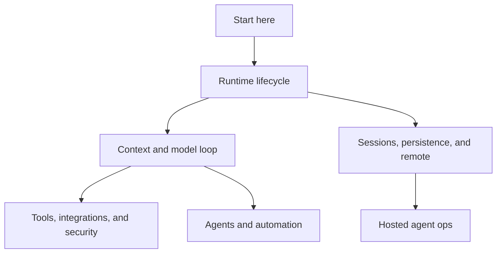

# Start here

Start here when you need the fastest coherent reverse-engineered mental model of how Claude Code works. This chapter answers three questions before sending readers into deep source-anchored pages:

1. What artifact was analyzed?
2. What major runtime capabilities does it contain?
3. Which path should I follow for a specific investigation?

The primary readable artifact is `claude-code-pkg/src/entrypoints/cli.js`. It is a bundled/minified production file, so this wiki uses stable semantic aliases in prose and keeps minified names only as searchable anchors for this exact build.

## Source-anchor policy

This page is an orientation document. Concrete anchors live in the linked pages.

| Semantic alias | Minified anchor | Scope |
|---|---|---|
| Start page | N/A — navigation page | Establishes the first reading path and the wiki's conceptual map. |
| Glossary and aliases | See [`glossary-and-aliases.md`](glossary-and-aliases.md) | Defines recurring semantic aliases, minified-symbol search handles, and terminology. |
| Bundle identity | See [`what-is-cli-js.md`](what-is-cli-js.md) | Explains package, Bun graph, `cli.renamed.js`, bytecode, and native-module boundaries. |
| Runtime capability map | See [`main-feature-map.md`](main-feature-map.md) | Maps the major systems implemented by the extracted runtime. |
| System architecture | See [`system-architecture.md`](system-architecture.md) | Synthesizes module boundaries, data/control flows, integration seams, and runtime state relationships. |
| Communication protocols | See [`runtime-communication-protocols.md`](runtime-communication-protocols.md) | Distinguishes in-process calls from MCP JSON-RPC, task/agent tools, bridge frames, Remote Control, and provider streaming. |

## First reading path

| Step | Read | Why |
|---:|---|---|
| 1 | [`cli.renamed.js` overview](what-is-cli-js.md) | Defines what the artifact is and what it is not. |
| 2 | [Glossary and aliases](glossary-and-aliases.md) | Defines the semantic aliases and minified-anchor terms used throughout the wiki. |
| 3 | [Main feature map](main-feature-map.md) | Shows how CLI modes, context, tools, sessions, remote control, agents, and ops connect. |
| 4 | [System architecture](system-architecture.md) | Explains module boundaries, data/control flows, integration seams, and runtime state relationships. |
| 5 | [Runtime communication protocols](runtime-communication-protocols.md) | Explains which boundaries use function calls, JSON-RPC, JSON envelopes, WebSocket/SSE, or HTTP streaming. |
| 6 | [CLI main paths](../01-runtime-lifecycle/cli-main-paths.md) | Explains bootstrap, argv routing, headless mode, interactive mode, resume, MCP, and subcommands. |
| 7 | [Session resume and transcripts](../04-sessions-persistence-remote/session-resume-and-transcripts.md) | Shows how durable JSONL sessions, resume/continue, fork, rewind, and transcript roots fit into the runtime. |

## Choose your route

| Question | Go to |
|---|---|
| What do the wiki's semantic aliases and minified anchors mean? | [Glossary and aliases](glossary-and-aliases.md) |
| How does the binary/package start and select a mode? | [Runtime lifecycle](../01-runtime-lifecycle/README.md) |
| What becomes model-visible context? | [Context and model loop](../02-context-model-loop/README.md) |
| How are context compaction, checkpoints, and rewind managed? | [Context, memory, compaction, checkpoints, and rewind](../02-context-model-loop/context-memory-compaction-checkpoints.md) |
| How are models selected and usage/quota/billing handled? | [Model selection, calls, usage, quota, and billing](../02-context-model-loop/model-selection-usage-quota-billing.md) |
| Which tools, integrations, and permission boundaries exist? | [Tools, integrations, and security](../03-tools-integrations-security/README.md) |
| Where do sessions, transcripts, resume, and remote control live? | [Sessions, persistence, and remote](../04-sessions-persistence-remote/README.md) |
| Which operational contracts cover logs, telemetry, updates, diagnostics, and native media modules? | [Hosted agent ops](../05-hosted-agent-ops/README.md) |
| How are agents, subagents, tasks, and automation surfaced? | [Agents and automation](../06-agents-automation/README.md) |

## Internals map

## Reading strategy

- Use section README pages as narrative guides.
- Use implementation pages when you need exact strings, byte offsets, env vars, command flags, or call paths.
- Treat the JavaScriptCore `.jsc` dump as low-level corroboration, not recovered source.
- For `cli.renamed.js`, prefer exact strings plus byte offsets over minified symbol names alone.

## Navigation

- [Wiki home](../README.md)
- [Full table of contents](../SUMMARY.md)
