# Main feature map for Claude Code

This document continues the reverse-engineering analysis of Claude Code. Its goal is to answer a product/runtime question: **what major capabilities are implemented by `cli.renamed.js`, and how do those capabilities connect?**

The file is bundled/minified production JavaScript. The document therefore uses semantic aliases such as `OuterBootstrap`, `CommanderRoot`, `HeadlessRunner`, `InteractiveSessionLoop`, `McpCoordinator`, `SessionRestorer`, and `RemoteControlBridge`. Minified names are kept only as search anchors for this exact `@anthropic-ai/claude-code@2.1.143` build.

## Executive summary

`cli.renamed.js` is not a thin prompt wrapper. It is the main Claude Code agent runtime. It parses the command line, establishes process identity, loads settings and managed policy, initializes authentication and model/provider state, manages sessions, assembles tools, applies permissions, loads MCP servers and plugins, orchestrates custom agents and background agents, routes execution into interactive/headless/remote modes, and handles observability, updates, and shutdown.

Two useful lenses for the runtime are **context engineering** and **harness engineering**:

- **Context engineering** decides what the model can see: system prompts, `CLAUDE.md`, settings, output styles, tools, agents, MCP prompts/resources, memories, file inputs, and session history.
- **Harness engineering** decides how the model is embedded in a usable coding-agent runtime: modes, sessions, tools, permissions, hooks, streaming, retries, remote control, telemetry, and update behavior.

## Source anchors

| Area | Semantic alias | Minified anchor / exact string | Role |
| --- | --- | --- | --- |
| Bootstrap | `OuterBootstrap` | `async function J9A` | Handles version fast path and lazy-loads the main bundle. |
| Full main | `TopLevelMain` | `async function O4A` | Initializes environment identity, deep links, warnings, and calls `w4A`. |
| Commander | `CommanderRoot` | `async function w4A` | Builds root options, action body, preAction setup, and subcommands. |
| Headless | `HeadlessRunner` | `async function runHeadless`, `function runHeadlessStreamingForTesting` | Runs print/SDK stream-JSON mode and drains control/message loops. |
| Interactive | `InteractiveSessionLoop` | `async function pT$`, `async function aa4` | Runs the TUI/session loop and resume/search picker. |
| MCP | `McpCoordinator` | `function fH9`, `function rR4` | Connects runtime MCP servers and registers the `mcp` command tree. |
| Sessions | `SessionRestorer` | `async function loadConversationForResume`, `async function OG8` | Finds recent sessions and restores transcript state. |
| Tools | `BuiltInToolNames` | `Bash`, `Read`, `Edit`, `Write`, `Glob`, `Grep`, `WebFetch`, `WebSearch`, `TodoWrite`, `Skill` | Built-in tool-name constants and model-visible capability names. |
| Hooks | `HookEvents` | `PreToolUse`, `PostToolUse`, `SessionStart`, `SessionEnd`, `SubagentStart`, `TaskCreated` | Lifecycle hook and automation event surface. |
| Ops | `TrafficAndDebugGates` | `CLAUDE_CODE_DISABLE_NONESSENTIAL_TRAFFIC`, `CLAUDE_CODE_DEBUG_LOGS_DIR` | Debug-log and telemetry/traffic policy boundaries. |

## Runtime system map

```mermaid
flowchart TB
    Cli[cli.js bundled runtime] --> Bootstrap[Bootstrap and command surface]
    Cli --> Modes[Runtime modes]
    Cli --> Context[Context and model loop]
    Cli --> Tools[Tools and permissions]
    Cli --> Sessions[Sessions and persistence]
    Cli --> Integrations[MCP / plugins / IDE / Chrome]
    Cli --> Agents[Agents and automation]
    Cli --> Ops[Diagnostics / telemetry / update]

    Bootstrap --> Commands[auth / mcp / plugin / project / agents / doctor / update / install]

    Modes --> TUI[Interactive TUI]
    Modes --> Headless[Print / SDK stream JSON]
    Modes --> Remote[Remote / teleport / Remote Control]

    Context --> Prompt[CLAUDE.md / settings / system prompt / output styles]
    Context --> Models[Auth / models / providers]
    Context --> Stream[Provider request and streaming response]

    Tools --> Builtins[Built-in coding tools]
    Tools --> Policy[Allow/deny / permission mode / hooks]
    Tools --> External[MCP tools / plugins / browser / IDE]

    Sessions --> Jsonl[local-jsonl transcripts]
    Sessions --> Resume[resume / continue / fork / rewind]
    Sessions --> Bridge[remote session ingress]

    Agents --> Custom[custom agents]
    Agents --> Task[Task and background agent commands]
    Agents --> Review[ultrareview / auto-mode]
```

## Major feature matrix

| Feature area | Entry point or trigger | Main capabilities | Primary docs |
|---|---|---|---|
| Package/Bun startup | Native Bun standalone executable, `.bun` graph entrypoint | Loads `cli.renamed.js`, pairs it with `.jsc`, embeds image/audio N-API modules. | [Package and Bun bootstrap](../01-runtime-lifecycle/package-and-bun-bootstrap.md) |
| CLI command shell | `claude`, root flags, subcommands | Version, root mode dispatch, `auth`, `mcp`, `plugin`, `project`, `agents`, `doctor`, `update`, `install`. | [Commands and flags](../01-runtime-lifecycle/commands-and-flags.md) |
| Interactive mode | Default TTY run | Setup/login/trust screens, TUI root, resume picker, tools/agents/MCP load, and the interactive session loop. | [CLI main paths](../01-runtime-lifecycle/cli-main-paths.md) |
| Headless/SDK mode | `-p`, `--print`, `--sdk-url`, non-TTY stdout, `--init-only` | Prompt/stdin ingestion, stream-JSON input/output, permission/control frames, JSON/text result output. | [Headless streaming and resilience](../02-context-model-loop/headless-streaming-and-resilience.md) |
| Prompt/context | `CLAUDE.md`, `.claude/settings.json`, `--system-prompt`, `--append-system-prompt`, `--add-dir`, output styles | Runtime instruction sources, memory files, dynamic system prompt sections, slash-command/skill/agent context. | [Prompt, context, and memory](../02-context-model-loop/prompt-context-memory.md) |
| Models/auth/providers | `ANTHROPIC_API_KEY`, `ANTHROPIC_AUTH_TOKEN`, OAuth token FDs, provider env vars, `--model` | First-party/OAuth/API key auth, Bedrock/Vertex/Foundry/Anthropic AWS/Mantle provider selection, model aliases, thinking/budget flags. | [Models, providers, and auth](../02-context-model-loop/models-providers-auth.md) |
| Built-in tools and permissions | Tool constants plus `--tools`, `--allowedTools`, `--disallowedTools`, `--permission-mode` | File, shell, notebook, web, todo, skill, and task tools gated by filters, deny/allow rules, hooks, and permission modes. | [Built-in tools and permissions](../03-tools-integrations-security/built-in-tools-and-permissions.md) |
| MCP/plugins/hooks | `mcp`, `plugin`, `--mcp-config`, `--plugin-dir`, hooks events | MCP config/transport/lifecycle, plugin marketplaces/session plugins, hook events and command/HTTP hook policy. | [MCP, plugins, and hooks](../03-tools-integrations-security/mcp-plugins-hooks.md) |
| Settings/policy/integrations | `.claude/settings.json`, managed settings, `--settings`, `--ide`, `--chrome`, `statusLine` | Layered settings, config roots, policy toggles, IDE/Chrome/file integration, API-key helper scripts. | [Settings, policy, and integrations](../03-tools-integrations-security/settings-policy-and-integrations.md) |
| Sessions and transcripts | `--continue`, `--resume`, `--session-id`, JSONL paths | Local transcript roots, latest-session lookup, resume/continue, fork, no-persistence, rewind. | [Session resume and transcripts](../04-sessions-persistence-remote/session-resume-and-transcripts.md) |
| Remote/teleport/control | `--remote`, `--teleport`, `remote-control`, `--rc`, remote token env vars | Remote session creation/attach, teleport hydration, Remote Control bridge, permission forwarding. | [Remote control and teleport](../04-sessions-persistence-remote/remote-control-and-teleport.md) |
| Agents and automation | `agents`, `--agents`, task tool constants, subagent hook events, `ultrareview`, `auto-mode` | Background agents, custom agent JSON, task/subagent lifecycle, multi-agent review, permission classifier inspection. | [Agents, tasks, and subagents](../06-agents-automation/agents-tasks-and-subagents.md) |
| Diagnostics/ops/media | `--debug-file`, `doctor`, `update`, telemetry env vars, image/audio N-API modules | Debug logs, telemetry and traffic gates, native updater, doctor checks, media module extraction. | [Diagnostics and debug logs](../05-hosted-agent-ops/diagnostics-and-debug-logs.md), [Telemetry and tracing](../05-hosted-agent-ops/telemetry-and-tracing.md), [Updater and doctor](../05-hosted-agent-ops/updater-and-doctor.md), [Media native modules](../05-hosted-agent-ops/media-native-modules.md) |

## Takeaways

The main capabilities in `cli.renamed.js` can be summarized as: **bootstrap, modes, context, models, tools, integrations, sessions, remote control, agents, and operations**.

More concretely:

1. `OuterBootstrap`, `TopLevelMain`, and `CommanderRoot` form the startup and command-routing spine.
2. `HeadlessRunner`/`HeadlessControlLoop` and `InteractiveSessionLoop`/`InteractiveResumePicker` are the two main execution spines: headless/SDK and interactive TUI.
3. `McpCoordinator`, `McpCommandRegistrar`, and `PluginCommandRegistrar` show that MCP and plugins are first-class integration systems, not afterthoughts.
4. Tool-name constants and permission flags show a guarded action runtime around file, shell, notebook, web, todo, skill, and task capabilities.
5. `SessionDiscovery`, `SessionRestore`, JSONL transcript roots, remote tokens, bridge code, and teleport helpers show that durable sessions and remote handoff are core runtime modules.
6. Debug/telemetry/update constants and embedded image/audio N-API modules round out the operational and media-support layer.

Use this document as the map; use the linked implementation pages for source anchors and edge cases.
