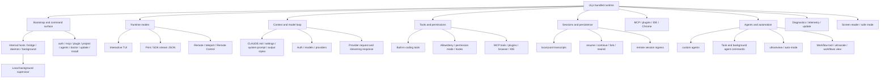

# Main feature map for Claude Code

This document continues the reverse-engineering analysis of Claude Code. Its goal is to answer a product/runtime question: **what major capabilities are implemented by `cli.renamed.js`, and how do those capabilities connect?**

The file is bundled/minified production JavaScript. The document therefore uses semantic aliases such as `OuterBootstrap`, `CommanderRoot`, `HeadlessRunner`, `InteractiveSessionLoop`, `McpCoordinator`, `SessionRestorer`, and `RemoteControlBridge`. Minified names are secondary search handles; exact strings below anchor this `@anthropic-ai/claude-code@2.1.215` build.

## Executive summary

`cli.renamed.js` is not a thin prompt wrapper. It is the main Claude Code agent runtime. Its outer `ZIS()` router selects version output, internal hosts/helpers, bridge, daemon/background, fleet, or normal CLI startup; the normal `UkS()` → `jkS()` path then parses the command surface and composes interactive/headless/remote sessions. The bundle also loads settings and managed policy, initializes authentication and model/provider state, manages sessions, assembles tools, applies permissions, loads MCP servers and plugins, orchestrates custom and background agents, and handles accessibility, observability, updates, and coordinated shutdown.

The `2.1.215` snapshot adds several source-confirmed surfaces that were absent from the previous `2.1.143` documentation baseline: Sonnet 5, Opus 4.8, and Fable 5 model records; the `Workflow` tool and `/workflows` UI; background-by-default and nested subagents; experimental observer agents; the gated `EndConversation` lifecycle; an implicit team model; `/fork` background copies plus `/subtask`; session-bound `Projects` knowledge, `Artifact` publishing, and Claude Design/design-system sync; screen-reader and safe modes; MCP tool refresh/auto-backgrounding; richer hooks and telemetry; and hard per-session WebSearch/subagent budgets. The second-round audit also promotes two substantial older-but-underdocumented subsystems—macOS computer-use MCP and `/team-onboarding` guide sharing—without misclassifying them as new package deltas.

Two useful lenses for the runtime are **context engineering** and **harness engineering**:

- **Context engineering** decides what the model can see: system prompts, `CLAUDE.md`, settings, output styles, tools, agents, MCP prompts/resources, memories, file inputs, and session history.
- **Harness engineering** decides how the model is embedded in a usable coding-agent runtime: modes, sessions, tools, permissions, hooks, streaming, retries, remote control, telemetry, and update behavior.

## Source anchors

| Area | Semantic alias | Minified anchor / exact string | Role |
| --- | --- | --- | --- |
| Build identity | `AnalyzedBuild` | `VERSION: "2.1.215"`, `BUILD_TIME: "2026-07-19T00:01:04Z"` | Pins every generated/minified anchor to one package build. |
| Bootstrap/Commander | `OuterBootstrap` / `CommanderRoot` | `ZIS()`, `UkS()`, `jkS()`, `Claude Code - starts an interactive session by default`, `--print` | Routes specialized processes before the normal main, then builds/parses the ordinary command surface. |
| Headless | `HeadlessRunner` | `--output-format=stream-json`, `control_request`, `prompt_suggestion` | Runs print/SDK stream-JSON mode and drains control/message loops. |
| Interactive/accessibility | `InteractiveSessionLoop` | `--ax-screen-reader`, `CLAUDE_AX_SCREEN_READER`, `/resume` | Runs the TUI/session loop, picker, and flat accessibility renderer. |
| Conversation termination | `EndConversationTool` | `EndConversation`, `ended-by-model`, `tengu_umber_kestrel` | Reflects twice, persists terminal state, aborts the turn, and blocks resumed work. |
| MCP | `McpCoordinator` | `tools/list`, `roots/list`, `notifications/roots/list_changed`, `keeping previous tools`, `RefreshMcpTools` | Connects MCP servers, publishes roots, and preserves last-good capability fields when a list-change refresh fails. |
| Background daemon | `DaemonSupervisor` | `krm()`, `BG_PROTO = 1`, `controlRequest`, `lease` | Supervises background handles through a versioned/authenticated newline-delimited local control protocol and transient keep-alive leases. |
| Native computer control | `ComputerUseMcpServer` | `computer-use`, `request_access`, `computer-use.lock` | Controls approved macOS applications through a session-wired MCP and layered native policy. |
| Sessions | `SessionRestorer` | `transcriptSource:"local-jsonl"`, `--resume`, `--fork-session` | Finds recent sessions and restores or forks transcript state. |
| Tools/workflows | `BuiltInToolNames` | `Bash`, `Read`, `Edit`, `WebFetch`, `WebSearch`, `Agent`, `Workflow`, `RefreshMcpTools` | Core coding, delegation, orchestration, and integration capabilities. |
| Hosted knowledge | `ProjectsTool` | `CLAUDE_PROJECT_UUID`, `project_info`, `project_search`, `project_write` | Binds one session to one durable claude.ai Project knowledge container. |
| Hosted creation | `ArtifactTool`, `DesignTool`, `DesignSyncTool` | `Artifact`, `ClaudeDesign`, `DesignSync` | Publishes versioned pages and edits/synchronizes collaborative design projects under account/policy gates. |
| Hosted onboarding | `TeamOnboardingSkill`, `ShareOnboardingGuideTool` | `/team-onboarding`, `ONBOARDING.md`, `allow_team_onboarding` | Summarizes bounded local usage into a guide and optionally maintains an organization share link. |
| Observer automation | `ObserverPairingRegistry` | `observer`, `observer-ref`, `ObserverReport` | Auto-spawns read-only observers, resumes pairings, and delivers one-way advice. |
| Hooks | `HookEvents` | `PreToolUse`, `PostToolBatch`, `MessageDisplay`, `SessionStart`, `TaskCreated` | Authorization, display, lifecycle, task, and automation event surface. |
| Ops/recovery | `TrafficAndDebugGates` | `CLAUDE_CODE_DISABLE_NONESSENTIAL_TRAFFIC`, `--safe-mode`, `CLAUDE_CODE_SAFE_MODE` | Debug/traffic policy plus configuration-isolation recovery. |

## Runtime system map

```mermaid
flowchart TB
    Cli[cli.js bundled runtime] --> Bootstrap[Bootstrap and command surface]
    Bootstrap --> Specialized[Internal hosts / bridge / daemon / background]
    Cli --> Modes[Runtime modes]
    Cli --> Context[Context and model loop]
    Cli --> Tools[Tools and permissions]
    Cli --> Sessions[Sessions and persistence]
    Cli --> Integrations[MCP / plugins / IDE / Chrome]
    Cli --> Agents[Agents and automation]
    Cli --> Ops[Diagnostics / telemetry / update]
    Cli --> Accessibility[Screen reader / safe mode]

    Bootstrap --> Commands[auth / mcp / plugin / project / agents / doctor / update / install]

    Modes --> TUI[Interactive TUI]
    Modes --> Headless[Print / SDK stream JSON]
    Modes --> Remote[Remote / teleport / Remote Control]

    Context --> Prompt[CLAUDE.md / settings / system prompt / output styles]
    Context --> Models[Auth / models / providers]
    Context --> Stream[Provider request and streaming response]

    Tools --> Builtins[Built-in coding tools]
    Tools --> Policy[Allow/deny / permission mode / hooks]
    Tools --> External[MCP tools / plugins / browser / IDE]

    Sessions --> Jsonl[local-jsonl transcripts]
    Sessions --> Resume[resume / continue / fork / rewind]
    Sessions --> Bridge[remote session ingress]

    Agents --> Custom[custom agents]
    Agents --> Task[Task and background agent commands]
    Agents --> Review[ultrareview / auto-mode]
    Agents --> Workflows[Workflow tool / ultracode / workflows view]
    Specialized --> Daemon[Local background supervisor]
```

## Major feature matrix

| Feature area | Entry point or trigger | Main capabilities | Primary docs |
|---|---|---|---|
| Package/Bun startup | Native Bun standalone artifact, `.bun` graph entrypoint | Extracted graph identifies the CLI entrypoint and embedded image/audio N-API modules; exact wrapper-to-native handoff is not retained in this checkout. | [Package and Bun bootstrap](../01-runtime-lifecycle/package-and-bun-bootstrap.md) |
| CLI command shell | `claude`, root flags, subcommands | Version, root mode dispatch, `auth`, `mcp`, `plugin`, `project`, `agents`, `doctor`, `update`, `install`. | [Commands and flags](../01-runtime-lifecycle/commands-and-flags.md) |
| Background supervisor | daemon/background routes, `claude agents`, leases/control socket | On-demand or gated service-origin supervisor, worker adoption, dispatch/attach/reply/kill, idle/takeover, and local protocol checks. | [Daemon and background service](../01-runtime-lifecycle/daemon-and-background-service.md) |
| Interactive mode | Default TTY run | Setup/login/trust screens, TUI root, resume picker, tools/agents/MCP load, and the interactive session loop. | [CLI main paths](../01-runtime-lifecycle/cli-main-paths.md) |
| Conversation termination | Gated `EndConversation` tool | Two-call reflection, durable `ended-by-model` marker, interactive blocking, headless shutdown, and `/clear` recovery. | [Conversation termination](../01-runtime-lifecycle/conversation-termination.md) |
| Headless/SDK mode | `-p`, `--print`, `--sdk-url`, non-TTY stdout, `--init-only` | Prompt/stdin ingestion, stream-JSON input/output, permission/control frames, JSON/text result output. | [Headless streaming and resilience](../02-context-model-loop/headless-streaming-and-resilience.md) |
| Prompt/context | `CLAUDE.md`, `.claude/settings.json`, `--system-prompt`, `--append-system-prompt`, `--add-dir`, output styles | Runtime instruction sources, memory files, dynamic system prompt sections, slash-command/skill/agent context. | [Prompt, context, and memory](../02-context-model-loop/prompt-context-memory.md) |
| Models/auth/providers | `ANTHROPIC_API_KEY`, `ANTHROPIC_AUTH_TOKEN`, OAuth token FDs, provider env vars, `--model` | First-party/OAuth/API key auth, Bedrock/Vertex/Foundry/Anthropic AWS/Mantle provider selection, model aliases, thinking/budget flags. | [Models, providers, and auth](../02-context-model-loop/models-providers-auth.md) |
| Built-in tools and permissions | Tool constants plus `--tools`, `--allowedTools`, `--disallowedTools`, `--permission-mode` | File, shell, notebook, web, todo, skill, and task tools gated by filters, deny/allow rules, hooks, and permission modes. | [Built-in tools and permissions](../03-tools-integrations-security/built-in-tools-and-permissions.md) |
| MCP/plugins/hooks/computer use | `mcp`, `plugin`, `--mcp-config`, `--plugin-dir`, `mcp__computer-use__*`, hooks events | MCP config/transport/readiness, hosted discovery, plugin marketplaces/session plugins, hook policy, and macOS application control. | [MCP, plugins, and hooks](../03-tools-integrations-security/mcp-plugins-hooks.md), [Computer-use MCP](../03-tools-integrations-security/computer-use-mcp.md) |
| Settings/policy/integrations | `.claude/settings.json`, managed settings, `--settings`, `--ide`, `--chrome`, `statusLine` | Layered settings, config roots, policy toggles, IDE/Chrome/file integration, API-key helper scripts. | [Settings, policy, and integrations](../03-tools-integrations-security/settings-policy-and-integrations.md) |
| Sessions and transcripts | `--continue`, `--resume`, `--session-id`, JSONL paths | Local transcript roots, latest-session lookup, resume/continue, fork, no-persistence, rewind. | [Session resume and transcripts](../04-sessions-persistence-remote/session-resume-and-transcripts.md) |
| Remote/teleport/control | `--remote`, `--teleport`, `remote-control`, `--rc`, remote token env vars | Remote session creation/attach, teleport hydration, Remote Control bridge, permission forwarding. | [Remote control and teleport](../04-sessions-persistence-remote/remote-control-and-teleport.md) |
| Hosted projects/artifacts/design/onboarding | `CLAUDE_PROJECT_UUID`, `Projects`, `Artifact`, `ClaudeDesign`, `DesignSync`, `/team-onboarding` | Attached knowledge context and CRUD, versioned hosted pages, collaborative design, guarded design-system sync, and optional onboarding-guide sharing. | [Hosted Projects and knowledge](../04-sessions-persistence-remote/hosted-projects-and-knowledge.md), [Team onboarding and share flows](../04-sessions-persistence-remote/team-onboarding-and-share-flows.md), [Artifact publishing and live pages](../03-tools-integrations-security/artifact-publishing-and-live-pages.md), [Claude Design and design-system sync](../03-tools-integrations-security/claude-design-and-design-sync.md) |
| Agents and automation | `agents`, `--agents`, `Agent`, `observer`, `ObserverReport`, `/fork`, `/subtask`, `Workflow`, `ultrareview`, `auto-mode` | Background sessions, custom agents, background-by-default/nested subagents, experimental observers, implicit teams, deterministic workflows, and classifier inspection. | [Agents, tasks, and subagents](../06-agents-automation/agents-tasks-and-subagents.md), [Observer agents](../06-agents-automation/observer-agents.md), [Dynamic workflows](../06-agents-automation/dynamic-workflows.md) |
| Diagnostics/ops/media | `--debug-file`, `doctor`, `update`, telemetry env vars, image/audio N-API modules | Debug logs, telemetry and traffic gates, native updater, doctor checks, media module extraction. | [Diagnostics and debug logs](../05-hosted-agent-ops/diagnostics-and-debug-logs.md), [Telemetry and tracing](../05-hosted-agent-ops/telemetry-and-tracing.md), [Updater and doctor](../05-hosted-agent-ops/updater-and-doctor.md), [Media native modules](../05-hosted-agent-ops/media-native-modules.md) |

## Takeaways

The main capabilities in `cli.renamed.js` can be summarized as: **bootstrap, modes, context, models, tools, integrations, sessions, hosted collaboration, remote control, agents, and operations**.

More concretely:

1. `ZIS()`, `UkS()`, and `jkS()` form the startup spine: specialized process roles are selected before ordinary Commander parsing.
2. `HeadlessRunner`/`HeadlessControlLoop` and `InteractiveSessionLoop`/`InteractiveResumePicker` are the two main execution spines: headless/SDK and interactive TUI.
3. `McpCoordinator`, `McpCommandRegistrar`, and `PluginCommandRegistrar` show that MCP and plugins are first-class integration systems, not afterthoughts.
4. Tool-name constants and permission flags show a guarded action runtime around file, shell, notebook, web, todo, skill, and task capabilities.
5. `SessionDiscovery`, `SessionRestore`, JSONL transcript roots, `ended-by-model`, `observer-ref`, remote tokens, bridge code, and teleport helpers show that durable metadata and remote handoff are core runtime modules. `ended-by-model` is restored in both direct and picker resume paths; its marker write remains best-effort.
6. `ComputerUseMcpServer`, `TeamOnboardingSkill`, and hosted connector/plugin/skill discovery show that integrations can combine local runtime state with separately gated host/account services.
7. The daemon control socket, MCP refresh reducer, and team inbox show explicit trust/failure boundaries: sensitive daemon operations authenticate, failed MCP discovery retains last-good fields, and inbox-delivered permission-rule updates are dropped.
8. Debug/telemetry/update constants and embedded image/audio N-API modules round out the operational and media-support layer.

Use this document as the map; use the linked implementation pages for source anchors and edge cases.
