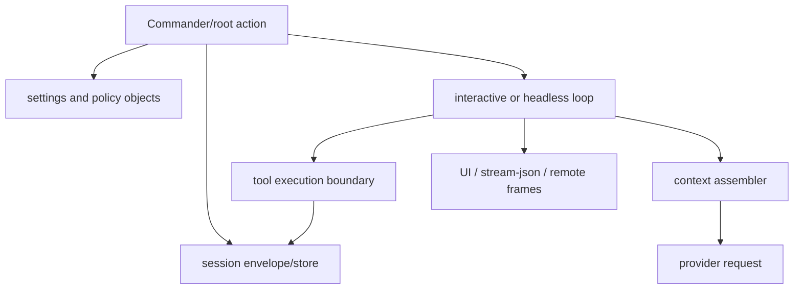
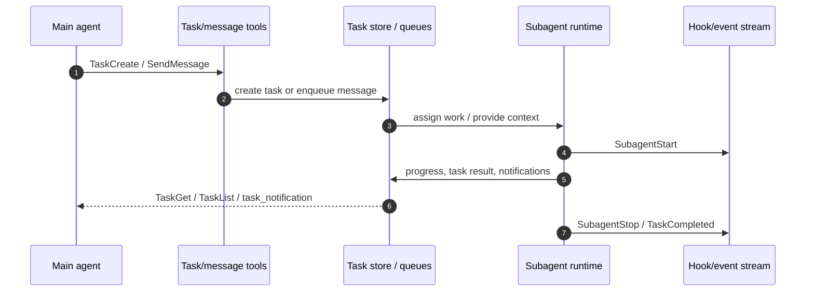

# Runtime communication protocols

This page uses the reverse-engineered `cli.renamed.js` bundle to answer the cross-cutting protocol question: **how do runtime modules communicate, how do agents/subagents coordinate, and how does Claude Code talk to remote servers or hosts?**

The short answer is that there is no single universal protocol. Inside the bundled runtime, most module boundaries are ordinary JavaScript calls, async queues, stores, and event emitters. Protocols appear at integration boundaries: MCP uses JSON-RPC-shaped messages, IDE/Chrome/Remote Control paths use JSON envelopes over WebSocket/SSE-like transports, task/subagent coordination uses built-in tools plus task-store events, and model/provider calls use HTTP(S) request/streaming responses.

## Source anchors

| Semantic alias | Anchor | Meaning |
| --- | --- | --- |
| BridgeToolCallFrame | `type:"tool_call"` | Chrome/IDE bridge sends JSON tool-call envelopes over a WebSocket-style bridge. |
| BridgePairingRequest | `type:"pairing_request"` | Bridge pairing and device selection use explicit JSON envelope types. |
| BridgePermissionRequest | `permission_request` | Bridge receives permission prompts as typed JSON messages. |
| BridgePermissionResponse | `permission_response` | Bridge sends permission decisions back as typed JSON messages. |
| McpResourcesListMethod | `resources/list` | MCP resources are represented as JSON-RPC method schemas. |
| McpPromptsGetMethod | `prompts/get` | MCP prompts use the same method-schema layer. |
| McpToolsListMethod | `tools/list` | MCP tools are listed through a JSON-RPC method. |
| TaskGetMethod | `method:"tasks/get"` | Task result/status protocol is method-based and JSON-RPC-shaped. |
| TaskCancelMethod | `method:"tasks/cancel"` | Task cancellation uses the same task method family. |
| ProviderRequestLog | `[API REQUEST]` | Provider/API request logging surface for outbound HTTP calls. |
| ProviderEventStreamDetection | `text/event-stream` | Streaming HTTP responses are detected as event streams. |
| ProviderRequestIdHeader | `x-client-request-id` | Provider/API requests carry request IDs through HTTP headers. |
| RemoteSessionTransport | `sendMessage`, `cancelRequest`, `disconnect`, `sendControlRequest` | Remote-session wrapper exposes a message/control transport API to the app. |
| TaskToolProtocolSurface | `TaskCreate`, `TaskGet`, `TaskList`, `TaskUpdate` | Agent/task coordination is surfaced as tool/action constants. |
| AgentPeerMessageAction | `SendMessage` | Peer/agent message sending is a first-class tool/action constant. |
| IdeBridgeTransports | `ws://`, `http://.../sse` | IDE integration accepts WebSocket or HTTP SSE endpoints. |
| ControlRequestFrame | `control_request` | Headless/SDK/Remote Control ask path is a typed control frame. |
| SandboxPermissionFrame | `sandbox_permission_request` | Sandbox network/file approvals are typed remote/control envelopes. |
| TeamPermissionUpdateFrame | `team_permission_update` | Team/agent coordination emits typed update envelopes. |
| PlanApprovalRequestFrame | `plan_approval_request` | Plan approval is another explicit control-envelope subtype. |
| WebSocketAuthFd | `CLAUDE_CODE_WEBSOCKET_AUTH_FILE_DESCRIPTOR` | Remote/bridge ingress can read WebSocket auth from an inherited file descriptor. |
| ExternalProtocolTransportLabels | `stdio, sse, http` | Transport labels for external protocol adapters. |
| RemoteSessionConfigInjection | `remoteSessionConfig` | Remote-session configuration is injected into the interactive app. |
| BridgeStateStreamFrame | `bridge_state` | Headless stream projects bridge state as a first-class frame. |

## Protocol matrix

| Boundary | Primary mechanism | Data shape | Notes |
|---|---|---|---|
| In-bundle modules | JavaScript calls, async functions, stores, event emitters, queues | Runtime objects | The bundled `cli.renamed.js` is one process and one large module graph; logical modules are semantic boundaries, not wire protocols. |
| Built-in tools | Tool definitions plus permission boundary | Tool-use input/output objects | Model tool calls become validated tool inputs, then cross the permission/execution boundary. |
| MCP servers | JSON-RPC 2.0-style requests, responses, notifications | `method`, `params`, `id`, `jsonrpc`, `result`/`error` | Confirmed by `tools/list`, `tools/call`, `prompts/list`, `prompts/get`, `resources/list`, task methods, and JSON-RPC error codes. |
| Agents/tasks/subagents | Built-in task/message tools, task store, hooks, typed notifications | Tool inputs plus task records/events | `TaskCreate`/`TaskGet`/`TaskList`/`TaskUpdate` and `SendMessage` are the model-facing protocol surface; hooks expose lifecycle events. |
| IDE bridge | WebSocket or HTTP SSE endpoint | JSON frames | Endpoint detection accepts `ws://...` and `http://.../sse`; bridge frames use explicit `type` fields. |
| Chrome/browser bridge | WebSocket-style bridge | JSON frames (`connect`, `tool_call`, `tool_result`, `permission_request`, `permission_response`, pairing messages) | The bridge has pairing, routing, tool call, result, permission, ping/pong, and device-selection messages. |
| SDK/headless output | Stream-JSON/event projection | Typed frames | `control_request`, `permission_denied`, `session_state_changed`, `transcript_mirror`, `bridge_state`, `task_notification`, and final `result` frames share a projection channel. |
| Remote Control / remote sessions | Remote message/control wrapper + bridge JSON envelopes | Message/control requests, permission responses, session config | `remoteSessionConfig`, `sendMessage`, `sendControlRequest`, token/env anchors, and permission envelopes show bidirectional control. |
| Provider/model API | HTTP(S) plus streaming responses | HTTP headers, JSON bodies, SSE/event-stream chunks | `text/event-stream`, `x-client-request-id`, and API request logging confirm streaming HTTP boundaries; Bedrock can use Amazon event streams. |

## In-process module communication

Most named modules in the wiki — runtime lifecycle, context assembler, tool boundary, session store, agents, ops — are logical seams inside one bundled artifact. Their communication is direct and object-based:

This matters because a string such as `TaskCreate` or `control_request` is not evidence of a separate daemon by itself. It becomes a protocol only when it crosses an external boundary or is serialized into the headless/bridge stream.

## MCP protocol boundary

MCP is the clearest protocol layer in the bundle. The source schemas include JSON-RPC error codes and method names such as:

- `tools/list`, `tools/call`
- `prompts/list`, `prompts/get`
- `resources/list`, `resources/read`, `resources/templates/list`
- `tasks/get`, `tasks/list`, `tasks/result`, `tasks/cancel`
- cancellation notifications such as `notifications/cancelled`

The runtime therefore treats MCP as a method-oriented request/response/notification protocol. Transports can vary — the bundle contains references to `stdio`, `sse`, and `http` — but the semantic layer remains JSON-RPC-shaped.

## Agent and subagent communication

Agents do not appear to use a separate free-form chat protocol between each other. The visible coordination surface is composed from:

1. **Tools/actions**: `SendMessage`, `TaskCreate`, `TaskGet`, `TaskList`, `TaskUpdate`.
2. **Task store methods**: `tasks/get`, `tasks/result`, `tasks/list`, `tasks/cancel`.
3. **Hooks and events**: `SubagentStart`, `SubagentStop`, `TaskCreated`, `TaskCompleted`, `TeammateIdle`.
4. **Team/permission envelopes**: `team_permission_update`, plan-approval frames, and mailbox/team-context system reminders.

The implication is that “agent-to-agent communication” is tool/state/event mediated. A subagent is not just a peer socket; it is a runtime context with transcript-backed state, task metadata, and hook-visible lifecycle.

## Remote, bridge, and provider communication

Remote/server communication splits into several channels:

### Provider/model APIs

The model request path is HTTP(S)-based and can stream responses. Anchors include `[API REQUEST]`, `x-client-request-id`, `text/event-stream`, and `vnd.amazon.eventstream`. This supports the model/provider documentation: Anthropic-style streaming uses event-stream responses; Bedrock can expose Amazon event-stream content.

### IDE and browser bridges

IDE and Chrome/browser bridges use persistent transport and JSON frames:

- IDE endpoint discovery accepts `ws://` and HTTP `.../sse` URLs.
- Browser bridge frames include `tool_call`, `tool_result`, `permission_request`, `permission_response`, `pairing_request`, `pairing_response`, `ping`, and `pong`.
- Permission decisions are sent back with request IDs, so approvals are correlated with pending tool calls.

### Remote sessions and Remote Control

Remote sessions inject `remoteSessionConfig` into the interactive app. Remote Control/bridge paths expose functions with semantic names like `sendMessage`, `cancelRequest`, `disconnect`, and `sendControlRequest`, and they read auth/token material through anchors such as `CLAUDE_CODE_WEBSOCKET_AUTH_FILE_DESCRIPTOR` and `CLAUDE_CODE_SESSION_ACCESS_TOKEN`.

Remote Control is bidirectional: it can observe output frames, send permission responses, and issue control changes such as interrupt, model/thinking updates, mode changes, and plan approval responses.

## Caveats

- Bundled vendor libraries include gRPC/WebSocket/AWS Smithy/EventStream code. This page treats those as dependency support unless a string is connected to a Claude Code runtime path.
- Approximate line numbers shift easily because `cli.renamed.js` is bundled and has very long lines. Use exact strings plus byte offsets for lookup.
- Some schemas prove protocol shape; they do not prove which transport is selected for a particular user configuration.

## Related docs

- [Claude Code system architecture](system-architecture.md)
- [Headless streaming and resilience](../02-context-model-loop/headless-streaming-and-resilience.md)
- [MCP, plugins, and hooks](../03-tools-integrations-security/mcp-plugins-hooks.md)
- [Built-in tools and permissions](../03-tools-integrations-security/built-in-tools-and-permissions.md)
- [Remote control and teleport](../04-sessions-persistence-remote/remote-control-and-teleport.md)
- [Agents, tasks, and subagents](../06-agents-automation/agents-tasks-and-subagents.md)
