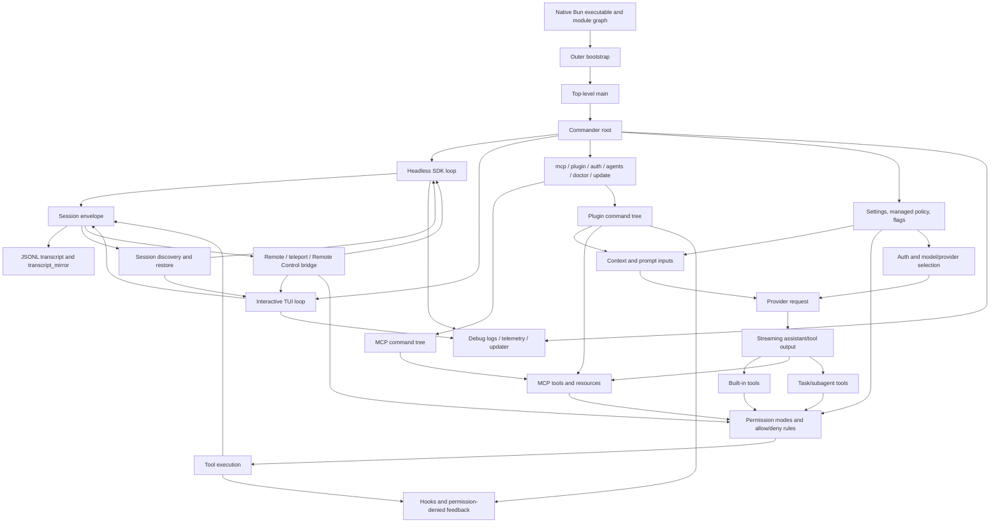
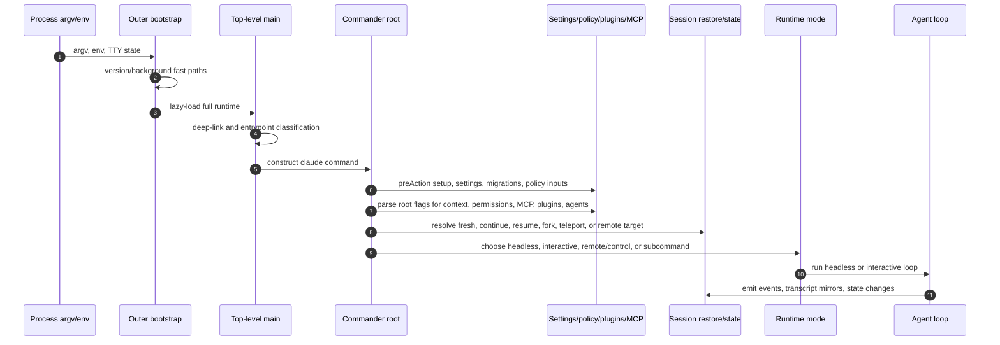
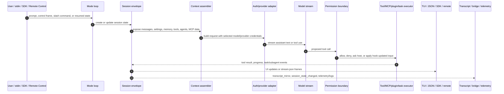

# Claude Code system architecture

This page answers the software-architecture question that sits between the high-level [main feature map](main-feature-map.md) and the focused implementation pages: **what does reverse engineering reveal about how the Claude Code runtime is decomposed, how its modules relate, and what data/control paths tie them together?**

The analysis is grounded in `claude-code-pkg/src/entrypoints/cli.js`. The file is bundled/minified production JavaScript, so names such as `Bootstrap`, `CommanderRoot`, `HeadlessLoop`, or `SessionRestorer` are stable semantic aliases; minified symbols are lookup anchors for this analyzed `@anthropic-ai/claude-code@2.1.143` build.

## Architecture thesis

`cli.renamed.js` is best understood as a **single-bundle agent runtime with layered boundaries**, not as a thin command wrapper around a model API.

The logical architecture has five cooperating planes:

| Plane | Responsibility | Main semantic anchors |
|---|---|---|
| Control plane | Process bootstrap, command parsing, mode routing, setup, and shutdown decisions. | `OuterBootstrap`, `TopLevelMain`, `CommanderRoot`, root `claude` command strings. |
| Execution plane | Runs either the headless/SDK stream loop or the interactive TUI/session loop. | `HeadlessRunner`, `HeadlessLoop`, `InteractiveSessionLoop`, `InteractiveResumePicker`. |
| Context/model plane | Turns settings, `CLAUDE.md`, prompt flags, tools, MCP, agents, memory, and provider config into model-visible requests. | `CLAUDE.md`, `--system-prompt`, `--append-system-prompt`, `outputStyles`, provider env gates. |
| Capability plane | Exposes built-in tools, MCP tools, plugins, hooks, skills, tasks, and permission mediation. | `BuiltInToolNames`, `TaskRuntime`, `ToolPermissionBoundary`, `HookEvents`, `McpCoordinator`, `McpCommand`, `PluginCommand`. |
| State and integration plane | Persists/resumes local transcripts, bridges remote/teleport/control sessions, and projects events to SDK/TUI/remote consumers. | `SessionDiscovery`, `SessionRestore`, `transcript_mirror`, `remoteSessionConfig`, `bridgeSessionId`, `permission_response`, `teleportWithProgress`. |

The design resembles the `copilot-cli-internals` documentation model in one important way: both systems separate **context engineering** from **harness engineering**. Claude Code's implementation is distinct in its concrete surfaces: `CLAUDE.md` memory, Anthropic/Bedrock/Vertex/Mantle provider gates, `claude` command routing, Claude Code remote/teleport/Remote Control, task/subagent tools, and Claude-specific traffic/debug policy strings are all visible directly in `cli.renamed.js`.

## Source anchors

| Area | Semantic alias | Minified anchor or exact string | Architectural meaning |
| --- | --- | --- | --- |
| Artifact identity | Embedded version metadata | `VERSION:"2.1.143"`, `BUILD_TIME:"2026-05-15T17:39:39Z"` | Confirms the analyzed runtime build. |
| Bootstrap | `OuterBootstrap` | `async function J9A` | Performs fast version/background checks before loading the full runtime. |
| Main entry | `TopLevelMain` | `async function O4A` | Establishes process identity, deep-link handling, entrypoint classification, and the call into the command router. |
| Command router | `CommanderRoot` | `async function w4A`, `H.name("claude")` | Builds root options, pre-action setup, root action, and top-level commands. |
| Headless runner | `HeadlessRunner` | `async function runHeadless` | Validates print/SDK options and prepares the headless run. |
| Headless loop | `HeadlessLoop` | `function runHeadlessStreamingForTesting` | Multiplexes model output, control requests, MCP status, bridge state, task notifications, and final results. |
| Interactive loop | `InteractiveSessionLoop` | `async function pT$`, `async function aa4` | Runs the TUI/session loop and picker/search restore path. |
| Context sources | `ContextInputs` | `CLAUDE.md`, `.claude/settings.json`, `--system-prompt`, `--append-system-prompt`, `--exclude-dynamic-system-prompt-sections` | Confirms layered prompt/context inputs and stable-vs-dynamic prompt boundaries. |
| Provider/auth | `ProviderClassifier` | `ANTHROPIC_API_KEY`, `ANTHROPIC_AUTH_TOKEN`, `CLAUDE_CODE_USE_BEDROCK`, `CLAUDE_CODE_USE_VERTEX`, `CLAUDE_CODE_USE_MANTLE`, `CLAUDE_CODE_USE_ANTHROPIC_AWS` | Confirms credential and provider-routing surfaces. |
| Built-in tools | `BuiltInToolNames` | `Bash`, `Read`, `Edit`, `Write`, `WebFetch`, `WebSearch`, `TodoWrite`, `Skill` | Names the core model-visible tool capability set. |
| Permission boundary | `ToolPermissionBoundary` | `function U85`, `tengu_tool_use_can_use_tool_rejected`, `tengu_tool_use_can_use_tool_allowed` | Mediates tool execution through validation, permission decisions, telemetry, and denial feedback. |
| Host permission bridge | `CanUseToolBridge` | `createCanUseTool`, `can_use_tool`, `permission_response` | Shows ask/deny tool decisions crossing SDK/Remote Control boundaries. |
| Communication protocols | `RuntimeProtocolFamilies` | `tools/list`, `control_request`, `bridge_state`, `text/event-stream`, `SendMessage` | Distinguishes in-process calls from MCP JSON-RPC, bridge envelopes, provider streams, and task/message tools. |
| Sandbox boundary | `CommandSandbox` | `sandbox.enabled`, `wrapWithSandbox`, `bwrapPath`, `socatPath`, `/usr/bin/sandbox-exec` | Wraps approved shell commands with platform-specific filesystem/network isolation. |
| Hooks | `HookEvents` | `PreToolUse`, `PostToolUseFailure`, `SessionStart`, `SessionEnd`, `SubagentStart`, `TaskCreated` | Exposes lifecycle and authorization extension points. |
| MCP | `McpCoordinator` | `function fH9`, `MCP_CONNECTION_NONBLOCKING`, `tools/list`, `prompts/get` | Separates runtime MCP connection from protocol schemas and command management. |
| MCP command tree | `McpCommand` | `function rR4`, `H.command("mcp")` | User-facing MCP configuration and server command surface. |
| Plugins | `PluginCommand` | `function fC4`, `--plugin-dir`, `--plugin-url`, `outputStyles` | Plugin/session-extension input surfaces. |
| Session restore | `SessionRestorer` | `async function loadConversationForResume`, `async function OG8` | Loads resumable session state and applies it to the current runtime envelope. |
| Session events | `SessionProjection` | `transcriptPath`, `transcript_mirror`, `session_state_changed` | Shows transcript-backed state plus live SDK/headless projections. |
| Remote/teleport/control | `RemoteBridge` | `--remote`, `--teleport`, `--remote-control`, `remoteSessionConfig`, `teleportWithProgress`, `CLAUDE_CODE_SESSION_ACCESS_TOKEN` | Confirms local sessions can be bridged to remote, teleport, and control channels. |
| Agents/tasks | `TaskRuntime` | `TaskCreate`, `TaskGet`, `TaskList`, `TaskUpdate`, `SubagentStart`, `SubagentStop` | Confirms task/subagent orchestration as first-class runtime state. |
| Operations | `OpsPolicy` | `CLAUDE_CODE_DEBUG_LOGS_DIR`, `--debug-file`, `CLAUDE_CODE_DISABLE_NONESSENTIAL_TRAFFIC`, `H.command("doctor")`, `H.command("update")` | Debug, telemetry/traffic, updater, and health-check boundaries. |
| Voice/native audio | `VoiceDictation` | `audio-capture-napi loaded`, `/voice`, `Final transcript assembled`, `Injecting transcript` | Local microphone capture plus transcription stream feeding text back into prompt input. |

## Module dependency graph

The graph is intentionally logical rather than file-system based. In the extracted artifact these modules are bundled into one `cli.renamed.js`, but the anchors above show stable runtime seams.

## Startup and wiring sequence

Key ordering conclusions from `cli.renamed.js`:

1. `OuterBootstrap` exists so cheap paths such as `--version` can finish before importing the full main module.
2. `TopLevelMain` classifies process-level identity before the Commander root is built. Anchors such as `CLAUDE_CODE_ENTRYPOINT`, `GITHUB_ACTIONS`, `CLAUDE_CODE_SESSION_ACCESS_TOKEN`, and `CLAUDE_CODE_WEBSOCKET_AUTH_FILE_DESCRIPTOR` show that entrypoint identity affects downstream behavior.
3. `CommanderRoot` is the main architectural hub. It owns root options, pre-action setup, root-action mode routing, and subcommand registration.
4. The `-p`/`--print` path has a fast parse optimization that can skip heavier subcommand registration unless URI handling requires it. This makes headless automation a performance-sensitive first-class path.
5. Headless and interactive modes share settings, permission, provider, tool, MCP, agent, and session concepts, but use different projection loops: `HeadlessLoop` emits structured stream/control frames, while `InteractiveSessionLoop` mounts the terminal session loop.

## One turn through the system

Important consequences:

- **Context is layered.** `CLAUDE.md`, `.claude/settings.json`, prompt flags, output styles, custom agents, plugins, MCP resources/prompts, and tool metadata all feed the model-visible request, but not every source is present in every mode.
- **Tools are not direct function calls.** Tool use passes through schema validation, allow/deny rules, permission modes, `PreToolUse` hooks, SDK/Remote Control `can_use_tool` requests, denial frames, and tool-specific guards before execution.
- **Session state is both durable and live.** Transcript paths and resume helpers restore durable state, while `transcript_mirror`, `session_state_changed`, `bridge_state`, `permission_response`, and task notifications project live state to headless/SDK/remote consumers.
- **Remote control is bidirectional.** Remote/SDK surfaces do not only observe output; they can supply permission responses, interrupts, model/thinking changes, and session-control messages back into the running loop.

## Module boundary matrix

| Module family | Owns | Consumes | Emits or hands off to | Primary docs |
|---|---|---|---|---|
| Bootstrap and command shell | Runtime identity, fast paths, root command, flags, subcommands, mode selection. | `argv`, env vars, TTY/stdin state, deep links. | Headless loop, interactive loop, utility subcommands, remote/control paths. | [CLI main paths](../01-runtime-lifecycle/cli-main-paths.md), [Commands and flags](../01-runtime-lifecycle/commands-and-flags.md) |
| Headless/SDK loop | Non-interactive validation, stream JSON I/O, control frames, result framing, scheduled prompt injections. | Prompt/stdin, SDK transport, session restore state, MCP status, permissions. | JSON/text/stream-json result, `control_request`, `permission_denied`, `transcript_mirror`, `bridge_state`. | [Headless streaming and resilience](../02-context-model-loop/headless-streaming-and-resilience.md) |
| Interactive TUI loop | Human-in-the-loop session UI, setup/trust/login screens, session picker, permission dialogs, slash commands. | TTY input, loaded settings, tools, MCP, plugins, agents, restored session state. | Terminal rendering, session events, tool requests, remote/bridge state. | [CLI main paths](../01-runtime-lifecycle/cli-main-paths.md), [Session resume and transcripts](../04-sessions-persistence-remote/session-resume-and-transcripts.md) |
| Context/model loop | Model-visible prompt/context assembly, context compaction, provider/model choice, and usage accounting. | Memory files, settings, prompt flags, tools, agents, MCP prompts/resources, auth env vars, usage/rate-limit headers. | Provider requests, streaming responses, context-budget warnings, compaction hooks, usage/cost/rate-limit frames. | [Prompt, context, and memory](../02-context-model-loop/prompt-context-memory.md), [Context, memory, compaction, checkpoints, and rewind](../02-context-model-loop/context-memory-compaction-checkpoints.md), [Models, providers, and auth](../02-context-model-loop/models-providers-auth.md), [Model selection, calls, usage, quota, and billing](../02-context-model-loop/model-selection-usage-quota-billing.md), [Prompt template catalog](../02-context-model-loop/prompt-template-catalog.md) |
| Tool and permission runtime | Built-in capabilities, execution checks, approval, hooks, denial feedback, read-before-write guards. | Model tool calls, allow/deny lists, permission mode, host responses, hook outputs. | Tool results, denial messages, telemetry, session events. | [Built-in tools and permissions](../03-tools-integrations-security/built-in-tools-and-permissions.md) |
| Command sandbox | Platform command isolation, network/filesystem policy, unsandboxed fallback/strict mode. | Approved Bash/PowerShell tool input, sandbox settings, managed policy, host permission responses. | Sandboxed command wrapper, sandbox violations, permission requests, TUI sandbox status. | [Sandbox and isolation](../03-tools-integrations-security/sandbox-and-isolation.md) |
| MCP/plugins/hooks | External tool/resource/prompt providers and extension payloads. | CLI flags, settings, plugin dirs/URLs, MCP config, claude.ai connector promise, hook definitions. | MCP tools/resources/prompts, plugin output styles/agents/skills/hooks, elicitation frames. | [MCP, plugins, and hooks](../03-tools-integrations-security/mcp-plugins-hooks.md) |
| Sessions and persistence | Session IDs, transcript paths, resume/fork/rewind state, transcript-derived runtime envelope. | CLI session flags, JSONL transcripts, bridge metadata, worktree/PR metadata, restored permission/model state. | Initial runtime state, transcript writes/mirrors, resume/fork handoff. | [Session resume and transcripts](../04-sessions-persistence-remote/session-resume-and-transcripts.md) |
| Remote/teleport/control | Remote session attach/create, teleport hydration, local-session bridge, control/permission routing. | Hidden root flags, session access tokens, bridge state, remote URLs/session IDs. | `remoteSessionConfig`, bridge events, permission responses, inbound prompts/control changes. | [Remote control and teleport](../04-sessions-persistence-remote/remote-control-and-teleport.md) |
| Runtime communication protocols | Protocol selection across module, tool, MCP, task, bridge, remote, and provider boundaries. | In-process calls, model/tool deltas, MCP configs, bridge endpoints, remote/session tokens, provider requests. | JSON-RPC methods, JSON envelopes, stream-JSON frames, HTTP/SSE/event-stream boundaries. | [Runtime communication protocols](runtime-communication-protocols.md) |
| Agents and automation | Custom agents, task tools, subagent lifecycle, background/scheduled work, hosted review entrypoints. | Agent JSON/frontmatter, tool availability, task store, cron/scheduler triggers, hosted preflight responses. | Task events, subagent transcripts, task notifications, model-visible task results. | [Agents, tasks, and subagents](../06-agents-automation/agents-tasks-and-subagents.md) |
| Diagnostics and operations | Debug logs, traffic policy, telemetry gates, updater/doctor commands, native support boundaries, voice dictation support. | Debug flags, env gates, runtime errors, updater state, hosted/remote policy, local audio capture. | Logs, telemetry, update results, support diagnostics, transcribed voice input. | [Diagnostics and debug logs](../05-hosted-agent-ops/diagnostics-and-debug-logs.md), [Telemetry and tracing](../05-hosted-agent-ops/telemetry-and-tracing.md), [Updater and doctor](../05-hosted-agent-ops/updater-and-doctor.md), [Media native modules](../05-hosted-agent-ops/media-native-modules.md), [Audio capture and voice mode](../05-hosted-agent-ops/audio-capture-and-voice.md) |

## Integration seams

| Seam | How it enters | What it can affect | Source-confirmed boundary |
|---|---|---|---|
| CLI flags | Root options in `CommanderRoot` such as `--system-prompt`, `--mcp-config`, `--permission-mode`, `--agents`, `--resume`, `--remote`. | Mode routing, context, tools, permissions, sessions, remote state. | Root command option cluster around line ~19525 and command cluster around line ~19550. |
| Settings and managed policy | `.claude/settings.json`, `settings.local.json`, managed settings strings. | Memory loading, plugin trust, permission policy, Remote Control enablement, transcript retention. | Settings schema strings around line ~185 and path resolution around lines ~187/~791. |
| MCP | `claude mcp ...`, `--mcp-config`, `McpCoordinator`, MCP protocol schemas. | Tool/resource/prompt availability, elicitation, auth error handling, headless frames. | `McpCommand`, `McpCoordinator`, `tools/list`, `prompts/get`, `elicitation_complete`. |
| Plugins | `PluginCommand`, `--plugin-dir`, `--plugin-url`, plugin-provided output styles/agents/hooks/MCP. | Context, tools, MCP servers, slash commands, hooks, agents. | `PluginCommand`, `outputStyles`, `--plugin-dir`, `--plugin-url`. |
| Hooks | Lifecycle names such as `PreToolUse`, `PermissionDenied`, `SessionStart`, `SubagentStop`. | Authorization, input mutation, additional context, retry feedback, lifecycle automation. | Hook event arrays around lines ~185/~2004 and `ToolPermissionBoundary`. |
| SDK/Remote Control | Stream/control schemas, `createCanUseTool`, `permission_response`, bridge state. | Permission approvals, interrupts, model/thinking updates, remote session steering. | `createCanUseTool`, `permission_response`, `control_request`, `bridge_state`. |
| Provider environment | API keys, OAuth tokens, provider flags, model flags. | Credential selection, request routing, model aliases, fallback behavior. | `ANTHROPIC_API_KEY`, `ANTHROPIC_AUTH_TOKEN`, `CLAUDE_CODE_USE_*`, `--model`, `--fallback-model`. |
| Transcript/session files | Transcript path loaders, mirror frames, resume/fork flags. | Resume, continue, fork, rewind, subagent transcripts, session projection. | `SessionDiscovery`, `SessionRestore`, `transcriptPath`, `transcript_mirror`, `--fork-session`. |
| Context compaction and usage accounting | Auto/manual compaction, API response usage, rate-limit headers, headless result schemas. | Prompt-history size, cache behavior, run budget, SDK/headless visibility, billing guidance. | `autoCompactEnabled`, `PreCompact`, `PostCompact`, `modelUsage`, `anthropic-ratelimit-unified-*`, `error_max_budget_usd`. |

## Architecture questions answered

| Question | Answer from `cli.renamed.js` | Main anchor |
|---|---|---|
| What is the runtime entry spine? | `OuterBootstrap` performs outer bootstrap, `TopLevelMain` performs process-level setup, and `CommanderRoot` builds the `claude` command and dispatches runtime modes. | `OuterBootstrap`, `TopLevelMain`, `CommanderRoot`. |
| Is the CLI primarily interactive or scriptable? | Both are first-class. The default TTY path reaches `InteractiveSessionLoop`, while `-p`/`--print`, non-TTY stdout, `--init-only`, and SDK stream settings reach `HeadlessRunner`/`HeadlessLoop`. | `--print`, `HeadlessRunner`, `HeadlessLoop`, `InteractiveSessionLoop`. |
| Where is model-visible context assembled from? | Runtime context is layered from prompt flags, `CLAUDE.md`, settings, output styles, tools, MCP, plugins, skills, agents, and session history. | `CLAUDE.md`, `--system-prompt`, `outputStyles`, `Skill`, `TaskCreate`. |
| Can all system prompts be statically expanded? | Static prompt-like literals can be cataloged, but a fully expanded runtime prompt depends on concrete session state, MCP/plugins/agents, hooks, memory, tools, reminders, and provider/cache settings. | `__SYSTEM_PROMPT_DYNAMIC_BOUNDARY__`, `api_system`, `<system-reminder>`. |
| How are memory and context compressed? | Memory files are loaded/selected as context; conversation history is compressed through context compaction summaries, with `PreCompact`/`PostCompact` hooks and persisted context-collapse state. | `AutoMem`, `Select memories relevant to:`, `autoCompactEnabled`, `compact_summary`, `contextCollapseSnapshot`. |
| Where is provider routing decided? | Provider/auth surfaces are environment and flag driven, including Anthropic credentials plus Bedrock, Vertex, Mantle, Anthropic AWS, model, and fallback model switches. | `ANTHROPIC_API_KEY`, `ANTHROPIC_AUTH_TOKEN`, `CLAUDE_CODE_USE_BEDROCK`, `--model`. |
| How are models selected and accounted for? | CLI/env/settings/agent frontmatter set the main loop model; per-turn mode and context can adjust it; helper roles use Sonnet/small-fast/advisor/subagent/fallback models; usage/cost/rate-limit state is accumulated and emitted. | `hgK`, `nG`, `ANTHROPIC_SMALL_FAST_MODEL`, `advisorModel`, `modelUsage`, `rate_limit_event`. |
| What prevents tool calls from becoming direct unchecked execution? | Tool calls cross schema validation, permission mode/rules, `PreToolUse`, host `can_use_tool` asks, denial telemetry, and tool-specific guards before execution. | `ToolPermissionBoundary`, `createCanUseTool`, `PreToolUse`, `permission_response`. |
| Is there OS/process sandboxing? | Yes. Approved shell commands can be wrapped by a platform sandbox: Linux/WSL uses bubblewrap/seccomp/proxy bridging, macOS uses `sandbox-exec`, and strict/fallback behavior is settings/policy-controlled. | `sandbox.enabled`, `wrapWithSandbox`, `bwrapPath`, `socatPath`, `/usr/bin/sandbox-exec`. |
| Are MCP and plugins peripheral? | No. They are command/config surfaces and runtime capability providers that can affect tools, prompts/resources, output styles, hooks, and agents. | `McpCommand`, `McpCoordinator`, `PluginCommand`, `tools/list`, `prompts/get`. |
| Which protocols connect modules, agents, and remote servers? | In-bundle modules use object/function calls; MCP uses JSON-RPC-shaped methods; agents use task/message tools and hooks; IDE/Chrome/Remote Control use typed JSON envelopes over WebSocket/SSE-like transports; provider calls are HTTP(S) streams. | `tools/list`, `SendMessage`, `control_request`, `bridge_state`, `text/event-stream`. |
| Is resume only chat-message replay? | No. `SessionDiscovery` and `SessionRestore` handle messages plus transcript paths, bridge sequence, permission mode, model state, worktree/PR metadata, fork behavior, and interruption/deferred-tool state. | `SessionDiscovery`, `SessionRestore`, `bridgeSessionId`, `bridgeLastSeq`. |
| How does remote operation relate to local sessions? | Remote, teleport, and Remote Control feed configuration and bridge state back into the same interactive/headless session loops, including permission-response routing. | `--remote`, `--teleport`, `remoteSessionConfig`, `teleportWithProgress`, `permission_response`. |
| How are subagents/tasks represented architecturally? | Tasks are tool-visible shared state with lifecycle hooks and optional background/scheduled execution; subagents have hook-visible start/stop metadata and transcript paths. | `TaskCreate`, `TaskGet`, `TaskUpdate`, `SubagentStart`, `SubagentStop`. |
| Does voice exist? | Yes. `/voice` enables local microphone dictation; capture uses native audio or OS recorder fallback, then a transcription stream injects text into the normal prompt path. | `audio-capture-napi loaded`, `Toggle voice mode`, `Final transcript assembled`, `Injecting transcript`. |
| Where do operational boundaries live? | Debug logging, traffic/telemetry gates, updater/doctor commands, and hosted/remote policy checks are embedded in the same runtime rather than a separate daemon-only layer. | `CLAUDE_CODE_DEBUG_LOGS_DIR`, `CLAUDE_CODE_DISABLE_NONESSENTIAL_TRAFFIC`, `H.command("doctor")`, `H.command("update")`. |

## Design implications

1. **The command router is the composition root.** Most modules are wired under `CommanderRoot` through flags, settings, pre-action setup, and root-action branching.
2. **Execution mode is a projection choice, not a completely separate product.** Headless and interactive paths project state differently, but share the same core ideas: session envelope, context assembly, provider selection, tools, permissions, MCP, plugins, agents, and persistence.
3. **Permissions are a runtime service boundary.** The model can request tools, but execution is mediated through hooks, host control requests, deny/allow telemetry, and tool-local guards.
4. **Sessions are the durable spine.** Transcripts and restore helpers carry far more than visible chat text; they connect model state, permission state, bridge state, worktree/PR metadata, deferred tools, and fork/rewind behavior.
5. **External integrations are capability injectors.** MCP, plugins, hooks, IDE/Chrome/file surfaces, SDK, and Remote Control are architectural seams that can add context, tools, lifecycle callbacks, or control messages.
6. **Operations are integrated into the runtime.** Debug logs, traffic policy, telemetry, updater health, hosted review preflight, and remote tokens are visible in `cli.renamed.js`, so operational concerns are not bolted on after the agent loop.

## Caveats

- This is an architecture synthesis of a bundled artifact, not recovered source-code package architecture.
- Approximate line numbers can shift; byte offsets plus exact strings are more stable for this extracted build.
- Some anchors are schema or settings surfaces. This page treats them as behavior only when they connect to root flags, runtime loops, permission boundaries, or existing focused source reads.
- Native `.node` media modules are part of the shipped payload, but their detailed behavior is outside `cli.renamed.js` and remains a binary reverse-engineering topic.

## Per-module architecture pages

For a deeper architecture-perspective treatment of each module — public interface, internal decomposition, design rationale, failure modes, and extension points — see the per-module architecture companions:

| Module | Companion page |
|---|---|
| Runtime lifecycle | [Runtime lifecycle architecture](../01-runtime-lifecycle/architecture.md) |
| Context and model loop | [Context and model loop architecture](../02-context-model-loop/architecture.md) |
| Tools, integrations, and security | [Tool runtime and security architecture](../03-tools-integrations-security/architecture.md) |
| Sessions, persistence, and remote | [Session and remote-control architecture](../04-sessions-persistence-remote/architecture.md) |
| Hosted agent ops | [Operations and native-support architecture](../05-hosted-agent-ops/architecture.md) |
| Agents and automation | [Agent and automation architecture](../06-agents-automation/architecture.md) |

## Related docs

- [Main feature map](main-feature-map.md)
- [Runtime communication protocols](runtime-communication-protocols.md)
- [CLI main paths](../01-runtime-lifecycle/cli-main-paths.md)
- [Prompt, context, and memory](../02-context-model-loop/prompt-context-memory.md)
- [Context, memory, compaction, checkpoints, and rewind](../02-context-model-loop/context-memory-compaction-checkpoints.md)
- [Model selection, calls, usage, quota, and billing](../02-context-model-loop/model-selection-usage-quota-billing.md)
- [Built-in tools and permissions](../03-tools-integrations-security/built-in-tools-and-permissions.md)
- [Sandbox and isolation](../03-tools-integrations-security/sandbox-and-isolation.md)
- [MCP, plugins, and hooks](../03-tools-integrations-security/mcp-plugins-hooks.md)
- [Session resume and transcripts](../04-sessions-persistence-remote/session-resume-and-transcripts.md)
- [Remote control and teleport](../04-sessions-persistence-remote/remote-control-and-teleport.md)
- [Agents, tasks, and subagents](../06-agents-automation/agents-tasks-and-subagents.md)
- [Audio capture and voice mode](../05-hosted-agent-ops/audio-capture-and-voice.md)