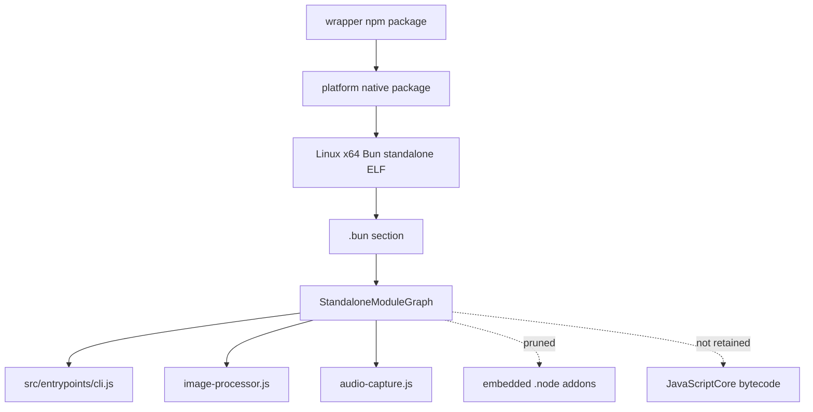

# What is the reverse-engineered `cli.js` artifact?

This page defines the artifact boundary for reverse-engineering how Claude Code works.

`cli.js` is the readable JavaScript entrypoint extracted from the Linux x64 Bun standalone package for `@anthropic-ai/claude-code@2.1.143`. It is not the original TypeScript source tree: it is bundled, minified, and paired with JavaScriptCore bytecode in the same Bun module graph.

For day-to-day reading, this repo publishes a derived view `claude-code-pkg/src/entrypoints/cli.renamed.js` produced by [`scripts/normalize-cli-js.mjs`](../../scripts/normalize-cli-js.mjs) and [`scripts/semantic-rename-cli.mjs`](../../scripts/semantic-rename-cli.mjs). It has identical runtime behavior to `cli.js` but with semantic identifier names recovered from export tables, runtime class names, dispatch handlers, string constants, and call-path property aliases. Source-anchor tables across this wiki reference the renamed view.

## Source anchors

| Semantic alias | Anchor | Meaning |
| --- | --- | --- |
| FinalArtifactExtractor | `TRAILER`, `MODULE_RECORD_SIZE`, `FINAL_ROOT_FILES` | Parses the Bun graph in memory and keeps only selected JS files. |
| BunEntrypointWrapper | `// @bun @bytecode @bun-cjs` | Bun CommonJS wrapper emitted for the entrypoint. |
| EmbeddedProductVersion | `VERSION:"2.1.143"` | Embedded product version used by version output and runtime metadata. |
| OuterBootstrap | `async function J9A` | Outer bootstrap function reached by the Bun standalone executable. |
| ImageProcessorShim | `require("/$bunfs/root/image-processor.node")` | Thin wrapper around an embedded N-API image module. |
| AudioCaptureShim | `require("/$bunfs/root/audio-capture.node")` | Thin wrapper around an embedded N-API audio module. |

## Artifact stack

The Bun payload contains five modules, but the final retained package keeps only the readable JavaScript files:

| Module | Role |
|---|---|
| `claude-code-pkg/src/entrypoints/cli.js` | The main bundled runtime: command parsing, TUI, headless runner, tools, sessions, MCP, plugins, agents, auth, models, telemetry, and updates. |
| `claude-code-pkg/image-processor.js` | CommonJS shim that refers to `/$bunfs/root/image-processor.node`; the native addon is not retained in this repo layout. |
| `claude-code-pkg/audio-capture.js` | CommonJS shim that refers to `/$bunfs/root/audio-capture.node`; the native addon is not retained in this repo layout. |

## What `cli.renamed.js` owns

Reverse-engineering `cli.renamed.js` shows it is the central agent runtime rather than a thin argument parser. Confirmed top-level ownership includes:

- Bun/bootstrap and product-version fast paths.
- Commander root command, root flags, and utility subcommands.
- Interactive TUI/session loop and resume picker.
- Print/headless runner, stream-JSON I/O, SDK transport, and control frames.
- Prompt/context inputs such as `CLAUDE.md`, settings, system-prompt flags, output styles, agents, skills, and MCP.
- Model/provider/auth selection across first-party, Bedrock, Vertex, Foundry, Anthropic AWS, Mantle, and API-key/OAuth paths.
- Built-in tools, permissions, hooks, MCP, plugins, IDE/Chrome integration, and settings policy.
- Local JSONL transcripts, resume/continue/fork/rewind, remote sessions, teleport, and Remote Control.
- Agents, subagents, task tools, background agents, `ultrareview`, and `auto-mode`.
- Diagnostics, debug logs, telemetry/traffic gates, native updater, and media native modules.

## What it is not

- It is not clean source with original module names.
- It is not sourcemap-backed; temporary Bun graph inspection found no serialized sourcemap payload for this build.
- JavaScriptCore cached bytecode can be dumped for instruction-level research, but bytecode dumps are no longer retained as final artifacts and do not recover the original JavaScript/TypeScript.
- Minified anchors behind aliases such as `TopLevelMain`, `CommanderRoot`, `HeadlessRunner`, and `InteractiveSessionLoop` are version-specific. Use them only with exact string/offset anchors.

## Related docs

- [Main feature map](main-feature-map.md)
- [Package and Bun bootstrap](../01-runtime-lifecycle/package-and-bun-bootstrap.md)
