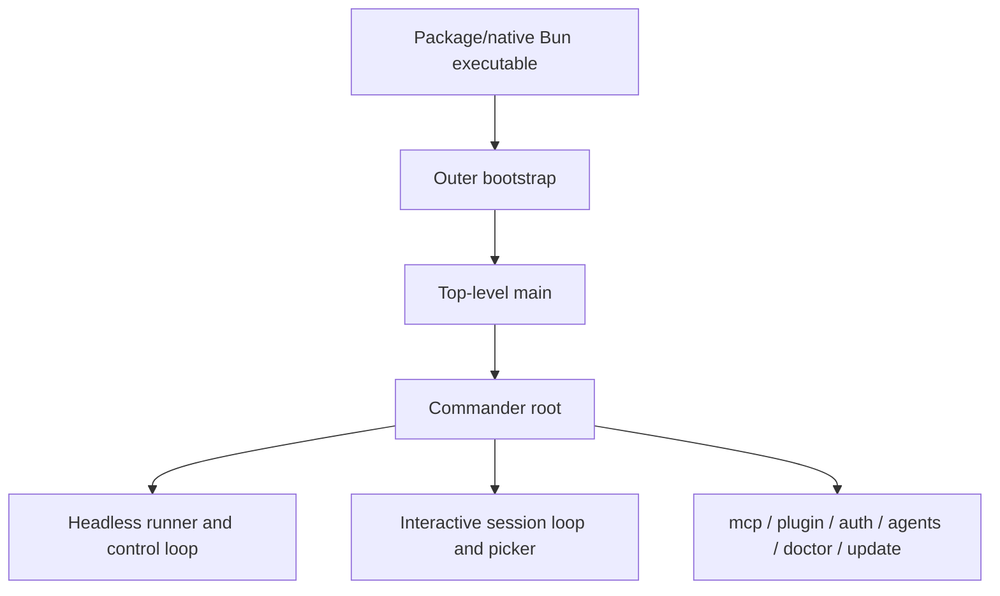

# Runtime lifecycle

This section reverse-engineers package/Bun startup, command-line routing, runtime mode selection, and high-level session entry paths to show how Claude Code reaches a live session.

## Source-anchor policy

This page is a section guide. Linked implementation pages carry concrete `cli.renamed.js` or Bun-graph anchors.

| Semantic alias | Minified anchor | Scope |
|---|---|---|
| Runtime lifecycle section | N/A — navigation page | Groups package bootstrap, root command routing, flags, subcommands, headless mode, and interactive mode. |
| Runtime implementation pages | See linked source-anchor tables | Concrete bundle anchors live in destination pages. |

## Runtime map

## Pages

| Order | Page | Runtime question answered |
|---:|---|---|
| 1 | [Package and Bun bootstrap](package-and-bun-bootstrap.md) | How does the npm/native/Bun module graph reach `cli.renamed.js`, and what else is embedded? |
| 2 | [CLI main paths](cli-main-paths.md) | How do outer bootstrap, top-level main, Commander root, headless, interactive, resume, remote, and MCP paths connect? |
| 3 | [Daemon and background service](daemon-and-background-service.md) | What does `claude daemon` supervise, how does service install/transient startup work, and how are locks/roster/reachability handled? |
| 4 | [Commands and flags](commands-and-flags.md) | Which root flags and top-level command families define the user-facing CLI surface? |
| 5 | [Command-line reference](command-line-reference.md) | Which source-visible flags, subcommands, aliases, and mode-specific CLI surfaces exist? |
| 6 | [Runtime lifecycle architecture](architecture.md) | How is bootstrap → main → Commander composed, what is the public interface, and what design decisions drive mode dispatch and shutdown? |

## Handoffs

- Prompt/context and model/provider state continue in [Context and model loop](../02-context-model-loop/README.md).
- Tool and permission boundaries continue in [Tools, integrations, and security](../03-tools-integrations-security/README.md).
- Resume, transcripts, remote, and Remote Control continue in [Sessions, persistence, and remote](../04-sessions-persistence-remote/README.md).

## Navigation

- [Start here](../00-start-here/README.md)
- [Full table of contents](../SUMMARY.md)
