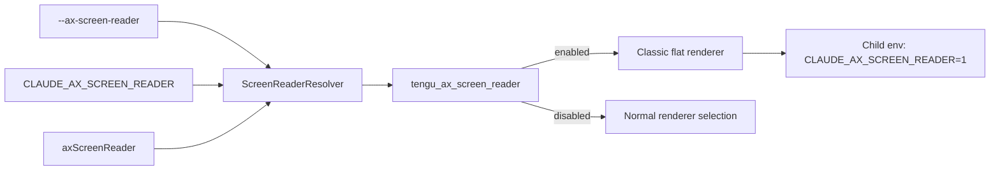

# Accessibility and screen-reader mode

Claude Code `2.1.215` adds a first-class terminal accessibility mode selected by `--ax-screen-reader`, `CLAUDE_AX_SCREEN_READER`, or the `axScreenReader` setting. The mode is more than a label: it changes renderer selection, animation behavior, terminal setup, startup output, and child-process environment propagation.

The exact `CLAUDE_AX_SCREEN_READER` and `axScreenReader` anchors are absent from the retained `2.1.143` parent bundle, so this page documents a package-delta subsystem rather than a renamed pre-existing path.

## Source anchors

| Semantic alias | Approximate location in `cli.renamed.js` | Exact string or symbol | Meaning |
|---|---:|---|---|
| ScreenReaderSetting | [~70,214](../../claude-code-pkg/src/entrypoints/cli.renamed.js#L70214) | `axScreenReader` | Persistent setting with the flat-text/no-decoration description. |
| ScreenReaderResolver | [~187,645-187,692](../../claude-code-pkg/src/entrypoints/cli.renamed.js#L187645) | `class $Bc`, `RM`, `NBc`, `vrt` | Resolves activation, reports its source, and propagates the mode to child environments. |
| ScreenReaderGate | [~187,658](../../claude-code-pkg/src/entrypoints/cli.renamed.js#L187658) | `tengu_ax_screen_reader` | Feature gate that can veto an otherwise requested mode. |
| RendererSelection | [~196,890-196,960](../../claude-code-pkg/src/entrypoints/cli.renamed.js#L196890) | `sr_auto_off` | Forces the classic/default renderer instead of fullscreen rendering. |
| TerminalSetupGuard | [~621,073-621,126](../../claude-code-pkg/src/entrypoints/cli.renamed.js#L621073) | `screen-reader mode leaves the audible bell setting unchanged` | Preserves an audible terminal cue during newline-key setup. |
| StartupAnnouncement | [~932,482](../../claude-code-pkg/src/entrypoints/cli.renamed.js#L932482) | `[Screen Reader Mode: on via ...]` | Announces activation on an interactive TTY. |
| RootFlag | [~958,910](../../claude-code-pkg/src/entrypoints/cli.renamed.js#L958910) | `--ax-screen-reader` | User-facing root CLI switch. |

## Activation and precedence

The resolver caches one decision per process and evaluates sources in this order:

1. `--ax-screen-reader` enables the mode.
2. `CLAUDE_AX_SCREEN_READER` supplies a tri-state environment override; an explicit false value can override the setting.
3. `axScreenReader: true` in merged settings enables the mode when neither higher-priority source decided it.
4. `tengu_ax_screen_reader` is evaluated last and can gate the requested mode off.

When enabled, the resolver remembers `flag`, `env`, or `settings` as the activation source. Interactive startup prints that source, while `vrt()` returns `CLAUDE_AX_SCREEN_READER=1` for covered child processes.

## Renderer behavior

| Runtime surface | Screen-reader behavior |
|---|---|
| Renderer selection | `Zi()` and `i7t()` return false; `N5e()` reports `sr_auto_off`. Fullscreen/flicker-free rendering is therefore not selected even if the `tui` setting requests it. |
| Presentation | The public setting/flag description promises flat text with no decorative borders or animations. The runtime also tells `/tui` users that screen-reader mode always uses the classic renderer. |
| Motion | Animated UI components consult the screen-reader state and settle immediately instead of continuing color/spinner animation. |
| Startup | Interactive TTY startup emits `[Screen Reader Mode: on via flag|env|settings]`, making an invisible mode change observable to assistive technology and debug logs. |
| Terminal key setup | The macOS newline-key setup skips changing the audible bell because the bell is useful feedback in this mode. |
| Fullscreen promotion | Fullscreen renderer upsell/downsell paths are suppressed while screen-reader mode is active. |

## What the mode does not change

Screen-reader mode is a rendering/accessibility selector, not a restricted execution mode. The source does not show it disabling model calls, tools, permissions, hooks, MCP, settings, or session persistence. Those boundaries continue to behave normally.

It is also distinct from `prefersReducedMotion`: reduced motion can stop animation without forcing the classic renderer, while screen-reader mode does both.

## Caveats

- The analyzed implementation is the terminal TUI path. It does not claim to configure OS accessibility APIs or desktop-app accessibility settings.
- The source promises flat text, no decorative borders, and no animations; it does **not** promise that every color escape is removed.
- Approximate line anchors are build-specific. Search for `CLAUDE_AX_SCREEN_READER`, `sr_auto_off`, and `tengu_ax_screen_reader` when analyzing a later package.

## Related docs

- [Command-line reference](command-line-reference.md)
- [CLI main paths](cli-main-paths.md)
- [Settings schema reference](../03-tools-integrations-security/settings-schema-reference.md)
- [Environment variables reference](../05-hosted-agent-ops/environment-variables-reference.md)
- [Safe mode and recovery](../05-hosted-agent-ops/safe-mode-and-recovery.md)
