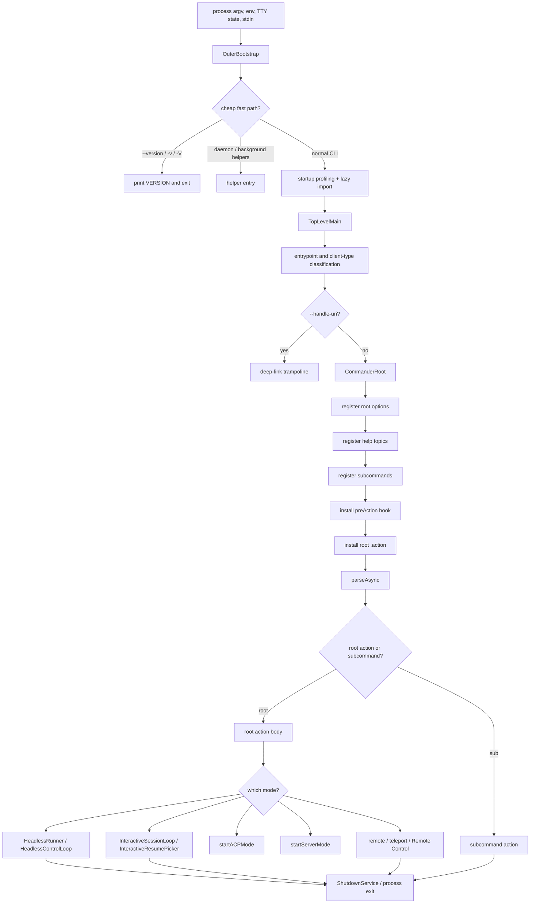

# Runtime lifecycle architecture

This page is the architecture analysis for the runtime-lifecycle module. It complements the implementation pages in this section by focusing on **module boundary, internal decomposition, public interface, and design rationale** rather than enumerating every source string.

Scope: what reverse engineering reveals about how the Claude Code runtime is assembled inside one Bun-standalone `cli.renamed.js`, how it routes a process invocation to a runtime mode, and how it cleans up on exit. Implementation specifics live in [Package and Bun bootstrap](package-and-bun-bootstrap.md), [CLI main paths](cli-main-paths.md), and [Commands and flags](commands-and-flags.md).

## Module purpose

The runtime-lifecycle module owns the **composition root** of the agent runtime. Once Bun executes `cli.renamed.js`, this module is responsible for:

1. Identifying the process (entrypoint kind, version, deep-link intent).
2. Building the `claude` command surface.
3. Resolving CLI/env/settings into a coherent runtime context.
4. Dispatching to exactly one runtime mode (headless, interactive, server, remote/control, or utility subcommand).
5. Coordinating shutdown.

No business logic lives here directly. The module's job is to wire the rest of the system together and hand control off.

## Architecture thesis

Runtime lifecycle is structured as a **three-stage funnel** with a single composition root:

`OuterBootstrap → TopLevelMain → CommanderRoot → runtime mode`

Each stage narrows responsibility: the outer bootstrap exists to make cheap paths cheap; the top-level main exists to fix process identity before any rich logic runs; the Commander root exists to be the single place where flags, settings, services, and modes meet.

## Source anchors

| Semantic alias | Anchor | Architectural meaning |
| --- | --- | --- |
| OuterBootstrap | `async function J9A` | Outer bootstrap stage; fast paths and lazy main import. |
| BootstrapToMainLazyEdge | `let{main:f}=await Promise.resolve().then(() => (p08(),zo6))` | The lazy boundary between bootstrap and main bundle. |
| MainBundleExportSurface | `var zo6={};j$(zo6,{startDeferredPrefetches:()=>startDeferredPrefetches,main:()=>O4A})` | Export surface of the main bundle (`main` and deferred prefetches). |
| TopLevelMainStartEvent | `L7("main_function_start")` | First instrumentation point inside `O4A`; marks the transition from bootstrap to main. |
| DeepLinkTrampolineCheck | `process.argv.indexOf("--handle-uri")` | Deep-link trampoline check before Commander setup. |
| CommanderRootStartEvent | `L7("run_function_start")` | First instrumentation point inside `w4A`; the Commander hub. |
| CommanderPreActionHook | `H.hook("preAction", async (A,z) => { ... })` | The pre-action hook that runs shared setup before any command action. |
| ClaudeCommandIdentity | `H.name("claude")` | The user-facing command identity. |
| HeadlessModePredicate | `-p, --print` | Mode predicate that drives the headless path. |
| ResumePickerInvocation | `await aa4(Y7, ...)` | Picker/search restore path invocation from the root action. |
| EarlyProcessExitHook | `process.on("exit", () => { j4A() })` | Process-exit hook installed early in main. |
| GracefulShutdownService | `gracefulShutdown` | Graceful-shutdown helper exported alongside `isShuttingDown` and analytics flush. |
| SigintModeSplitter | `process.on("SIGINT", () => { if (process.argv.includes("-p") ...)` | SIGINT handler that distinguishes headless from interactive shutdown behavior. |
| StartupProfilingEvents | `import_time`, `cli_entry`, `main_tsx_imports_loaded`, `cli_before_main_import` | Startup profiling event groups used across the three stages. |
| EventLoopStallDetector | `startEventLoopStallDetector` | Optional event-loop stall detection started before `O4A`. |

## Internal decomposition

The funnel uses three distinct technical patterns:

| Stage | Pattern | Reason |
|---|---|---|
| Bootstrap | Hand-written fast paths plus a Promise-wrapped lazy import of the main bundle. | Avoid paying the cost of importing the main bundle for `--version`, daemon helpers, and similar non-runtime entrypoints. |
| Top-level main | Imperative process setup followed by branching on `--handle-uri`. | Process identity (entrypoint, AI agent, exit handler) must be fixed before any module reads it; the deep-link trampoline runs outside Commander to avoid loading subcommands for URI handoff. |
| Commander root | Commander-style declarative options/subcommands plus a single async `.action(...)` body. | A declarative surface gives `--help`, completion, and migration helpers a stable shape; the imperative root action body is the only place that combines all flags into a runtime context. |

## Public interface

The module exposes its surface in three flavors: command-line, environment, and host signals.

### CLI surface

| Surface | Role |
|---|---|
| `claude` root command and options | Primary user contract; documented in [Commands and flags](commands-and-flags.md). |
| Subcommands (`mcp`, `plugin`, `auth`, `agents`, `ultrareview`, `auto-mode`, `doctor`, `update`, `install`, `project purge`, `setup-token`, hidden `remote-control`/`rc`) | Lazy-loaded utility entrypoints registered after root option parsing. |
| `--print` / `-p` fast parse | Performance optimization that avoids registering heavy subcommands for scripted runs. |
| `--handle-uri` | Deep-link trampoline branch that bypasses Commander entirely. |

### Environment surface

| Variable | Role in the lifecycle |
|---|---|
| `CLAUDE_CODE_ENTRYPOINT` | Classifies who launched the process (`cli`, `sdk-cli`, `sdk-ts`, `sdk-py`, `remote`, `claude-vscode`, `claude-desktop`). Affects telemetry/identity and downstream behavior. |
| `GITHUB_ACTIONS` | Used during client-type selection to mark `github-action` runs. |
| `CLAUDE_CODE_SESSION_ACCESS_TOKEN`, `CLAUDE_CODE_WEBSOCKET_AUTH_FILE_DESCRIPTOR` | Indicate that the process is being launched as part of a remote/SDK/bridge session. |
| `CLAUDE_CODE_SIMPLE` | Set by `--bare`; signals minimal startup. |
| `CLAUDE_CONFIG_DIR` | Redirects the configuration root used by settings, sessions, and debug logs. |

### Host signals

| Signal/hook | Behavior |
|---|---|
| Early process-exit hook | Final cleanup hook installed at the top of `TopLevelMain`. |
| `SIGINT` handler | Headless (`-p`/`--print`) runs skip the interactive shutdown branch and exit promptly; interactive runs go through graceful shutdown. |
| `gracefulShutdown` / `gracefulShutdownSync` | Coordinated stop with analytics flush, orphan disarmament, and pending-shutdown tracking. |
| `startEventLoopStallDetector` | Optional diagnostic started before `TopLevelMain` if enabled; lives in the event-loop stall detector surface. |

## Composition contract

The Commander root action is the **composition contract** of the runtime. Its responsibilities, in order:

1. Normalize flag aliases and incompatible combinations (debug, color, diff, config flags).
2. Resolve persistent state and settings (user, project, local, managed).
3. Initialize core services: feature flags, logging, telemetry, error reporting.
4. Initialize authentication and provider configuration.
5. Register shutdown callbacks with the shutdown service.
6. Validate cloud/offline/BYOK constraints.
7. Configure auto-update and shell-completion side effects.
8. Load MCP servers, plugins, content exclusion, and attachments.
9. Assemble permissions and URL/path rules.
10. Create local and (optional) remote session managers.
11. Resolve the session target (new, continue, resume, connect, cloud, teleport, remote-control).
12. Dispatch to exactly one runtime mode.

This contract is single-threaded and async; downstream modules assume that by the time their entry points run, all of these steps have completed.

## Mode dispatch rules

| Predicate | Mode | Rationale |
|---|---|---|
| `--server` or `--headless` | JSON-RPC/headless server | Long-lived protocol surface for external hosts. |
| `--acp` | Agent Client Protocol mode | Dedicated protocol entrypoint loaded by dynamic import. |
| `--print` / `-p`, `--init-only`, `--sdk-url`, or non-TTY stdout | `HeadlessRunner` / `HeadlessControlLoop` | Scriptable single-run mode with stream-JSON capability. |
| `--remote`, `--teleport`, `--remote-control`/`--rc` | Remote/teleport/Remote Control | Local or hosted bridge variants; reuse interactive loop projection. |
| Otherwise (TTY) | `InteractiveSessionLoop` or `InteractiveResumePicker` fallback | Default human-in-the-loop path. |

The order matters: server/ACP wins over print mode, print mode wins over interactive, and remote variants share the same interactive scaffolding through `remoteSessionConfig`.

## Internal collaborators

| Collaborator | What runtime lifecycle expects from it |
|---|---|
| Settings/managed policy | Provide a settled config view by the time the root action body runs. |
| Auth/provider module | Have credentials and provider classifier ready before mode dispatch. |
| MCP/plugins/hooks | Be parseable from flags and settings; runtime connection is deferred to the chosen mode. |
| Tool/permission runtime | Be reachable from both headless and interactive loops without lifecycle-specific code paths. |
| Session manager | Accept a resolved target descriptor and produce a runtime session envelope. |
| Diagnostics/ops | Be initialized early enough to log preAction events but not so early that they block fast paths. |

## Design decisions

1. **Single-bundle composition root.** All wiring lives under `CommanderRoot`. This avoids cross-bundle coupling and lets feature gates and settings be checked in one place before any mode runs.
2. **Lazy-imported modes.** Server, ACP, and headless runner are imported via `Promise.resolve().then(() => (M89(), O89))`-style indirection so their cost is not paid by interactive sessions.
3. **PreAction as the place for cross-cutting setup.** `H.hook("preAction", ...)` carries device/MDM init, terminal title setup, sink/log init, inline plugin URL collection, settings migrations, and managed-settings refresh, which must run for *both* the root action and subcommands.
4. **`--print` fast parse.** Skipping subcommand registration for the common scripted path keeps headless latency low; only `cc://`/`cc+unix://` argv pulls in the heavier path.
5. **Deep-link trampoline outside Commander.** `--handle-uri` short-circuits before option parsing so OS deep-link launches can re-enter the right session without paying for full setup twice.
6. **Distinguishing headless and interactive shutdown.** SIGINT handling explicitly checks `-p`/`--print` so scripted runs are not subject to the interactive cleanup screen.
7. **Process-identity decisions are made once.** `CLAUDE_CODE_ENTRYPOINT` and related env vars are set in `TopLevelMain` before any downstream module reads them; this lets MCP, telemetry, sessions, and remote bridges trust the classifier.

## Failure modes

| Failure | Effect |
|---|---|
| Unknown flag combination (e.g. `--rewind-files` with a prompt) | Headless runner exits with a precise error before model work; this is enforced by `HeadlessRunner`. |
| Missing or invalid `--handle-uri` payload | Deep-link trampoline reports the error and exits without starting Commander. |
| preAction failure | Fails fast before any command action; surfaced as a setup error, not a model error. |
| Settings migration failure | Logged via preAction instrumentation; the rest of the runtime continues with the unmigrated view. |
| Mode dispatch contention (e.g. both `--server` and `--remote-control`) | Resolved by the strict predicate ordering above; the higher-priority mode wins. |
| Shutdown raised during MCP/plugin work | `gracefulShutdown` flushes analytics, dispose hooks, and avoids killing in-flight tool calls when possible. |

## Extension points

| Extension | How it plugs in |
|---|---|
| New subcommand | Register under `CommanderRoot` after the print fast-path check; use lazy `Promise.resolve().then(...)` import for cost. |
| New mode predicate | Add to the mode dispatch chain; the ordering rule above must be preserved. |
| Additional preAction step | Insert into the `H.hook("preAction", ...)` body before settings cache invalidation. |
| New process-identity classifier | Update the entrypoint classifier in `TopLevelMain`; downstream modules should not detect identity independently. |
| Additional shutdown hook | Register with the shutdown service inside the root action; do not attach raw `process.on` listeners. |

## Caveats

- The Commander instance class (`DR4`) is a Commander-like helper in this bundle; specific method names match the upstream Commander API but are minified.
- Subcommand handlers are documented in their own pages; this page describes only how they enter the lifecycle.
- Shutdown ordering across MCP, plugins, sessions, and UI is partially implementation-defined; this page reports observed primitives, not a guaranteed sequence.

## Related docs

- [Package and Bun bootstrap](package-and-bun-bootstrap.md)
- [CLI main paths](cli-main-paths.md)
- [Commands and flags](commands-and-flags.md)
- [System architecture](../00-start-here/system-architecture.md)
- [Context and model loop architecture](../02-context-model-loop/architecture.md)
- [Session and remote-control architecture](../04-sessions-persistence-remote/architecture.md)
