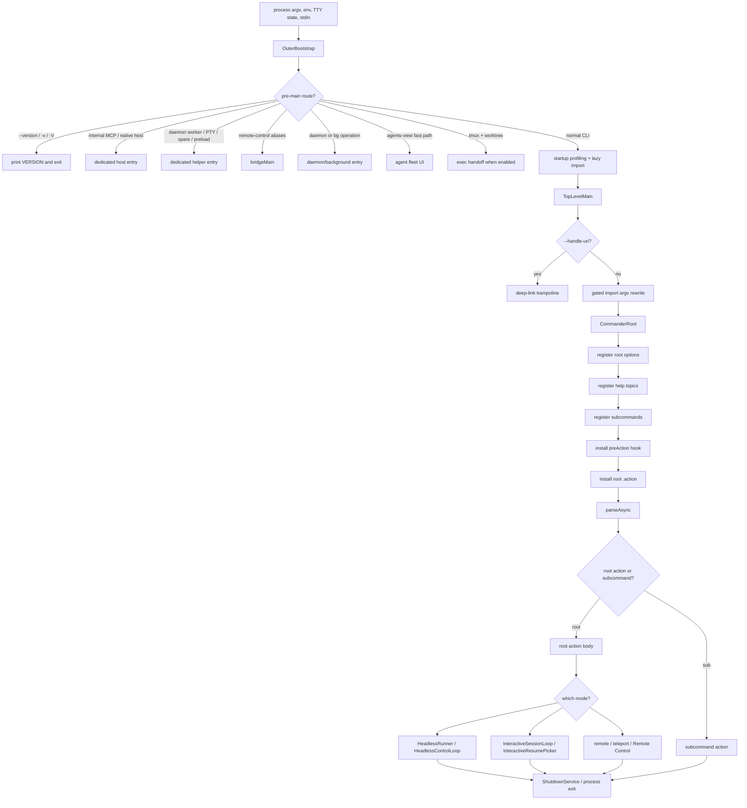

# Runtime lifecycle architecture

This page is the architecture analysis for the runtime-lifecycle module. It complements the implementation pages in this section by focusing on **module boundary, internal decomposition, public interface, and design rationale** rather than enumerating every source string.

Scope: what reverse engineering reveals about how the Claude Code runtime is assembled inside one Bun-standalone `cli.renamed.js`, how it routes a process invocation to a runtime mode, and how it cleans up on exit. Implementation specifics live in [Package and Bun bootstrap](package-and-bun-bootstrap.md) and [CLI main paths](cli-main-paths.md); the canonical option/name inventory is [Command-line reference](command-line-reference.md).

## Module purpose

The runtime-lifecycle module owns the **composition root** of the agent runtime. Once Bun executes `cli.renamed.js`, this module is responsible for:

1. Identifying the process (entrypoint kind, version, deep-link intent).
2. Building the `claude` command surface.
3. Resolving CLI/env/settings into a coherent runtime context.
4. Dispatching to a process-specialized fast path, a utility command, or the headless/interactive session runtime.
5. Coordinating shutdown.

No business logic lives here directly. The module's job is to wire the rest of the system together and hand control off.

## Architecture thesis

Runtime lifecycle is structured as a **three-stage funnel**, preceded by a process-specialization router:

`OuterBootstrap → TopLevelMain → CommanderRoot → runtime mode`

Each stage narrows responsibility. `ZIS()` handles cheap and process-specialized invocations before the normal main import. `UkS()` installs early process handling, handles the URI trampoline and the gated `import` rewrite, then calls `jkS()`. `jkS()` obtains the Commander program, preserves the print fast-parse path, registers the heavier utility commands, and parses argv. The root action built by the program factory is where standard-session flags, settings, services, and headless/interactive dispatch meet.

## Source anchors

| Semantic alias | Anchor | Architectural meaning |
| --- | --- | --- |
| OuterBootstrap | `async function ZIS()` at ~983,909 | Outer router; version, helper, bridge, daemon/background, agent-view, and normal-main paths. |
| BootstrapToMainLazyEdge | `let { main: f } = await Promise.resolve().then(() => (dri(), uri))` | Lazy boundary used only after the pre-main routes decline the invocation. |
| MainBundleExportSurface | `var uri = {}; nt(uri, { main: () => UkS })` | Export surface of the retained main bundle. |
| TopLevelMain | `async function UkS()` at ~978,259 | Early exit handling, URI trampoline, import rewrite, and handoff to `jkS()`. |
| TopLevelMainStartEvent | `profileCheckpoint("main_function_start")` | First instrumentation point inside `UkS()`. |
| DeepLinkTrampolineCheck | `process.argv.indexOf("--handle-uri")` | Deep-link trampoline check before Commander setup. |
| CommanderRoot | `async function jkS()` at ~978,305 | Gets the root program, applies print fast parsing, registers utility commands, and parses argv. |
| CommanderRootStartEvent | `profileCheckpoint("run_function_start")` | First instrumentation point inside `jkS()`. |
| RootProgramFactory | `rYf({ ... runInteractiveSession: (i, s) => qkS(i, s) ... })` | Builds the root options/action and injects the interactive-session callback. |
| ClaudeCommandIdentity | `Claude Code - starts an interactive session by default` | User-facing root-command identity in the program factory. |
| HeadlessModePredicate | `-p, --print` | Mode predicate that drives the headless path. |
| InteractiveLaunch | `qkS()` / `launchRepl` | Interactive fresh, resume, teleport, and remote-session projection. |
| HeadlessLaunch | `runHeadless` | Print/SDK/non-TTY execution projection. |
| DaemonSupervisor | `krm()` / `daemonMain` | Local background supervisor reached through the bootstrap daemon route. |
| EarlyProcessExitHook | `process.on("exit", () => { GkS() })` | Process-exit hook installed early in `UkS()`. |
| GracefulShutdownService | `gracefulShutdown` | Graceful-shutdown helper exported alongside `isShuttingDown` and analytics flush. |
| ShutdownClaimGuard | `Uut` | Allows only one process-level graceful-shutdown caller to own the sequence. |
| DisposerQueues | `_a` / `A5t`, `qnl` / `$Hn`, class `bsi` | Two snapshot-and-clear callback registries drained in parallel per registry. |
| StartupProfilingEvents | `import_time`, `cli_entry`, `main_tsx_imports_loaded`, `cli_before_main_import` | Startup profiling event groups used across the three stages. |
| EventLoopStallDetector | `startEventLoopStallDetector` | Optional event-loop diagnostic used by the standard runtime setup. |

## Internal decomposition

```mermaid
flowchart TD
    Argv[process argv, env, TTY state, stdin] --> Boot[OuterBootstrap]
    Boot --> FastPath{pre-main route?}
    FastPath -->|--version / -v / -V| Version[print VERSION and exit]
    FastPath -->|internal MCP / native host| Host[dedicated host entry]
    FastPath -->|daemon worker / PTY / spare / preload| Helper[dedicated helper entry]
    FastPath -->|remote-control aliases| Bridge[bridgeMain]
    FastPath -->|daemon or bg operation| Daemon[daemon/background entry]
    FastPath -->|agents-view fast path| Fleet[agent fleet UI]
    FastPath -->|tmux + worktree| Tmux[exec handoff when enabled]
    FastPath -->|normal CLI| Profile[startup profiling + lazy import]
    Profile --> Main[TopLevelMain]

    Main --> DeepLink{--handle-uri?}
    DeepLink -->|yes| Trampoline[deep-link trampoline]
    DeepLink -->|no| ImportRewrite[gated import argv rewrite]
    ImportRewrite --> Commander[CommanderRoot]

    Commander --> Options[register root options]
    Options --> Help[register help topics]
    Help --> Subs[register subcommands]
    Subs --> Pre[install preAction hook]
    Pre --> Action[install root .action]
    Action --> Parse[parseAsync]

    Parse --> ActionRun{root action or subcommand?}
    ActionRun -->|root| RootBody[root action body]
    ActionRun -->|sub| SubAction[subcommand action]

    RootBody --> ModeRouter{which mode?}
    ModeRouter --> Headless[HeadlessRunner / HeadlessControlLoop]
    ModeRouter --> Interactive[InteractiveSessionLoop / InteractiveResumePicker]
    ModeRouter --> Remote[remote / teleport / Remote Control]

    Headless --> Shutdown[ShutdownService / process exit]
    Interactive --> Shutdown
    Remote --> Shutdown
    SubAction --> Shutdown
```

The funnel uses three distinct technical patterns:

| Stage | Pattern | Reason |
|---|---|---|
| Bootstrap | Hand-written pre-main routes plus a Promise-wrapped lazy import of the main bundle. | Avoid paying the standard CLI cost for version output, internal hosts, bridge/daemon operations, background helpers, and the agent-view shortcut. |
| Top-level main | Early process handling followed by `--handle-uri`, a narrow `import` rewrite, and Commander handoff. | Keeps URI handoff outside normal parsing and performs only the small amount of setup needed before the command hub. |
| Commander root | Program factory plus Commander-style options/subcommands and an async root action. | A declarative surface gives help and utility commands a stable shape; the root action composes standard interactive/headless sessions. |

## Public interface

The module exposes its surface in three flavors: command-line, environment, and host signals.

### CLI surface

| Surface | Role |
|---|---|
| `claude` root command and options | Primary user contract; cataloged in [Command-line reference](command-line-reference.md). |
| Subcommands (`mcp`, `plugin`, `auth`, `agents`, `ultrareview`, `auto-mode`, `doctor`, `update`, `install`, `project purge`, `setup-token`, hidden `remote-control`/`rc`) | Lazy-loaded utility entrypoints registered after root option parsing. |
| `--print` / `-p` fast parse | Performance optimization that avoids registering heavy subcommands for scripted runs. |
| `--handle-uri` | Deep-link trampoline branch that bypasses Commander entirely. |
| Internal `--claude-in-chrome-mcp`, `--chrome-native-host`, `--computer-use-mcp`, `--daemon-worker`, `--bg-pty-host`, `--bg-spare`, and `--preload` invocations | Dedicated process roles selected by `ZIS()` before `UkS()` is imported. |
| Daemon/background and bridge aliases | Operational command families selected by `ZIS()` before the standard root parser. |

### Environment surface

| Variable | Role in the lifecycle |
|---|---|
| `CLAUDE_CODE_ENTRYPOINT` | Classifies who launched the process (`cli`, `sdk-cli`, `sdk-ts`, `sdk-py`, `remote`, `claude-vscode`, `claude-desktop`). Affects telemetry/identity and downstream behavior. |
| `GITHUB_ACTIONS` | Used during client-type selection to mark `github-action` runs. |
| `CLAUDE_CODE_SESSION_ACCESS_TOKEN`, `CLAUDE_CODE_WEBSOCKET_AUTH_FILE_DESCRIPTOR` | Indicate that the process is being launched as part of a remote/SDK/bridge session. |
| `CLAUDE_CODE_SIMPLE` | Set by `--bare`; signals minimal startup. |
| `CLAUDE_CONFIG_DIR` | Redirects the configuration root used by settings, sessions, and debug logs. |

### Host signals

| Signal/hook | Behavior |
|---|---|
| Early process-exit hook | Final cleanup hook installed at the top of `TopLevelMain`. |
| `SIGINT`/termination handling | Feeds the process-level shutdown coordinator; mode-specific code can still choose its exit code and final message. |
| `gracefulShutdown` / `gracefulShutdownSync` | Single-claim coordinated stop over primary cleanup, session-end hooks, write/analytics/debug drains, secondary cleanup, and stdout completion. |
| `startEventLoopStallDetector` | Optional diagnostic started before `TopLevelMain` if enabled; lives in the event-loop stall detector surface. |

## Composition contract

The standard root action is the **composition contract** for ordinary interactive and headless sessions. Specialized processes already selected by `ZIS()` do not enter this contract. Its broad responsibilities are:

1. Normalize flag aliases and incompatible combinations (debug, color, diff, config flags).
2. Resolve persistent state and settings (user, project, local, managed).
3. Initialize core services: feature flags, logging, telemetry, error reporting.
4. Initialize authentication and provider configuration.
5. Register shutdown callbacks with the shutdown service.
6. Validate cloud/offline/BYOK constraints.
7. Configure auto-update and shell-completion side effects.
8. Load MCP servers, plugins, content exclusion, and attachments.
9. Assemble permissions and URL/path rules.
10. Create local and (optional) remote session managers.
11. Resolve the session target (new, continue, resume, connect, cloud, teleport, remote-control).
12. Dispatch to exactly one runtime mode.

The action is async, but setup work is intentionally overlapped in places. Downstream modes receive the resolved state they require rather than relying on every possible startup promise having completed globally.

## Mode dispatch rules

| Predicate | Mode | Rationale |
|---|---|---|
| Exact version-only argv | Version fast path | `ZIS()` prints version/commit without importing `UkS()`. |
| Internal host/helper flags, daemon/background operations, bridge aliases, eligible agent-view or tmux/worktree invocations | Dedicated pre-main process path | These are process roles or operational surfaces, not root-action modes. |
| `--print` / `-p`, `--init-only`, `--sdk-url`, or non-TTY stdout | `HeadlessRunner` / `HeadlessControlLoop` | Scriptable single-run mode with stream-JSON capability. |
| `--remote`, `--teleport`, `--remote-control`/`--rc` | Remote/teleport/Remote Control | Local or hosted bridge variants; reuse interactive loop projection. |
| Otherwise (TTY) | `InteractiveSessionLoop` or `InteractiveResumePicker` fallback | Default human-in-the-loop path. |

The order matters: `ZIS()` routes process-specialized invocations before importing `UkS()`; `jkS()` then preserves a print-only parse shortcut before registering heavier utility commands; finally the root action distinguishes headless from interactive/session-restore variants. This artifact has no root `--server`, `--headless`, or `--acp` mode and no `startServerMode`/`startACPMode` handler.

## Shutdown contract

Shutdown has two related but distinct layers:

1. The global registries (`_a`/`A5t` and `qnl`/`$Hn`) adapt functions or disposable objects, snapshot and clear their sets, then execute that snapshot with `Promise.all`. Ordering inside a registry is therefore not guaranteed.
2. The process-level `gracefulShutdown` sequence is guarded by `Uut`, so only one caller owns shutdown. It gives the primary registered cleanup a two-second race, runs session-end hooks under their own abort timeout, then drains writes, analytics, debug output, secondary cleanup, and stdout before final exit. A failsafe can force exit if the whole sequence stalls.

These primitives do **not** prove that every child process receives a universal SIGTERM-then-SIGKILL sequence. Escalation exists in specific owners—such as daemon registry workers—but must be documented at that subsystem boundary.

## Internal collaborators

| Collaborator | What runtime lifecycle expects from it |
|---|---|
| Settings/managed policy | Provide a settled config view by the time the root action body runs. |
| Auth/provider module | Have credentials and provider classifier ready before mode dispatch. |
| MCP/plugins/hooks | Be parseable from flags and settings; runtime connection is deferred to the chosen mode. |
| Tool/permission runtime | Be reachable from both headless and interactive loops without lifecycle-specific code paths. |
| Session manager | Accept a resolved target descriptor and produce a runtime session envelope. |
| Diagnostics/ops | Be initialized early enough to log preAction events but not so early that they block fast paths. |

## Design decisions

1. **Single bundle, layered composition roots.** `ZIS()` composes specialized process roles, while the program factory/root action composes ordinary sessions. This avoids forcing helper and daemon processes through interactive-session setup.
2. **Lazy-imported process roles and modes.** `ZIS()` imports only the selected internal host/helper/daemon/bridge handler, while normal startup lazily imports `UkS()`; the standard action later imports mode-specific runtime pieces as needed.
3. **Shared command setup before actions.** The root program factory carries cross-cutting setup needed by root and subcommand actions, while `ZIS()` fast paths perform only their narrower policy/settings bootstrap.
4. **`--print` fast parse.** Skipping subcommand registration for the common scripted path keeps headless latency low; only `cc://`/`cc+unix://` argv pulls in the heavier path.
5. **Deep-link trampoline outside Commander.** `--handle-uri` short-circuits before option parsing so OS deep-link launches can re-enter the right session without paying for full setup twice.
6. **Mode-specific exit policy over shared cleanup.** Headless, interactive, and utility callers can choose exit code/final messaging while the shared coordinator owns the common drain phases.
7. **Dedicated roles bypass standard composition.** Internal hosts, daemon workers, background helpers, and direct bridge operations do not masquerade as interactive modes; each receives the narrow initialization its handler requires.

## Failure modes

| Failure | Effect |
|---|---|
| Unknown flag combination (e.g. `--rewind-files` with a prompt) | Headless runner exits with a precise error before model work; this is enforced by `HeadlessRunner`. |
| Missing or invalid `--handle-uri` payload | Deep-link trampoline reports the error and exits without starting Commander. |
| preAction failure | Fails fast before any command action; surfaced as a setup error, not a model error. |
| Settings migration failure | Logged via preAction instrumentation; the rest of the runtime continues with the unmigrated view. |
| A process-specialized flag is malformed | Its dedicated `ZIS()` handler reports or exits without constructing the ordinary Commander session runtime. |
| Shutdown raised during MCP/plugin work | The single-claim coordinator drains registered cleanup and output phases; individual subsystems remain responsible for their own cancellation semantics. |

## Extension points

| Extension | How it plugs in |
|---|---|
| New subcommand | Register under `CommanderRoot` after the print fast-path check; use lazy `Promise.resolve().then(...)` import for cost. |
| New process role | Add an explicit `ZIS()` branch when it must avoid normal-main initialization; document its policy/settings bootstrap and termination contract. |
| New standard-session mode predicate | Add it to the root-action dispatch and preserve the headless/interactive validation order. |
| Additional shared action setup | Add it to the root program factory/pre-action layer rather than duplicating it across command handlers. |
| Additional shutdown hook | Register with the shutdown service inside the root action; do not attach raw `process.on` listeners. |

## Caveats

- The Commander-like program is created inside the bundled `rYf(...)` factory; semantic aliases describe its role rather than claiming an original source-module name.
- Subcommand handlers are documented in their own pages; this page describes only how they enter the lifecycle.
- The process-level phases above are observed, but callback ordering inside each disposer registry and subsystem-internal teardown ordering are implementation-defined.

## Related docs

- [Package and Bun bootstrap](package-and-bun-bootstrap.md)
- [CLI main paths](cli-main-paths.md)
- [Command-line reference](command-line-reference.md)
- [System architecture](../00-start-here/system-architecture.md)
- [Context and model loop architecture](../02-context-model-loop/architecture.md)
- [Session and remote-control architecture](../04-sessions-persistence-remote/architecture.md)
