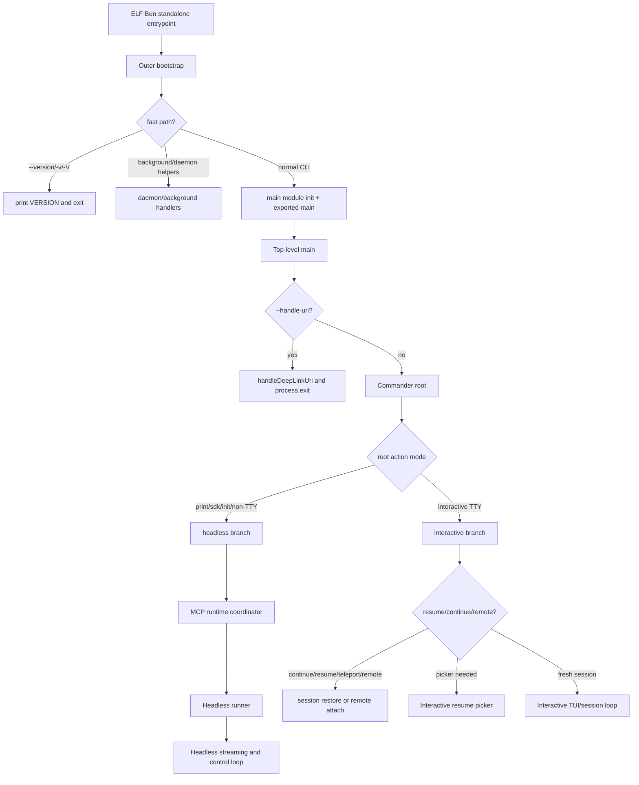

# CLI main paths in the reverse-engineered `cli.renamed.js`

## Scope

This page is a full-analysis reverse-engineering pass over the extracted Claude Code CLI bundle:

- Artifact: `claude-code-pkg/src/entrypoints/cli.js`
- Package version: `@anthropic-ai/claude-code@2.1.143`
- Native package: `@anthropic-ai/claude-code-linux-x64@2.1.143`
- Extracted file identity: 14,548,665 bytes, approximately 19,592 source lines, SHA-256 `7ee77e22cde2618030c26182d43d8be82f68cbb2ed063f72778c1a5986d0943a`
- Bun graph entrypoint: `/$bunfs/root/src/entrypoints/cli.js`

The bundle is minified and bundled, but it still contains readable JavaScript and user-facing strings. Source locations below use approximate line numbers and byte offsets plus exact symbols or strings.

## Source anchors

| Semantic alias | Anchor | Meaning |
| --- | --- | --- |
| FinalEntrypointMirror | `FINAL_ROOT_FILES`, `src/entrypoints/cli.js` | Mirrors the Bun graph entrypoint into the retained `claude-code-pkg/src/entrypoints/cli.js` path. |
| BunGraphEntrypoint | `// @bun @bytecode @bun-cjs` | Confirms the retained file is the Bun standalone graph entrypoint. |
| OuterBootstrap | `async function J9A` | Outer process bootstrap and fast-path command handling. |
| BootstrapLazyMainImport | `let{main:f}=await Promise.resolve().then(() => (p08(),zo6))` | Lazy load of the bundled CLI module, then `main()`. |
| MainModuleInitializer | `var p08=T(()=>` | Bundled module initializer for the main CLI module. |
| MainBundleExports | `var zo6={}; j$(zo6,{startDeferredPrefetches:()=>startDeferredPrefetches,main:()=>O4A})` | Export surface for `main` and deferred prefetches. |
| TopLevelMain | `async function O4A()` | Top-level CLI `main`. |
| DeepLinkTrampoline | `process.argv.indexOf("--handle-uri")` | Early deep-link URI trampoline branch. |
| HeadlessInitialPredicate | `let $=process.argv.slice(2),q=$.includes("-p")||$.includes("--print")` | Initial non-interactive/headless predicate. |
| EntrypointEnvNormalizer | `function pzq(H)` | Sets or normalizes `CLAUDE_CODE_ENTRYPOINT` based on CLI mode. |
| SessionStartClassifier | `function Uzq(H)` | Classifies the session start type from argv, including resume/from-PR style starts. |
| AiAgentEnvBootstrap | `function cV$()` | Environment bootstrap that sets `AI_AGENT` to a Claude Code/version string when appropriate. |
| CommanderRoot | `async function w4A()` | Commander root command construction and runtime branch routing. |
| ClaudeRootCommand | `H.name("claude")` | Root CLI command and user-facing description. |
| RootActionBody | `.action(async(A,z)=>` | Root command action body; most CLI mode decisions happen inside this action. |
| PrintFastParsePath | `if($&&!q)return ... H.parseAsync(process.argv)` | Fast parse path for `--print` that skips subcommand registration unless a `cc://`/`cc+unix://` argument is present. |
| McpHeadlessCoordinator | `function fH9(H)` | MCP connection coordinator used by headless setup. |
| HeadlessMcpSetup | `let o4=fH9({regularMcpConfigs:Ww` | Headless branch creates the MCP coordinator. |
| HeadlessRunnerLazyImport | `let{runHeadless:u7}=await Promise.resolve().then(() => (M89(),O89))` | Lazy import of the print/headless runner. |
| HeadlessRunner | `async function runHeadless` | Implementation of `runHeadless`. |
| HeadlessControlLoop | `function runHeadlessStreamingForTesting` | Headless streaming/control loop. |
| InteractiveBranchSetup | `if(!ZH){let W8=ua4(!1)` | Interactive UI branch initialization. |
| InteractiveSessionLoop | `await pT$(Y7` | Interactive TUI/session loop entry. |
| InteractiveResumePicker | `await aa4(Y7` | Interactive resume/search picker fallback. |
| ContinueRecentSessionBranch | `if(z.continue)` | Continue-most-recent-session branch. |
| ResumeRemoteSessionBranch | `else if(z.resume||z.fromPr||AH||wH!==null)` | Resume, PR, teleport, and remote-session branch cluster. |
| McpCommandRegistrar | `function rR4(H)` | `mcp` subcommand registrar. |
| PluginCommandRegistrar | `function fC4(H)` | `plugin`/`plugins` subcommand registrar. |
| UtilitySubcommandRegistry | `H.command("auth")`, `H.command("project")`, `H.command("agents")`, `H.command("install [target]")` | Top-level utility subcommands registered after the root command. |
| StartupProfilingEvents | `XA9={import_time` | Startup profiling event groups such as `cli_entry`, `main_tsx_imports_loaded`, and `cli_before_main_import`. |

## Bundle modules in `cli.renamed.js`

| Semantic alias | Loader line(s) | Representative renamed exports | Atlas entry |
|---|---:|---|---|
| `GitRepoOperations` | 55226 | `stashToCleanState`, `redactGitRemoteCredentials`, `preserveGitStateForIssue`, `normalizeGitRemoteUrl`, `isLinkedWorktree`, `isCurrentDirectoryBareGitRepo`, `isBranchOnOrigin`, `isAtGitRoot` | [Bundle module map — git, worktree, and daemon](../99-research-atlas/module-map-from-renamed-cli.md#git-worktree-and-daemon) |
| `TerminalTextFormatting` | 12130, 199851 | `wrapText`, `truncateToWidth`, `truncateToWidthNoEllipsis`, `truncateStartToWidth`, `truncatePathMiddle`, `formatTokens`, `formatTokenEstimate`, `formatSecondsShort`, `formatResetTime` | [Bundle module map — tui and rendering](../99-research-atlas/module-map-from-renamed-cli.md#tui-and-rendering) |
| `InkTerminalHooks` | 173046 – 199781 | `useTheme`, `useTerminalViewport`, `useTerminalFocus`, `useTerminalTitle`, `useTabStatus`, `useStdin`, `useSelection`, `useResolvedTheme`, `useThemeSetting`, `useTimeout`, `usePreviewTheme`, `useCustomThemes`, `ThemeProvider` | [Bundle module map — tui and rendering](../99-research-atlas/module-map-from-renamed-cli.md#tui-and-rendering) |

## High-level call graph



## Bootstrap path

`OuterBootstrap` is not just a trivial wrapper: it contains fast paths before the full main bundle is loaded.

1. It reads `process.argv.slice(2)`.
2. If the arguments are only `--version`, `-v`, or `-V` with an optional `--verbose`, it prints the embedded product version without importing the full main path.
3. It checks background/daemon helper flags before normal CLI dispatch.
4. For normal CLI startup, it records startup profiling events, starts early input capture, lazily initializes the main module, reads the exported `main`, and awaits it.

The `BootstrapLazyMainImport` anchor means the exported `TopLevelMain` path is reached only after the bundled module initializer runs.

## Top-level `main` path

`TopLevelMain` is the first full CLI main function.

1. It initializes warning/exit handling and checks `--handle-uri` before normal command parsing.
2. The initial mode predicate is:
   - `-p` or `--print`
   - `--init-only`
   - any `--sdk-url...` argument
   - `!process.stdout.isTTY`
3. If that predicate is true, it enables non-interactive setup (`JfH()` in the minified bundle).
4. It calls startup classifiers and environment setup:
   - `jv8(!A)` — records whether this is an interactive-style run.
   - `pzq(A)` — normalizes `CLAUDE_CODE_ENTRYPOINT`; when no entrypoint exists, headless-like runs become `sdk-cli` and interactive runs become `cli`.
   - `Nv8(Uzq($))` — records session start type from argv.
   - `cV$()` — sets `AI_AGENT` to a Claude Code/version string when it is absent or already Claude Code-owned.
5. It derives a client type from constants such as `GITHUB_ACTIONS`, `CLAUDE_CODE_ENTRYPOINT`, `CLAUDE_CODE_SESSION_ACCESS_TOKEN`, and `CLAUDE_CODE_WEBSOCKET_AUTH_FILE_DESCRIPTOR`.
6. It eagerly loads settings and then awaits `CommanderRoot`.

The important split is that `TopLevelMain` decides process-level mode and environment identity, while `CommanderRoot` owns Commander setup and the deeper headless/interactive path split.

## Commander root setup

`CommanderRoot` constructs a Commander-like instance with configured help and positional options. The root command is named `claude` and has the user-facing description:

> `Claude Code - starts an interactive session by default, use -p/--print for non-interactive output`

The root command accepts an optional `[prompt]`, many options, and a large root action. The `preAction` hook performs shared initialization before subcommands or root action handlers run:

- device/MDM and startup initialization;
- terminal title setup;
- sink/log initialization;
- inline plugin directory/URL collection;
- settings migrations;
- remote/gateway settings refresh;
- settings cache invalidation subscriptions.

There is one performance-sensitive special case: if the process includes `-p` or `--print` and the argv does not include a `cc://` or `cc+unix://` URI, `CommanderRoot` parses immediately after root options are built. In that fast path, it returns before registering heavier subcommands such as `mcp`, `plugin`, `auth`, and `agents`.

## Main mode decision table

| Runtime path | Trigger | Key semantic anchors | Downstream path |
|---|---|---|---|
| Version fast path | `--version`, `-v`, or `-V` as the only command, optional `--verbose` | `OuterBootstrap`, product constant `VERSION:"2.1.143"` | Print version and exit before full main import. |
| Deep link trampoline | `--handle-uri <uri>` | `process.argv.indexOf("--handle-uri")`, `handleDeepLinkUri` | Enable config, parse URI, launch terminal/session, then `process.exit(D)`. |
| Print/headless | `-p`, `--print`, `--init-only`, `--sdk-url...`, or stdout not TTY | `HeadlessInitialPredicate`, headless branch, `HeadlessRunner`, `HeadlessControlLoop` | Build headless app state, connect MCP, run the headless runner, drain the streaming/control loop. |
| SDK transport | `--sdk-url` plus stream JSON formats | `--sdk-url <url>`, `--input-format=stream-json`, `--output-format=stream-json` checks | Uses remote WebSocket/SSE transport and headless control protocol. |
| Interactive fresh session | TTY output, no print/sdk/init-only branch, no resume/remote branch | `InteractiveBranchSetup`, `InteractiveSessionLoop` | Create UI root, run setup screens, load tools/agents/MCP, enter TUI loop. |
| Continue last session | `-c` or `--continue` | `ContinueRecentSessionBranch`, `SessionDiscovery`, `SessionRestore`, `InteractiveSessionLoop` | Load most recent transcript, restore runtime state, enter TUI. |
| Resume/search picker | `-r`, `--resume`, `--from-pr` | `ResumeRemoteSessionBranch`, `InteractiveResumePicker` | Resolve session ID/title/PR, restore if exact, otherwise open picker. |
| Teleport | hidden `--teleport [session]` | `AH=z.teleport??null`, `teleportWithProgress` | Validate remote session/repo state, hydrate messages, enter TUI. |
| Remote session | hidden `--remote [description|session_id|url]` | `wH=YH===!0?"":YH??null`, `Gp4(...)`, `remoteSessionConfig` | Create or attach to remote session and enter TUI backed by remote transport. |
| Remote Control | hidden `--remote-control [name]` / `--rc` or `remote-control` subcommand | `remote-control`, `rc`, `bridgeMain`, `initReplBridge` | Exposes local sessions to claude.ai/code or mobile control channels. |

`ZH` is a minified local variable in the root action. The branch it guards is identified semantically as the non-interactive/headless branch because it validates print-only options, sets JSON output handling, creates headless app state, connects MCP, imports `runHeadless`, and returns without creating the interactive UI root.

## Headless/print path

The headless branch is the path used by `claude -p`, SDK-style transports, init-only runs, and non-TTY stdout.

Confirmed steps:

1. Validate output/input format combinations:
   - `--output-format` supports `text`, `json`, and `stream-json`.
   - `--input-format=stream-json` requires `--output-format=stream-json`.
   - `--sdk-url` requires both stream JSON input and output.
   - `--include-partial-messages` requires print mode and `stream-json` output.
2. Read prompt/stdin through `M4A(...)`, including a 10 MiB piped-stdin limit.
3. Run setup and load command/tool/agent definitions.
4. Build a headless state store with model, MCP, permission, effort, fast-mode, and advisor fields.
5. Construct an MCP coordinator and call `connect()`.
6. Start deferred background prefetch work unless disabled by simple/exit flags.
7. Lazy import `runHeadless` and call it with prompt, state accessors, tools, SDK MCP configs, active agents, resume options, output format, thinking config, and session hooks.

Inside `HeadlessRunner`:

- validates resume-only flags such as `--resume-session-at` and `--rewind-files`;
- sets up SDK/stream JSON output guards;
- initializes sandboxing when enabled;
- loads initial messages through `A89` for `--continue`, `--resume`, teleport, or session-start hooks;
- checks that print mode has input unless a resumed deferred-tool marker or SDK transport supplies it;
- prepares permission prompt behavior through `K89`/`q89`;
- drains the streaming/control loop through `HeadlessControlLoop`;
- writes final output as plain text, JSON result, or stream JSON frames.

`HeadlessControlLoop` is the main headless event loop. It handles stream JSON input, control requests, MCP status and calls, permission responses, remote-control requests, background task controls, bash command messages, user prompts, session state, and result emission. The presence of many `control_request` subtypes in this function makes it the headless equivalent of the interactive UI dispatcher.

## Interactive path

The interactive branch begins when the root action does not take the headless branch.

Confirmed steps:

1. Create render options through `ua4(false)` and an interactive root via `createRoot`.
2. Run setup/login/trust screens via `ba4(...)` and related policy checks.
3. Load settings, tools, commands, MCP configs, plugin state, custom agents, and model configuration.
4. Emit startup telemetry and notifications.
5. Resolve the session path:
   - `--continue` loads the most recent transcript through `SessionDiscovery`, restores it through `SessionRestore`, and enters `InteractiveSessionLoop`.
   - `--resume` resolves an explicit UUID/title/file, restores through `SessionRestore`, and enters `InteractiveSessionLoop` if exact.
   - `--from-pr` or ambiguous resume search falls back to `InteractiveResumePicker`.
   - `--remote` creates or attaches to a remote session and enters `InteractiveSessionLoop` with `remoteSessionConfig`.
   - `--teleport` validates and hydrates remote session logs, then enters `InteractiveSessionLoop`.
   - a fresh session enters `InteractiveSessionLoop` with optional deep-link/prefill warnings and startup hook messages.

The stable semantic entrypoints are therefore `InteractiveSessionLoop` for the main interactive TUI/session loop and `InteractiveResumePicker` for the picker/search-style resume path.

## MCP path

There are two important MCP surfaces in this file:

1. The `mcp` user-facing subcommand tree is registered by `McpCommandRegistrar`. It includes surfaces such as `serve`, `add`, `remove`, `list`, `get`, `add-json`, `add-from-claude-desktop`, `reset-project-choices`, and, when enabled, `xaa` management.
2. Runtime MCP connection for headless mode is coordinated by `McpRuntimeCoordinator`. It splits regular configs into `alwaysLoad` and non-`alwaysLoad` sets, handles `MCP_CONNECTION_NONBLOCKING`, connects regular servers, connects claude.ai connectors, deduplicates plugin servers that duplicate claude.ai connectors, and retries transient remote failures.

In the root action, MCP configs are assembled from CLI flags, settings, project config, enterprise policy, claude.ai connectors, Chrome/computer-use integration, and agent frontmatter. The headless branch then passes `regularMcpConfigs` and a `claudeaiConfigPromise` into `McpRuntimeCoordinator`; the interactive branch resolves MCP client/tool/command promises before entering the TUI.

## Top-level commands

The root command registers these main command families outside the print fast path:

| Command | Anchor | Handler shape |
|---|---|---|
| `mcp` | `McpCommandRegistrar` | Configures and manages MCP servers; also has `serve` and optional `xaa` subcommands. |
| `plugin` / `plugins` | `PluginCommandRegistrar` | Manages plugins and marketplaces; validates, lists, installs, updates, disables, and removes plugin surfaces. |
| `auth` | `H.command("auth")` | `login`, `status`, and `logout` subcommands import auth handlers lazily. |
| `project purge [path]` | `H.command("project")...command("purge [path]")` | Deletes project-scoped Claude Code state such as transcripts, tasks, file history, and config entries. |
| `setup-token` | `H.command("setup-token")` | Sets up a long-lived authentication token for Claude subscription users. |
| `agents` | `H.command("agents")` | Opens/manages background agents; in TTY mode can mount the fleet view. |
| `ultrareview [target]` | `H.command("ultrareview [target]")` | Launches cloud-hosted multi-agent code review and prints findings. |
| `auto-mode` | `H.command("auto-mode")` | Inspects auto-mode classifier defaults/config and can run an AI critique of custom rules. |
| `remote-control` / `rc` | `H.command("remote-control", {hidden: true}).alias("rc")` | Hidden command for local-session control from claude.ai/code or mobile. |
| `doctor` | `H.command("doctor")` | Checks auto-updater health and related environment state. |
| `update` / `upgrade` | `H.command("update").alias("upgrade")` | Checks for updates and installs if available. |
| `install [target]` | `H.command("install [target]")` | Installs the native Claude Code build for `stable`, `latest`, or a specific version. |

## Root flag families

The root action consumes a large option surface. The most important groups are:

| Family | Representative flags | Runtime implication |
|---|---|---|
| Debug/diagnostics | `--debug`, `--debug-file`, `--verbose`, `--mcp-debug` | Enables debug logging, stderr/file logs, or verbose output. |
| Headless/output | `-p`, `--print`, `--output-format`, `--input-format`, `--json-schema`, `--include-partial-messages`, `--replay-user-messages`, `--sdk-url` | Selects print/SDK paths and result framing. |
| Minimal startup | `--bare`, `--init`, `--init-only`, `--maintenance` | Reduces or changes setup hook behavior; `--bare` sets `CLAUDE_CODE_SIMPLE=1`. |
| Permissions/tools | `--dangerously-skip-permissions`, `--allow-dangerously-skip-permissions`, `--permission-mode`, `--allowedTools`, `--tools`, `--disallowedTools`, `--permission-prompt-tool` | Shapes tool availability and permission prompts. |
| Prompt/system | `--system-prompt`, `--system-prompt-file`, `--append-system-prompt`, `--append-system-prompt-file`, `--plan-mode-instructions`, `--exclude-dynamic-system-prompt-sections` | Overrides or appends system prompt content and cache-sensitive sections. |
| Sessions | `--continue`, `--resume`, `--fork-session`, `--from-pr`, `--session-id`, `--no-session-persistence`, `--resume-session-at`, `--rewind-files`, `--name` | Controls local transcript/session restore, forking, persistence, and display naming. |
| Model/thinking | `--model`, `--fallback-model`, `--effort`, `--thinking`, `--thinking-display`, `--max-thinking-tokens`, `--max-turns`, `--max-budget-usd`, `--task-budget`, `--betas` | Selects model, thinking mode, budget, and beta headers. |
| MCP/plugins/settings | `--mcp-config`, `--strict-mcp-config`, `--settings`, `--managed-settings`, `--setting-sources`, `--plugin-dir`, `--plugin-url`, `--agents` | Adds dynamic MCP/plugin/agent/settings inputs. |
| Workspace/integrations | `--add-dir`, `--ide`, `--chrome`, `--no-chrome`, `--file` | Adds tool-access directories and optional IDE/Chrome/file-resource integration. |
| Deep link/remote hidden flags | `--prefill`, `--deep-link-origin`, `--prefill-b64`, `--deep-link-cwd-b64`, `--teleport`, `--remote`, `--remote-control`, `--rc` | Used by deep-link launching, remote sessions, and Remote Control. |

## High-signal constants and environment variables

| Constant/string | Anchor | Meaning |
|---|---|---|
| `VERSION:"2.1.143"` | line ~11, byte `0xdc5` | Embedded product version used by version output, update checks, and telemetry. |
| `BUILD_TIME:"2026-05-15T17:39:39Z"` | adjacent to `VERSION` | Embedded build time. |
| `GIT_SHA:"cfb8132e4c3551e2773f41a1900efd1cc93637db"` | adjacent to `VERSION` | Embedded source revision identifier. |
| `CLAUDE_CODE_ENTRYPOINT` | line ~129, byte `0xe4be7` | Runtime entrypoint classifier; examples include `cli`, `sdk-cli`, `sdk-ts`, `sdk-py`, `remote`, `claude-vscode`, and `claude-desktop`. |
| `CLAUDE_CODE_SIMPLE` | line ~11, byte `0xe572` | Minimal/bare mode switch; `--bare` sets this env var. |
| `CLAUDE_CONFIG_DIR` | line ~11, byte `0xe9a0` | Overrides the default `~/.claude` configuration directory. |
| `ANTHROPIC_API_KEY` | line ~43, byte `0x264c0` | API key source in the embedded Anthropic SDK/runtime path. |
| `ANTHROPIC_AUTH_TOKEN` | adjacent to `ANTHROPIC_API_KEY` | OAuth/token source in SDK credential handling. |
| `GITHUB_ACTIONS` | in `TopLevelMain` client-type selection | Classifies the runtime as `github-action`. |
| `CLAUDE_CODE_SESSION_ACCESS_TOKEN` | in `TopLevelMain` and remote I/O code | Remote/session ingress token signal. |
| `CLAUDE_CODE_WEBSOCKET_AUTH_FILE_DESCRIPTOR` | in `TopLevelMain` client-type selection | Remote/WebSocket auth signal. |
| `CLAUDE_CODE_ENVIRONMENT_KIND` | in `TopLevelMain`, headless/remote paths | Identifies bridge/remote-control runtime kind. |
| `MCP_CONNECTION_NONBLOCKING` | in `McpRuntimeCoordinator` | Controls whether MCP connection proceeds asynchronously/non-blocking. |
| `CLAUDE_CODE_USE_BEDROCK`, `CLAUDE_CODE_USE_VERTEX`, `CLAUDE_CODE_USE_MANTLE`, `CLAUDE_CODE_USE_ANTHROPIC_AWS` | in deferred prefetch work | Provider-specific background credential/auth prefetch gates. |

## Path summary

The main paths identified from `cli.renamed.js` are:

1. **Outer Bun/bootstrap path** — `OuterBootstrap` handles version and daemon/background shortcuts, then lazy-loads the main module export.
2. **Deep-link path** — `TopLevelMain` handles `--handle-uri` before Commander setup.
3. **Commander root path** — `CommanderRoot` builds root flags, preAction setup, root action, and subcommands.
4. **Headless/print path** — selected by `-p`, `--print`, `--init-only`, `--sdk-url`, or non-TTY stdout; connects MCP and runs `HeadlessRunner`/`HeadlessControlLoop`.
5. **Interactive fresh-session path** — creates the UI root, runs setup screens, and enters `InteractiveSessionLoop`.
6. **Resume/continue path** — loads transcripts through `SessionDiscovery`, restores state through `SessionRestore`, then enters `InteractiveSessionLoop` or `InteractiveResumePicker`.
7. **Remote/teleport/Remote Control path** — creates or attaches to hosted/remote sessions and bridges control messages into the same interactive/headless dispatch surfaces.
8. **MCP path** — user-facing `mcp` commands are registered by `McpCommandRegistrar`; runtime connection is coordinated by `McpRuntimeCoordinator` and related reconnect/dedup logic.
9. **Utility subcommands** — `auth`, `project purge`, `setup-token`, `agents`, `ultrareview`, `auto-mode`, `doctor`, `update`, and `install` lazy-load their specialized handlers.

## Related module docs

- [Package and Bun bootstrap](package-and-bun-bootstrap.md) covers the npm/native/Bun graph boundary before `OuterBootstrap`.
- [Commands and flags](commands-and-flags.md) expands the root option and subcommand surface.
- [Headless streaming and resilience](../02-context-model-loop/headless-streaming-and-resilience.md) expands `HeadlessRunner`/`HeadlessControlLoop` stream-JSON and SDK behavior.
- [Session resume and transcripts](../04-sessions-persistence-remote/session-resume-and-transcripts.md) expands `SessionDiscovery`, `SessionRestore`, JSONL transcripts, fork, and rewind.
- [Remote control and teleport](../04-sessions-persistence-remote/remote-control-and-teleport.md) expands `--remote`, `--teleport`, Remote Control, bridge, and token paths.
- [Built-in tools and permissions](../03-tools-integrations-security/built-in-tools-and-permissions.md) expands the tool and permission surfaces referenced by root flags.

## Shutdown coordinator and signal-exit

Long-lived resources register their teardown with a single global drain queue named `SK` (`registerShutdownTask`) at [cli.renamed.js line 3538](../../claude-code-pkg/src/entrypoints/cli.renamed.js#L3538). The implementation wraps the input in a `Y19` adapter so callers may pass an async function, a `Symbol.dispose` object, or a `Symbol.asyncDispose` object, and stores the wrapped task in a `Set`:

```js
lt6 = class lt6 {
  #H = new Set();
  register(H) {
    let $ = Y19(H);
    this.#H.add($);
    let q = () => { this.#H.delete($); };
    return Object.assign(q, { [Symbol.dispose]: q });
  }
  async drain() {
    let H = Array.from(this.#H);
    (this.#H.clear(), await Promise.all(H.map(async ($) => $())));
  }
};
```

`register` returns an unregister handle that is itself a `Symbol.dispose`, so `using cleanup = SK(...)` deregisters automatically when the holder goes out of scope. `ZIH()` (`drainShutdownTasks`) clears the set and awaits every task in parallel — there is no ordering guarantee, so consumers must own their own dependencies.

Posix signal delivery is wired to the same queue through the `signal-exit` shim at [line 52680](../../claude-code-pkg/src/entrypoints/cli.renamed.js#L52680). `APH` lists the trapped signals (`SIGHUP`, `SIGINT`, `SIGTERM`, `SIGABRT`, `SIGALRM`, `SIGVTALRM`, `SIGXCPU`, `SIGXFSZ`, `SIGUSR2`, `SIGTRAP`, `SIGSYS`, `SIGQUIT`, `SIGIOT`, `SIGIO`, `SIGPOLL`, `SIGPWR`, `SIGSTKFLT`). The shim's `fOq` emitter exposes `onExit($listener, { alwaysLast })` and rewires `process.emit` plus `process.reallyExit` so that exit-time work happens once and only once, with `afterExit` listeners always last. The shim also re-dispatches the original signal via `process.kill(pid, signal === "SIGHUP" ? this.#H : signal)` after listeners run, so the parent shell sees the correct exit cause.

Long-running spawned children plug into the same machinery through `Wc(() => H.kill())` ([line 52884](../../claude-code-pkg/src/entrypoints/cli.renamed.js#L52884)) — every `execa`-style child registers a teardown that the signal-exit emitter calls before the process really exits, so MCP servers, sandbox monitors, voice recorders, and the bridge child are all SIGTERM'd before Claude Code's own exit completes. The `forceKillAfterTimeout` helper (`DOq`, default `_h9 = 5000` ms) escalates to SIGKILL when a child ignores SIGTERM.

## Caveats

- The analyzed file is bundled/minified output. Exact anchors behind aliases such as `TopLevelMain`, `CommanderRoot`, `HeadlessRunner`, and `InteractiveSessionLoop` are stable only for this extracted build and should be paired with exact strings or byte offsets.
- Several early helpers live on very long lines; line numbers are approximate and less stable than byte offsets plus exact symbols.
- No sourcemaps were found during temporary Bun module graph inspection, so this analysis does not recover the original TypeScript source tree.
- JavaScriptCore bytecode can corroborate compiled code existence through optional dumps, but it is not retained here or used as recovered source.
- Deeper helper-level analysis can continue from the focused module docs rather than this path-summary page.
