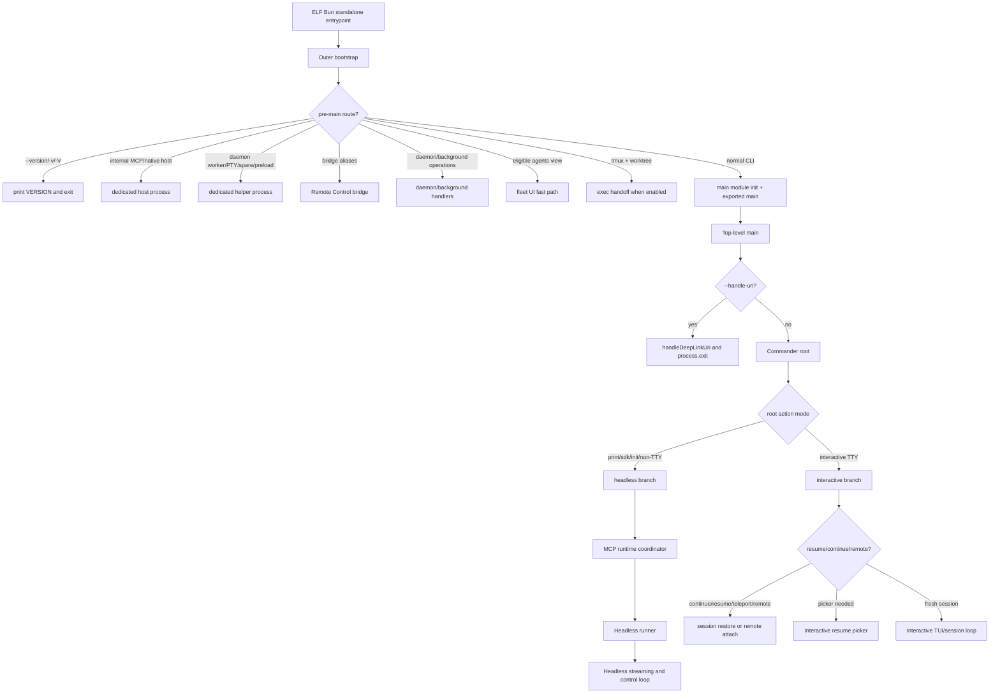

# CLI main paths in the reverse-engineered `cli.renamed.js`

## Scope

This page is a full-analysis reverse-engineering pass over the extracted Claude Code CLI bundle:

- Raw retained entrypoint: `claude-code-pkg/src/entrypoints/cli.js`
- Primary behavioral reading surface: `claude-code-pkg/src/entrypoints/cli.renamed.js`
- Package version: `@anthropic-ai/claude-code@2.1.215`
- Native package: `@anthropic-ai/claude-code-linux-x64@2.1.215`
- Extracted file identity: 20,160,986 bytes, SHA-256 `78007444c51f6828a8c122c97d436038c72c035f9149178d0a8ba13e77cda350`
- Renamed reading surface: 31,833,579 bytes, SHA-256 `461de0af948a1698a421a7a9072b6168bc5edc9a546e9e666db629cbcc0c72ce`
- Bun graph entrypoint: `/$bunfs/root/src/entrypoints/cli.js`

The bundle is minified and bundled, but the renamed derivative still contains readable JavaScript and user-facing strings. Source locations below use approximate line numbers plus exact symbols or strings. The raw `cli.js` corroborates artifact identity; behavioral claims use enclosing control flow in `cli.renamed.js`.

## Source anchors

| Semantic alias | Anchor | Meaning |
| --- | --- | --- |
| FinalEntrypointMirror | `FINAL_ROOT_FILES`, `src/entrypoints/cli.js` | Mirrors the Bun graph entrypoint into the retained `claude-code-pkg/src/entrypoints/cli.js` path. |
| BunGraphEntrypoint | `// @bun @bytecode @bun-cjs` | Confirms the retained file is the Bun standalone graph entrypoint. |
| OuterBootstrap | `async function ZIS()` at ~983,909 | Outer process router and version/helper/daemon/background fast paths. |
| BootstrapLazyMainImport | `let { main: f } = await Promise.resolve().then(() => (dri(), uri))` | Lazy load of the normal main module after all pre-main routes decline the invocation. |
| MainBundleExports | `var uri = {}; nt(uri, { main: () => UkS })` | Export surface for the normal CLI `main`. |
| TopLevelMain | `async function UkS()` at ~978,259 | Early warning/exit setup, URI trampoline, import rewrite, and Commander handoff. |
| DeepLinkTrampoline | `process.argv.indexOf("--handle-uri")` | Early deep-link URI trampoline branch. |
| CommanderRoot | `async function jkS()` at ~978,305 | Gets the root program, preserves print fast parsing, registers utility commands, and parses argv. |
| RootProgramFactory | `rYf({ ... runInteractiveSession: (i, s) => qkS(i, s) ... })` | Constructs root options/action and injects interactive-session collaborators. |
| ClaudeRootCommand | `Claude Code - starts an interactive session by default` | Root CLI command and user-facing description. |
| PrintFastParsePath | `if (t && !r) ... await e.parseAsync(process.argv)` in `jkS()` | `--print` skips heavier utility-command registration unless argv contains `cc://` or `cc+unix://`. |
| InternalHostFastPaths | `--claude-in-chrome-mcp`, `--chrome-native-host`, `--computer-use-mcp` | Dedicated host processes selected by `ZIS()`. |
| BackgroundHelperFastPaths | `--daemon-worker`, `--bg-pty-host`, `--bg-spare`, `--preload` | Dedicated background process roles selected by `ZIS()`. |
| DaemonAndBackgroundFastPaths | `vel(t)`, `cli_daemon_path`, `cli_bg_path` | Daemon CLI and background job operations selected before normal main import. |
| BridgeFastPath | `remote-control`, `rc`, `remote`, `sync`, `bridge` | Direct `bridgeMain` route selected by `ZIS()`. |
| HeadlessRunner | `async function runHeadless` | Implementation of `runHeadless`. |
| HeadlessControlLoop | `function runHeadlessStreamingForTesting` | Headless streaming/control loop. |
| InteractiveSessionSetup | `async function qkS(e, t)` | Interactive fresh, continue, resume, teleport, and remote-session setup. |
| InteractiveSessionLoop | `launchRepl` | Interactive TUI/session loop entry. |
| ContinueRecentSessionBranch | `if (t.continue)` inside `qkS()` | Continue-most-recent-session branch. |
| ResumeRemoteSessionBranch | `else if (t.resume || t.fromPr || Re || n !== null)` | Resume, PR, teleport, and cloud-session branch cluster. |
| UtilitySubcommandRegistry | `agents`, `auth`, `auto-mode`, `doctor`, `gateway`, `install`, `mcp`, `plugin`, `project`, `setup-token`, `ultrareview`, `update` | Top-level utility subcommands visible in `2.1.215 --help`. |
| StartupProfilingEvents | `profileCheckpoint("cli_entry")`, `cli_before_main_import`, `main_function_start`, `run_function_start` | Checkpoints spanning bootstrap, normal main, and command parsing. |

## Bundle modules in `cli.renamed.js`

| Semantic alias | Loader line(s) | Representative renamed exports | Atlas entry |
|---|---:|---|---|
| `GitRepoOperations` | 55226 | `stashToCleanState`, `redactGitRemoteCredentials`, `preserveGitStateForIssue`, `normalizeGitRemoteUrl`, `isLinkedWorktree`, `isCurrentDirectoryBareGitRepo`, `isBranchOnOrigin`, `isAtGitRoot` | [Bundle module map — git, worktree, and daemon](../99-research-atlas/module-map-from-renamed-cli.md#git-worktree-and-daemon) |
| `TerminalTextFormatting` | 12130, 199851 | `wrapText`, `truncateToWidth`, `truncateToWidthNoEllipsis`, `truncateStartToWidth`, `truncatePathMiddle`, `formatTokens`, `formatTokenEstimate`, `formatSecondsShort`, `formatResetTime` | [Bundle module map — tui and rendering](../99-research-atlas/module-map-from-renamed-cli.md#tui-and-rendering) |
| `InkTerminalHooks` | 173046 – 199781 | `useTheme`, `useTerminalViewport`, `useTerminalFocus`, `useTerminalTitle`, `useTabStatus`, `useStdin`, `useSelection`, `useResolvedTheme`, `useThemeSetting`, `useTimeout`, `usePreviewTheme`, `useCustomThemes`, `ThemeProvider` | [Bundle module map — tui and rendering](../99-research-atlas/module-map-from-renamed-cli.md#tui-and-rendering) |

## High-level call graph

```mermaid
flowchart TD
   A[ELF Bun standalone entrypoint] --> B[Outer bootstrap]
   B --> C{pre-main route?}
  C -->|--version/-v/-V| V[print VERSION and exit]
   C -->|internal MCP/native host| HostProc[dedicated host process]
   C -->|daemon worker/PTY/spare/preload| W[dedicated helper process]
   C -->|bridge aliases| BridgeProc[Remote Control bridge]
   C -->|daemon/background operations| D[daemon/background handlers]
   C -->|eligible agents view| FV[fleet UI fast path]
   C -->|tmux + worktree| TW[exec handoff when enabled]
   C -->|normal CLI| E[main module init + exported main]
   E --> F[Top-level main]
  F --> G{--handle-uri?}
   G -->|yes| DeepLink[handleDeepLinkUri and process.exit]
   G -->|no| I[Commander root]
   I --> J{root action mode}
  J -->|print/sdk/init/non-TTY| K[headless branch]
   K --> L[MCP runtime coordinator]
   L --> M[Headless runner]
   M --> N[Headless streaming and control loop]
  J -->|interactive TTY| O[interactive branch]
  O --> P{resume/continue/remote?}
  P -->|continue/resume/teleport/remote| Q[session restore or remote attach]
   P -->|picker needed| Picker[Interactive resume picker]
   P -->|fresh session| S[Interactive TUI/session loop]
```

## Bootstrap path

`ZIS()` is not just a trivial wrapper: it contains an ordered pre-main router before the normal main bundle is loaded.

1. It validates argv and reads `process.argv.slice(2)`.
2. If the arguments are only `--version`, `-v`, or `-V` with optional `--verbose`, it prints the embedded version (and commit for verbose output) without importing `UkS()`.
3. It routes internal Chrome/computer-use hosts, daemon workers, PTY hosts, warm spares, and preload processes to dedicated handlers.
4. It routes direct bridge aliases, daemon CLI operations, and background job operations before standard command parsing. These paths load only their required policy/settings and telemetry pieces.
5. It can mount the gated agent fleet view directly for an eligible TTY invocation, and can hand an enabled `--tmux` plus worktree invocation to an exec-style fast path.
6. It normalizes legacy root `--update`/`--upgrade`, applies `--bare`, starts early input/keychain work where appropriate, then lazily imports `uri.main` (`UkS`) for ordinary CLI startup.

The `BootstrapLazyMainImport` anchor means `UkS()` is reached only if every earlier branch declines the invocation.

## Top-level `main` path

`UkS()` is the small normal-main handoff rather than the full mode router:

1. It records `main_function_start`, initializes warning handling, and installs an early process-exit callback.
2. It handles `--handle-uri <uri>` before Commander: config is enabled, the URI handler runs, and the process exits with that handler's result. Invalid argv exits with code 1.
3. It recognizes the gated `import` command and, when its remaining arguments are limited to the supported source/options, rewrites it into an interactive `/import ...` prompt.
4. It configures detected interactivity, records `main_before_run`, awaits `jkS()`, then records `main_after_run`.

Entrypoint/client identity and the deeper mode context are resolved by the root-program setup and action layers reached from `jkS()`; they should not be attributed to the small `UkS()` wrapper.

## Commander root setup

`jkS()` obtains a Commander-like program from `rYf(...)`. The factory receives callbacks for security/config dialogs, onboarding, invalid-settings handling, pending connections, and `qkS()` as the interactive-session launcher. The root command is named `claude` and has the user-facing description:

> `Claude Code - starts an interactive session by default, use -p/--print for non-interactive output`

The root command accepts an optional `[prompt]`, many options, and a large root action. Shared command setup covers:

- device/MDM and startup initialization;
- terminal title setup;
- sink/log initialization;
- inline plugin directory/URL collection;
- settings migrations;
- remote/gateway settings refresh;
- settings cache invalidation subscriptions.

There is one performance-sensitive special case visible directly in `jkS()`: if the process includes `-p` or `--print` and argv does not include a `cc://` or `cc+unix://` URI, it calls `parseAsync` immediately. It returns before `jkS()` registers heavier utility commands such as `gateway`, `auth`, `project`, `agents`, `auto-mode`, and `remote-control`.

## Main mode decision table

| Runtime path | Trigger | Key semantic anchors | Downstream path |
|---|---|---|---|
| Version fast path | `--version`, `-v`, or `-V` as the only command, optional `--verbose` | `OuterBootstrap`, product constant `VERSION: "2.1.215"` | Print version and exit before full main import. |
| Internal host/helper | `--claude-in-chrome-mcp`, `--chrome-native-host`, `--computer-use-mcp`, `--daemon-worker`, `--bg-pty-host`, `--bg-spare`, or `--preload` | `ZIS()` exact-string branches | Load the dedicated handler and return without `UkS()`. |
| Daemon/background | daemon syntax recognized by `vel(t)`; `logs`, `attach`, `stop`, `kill`, `respawn`, `rm`; or `--bg`/`--background` | `cli_daemon_path`, `cli_bg_path` | Run daemon control or fleet/background handlers before normal main import. |
| Direct bridge | `remote-control`, `rc`, `remote`, `sync`, or `bridge` positional command | `cli_bridge_path`, `bridgeMain` | Validate policy/auth, initialize narrow sinks, and run the bridge directly. |
| Deep link trampoline | `--handle-uri <uri>` | `process.argv.indexOf("--handle-uri")`, `handleDeepLinkUri` | Enable config, parse URI, launch terminal/session, then `process.exit(D)`. |
| Print/headless | `-p`, `--print`, `--init-only`, `--sdk-url...`, or stdout not TTY | root-action headless predicate, `HeadlessRunner`, `HeadlessControlLoop` | Build headless app state, connect MCP, run the headless runner, drain the streaming/control loop. |
| SDK transport | `--sdk-url` plus stream JSON formats | `--sdk-url <url>`, `--input-format=stream-json`, `--output-format=stream-json` checks | Uses remote WebSocket/SSE transport and headless control protocol. |
| Interactive fresh session | TTY output, no print/sdk/init-only branch, no resume/remote branch | `qkS()`, `launchRepl` | Create UI root, run setup screens, load tools/agents/MCP, enter TUI loop. |
| Continue last session | `-c` or `--continue` | `ContinueRecentSessionBranch`, `SessionDiscovery`, `SessionRestore`, `InteractiveSessionLoop` | Load most recent transcript, restore runtime state, enter TUI. |
| Resume/search picker | `-r`, `--resume`, `--from-pr` | `ResumeRemoteSessionBranch`, `InteractiveResumePicker` | Resolve session ID/title/PR, restore if exact, otherwise open picker. |
| Teleport | hidden `--teleport [session]` | `Re` branch in `qkS()`, `teleportWithProgress` | Validate remote session/repo state, hydrate messages, enter TUI. |
| Remote session | hidden cloud/remote session option | `n !== null` branch in `qkS()`, `attachRemote`, `remoteSessionConfig` | Create or attach to a remote session and enter TUI backed by remote transport. |
| Remote Control | hidden `--remote-control [name]` / `--rc` or `remote-control` subcommand | `remote-control`, `rc`, `bridgeMain`, `initReplBridge` | Exposes local sessions to claude.ai/code or mobile control channels. |

No root `--server`, `--headless`, or `--acp` mode appears in this artifact. Long-lived protocol or helper roles use the explicit `ZIS()` process branches above; ordinary non-interactive execution uses `runHeadless`.

## Headless/print path

The headless branch is the path used by `claude -p`, SDK-style transports, init-only runs, and non-TTY stdout.

Confirmed steps:

1. Validate output/input format combinations:
   - `--output-format` supports `text`, `json`, and `stream-json`.
   - `--input-format=stream-json` requires `--output-format=stream-json`.
   - `--sdk-url` requires both stream JSON input and output.
   - `--include-partial-messages` requires print mode and `stream-json` output.
2. Read prompt/stdin through `v5f(...)`, including a 10 MiB piped-stdin limit (`E5f = 10485760`).
3. Run setup and load command/tool/agent definitions.
4. Build a headless state store with model, MCP, permission, effort, fast-mode, and advisor fields.
5. Construct an MCP coordinator and call `connect()`.
6. Start deferred background prefetch work unless disabled by simple/exit flags.
7. Lazy import `runHeadless` and call it with prompt, state accessors, tools, SDK MCP configs, active agents, resume options, output format, thinking config, and session hooks.

Inside `HeadlessRunner`:

- validates resume-only flags such as `--resume-session-at` and `--rewind-files`;
- sets up SDK/stream JSON output guards;
- initializes sandboxing when enabled;
- loads initial messages through `loadInitialMessages()` for `--continue`, `--resume`, teleport, or session-start hooks;
- checks that print mode has input unless a resumed deferred-tool marker or SDK transport supplies it;
- prepares permission prompt behavior through `getCanUseToolFn()` and `createCanUseToolWithPermissionPrompt()`;
- drains the streaming/control loop through `HeadlessControlLoop`;
- writes final output as plain text, JSON result, or stream JSON frames.

`HeadlessControlLoop` is the main headless event loop. It handles stream JSON input, control requests, MCP status and calls, permission responses, remote-control requests, background task controls, bash command messages, user prompts, session state, and result emission. The presence of many `control_request` subtypes in this function makes it the headless equivalent of the interactive UI dispatcher.

## Interactive path

The interactive branch begins when the root action does not take the headless branch.

Confirmed steps:

1. Create render options through `getBaseRenderOptions(false)` and an interactive root via `createRoot()`.
2. Continue through the setup/login/trust screens and related policy checks inside `qkS()`.
3. Load settings, tools, commands, MCP configs, plugin state, custom agents, and model configuration.
4. Emit startup telemetry and notifications.
5. Resolve the session path:
   - `--continue` loads the most recent transcript through `SessionDiscovery`, restores it through `SessionRestore`, and enters `InteractiveSessionLoop`.
   - `--resume` resolves an explicit UUID/title/file, restores through `SessionRestore`, and enters `InteractiveSessionLoop` if exact.
   - `--from-pr` or ambiguous resume search falls back to `InteractiveResumePicker`.
   - `--remote` creates or attaches to a remote session and enters `InteractiveSessionLoop` with `remoteSessionConfig`.
   - `--teleport` validates and hydrates remote session logs, then enters `InteractiveSessionLoop`.
   - a fresh session enters `InteractiveSessionLoop` with optional deep-link/prefill warnings and startup hook messages.

The stable semantic entrypoints are therefore `InteractiveSessionLoop` for the main interactive TUI/session loop and `InteractiveResumePicker` for the picker/search-style resume path.

## MCP path

There are two important MCP surfaces in this file:

1. The `mcp` user-facing subcommand tree is registered by `McpCommandRegistrar`. It includes surfaces such as `serve`, `add`, `remove`, `list`, `get`, `add-json`, `add-from-claude-desktop`, `reset-project-choices`, and, when enabled, `xaa` management.
2. Runtime MCP connection for headless mode is coordinated by `McpRuntimeCoordinator`. It splits regular configs into `alwaysLoad` and non-`alwaysLoad` sets, handles `MCP_CONNECTION_NONBLOCKING`, connects regular servers, connects claude.ai connectors, deduplicates plugin servers that duplicate claude.ai connectors, and retries transient remote failures.

In the root action, MCP configs are assembled from CLI flags, settings, project config, enterprise policy, claude.ai connectors, Chrome/computer-use integration, and agent frontmatter. The headless branch then passes `regularMcpConfigs` and a `claudeaiConfigPromise` into `McpRuntimeCoordinator`; the interactive branch resolves MCP client/tool/command promises before entering the TUI.

## Top-level commands

The root command registers these main command families outside the print fast path:

| Command | Anchor | Handler shape |
|---|---|---|
| `mcp` | `McpCommandRegistrar` | Configures and manages MCP servers; also has `serve` and optional `xaa` subcommands. |
| `plugin` / `plugins` | `PluginCommandRegistrar` | Manages plugins and marketplaces; validates, lists, installs, updates, disables, and removes plugin surfaces. |
| `auth` | `H.command("auth")` | `login`, `status`, and `logout` subcommands import auth handlers lazily. |
| `project purge [path]` | `H.command("project")...command("purge [path]")` | Deletes project-scoped Claude Code state such as transcripts, tasks, file history, and config entries. |
| `setup-token` | `H.command("setup-token")` | Sets up a long-lived authentication token for Claude subscription users. |
| `agents` | `H.command("agents")` | Opens/manages background agents; in TTY mode can mount the fleet view. |
| `ultrareview [target]` | `H.command("ultrareview [target]")` | Launches cloud-hosted multi-agent code review and prints findings. |
| `auto-mode` | `H.command("auto-mode")` | Inspects auto-mode classifier defaults/config and can run an AI critique of custom rules. |
| `remote-control` / `rc` | `H.command("remote-control", {hidden: true}).alias("rc")` | Hidden command for local-session control from claude.ai/code or mobile. |
| `doctor` | `H.command("doctor")` | Checks auto-updater health and related environment state. |
| `update` / `upgrade` | `H.command("update").alias("upgrade")` | Checks for updates and installs if available. |
| `install [target]` | `H.command("install [target]")` | Installs the native Claude Code build for `stable`, `latest`, or a specific version. |

In `2.1.215`, `auto-mode` exposes `config`, `defaults`, `critique`, and `reset`; `reset` removes the `autoMode` section from user settings after confirmation (or with `--yes`). The `agents` command adds scriptable `--json` output and `--all` for completed rows, while retaining per-dispatch model, effort, permission, settings, MCP, plugin, and directory defaults.

## Root flag families

The root action consumes a large option surface. The most important groups are:

| Family | Representative flags | Runtime implication |
|---|---|---|
| Debug/diagnostics | `--debug`, `--debug-file`, `--verbose`, `--safe-mode` | Enables debug logging, file logs, verbose output, or customization-free recovery startup. |
| Headless/output | `-p`, `--print`, `--output-format`, `--input-format`, `--json-schema`, `--include-partial-messages`, `--include-hook-events`, `--replay-user-messages`, `--forward-subagent-text`, `--prompt-suggestions` | Selects print/SDK paths and result framing. Subagent forwarding and prompt suggestions require stream-JSON. |
| Minimal startup | `--bare`, `--init`, `--init-only`, `--maintenance` | Reduces or changes setup hook behavior; `--bare` sets `CLAUDE_CODE_SIMPLE=1`. |
| Permissions/tools | `--dangerously-skip-permissions`, `--allow-dangerously-skip-permissions`, `--permission-mode`, `--allowedTools`, `--tools`, `--disallowedTools`, `--permission-prompt-tool` | Shapes tool availability and permission prompts. |
| Prompt/system | `--system-prompt`, `--system-prompt-file`, `--append-system-prompt`, `--append-system-prompt-file`, `--plan-mode-instructions`, `--exclude-dynamic-system-prompt-sections` | Overrides or appends system prompt content and cache-sensitive sections. |
| Sessions | `--continue`, `--resume`, `--fork-session`, `--from-pr`, `--session-id`, `--no-session-persistence`, `--resume-session-at`, `--rewind-files`, `--name` | Controls local transcript/session restore, forking, persistence, and display naming. |
| Model/thinking | `--model`, `--fallback-model`, `--effort`, `--thinking`, `--thinking-display`, `--max-thinking-tokens`, `--max-turns`, `--max-budget-usd`, `--task-budget`, `--betas` | Selects model, thinking mode, budget, and beta headers. |
| MCP/plugins/settings | `--mcp-config`, `--strict-mcp-config`, `--settings`, `--setting-sources`, `--plugin-dir`, `--plugin-url`, `--agents` | Adds dynamic MCP/plugin/agent/settings inputs. |
| Workspace/integrations | `--add-dir`, `--ide`, `--chrome`, `--no-chrome`, `--file`, `--ax-screen-reader` | Adds tool-access directories, IDE/Chrome/file integration, and the flat accessibility renderer. |
| Deep link/remote hidden flags | `--prefill`, `--deep-link-origin`, `--prefill-b64`, `--deep-link-cwd-b64`, `--teleport`, `--remote`, `--remote-control`, `--rc` | Used by deep-link launching, remote sessions, and Remote Control. |

## High-signal constants and environment variables

| Constant/string | Anchor | Meaning |
|---|---|---|
| `VERSION: "2.1.215"` | `cli.renamed.js` line ~211 | Embedded product version used by version output, update checks, and telemetry. |
| `BUILD_TIME: "2026-07-19T00:01:04Z"` | adjacent to `VERSION` | Embedded build time. |
| `GIT_SHA: "316ce99628e89900bf0b1328fed3b8fec0c0c92d"` | adjacent to `VERSION` | Embedded source revision identifier. |
| `CLAUDE_CODE_SAFE_MODE` | lines ~16,253 and ~932,411 | Environment equivalent of `--safe-mode`; disables customizations while preserving policy/auth/core tools. |
| `CLAUDE_AX_SCREEN_READER` | lines ~36,224 and ~187,650 | Environment override for screen-reader-friendly flat output. |
| `CLAUDE_CODE_ENTRYPOINT` | line ~129, byte `0xe4be7` | Runtime entrypoint classifier; examples include `cli`, `sdk-cli`, `sdk-ts`, `sdk-py`, `remote`, `claude-vscode`, and `claude-desktop`. |
| `CLAUDE_CODE_SIMPLE` | line ~11, byte `0xe572` | Minimal/bare mode switch; `--bare` sets this env var. |
| `CLAUDE_CONFIG_DIR` | line ~11, byte `0xe9a0` | Overrides the default `~/.claude` configuration directory. |
| `ANTHROPIC_API_KEY` | line ~43, byte `0x264c0` | API key source in the embedded Anthropic SDK/runtime path. |
| `ANTHROPIC_AUTH_TOKEN` | adjacent to `ANTHROPIC_API_KEY` | OAuth/token source in SDK credential handling. |
| `GITHUB_ACTIONS` | in `TopLevelMain` client-type selection | Classifies the runtime as `github-action`. |
| `CLAUDE_CODE_SESSION_ACCESS_TOKEN` | in `TopLevelMain` and remote I/O code | Remote/session ingress token signal. |
| `CLAUDE_CODE_WEBSOCKET_AUTH_FILE_DESCRIPTOR` | in `TopLevelMain` client-type selection | Remote/WebSocket auth signal. |
| `CLAUDE_CODE_ENVIRONMENT_KIND` | in `TopLevelMain`, headless/remote paths | Identifies bridge/remote-control runtime kind. |
| `MCP_CONNECTION_NONBLOCKING` | in `McpRuntimeCoordinator` | Controls whether MCP connection proceeds asynchronously/non-blocking. |
| `CLAUDE_CODE_USE_BEDROCK`, `CLAUDE_CODE_USE_VERTEX`, `CLAUDE_CODE_USE_MANTLE`, `CLAUDE_CODE_USE_ANTHROPIC_AWS` | in deferred prefetch work | Provider-specific background credential/auth prefetch gates. |

## Path summary

The main paths identified from `cli.renamed.js` are:

1. **Outer Bun/bootstrap path** — `ZIS()` handles version, internal hosts/helpers, direct bridge, daemon/background, eligible fleet-view, and tmux/worktree shortcuts, then lazily loads `UkS()`.
2. **Deep-link path** — `TopLevelMain` handles `--handle-uri` before Commander setup.
3. **Commander root path** — `jkS()` obtains the root program from `rYf(...)`, preserves the print fast parse, registers utility commands, and parses argv.
4. **Headless/print path** — selected by `-p`, `--print`, `--init-only`, `--sdk-url`, or non-TTY stdout; connects MCP and runs `HeadlessRunner`/`HeadlessControlLoop`.
5. **Interactive fresh-session path** — creates the UI root, runs setup screens, and enters `InteractiveSessionLoop`.
6. **Resume/continue path** — loads transcripts through `SessionDiscovery`, restores state through `SessionRestore`, then enters `InteractiveSessionLoop` or `InteractiveResumePicker`.
7. **Remote/teleport/Remote Control path** — creates or attaches to hosted/remote sessions and bridges control messages into the same interactive/headless dispatch surfaces.
8. **MCP path** — user-facing `mcp` commands are registered by `McpCommandRegistrar`; runtime connection is coordinated by `McpRuntimeCoordinator` and related reconnect/dedup logic.
9. **Utility subcommands** — `auth`, `project purge`, `setup-token`, `agents`, `ultrareview`, `auto-mode`, `doctor`, `update`, and `install` lazy-load their specialized handlers.

## Related module docs

- [Package and Bun bootstrap](package-and-bun-bootstrap.md) covers the npm/native/Bun graph boundary before `OuterBootstrap`.
- [Commands and flags](commands-and-flags.md) expands the root option and subcommand surface.
- [Headless streaming and resilience](../02-context-model-loop/headless-streaming-and-resilience.md) expands `HeadlessRunner`/`HeadlessControlLoop` stream-JSON and SDK behavior.
- [Session resume and transcripts](../04-sessions-persistence-remote/session-resume-and-transcripts.md) expands `SessionDiscovery`, `SessionRestore`, JSONL transcripts, fork, and rewind.
- [Remote control and teleport](../04-sessions-persistence-remote/remote-control-and-teleport.md) expands `--remote`, `--teleport`, Remote Control, bridge, and token paths.
- [Built-in tools and permissions](../03-tools-integrations-security/built-in-tools-and-permissions.md) expands the tool and permission surfaces referenced by root flags.

## Shutdown coordinator and signal-exit

The source exposes two global disposer registries near [cli.renamed.js line 3,500](../../claude-code-pkg/src/entrypoints/cli.renamed.js#L3500): `_a`/`A5t` and `qnl`/`$Hn`, backed by class `bsi`. Registration adapts an async function or disposable object and returns a removable/disposable registration. A drain snapshots the `Set`, clears it first, and executes that snapshot with `Promise.all`; callbacks in the same registry therefore run in parallel and cannot depend on insertion order.

The process-level coordinator near [line 577,500](../../claude-code-pkg/src/entrypoints/cli.renamed.js#L577500) is a separate, ordered contract:

1. `Uut` lets only one caller claim graceful shutdown.
2. The primary registered cleanup is given a two-second race. A timeout is recorded but does not skip later phases.
3. Session-end hooks run with their own abort timeout.
4. Pending writes, analytics sinks, debug output, secondary cleanup, and stdout queues are drained before the final exit.
5. A failsafe timer can force process exit if the complete shutdown sequence stalls.

`gracefulShutdownSync` supplies the synchronous emergency variant; mode-specific callers choose their exit code and optional final message. Child-process escalation is **not** a universal property of this coordinator. Specific owners implement it where needed—for example, daemon registry worker `hri.stop()` attempts an IPC shutdown or SIGTERM and schedules SIGKILL after five seconds. MCP, sandbox, media, bridge, and other children must be described from their own owner paths rather than generalized from that daemon behavior.

## Caveats

- The analyzed file is bundled/minified output. Exact anchors behind aliases such as `TopLevelMain`, `CommanderRoot`, `HeadlessRunner`, and `InteractiveSessionLoop` are stable only for this extracted build and should be paired with exact strings and enclosing control flow.
- Several early helpers live on very long lines; line numbers are approximate and less stable than byte offsets plus exact symbols.
- No sourcemaps were found during temporary Bun module graph inspection, so this analysis does not recover the original TypeScript source tree.
- JavaScriptCore bytecode can corroborate compiled code existence through optional dumps, but it is not retained here or used as recovered source.
- Deeper helper-level analysis can continue from the focused module docs rather than this path-summary page.
