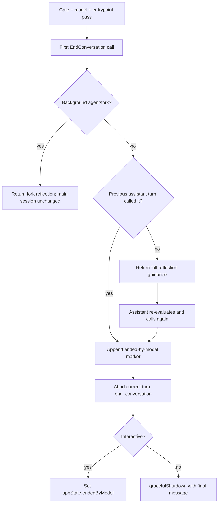

# Conversation termination

Claude Code `2.1.215` adds an `EndConversation` tool that can permanently end the current conversation under a narrow, gated policy. The implementation is a session lifecycle, not just a model-facing descriptor: it requires a second reflective call, records an `ended-by-model` JSONL marker, restores that state on resume, blocks later turns, and routes the user toward a fresh session or `/clear`.

`EndConversation`, `endedByModel`, and the transcript marker are absent from the retained `2.1.143` baseline at commit `5e66946`.

## Source anchors

| Semantic alias | Approximate location in `cli.renamed.js` | Exact string or symbol | Meaning |
|---|---:|---|---|
| EndConversationName | [~259,224](../../claude-code-pkg/src/entrypoints/cli.renamed.js#L259224) | `END_CONVERSATION_TOOL_NAME = "EndConversation"` | Deferred model-facing tool name. |
| EndConversationGate | [~412,735-412,768](../../claude-code-pkg/src/entrypoints/cli.renamed.js#L412735) | `modelMeetsEndConversationFloor`, `tengu_umber_kestrel`, `allowedEntrypoints` | Model, feature, and entrypoint visibility checks. |
| ReflectionHistoryCheck | [~412,817](../../claude-code-pkg/src/entrypoints/cli.renamed.js#L412817) | `lastAssistantTurnCalledEndConversation` | Requires a prior assistant turn containing the same tool call. |
| EndConversationDescriptor | [~412,859](../../claude-code-pkg/src/entrypoints/cli.renamed.js#L412859) | `EndConversationTool = Ai({...})` | Empty input schema, two-call execution, abort, and final result. |
| EndedMarkerWriter | [~581,801](../../claude-code-pkg/src/entrypoints/cli.renamed.js#L581801) | `markSessionEndedByModel` | Appends an `ended-by-model` record to the session JSONL. |
| EndedMarkerLoader | [~581,158-581,815](../../claude-code-pkg/src/entrypoints/cli.renamed.js#L581158) | `endedSessions`, `applyEndedByModelOnResume` | Rehydrates the ended state from transcript metadata. |
| DirectResumeRestore | [~924,000](../../claude-code-pkg/src/entrypoints/cli.renamed.js#L924000) | `applyEndedByModelOnResume(Urt(ur), setAppState)` | Applies marker-derived terminal state on the direct interactive resume path. |
| PickerResumeRestore | [~937,500](../../claude-code-pkg/src/entrypoints/cli.renamed.js#L937500) | `applyEndedByModelOnResume(Urt(Le), R)` | Applies the same state after picker/search resume. |
| EndedCommandGuard | [~351,291](../../claude-code-pkg/src/entrypoints/cli.renamed.js#L351291) | `isSlashCommandBlockedByEndedByModel` | Blocks prompt commands after termination, with a small local-command allowlist. |
| ClearRecovery | [~498,866](../../claude-code-pkg/src/entrypoints/cli.renamed.js#L498866) | `endedByModel: false` | `/clear` starts a new conversation and clears the live ended flag. |

## Availability boundary

The tool is visible only when all source-visible gates pass:

1. The current model is at least Opus 4.8, Sonnet 5, Fable 5, or Mythos 5.
2. GrowthBook key `tengu_umber_kestrel` is enabled. A boolean `true` uses the default entrypoint scope; an object can supply a regular-expression `scope`.
3. The current entrypoint matches the configured scope. The shipped default is `^cli$` (case-insensitive).
4. A separate runtime exclusion (`Y8n()`) is false.

The descriptor is deferred, so eligible sessions initially receive only its name/hint and load the full schema and guidance through `ToolSearch`. It is marked read-only but not concurrency-safe, and its permission check returns `allow`; the safety boundary is the strict built-in guidance and the two-call reflection sequence rather than a normal filesystem/process approval.

## Two-call termination protocol



The first call cannot terminate the session. It returns a reflection prompt that repeats the narrow use criteria and asks the model to reconsider. `lastAssistantTurnCalledEndConversation()` then scans history backwards. It looks for the prior assistant turn containing `EndConversation`; a substantive user turn breaks qualification, while user frames that consist only of tool results are handled as part of the assistant/tool exchange rather than automatically treated as a new human decision. Thus the second invocation must be the model's reconsidered follow-up, not a call made after fresh user input.

Background agent/fork calls are always a no-op for the parent conversation. They receive a separate message explaining that a fork cannot end either itself through this path or the main conversation.

## Persistence and resume

Before changing live terminal state, the runtime best-effort appends:

```text
{ type: "ended-by-model", timestamp, sessionId }
```

The order is marker attempt first, then turn abort (`end_conversation`), then the interactive state transition or non-interactive shutdown. Marker write failure is logged but does not cancel those later steps. The JSONL loader collects marked session IDs in `endedSessions` unless the same `Y8n()` runtime exclusion that disables the tool is active. This prevents a disabled runtime surface from reapplying marker state while that exclusion is in force.

Both interactive restoration routes explicitly apply the collected metadata:

- direct/explicit resume calls `applyEndedByModelOnResume(Urt(ur), setAppState)` after the selected session state and identity are restored;
- the resume picker/search route calls `applyEndedByModelOnResume(Urt(Le), R)` after loading the chosen conversation.

This makes the state durable across process restarts and consistent across the two interactive resume entrypoints instead of relying on the final tool result remaining in active context.

The marker belongs to the original transcript. `/clear` creates a new conversation/session identity and resets the live flag; it does not erase the old transcript or make that original session un-ended.

## Behavior after termination

- The interactive query entry checks `endedByModel` before starting another turn and emits: `Claude ended this conversation. Start a new session (or /clear) to continue.`
- Prompt-style slash commands are blocked. The local-command allowlist is `clear`, `resume`, `help`, `exit`, and `feedback`.
- Manual compaction rejects the session for the same reason.
- Opening/backgrounding the conversation into the agent view is blocked.
- Non-interactive mode aborts the turn and calls `gracefulShutdown(1, "other", { finalMessage })`, so successful model-requested termination still exits the headless process with code 1.

The explicit `/clear` recovery route is important: termination prevents further work in that conversation but does not lock the entire Claude Code process or delete the user's history.

## Caveats

- This page documents runtime mechanics, not an expansion of the built-in policy. The shipped guidance intentionally limits use to exceptional circumstances and explicitly excludes ordinary task failure, frustration, content-policy refusal, and safety emergencies.
- The feature is rollout- and entrypoint-gated. Its presence in `cli.renamed.js` does not imply every CLI session exposes it.
- Persistence is best-effort: an append failure permits the current process to terminate the conversation but can leave no durable marker for a later process to restore.
- Approximate line anchors are specific to `2.1.215`; use the exact strings above for later builds.

## Related docs

- [CLI main paths](cli-main-paths.md)
- [Session resume and transcripts](../04-sessions-persistence-remote/session-resume-and-transcripts.md)
- [Data models and frame schemas](../04-sessions-persistence-remote/data-models-and-frame-schemas.md)
- [Tool inventory and schemas](../03-tools-integrations-security/tool-inventory-and-schemas.md)
- [Headless streaming and resilience](../02-context-model-loop/headless-streaming-and-resilience.md)
