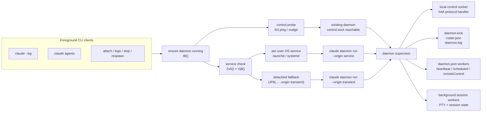
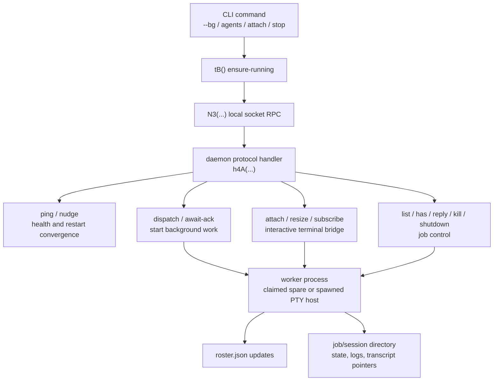
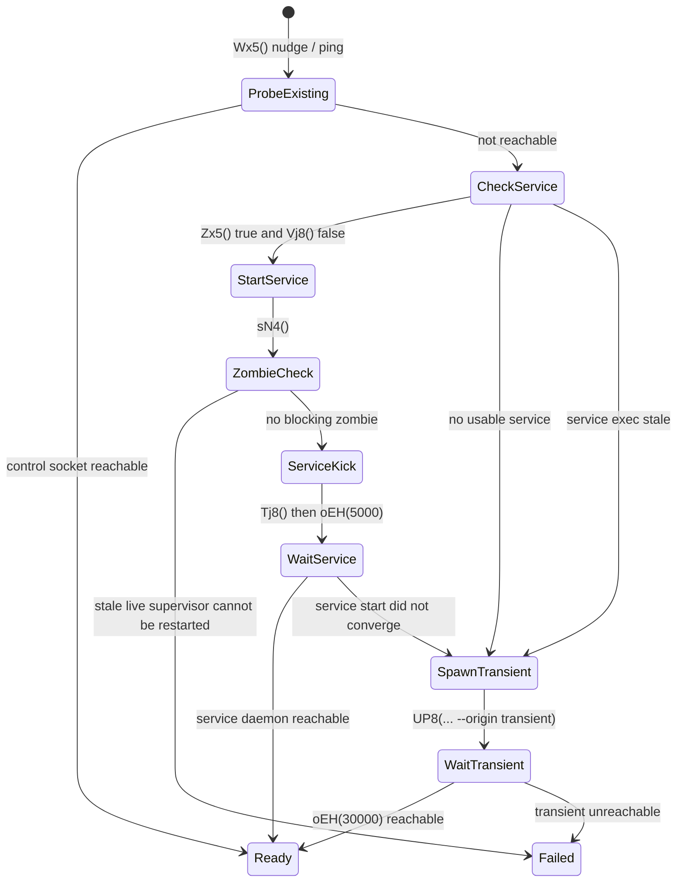
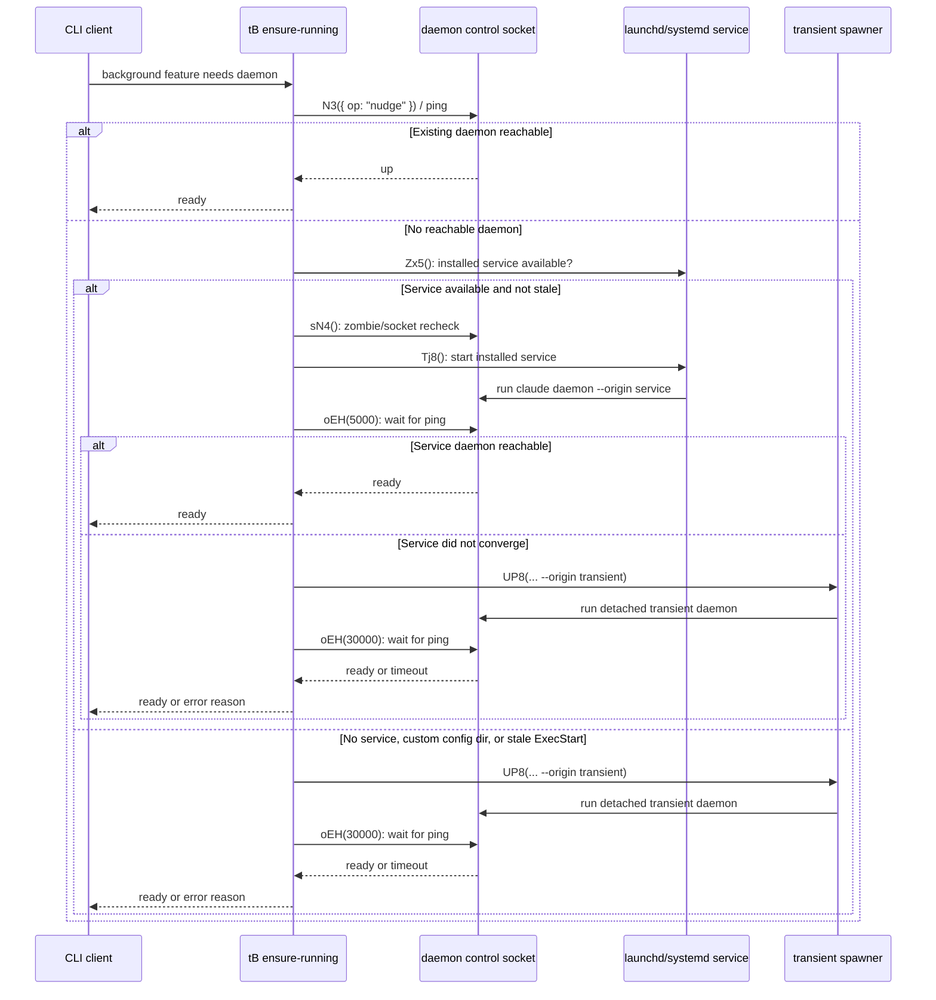
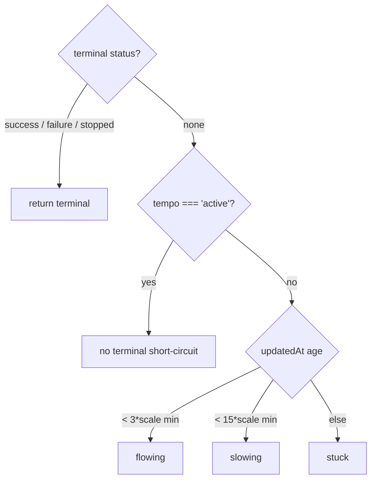

# Daemon and background service

This page explains what `claude daemon` is for, how it is started, and how it interacts with background jobs, workers, and the normal CLI runtime.

Short version: the daemon is the **long-lived local supervisor process** used by Claude Code background features. It is not a separate model runtime architecture; it is an operational wrapper around the same core session/tool/runtime surfaces.

## Source anchors

| Semantic alias | String or symbol | Meaning |
| --- | --- | --- |
| BootstrapDaemonFastPath | `OuterBootstrap` fast paths include daemon/background helpers | Daemon/background handling can run before full main interactive dispatch. |
| DaemonLabelSwitch | `pj(){return isDaemonServiceInstallEnabled()?"daemon":"background service"}` | UI/UX naming toggles between daemon vs background-service wording. |
| DaemonHintInErrors | ``run 'claude daemon ${H}'`` | Error/status copy points users to daemon commands. |
| DaemonServiceUnitTemplate | `Description=Claude Daemon` | Built-in systemd/launchd service template exists. |
| DaemonServiceExec | `ExecStart=... daemon --json-path ... --log-file ... --origin service` | Service starts daemon with state/log paths and service origin tag. |
| DaemonServiceStart | `Tj8()` / `systemctl --user start com.anthropic.claude-daemon.service` | The CLI kicks the installed service instead of directly owning the daemon process. |
| DaemonEnsureRunning | `async function tB(H={})` | Main ensure-running state machine: probe existing daemon, prefer service, fall back to transient spawn. |
| DaemonServiceInstalledCheck | `Zx5()` checks `CLAUDE_CONFIG_DIR`, launchd/systemd availability, and installed service status | Service mode is only used when the per-user singleton service is available for the default config dir. |
| DaemonTransientSpawn | `UP8(["daemon", "run", ... "--origin", "transient"])` | Fallback path starts an on-demand detached daemon outside the OS service manager. |
| DaemonInstallPrompt | `Install as a service now? [y/N/never, or 'once' just for now]` | Cold-start UX asks whether to install persistent service. |
| DaemonReachabilityCheck | `daemon did not become reachable ... check 'claude daemon status'` | Health probe after install/spawn; explicit status command guidance. |
| DaemonLockFile | `daemon.lock` | Single-supervisor locking and stale-process checks. |
| DaemonProcValidation | `/proc/<pid>/cmdline` includes `claude daemon` | Prevents false positives when checking running process identity. |
| DaemonSpawnFallback | `WMI spawn failed ... daemon will not survive SSH/terminal close` | Windows fallback path and survivability caveat. |
| DaemonServiceStaleExec | `daemon service exec path is stale ... Run 'claude daemon install' to repair.` | Detect/repair stale service executable path after upgrades/moves. |
| DaemonStatusWarnings | `run \`claude daemon stop\` to reap them` | Status output includes orphan/roster cleanup guidance. |
| DaemonControlProtocol | `h4A(...)` handles `ping`, `nudge`, `dispatch`, `attach`, `shutdown`, `list`, `kill`, `reply` | The daemon's actual work is exposed through the local control socket protocol. |
| DaemonServiceCLI | `Install as a launchctl/systemd service (persists across reboot)` | User-facing help states the service's persistence contract. |
| DaemonTransientIdleExit | `origin === "transient"` idle-exit branch | Transient daemons exit after clients/jobs drain; service daemons are managed by the OS service manager. |
| DaemonTelemetryFamily | `tengu_bg_daemon_*`, `tengu_bg_orphan_reap`, `tengu_bg_dispatch_*` | Operational telemetry families around daemon lifecycle. |

## Bundle modules in `cli.renamed.js`

| Semantic alias | Loader line | Representative renamed exports | Atlas entry |
|---|---:|---|---|
| `WorktreeDaemonJobScheduler` | 686644 | `summarizeEvent`, `stateBucket`, `spawnOrigin`, `sortJobs`, `seedLastJobs`, `repoGroup`, `repoGroupLabel`, `rollupChildColor`, `rollupJobColor`, `pruneMap`, `formatJobAge`, `jobLabel`, `deriveActivity`, `deriveBand`, `needsRespawn`, `labelReplaceFrame` | [Bundle module map — git, worktree, and daemon](../99-research-atlas/module-map-from-renamed-cli.md#git-worktree-and-daemon) |
| `GitRefWatcher` | 54518 | `resolveRef`, `resolveGitDir`, `resetGitFileWatcher`, `removeWatchedRepo`, `readWorktreeHeadSha`, `readRawSymref`, `readGitHead`, `onRepoBranchChange` | [Bundle module map — git, worktree, and daemon](../99-research-atlas/module-map-from-renamed-cli.md#git-worktree-and-daemon) |

## What the daemon does

The daemon acts as a **local control-plane supervisor** for background work:

- Keeps background workers available without requiring a fresh full CLI startup for each job.
- Owns process lifecycle bookkeeping (`daemon.lock`, roster/control state, log path, stale/zombie checks).
- Coordinates start/stop/status/install/uninstall style operations.
- Bridges “service installed” mode and “one-shot/transient spawn” mode.
- Emits operational telemetry for diagnostics and recovery decisions.

## What the service is for

The **service** is not the daemon's business logic. It is the operating-system integration that starts and supervises the daemon process.

Think of the split as:

| Layer | Responsibility | Source-visible behavior |
|---|---|---|
| Daemon process | Owns the control socket, dispatches/attaches/kills/replies to background sessions, adopts workers, watches `daemon.json`, writes `roster.json` and `daemon.log`. | `h4A(...)` handles socket ops such as `dispatch`, `attach`, `list`, `kill`, `reply`, and `shutdown`. |
| Service | Lets the OS start/stop/restart the daemon as a per-user background service. | The generated unit runs `claude daemon ... --origin service`; help describes install as `launchctl/systemd` service that “persists across reboot”. |
| Transient daemon | Temporary fallback started by a CLI client when no installed service is usable. | `UP8(...)` launches `daemon run --origin transient`; transient origin can idle-exit after clients/jobs drain. |

The practical purpose of the service is to make background features reliable when there is no foreground terminal keeping the process alive:

- **Persistence**: keep the daemon available across terminal close, SSH disconnect, logout, and reboot when the host service manager supports it.
- **Autostart/control**: expose `claude daemon install/start/restart/stop/uninstall/logs/status` as lifecycle operations around the OS service.
- **Stable singleton**: install only for the default config directory; the service is treated as a per-user singleton rather than one daemon per arbitrary `CLAUDE_CONFIG_DIR`.
- **Upgrade repair**: detect a stale or deleted service executable path and instruct users to rerun `claude daemon install`.
- **Durability over fallback**: avoid relying on transient detached processes, which can be killed by terminal/session managers such as Linux logind with `KillUserProcesses=yes`.

So: **daemon = the supervisor that does the background-session work; service = the OS-level wrapper that keeps that supervisor around.**

### Process ownership diagram

### Control-plane diagram

## Runtime role in the bigger architecture

The daemon is operational plumbing, not a separate product runtime layer:

- It supervises background execution.
- Session/tool/model behavior still comes from the same Claude Code core runtime surfaces.
- Other docs already note this architectural stance:
  - runtime-level note that operational boundaries are embedded rather than daemon-only (`00-start-here/system-architecture.md`)
  - scheduler note that cron/scheduled work is in-session and not an always-on separate scheduler daemon (`06-agents-automation/agent-runtime-scheduling-and-completion.md`)

## Startup modes

Claude Code appears to support two practical daemon startup paths:

1. **Persistent service mode** (systemd/launchd style)
   - Uses generated unit/plist-like template with `ExecStart ... daemon --json-path ... --log-file ... --origin service`.
   - Survives terminal close/reboot according to host service manager behavior.
   - Is preferred by the ensure-running path when service support is present, the service is installed, and the service executable is not stale.

2. **Transient spawn mode** ("once" / cold start fallback)
   - Spawns detached process without persistent service install.
   - On some fallback paths (notably Windows WMI fallback), survivability across SSH/terminal lifecycle is reduced.
   - Is used when service install is unavailable, dismissed, stale, or not selected by the user.

## Ensure-running state machine

`tB(H={})` is the key source-level decision point used before background dispatch/attach paths. In simplified form:

The same branch as a client/service sequence:

Important details in that flow:

- Existing daemon wins first: `Wx5()` tries the control socket with `nudge`, and waits through short `restarting`, timeout, or connection-race windows before declaring it down.
- Service is preferred but not mandatory: `Zx5()` returns false when `CLAUDE_CONFIG_DIR` is set, when launchd/systemd support is absent, or when the service is not installed.
- Stale service files are repaired by the user-visible path: `Vj8()` reads the service file's `ExecStart`; if the binary path no longer exists, the CLI warns and falls back to transient spawn.
- Transient is intentionally less durable: the code warns on Linux/WSL if `KillUserProcesses=yes`, because SSH logout can kill the transient daemon and its background jobs.
- Service mode and transient mode both run the same daemon supervisor; the difference is who owns its lifecycle.

## Lifecycle and safety checks

Observed safeguards include:

- **Locking**: `daemon.lock` prevents competing supervisors.
- **PID/proc-start validation**: checks process identity and start timestamp before trusting lock metadata.
- **Command-line identity validation**: `/proc/.../cmdline` contains `claude daemon`.
- **Reachability probing**: install/spawn waits for daemon to become reachable; advises `claude daemon status` on failure.
- **Stale exec detection**: warns when service points to deleted/moved binary and suggests reinstall repair.
- **Orphan handling**: status/help text warns about workers in roster with no live supervisor and recommends reaping via stop.

## Operational UX and commands

Source-visible text indicates daemon command family includes at least:

- `claude daemon status` (health/details)
- `claude daemon stop` (stop + reap guidance)
- `claude daemon install` / `uninstall` (persistent service lifecycle)

The user-facing install prompt supports:

- `yes` (install service)
- `once` (transient run)
- `never` (dismiss install prompt path)

## Background workers and roster behavior

Daemon status copy references:

- workers roster counts
- `roster.json` freshness
- `daemon.log` size/path
- configured worker count warnings in `daemon.json`

This implies daemon ownership of worker orchestration metadata and long-lived bookkeeping beyond a single foreground command invocation.

## Failure modes you should expect

- Service installs but daemon not reachable within timeout window.
- Service executable path becomes stale after binary upgrades/moves.
- Spawn method fallback on Windows (WMI failure) can reduce detach robustness.
- Supervisor absent while roster still lists workers (requires reap/stop cleanup).

## Practical takeaway

When users ask “what is daemon for?” in Claude Code:

- Think **local background supervisor + service integration + worker lifecycle hygiene**.
- Not “a different model loop.”
- Use daemon commands (`status`, `stop`, `install/uninstall`) as the operational control surface.

## Job scheduler internals (`WorktreeDaemonJobScheduler`)

The `WorktreeDaemonJobScheduler` module (loader at `cli.renamed.js:686644`, body at `cli.renamed.js:682085`) powers the daemon's Fleet view: the live, filter-and-search-able TUI of background agents the daemon supervises. This section traces the activity classifier, sort order, color rollup, dispatch parser, and auto-relaunch policy.

### Job shape

A scheduler job carries:

- `id`, `sessionId`, `template`, `intent`, `routine`, `cwd`, `originCwd`.
- `state` — last reported worker state: `{state, detail, tempo, color, updatedAt, firstTerminalAt, children, output, ...}`.
- `inFlight` — set of in-flight task kinds (`session_cron`, etc.).
- `tempo` — observed pace: `"active" | "blocked" | "idle"`.
- `template` — name of the agent template that spawned the job.

### Activity classifier (`deriveActivity`)

- `scale = 1` for `tempo === "active"`, `5` for everything else — active jobs get tighter staleness windows.
- A terminal `success` is suppressed for self-driving jobs (loops, routines, session crons) so they stay visible as long-lived.
- If a job has all-MERGED PR children, it becomes `success` regardless of age.

`deriveBand(state, tempo)` collapses activity into Fleet bands: `active | completed | blocked`. The Fleet view groups rows by band before sorting.

`stateBucket(jobState, prMap, tempo)` returns the displayed bucket: `working | done | blocked | review`. The `review` bucket fires when a non-self-driving job has open child PRs whose check rollup is `error` or unapproved-warning.

`needsRespawn(job)` is true when the job is in a terminal `failure`/`stopped` state but the underlying worker process is still alive (`ij(state)`); the Fleet view shows a respawn affordance.

### Sort order

| Function | Key |
|---|---|
| `effectiveSortOrder(state)` | `state.sortOrder ?? Date.parse(state.createdAt)` — explicit sort wins over creation time. |
| `effectiveStateSortOrder(state, bucket)` | `state.stateSortOrder ?? Date.parse(bucket === "done" ? firstTerminalAt : updatedAt)` — done jobs sort by completion time, others by last update. |
| `sortJobs(jobs)` | Stable ascending by `effectiveSortOrder`. |

### Color rollup

The Fleet view shows a primary color per job and per child group. Rules:

- `glyphColor(state, activity, tempo)` — terminal activities map success→`success`, failure→`error`, stopped→`inactive`. Blocked / waiting → `warning`. Active/shell → no color. Other → dim.
- `rollupJobColor(initial, children)` — picks the highest-priority color across the job's children using the `eg4` priority map (priority increases with severity).
- `childStatusColor(prState)` — PR statuses become colors: `error` stays as `warning` (because failing CI is a warning, not a hard fail at the rollup level), `success`/`merged`/`closed` flow through.
- `rollupChildColor(rows)` — picks the highest-priority color across PR rows using the `js5` priority map.
- `pyH(row)` — true for "frame" kind rows; frame rows are excluded from color rollup.

### Status rendering (`actionableStatus`)

For each child PR row the scheduler emits a status badge list:

| PR state | Badge sequence |
|---|---|
| `MERGED` | `merged` (color `merged`) |
| `CLOSED` | `closed` (color `inactive`) |
| `OPEN` with `failed > 0` checks | `✗ failed/total` (color `error`) |
| `OPEN` with `pending > 0` | `passed/total` (color `warning`) |
| `OPEN` with all passing | `✓` (color `success`) |
| review `APPROVED` | `approved` (color `success`) |
| review `CHANGES_REQUESTED` | `✗` (color `error`) |
| review `REVIEW_REQUIRED` | `needs review` |

Empty badges fall back to the lowercase PR state.

### Query language (`parseQuery`)

The Fleet search box accepts a small DSL parsed by `parseQuery`:

| Token | Field |
|---|---|
| `a:<template>` | filter by agent template |
| `s:<state>` | filter by state |
| `o:<output>` | filter by output channel |
| `#123` or `<url>/pull/123` | filter by PR number (`parsePrRef` + `buildPrRefRe`) |
| `<frame-id>` | filter by frame (`myH(token)`) |
| anything else | substring text match (case-insensitive) |

Match helpers:

- `jobMatchesPr(job, prNumber, regex)` — true if any child has the PR number, or any output URL matches the regex.
- `jobMatchesCwd(job, cwd)` — true if `cwd` is the same path or an ancestor of `spawnOrigin(job)`.
- `jobMatchesFrame(job, frameId)` — true if any child frame ID or any output token resolves to the same frame.

### Dispatch parser (`parseDispatch`)

When the user types a new dispatch into the Fleet view, `parseDispatch(input, templates, cwds, routines)` resolves:

- `@<template>` mentions to a template object (first wins).
- `@<routine>` mentions to a routine name.
- `@<cwd-key>` mentions to a cwd from the configured map.
- The first whitespace-delimited token to a template by name (case-insensitive).

Returns `{template, intent, matched, cwd, routine}`. `matched: false` means no explicit template/routine was found and the default template fallback applies.

`seedLastJobs(jobs)` snapshots `sortJobs(jobs)` into `_i6` for the next render so transitions animate smoothly.

### Spawn origin & repo grouping

- `spawnOrigin(job)` — returns `job.originCwd`, or extracts the spawning directory from a `<root>/.claude/worktrees/<slug>/...` cwd, or falls back to `job.cwd`.
- `repoGroup(job)` — `findCanonicalGitRoot(spawnOrigin(job))` or the origin itself.
- `repoGroupLabel(root)` — short, user-friendly label via `PT(root)`.

The Fleet view groups jobs by repo group, with one origin folder per group.

### Self-driving detection

- `isLoopJob(job)` — intent or initial prompt starts with `/loop`.
- `isSelfDriving(job)` — true for jobs with a routine, an in-flight `session_cron`, or a `/loop` intent. Self-driving jobs are treated specially in `deriveActivity` (terminal success is suppressed) and `stateBucket` (PR review bucket is suppressed).

### Auto-relaunch policy

Three constants govern auto-relaunch (re-attaching to crashed/exited workers):

| Constant | Meaning |
|---|---|
| `AUTO_RELAUNCH_UNFOCUSED_MS` | Idle window before an unfocused Fleet view is allowed to trigger auto-relaunch. |
| `AUTO_RELAUNCH_MIN_INTERVAL_MS` | Hard rate limit between auto-relaunch attempts. |
| `AUTO_RELAUNCH_ENV_KEY` | Environment variable that disables auto-relaunch entirely. |

Stop / delete actions go through `zs5(refresh, kill, mutate)` which writes a `stopped` state, calls `TJH(id, state)` to kill the worker, and emits `tengu_bg_agent_action` telemetry (`action: "stop"|"delete"`). Errors during kill surface back to the Fleet UI as inline messages.

### Event summarization (`summarizeEvent`)

The right-hand "last event" column shows a short summary of the worker's most recent transcript entry. `summarizeEvent(rawJsonl)`:

- Parses one JSONL line.
- For assistant messages: returns the first text block; if none, formats the first non-tool-search `tool_use` (special-cased for `REPL` to use the description).
- For user messages: strips `<system-reminder>` / `<task-notification>` blocks via `Nd4(...)` and returns the first non-empty line prefixed `>`; if the user message is a tool error, returns `✗ <error preview>`.

`flattenDetail(...)` is the helper used for inline detail rendering — it strips reminder/notification tags, removes HTML, and collapses whitespace.

### Mount entry

`mountFleetView(daemonClient, options)` is the daemon-side entry point that constructs an Ink `FleetView` component (function at `cli.renamed.js:683947`), wires up the data subscriptions, and returns a teardown handle. The daemon control protocol (`list`, `nudge`, `dispatch`, `kill`) flows through this view; see "Operational UX and commands" above for the user-visible commands.

## Related docs

- [CLI main paths](cli-main-paths.md)
- [Runtime lifecycle architecture](architecture.md)
- [Prompt template catalog](../02-context-model-loop/prompt-template-catalog.md)
- [Session API, events, and storage](../04-sessions-persistence-remote/session-api-events-and-storage.md)
- [Agent runtime, scheduling, and completion](../06-agents-automation/agent-runtime-scheduling-and-completion.md)
- [Diagnostics and debug logs](../05-hosted-agent-ops/diagnostics-and-debug-logs.md)
- [Telemetry and tracing](../05-hosted-agent-ops/telemetry-and-tracing.md)
