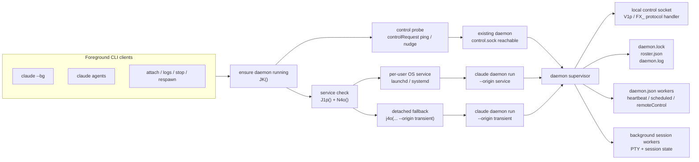
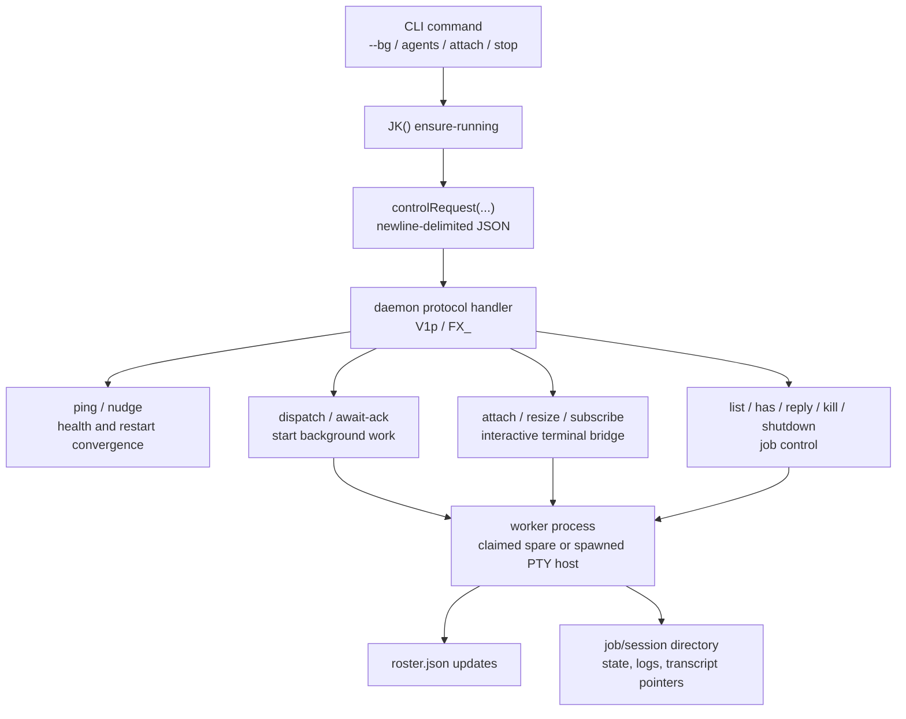
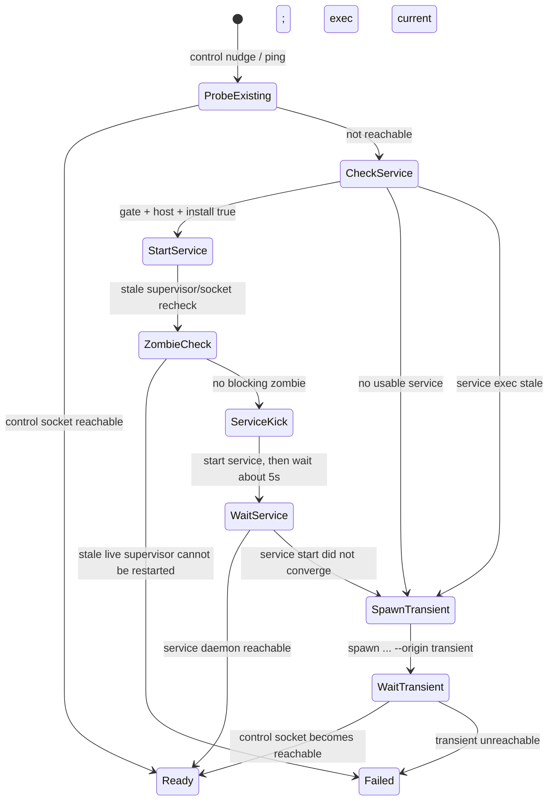
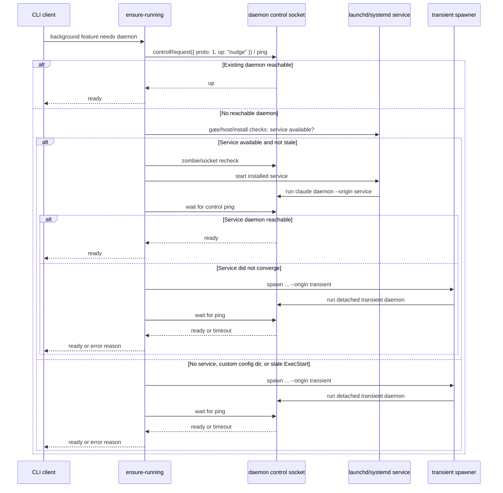
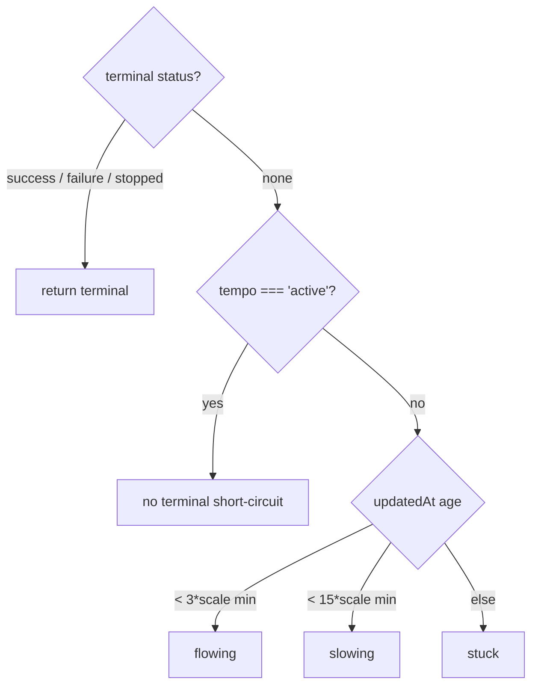

# Daemon and background service

This page explains what `claude daemon` is for, how it is started, and how it interacts with background jobs, workers, and the normal CLI runtime.

Short version: the daemon is the **long-lived local supervisor process** used by Claude Code background features. It is not a separate model runtime architecture; it is an operational wrapper around the same core session/tool/runtime surfaces.

## Source anchors

| Semantic alias | String or symbol | Meaning |
| --- | --- | --- |
| BootstrapDaemonFastPath | `ZIS()`, `vel(t)`, `cli_daemon_path`, `cli_bg_path` | Daemon/background handling runs before the normal `UkS()` import. |
| DaemonCli | `daemonMain` | Parses user-facing daemon operations and starts/probes the supervisor. |
| DaemonSupervisor | `krm()` at ~981,900 | Owns locking, auth, manager/workers, idle/takeover, upgrade, and shutdown. |
| DaemonLabelSwitch | `bgSupervisorNoun()` / `isDaemonServiceInstallEnabled()` | UI/UX naming toggles between daemon vs background-service wording. |
| DaemonHintInErrors | ``run 'claude daemon ${H}'`` | Error/status copy points users to daemon commands. |
| DaemonServiceUnitTemplate | `Description=Claude Daemon` | Built-in systemd/launchd service template exists. |
| DaemonServiceExec | `ExecStart=... daemon --json-path ... --log-file ... --origin service` | Service starts daemon with state/log paths and service origin tag. |
| DaemonServiceStart | `$4o()` / `systemctl --user start com.anthropic.claude-daemon.service` | The CLI kicks the installed service instead of directly owning the daemon process. |
| DaemonEnsureRunning | `JK()` around `controlRequest({ proto: BG_PROTO, op: "nudge" })` | Probes an existing daemon, conditionally prefers a service, and can fall back to transient spawn. |
| DaemonServiceInstalledCheck | `J1p()` checks `CLAUDE_CONFIG_DIR`, launchd/systemd availability, and installed service status | Service mode is only used when the per-user singleton service is available for the default config dir. |
| DaemonTransientSpawn | `j4o(["daemon", "run", ... "--origin", "transient"])` | Fallback path starts an on-demand detached daemon outside the OS service manager. |
| DaemonInstallPrompt | `Install as a service now? [y/N/never, or 'once' just for now]` | Cold-start UX asks whether to install persistent service. |
| DaemonReachabilityCheck | `daemon did not become reachable ... check 'claude daemon status'` | Health probe after install/spawn; explicit status command guidance. |
| DaemonLockFile | `daemon.lock` | Single-supervisor locking and stale-process checks. |
| DaemonProcValidation | `/proc/<pid>/cmdline` includes `claude daemon` | Prevents false positives when checking running process identity. |
| DaemonSpawnFallback | `WMI spawn failed ... daemon will not survive SSH/terminal close` | Windows fallback path and survivability caveat. |
| DaemonServiceStaleExec | `daemon service exec path is stale ... Run 'claude daemon install' to repair.` | Detect/repair stale service executable path after upgrades/moves. |
| DaemonStatusWarnings | `run \`claude daemon stop\` to reap them` | Status output includes orphan/roster cleanup guidance. |
| DaemonControlClient | `controlRequest(e, t)` at ~745,600 | Writes one newline-delimited JSON request and resolves the first response line; default timeout is 5 seconds. |
| DaemonControlServer | `V1p()` / `FX_()` at ~762,300 | Binds the local socket, frames requests by newline, validates protocol/schema/peer/auth, and dispatches operations. |
| DaemonProtocolVersion | `BG_PROTO = 1`, `BG_PROTO_MIN = 1`, `EPROTO` | Rejects unsupported protocol versions with restart guidance. |
| DaemonLease | `openDaemonLease()`, `{ proto: BG_PROTO, op: "lease", client }` | Persistent client connection that pins transient-daemon liveness and reconnects after closure. |
| DaemonServiceCLI | `isDaemonServiceInstallEnabled()`, `NIS`, `FIS` | Service commands/help are feature-gated; some builds/accounts expose only on-demand operation. |
| DaemonTransientIdleExit | `Q = () => leaseCount() + liveHandleCount()` in `krm()` | Transient liveness is pinned by client leases and live background handles, not configured registry workers. |
| DaemonDisplacementCleanup | `close({ displaced })`, `skipUnlink`, `leaving successor's control.sock in place` | A displaced supervisor does not unlink a successor's socket or lock state. |
| DaemonTelemetryFamily | `tengu_bg_daemon_*`, `tengu_bg_orphan_reap`, `tengu_bg_dispatch_*` | Operational telemetry families around daemon lifecycle. |
| AgentJsonSurface | `claude agents --json`, `--all`, `waitingFor` | Scriptable active/completed session roster and blocked-on state. |
| CorporateProcessWrapper | `processWrapper`, `CLAUDE_CODE_PROCESS_WRAPPER` | Required launcher prefix for the supervisor, workers, and covered background self-spawns. |
| BackgroundSessionCommand | `name: "background"`, `spawnBackgroundFork()`, `spawnBgSession()` | Flushes/snapshots the live session and dispatches a resumable daemon worker [~768,500–769,300](../../claude-code-pkg/src/entrypoints/cli.renamed.js#L768500). |
| StopBackgroundCommand | `name: "stop"`, `lxo()`, `daemonDetachApc()` | Marks the current job stopped, detaches its host, and shuts the worker down without deleting retained state [~564,789–564,860](../../claude-code-pkg/src/entrypoints/cli.renamed.js#L564789). |

## Bundle modules in `cli.renamed.js`

| Semantic alias | Loader line | Representative renamed exports | Atlas entry |
|---|---:|---|---|
| `WorktreeDaemonJobScheduler` | 686644 | `summarizeEvent`, `stateBucket`, `spawnOrigin`, `sortJobs`, `seedLastJobs`, `repoGroup`, `repoGroupLabel`, `rollupChildColor`, `rollupJobColor`, `pruneMap`, `formatJobAge`, `jobLabel`, `deriveActivity`, `deriveBand`, `needsRespawn`, `labelReplaceFrame` | [Bundle module map — git, worktree, and daemon](../99-research-atlas/module-map-from-renamed-cli.md#git-worktree-and-daemon) |
| `GitRefWatcher` | 54518 | `resolveRef`, `resolveGitDir`, `resetGitFileWatcher`, `removeWatchedRepo`, `readWorktreeHeadSha`, `readRawSymref`, `readGitHead`, `onRepoBranchChange` | [Bundle module map — git, worktree, and daemon](../99-research-atlas/module-map-from-renamed-cli.md#git-worktree-and-daemon) |

## What the daemon does

The daemon acts as a **local control-plane supervisor** for background work:

- Keeps background workers available without requiring a fresh full CLI startup for each job.
- Owns process lifecycle bookkeeping (`daemon.lock`, roster/control state, log path, stale/zombie checks).
- Coordinates start/stop/status/install/uninstall style operations.
- Bridges “service installed” mode and “one-shot/transient spawn” mode.
- Emits operational telemetry for diagnostics and recovery decisions.

The `2.1.215` agent view groups sessions into needs-input, working, and completed states. JSON mode can include completed rows with `--all`; waiting sessions expose what they are blocked on, and sandbox, MCP-input, and managed-settings prompts are classified as needing input rather than working.

## What the service is for

The **service** is not the daemon's business logic. It is the operating-system integration that starts and supervises the daemon process.

Think of the split as:

| Layer | Responsibility | Source-visible behavior |
|---|---|---|
| Daemon process | Owns the control socket, dispatches/attaches/kills/replies to background sessions, adopts workers, watches `daemon.json`, writes roster/log state, and enforces local protocol/auth checks. | `krm()` starts the manager; `V1p()`/`FX_()` handle control operations. |
| Service | When the service-install gate and host integration allow it, lets the OS start/stop/restart the daemon as a per-user background service. | Generated launchd/systemd material uses `--origin service`; `NIS` versus `FIS` controls whether install/start/restart help is exposed. |
| Transient daemon | On-demand supervisor started when no usable persistent service owns the role. | `--origin transient`; exits after its startup/idle grace when both leases and live background handles reach zero. |

The practical purpose of the service is to make background features reliable when there is no foreground terminal keeping the process alive:

- **Persistence**: when installation is enabled and supported, keep the daemon available across terminal close, SSH disconnect, logout, and reboot according to host service-manager behavior.
- **Autostart/control**: expose `claude daemon install/start/restart/stop/uninstall/logs/status` as lifecycle operations around the OS service.
- **Stable singleton**: install only for the default config directory; the service is treated as a per-user singleton rather than one daemon per arbitrary `CLAUDE_CONFIG_DIR`.
- **Upgrade repair**: detect a stale or deleted service executable path and instruct users to rerun `claude daemon install`.
- **Durability over fallback**: avoid relying on transient detached processes, which can be killed by terminal/session managers such as Linux logind with `KillUserProcesses=yes`.

So: **daemon = the supervisor that does the background-session work; service = the OS-level wrapper that keeps that supervisor around.**

### Process ownership diagram

```mermaid
flowchart LR
   subgraph Clients[Foreground CLI clients]
      BgFlag["claude --bg"]
      AgentsView["claude agents"]
      AttachStop["attach / logs / stop / respawn"]
   end

   Clients --> Ensure["ensure daemon running\nJK()"]
   Ensure --> Probe["control probe\ncontrolRequest ping / nudge"]
   Probe --> Existing["existing daemon\ncontrol.sock reachable"]

   Ensure --> ServiceCheck["service check\nJ1p() + N4o()"]
   ServiceCheck --> Service["per-user OS service\nlaunchd / systemd"]
   Service --> ServiceDaemon["claude daemon run\n--origin service"]

   ServiceCheck --> Transient["detached fallback\nj4o(... --origin transient)"]
   Transient --> TransientDaemon["claude daemon run\n--origin transient"]

   Existing --> Supervisor["daemon supervisor"]
   ServiceDaemon --> Supervisor
   TransientDaemon --> Supervisor

   Supervisor --> ControlSock["local control socket\nV1p / FX_ protocol handler"]
   Supervisor --> StateFiles["daemon.lock\nroster.json\ndaemon.log"]
   Supervisor --> ConfigWorkers["daemon.json workers\nheartbeat / scheduled / remoteControl"]
   Supervisor --> BgWorkers["background session workers\nPTY + session state"]
```

### Control-plane diagram

```mermaid
flowchart TD
   Client["CLI command\n--bg / agents / attach / stop"] --> Ensure["JK() ensure-running"]
   Ensure --> Socket["controlRequest(...)\nnewline-delimited JSON"]
   Socket --> Handler["daemon protocol handler\nV1p / FX_"]

   Handler --> Ping["ping / nudge\nhealth and restart convergence"]
   Handler --> Dispatch["dispatch / await-ack\nstart background work"]
   Handler --> Attach["attach / resize / subscribe\ninteractive terminal bridge"]
   Handler --> Control["list / has / reply / kill / shutdown\njob control"]

   Dispatch --> Worker["worker process\nclaimed spare or spawned PTY host"]
   Attach --> Worker
   Control --> Worker
   Worker --> Roster["roster.json updates"]
   Worker --> JobDir["job/session directory\nstate, logs, transcript pointers"]
```

## Runtime role in the bigger architecture

The daemon is operational plumbing, not a separate product runtime layer:

- It supervises background execution.
- Session/tool/model behavior still comes from the same Claude Code core runtime surfaces.
- Other docs already note this architectural stance:
  - runtime-level note that operational boundaries are embedded rather than daemon-only (`00-start-here/system-architecture.md`)
  - scheduler note that cron/scheduled work is in-session and not an always-on separate scheduler daemon (`06-agents-automation/agent-runtime-scheduling-and-completion.md`)

## Local control protocol

The daemon control socket is a local newline-delimited JSON protocol, not an in-process function call and not MCP:

1. `controlRequest(request, timeout)` connects to the control socket, writes `JSON(request) + "\n"`, and resolves the first complete response line. Its default timeout is 5,000 ms. Connection and timeout failures are classified (including `ENOCONN` and `ETIMEOUT`) so callers can distinguish an unavailable daemon from an operation-level error.
2. The server accepts one or more newline-framed requests, rejects a request buffer above 1 MiB, validates the peer UID where the platform exposes it, then validates request shape and protocol range.
3. The only supported protocol in this build is version 1 (`BG_PROTO_MIN = BG_PROTO = 1`). A mismatch returns `EPROTO` with guidance to restart the daemon so client and supervisor versions converge.
4. Operations include early health/lifecycle requests (`ping`, `nudge`, `yield`, `lease`, `leases`, `shutdown`) and manager requests such as `list`, `has`, `await-ack`, `dispatch`, `reply`, `kill`, `respawn-stale`, `resize`, `attach`, `ensure-spare`, `permission-response`, and `subscribe`.
5. Sensitive operations validate the daemon control key: `dispatch`, `reply`, `permission-response`, and keyed `attach` requests cannot rely solely on access to a serializable request shape. Peer-UID checks provide an additional local boundary where supported.

`openDaemonLease()` differs from a one-shot request: it keeps the socket open after sending `{ proto: 1, op: "lease", client }`. Closure removes the lease server-side, and the client attempts to reconnect after one second. `subscribeControl()` is likewise long-lived but receives a stream of newline-delimited events rather than resolving one response.

## Startup modes

Claude Code contains two practical daemon origins, but persistent service installation is conditional:

1. **Persistent service mode** (systemd/launchd style)
   - Uses generated unit/plist-like template with `ExecStart ... daemon --json-path ... --log-file ... --origin service`.
   - Survives terminal close/reboot according to host service manager behavior.
   - Is preferred by the ensure-running path only when the service-install feature is enabled, host support is present, the service is installed, and its executable is not stale.

2. **Transient spawn mode** (on-demand / cold-start fallback)
   - Spawns detached process without persistent service install.
   - On some fallback paths (notably Windows WMI fallback), survivability across SSH/terminal lifecycle is reduced.
   - Is used when persistent service operation is unavailable, disabled, dismissed, stale, or not selected.

The help strings themselves expose the gate: `NIS` contains `install`, `start`, and `restart`, while `FIS` says service install is disabled and the daemon runs on demand. The existence of launchd/systemd templates therefore proves implementation support, not unconditional product availability.

## Ensure-running state machine

The ensure-running path used before background dispatch/attach behaves, in simplified form, as follows:

```mermaid
stateDiagram-v2
   [*] --> ProbeExisting: control nudge / ping
    ProbeExisting --> Ready: control socket reachable
    ProbeExisting --> CheckService: not reachable

   CheckService --> StartService: gate + host + install true; exec current
    CheckService --> SpawnTransient: no usable service
    CheckService --> SpawnTransient: service exec stale

   StartService --> ZombieCheck: stale supervisor/socket recheck
    ZombieCheck --> Failed: stale live supervisor cannot be restarted
   ZombieCheck --> ServiceKick: no blocking zombie
   ServiceKick --> WaitService: start service, then wait about 5s
    WaitService --> Ready: service daemon reachable
    WaitService --> SpawnTransient: service start did not converge

   SpawnTransient --> WaitTransient: spawn ... --origin transient
   WaitTransient --> Ready: control socket becomes reachable
    WaitTransient --> Failed: transient unreachable
```

The same branch as a client/service sequence:

```mermaid
sequenceDiagram
   participant C as CLI client
   participant E as ensure-running
   participant D as daemon control socket
   participant S as launchd/systemd service
   participant T as transient spawner

   C->>E: background feature needs daemon
   E->>D: controlRequest({ proto: 1, op: "nudge" }) / ping
   alt Existing daemon reachable
      D-->>E: up
      E-->>C: ready
   else No reachable daemon
      E->>S: gate/host/install checks: service available?
      alt Service available and not stale
         E->>D: zombie/socket recheck
         E->>S: start installed service
         S->>D: run claude daemon --origin service
         E->>D: wait for control ping
         alt Service daemon reachable
            D-->>E: ready
            E-->>C: ready
         else Service did not converge
            E->>T: spawn ... --origin transient
            T->>D: run detached transient daemon
            E->>D: wait for ping
            D-->>E: ready or timeout
            E-->>C: ready or error reason
         end
      else No service, custom config dir, or stale ExecStart
         E->>T: spawn ... --origin transient
         T->>D: run detached transient daemon
         E->>D: wait for ping
         D-->>E: ready or timeout
         E-->>C: ready or error reason
      end
   end
```

Important details in that flow:

- Existing daemon wins first: the client tries the control socket with `nudge`/`ping` and accounts for short restart, timeout, and connection-race windows before declaring it down.
- Service is preferred but not mandatory: selection fails closed when installation is gated off, `CLAUDE_CONFIG_DIR` makes the singleton inappropriate, host launchd/systemd support is absent, or the service is not installed.
- Stale service files are repaired by the user-visible path: the CLI inspects the configured executable; if it no longer exists, it warns and can fall back to transient spawn.
- Transient is intentionally less durable: the code warns on Linux/WSL if `KillUserProcesses=yes`, because SSH logout can kill the transient daemon and its background jobs.
- Service mode and transient mode both run the same daemon supervisor; the difference is who owns its lifecycle.

When `processWrapper` or `CLAUDE_CODE_PROCESS_WRAPPER` is configured, the supervisor and covered workers must self-spawn through that launcher. The runtime records the launcher, retires an older raw supervisor, validates executability, and defers upgrade restarts if the wrapper is broken. `claude daemon status` exposes version/wrapper skew so an administrator can distinguish a pre-policy process from a launcher that failed to propagate the variable.

## Lifecycle and safety checks

Observed safeguards include:

- **Locking**: `daemon.lock` prevents competing supervisors.
- **PID/proc-start validation**: checks process identity and start timestamp before trusting lock metadata.
- **Command-line identity validation**: `/proc/.../cmdline` contains `claude daemon`.
- **Reachability probing**: install/spawn waits for daemon to become reachable; advises `claude daemon status` on failure.
- **Stale exec detection**: warns when service points to deleted/moved binary and suggests reinstall repair.
- **Orphan handling**: status/help text warns about workers in roster with no live supervisor and recommends reaping via stop.
- **Protocol compatibility**: control requests outside protocol version 1 fail with `EPROTO` rather than being interpreted optimistically.
- **Local caller checks**: peer UID is checked where supported, and sensitive operations require the daemon control key.
- **Request limits**: an unframed/oversized request is capped at 1 MiB.

## Transient idle and takeover

`krm()` computes the transient keep-alive count as:

`manager.leaseCount() + manager.liveHandleCount()`

If that sum is nonzero, the idle timer is canceled. Once it reaches zero, a transient supervisor uses a longer startup grace before it has ever had a client and the configured idle grace thereafter (5 seconds by default in this build). `daemon.json` registry workers are deliberately excluded: after loading the config, the supervisor logs that configured workers do not pin it and will be stopped when the last client lease and live background job are gone.

Takeover is asymmetric:

- A foreground/service-origin daemon may ask an existing transient daemon to `yield`, then waits up to five seconds for the lock to clear.
- A transient daemon never displaces an existing daemon.
- While running, a transient daemon periodically checks whether another PID owns `daemon.lock`. If displaced, it yields and closes the manager with `displaced: true`.
- Manager close propagates that state to `skipUnlink`, and shutdown rechecks ownership before removing the lock. The explicit invariant is to leave a successor's `control.sock` in place.

Shutdown telemetry records the cause (`upgrade`, `service_recall`, `displaced`, `yield`, `shutdown_op`, `idle_exit`, `bg_manager_failed`, or signal), uptime, lease count, and live-handle count. Registry-worker stop escalation (IPC/SIGTERM, then SIGKILL after five seconds) belongs to those worker owners and is not a universal process-shutdown rule.

## Operational UX and commands

Source-visible text indicates daemon command family includes at least:

- `claude daemon status` (health/details)
- `claude daemon stop` (stop + reap guidance)
- `claude daemon install` / `uninstall` (persistent service lifecycle)

The user-facing install prompt supports:

- `yes` (install service)
- `once` (transient run)
- `never` (dismiss install prompt path)

## `/background` and `/stop`

The interactive `/background [prompt]` command (alias `/bg`) is a handoff from the foreground REPL into the daemon worker model, not an instruction for the current model to “keep thinking quietly.” It requires agent-fleet support, transcript persistence, and a conversation that can produce a background seed. An already-backgrounded session simply detaches instead of spawning another worker.

### Handoff sequence

1. `deriveBackgroundSeed()` scans backward for the latest substantive user intent, optional explicit prompt, current user/AI title, color, and a short assistant detail. With no substantive turn and no explicit prompt, the command refuses.
2. The runtime classifies current tasks into work that can be checkpointed/carried over and work that must stop. When abandonable work exists, the UI names the count and asks before proceeding.
3. The adoption helper serializes transferable shells, cron entries, agents, and workflows into the new job directory; it pauses/aborts the corresponding parent-owned work and performs a best-effort checkpoint flush. `spawnBackgroundFork()` separately attempts a session-storage flush (two seconds for ordinary handoff). A keep-parent fork additionally persists the transcript leaf checkpoint, waits up to ten seconds, and refuses to dispatch on an incomplete flush. The ordinary exit-and-handoff branch continues after its shorter flush timeout, so the two paths do not have the same transactional guarantee.
4. The daemon launch argv resumes the materialized transcript with `--fork-session`, then carries session-added directories, CLI/session allow/deny rules, the selected model and effort, permission mode, agent definitions, and optional prompt/system context.
5. Worktree state is either handed to the worker or translated into an instruction to isolate away from a worktree still owned by the live parent. Session permission rules and paused-memory state are copied into job metadata.
6. After a successful daemon dispatch, carryable tasks are disowned by the parent and the foreground process exits with a short ID plus reattach hints. Failed dispatch retains/queues recovery state only in the explicit source-visible branches; it is not reported as a successful background session.

When the parent must remain live (the separate background-fork path), the implementation allocates a new session ID, copies the transcript to the job directory as `parent-transcript.jsonl`, and resumes the copy. Ordinary `/background` exits the parent after handoff instead.

### Stopping from inside the worker

`/stop` is advertised only when `isEnabled_8()` identifies a background session. It updates that job's persisted state to `stopped`, clears active/blocked/in-flight fields, records the first terminal timestamp, and emits the daemon-detach control sequence when attached through the PTY host. It then performs graceful shutdown with the normal resume hint suppressed.

The command description is precise: transcript and worktree are kept. `/stop` does not equal Fleet-view **delete**, does not remove the job directory, and does not clean a retained worktree. Those are separate daemon/Fleet operations. A text twin supports a bridge/non-interactive control request so the same worker self-stop semantics do not require the full TUI.

## Background workers and roster behavior

Daemon status copy references:

- workers roster counts
- `roster.json` freshness
- `daemon.log` size/path
- configured worker count warnings in `daemon.json`

This implies daemon ownership of worker orchestration metadata and long-lived bookkeeping beyond a single foreground command invocation.

## Failure modes you should expect

- Service installs but daemon not reachable within timeout window.
- Service executable path becomes stale after binary upgrades/moves.
- Spawn method fallback on Windows (WMI failure) can reduce detach robustness.
- Supervisor absent while roster still lists workers (requires reap/stop cleanup).
- Client/supervisor package skew (`EPROTO`; restart the daemon).
- A request that reaches the socket but fails peer/control-key validation.
- Failed foreground/service takeover when a transient daemon acknowledges `yield` but retains the lock past five seconds.

## Practical takeaway

When users ask “what is daemon for?” in Claude Code:

- Think **local background supervisor + service integration + worker lifecycle hygiene**.
- Not “a different model loop.”
- Use daemon commands (`status`, `stop`, `install/uninstall`) as the operational control surface.

## Job scheduler internals (`WorktreeDaemonJobScheduler`)

The `WorktreeDaemonJobScheduler` module (loader at `cli.renamed.js:686644`, body at `cli.renamed.js:682085`) powers the daemon's Fleet view: the live, filter-and-search-able TUI of background agents the daemon supervises. This section traces the activity classifier, sort order, color rollup, dispatch parser, and auto-relaunch policy.

### Job shape

A scheduler job carries:

- `id`, `sessionId`, `template`, `intent`, `routine`, `cwd`, `originCwd`.
- `state` — last reported worker state: `{state, detail, tempo, color, updatedAt, firstTerminalAt, children, output, ...}`.
- `inFlight` — set of in-flight task kinds (`session_cron`, etc.).
- `tempo` — observed pace: `"active" | "blocked" | "idle"`.
- `template` — name of the agent template that spawned the job.

### Activity classifier (`deriveActivity`)

```mermaid
flowchart TD
    Start{terminal status?}
    Start -->|success / failure / stopped| Done[return terminal]
    Start -->|none| Tempo{tempo === 'active'?}
    Tempo -->|yes| Skip[no terminal short-circuit]
    Tempo -->|no| Age{updatedAt age}
    Age -->|< 3*scale min| Flowing[flowing]
    Age -->|< 15*scale min| Slowing[slowing]
    Age -->|else| Stuck[stuck]
```

- `scale = 1` for `tempo === "active"`, `5` for everything else — active jobs get tighter staleness windows.
- A terminal `success` is suppressed for self-driving jobs (loops, routines, session crons) so they stay visible as long-lived.
- If a job has all-MERGED PR children, it becomes `success` regardless of age.

`deriveBand(state, tempo)` collapses activity into Fleet bands: `active | completed | blocked`. The Fleet view groups rows by band before sorting.

`stateBucket(jobState, prMap, tempo)` returns the displayed bucket: `working | done | blocked | review`. The `review` bucket fires when a non-self-driving job has open child PRs whose check rollup is `error` or unapproved-warning.

`needsRespawn(job)` is true when the job is in a terminal `failure`/`stopped` state but the underlying worker process is still alive (`ij(state)`); the Fleet view shows a respawn affordance.

### Sort order

| Function | Key |
|---|---|
| `effectiveSortOrder(state)` | `state.sortOrder ?? Date.parse(state.createdAt)` — explicit sort wins over creation time. |
| `effectiveStateSortOrder(state, bucket)` | `state.stateSortOrder ?? Date.parse(bucket === "done" ? firstTerminalAt : updatedAt)` — done jobs sort by completion time, others by last update. |
| `sortJobs(jobs)` | Stable ascending by `effectiveSortOrder`. |

### Color rollup

The Fleet view shows a primary color per job and per child group. Rules:

- `glyphColor(state, activity, tempo)` — terminal activities map success→`success`, failure→`error`, stopped→`inactive`. Blocked / waiting → `warning`. Active/shell → no color. Other → dim.
- `rollupJobColor(initial, children)` — picks the highest-priority color across the job's children using the `eg4` priority map (priority increases with severity).
- `childStatusColor(prState)` — PR statuses become colors: `error` stays as `warning` (because failing CI is a warning, not a hard fail at the rollup level), `success`/`merged`/`closed` flow through.
- `rollupChildColor(rows)` — picks the highest-priority color across PR rows using the `js5` priority map.
- `pyH(row)` — true for "frame" kind rows; frame rows are excluded from color rollup.

### Status rendering (`actionableStatus`)

For each child PR row the scheduler emits a status badge list:

| PR state | Badge sequence |
|---|---|
| `MERGED` | `merged` (color `merged`) |
| `CLOSED` | `closed` (color `inactive`) |
| `OPEN` with `failed > 0` checks | `✗ failed/total` (color `error`) |
| `OPEN` with `pending > 0` | `passed/total` (color `warning`) |
| `OPEN` with all passing | `✓` (color `success`) |
| review `APPROVED` | `approved` (color `success`) |
| review `CHANGES_REQUESTED` | `✗` (color `error`) |
| review `REVIEW_REQUIRED` | `needs review` |

Empty badges fall back to the lowercase PR state.

### Query language (`parseQuery`)

The Fleet search box accepts a small DSL parsed by `parseQuery`:

| Token | Field |
|---|---|
| `a:<template>` | filter by agent template |
| `s:<state>` | filter by state |
| `o:<output>` | filter by output channel |
| `#123` or `<url>/pull/123` | filter by PR number (`parsePrRef` + `buildPrRefRe`) |
| `<frame-id>` | filter by frame (`myH(token)`) |
| anything else | substring text match (case-insensitive) |

Match helpers:

- `jobMatchesPr(job, prNumber, regex)` — true if any child has the PR number, or any output URL matches the regex.
- `jobMatchesCwd(job, cwd)` — true if `cwd` is the same path or an ancestor of `spawnOrigin(job)`.
- `jobMatchesFrame(job, frameId)` — true if any child frame ID or any output token resolves to the same frame.

### Dispatch parser (`parseDispatch`)

When the user types a new dispatch into the Fleet view, `parseDispatch(input, templates, cwds, routines)` resolves:

- `@<template>` mentions to a template object (first wins).
- `@<routine>` mentions to a routine name.
- `@<cwd-key>` mentions to a cwd from the configured map.
- The first whitespace-delimited token to a template by name (case-insensitive).

Returns `{template, intent, matched, cwd, routine}`. `matched: false` means no explicit template/routine was found and the default template fallback applies.

`seedLastJobs(jobs)` snapshots `sortJobs(jobs)` into `_i6` for the next render so transitions animate smoothly.

### Spawn origin & repo grouping

- `spawnOrigin(job)` — returns `job.originCwd`, or extracts the spawning directory from a `<root>/.claude/worktrees/<slug>/...` cwd, or falls back to `job.cwd`.
- `repoGroup(job)` — `findCanonicalGitRoot(spawnOrigin(job))` or the origin itself.
- `repoGroupLabel(root)` — short, user-friendly label via `PT(root)`.

The Fleet view groups jobs by repo group, with one origin folder per group.

### Self-driving detection

- `isLoopJob(job)` — intent or initial prompt starts with `/loop`.
- `isSelfDriving(job)` — true for jobs with a routine, an in-flight `session_cron`, or a `/loop` intent. Self-driving jobs are treated specially in `deriveActivity` (terminal success is suppressed) and `stateBucket` (PR review bucket is suppressed).

### Auto-relaunch policy

Three constants govern auto-relaunch (re-attaching to crashed/exited workers):

| Constant | Meaning |
|---|---|
| `AUTO_RELAUNCH_UNFOCUSED_MS` | Idle window before an unfocused Fleet view is allowed to trigger auto-relaunch. |
| `AUTO_RELAUNCH_MIN_INTERVAL_MS` | Hard rate limit between auto-relaunch attempts. |
| `AUTO_RELAUNCH_ENV_KEY` | Environment variable that disables auto-relaunch entirely. |

Stop / delete actions go through `zs5(refresh, kill, mutate)` which writes a `stopped` state, calls `TJH(id, state)` to kill the worker, and emits `tengu_bg_agent_action` telemetry (`action: "stop"|"delete"`). Errors during kill surface back to the Fleet UI as inline messages.

### Event summarization (`summarizeEvent`)

The right-hand "last event" column shows a short summary of the worker's most recent transcript entry. `summarizeEvent(rawJsonl)`:

- Parses one JSONL line.
- For assistant messages: returns the first text block; if none, formats the first non-tool-search `tool_use` (special-cased for `REPL` to use the description).
- For user messages: strips `<system-reminder>` / `<task-notification>` blocks via `Nd4(...)` and returns the first non-empty line prefixed `>`; if the user message is a tool error, returns `✗ <error preview>`.

`flattenDetail(...)` is the helper used for inline detail rendering — it strips reminder/notification tags, removes HTML, and collapses whitespace.

### Mount entry

`mountFleetView(daemonClient, options)` is the daemon-side entry point that constructs an Ink `FleetView` component (function at `cli.renamed.js:683947`), wires up the data subscriptions, and returns a teardown handle. The daemon control protocol (`list`, `nudge`, `dispatch`, `kill`) flows through this view; see "Operational UX and commands" above for the user-visible commands.

## Related docs

- [CLI main paths](cli-main-paths.md)
- [Runtime lifecycle architecture](architecture.md)
- [Prompt template catalog](../02-context-model-loop/prompt-template-catalog.md)
- [Session API, events, and storage](../04-sessions-persistence-remote/session-api-events-and-storage.md)
- [Agent runtime, scheduling, and completion](../06-agents-automation/agent-runtime-scheduling-and-completion.md)
- [Diagnostics and debug logs](../05-hosted-agent-ops/diagnostics-and-debug-logs.md)
- [Telemetry and tracing](../05-hosted-agent-ops/telemetry-and-tracing.md)
