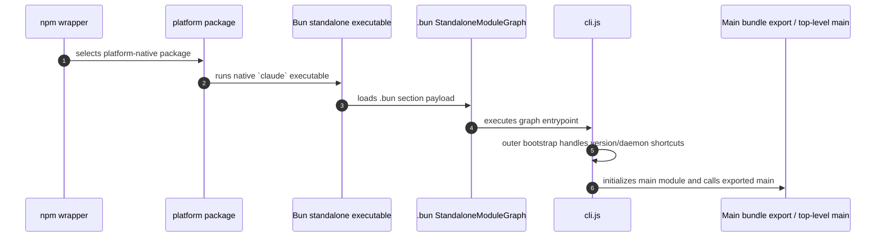

# Package and Bun bootstrap

This page reverse-engineers how the Claude Code package reaches the bundled `cli.renamed.js` runtime. It complements [CLI main paths](cli-main-paths.md), which starts once the JavaScript entrypoint is executing.

## Source anchors

| Semantic alias | Anchor | Meaning |
| --- | --- | --- |
| PackageInputExtractor | `WRAPPER_PACKAGE`, native package selection, `.bun` section extraction | Downloads package inputs and dumps the raw Bun payload section. |
| FinalArtifactExtractor | `TRAILER`, `MODULE_RECORD_SIZE`, `FINAL_ROOT_FILES`, `UNWANTED_FINAL_OUTPUTS` | Parses the Bun graph in memory, keeps only selected JS files, and prunes graph/JSC/prompt/native generated outputs. |
| BunEntrypointWrapper | `// @bun @bytecode @bun-cjs` | Bun wrapper header. |
| EmbeddedRuntimeVersion | `VERSION:"2.1.143"` | Embedded runtime version constant. |
| OuterBootstrap | `async function J9A` | Outer JavaScript bootstrap. |
| BootstrapLazyMainImport | `let{main:f}=await Promise.resolve().then(() => (p08(),zo6))` | Lazy initialization of the main bundled module. |

## Startup layers

## Bun payload contents

The Bun payload contains five modules. Only one is the full runtime entrypoint; two are JavaScript shims; two are stripped native shared objects. The final retained artifact set keeps the three readable JavaScript files and prunes the native `.node` binaries.

| Module | Loader | Role |
|---|---|---|
| `/$bunfs/root/src/entrypoints/cli.js` | `js` | Main CLI/runtime bundle and the primary readable analysis target. |
| `/$bunfs/root/image-processor.js` | `js` | Shim requiring `image-processor.node`. |
| `/$bunfs/root/audio-capture.js` | `js` | Shim requiring `audio-capture.node`. |
| `/$bunfs/root/image-processor.node` | `napi` | Embedded stripped Linux x86-64 image-processing native module. |
| `/$bunfs/root/audio-capture.node` | `napi` | Embedded stripped Linux x86-64 audio-capture native module. |

Temporary graph inspection found no serialized sourcemap payload, so analysis must use the bundled JavaScript, exact strings, and byte offsets. JSC bytecode dumps remain possible with the optional helper script, but they are not retained as final artifacts.

## Outer bootstrap behavior

`OuterBootstrap` is the outer JavaScript bootstrap. It performs a few fast paths before importing the full main module:

1. Reads `process.argv.slice(2)`.
2. Handles `--version`, `-v`, or `-V` with optional `--verbose` before full main import.
3. Checks background/daemon helper paths.
4. Records startup profiling events such as `cli_entry` and `cli_before_main_import`.
5. Lazily initializes the main module, reads the exported `main`, and awaits it.

The important runtime boundary is the lazy edge from `OuterBootstrap` to the main bundle export: everything before it is startup shell, while `TopLevelMain` and `CommanderRoot` own the full CLI runtime.

## Caveats

- The wrapper/native package directories and generated `metadata.json` are pruned by the final-artifact extractor.
- JavaScriptCore bytecode is not recovered source and is not retained in the simplified final artifact layout.
- Minified bootstrap symbols are version-specific. Use exact strings and offsets when comparing package versions.

## Related docs

- [CLI main paths](cli-main-paths.md)
- [`cli.renamed.js` overview](../00-start-here/what-is-cli-js.md)
