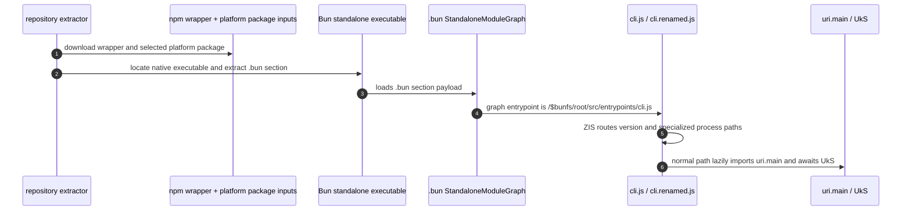

# Package and Bun bootstrap

This page separates two evidence layers: how this repository's extractors obtain the package/native inputs and retained Bun graph, and what the extracted JavaScript does once Bun executes the graph entrypoint. It complements [CLI main paths](cli-main-paths.md), which begins at the confirmed JavaScript bootstrap.

## Source anchors

| Semantic alias | Anchor | Meaning |
| --- | --- | --- |
| PackageInputExtractor | `WRAPPER_PACKAGE`, native package selection, `.bun` section extraction | Downloads package inputs and dumps the raw Bun payload section. |
| FinalArtifactExtractor | `TRAILER`, `MODULE_RECORD_SIZE`, `FINAL_ROOT_FILES`, `UNWANTED_FINAL_OUTPUTS` | Parses the Bun graph in memory, keeps only selected JS files, and prunes graph/JSC/prompt/native generated outputs. |
| BunEntrypointWrapper | `// @bun @bytecode @bun-cjs` | Bun wrapper header. |
| EmbeddedRuntimeVersion | `VERSION: "2.1.215"`, `BUILD_TIME: "2026-07-19T00:01:04Z"` | Embedded runtime version/build constants. |
| OuterBootstrap | `async function ZIS()` at ~983,909 | Outer JavaScript process router. |
| MainExport | `var uri = {}; nt(uri, { main: () => UkS })` | Normal-main export selected after pre-main routes decline the invocation. |
| FullRuntimeBoundary | `Claude Code - starts an interactive session by default` | Root-command string reached after lazy initialization of the full bundle. |

## Startup layers

```mermaid
sequenceDiagram
    autonumber
    participant Extract as repository extractor
    participant Inputs as npm wrapper + platform package inputs
    participant Bun as Bun standalone executable
    participant Graph as .bun StandaloneModuleGraph
    participant Cli as cli.js / cli.renamed.js
    participant Main as uri.main / UkS

    Extract->>Inputs: download wrapper and selected platform package
    Extract->>Bun: locate native executable and extract .bun section
    Bun->>Graph: loads .bun section payload
    Graph->>Cli: graph entrypoint is /$bunfs/root/src/entrypoints/cli.js
    Cli->>Cli: ZIS routes version and specialized process paths
    Cli->>Main: normal path lazily imports uri.main and awaits UkS
```

The first two arrows describe the repository's extraction pipeline, not a directly observed end-user launch trace. The final-artifact script prunes the downloaded wrapper/native package trees and extraction metadata. Consequently, this retained checkout cannot prove the exact wrapper script, platform-selection branch, or `exec` handoff used at runtime. It does prove that the selected native artifact contains the Bun graph and that its graph entrypoint maps to the retained CLI JavaScript.

## Bun payload contents

The extracted Bun payload contains five root modules. Only one is the full runtime entrypoint; two are JavaScript shims; two are stripped native shared objects. The final extractor keeps the three readable JavaScript files and writes both native `.node` binaries locally; repository ignore policy can keep those binaries out of version control.

| Module | Loader | Role |
|---|---|---|
| `/$bunfs/root/src/entrypoints/cli.js` | `js` | Main CLI/runtime bundle; retained raw as `cli.js` and read behaviorally through `cli.renamed.js`. |
| `/$bunfs/root/image-processor.js` | `js` | Shim requiring `image-processor.node`. |
| `/$bunfs/root/audio-capture.js` | `js` | Shim requiring `audio-capture.node`. |
| `/$bunfs/root/image-processor.node` | `napi` | Embedded stripped Linux x86-64 image-processing native module. |
| `/$bunfs/root/audio-capture.node` | `napi` | Embedded stripped Linux x86-64 audio-capture native module. |

Temporary graph inspection found no serialized sourcemap payload, so analysis must use the bundled JavaScript, exact strings, and byte offsets. JSC bytecode dumps remain possible with the optional helper script, but they are not retained as final artifacts.

## Outer bootstrap behavior

`ZIS()` is the outer JavaScript bootstrap and process router. Its ordering in this build is:

1. Validate argv, then handle `--version`, `-v`, or `-V` with optional `--verbose` before normal-main import.
2. Route internal Chrome/computer-use hosts (`--claude-in-chrome-mcp`, `--chrome-native-host`, `--computer-use-mcp`).
3. Route daemon/background process roles (`--daemon-worker`, `--bg-pty-host`, `--bg-spare`, `--preload`).
4. Route direct bridge aliases, daemon syntax, and background job controls/flags with their narrow policy and telemetry initialization.
5. Optionally mount the gated agents view directly for an eligible TTY invocation; optionally hand enabled `--tmux` plus worktree invocation to its exec path.
6. Normalize legacy update flags and `--bare`, start early input/keychain work as appropriate, record `cli_before_main_import`, lazily import `uri.main`, and await `UkS()`.

The important runtime boundary is the lazy edge from `ZIS()` to `uri.main`: everything before it is either bootstrap logic or a complete specialized process path. `UkS()` and `jkS()` own the ordinary command runtime, but daemon workers, PTY helpers, bridge commands, and other pre-main roles never enter it.

## Caveats

- The wrapper/native package directories and generated `metadata.json` are pruned by the final-artifact extractor. Exact wrapper-to-native launch behavior is therefore an explicit evidence limit in this retained layout.
- JavaScriptCore bytecode is not recovered source and is not retained in the simplified final artifact layout.
- Minified bootstrap symbols are version-specific. Use exact strings and offsets when comparing package versions.

## Related docs

- [CLI main paths](cli-main-paths.md)
- [`cli.renamed.js` overview](../00-start-here/what-is-cli-js.md)
