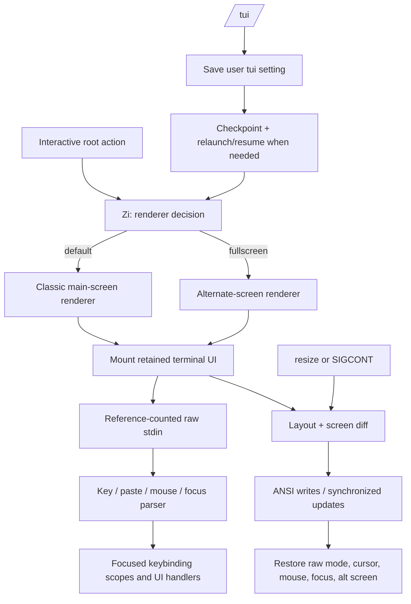

# Terminal UI renderer and input lifecycle

Claude Code's interactive terminal is not one static stream of `console.log` output. In `@anthropic-ai/claude-code@2.1.215`, the runtime selects either a classic main-screen renderer or a fullscreen alternate-screen renderer, mounts an Ink-like retained UI tree, turns TTY input into keyboard/mouse/focus events, and restores terminal state during suspend, relaunch, or exit.

This page owns the normal terminal pipeline. Use [Accessibility and screen-reader mode](accessibility-and-screen-reader-mode.md) for the accessible flat-rendering path, [Command-line reference](command-line-reference.md) for individual commands/keys, and [Headless streaming and resilience](../02-context-model-loop/headless-streaming-and-resilience.md) for non-interactive stdout protocols.

## Short answer

The two renderer names mean:

| Name | Screen ownership | Main operational difference |
|---|---|---|
| `default` / classic | The terminal's normal scrollback buffer | Output grows in the main screen and the renderer patches the visible tail. |
| `fullscreen` | DEC alternate screen (`?1049h`) | Claude Code owns a terminal-sized viewport, can use sticky scrolling/focus view, and restores the prior screen on exit. |

## Source anchors

| Semantic alias | Approximate location in `cli.renamed.js` | Exact symbol or string | Meaning |
|---|---:|---|---|
| RendererResolver | [~196,887](../../claude-code-pkg/src/entrypoints/cli.renamed.js#L196887) | `Zi()`, `i7t()`, `N5e()` | Selects fullscreen/default and records the reason. |
| RendererEnvironment | [~196,900](../../claude-code-pkg/src/entrypoints/cli.renamed.js#L196900) | `CLAUDE_CODE_NO_FLICKER`, `CLAUDE_CODE_DISABLE_ALTERNATE_SCREEN` | Explicit alternate-screen enable/disable controls. |
| TmuxAndWindowsGuards | [~196,870–196,930](../../claude-code-pkg/src/entrypoints/cli.renamed.js#L196870) | `tmux -CC`, `Windows over SSH (ConPTY re-rendering)` | Auto-disables fullscreen on known-incompatible paths unless explicitly forced. |
| RawInputController | [~306,680–306,910](../../claude-code-pkg/src/entrypoints/cli.renamed.js#L306680) | `Eno`, `handleSetRawMode`, `handleReadable` | Reference-counted raw mode, byte parsing, paste and suspend/resume handling. |
| InputDispatcher | [~306,407](../../claude-code-pkg/src/entrypoints/cli.renamed.js#L306407) | `SOg()` | Routes parsed response, mouse, focus, suspend, paste, wheel, and keyboard events. |
| TerminalRenderer | [~310,400–311,000](../../claude-code-pkg/src/entrypoints/cli.renamed.js#L310400) | `Ser`, `onRender()`, `syncTerminalSize()` | Maintains frames, layout, diff output, cursor state, resize, and cleanup. |
| AlternateScreenController | [~310,538–310,587](../../claude-code-pkg/src/entrypoints/cli.renamed.js#L310538) | `enterAlternateScreen()`, `exitAlternateScreen()`, `ensureInteractive()` | Switches buffers and installs resize/continue handlers. |
| TerminalCapabilityProbe | [~306,378](../../claude-code-pkg/src/entrypoints/cli.renamed.js#L306378) | `XTVERSION`, `DECRQM(2026)`, `DECSTBM` | Detects terminal identity, synchronized-update support, and scroll-region posture. |
| TuiCommand | [~827,500–827,650](../../claude-code-pkg/src/entrypoints/cli.renamed.js#L827500) | `/tui <default|fullscreen>`, `relaunchInto()` | Persists the renderer choice and optionally relaunches/resumes. |
| FocusCommand | [~562,143](../../claude-code-pkg/src/entrypoints/cli.renamed.js#L562143) | `name: "focus"` | Focus view depends on the fullscreen renderer. |
| TerminalEmergencyRestore | [~309,900](../../claude-code-pkg/src/entrypoints/cli.renamed.js#L309900) | `restoreTerminalModes` | Synchronous best-effort reset for cursor, mouse/focus modes, and alternate screen. |
| PromptHistoryStore | [~504,851–505,200](../../claude-code-pkg/src/entrypoints/cli.renamed.js#L504851) | `history.jsonl`, `paste-cache`, `CLAUDE_CODE_SKIP_PROMPT_HISTORY` | Persists submitted prompt history and externalizes large pasted text. |

## Renderer decision order

`Zi()` is the effective resolver for the ordinary interactive session. It evaluates high-priority runtime constraints before settings or rollout defaults:

1. The `local-agent` entrypoint uses the classic renderer.
2. An attached background session (`CLAUDE_CODE_SESSION_KIND=bg`) forces fullscreen.
3. Screen-reader mode forces classic.
4. `CLAUDE_CODE_NO_FLICKER=false` or `CLAUDE_CODE_DISABLE_ALTERNATE_SCREEN` forces classic.
5. `CLAUDE_CODE_NO_FLICKER=true` forces fullscreen.
6. tmux control mode (`tmux -CC`) and Windows-over-SSH force classic and emit a debug explanation.
7. `settings.tui:"fullscreen"|"default"` supplies the explicit persisted choice.
8. Otherwise rollout gates (`tengu_amber_creek`, then `tengu_pewter_brook`) select the default for that build/cohort.

`N5e()` exposes a reason such as `bg_forced_on`, `sr_auto_off`, `env_off`, `env_on`, `tmux_cc_auto_off`, `win_ssh_auto_off`, `settings_on`, `settings_off`, `downsell_on`, `gb_on`, or `gb_off`. These values are telemetry/debug anchors, not a public configuration enum.

The resolver caches terminal probes and feature-gate results in a process-local object. A changed tmux/gate environment is not continuously reevaluated. `/tui` therefore persists and, on the relaunching path, starts a new process rather than trying to mutate every renderer assumption in place.

### Related visual modes

- **Screen-reader mode** forces classic and uses a separate accessibility-tree diff; it is not merely a color theme.
- **Reduced motion** can stop animations without necessarily changing every other accessibility behavior.
- **Focus view** needs fullscreen because it depends on an owned viewport; `/focus` directs classic users to `/tui fullscreen`.
- **Background attachment** forces fullscreen independently of the renderer chosen for sessions launched directly with `claude`.

## `/tui`: save versus live switch

`/tui` accepts only `default` and `fullscreen`. With no argument it reports the current renderer.

On the normal live-switch path it:

1. compares the requested mode with `Zi()`;
2. refuses a switch while eligible background work is running;
3. writes `tui` to user settings;
4. persists the current conversation leaf as a checkpoint when one exists;
5. optionally asks for fullscreen opt-out feedback; and
6. calls `relaunchInto()`, which carries compatible flags, sets `CLAUDE_CODE_TUI_JUST_SWITCHED`, drops old renderer override env vars, and resumes the session.

If relaunch fails, the setting remains saved and the user is told to restart manually. A feature-gated branch only saves the future preference and explains that an attached background session remains fullscreen. Screen-reader mode reports that the saved setting has no effect while accessibility mode is active.

This is a process handoff, not hot-swapping the same terminal tree. It avoids keeping stale alternate-screen, cursor, and input-parser state alive across renderer families.

## Mount, layout, and frame output

The renderer maintains a retained terminal element tree, Yoga-style layout, a front/back cell frame, style/character/hyperlink pools, and cursor declarations. Each render:

1. reads terminal dimensions, using guarded fallbacks for missing/absurd values;
2. computes layout against the current width;
3. paints dirty nodes into a back frame;
4. produces a minimal cursor/style/text diff or a full reset when dimensions/layout make an incremental patch unsafe;
5. wraps suitable writes in synchronized-update markers when the terminal advertised support; and
6. records frame timing/flicker diagnostics.

Classic mode's cursor ends after the rendered content. Fullscreen clips output to the viewport, parks the cursor in the alternate screen, and can use scroll-region operations. A terminal resize updates dimensions, resets affected frames, and schedules another render. `SIGCONT` similarly resets or re-enters the active screen after process resume.

On interactive setup, the renderer first emits a cursor-visibility capability query used by immediate cursor handling. The fuller `BEu()` probe separately asks for XTVERSION and synchronized-update (`DECRQM(2026)`) support and logs the scroll-region (`DECSTBM`) posture. tmux mouse/focus options are probed separately so the UI can show actionable hints rather than assuming every tmux client forwards those events.

## Input path

Raw mode is reference-counted rather than a one-way global toggle. The first claimant:

- stops early-input capture;
- references stdin and enables raw mode;
- attaches the `readable` listener;
- enables terminal input/focus/mouse sequences; and
- starts capability probing outside daemon-backed background mode.

The last release removes the listener, unreferences stdin, restores cooked mode unless a background handoff owns raw mode, and disables terminal modes.

`handleReadable()` consumes all available bytes and feeds a stateful parser. It distinguishes ordinary key events, bracketed paste, mouse packets, terminal responses, focus/blur sequences, and incomplete escape sequences. Incomplete normal keys wait approximately 50 ms; paste sequences have a longer 2-second completion window so split input chunks are not dispatched prematurely.

`SOg()` then routes events:

| Parsed event | Runtime destination |
|---|---|
| Terminal query response | Capability-query waiter. |
| Mouse | Selection, hover, click, wheel, hyperlink, or middle-click paste handling. |
| Focus/blur | Terminal focus state and UI events. |
| `Ctrl+Z` | Suspend path: release raw/terminal modes, send `SIGTSTP`, restore on `SIGCONT`. |
| Paste | Dedicated paste event rather than a series of keypresses. |
| Keyboard | Focused element/keybinding-scope dispatcher. |

The keybinding registry supports nested scopes, preemptive scopes, focus claims, chords, remaps, and fallback hints. Individual default bindings and customization belong in the command/keybinding references; this page documents the transport from terminal bytes to that registry.

## Prompt history and pasted-text storage

Submitted interactive prompts have a second persistence path that is independent of session transcripts. `history.jsonl` under the Claude configuration root powers prompt-history search/navigation; it is **not** the `${sessionId}.jsonl` conversation record used by resume.

Each queued history row carries the display text, non-media pasted-content descriptors, current timestamp, project root, and session ID. Consecutive identical plain prompts in the same project/session are coalesced. History readers yield still-queued rows first, then stream disk rows, deduplicating by `timestamp + sessionId`; malformed individual lines are logged and skipped. Project/session/everywhere views retain at most 100 distinct display entries.

Text paste bodies use two storage forms:

| Paste size | Stored representation |
|---|---|
| At most 1,024 JavaScript string units | Inline `content` in `history.jsonl`. |
| Larger | `contentHash`, the first 16 hex characters of SHA-256, plus `paste-cache/<hash>.txt`. |

Images and audio are not copied into prompt history by this path. A large paste is first tracked in process memory while its cache write runs; a failed cache write falls back to a bounded in-memory cache for the process. On a later history read, the runtime resolves the hash from pending memory, fallback memory, or disk. If all copies are gone, it replaces the matching display marker with `content no longer available` and records a loss signal rather than inventing the old text. Expansion back into the editor refuses recovered text above 100,000 string units.

`rpd()` ensures `history.jsonl` exists, obtains a file lock with a 10-second stale threshold and three lock retries (minimum 50 ms delay), appends the queued JSONL batch, and releases the lock in `finally`. If lock acquisition fails, the outer queue performs an initial attempt plus at most five delayed retries at 500 ms intervals while rows remain. A failure after the queue has been handed to the append is logged but is not a transactional retry guarantee.

History recording is skipped when `CLAUDE_CODE_SKIP_PROMPT_HISTORY` parses true or when the process is a nested interactive Claude session. The variable suppresses this prompt-picker history only; it does not imply `--no-session-persistence` and does not disable the main transcript.

## Suspend, resize, and cleanup

### Suspend/resume

Before `SIGTSTP`, the runtime releases all raw-mode claims, disables terminal modes, and emits a suspend event. Its one-shot `SIGCONT` handler restores the previous raw-mode claim count, screen/cursor sequences, and emits resume. This avoids leaving the user's shell unusable while Claude Code is stopped.

### Normal and emergency exit

Unmount and coordinated shutdown remove resize/`SIGCONT` listeners, clear pending escape/hyperlink timers, release raw mode, restore cursor/focus/mouse modes, and leave alternate screen. A synchronous emergency restore writes the same essential reset sequences for process-exit paths that cannot await React/Ink cleanup.

A component error is caught by the root error boundary and handed to the renderer's exit callback. The source does **not** show an automatic same-process fallback from a crashed fullscreen renderer to classic; the automatic classic fallbacks happen during selection, before rendering.

## Failure behavior

| Failure or condition | Source-confirmed result |
|---|---|
| Non-TTY stdin with a raw-mode claimant | Throws an explicit Ink raw-mode unsupported error. Non-interactive modes should not mount this input path. |
| tmux `-CC` or Windows SSH auto-detected | Selects classic; `CLAUDE_CODE_NO_FLICKER=true` can explicitly override. |
| Terminal reports invalid dimensions | Uses guarded defaults/clamps and logs a warning once. |
| Resize invalidates an incremental frame | Performs a full terminal reset/repaint. |
| Input parser throws while reading | Logs the error and reattaches the `readable` listener when necessary. |
| `/tui` while background work runs | Refuses the live switch; no relaunch occurs. |
| Relaunch fails | Keeps the saved preference and asks the user to restart. |
| Original terminal ignores capability queries | Continues with conservative feature assumptions. |
| Renderer component throws | Exits through the error boundary; no automatic renderer-family swap is established. |

## Boundaries and caveats

- ANSI behavior depends on the host terminal, tmux, SSH/ConPTY, and operating system. The client can detect selected incompatibilities but cannot guarantee every emulator behaves identically.
- The retained bundle proves Claude Code's renderer/input orchestration, not the original upstream Ink implementation or every terminal-parser edge case.
- `default` means Claude Code's classic renderer, not “no ANSI.” Themes, links, cursor control, and notifications can still use terminal escapes.
- Keybinding contents are intentionally not duplicated here; use the keybindings/configuration surfaces for the current binding map.
- Fullscreen rollout gates and minified symbols are build-specific to `2.1.215`.

## Related docs

- [Runtime lifecycle](README.md)
- [CLI main paths](cli-main-paths.md)
- [Command-line reference](command-line-reference.md)
- [Accessibility and screen-reader mode](accessibility-and-screen-reader-mode.md)
- [Headless streaming and resilience](../02-context-model-loop/headless-streaming-and-resilience.md)
- [Settings, policy, and integrations](../03-tools-integrations-security/settings-policy-and-integrations.md)
- [Environment variables reference](../05-hosted-agent-ops/environment-variables-reference.md)
