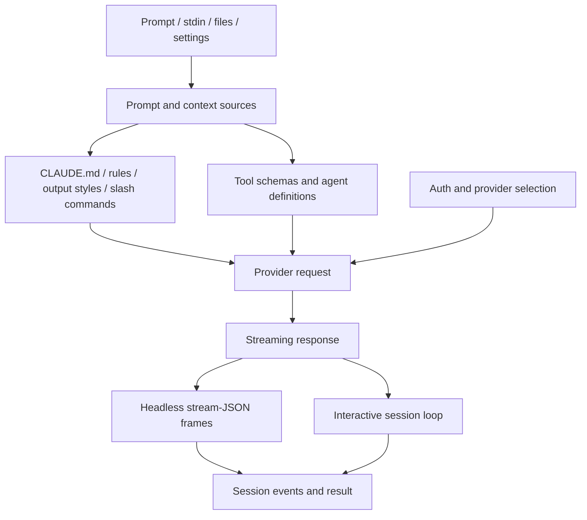

# Context and model loop

This chapter follows a Claude Code turn from input collection to provider-facing request and streamed response handling. It covers what becomes model-visible context, how model/provider/auth state is selected, and how headless/SDK streaming frames drive a scriptable run.

Read this chapter when the question is: **what did the model see, which provider/model handled it, and how did the runtime frame the turn?**

## Source-anchor policy

This page is a chapter guide. Linked implementation pages carry concrete `cli.renamed.js` anchors.

| Semantic alias | Minified anchor | Scope |
|---|---|---|
| Context/model chapter | N/A — navigation page | Groups prompt/context assembly, memory, settings, provider/auth selection, and headless streaming. |
| Context/model implementation pages | See linked source-anchor tables | Concrete bundle anchors live in destination pages. |

## Model-turn map

## Primary reading order

| Order | Page | Question answered |
|---:|---|---|
| 1 | [Prompt, context, and memory](prompt-context-memory.md) | Which `CLAUDE.md`, settings, system-prompt, output-style, slash-command, memory, `system-reminder`, and dynamic-injection sources feed context? |
| 2 | [Prompt assembly scenarios](prompt-assembly-scenarios.md) | How do major runtime paths assemble default, custom, appended, bare, agent, subagent, WebSearch/WebFetch, compaction, hook, and helper prompts? |
| 3 | [Context, memory, compaction, checkpoints, and rewind](context-memory-compaction-checkpoints.md) | How are memory scopes selected, how does auto/manual compaction summarize context, and how do file checkpoints plus rewind work? |
| 4 | [Prompt template catalog](prompt-template-catalog.md) | Which long prompt/template-like literals are embedded in `cli.renamed.js`, grouped by runtime surface with anchors, previews, and hashes? |
| 5 | [Models, providers, and auth](models-providers-auth.md) | How do API keys, OAuth tokens, provider env vars, model flags, and provider selection connect? |
| 6 | [Model selection, calls, usage, quota, and billing](model-selection-usage-quota-billing.md) | How are model roles resolved, how are provider calls made, and how do rate limits, usage, quota, budget, and billing surfaces work? |
| 7 | [Headless streaming and resilience](headless-streaming-and-resilience.md) | How does `-p`/SDK mode validate input/output formats, stream messages, multiplex frames, and handle permission/control/result framing inside `HeadlessRunner`/`HeadlessControlLoop`? |
| 8 | [Context and model loop architecture](architecture.md) | How is the context assembler + streaming multiplexer decomposed, what shapes the static/dynamic prompt boundary, and how do interactive and headless reuse one pipeline? |

## Handoffs

- Tool schemas and permissions are owned by [Tools, integrations, and security](../03-tools-integrations-security/README.md).
- Durable transcript state is owned by [Sessions, persistence, and remote](../04-sessions-persistence-remote/README.md).
- Agents and task-specific prompts are owned by [Agents and automation](../06-agents-automation/README.md).

## Navigation

- [Start here](../00-start-here/README.md)
- [Full table of contents](../SUMMARY.md)
