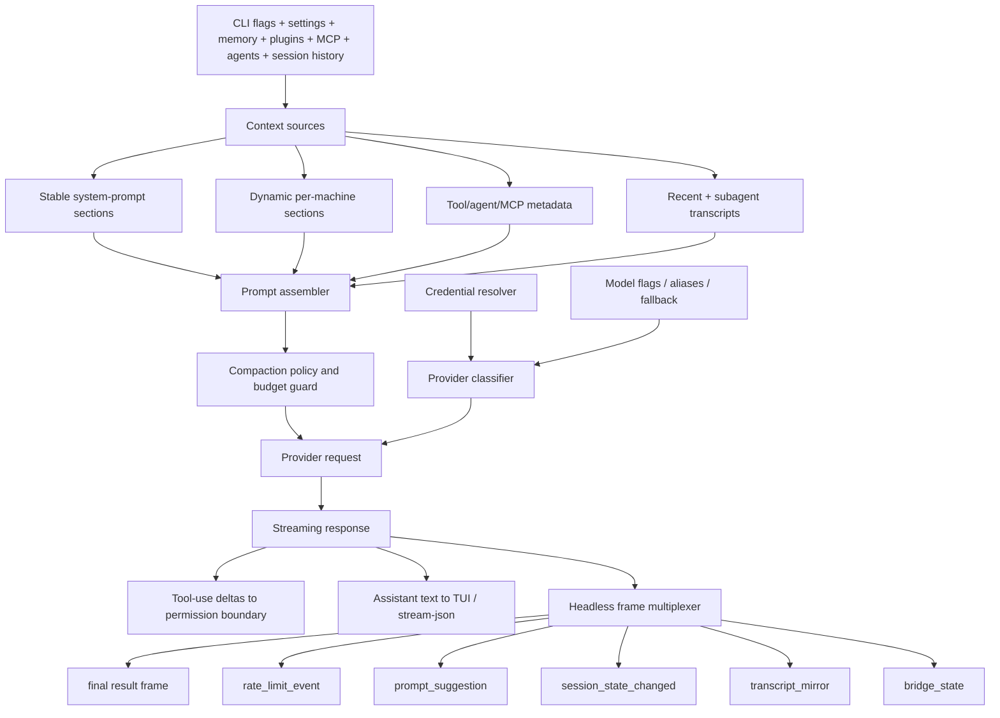

# Context and model loop architecture

This page is the architecture analysis for the context-and-model-loop module. It complements the implementation pages in this chapter by focusing on **how context is layered into a model request, how provider/auth selection is shaped, and how headless/SDK streaming is decomposed** rather than re-listing prompt or template strings.

Scope: from a resolved runtime session and root-action options to a model-visible request, a streaming response, and the headless/SDK frame multiplex. Implementation specifics live in [Prompt, context, and memory](prompt-context-memory.md), [Prompt assembly scenarios](prompt-assembly-scenarios.md), [Context, memory, compaction, checkpoints, and rewind](context-memory-compaction-checkpoints.md), [Prompt template catalog](prompt-template-catalog.md), [Models, providers, and auth](models-providers-auth.md), [Model selection, calls, usage, quota, and billing](model-selection-usage-quota-billing.md), and [Headless streaming and resilience](headless-streaming-and-resilience.md).

## Module purpose

This module owns the **request side** of the agent loop: what the model sees, which provider serves the request, and how the streamed response is multiplexed into runtime state and (optionally) SDK/headless frames. It is intentionally separated from tool execution: this module decides what the model *can perceive*, while the tool/permission module decides what the model *can do*.

## Architecture thesis

The context/model loop is a **layered assembler plus a streaming multiplexer**:

- The assembler converts heterogeneous inputs (CLI flags, memory files, settings, plugins, MCP prompts/resources, tools, agents, session history) into a single model-visible request.
- The multiplexer hides provider differences behind a shared streaming contract and exposes a uniform frame protocol for headless/SDK consumers.

This separation lets the runtime support interactive TUI and scripted/SDK transports with one context pipeline.

## Source anchors

| Semantic alias | String or symbol | Architectural meaning |
| --- | --- | --- |
| ManagedMemoryPolicy | `CLAUDE.md-style instructions injected as organization-managed memory` | Managed memory schema; org policy participates in context. |
| LocalRuleMemoryRoots | `.claude/rules`, `CLAUDE.local.md` | Rule and local memory file roots. |
| DynamicPromptBoundaryFlag | `--exclude-dynamic-system-prompt-sections` | Separates stable prompt content from per-machine sections. |
| SystemPromptOverrideFlag | `--system-prompt <prompt>` | Replaces the system prompt. |
| SystemPromptAppendFlag | `--append-system-prompt <prompt>` | Adds to the default system prompt. |
| OutputStyleContextSchema | `outputStyles` | Plugin/settings-contributed output style schema. |
| SlashCommandContextSurface | `slashCommands` | Slash commands counted as context. |
| TranscriptContextAssembler | `async function _O5({transcriptPath:H,scope:$="session",maxRawTranscriptBytes:q})` | Transcript-derived context assembler. |
| ProviderClassifier | `CLAUDE_CODE_USE_BEDROCK`, `..._VERTEX`, `..._FOUNDRY`, `..._MANTLE`, `..._ANTHROPIC_AWS` | Provider classifier branches. |
| CredentialResolver | `ANTHROPIC_API_KEY`, `ANTHROPIC_AUTH_TOKEN` | Credential resolution; key vs bearer differs in downstream headers. |
| ModelSelectionFlag | `--model <model>` | Per-session model selection. |
| FallbackModelFlag | `--fallback-model <model>` | Fallback model for print/headless mode. |
| PerTurnModelResolver | `nG({permissionMode,mainLoopModel,exceeds200kTokens})` | Per-turn model resolver can alter model by mode/context. |
| ApiUsageAccounting | `api_request`, `cost_usd`, `input_tokens`, `output_tokens` | Provider-call accounting and telemetry. |
| UnifiedRateLimitHeaders | `anthropic-ratelimit-unified-*` | Unified rate-limit/quota headers parsed into runtime state. |
| HeadlessBudgetGuard | `error_max_budget_usd` | Headless budget guard result subtype. |
| HeadlessMcpCoordinator | `let o4=fH9({regularMcpConfigs:Ww` | Headless branch creates the MCP coordinator before the model loop. |
| HeadlessRunner | `async function runHeadless` | Headless runner; validates print/SDK constraints. |
| HeadlessFrameMultiplexer | `function runHeadlessStreamingForTesting` | Headless streaming/control multiplexer. |
| HeadlessOutboundChannel | `let h=H.outbound` | Outbound stream/channel abstraction inside `runHeadlessStreamingForTesting`. |
| RateLimitStreamFrame | `rate_limit_event` | Rate-limit changes projected to SDK consumers. |
| PromptSuggestionFrame | `prompt_suggestion` | Predicted next-prompt frame emitted after a turn. |
| SessionStateChangedFrame | `session_state_changed` | Idle/running/requires_action state pushed alongside model frames. |
| TranscriptMirrorFrame | `transcript_mirror` | Local transcript mirror frame in stream-JSON mode. |
| SdkFrameAdapterFilter | `case "rate_limit_event": return N("[sdkMessageAdapter] Ignoring rate_limit_event message")` | SDK adapter explicitly handles a subset of frame types. |
| CompactionHookLifecycle | `PreCompact`, `PostCompact` | Compaction lifecycle hooks around context shrinking. |
| AutoCompactionThreshold | `autoCompactEnabled`, `DISABLE_AUTO_COMPACT`, `autocompact: tokens=` | Auto-compaction gate and threshold path. |

## Internal decomposition

The module composes three sub-components:

| Sub-component | Responsibility |
|---|---|
| Context sources | Heterogeneous inputs (memory, settings, plugins, MCP, agents, tools, session history, output styles, slash commands). |
| Prompt assembler + compaction | Produces the model-visible request, applies `--exclude-dynamic-system-prompt-sections`, runs `PreCompact`/`PostCompact` hooks, and enforces budget/turn limits. |
| Provider/auth router | Picks credentials, classifies provider, sets model/fallback, prepares headers, and abstracts over Anthropic/Bedrock/Vertex/Foundry/Mantle/Anthropic AWS. |

The `HeadlessFrameMultiplexer` wraps the model stream and adds non-model frames (rate limit, suggestions, state, transcript mirror, bridge state) without coupling them to provider details.

## Public interface

### Inputs

| Effect |
| --- |
| Replace or extend the system prompt. |
| Move per-machine content (cwd, env, memory paths, git status) out of cache-sensitive sections. |
| Add tool-access directories and inject file resources into early context. |
| Shape provider routing, thinking mode, budget guards, and beta headers. |
| Memory and presentation layers fed into the assembler. |
| Credential and provider classification. |
| Add capability metadata and prompt fragments. |

### Outputs

| Output | Consumer |
|---|---|
| Provider request | Streaming model API (Anthropic, Bedrock, Vertex, Foundry, Mantle, Anthropic AWS). |
| `assistant` and `tool_use` deltas | Forwarded to TUI renderer or stream-JSON adapter. |
| Headless frames (`result`, `rate_limit_event`, `prompt_suggestion`, `session_state_changed`, `transcript_mirror`, `bridge_state`, `task_notification`, `plugin_install`) | Headless/SDK consumers, transcript writers, remote bridge. |
| Compaction events (`PreCompact`/`PostCompact` hook calls) | Hook subscribers, telemetry. |
| Context-budget warnings (e.g. large agent descriptions) | UI and telemetry. |

## Internal collaborators

| Collaborator | Direction | Contract |
|---|---|---|
| Runtime lifecycle | inbound | Provides a fully composed runtime context (settings, auth, MCP, plugins, agents, session). |
| Sessions module | inbound | Provides transcript history, restored permission/model state, deferred tools. |
| Tool/permission module | inbound + outbound | Supplies tool metadata for context; receives tool-use deltas and ask/deny decisions back. |
| MCP/plugins/hooks | inbound | Contribute prompts, resources, tool schemas, output styles, and lifecycle hooks. |
| Remote/bridge module | outbound | Receives the same stream-JSON frames the SDK does; permission/control frames flow back in. |
| Telemetry/ops | outbound | Receives `tengu_*` events for token usage, rate limits, retries, compaction, and budget exhaustion. |

## Design decisions

1. **Static vs dynamic system-prompt boundary.** The `__SYSTEM_PROMPT_DYNAMIC_BOUNDARY__` sentinel and `--exclude-dynamic-system-prompt-sections` flag exist so that per-machine fragments do not invalidate prompt caches. Treating cacheability as a first-class concern is a deliberate context-engineering choice.
2. **Layered context, not single template.** Memory files, settings, slash commands, skills, agents, MCP, tools, and session history are independent contributors; the assembler merges them per turn instead of relying on one monolithic template.
3. **Provider classifier in one place.** Instead of having each call site detect the provider, environment gates (`CLAUDE_CODE_USE_*`) are checked once and downstream code consumes a single classifier result.
4. **Credential resolution by precedence, not branching.** API key, OAuth token, helper script, and file-descriptor sources are tried in a fixed order so the rest of the loop can treat credentials as opaque.
5. **Headless mode is a different projection, not a different agent.** `HeadlessRunner` and `HeadlessFrameMultiplexer` reuse the same context assembly and provider router as the TUI; only the projection (stream-JSON frames vs UI updates) differs.
6. **Frame multiplexing keeps non-model state observable.** Rate limit events, prompt suggestions, session-state changes, transcript mirrors, and bridge state are first-class outbound frames so SDK/remote consumers do not have to infer them.
7. **Compaction is a runtime concern, not a settings flag.** `PreCompact`/`PostCompact` hooks let external code participate in context shrinking; budget/turn limits are enforced inside the loop rather than at the model boundary.
8. **Fallback model only in non-interactive paths.** The `--fallback-model` documentation strings restrict fallback to print mode, which keeps interactive sessions predictable.

## Failure modes

| Failure | Behavior |
|---|---|
| Invalid format combination (e.g. `--input-format=stream-json` without `--output-format=stream-json`) | `HeadlessRunner` rejects with a precise error before any provider call. |
| Provider auth missing or expired | Credential resolver returns null; the loop reports a structured error frame and (in headless) exits with an `error_during_execution` subtype. |
| Rate limit hit | `rate_limit_event` frame emitted; provider state is preserved and the loop can re-issue or wait based on policy. |
| Turn or budget exhausted | `result` frame uses `error_max_turns`, `error_max_budget_usd`, or `error_max_structured_output_retries` so callers can distinguish stop conditions. |
| Context too large after assembly | Compaction is triggered through `PreCompact`/`PostCompact` hooks before the request is built; large agent descriptions also raise pre-flight warnings. |
| Stream interruption | The headless loop drains any in-flight tool calls; the SDK adapter explicitly ignores frame types it does not understand instead of crashing. |

## Extension points

| Extension | How it plugs in |
|---|---|
| Add a context source | Contribute through settings/plugins/MCP rather than touching the assembler directly. |
| Add a provider | Add a `CLAUDE_CODE_USE_*` branch to the classifier and a credential adapter; existing model flags remain stable. |
| Add a new outbound frame type | Define the schema near the existing `y.object(...)` schemas (~line 2004) and emit it from `HeadlessFrameMultiplexer`; SDK adapters must opt into handling it. |
| Customize compaction | Subscribe to `PreCompact`/`PostCompact` hooks; do not mutate prompt assembly directly. |
| Override prompt cacheability | Use the dynamic-section flag rather than rewriting the prompt; this preserves provider-side caching. |

## Caveats

- Detailed prompt fragments and templates are cataloged in [Prompt template catalog](prompt-template-catalog.md); major runtime assembly shapes are reconstructed in [Prompt assembly scenarios](prompt-assembly-scenarios.md). They are runtime evidence, not authoritative prose.
- Provider adapter internals (request shaping, header mapping) are not fully recoverable from the bundle; this page documents the observable seams.
- The bundled Anthropic SDK contributes many strings (`session_id`, `/v1/sessions/...`) that are SDK documentation/templates, not Claude Code lifecycle. They are only treated as runtime evidence when they connect to flags or loops.

## Related docs

- [Prompt, context, and memory](prompt-context-memory.md)
- [Prompt assembly scenarios](prompt-assembly-scenarios.md)
- [Context, memory, compaction, checkpoints, and rewind](context-memory-compaction-checkpoints.md)
- [Prompt template catalog](prompt-template-catalog.md)
- [Models, providers, and auth](models-providers-auth.md)
- [Model selection, calls, usage, quota, and billing](model-selection-usage-quota-billing.md)
- [Headless streaming and resilience](headless-streaming-and-resilience.md)
- [System architecture](../00-start-here/system-architecture.md)
- [Tool runtime and security architecture](../03-tools-integrations-security/architecture.md)
