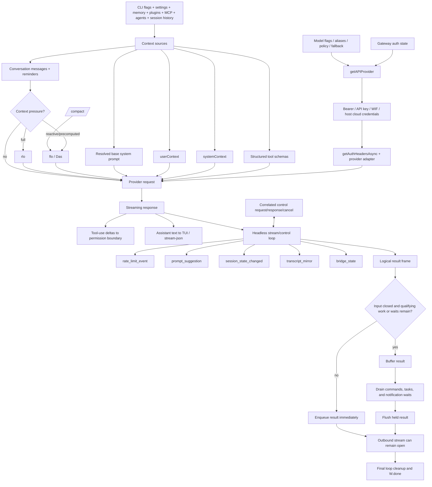

# Context and model loop architecture

This page is the architecture analysis for the context-and-model-loop module. It complements the implementation pages in this chapter by focusing on **how context is layered into a model request, how provider/auth selection is shaped, and how headless/SDK streaming is decomposed** rather than re-listing prompt or template strings.

Scope: from a resolved runtime session and root-action options to a model-visible request, a streaming response, and the headless/SDK frame multiplex. Implementation specifics live in [Prompt, context, and memory](prompt-context-memory.md), [Prompt assembly scenarios](prompt-assembly-scenarios.md), [Context, memory, compaction, checkpoints, and rewind](context-memory-compaction-checkpoints.md), [Prompt template catalog](prompt-template-catalog.md), [Models, providers, and auth](models-providers-auth.md), [Model selection, calls, usage, quota, and billing](model-selection-usage-quota-billing.md), and [Headless streaming and resilience](headless-streaming-and-resilience.md).

## Module purpose

This module owns the **request side** of the agent loop: what the model sees, which provider serves the request, and how the streamed response is multiplexed into runtime state and (optionally) SDK/headless frames. It is intentionally separated from tool execution: this module decides what the model *can perceive*, while the tool/permission module decides what the model *can do*.

## Architecture thesis

The context/model loop is a **layered assembler plus a streaming multiplexer**:

- The request side resolves base system text, `userContext`, `systemContext`, transcript messages, and structured tools as related but separate inputs.
- Provider routing chooses one ordered primary provider and, for eligible Bedrock/model combinations, an optional Mantle secondary route. Authentication then follows provider- and host-specific lanes rather than one global secret precedence list.
- The response side hides provider-stream differences behind a shared event contract. Headless/SDK mode projects those events plus control, task, bridge, transcript, and result state onto a correlated bidirectional protocol.

This separation lets the runtime support interactive TUI and scripted/SDK transports with one context pipeline.

## Source anchors

| Semantic alias | String or symbol | Architectural meaning |
| --- | --- | --- |
| ManagedMemoryPolicy | `CLAUDE.md-style instructions injected as organization-managed memory` | Managed memory schema; org policy participates in context. |
| LocalRuleMemoryRoots | `.claude/rules`, `CLAUDE.local.md` | Rule and local memory file roots. |
| DynamicPromptBoundaryFlag | `--exclude-dynamic-system-prompt-sections` | Separates stable prompt content from per-machine sections. |
| SystemPromptOverrideFlag | `--system-prompt <prompt>` | Replaces the system prompt. |
| SystemPromptAppendFlag | `--append-system-prompt <prompt>` | Adds to the default system prompt. |
| SystemPromptResolver | `vne()` | Resolves total override, coordinator, agent replace/append, custom/default base, and ordinary append. |
| PromptPartResolver | `fetchSystemPromptParts()` | Separates default system prompt, `userContext`, and `systemContext`. |
| DefaultPromptBuilder | `M2()`, `SYSTEM_PROMPT_DYNAMIC_BOUNDARY` | Builds default fragments and identifies relocatable dynamic sections. |
| OutputStyleContextSchema | `outputStyles` | Plugin/settings-contributed output style schema. |
| SlashCommandContextSurface | `slashCommands` | Slash commands counted as context. |
| ProviderClassifier | `getAPIProvider()` | Ordered gateway, cloud-provider, and first-party selection. |
| SecondaryProvider | `getSecondaryProvider()` | Optional Bedrock-to-Mantle secondary route for applicable models. |
| BearerResolver | `getAuthTokenSource()` | Bearer/OAuth provenance lane. |
| ApiKeyResolver | `getAnthropicApiKeyWithSource()` | Separate API-key provenance lane. |
| WorkloadIdentityGate | `shouldUseWIFAuth()` | WIF eligibility after provider, host, and explicit-source exclusions. |
| AuthHeaderAssembler | `getAuthHeadersAsync()` | Converts selected provider/auth state into request headers. |
| ModelSelectionFlag | `--model <model>` | Per-session model selection. |
| FallbackModelFlag | `--fallback-model <model>` | Fallback model for print/headless mode. |
| PerTurnModelResolver | `getRuntimeMainLoopModel()` | Per-turn model resolver can alter the effective model by permission/runtime state. |
| ApiUsageAccounting | `api_request`, `cost_usd`, `input_tokens`, `output_tokens` | Provider-call accounting and telemetry. |
| UnifiedRateLimitHeaders | `anthropic-ratelimit-unified-*` | Unified rate-limit/quota headers parsed into runtime state. |
| HeadlessBudgetGuard | `error_max_budget_usd` | Headless budget guard result subtype. |
| HeadlessRunner | `async function runHeadless` | Headless runner; validates print/SDK constraints. |
| HeadlessFrameMultiplexer | `function runHeadlessStreamingForTesting` | Headless streaming/control multiplexer. |
| ControlCorrelation | `control_request`, `control_response`, `control_cancel_request`, `request_id` | Correlated host/runtime request, response, and cancellation envelopes. |
| ConditionalResultHoldback | `S8f()`, `mei()`, `j7a()`, `G7a()` | A logical `result` is buffered only after input closes while qualifying tasks or notification waits remain; otherwise it is enqueued immediately. |
| FinalOutboundClose | `W.done()` | Marks the stronger transport boundary after input-side work and loop-owned producers have been settled or cleaned up. |
| SdkCleanup | `performCleanup()` | Rejects pending controls and closes SDK resources/transports. |
| RateLimitStreamFrame | `rate_limit_event` | Rate-limit changes projected to SDK consumers. |
| PromptSuggestionFrame | `prompt_suggestion` | Predicted next-prompt frame emitted after a turn. |
| SessionStateChangedFrame | `session_state_changed` | Idle/running/requires_action state pushed alongside model frames. |
| TranscriptMirrorFrame | `transcript_mirror` | Local transcript mirror frame in stream-JSON mode. |
| SdkFrameAdapterFilter | `case "rate_limit_event": return N("[sdkMessageAdapter] Ignoring rate_limit_event message")` | SDK adapter explicitly handles a subset of frame types. |
| CompactionHookLifecycle | `PreCompact`, `PostCompact` | Compaction lifecycle hooks around context shrinking. |
| FullCompaction | `rlo()` | Full automatic compaction and in-process teammate history compaction. |
| PartialCompaction | `YMu()` | Message-selector compaction preserving the opposite segment. |
| ReactiveCompaction | `flo()` → `Bas()` → `ilo()` → `hlo()` | Grouped immediate recovery and materialization. |
| PrecomputedCompaction | `Ras()` → `Das()` | Background arm and later validated swap/consumption. |
| ManualCompactRouter | `XTy()` → `JTy()` / `Bas()` → `hlo()` | `/compact` reuses a compatible precompute or executes grouped reactive summarization; it does not call `rlo()` in this build. |

## Internal decomposition

```mermaid
flowchart TD
    Inputs[CLI flags + settings + memory + plugins + MCP + agents + session history] --> Sources[Context sources]
    Sources --> Base[Resolved base system prompt]
    Sources --> User[userContext]
    Sources --> System[systemContext]
    Sources --> Tools[Structured tool schemas]
    Sources --> Transcript[Conversation messages + reminders]

    Transcript --> CompactRouter{Context pressure?}
    Manual[/compact/] --> Reactive
    CompactRouter -->|no| Request[Provider request]
    CompactRouter -->|full| Full[rlo]
    CompactRouter -->|reactive/precomputed| Reactive[flo / Das]
    Full --> Request
    Reactive --> Request
    Base --> Request
    User --> Request
    System --> Request
    Tools --> Request

    Models[Model flags / aliases / policy / fallback] --> ProviderRouter[getAPIProvider]
    Gateway[Gateway auth state] --> ProviderRouter
    ProviderRouter --> AuthMatrix[Bearer / API key / WIF / host cloud credentials]
    AuthMatrix --> Headers[getAuthHeadersAsync + provider adapter]
    Headers --> Request

    Request --> ModelStream[Streaming response]
    ModelStream --> ToolUse[Tool-use deltas to permission boundary]
    ModelStream --> TextUI[Assistant text to TUI / stream-json]

    ModelStream --> Mux[Headless stream/control loop]
    Control[Correlated control request/response/cancel] <--> Mux
    Mux --> RateLimit[rate_limit_event]
    Mux --> Suggestions[prompt_suggestion]
    Mux --> State[session_state_changed]
    Mux --> Mirror[transcript_mirror]
    Mux --> Bridge[bridge_state]
    Mux --> Result[Logical result frame]
    Result --> Hold{Input closed and qualifying work or waits remain?}
    Hold -->|no| Emit[Enqueue result immediately]
    Hold -->|yes| Held[Buffer result]
    Held --> Drain[Drain commands, tasks, and notification waits]
    Drain --> Flush[Flush held result]
    Emit --> Open[Outbound stream can remain open]
    Flush --> Open
    Open --> Close[Final loop cleanup and W.done]
```

The module composes five cooperating sub-components:

| Sub-component | Responsibility |
|---|---|
| Context sources and partition | Resolve base system text, `userContext`, `systemContext`, structured tools, messages, and runtime attachments. Dynamic-section exclusion relocates selected default-prompt/system context into `userContext`; it does not flatten every contributor into one string. |
| Compaction router | Monitors the effective model window and selects full automatic, reactive, or precomputed-result application. Manual `/compact` uses the reactive/precomputed materializer; partial compaction is exposed through message selection. Successful materialization refreshes bounded current attachments. |
| Provider/model router | Applies model aliases/policy and selects the first matching primary route: gateway, Bedrock, Foundry, Anthropic AWS, Anthropic Google Cloud, Mantle, Vertex, then first party. Bedrock can additionally receive a Mantle secondary route. |
| Authentication/header matrix | Separates bearer/OAuth, API-key, WIF, host-managed cloud credentials, provider-specific headers, and refresh/recovery. |
| Headless stream/control loop | Multiplexes model and non-model frames, correlates host requests by `request_id`, conditionally buffers a logical result after input closes while qualifying work remains, and eventually closes the outbound stream before SDK/transport cleanup completes. |

The headless stream/control loop wraps the same model loop used by interactive execution, but it exposes several completion boundaries. A model turn can produce a `result`; that frame may be emitted immediately or held while closed-input background work drains; other frames, including a prompt suggestion, can follow a result; and only final outbound closure establishes that the loop will emit no more frames. SDK query cleanup and subprocess shutdown are later ownership layers.

## Public interface

### Inputs

| Effect |
| --- |
| Resolve a total override, coordinator/agent/custom/default base, and ordinary append according to prompt precedence. |
| Relocate selected dynamic default-prompt/system-context material into `userContext`. |
| Add tool-access directories and inject file resources into early context. |
| Shape provider routing, thinking mode, budget guards, and beta headers. |
| Memory and presentation layers fed into the assembler. |
| Provider selection plus bearer, API-key, WIF, or host-managed credential state. |
| Add structured tool schemas, capability metadata, context attachments, and prompt fragments. |

### Outputs

| Output | Consumer |
|---|---|
| Provider request | Gateway, first-party Anthropic, Bedrock, Vertex, Foundry, Mantle, Anthropic AWS, or Anthropic Google Cloud adapter. |
| `assistant` and `tool_use` deltas | Forwarded to TUI renderer or stream-JSON adapter. |
| Correlated controls (`control_request`, `control_response`, `control_cancel_request`) | SDK/host permission, dialog, and control operations. |
| Headless frames (`result`, `rate_limit_event`, `prompt_suggestion`, `session_state_changed`, `transcript_mirror`, `bridge_state`, `task_notification`, `plugin_install`) | Headless/SDK consumers, transcript writers, remote bridge. |
| Compaction events (`PreCompact`/`PostCompact` hook calls) | Hook subscribers, telemetry. |
| Context-budget warnings (e.g. large agent descriptions) | UI and telemetry. |

## Internal collaborators

| Collaborator | Direction | Contract |
|---|---|---|
| Runtime lifecycle | inbound | Provides a fully composed runtime context (settings, auth, MCP, plugins, agents, session). |
| Sessions module | inbound | Provides transcript history, restored permission/model state, deferred tools. |
| Tool/permission module | inbound + outbound | Supplies tool metadata for context; receives tool-use deltas and ask/deny decisions back. |
| MCP/plugins/hooks | inbound | Contribute prompts, resources, tool schemas, output styles, and lifecycle hooks. |
| Remote/bridge module | outbound | Receives the same stream-JSON frames the SDK does; permission/control frames flow back in. |
| Telemetry/ops | outbound | Receives `tengu_*` events for token usage, rate limits, retries, compaction, and budget exhaustion. |

## Design decisions

1. **Prompt precedence and request partition are separate.** `vne()` chooses base prompt text; `fetchSystemPromptParts()` produces default prompt, `userContext`, and `systemContext`; tool schemas remain structured request data. No one array faithfully represents all context contributors.
2. **Dynamic exclusion is relocation.** `SYSTEM_PROMPT_DYNAMIC_BOUNDARY` lets `M2()` omit selected default fragments, while `rxo()` and `fetchSystemPromptParts()` move the relevant dynamic/system material into `userContext` and empty `systemContext` for that path.
3. **Primary provider routing is ordered.** Gateway state wins before environment-selected cloud adapters; first party is the final fallback. The separate Bedrock-to-Mantle secondary route is model-specific and does not change the primary identity.
4. **Authentication is a branch matrix.** Bearer/OAuth provenance, API-key provenance, WIF eligibility, cloud SDK/host credentials, header shaping, and refresh/recovery are separate decisions. Each lane has internal precedence, but there is no universal credential list spanning every provider.
5. **Headless mode is a different projection, not a different agent.** The headless runner reuses the same context/model loop, then adds correlated controls and non-model frames. SDK and subprocess cleanup remain separate from print-loop draining.
6. **Result and stream completion are different boundaries.** With open input, `shouldQuery:false`, or no qualifying closed-input work, the loop can enqueue `result` immediately. When input is closed and `S8f()` or `mei()` reports qualifying work, `j7a()` buffers the result until the command/background loop drains, then `G7a()` flushes it. Prompt suggestions and other frames can still follow a result, so consumers that need transport completion must wait for outbound stream closure rather than treating every `result` as end-of-stream.
7. **Compaction is a family of runtime paths.** Full, partial, reactive, and precomputed flows share boundary/materialization concepts but differ in trigger, hook timing, preserved suffix, retries, and persistence. In `2.1.215`, manual `/compact` routes through `XTy()` into grouped reactive/precomputed materialization, while `rlo()` serves automatic and in-process teammate callers. A version-1 `.precompact.json` sidecar can rehydrate an eligible ready main-session result after validation.
8. **Fallback has multiple meanings.** Startup third-party availability probes can assign provider-usable family defaults; the ordered `--fallback-model` chain handles overload in print/headless mode; internal helper/compaction requests also have availability fallback chains. These must not be collapsed into one feature.

## Failure modes

| Failure | Behavior |
|---|---|
| Invalid format combination (e.g. `--input-format=stream-json` without `--output-format=stream-json`) | `HeadlessRunner` rejects with a precise error before any provider call. |
| Provider auth missing or expired | The applicable lane can refresh under its lock/cooldown/host callback or invalidate unusable state; unrecovered execution errors become structured headless errors when framing is available. |
| Rate limit hit | Parsed unified limit state can emit `rate_limit_event`; retry/fallback behavior depends on the request path and status rather than the frame itself. |
| Turn or budget exhausted | `result` frame uses `error_max_turns`, `error_max_budget_usd`, or `error_max_structured_output_retries` so callers can distinguish stop conditions. |
| Context pressure or withheld prompt-too-long result | Threshold routing can use full compaction or a reactive/precomputed swap. Hooks can block; grouped retry can preserve more recent groups; repeated automatic failures open a circuit breaker. |
| Stale precomputed compaction | Missing boundary, session/model mismatch, age, token-delta, or missing preserved UUID rejects reuse and schedules sidecar cleanup; normal compaction remains available. |
| Unknown/malformed control or cancellation | Rejected or converted to a correlated error when possible; it is not fed to the model as user input. |
| Logical turn completes after input closes with qualifying tasks or notification waits | The `result` is buffered, then flushed after the command/background drain. Without that predicate it is emitted immediately, and later non-result frames remain possible until stream closure. |
| SDK transport closes | `performCleanup()` rejects unresolved control promises and closes resources; subprocess transport then escalates from stdin close to `SIGTERM` and, after five seconds, `SIGKILL` if required. |

## Extension points

| Extension | How it plugs in |
|---|---|
| Add a context source | Choose its request plane deliberately: base prompt fragment, `userContext`, `systemContext`, attachment/message, or structured tool. Do not assume all sources belong in system text. |
| Add a provider | Extend ordered primary/secondary routing, model-ID mapping, credential/refresh contract, endpoint/header shaping, and availability probes together. |
| Add a new control subtype | Define request/response schemas, preserve `request_id` correlation and cancellation, and reject pending promises during cleanup. |
| Add a new outbound frame type | Define its schema, producer lifetime, interaction with conditional result holdback and final stream closure, and explicit SDK adapter handling. |
| Customize compaction | Subscribe to `PreCompact`/`PostCompact`; account for precompute hook timing and the fact that `PostCompact` runs only when a result is materialized. |
| Change dynamic prompt placement | Update `M2()`/boundary exclusion and `rxo()` relocation as one contract, then verify the `userContext`/`systemContext` partition. |

## Caveats

- Detailed prompt fragments and templates are cataloged in [Prompt template catalog](prompt-template-catalog.md); major runtime assembly shapes are reconstructed in [Prompt assembly scenarios](prompt-assembly-scenarios.md). They are runtime evidence, not authoritative prose.
- Provider adapter internals (request shaping, header mapping) are not fully recoverable from the bundle; this page documents the observable seams.
- The bundled Anthropic SDK contributes many strings (`session_id`, `/v1/sessions/...`) that are SDK documentation/templates, not Claude Code lifecycle. They are only treated as runtime evidence when they connect to flags or loops.

## Related docs

- [Prompt, context, and memory](prompt-context-memory.md)
- [Prompt assembly scenarios](prompt-assembly-scenarios.md)
- [Context, memory, compaction, checkpoints, and rewind](context-memory-compaction-checkpoints.md)
- [Prompt template catalog](prompt-template-catalog.md)
- [Models, providers, and auth](models-providers-auth.md)
- [Model selection, calls, usage, quota, and billing](model-selection-usage-quota-billing.md)
- [Headless streaming and resilience](headless-streaming-and-resilience.md)
- [System architecture](../00-start-here/system-architecture.md)
- [Tool runtime and security architecture](../03-tools-integrations-security/architecture.md)
