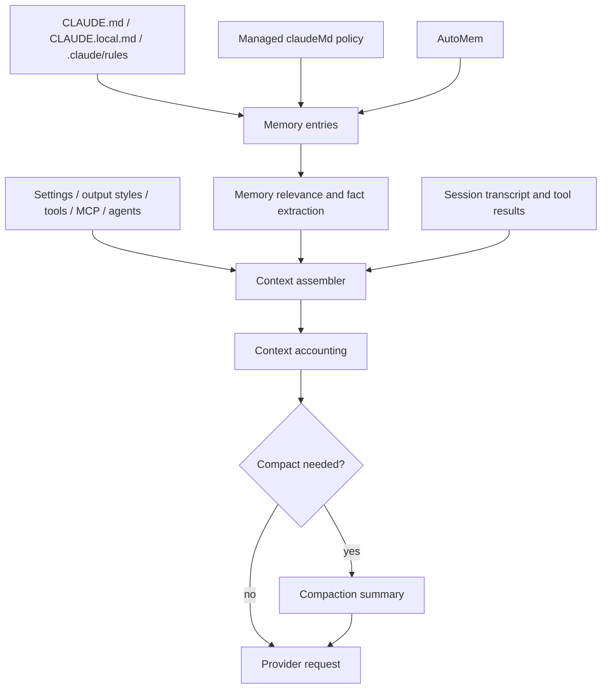
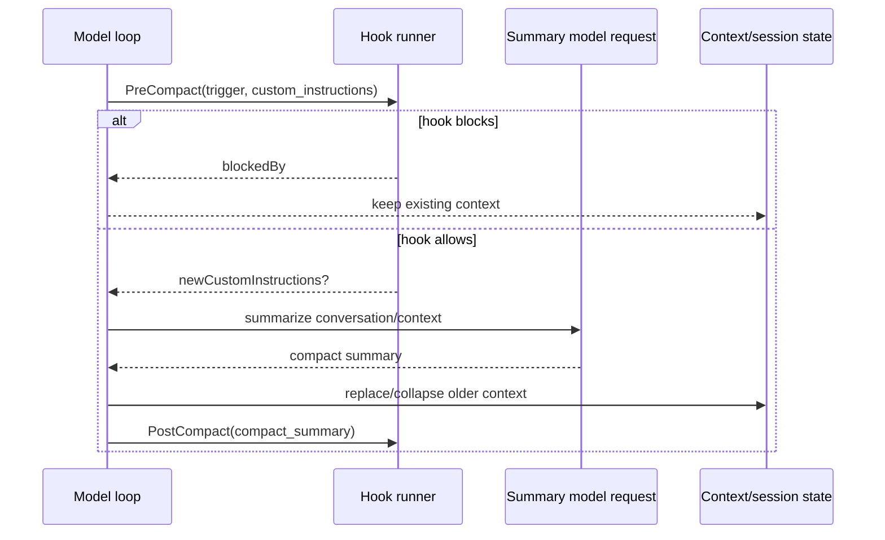

# Context, memory, compaction, checkpoints, and rewind

This page reverse-engineers how `cli.renamed.js` manages model-visible context and memory, how conversation compaction works, and which checkpoint/rewind surfaces are source-confirmed.

Scope: local/project/managed/auto memory, context accounting, manual and automatic compaction, compaction hooks, transcript context-collapse state, file checkpoints, `--rewind-files`, and the absence of a general source-confirmed `undo` command in this build.

## Source anchors

| Semantic alias | String or symbol | Meaning |
| --- | --- | --- |
| ManagedMemoryInjection | `CLAUDE.md-style instructions injected as organization-managed memory` | Managed/policy memory can inject `CLAUDE.md`-style instructions. |
| MemoryScopeResolver | `User`, `Local`, `Project`, `Managed`, `AutoMem` in `getMemoryPath` | Memory path resolver for global, local, project, managed, and auto-memory scopes. |
| ProjectRuleMemoryLoader | `.claude/rules`, `CLAUDE.local.md` | Project/local rule and memory loading path. |
| AutoMemoryNormalizer | `if(q==="AutoMem")w=Dr$(O).content` | Auto-memory content is normalized before becoming memory context. |
| DynamicPromptBoundary | `__SYSTEM_PROMPT_DYNAMIC_BOUNDARY__` | Runtime distinguishes stable and dynamic system-prompt sections. |
| PromptCacheMetadataGuard | `cache_control` | Prompt-cache metadata is stripped/hardened for hashing/accounting paths. |
| MemoryRelevanceRequest | `Select memories relevant to:` | Memory relevance request; uses a helper model and omits the normal system prefix. |
| AutoMemoryFactExtraction | `Extract facts relevant to:` | Auto-memory/fact extraction request path. |
| AutoCompactSetting | `autoCompactEnabled` | User setting: automatically compact when context fills. |
| AutoCompactUserExplanation | `Auto-compact summarizes the conversation when context usage approaches this limit` | User-visible `/autocompact` explanation. |
| AutoCompactGate | `DISABLE_COMPACT`, `DISABLE_AUTO_COMPACT`, `autocompact: tokens=` | Auto-compact gate and threshold calculation. |
| CompactionHookLifecycle | `PreCompact`, `PostCompact` | Hook lifecycle around compaction. |
| PreCompactHookSchema | `PreCompact`, `trigger`, `custom_instructions` | Hook schema for manual/auto compaction and hook-provided instructions. |
| PostCompactSummaryHook | `compact_summary` | `PostCompact` hook receives the produced summary. |
| PrecomputedCompaction | `precomputed compact: started` | Background/precomputed compaction path. |
| ReactiveCompactionBlock | `Reactive compact blocked by PreCompact hook` | Reactive compaction path and hook-block behavior. |
| CompactionSummaryFailure | `Failed to generate conversation summary` | Full compaction failure when no valid summary is returned. |
| PartialCompactionFailure | `tengu_partial_compact_failed` | Partial compaction failure path. |
| ContextLowWarning | `Context low ... Run /compact to compact & continue` | TUI context-low warning and manual compaction prompt. |
| ContextCollapseState | `contextCollapseCommits`, `contextCollapseSnapshot` | Context-collapse state is persisted/restored with session state. |
| FileCheckpointSetting | `fileCheckpointingEnabled` | File snapshot setting used by `/rewind`. |
| FileHistoryRewind | `FileHistory: [Rewind] Rewinding to snapshot` | File rewind implementation applies a tracked snapshot. |
| HeadlessRewindGuard | `Error: --rewind-files requires --resume` | Headless rewind guard. |
| RewindSuccessFrame | `Files rewound to state at message` | `--rewind-files` success path. |

## Runtime context model

`cli.renamed.js` treats context as layered runtime state, not as one static prompt string.

The main memory families are:

| Memory family | Source-confirmed roots | Runtime role |
|---|---|---|
| User/global memory | `CLAUDE.md` under the user config root | Private instructions across projects. |
| Project memory | project `CLAUDE.md`, project `.claude/rules` | Checked-in or project-scoped instructions. |
| Local memory | `CLAUDE.local.md` | Private project instructions, gated by local-settings support. |
| Managed memory | managed/policy `CLAUDE.md` or `claudeMd` setting | Organization-managed instructions that ordinary user/project excludes cannot remove. |
| Auto memory | `AutoMem` path resolved by `XZH`, normalized by `Dr$` | Persistent auto-memory across conversations. |

The memory loader can exclude user/project/local files with configured glob patterns, but the schema text explicitly says managed/policy files cannot be excluded through that mechanism.

## Memory selection is not memory compression

Two helper prompts are important:

- `Select memories relevant to:`
- `Extract facts relevant to:`

Both use `model:iv()` and `skipSystemPromptPrefix:!0` in the source anchors around lines ~1975-1976. That means memory relevance and fact extraction are their own lightweight model requests, not normal conversation turns with the full default system prompt.

This is different from compaction:

| Mechanism | What it changes | What it does not imply |
|---|---|---|
| Memory selection | Chooses or extracts relevant memory facts for the current prompt. | Does not rewrite the whole transcript. |
| AutoMem normalization | Cleans/normalizes auto-memory content before use. | Does not prove every memory file is summarized. |
| Context compaction | Summarizes conversation history so the agent can continue inside the context window. | Does not mean `CLAUDE.md` files themselves are compressed. |

So “memory compression” in this build is best described as **conversation/context compaction plus memory re-selection**, not as an in-place compression of memory files.

## Context accounting and auto-compact thresholds

Context accounting uses model-aware token/window logic. The visible surfaces include:

- `autoCompactEnabled`: persistent setting, defaulted on in global config.
- `autoCompactWindow`: configurable window size.
- `CLAUDE_CODE_AUTO_COMPACT_WINDOW`: environment override surfaced by `/autocompact` UI.
- `DISABLE_COMPACT` and `DISABLE_AUTO_COMPACT`: environment kill switches.
- UI text such as `Context low (...) · Run /compact to compact & continue`.

`p15(...)` computes the current token estimate, calls `ONH(...)`, logs `autocompact: tokens=<n> level=<level> effectiveWindow=<n>`, and returns true for `compact` or `blocked` levels. That makes compaction a runtime decision based on token pressure and the selected model/window, not just a slash command.

## Manual, automatic, precomputed, and reactive compaction

Compaction has several source-confirmed variants:

| Variant | Trigger | Confirmed anchors | Behavior |
|---|---|---|---|
| Manual compaction | `/compact` or command binding such as `command:compact` | `Context low ... Run /compact`, `command:compact` | User-controlled summary/rewrite of conversation context. |
| Auto compaction | Context approaches the configured/model-capped window | `autoCompactEnabled`, `autocompact: tokens=` | Runtime starts compaction without the user explicitly typing `/compact`. |
| Precomputed compaction | Background preparation before the hard limit | `precomputed compact: started` | Starts a compaction attempt ahead of need; caches or discards the result depending on hooks/abort/failure. |
| Reactive compaction | Request is about to be blocked by context pressure | `Reactive compact blocked by PreCompact hook` | Runs compaction synchronously enough to unblock continuation when possible. |
| Partial compaction | Some context is compacted while preserving a boundary | `tengu_partial_compact_failed` | Used when full compaction is not the right shape or a boundary marker must be kept. |

### Hook lifecycle

Compaction is hookable:

1. `PreCompact` receives `trigger: "manual" | "auto"` and nullable `custom_instructions`.
2. A hook can block compaction (`blockedBy`) or provide `newCustomInstructions`.
3. The runtime summarizes the current conversation/context.
4. `PostCompact` receives `compact_summary`.

### What compaction rebuilds afterward

After a valid summary, the full and partial compaction paths clear transient read/memory-selection state and rebuild context contributors. The source near `tengu_compact_failed` and `tengu_partial_compact_failed` shows calls that clear `readFileState`, clear `loadedNestedMemoryPaths`, reset the `memorySelector`, then re-add memory/tool/agent/MCP context fragments.

This is the key design point: compaction is not only “summarize old messages.” It also refreshes the non-message context surface so the next provider request has a compact transcript plus current tool, memory, MCP, and agent instructions.

### Failure behavior

| Failure | Source-confirmed behavior |
|---|---|
| Prompt still too long | Compaction retries can drop older messages and continue with fewer remaining messages. |
| No valid summary text | Throws `Failed to generate conversation summary - response did not contain valid text content`. |
| API error in summary call | Emits `tengu_compact_failed` / `tengu_partial_compact_failed` with `reason:"api_error"`. |
| Hook blocks compaction | Precomputed/reactive compaction is abandoned and logged as blocked. |
| Compaction disabled | UI shows context-low warnings and suggests `/clear` or manual trimming instead. |

## Checkpoint, rewind, and undo semantics

There are two separate “checkpoint-like” systems:

| State family | Source anchors | Purpose |
|---|---|---|
| Context-collapse state | `contextCollapseCommits`, `contextCollapseSnapshot` | Persists compaction/collapse metadata with the session so resume can rehydrate the collapsed context. |
| File-history snapshots | `fileCheckpointingEnabled`, `fileHistorySnapshots`, `FileHistory: [Rewind]` | Snapshots edited files before changes so the user can restore the file tree to a prior user-message point. |

`fileCheckpointingEnabled` is described as “Snapshot files before edits so /rewind can restore them.” The actual rewind implementation looks up the latest snapshot for a message ID and applies tracked backups. The headless `--rewind-files <user-message-id>` path validates that the target is a user message, performs the rewind, prints `Files rewound to state at message <id>`, and exits without running another model turn.

### Rewind is intentionally standalone

The headless runner rejects unsafe combinations before any model work:

| Guard | Runtime effect |
|---|---|
| `--rewind-files` without `--resume` | Exits with `Error: --rewind-files requires --resume`. |
| `--rewind-files` plus a prompt | Exits with `Error: --rewind-files is a standalone operation and cannot be used with a prompt`. |
| Target ID is not a user message | Exits with `Error: --rewind-files requires a user message UUID...`. |

This makes rewind a file-restore operation tied to a resumed transcript, not a prompt modifier.

### Is there `undo`?

For this build, the source-confirmed user-facing reversible operations are:

- resume/continue/fork at the session layer;
- context compaction/collapse at the prompt-history layer;
- file checkpoint + `/rewind` / `--rewind-files` at the filesystem layer.

No high-signal CLI flag or slash command for a general `undo` operation was confirmed in the runtime anchors used for this page. Hits for `undo` in the bundle are mostly unrelated vendor/editor strings, so this page does **not** document a general undo feature as confirmed behavior.

## Operational interpretation

The runtime manages continuity through three different persistence loops:

1. **Memory loop:** load `CLAUDE.md`/rules/managed/AutoMem, select relevant memories, and inject them into context.
2. **Context loop:** monitor token pressure, compact conversation history, and persist collapse metadata.
3. **Filesystem loop:** snapshot edited files and allow rewind to a previous user-message boundary.

These loops cooperate but do not collapse into one mechanism. A compaction summary can keep the conversation moving, while file rewind can restore disk state, and resume can rehydrate both kinds of state later.

## Caveats

- `cli.renamed.js` is bundled/minified; function names such as `p15`, `aq8`, `nj6`, `pA8`, and `XZH` are version-specific search anchors, not public APIs.
- This page documents local runtime surfaces. Hosted/managed-agent server-side compaction appears in embedded SDK docs and event examples, but local CLI behavior is anchored separately above.
- Exact token thresholds are model- and setting-dependent; the source-confirmed behavior is the thresholding pipeline and user-visible controls, not one universal number.

## Related docs

- [Prompt, context, and memory](prompt-context-memory.md)
- [Models, providers, and auth](models-providers-auth.md)
- [Model selection, calls, usage, quota, and billing](model-selection-usage-quota-billing.md)
- [Headless streaming and resilience](headless-streaming-and-resilience.md)
- [Session resume and transcripts](../04-sessions-persistence-remote/session-resume-and-transcripts.md)
- [MCP, plugins, and hooks](../03-tools-integrations-security/mcp-plugins-hooks.md)