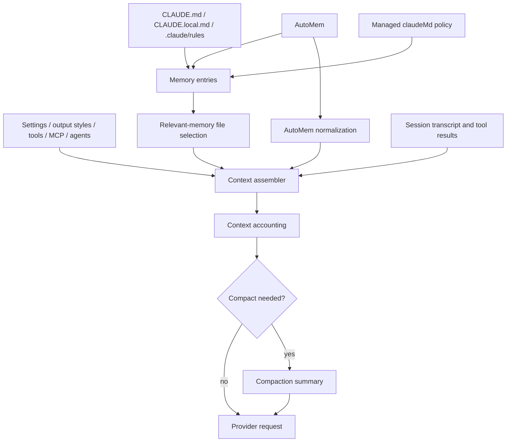
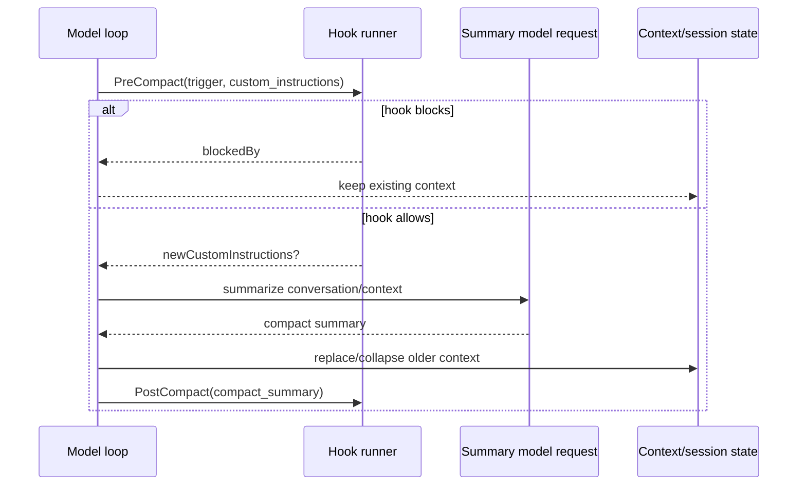

# Context, memory, compaction, checkpoints, and rewind

This page reverse-engineers how `cli.renamed.js` manages model-visible context and memory, how conversation compaction works, and which checkpoint/rewind surfaces are source-confirmed.

Scope: local/project/managed/auto memory, context accounting, manual and automatic compaction, compaction hooks, transcript context-collapse state, file checkpoints, `--rewind-files`, and the absence of a general source-confirmed `undo` command in this build.

## Source anchors

| Semantic alias | String or symbol | Meaning |
| --- | --- | --- |
| ManagedMemoryInjection | `CLAUDE.md-style instructions injected as organization-managed memory` | Managed/policy memory can inject `CLAUDE.md`-style instructions. |
| MemoryScopeResolver | `User`, `Local`, `Project`, `Managed`, `AutoMem` in `getMemoryPath` | Memory path resolver for global, local, project, managed, and auto-memory scopes. |
| ProjectRuleMemoryLoader | `.claude/rules`, `CLAUDE.local.md` | Project/local rule and memory loading path. |
| AutoMemoryNormalizer | `qAg()` → `N4r(content)`, `VAg()` | Auto-memory content is normalized before becoming memory context. |
| DynamicPromptBoundary | `__SYSTEM_PROMPT_DYNAMIC_BOUNDARY__` | Runtime distinguishes stable and dynamic system-prompt sections. |
| PromptCacheMetadataGuard | `cache_control` | Prompt-cache metadata is stripped/hardened for hashing/accounting paths. |
| MemoryRelevanceRequest | `Izy()`, `Select memories relevant to:` | Structured memory-file selector using the default Sonnet model without the normal system prefix. |
| AutoCompactSetting | `autoCompactEnabled` | User setting: automatically compact when context fills. |
| AutoCompactUserExplanation | `Auto-compact summarizes the conversation when context usage approaches this limit` | User-visible `/autocompact` explanation. |
| AutoCompactGate | `wWg()`, `autocompact()`, `AWg()` | Model-aware threshold check, auto-compaction routing, and fixed-prefix overflow detection. |
| CompactionHookLifecycle | `PreCompact`, `PostCompact` | Hook lifecycle around compaction. |
| PreCompactHookSchema | `PreCompact`, `trigger`, `custom_instructions` | Hook schema for manual/auto compaction and hook-provided instructions. |
| PostCompactSummaryHook | `compact_summary` | `PostCompact` hook receives the produced summary. |
| FullCompaction | `rlo()` | Full manual/automatic summary path, including hooks, retries, boundary creation, and refreshed attachments. |
| PartialCompaction | `YMu()` | Message-selector compaction in `from` or `up_to` direction while preserving the opposite segment. |
| ReactiveCompaction | `flo()` → `Bas()` → `ilo()` → `hlo()` | Hook orchestration, grouped retrying summary, and result materialization under immediate pressure. |
| PrecomputedCompaction | `Ras()` → `ilo()`, then `Das()` → `hlo()` | Background arm and later swap/consume path. |
| PrecomputedSidecar | `Qrr()`, `oOu()`, `iOu()`, `.precompact.json` | Versioned, size-bounded persistence for a ready main-session precompute. |
| PreservedMessageMetadata | `gas()`, `preservedMessages`, `preservedSegment` | Current explicit preserved-UUID metadata and its legacy contiguous-segment compatibility form. |
| TranscriptCompactionRelink | `dOd()`, `_8y()`, `buildConversationChain()` | Resume-time preserved-message relinking and conversation-chain reconstruction. |
| CompactionSummaryFailure | `Failed to generate conversation summary` | Full compaction failure when no valid summary is returned. |
| PartialCompactionFailure | `tengu_partial_compact_failed` | Partial compaction failure path. |
| ContextLowWarning | `Context low ... Run /compact to compact & continue` | TUI context-low warning and manual compaction prompt. |
| ContextCollapseState | `contextCollapseCommits`, `contextCollapseSnapshot` | Context-collapse state is persisted/restored with session state. |
| FileCheckpointSetting | `fileCheckpointingEnabled` | File snapshot setting used by `/rewind`. |
| FileHistoryRewind | `FileHistory: [Rewind] Rewinding to snapshot` | File rewind implementation applies a tracked snapshot. |
| HeadlessRewindGuard | `Error: --rewind-files requires --resume` | Headless rewind guard. |
| RewindSuccessFrame | `Files rewound to state at message` | `--rewind-files` success path. |

## Runtime context model

`cli.renamed.js` treats context as layered runtime state, not as one static prompt string.


```mermaid
flowchart TD
    Files[CLAUDE.md / CLAUDE.local.md / .claude/rules] --> Memory[Memory entries]
    Managed[Managed claudeMd policy] --> Memory
    Auto[AutoMem] --> Memory
    Settings[Settings / output styles / tools / MCP / agents] --> Context[Context assembler]
    Memory --> Selector[Relevant-memory file selection]
    Auto --> Normalize[AutoMem normalization]
    Normalize --> Context
    Selector --> Context
    Transcript[Session transcript and tool results] --> Context
    Context --> Budget[Context accounting]
    Budget --> Compact{Compact needed?}
    Compact -->|no| Request[Provider request]
    Compact -->|yes| Summary[Compaction summary]
    Summary --> Request
```

The main memory families are:

| Memory family | Source-confirmed roots | Runtime role |
|---|---|---|
| User/global memory | `CLAUDE.md` under the user config root | Private instructions across projects. |
| Project memory | project `CLAUDE.md`, project `.claude/rules` | Checked-in or project-scoped instructions. |
| Local memory | `CLAUDE.local.md` | Private project instructions, gated by local-settings support. |
| Managed memory | managed/policy `CLAUDE.md` or `claudeMd` setting | Organization-managed instructions that ordinary user/project excludes cannot remove. |
| Auto memory | `getMemoryPath("AutoMem")`, normalized by `N4r()` in `qAg()`/`VAg()` | Persistent auto-memory across conversations. |

The memory loader can exclude user/project/local files with configured glob patterns, but the schema text explicitly says managed/policy files cannot be excluded through that mechanism.

## Memory selection is not memory compression

`Izy()` issues a dedicated helper request beginning `Select memories relevant to:`. It uses the default Sonnet model, sets `skipSystemPromptPrefix: true`, caps output at 256 tokens, and requires a JSON object containing `selected_memories`. Returned names are filtered against the candidate filename map, with the selector prompt asking for at most five clearly useful memories. This is a separate request, not a normal conversation turn with the full default system prompt.

The current source does normalize AutoMem content through `N4r()` before injection, but no enclosing implementation for a separate `Extract facts relevant to:` request was confirmed in this build. This page therefore does not treat fact extraction as a current, independent model-call mechanism.

This is different from compaction:

| Mechanism | What it changes | What it does not imply |
|---|---|---|
| Memory selection | Chooses relevant memory files for the current prompt. | Does not rewrite the whole transcript or prove a separate fact-extraction pass. |
| AutoMem normalization | Cleans/normalizes auto-memory content before use. | Does not prove every memory file is summarized. |
| Context compaction | Summarizes conversation history so the agent can continue inside the context window. | Does not mean `CLAUDE.md` files themselves are compressed. |

So “memory compression” in this build is best described as **conversation/context compaction plus memory re-selection**, not as an in-place compression of memory files.

## Context accounting and auto-compact thresholds

Context accounting uses model-aware token/window logic. The visible surfaces include:

- `autoCompactEnabled`: persistent setting, defaulted on in global config.
- `autoCompactWindow`: configurable window size.
- `CLAUDE_CODE_AUTO_COMPACT_WINDOW`: environment override surfaced by `/autocompact` UI.
- `DISABLE_COMPACT` and `DISABLE_AUTO_COMPACT`: environment kill switches.
- UI text such as `Context low (...) · Run /compact to compact & continue`.

`wWg(...)` computes the current model-aware estimate (minus any supplied token credit), evaluates it against the effective window, logs `autocompact: tokens=<n> level=<level> effectiveWindow=<n>`, and returns true for `compact` or `blocked` levels. `autocompact(...)` then applies feature, query-source, failure-breaker, and rapid-refill gates before choosing a full or reactive route. `AWg(...)` separately detects a fixed cached prefix that is already larger than the threshold, because summarizing transcript messages cannot make that prefix smaller.

## Full, partial, reactive, and precomputed compaction

Compaction has several source-confirmed execution shapes. “Automatic” is a trigger, while “full,” “partial,” and “reactive” describe how the replacement is produced. A precomputed result is an optimization of the reactive shape rather than a different transcript format.

| Variant | Trigger | Confirmed anchors | Behavior |
|---|---|---|---|
| Full | `/compact`, or the normal automatic route at a model/window threshold | `rlo()` | Summarizes the conversation, emits a compact boundary plus a transcript-only summary message, and rebuilds current attachments. `isAutoCompact` changes hook/telemetry behavior but not the result shape. |
| Partial | Message-selector operation with direction `from` or `up_to` | `YMu()` | Summarizes one side of a selected index, keeps the other side, and records preservation metadata so the retained messages can be reconstructed. Optional user feedback is folded into summary instructions. |
| Reactive | Immediate threshold or prompt-too-long recovery route | `flo()`, `Bas()`, `ilo()`, `hlo()` | Summarizes older normalized conversation groups while retaining a suffix. It can increase the retained suffix across retries rather than repeatedly sending the same oversized prefix. |
| Precomputed | Background arm before immediate recovery is required | `Ras()`, `Das()` | Runs the grouped reactive summarizer ahead of time. At pressure time the runtime validates the boundary, appends messages created since precompute to the retained suffix, and materializes the result through `hlo()`. |

`autocompact(...)` can call `rlo()` directly or route through `flo()` depending on the effective threshold source and runtime mode. Therefore “auto compact” must not be read as an alias for only the full summarizer.

### Hook lifecycle

Hook timing differs slightly by path:

1. Full `rlo()` and partial `YMu()` run `PreCompact` immediately before their summary request. `PreCompact` receives `trigger: "manual" | "auto"` and nullable `custom_instructions`.
2. A hook can block compaction through `blockedBy` or extend the summary request through `newCustomInstructions`.
3. Non-precomputed reactive compaction runs `PreCompact` in `flo()`, summarizes through `Bas()`/`ilo()`, and materializes through `hlo()`.
4. Precomputed compaction runs `PreCompact` when `Ras()` arms the background job. A blocked result is never made ready. If the result is later consumed, the stored hook display text is carried forward; `PreCompact` is not rerun at swap time.
5. Successful paths run `PostCompact` only when the result is materialized. It receives `compact_summary`; for precompute this occurs when `hlo()` applies the ready result, not when the background summary first becomes ready.


```mermaid
sequenceDiagram
    participant ModelLoop as Model loop
    participant Hooks as Hook runner
    participant Model as Summary model request
    participant State as Context/session state

    ModelLoop->>Hooks: PreCompact(trigger, custom_instructions)
    alt hook blocks
        Hooks-->>ModelLoop: blockedBy
        ModelLoop-->>State: keep existing context
    else hook allows
        Hooks-->>ModelLoop: newCustomInstructions?
        ModelLoop->>Model: summarize conversation/context
        Model-->>ModelLoop: compact summary
        ModelLoop->>State: replace/collapse older context
        ModelLoop->>Hooks: PostCompact(compact_summary)
    end
```

### Reactive grouping and retry behavior

`ilo()` first removes progress-only noise and groups the conversation into turn-like units. It begins by preserving the newest group and asking a one-turn forked summarizer to summarize the older prefix. On a prompt-too-long result it preserves more trailing groups:

- when the error supplies a token gap, the next step estimates how many additional groups cover that gap;
- without a parseable gap, it advances one group;
- a media-too-large result gets one retry with media replaced by placeholders;
- aborts and ordinary API errors stop the attempt rather than silently applying a partial result;
- the routine fails when fewer than two groups exist, no assistant message is in the summary prefix, or every possible split is exhausted.

A successful grouped result contains the summary text/messages, the exact messages to preserve, attempt count, group counts, fork usage, and assistant-message count. `hlo()` turns that result into the normal boundary/summary/attachment shape. Preserved assistant messages keep their content but have historical usage counters zeroed before reinsertion so the retained suffix is not reported as fresh model usage.

### Precomputed result state and sidecar

`Ras()` stores an in-memory entry keyed by the main session or agent key with `pending`, `ready`, or `failed` state. `Das()` consumes a result at threshold or eligible withheld-413 recovery. It waits for an in-flight entry when necessary, rejects a ready result if its `precomputedAtUuid` boundary no longer exists, and otherwise returns both the precomputed summary and all non-progress messages added after that boundary.

For the eligible main-session path, a ready result can also be written beside the transcript as `<session>.precompact.json`. The retained schema is version `1`, is capped at **8,000,000 bytes**, and includes:

| Field group | Retained values |
|---|---|
| Identity | `version`, `sessionId`, `agentKey: "main"`, `model`, `cliVersion` |
| Timing/boundary | `createdAt`, `precomputedAtUuid`, `preCompactTokens`, `readyDurationMs` |
| Hook/summary | optional `preCompactHookDisplay`, `summaryText`, non-empty `summaryMessages` |
| Preservation | `preserveUuids` |
| Retry/usage | `attempt`, `groupsPreserved`, `totalGroups`, `forkAssistantMessageCount`, `totalUsage` |

The reader rejects malformed, oversized, unparseable, non-version-1 sidecars before rehydration. Rehydration then requires all of the following:

- the current session ID and model exactly match;
- the timestamp parses and is no more than seven days old;
- `precomputedAtUuid` still exists in the transcript;
- context has not grown by more than 150,000 estimated tokens;
- context has not shrunk by more than half of `preCompactTokens`;
- every `preserveUuids` entry still resolves to a current message.

The retained `cliVersion` is logged as a match/mismatch signal but is **not** itself a rejection condition in this build. A rejected sidecar is scheduled for deletion. Consumption, explicit discard, post-compaction cleanup, and applicable session/agent teardown also remove or abort the entry and clean up its sidecar. Persistence failure merely leaves the in-memory ready result available; it does not invalidate the completed summary.

### What compaction rebuilds afterward

After a valid summary, full, partial, and reactive materialization clear transient read/memory-selection state: `readFileState`, `loadedNestedMemoryPaths`, and the `memorySelector`. `nlo()` then builds a current post-compaction attachment set rather than copying every old attachment verbatim. Depending on current state it can restore bounded recent file attachments, task status, a plan reference and plan-mode reminder, invoked skills, deferred-tool deltas, agent-listing deltas, MCP-instruction deltas, and `SessionStart` hook results for the `compact` source.

The recent-file restore is itself bounded: at most five files, at most 5,000 tokens per generated file attachment, and at most 50,000 estimated tokens across those attachments. This is the key design point: compaction is not only “summarize old messages.” It also reconstructs a bounded, current non-message context surface for the next provider request.

### Boundary metadata and transcript reconstruction

Materialized partial/reactive results call `gas()` to annotate the compact boundary. Current metadata records an explicit `preservedMessages` object:

```text
{
    anchorUuid,
    uuids,      // cleaned/loggable preserved messages
    allUuids    // full preserved input before logging cleanup
}
```

When there are cleaned preserved messages, the boundary also carries the older contiguous `preservedSegment` form (`headUuid`, `anchorUuid`, `tailUuid`) for compatibility. Current resume logic prefers the explicit list.

On transcript load, `dOd()` only relinks preserved history when the latest compact boundary has usable preservation metadata. For `preservedMessages`, it verifies that every listed UUID exists, chains those messages after `anchorUuid`, zeros retained assistant usage counters, removes older non-preserved pre-boundary messages, and repairs children that pointed into the removed segment. If only the legacy `preservedSegment` exists, `_8y()` walks parent links from `tailUuid` back to `headUuid`; it accepts the segment only if the walk reaches the declared head without a cycle or missing link. A broken list/walk is logged and is not guessed into place.

The surrounding `buildConversationChain()` reconstruction then walks `parentUuid` from the selected leaf, stops and reports cycles, and can recover narrowly from missing links using same-sidechain timestamps. It also restores parallel assistant chunks sharing a provider message ID and their tool results. These repairs explain how preserved suffixes survive resume, but they do not make arbitrary unchained transcript records valid: records that cannot join the selected chain can still be dropped.

### Failure behavior

| Failure | Source-confirmed behavior |
|---|---|
| Full/partial prompt still too long | The summarizer can truncate older groups and retry up to three times; exhaustion raises the conversation-too-long failure instead of emitting an invalid boundary. |
| Reactive prompt still too long | `ilo()` increases the preserved suffix using a token-gap-guided or one-group step until a split works or all splits are exhausted. |
| Reactive media too large | Retries once with image/document content represented by placeholders; a second media failure becomes `media_unstrippable`. |
| No valid summary text | Throws `Failed to generate conversation summary - response did not contain valid text content`. |
| API error in summary call | Emits `tengu_compact_failed` / `tengu_partial_compact_failed` with `reason:"api_error"`. |
| Summary model unavailable | The summary request can advance through its availability fallback chain; a blocked model with no acceptable fallback surfaces a compaction error. |
| Hook blocks compaction | Full/partial compaction throws a hook-blocked error; reactive/precomputed compaction returns or clears the attempt without applying a replacement. |
| Repeated automatic failures | The automatic path opens a session circuit breaker after three consecutive failures; a separate rapid-refill breaker can stop repeated near-immediate compactions. |
| Invalid precompute sidecar | Rehydration is rejected and the sidecar is deleted asynchronously; normal compaction remains available. |
| Compaction disabled | UI shows context-low warnings and suggests `/clear` or manual trimming instead. |

## Checkpoint, rewind, and undo semantics

There are three separate “checkpoint-like” systems:

| State family | Source anchors | Purpose |
|---|---|---|
| Compaction transcript state | `compact_boundary`, `compactMetadata`, `preservedMessages` | Persists summary boundaries and enough preservation metadata for the active compacted conversation to be relinked on resume. |
| Context-collapse state | `marble-origami-commit`, `marble-origami-snapshot`, `marble-origami-reset` | Persists a separate context-collapse subsystem's commits/latest snapshot; a reset tombstone discards earlier retained collapse state. It is not the same record family as summary compaction. |
| File-history snapshots | `fileCheckpointingEnabled`, `fileHistorySnapshots`, `FileHistory: [Rewind]` | Snapshots edited files before changes so the user can restore the file tree to a prior user-message point. |

The transcript loader handles these independently. Compact boundaries affect which conversation messages survive and how preserved UUIDs are relinked. `marble-origami-*` records populate `contextCollapseCommits` and `contextCollapseSnapshot` without standing in for compact summaries. File-history snapshot/delta records reconstruct tracked-file backups for rewind without changing the provider-visible conversation.

`fileCheckpointingEnabled` is described as “Snapshot files before edits so /rewind can restore them.” The actual rewind implementation looks up the latest snapshot for a message ID and applies tracked backups. The headless `--rewind-files <user-message-id>` path validates that the target is a user message, performs the rewind, prints `Files rewound to state at message <id>`, and exits without running another model turn.

### Rewind is intentionally standalone

The headless runner rejects unsafe combinations before any model work:

| Guard | Runtime effect |
|---|---|
| `--rewind-files` without `--resume` | Exits with `Error: --rewind-files requires --resume`. |
| `--rewind-files` plus a prompt | Exits with `Error: --rewind-files is a standalone operation and cannot be used with a prompt`. |
| Target ID is not a user message | Exits with `Error: --rewind-files requires a user message UUID...`. |

This makes rewind a file-restore operation tied to a resumed transcript, not a prompt modifier.

### Is there `undo`?

For this build, the source-confirmed user-facing reversible operations are:

- resume/continue/fork at the session layer;
- context compaction/collapse at the prompt-history layer;
- file checkpoint + `/rewind` / `--rewind-files` at the filesystem layer.

No high-signal CLI flag or slash command for a general `undo` operation was confirmed in the runtime anchors used for this page. Hits for `undo` in the bundle are mostly unrelated vendor/editor strings, so this page does **not** document a general undo feature as confirmed behavior.

## Operational interpretation

The runtime manages continuity through three different persistence loops:

1. **Memory loop:** load `CLAUDE.md`/rules/managed/AutoMem, select relevant memories, and inject them into context.
2. **Context loop:** monitor token pressure, compact conversation history, persist compact boundaries/preserved UUIDs, and separately retain context-collapse records.
3. **Filesystem loop:** snapshot edited files and allow rewind to a previous user-message boundary.

These loops cooperate but do not collapse into one mechanism. A compaction summary can keep the conversation moving, while file rewind can restore disk state, and resume can rehydrate both kinds of state later.

## Caveats

- `cli.renamed.js` is bundled/minified; function names such as `rlo`, `YMu`, `ilo`, `Ras`, `Das`, `flo`, `Bas`, and `hlo` are version-specific search anchors, not public APIs.
- This page documents local runtime surfaces. Hosted/managed-agent server-side compaction appears in embedded SDK docs and event examples, but local CLI behavior is anchored separately above.
- Exact token thresholds are model- and setting-dependent; the source-confirmed behavior is the thresholding pipeline and user-visible controls, not one universal number.
- Sidecar validation proves only client-side reuse rules. It does not prove that every abrupt process exit leaves a reusable sidecar, or that other versions accept the same schema and thresholds.

## Related docs

- [Prompt, context, and memory](prompt-context-memory.md)
- [Models, providers, and auth](models-providers-auth.md)
- [Model selection, calls, usage, quota, and billing](model-selection-usage-quota-billing.md)
- [Headless streaming and resilience](headless-streaming-and-resilience.md)
- [Session resume and transcripts](../04-sessions-persistence-remote/session-resume-and-transcripts.md)
- [MCP, plugins, and hooks](../03-tools-integrations-security/mcp-plugins-hooks.md)