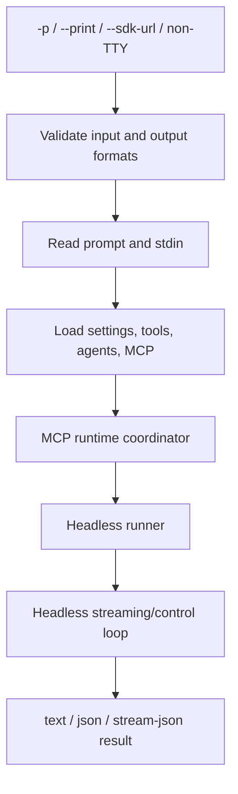
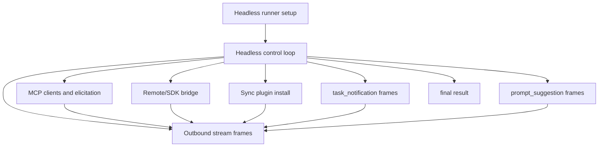

# Headless streaming and resilience

This page documents the non-interactive execution path used by `claude -p`, SDK transports, `--init-only`, and non-TTY stdout.

## Source anchors

| Semantic alias | String or symbol | Meaning |
| --- | --- | --- |
| HeadlessModePredicate | `$.includes("-p")||$.includes("--print")` | Early predicate for non-interactive setup. |
| HeadlessMcpCoordinator | `let o4=fH9({regularMcpConfigs:Ww` | Headless branch creates MCP coordinator. |
| HeadlessRunnerLazyImport | `let{runHeadless:u7}=await Promise.resolve().then(() => (M89(),O89))` | Lazy imports headless runner. |
| HeadlessRunner | `async function runHeadless` | `runHeadless` implementation. |
| HeadlessControlLoop | `function runHeadlessStreamingForTesting` | Main headless streaming/control loop. |
| OutputFormatFlag | `--output-format <format>` | `text`, `json`, and `stream-json` output selector. |
| InputFormatFlag | `--input-format <format>` | `text` or `stream-json` input selector. |
| SdkUrlTransportFlag | `--sdk-url <url>` | Remote WebSocket endpoint for SDK I/O streaming. |
| SdkPermissionControlFrame | `can_use_tool control_request` | Permission prompt/control frame surface for SDK hosts. |
| BridgePermissionResponseFrame | `permission_response` | Remote/bridge permission response frame. |

## Headless flow

## Format and control surfaces

| Surface | Runtime role |
|---|---|
| `--output-format text|json|stream-json` | Selects final/result framing. |
| `--input-format text|stream-json` | Selects prompt input framing. |
| `--sdk-url <url>` | Requires stream-JSON input and output and connects to a remote SDK endpoint. |
| `--include-partial-messages` | Emits partial message chunks for stream-JSON print mode. |
| `--replay-user-messages` | Re-emits user messages from stdin for stream-JSON acknowledgement. |
| `--json-schema <schema>` | Adds structured-output validation for print mode. |
| `control_request` | Host-facing request frame family. |
| `can_use_tool` | Permission prompt request subtype. |
| `permission_response` | Host/bridge response to a permission prompt. |
| `mcp_tool_call` | MCP tool-call telemetry/error surface in the headless/runtime path. |

## Resilience and guardrails

The headless runner validates several incompatible combinations before executing:

- `--resume-session-at` requires `--resume`.
- `--rewind-files` requires `--resume` and cannot be used with a prompt.
- SDK URL mode requires stream-JSON input and output.
- Partial messages require print mode and stream-JSON output.
- Print mode requires input unless the resume/SDK path supplies it.

`HeadlessControlLoop` is the headless equivalent of the interactive dispatcher. It handles stream input, permission/control requests, MCP status and calls, background-task control, bash command messages, session state, and result emission.

## Control-loop internals

This section deepens the surface above by reconstructing the implementation mechanics of `HeadlessRunner` and `HeadlessControlLoop`.

### Additional anchors

| Semantic alias | String or symbol | Meaning |
| --- | --- | --- |
| ResumeSessionAtGuard | `Error: --resume-session-at requires --resume` | Resume truncation guard. |
| RewindFilesResumeGuard | `Error: --rewind-files requires --resume` | Rewind guard. |
| RewindFilesStandaloneGuard | `Error: --rewind-files is a standalone operation and cannot be used with a prompt` | Rewind is standalone, not prompt-plus-rewind. |
| SdkStartupPhaseLogger | `SDKStartup: phase=` | SDK startup phase logging for remote transport setup. |
| HeadlessResultErrorTypes | `error_max_turns`, `error_max_budget_usd`, `error_max_structured_output_retries` | Result error subtypes in the headless schema. |
| HeadlessHookFrames | `hook_started`, `hook_progress`, `hook_response` | Headless hook lifecycle system frames. |
| HeadlessOutboundChannel | `let h=H.outbound` | `H89` uses an outbound queue/channel abstraction. |
| RateLimitEventFrame | `rate_limit_event` | Rate-limit state changes are emitted into the outbound stream. |
| McpElicitationCompleteFrame | `elicitation_complete` | MCP elicitation completion is bridged into system frames. |
| BridgeStateFrame | `bridge_state` | Remote/SDK bridge state transitions are emitted as system frames. |

### Runner setup

`HeadlessRunner` is entered after the root action has validated the high-level print/SDK mode and built a state object, tool lists, MCP configs, active agents, output options, and session hooks. Mechanically, the beginning of `HeadlessRunner` does four things before it reaches the model loop:

1. **Subscribes to settings/state changes.** The function starts with a `TI.subscribe(...)` hook that can update headless state, including fast-mode state.
2. **Enables periodic garbage collection.** `setInterval(Bun.gc,1000).unref()` is explicit in the function body — a Bun-specific runtime detail.
3. **Records startup telemetry.** `tengu_timer` is emitted with startup duration, MCP server count, and whether the run is resumed.
4. **Runs hard validation before model execution** — rejects invalid resume/rewind combinations before any main loop work.

| Guard | Condition | Effect |
|---|---|---|
| Resume truncation | `resumeSessionAt` without `resume` | Writes `Error: --resume-session-at requires --resume` and exits. |
| Rewind without resume | `rewindFiles` without `resume` | Writes `Error: --rewind-files requires --resume` and exits. |
| Rewind with prompt | `rewindFiles` plus prompt text | Writes `Error: --rewind-files is a standalone operation and cannot be used with a prompt` and exits. |

Rewind is therefore implemented as a standalone transcript/file-state operation, not as an extra option on a normal prompt run.

### SDK startup and transport boundary

`HeadlessRunner` computes a bridge/SDK condition from `sdkUrl` and `CLAUDE_CODE_ENVIRONMENT_KIND`. When SDK transport logging is enabled, it writes phase markers such as `SDKStartup: phase=<phase> t=<seconds>s`. These markers show that SDK-mode startup is a staged transport initialization path, not only a different stdout format. `CLAUDE_CODE_SDK_HAS_OAUTH_REFRESH` and `CLAUDE_CODE_ENTRYPOINT` are also checked here, so OAuth refresh and SDK entrypoint classification participate before the control loop begins.

### Headless outbound stream model

`HeadlessControlLoop` starts by binding an outbound stream/channel. The outbound stream is not just model text — it multiplexes system state, auth, MCP, plugin, bridge, prompt-suggestion, task, and final result frames:

| Frame type or subtype | Meaning |
|---|---|
| `transcript_mirror` | Internal frame emitted after transcript writes when session mirroring is enabled. |
| `auth_status` | Authentication progress/status frame. |
| `rate_limit_event` | Rate-limit changes are streamed to SDK/headless consumers. |
| `elicitation_complete` | MCP URL-mode elicitation completion is surfaced. |
| `plugin_install` | Synchronous plugin-install progress can be streamed. |
| `task_notification` | Background task/monitor status is streamed. |
| `prompt_suggestion` | Predicted next prompt can be emitted after a turn. |
| `bridge_state` | Remote/SDK bridge state changes are surfaced. |
| `control_response` | Responses to inbound control requests. |
| `result` | Final run result, including success or error subtype. |

### Control-loop side channels

Important mechanics inside `HeadlessControlLoop`:

- Enables `transcript_mirror` frames when stream JSON plus session mirror is active.
- Subscribes to auth status and rate-limit changes and converts them to outbound frames.
- Watches MCP client changes and registers elicitation completion handlers.
- Emits `bridge_state` frames when the Remote Control/SDK bridge changes state.
- Supports synchronous plugin installation frames behind `CLAUDE_CODE_SYNC_PLUGIN_INSTALL`.
- Can start a cron scheduler when recurring task support is enabled; scheduled prompts are enqueued later into the loop.

### Result and error model

The result schema around line ~2004 differentiates normal results from structured error results. The error subtype enum includes `error_during_execution`, `error_max_turns`, `error_max_budget_usd`, and `error_max_structured_output_retries`, so headless callers can distinguish execution error, turn limit, budget limit, and structured-output retry exhaustion.

### Caveats

- `HeadlessControlLoop` is large and minified. This section documents confirmed side channels and frame families, not every branch.
- Some frame schemas are defined outside `HeadlessControlLoop` near line ~2004 and are included here only when the loop also emits or references the same frame family.

## Related docs

- [CLI main paths](../01-runtime-lifecycle/cli-main-paths.md)
- [Context and model loop architecture](architecture.md)
- [Context, memory, compaction, checkpoints, and rewind](context-memory-compaction-checkpoints.md)
- [Model selection, calls, usage, quota, and billing](model-selection-usage-quota-billing.md)
- [MCP, plugins, and hooks](../03-tools-integrations-security/mcp-plugins-hooks.md)
- [Session resume and transcripts](../04-sessions-persistence-remote/session-resume-and-transcripts.md)
- [SDK query, session API, and subagent surface](../04-sessions-persistence-remote/sdk-query-and-session-api.md)
- [Tool runtime and security architecture](../03-tools-integrations-security/architecture.md)
