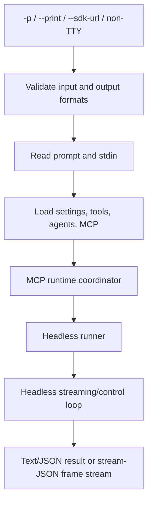
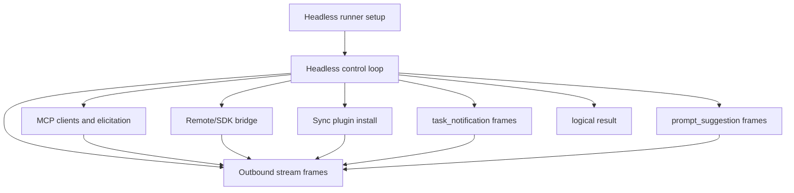

# Headless streaming and resilience

This page documents the non-interactive execution path used by `claude -p`, SDK transports, `--init-only`, and non-TTY stdout.

## Source anchors

| Semantic alias | String or symbol | Meaning |
| --- | --- | --- |
| HeadlessModePredicate | `$.includes("-p")||$.includes("--print")` | Early predicate for non-interactive setup. |
| HeadlessMcpCoordinator | `let o4=fH9({regularMcpConfigs:Ww` | Headless branch creates MCP coordinator. |
| HeadlessRunnerLazyImport | `let{runHeadless:u7}=await Promise.resolve().then(() => (M89(),O89))` | Lazy imports headless runner. |
| HeadlessRunner | `async function runHeadless` | `runHeadless` implementation. |
| HeadlessControlLoop | `function runHeadlessStreamingForTesting` | Main headless streaming/control loop. |
| OutputFormatFlag | `--output-format <format>` | `text`, `json`, and `stream-json` output selector. |
| InputFormatFlag | `--input-format <format>` | `text` or `stream-json` input selector. |
| SdkUrlTransportFlag | `--sdk-url <url>` | Remote WebSocket endpoint for SDK I/O streaming. |
| SdkPermissionControlFrame | `can_use_tool control_request` | Permission prompt/control frame surface for SDK hosts. |
| BridgePermissionResponseFrame | `permission_response` | Remote/bridge permission response frame. |
| ControlRequestEnvelope | `type:"control_request"`, `request_id`, `request` | Correlated request from the runtime to a host or from a host into the runtime. |
| ControlResponseEnvelope | `type:"control_response"`, `response:{subtype,request_id,...}` | Correlated success/error response. |
| ControlCancelEnvelope | `type:"control_cancel_request"`, `request_id` | Cancels the pending operation with the same request ID. |
| InterruptRequest | `request.subtype:"interrupt"`, `still_queued` | Aborts the active turn and returns UUID-stamped main-thread work that survives [~943,331–943,350, ~953,700](../../claude-code-pkg/src/entrypoints/cli.renamed.js#L943331). |
| AsyncMessageCancel | `request.subtype:"cancel_async_message"` | Removes a message still present in the prompt queue; it does not mean “interrupt the turn” [~954,118](../../claude-code-pkg/src/entrypoints/cli.renamed.js#L954118). |
| PromptPriorityQueue | `OQn={now:0,next:1,later:2}`, `CSg()` | Orders main-thread prompts and notifications; ordinary enqueue defaults to `next`, pending notifications to `later` [~256,890–257,215](../../claude-code-pkg/src/entrypoints/cli.renamed.js#L256890). |
| MidTurnQueueFold | `getCommandsByMaxPriority("next")`, `queued_command` | Eligible `now`/`next` messages can steer the next recursive model call between tool batches [~462,520–462,610](../../claude-code-pkg/src/entrypoints/cli.renamed.js#L462520). |
| SdkCleanup | `performCleanup()` | Rejects unresolved control promises and closes registered transports/resources. |
| SubprocessTermination | `SIGTERM`, `SIGKILL`, `5000` | Closes stdin, terminates, then force-kills a surviving SDK subprocess after five seconds. |

## Headless flow


```mermaid
flowchart TD
    Args[-p / --print / --sdk-url / non-TTY] --> Validate[Validate input and output formats]
    Validate --> Prompt[Read prompt and stdin]
    Prompt --> Setup[Load settings, tools, agents, MCP]
    Setup --> MCP[MCP runtime coordinator]
    MCP --> Runner[Headless runner]
    Runner --> Loop[Headless streaming/control loop]
    Loop --> Output[Text/JSON result or stream-JSON frame stream]
```

## Format and control surfaces

| Surface | Runtime role |
|---|---|
| `--output-format text|json|stream-json` | Selects text/JSON result serialization or the multiplexed stream-JSON frame stream. |
| `--input-format text|stream-json` | Selects prompt input framing. |
| `--sdk-url <url>` | Requires stream-JSON input and output and connects to a remote SDK endpoint. |
| `--include-partial-messages` | Emits partial message chunks for stream-JSON print mode. |
| `--replay-user-messages` | Re-emits user messages from stdin for stream-JSON acknowledgement. |
| `--json-schema <schema>` | Adds structured-output validation for print mode. |
| `control_request` | Correlated host/runtime request frame family. |
| `control_response` | Success/error reply carrying the original `request_id`. |
| `control_cancel_request` | Correlated cancellation for a pending request. |
| `keep_alive` | Liveness frame; not a control response and has no request correlation semantics. |
| `can_use_tool` | Permission prompt request subtype. |
| `permission_response` | Host/bridge response to a permission prompt. |
| `mcp_tool_call` | MCP tool-call telemetry/error surface in the headless/runtime path. |

## Resilience and guardrails

The headless runner validates several incompatible combinations before executing:

- `--resume-session-at` requires `--resume`.
- `--rewind-files` requires `--resume` and cannot be used with a prompt.
- SDK URL mode requires stream-JSON input and output.
- Partial messages require print mode and stream-JSON output.
- Print mode requires input unless the resume/SDK path supplies it.

`HeadlessControlLoop` is the headless equivalent of the interactive dispatcher. It handles stream input, permission/control requests, MCP status and calls, background-task control, bash command messages, session state, and result emission.

## Control protocol and correlation

The control channel uses an outer envelope and a subtype-specific payload. The source-confirmed wire shapes are:

```text
control_request = {
    type: "control_request",
    request_id: <string>,
    request: <subtype-specific object>
}

control_response = {
    type: "control_response",
    response: {
        subtype: "success" | "error",
        request_id: <same string>,
        ...response fields
    }
}

control_cancel_request = {
    type: "control_cancel_request",
    request_id: <same string>
}
```

`request_id` is the correlation key. A response resolves/rejects the pending request registered under that ID; cancellation targets the same pending operation. `keep_alive` is a separate top-level frame and must not be interpreted as an empty response.

Permission prompts and user-dialog requests can remain pending while ordinary model/system frames continue. Success/error responses preserve enough pending-request information for replay/reconnection paths to reconstruct unresolved permission or dialog interactions instead of silently treating them as approved. The exact subtype payload varies; the invariant is envelope correlation, not one universal response body.

The frame schemas and pending-response machinery are near [`cli.renamed.js` lines 943000–944999](../../claude-code-pkg/src/entrypoints/cli.renamed.js#L943000), with the print/control loop near [lines 952700–955800](../../claude-code-pkg/src/entrypoints/cli.renamed.js#L952700).

## Interrupts, queued messages, and steering

The headless/SDK input stream separates four operations that clients should not conflate:

| Operation | Scope | Result |
|---|---|---|
| Submit user message | Enqueue prompt at explicit/default priority | Defaults to `next`; may be folded between tool batches or drained as a later top-level turn. |
| `interrupt` control request | Active conversation turn plus eligible turn-owned task cleanup | Aborts the active controller and returns `still_queued`; surviving queue entries are not deleted. |
| `cancel_async_message` | One UUID that is still queued | Returns `cancelled:true` only when removed from the queue. A narrow pending-cancel set covers cancellation racing just before dispatch. |
| `control_cancel_request` | One pending correlated control operation | Uses `request_id`; does not target a prompt UUID or the whole model turn. |

Queue priority is `now` before `next` before `later`, FIFO within a tier. While a main turn is active, insertion of `now` causes the print/control queue watcher to abort that turn. The common recursive model loop can absorb eligible `now` and `next` prompts as `queued_command` attachments after a tool batch, before the next provider call; `later` is excluded. This is cooperative steering at a turn boundary, not mutation of an in-flight HTTP model request.

`still_queued` is a synchronous interrupt receipt. It includes UUIDs from the already-dequeued imminent batch plus UUID-stamped main-thread entries remaining in the queue. It can also contain internally generated IDs (cron/continuations), and an unstamped entry can still execute without appearing, so an empty array is not proof that no work remains. On a clean interrupt the receipt precedes the interrupted result, but a hard failure can write its result first.

Cancellation granularity narrows after dequeue. A message already folded into an active turn cannot be individually removed; compatible top-level prompts may already have been coalesced into one batch. `cancelled:false` therefore means “not found in the queue,” not “its content definitely did not or will not execute.” Consumers that need to replace queued work should cancel before dispatch, inspect `still_queued`, and treat unknown/internal UUIDs as forward-compatible.

## Control-loop internals

This section deepens the surface above by reconstructing the implementation mechanics of `HeadlessRunner` and `HeadlessControlLoop`.

### Additional anchors

| Semantic alias | String or symbol | Meaning |
| --- | --- | --- |
| ResumeSessionAtGuard | `Error: --resume-session-at requires --resume` | Resume truncation guard. |
| RewindFilesResumeGuard | `Error: --rewind-files requires --resume` | Rewind guard. |
| RewindFilesStandaloneGuard | `Error: --rewind-files is a standalone operation and cannot be used with a prompt` | Rewind is standalone, not prompt-plus-rewind. |
| SdkStartupPhaseLogger | `SDKStartup: phase=` | SDK startup phase logging for remote transport setup. |
| HeadlessResultErrorTypes | `error_max_turns`, `error_max_budget_usd`, `error_max_structured_output_retries` | Result error subtypes in the headless schema. |
| HeadlessHookFrames | `hook_started`, `hook_progress`, `hook_response` | Headless hook lifecycle system frames. |
| HeadlessOutboundChannel | `let h=H.outbound` | `H89` uses an outbound queue/channel abstraction. |
| RateLimitEventFrame | `rate_limit_event` | Rate-limit state changes are emitted into the outbound stream. |
| McpElicitationCompleteFrame | `elicitation_complete` | MCP elicitation completion is bridged into system frames. |
| BridgeStateFrame | `bridge_state` | Remote/SDK bridge state transitions are emitted as system frames. |

### Runner setup

`HeadlessRunner` is entered after the root action has validated the high-level print/SDK mode and built a state object, tool lists, MCP configs, active agents, output options, and session hooks. Mechanically, the beginning of `HeadlessRunner` does four things before it reaches the model loop:

1. **Subscribes to settings/state changes.** The function starts with a `TI.subscribe(...)` hook that can update headless state, including fast-mode state.
2. **Enables periodic garbage collection.** `setInterval(Bun.gc,1000).unref()` is explicit in the function body — a Bun-specific runtime detail.
3. **Records startup telemetry.** `tengu_timer` is emitted with startup duration, MCP server count, and whether the run is resumed.
4. **Runs hard validation before model execution** — rejects invalid resume/rewind combinations before any main loop work.

| Guard | Condition | Effect |
|---|---|---|
| Resume truncation | `resumeSessionAt` without `resume` | Writes `Error: --resume-session-at requires --resume` and exits. |
| Rewind without resume | `rewindFiles` without `resume` | Writes `Error: --rewind-files requires --resume` and exits. |
| Rewind with prompt | `rewindFiles` plus prompt text | Writes `Error: --rewind-files is a standalone operation and cannot be used with a prompt` and exits. |

Rewind is therefore implemented as a standalone transcript/file-state operation, not as an extra option on a normal prompt run.

### SDK startup and transport boundary

`HeadlessRunner` computes a bridge/SDK condition from `sdkUrl` and `CLAUDE_CODE_ENVIRONMENT_KIND`. When SDK transport logging is enabled, it writes phase markers such as `SDKStartup: phase=<phase> t=<seconds>s`. These markers show that SDK-mode startup is a staged transport initialization path, not only a different stdout format. `CLAUDE_CODE_SDK_HAS_OAUTH_REFRESH` and `CLAUDE_CODE_ENTRYPOINT` are also checked here, so OAuth refresh and SDK entrypoint classification participate before the control loop begins.

### Headless outbound stream model

`HeadlessControlLoop` starts by binding an outbound stream/channel. The outbound stream is not just model text — it multiplexes system state, auth, MCP, plugin, bridge, prompt-suggestion, task, and logical result frames:

| Frame type or subtype | Meaning |
|---|---|
| `transcript_mirror` | Internal frame emitted after transcript writes when session mirroring is enabled. |
| `auth_status` | Authentication progress/status frame. |
| `rate_limit_event` | Rate-limit changes are streamed to SDK/headless consumers. |
| `elicitation_complete` | MCP URL-mode elicitation completion is surfaced. |
| `plugin_install` | Synchronous plugin-install progress can be streamed. |
| `task_notification` | Background task/monitor status is streamed. |
| `prompt_suggestion` | Predicted next prompt can be emitted after a turn. |
| `bridge_state` | Remote/SDK bridge state changes are surfaced. |
| `control_response` | Responses to inbound control requests. |
| `result` | Logical turn/run result, including success or error subtype; it is not necessarily the last outbound frame. |

### Control-loop side channels


```mermaid
flowchart TD
    Runner[Headless runner setup] --> Loop[Headless control loop]
    Loop --> Outbound[Outbound stream frames]
    Loop --> MCP[MCP clients and elicitation]
    Loop --> Bridge[Remote/SDK bridge]
    Loop --> Plugins[Sync plugin install]
    Loop --> Tasks[task_notification frames]
    Loop --> Suggestions[prompt_suggestion frames]
    Loop --> Result[logical result]

    MCP --> Outbound
    Bridge --> Outbound
    Plugins --> Outbound
    Tasks --> Outbound
    Suggestions --> Outbound
```

Important mechanics inside `HeadlessControlLoop`:

- Enables `transcript_mirror` frames when stream JSON plus session mirror is active.
- Subscribes to auth status and rate-limit changes and converts them to outbound frames.
- Watches MCP client changes and registers elicitation completion handlers.
- Emits `bridge_state` frames when the Remote Control/SDK bridge changes state.
- Supports synchronous plugin installation frames behind `CLAUDE_CODE_SYNC_PLUGIN_INSTALL`.
- Can start a cron scheduler when recurring task support is enabled; scheduled prompts are enqueued later into the loop.

### Result and error model

The result schema near [`cli.renamed.js` line 941772](../../claude-code-pkg/src/entrypoints/cli.renamed.js#L941772), with result construction near [lines 947627–947900](../../claude-code-pkg/src/entrypoints/cli.renamed.js#L947627), differentiates normal results from structured error results. The error subtype enum includes `error_during_execution`, `error_max_turns`, `error_max_budget_usd`, and `error_max_structured_output_retries`, so headless callers can distinguish execution error, turn limit, budget limit, and structured-output retry exhaustion.

### Result holdback and queue draining

A logical model result is not always written immediately, but holdback is narrower than a universal producer barrier. For ordinary queried turns, the print/control loop buffers `result` only when input is already closed and either `S8f()` finds a qualifying running task or `mei()` reports a pending notification wait. A `shouldQuery:false` result bypasses this holdback, and an ordinary result is also enqueued immediately when that closed-input predicate is false.

`j7a()` appends held results to a small buffer. After the command/background loop reaches its exit condition, `G7a()` flushes that buffer; if a prompt suggestion completed while the result was held, the pending suggestion is enqueued after the flushed result. When no result is held, asynchronous prompt-suggestion and other side-channel frames can likewise arrive after an immediately emitted result.

The durable consumer rule is therefore: use `result` to observe the logical outcome, but use outbound iterator/stream closure to know that no more frames will arrive. “The model turn finished,” “a held result was released,” “loop-owned producers were finalized,” and “the SDK transport was cleaned up” are separate states.

On an unexpected loop failure, the runtime constructs an `error_during_execution` result, writes/flushes the available terminal output, and then enters final cleanup. A crash does not intentionally skip result framing merely because non-model subscriptions were active.

### Four drain and cleanup layers

| Layer | Owner | Confirmed responsibilities |
|---|---|---|
| Print/control stream lifecycle | `runHeadlessStreamingForTesting()` | Drains queued commands and eligible background/notification work, flushes held results and pending suggestions, settles inflight suggestion and headless-bash work on input close, runs loop-owned cleanup including MCP clients, enqueues final notifications, then calls `W.done()`. |
| Runner post-loop drains | `runHeadless()` | After consuming the outbound iterator, drains pending extraction work, flushes the async rewake hook, and gives synchronized-file work a bounded five-second drain. |
| SDK query cleanup | `performCleanup()` and registered cleanup callbacks | Rejects every still-pending control request, clears correlation maps/listeners, and closes SDK transports/resources. The implementation is near [`cli.renamed.js` line 608462](../../claude-code-pkg/src/entrypoints/cli.renamed.js#L608462). |
| Subprocess transport shutdown | SDK subprocess transport | Closes stdin first, sends `SIGTERM`, waits up to five seconds, then sends `SIGKILL` if the child survives. |

Pending control promises must be rejected during SDK cleanup; leaving them unresolved would make a host wait forever after the underlying transport has closed. Conversely, `W.done()`, runner post-loop drains, SDK query cleanup, and subprocess escalation are different ownership boundaries. Success at one layer is not proof that every later layer completed cleanly.

### Failure matrix

| Failure | Observable handling |
|---|---|
| Unknown or malformed control frame | Rejected/converted into an error response where correlation is available; it is not treated as model input. |
| Cancellation for a pending request | Targets the operation by `request_id`; completion still uses the correlated response/error path. |
| Transport closes with pending requests | SDK cleanup rejects pending promises and clears them. |
| Model/loop throws | Emits an `error_during_execution` result when possible, flushes output, then finalizes side channels. |
| Input closes while a qualifying task or notification wait remains | Buffers the logical result, drains the command/background loop, then flushes the result. If the predicate is false, the result is emitted immediately. |
| Consumer exits on the first `result` | Can miss later prompt-suggestion or other side-channel frames; stream closure is the no-more-frames boundary. |
| SDK child ignores graceful shutdown | Escalates from stdin close to `SIGTERM`, then `SIGKILL` after five seconds. |

### Caveats

- `HeadlessControlLoop` is large and minified. This section documents confirmed side channels and frame families, not every branch.
- Some frame schemas are defined outside `HeadlessControlLoop` and are included here only when the loop also emits or references the same frame family.
- `bridge_state` is source-confirmed in the loop near `cli.renamed.js:955774`; a low string-hit count is not evidence that the frame is absent.
- The retained client establishes local draining and cleanup behavior. It does not prove how an arbitrary remote host persists or replays frames after its own transport fails.

## Related docs

- [CLI main paths](../01-runtime-lifecycle/cli-main-paths.md)
- [Context and model loop architecture](architecture.md)
- [Context, memory, compaction, checkpoints, and rewind](context-memory-compaction-checkpoints.md)
- [Model selection, calls, usage, quota, and billing](model-selection-usage-quota-billing.md)
- [MCP, plugins, and hooks](../03-tools-integrations-security/mcp-plugins-hooks.md)
- [Session resume and transcripts](../04-sessions-persistence-remote/session-resume-and-transcripts.md)
- [SDK query, session API, and subagent surface](../04-sessions-persistence-remote/sdk-query-and-session-api.md)
- [Tool runtime and security architecture](../03-tools-integrations-security/architecture.md)
