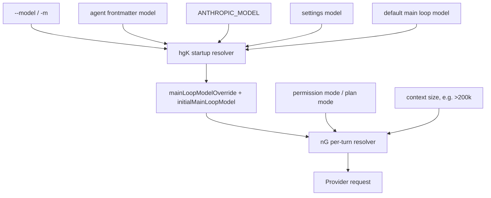
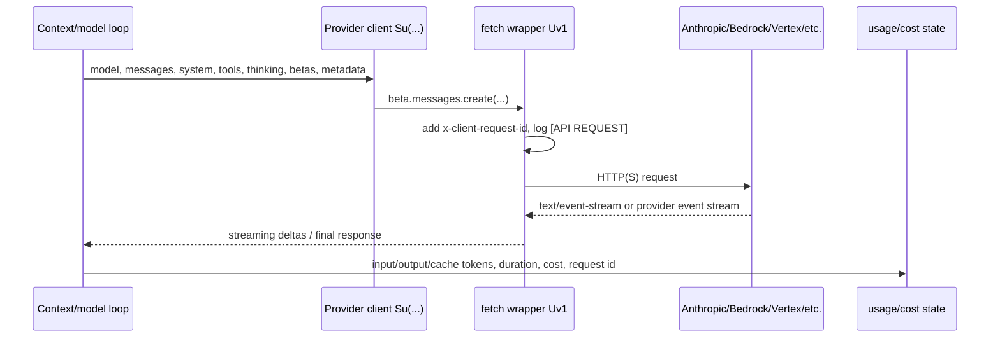

# Model selection, calls, usage, quota, and billing

This page reverse-engineers how `cli.renamed.js` selects models dynamically, how many logical model roles are visible, how provider calls are made, and how rate limits, errors, usage, quota, and billing are surfaced.

Scope: model aliases and precedence, main/helper/subagent/advisor/fallback model roles, Messages API request construction, streaming and retry behavior, rate-limit headers/events, token/cost accounting, headless budget guards, quota checks, and billing/extra-usage UI surfaces.

## Source anchors

| Semantic alias | String or symbol | Meaning |
| --- | --- | --- |
| DefaultModelResolvers | `getDefaultSonnetModel`, `getDefaultOpusModel`, `getDefaultHaikuModel`, `getDefaultMainLoopModel` | Resolver exports for the model family defaults. |
| SmallFastModelOverride | `ANTHROPIC_SMALL_FAST_MODEL` | Small/fast helper model override. |
| MainModelEnvOverride | `ANTHROPIC_MODEL` | Environment-level main model override. |
| PerTurnModelResolver | `nG({permissionMode,mainLoopModel,exceeds200kTokens})` | Per-turn model resolver; plan mode can alter the selected model. |
| ModelAliasResolver | `case "opusplan"`, `case "sonnet"`, `case "haiku"`, `case "opus"`, `case "best"` | Alias-to-concrete-model mapping. |
| StartupModelPrecedence | `hgK({cli,env,settings,agentFrontmatter})` | Startup model precedence across CLI, env, settings, and agent frontmatter. |
| FallbackModelResolver | `ygK({cli:{fallbackModel}})` | Fallback-model resolver. |
| StartupModelState | `startup_resolve_model` | Root startup path stores effective and initial model state. |
| ModelSelectionFlag | `--model <model>` | Root model-selection flag. |
| FallbackModelFlag | `--fallback-model <model>` | Print-mode overload fallback flag. |
| AdvisorModelSetting | `advisorModel` | Settings surface for the server-side advisor tool model. |
| SubagentModelOverride | `CLAUDE_CODE_SUBAGENT_MODEL` | Subagent model override. |
| AutoModeClassifierConfig | `tengu_auto_mode_config`, `twoStageClassifier` | Auto-mode classifier model/config selection. |
| AutoModeRequestSource | `querySource:"auto_mode"` | Auto-mode classifier provider request source. |
| MemoryHelperModel | `Select memories relevant to:`, `model:iv()` | Memory relevance helper uses the Sonnet resolver. |
| QuotaProbeRequest | `source:"quota_check"`, `max_tokens:1`, `messages:[{..."quota"}]` | Quota probe sends a tiny helper request. |
| ProviderRequestWrapper | `[API REQUEST]`, `x-client-request-id` | Fetch wrapper logs requests and injects a client request ID. |
| SseStreamDetector | `text/event-stream` | Streaming response detection. |
| BedrockStreamDetector | `vnd.amazon.eventstream` | Bedrock event-stream detection. |
| TokenCountHelper | `source:"count_tokens"`, `beta.messages.create` | Token-count helper request. |
| ApiUsageTelemetry | `api_request`, `input_tokens`, `output_tokens`, `cache_read_tokens`, `cost_usd` | API request telemetry/accounting. |
| SessionUsageAccumulator | `totalCostUSD`, `modelUsage`, `addToTotalCostState` | Session-level cost and per-model usage accumulator. |
| HeadlessUsageResult | `total_cost_usd`, `usage`, `modelUsage` | Headless result schema includes usage and cost. |
| SdkRetryDelayParser | `retry-after-ms`, `retry-after`, status `429`, status `>=500` | SDK retry behavior and retry-delay parsing. |
| RuntimeRateLimitClassifier | status `429`, status `529`, `overloaded_error` | Runtime error classification for rate limit and overload. |
| OverloadFallbackTelemetry | `tengu_api_opus_fallback_triggered`, `api_request_retry_exhausted` | Retry loop and overload fallback behavior. |
| UnifiedRateLimitHeaders | `anthropic-ratelimit-unified-*` headers | Unified rate-limit/quota header parsing. |
| RateLimitEventFrame | `rate_limit_event` | Rate-limit state changes are emitted to headless/SDK streams. |
| MaxBudgetFlag | `--max-budget-usd <amount>` | Headless API-spend budget flag. |
| MaxBudgetErrorResult | `error_max_budget_usd` | Headless result when the dollar budget is exceeded. |
| UsageLimitMessage | `usage limit`, `extra usage spending limit` | User-visible limit/overage messages. |
| BillingUpgradeGuidance | `hasBillingAccess`, `/extra-usage`, `/upgrade` | Billing/overage guidance in rate-limit UI. |
| ApiUsageBillingStatus | `API Usage Billing` | Status-line billing type for API-key/console-style usage. |

## Bundle module in `cli.renamed.js`

| Semantic alias | Loader line | Representative renamed exports | Atlas entry |
|---|---:|---|---|
| `ModelSelectionConfig` | 118207 | `resolveSkillModelOverride`, `renderModelSetting`, `renderModelName`, `renderDefaultModelSetting`, `parseUserSpecifiedModel`, `normalizeModelStringForAPI`, `modelDisplayString`, `isOpus1mMergeEnabled`, `isNonCustomOpusModel`, `isLegacyOpusFirstParty`, `isLegacyModelRemapEnabled`, `getUserSpecifiedModelSetting` | [Bundle module map — models, prompts, and memory](../99-research-atlas/module-map-from-renamed-cli.md#models-prompts-and-memory) |

## Model selection precedence

Model selection is a layered resolver, not one static constant.

The root startup path calls `hgK(...)`, then stores two pieces of state:

| State | Meaning |
|---|---|
| `effectiveModel` / `mainLoopModelOverride` | The override currently applied to the loop. |
| `initialMainLoopModel` | The model originally selected by startup/env/settings. |

The visible precedence is:

1. CLI `--model`, including `default` as a special alias for the default concrete model.
2. Agent frontmatter model when present and not `inherit`.
3. `ANTHROPIC_MODEL`.
4. Settings model.
5. Default main-loop model resolver.

Resume can also restore the model: `Sa5(...)` scans prior assistant messages and `IG(...)` reapplies a compatible restored model if no stronger override is active.

## Logical model roles

There is no fixed “number of concrete models” baked into the CLI. Concrete IDs depend on provider, feature flags, aliases, environment variables, settings, and account capabilities. The source does show a fixed set of **logical model roles**:

| Role | Resolver / setting | Purpose |
|---|---|---|
| Main loop model | `R7()`, `lJ()`, `--model`, `ANTHROPIC_MODEL`, settings | Normal assistant turns. Defaults to the default main-loop model, commonly Sonnet unless account/provider logic chooses otherwise. |
| Default Sonnet | `iv()`, `ANTHROPIC_DEFAULT_SONNET_MODEL` | Everyday/default work; also used by memory relevance/fact extraction helpers. |
| Default Opus / best | `nv()`, alias `opus`, alias `best`, `opusplan` in plan mode | More capable/plan-mode work and “best” alias. |
| Default Haiku / small-fast | `SxH()`, `LL()`, `ANTHROPIC_SMALL_FAST_MODEL`, `ANTHROPIC_DEFAULT_HAIKU_MODEL` | Lightweight helper requests such as quota probing, some web/search/count/token/helper paths, and small-fast mode when available. |
| Auto-mode classifier | `tengu_auto_mode_config.model` else `R7()`, `twoStageClassifier` | Classifies tool/action safety for auto mode with `querySource:"auto_mode"`. |
| Memory helper | `iv()` | Selects relevant memories and extracts facts using JSON-schema outputs. |
| Advisor tool model | `advisorModel` | Server-side advisor tool model override. |
| Subagent model | `CLAUDE_CODE_SUBAGENT_MODEL`, agent model/frontmatter, or inherit | Lets subagents use an explicit model or inherit from the main loop. |
| Fallback model | `--fallback-model` / `ygK` | Print/headless overload fallback when the primary model repeatedly returns overload. |

The important answer to “how many models” is therefore: **the CLI uses multiple logical model roles; it does not hard-code one universal count of concrete models.** In a normal local session, the main loop may use one model, while helper calls can use Sonnet or small-fast/Haiku, auto-mode can make classifier calls, and subagents/advisor/fallback can introduce additional models.

## Alias and dynamic mapping

The alias resolver maps user-facing names to current concrete IDs:

| Alias | Source-confirmed behavior |
|---|---|
| `sonnet` | Resolves through `iv()`. |
| `haiku` | Resolves through `SxH()`. |
| `opus` | Resolves through `nv()`. |
| `best` | Resolves through `Itq()`, which currently points at the Opus resolver. |
| `opusplan` | Resolves to Sonnet normally but can switch to Opus in plan mode through `nG(...)`. |
| `default` | Treated as the current default concrete model in CLI/fallback handling. |

Because aliases are resolved at runtime, docs should prefer “Sonnet/Opus/Haiku resolver” unless a concrete build-specific model ID is the point of the discussion.

## Provider call path

Provider calls share a common shape even when the backend differs.

Confirmed request ingredients include:

| Request ingredient | Source evidence |
|---|---|
| Model | `model:<resolver result>` in main/helper requests. |
| Messages/system | Main loop and helper calls pass `messages`, `system`, and sometimes `skipSystemPromptPrefix`. |
| Tools/tool choice | Count-token/helper and web-search paths can include tool schemas or tool choice. |
| Thinking/effort | `--thinking`, `--thinking-display`, `--max-thinking-tokens`, effort settings. |
| Betas | `Ru(model)` and `TP(...)` add model/provider beta headers. |
| Metadata | `metadata:C3H()` appears in helper/provider calls. |
| Extra body params | `$9H()` contributes additional API body settings. |

The fetch wrapper logs `[API REQUEST] <path> x-client-request-id=<id> source=<source>` and detects streaming content types. For first-party/AWS-like first-party paths it injects `x-client-request-id`; for Bedrock it also recognizes `vnd.amazon.eventstream`.

## Streaming, retries, and errors

### Streaming

The runtime uses provider streaming, with source-confirmed surfaces for:

- `text/event-stream` for ordinary streaming responses;
- `vnd.amazon.eventstream` for Bedrock event streams;
- stream deltas that carry `input_tokens`, `output_tokens`, `cache_creation_input_tokens`, `cache_read_input_tokens`, and `context_management`.

### Retry behavior

There are two visible retry layers:

| Layer | Behavior |
|---|---|
| SDK/client retry | Parses `retry-after-ms` and `retry-after`; retries status `408`, `409`, `429`, and `>=500` according to max-retry policy. |
| Claude Code loop retry | Classifies provider/API errors, retries selected retryable failures, handles auth refresh paths, and can switch to fallback model on repeated overload. |

The runtime classifies:

| Condition | Classification / behavior |
|---|---|
| HTTP `429` | Rate limit. |
| HTTP `529` or `"type":"overloaded_error"` | Server overload; can trigger fallback logic. |
| HTTP `413` with context-window wording | Prompt/context too long; UI directs the user toward `/compact` or reducing context. |
| Repeated overload with `--fallback-model` | Emits `tengu_api_opus_fallback_triggered` and raises a fallback-model transition. |
| Retry exhaustion | Emits `api_request_retry_exhausted`/throws a wrapped execution error. |

## Usage and cost accounting

`cli.renamed.js` maintains session-level usage state in the global runtime envelope:

| State | Meaning |
|---|---|
| `totalCostUSD` | Accumulated API cost estimate for the current run/session envelope. |
| `modelUsage` | Per-model token/cost usage map. |
| `totalAPIDuration` / `totalAPIDurationWithoutRetries` | Total provider time with and without retry time. |
| `hasUnknownModelCost` | Set when the runtime cannot price a model. |

After a successful API call, telemetry includes:

- `input_tokens`
- `output_tokens`
- `cache_read_tokens`
- `cache_creation_tokens`
- `cost_usd`
- `cost_usd_micros`
- `duration_ms`
- `request_id`
- model speed (`fast` / `normal`)
- query source
- effort level when present

Headless `result` frames include `total_cost_usd`, `usage`, and `modelUsage`, so SDK/print-mode consumers can account for the entire run rather than only the final message.

## Budget guards

The root flag `--max-budget-usd <amount>` is a print/headless budget guard. The headless loop checks `vW()>=maxBudgetUsd` after events and emits a final result with subtype `error_max_budget_usd` when exceeded.

The emitted result contains:

- elapsed duration;
- API duration;
- turn count;
- `total_cost_usd`;
- `usage`;
- `modelUsage`;
- permission denials;
- a user-readable error such as `Reached maximum budget ($<amount>)`.

This is local run-budget enforcement. It is separate from server-side account quota/rate limits.

## Quota, rate limit, and billing surfaces

### Quota probing

The function anchored by `source:"quota_check"` creates a client with `maxRetries:0`, selects `LL()` as the helper model, and sends a one-token `messages.create` request with the user content `quota`. This is a low-cost probe designed to surface quota/rate-limit headers rather than to generate meaningful text.

### Unified rate-limit headers

The runtime parses Anthropic unified rate-limit headers such as:

| Header family | Meaning |
|---|---|
| `anthropic-ratelimit-unified-representative-claim` | Which limit bucket is currently representative. |
| `anthropic-ratelimit-unified-reset` | Reset timestamp for the active limit. |
| `anthropic-ratelimit-unified-overage-status` | Whether extra usage/overage is allowed, warning, or rejected. |
| `anthropic-ratelimit-unified-overage-reset` | Reset timestamp for overage status. |
| `anthropic-ratelimit-unified-overage-disabled-reason` | Admin/seat/group reason why extra usage is unavailable. |
| `anthropic-ratelimit-unified-5h-utilization` / `...-5h-reset` | Five-hour/session window utilization and reset. |
| `anthropic-ratelimit-unified-7d-utilization` / `...-7d-reset` | Seven-day/weekly window utilization and reset. |
| `anthropic-ratelimit-unified-overage-utilization` / `...-overage-reset` | Extra-usage utilization and reset. |

Parsed state is stored as the current rate-limit state and projected into headless streams as `rate_limit_event` frames.

### User-visible limit and billing messages

The UI distinguishes several user-facing cases:

| Surface | Meaning |
|---|---|
| `five_hour` | “session limit” / five-hour style limit. |
| `seven_day` | weekly limit. |
| `seven_day_opus` | Opus-specific limit. |
| `seven_day_sonnet` | Sonnet-specific limit. |
| `overage` | usage or extra-usage spending limit. |
| `/extra-usage` | Suggested when extra usage can be requested/enabled. |
| `/upgrade` | Suggested for Pro/Max-style upgrade paths when applicable. |
| `hasBillingAccess` | Gates whether the user can manage billing/extra usage. |
| `API Usage Billing` | Status-line billing type for API/console billing mode. |

This confirms that billing/quota handling is not just a raw API error. The CLI parses quota headers, maintains local limit state, emits SDK/headless events, and renders plan/billing-specific guidance.

## Relationship between usage, quota, and billing

| Concern | Owner | Source-confirmed mechanism |
|---|---|---|
| Per-request usage | Provider response + runtime accounting | Token/cache/cost fields collected after API calls. |
| Per-run budget | Local headless loop | `--max-budget-usd` and `error_max_budget_usd`. |
| Account quota/rate limits | Provider/server headers | `anthropic-ratelimit-unified-*` parsing and `rate_limit_event`. |
| Billing/overage UI | Account state + server headers + OAuth account role | `/extra-usage`, `/upgrade`, billing-access checks, `API Usage Billing`. |

## Caveats

- Concrete model names and aliases are build/account/provider dependent. The logical roles above are safer anchors than one hard-coded model count.
- Some `rate_limit_error` and SDK examples in the bundle are embedded documentation strings. This page treats them as evidence only when connected to runtime classification, request wrapping, header parsing, or result schemas.
- Cost is an estimate derived from known model pricing tables and response usage. `hasUnknownModelCost` exists because not every model can be priced by the local table.
- `--fallback-model` is documented by the CLI as print-mode-only. Interactive model changes use `/model`, Remote Control `set_model`, or session state transitions rather than the fallback flag.

## Provider upgrade probe (Bedrock and Vertex)

The `ProviderUpgradeProbe` module (`cli.renamed.js:705680`-`706250`) is the runtime that decides whether a user's currently configured Bedrock/Vertex model has a newer variant available, by probing the provider for the candidate model id before suggesting an upgrade.

### Bedrock upgrade flow

| Function | Behavior |
|---|---|
| `findBedrockUpgradeCandidates()` | Returns the list of `{from: <currentModelId>, to: <upgradeModelId>}` pairs based on the bundle's hard-coded `upgradeKey` map. Returns an empty list when the user is not on Bedrock. |
| `checkBedrockDefaultAvailability()` | Calls Bedrock's `ListFoundationModels` (or equivalent) to confirm the operator's default Bedrock model id is reachable from the configured AWS credentials / region. Used at startup so an unreachable default surfaces immediately. |
| `probeBedrockModel(modelId, options)` | Issues a single-token `InvokeModel` request against `modelId`. Returns `{available: true}` on 200, `{available: false, reason}` on access denied / not found / region mismatch. The probe is the source of truth for "can this account use this model?" — the rest of the runtime does not assume entitlement from the upgrade map alone. |

The `upgradeKey` constant is a per-provider map from current model id to recommended upgrade. It encodes upgrades like Claude 4.5 → Claude 4.6 → Claude 4.7 so the runtime can surface "your model has a newer version" prompts without making the upgrade decision unilaterally.

### Vertex upgrade flow

The Vertex side mirrors Bedrock with provider-specific calls:

| Function | Behavior |
|---|---|
| `findVertexUpgradeCandidates()` | Same shape as Bedrock; reads the Vertex-specific `vertexUpgradeKey` map and returns candidate pairs. |
| `checkVertexDefaultAvailability()` | Probes the configured Vertex project/region for the default model id. |
| `probeVertexModel(modelId)` | Issues a single-token Vertex prediction request to confirm the upgrade target is accessible to the project/region. |

### How the runtime uses the probe

The upgrade probe is offered as guidance, not as an automatic switch:

1. At session start, `checkBedrockDefaultAvailability()` / `checkVertexDefaultAvailability()` confirms the configured default model is reachable. Failure surfaces a clear error before the first model call.
2. When the user opens `/model` or the UI inspects available upgrades, the runtime calls `findBedrockUpgradeCandidates()` / `findVertexUpgradeCandidates()` for the active provider.
3. For each candidate, `probeBedrockModel(...)` / `probeVertexModel(...)` confirms the upgrade target is actually accessible from the account/project.
4. The UI surfaces only confirmed upgrades — pairs whose target is reachable.

This split is important: a hard-coded upgrade map can stay accurate across builds, but a real "is this model usable for me right now?" answer must come from the provider. The probe is the only function that contacts the provider; everything else operates on the in-memory upgrade map.

## Related docs

- [Models, providers, and auth](models-providers-auth.md)
- [Context, memory, compaction, checkpoints, and rewind](context-memory-compaction-checkpoints.md)
- [Prompt, context, and memory](prompt-context-memory.md)
- [Headless streaming and resilience](headless-streaming-and-resilience.md)
- [Context and model loop architecture](architecture.md)
- [Session resume and transcripts](../04-sessions-persistence-remote/session-resume-and-transcripts.md)