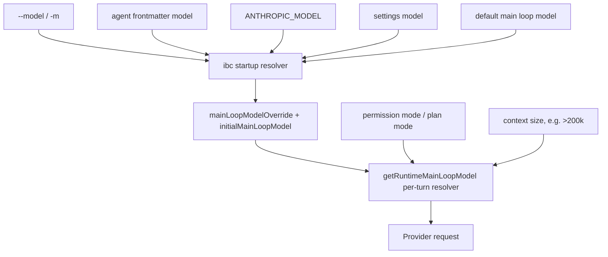
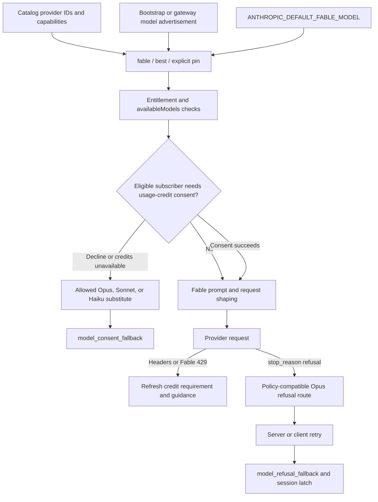
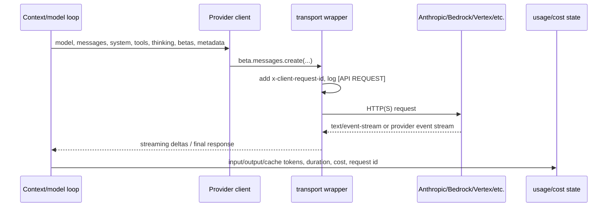

# Model selection, calls, usage, quota, and billing

This page reverse-engineers how `cli.renamed.js` selects models dynamically, how many logical model roles are visible, how provider calls are made, and how rate limits, errors, usage, quota, and billing are surfaced.

Scope: model aliases and precedence, main/helper/subagent/advisor/fallback model roles, the Fable 5 availability/consent/request/refusal lifecycle, Messages API request construction, streaming and retry behavior, rate-limit headers/events, token/cost accounting, headless budget guards, quota checks, and billing/usage-credit UI surfaces.

## Source anchors

| Semantic alias | String or symbol | Meaning |
| --- | --- | --- |
| DefaultModelResolvers | `getDefaultSonnetModel`, `getDefaultOpusModel`, `getDefaultHaikuModel`, `getDefaultMainLoopModel` | Resolver exports for the model family defaults. |
| SmallFastModelOverride | `ANTHROPIC_SMALL_FAST_MODEL` | Small/fast helper model override. |
| MainModelEnvOverride | `ANTHROPIC_MODEL` | Environment-level main model override. |
| PerTurnModelResolver | `getRuntimeMainLoopModel({permissionMode,mainLoopModel,exceeds200kTokens})` | Per-turn model resolver; plan mode can alter the selected model. |
| SubagentModelResolver | `oue()`, `pRu()`, `CLAUDE_CODE_SUBAGENT_MODEL` | Resolves environment, one-call tool, agent-frontmatter, and inherited model choices [~333,311–333,390](../../claude-code-pkg/src/entrypoints/cli.renamed.js#L333311). |
| WorkflowAgentModelResolver | `a4u()`, `oue()`, `agent(..., {model, effort})` | Workflow agents use the same subagent resolver and a separate effort override [~386,671–388,150](../../claude-code-pkg/src/entrypoints/cli.renamed.js#L386671). |
| ResumeModelResolver | `Q4t()`, `JAf()`, `Z4t()` | Scans the newest eligible assistant model, validates it, and restores or declines it under stronger-override and refusal-fallback rules [~860,250–860,430](../../claude-code-pkg/src/entrypoints/cli.renamed.js#L860250). |
| ModelAliasResolver | `case "opusplan"`, `case "sonnet"`, `case "haiku"`, `case "opus"`, `case "best"` | Alias-to-concrete-model mapping. |
| StartupModelPrecedence | `ibc({cli,env,settings,agentFrontmatter})` | Startup model precedence across CLI, env, settings, and agent frontmatter. |
| FallbackModelResolver | `obc({cli,settings})` | CLI/settings fallback-chain resolver; normalizes, filters, deduplicates, and caps the chain at three candidates. |
| StartupModelState | `startup_resolve_model` | Root startup path stores effective and initial model state. |
| ModelSelectionFlag | `--model <model>` | Root model-selection flag. |
| FallbackModelFlag | `--fallback-model <model>` | Print-mode overload fallback flag. |
| EmbeddedModelCatalog | `claude-sonnet-5`, `claude-opus-4-8`, `claude-fable-5` | Build-local catalog containing provider IDs, aliases, limits, capabilities, and pricing tiers. |
| FableAvailability | `isFableAvailable()`, `isPinnedFableModel()`, `getAdditionalModelOptionsCache()` | Separates dynamically advertised Fable availability from an explicit custom Fable pin [~130,952–131,116](../../claude-code-pkg/src/entrypoints/cli.renamed.js#L130952). |
| FableConsentState | `Q9t()`, `ltt()`, `fableOverageConsentV2`, `fableConsentSessionFallback` | Reads and records Fable usage-credit consent by organization/account, with a process-only fallback when identity is unavailable [~142,183–142,207](../../claude-code-pkg/src/entrypoints/cli.renamed.js#L142183). |
| FableConsentGate | `jrr()`, `IMu()`, `getFableDeclineFallbackModel()` | Determines whether a Fable attempt needs an interactive usage-credit decision and resolves an allowed non-Fable substitute [~345,607–345,654](../../claude-code-pkg/src/entrypoints/cli.renamed.js#L345607). |
| FablePromptAdaptation | `S3e()`, `PS()`, `M2()`, `T6y`, `w6y` | Selects the lean prompt and Fable-specific identity, autonomy/communication, and optional tool-JSON guidance [~568,052–568,369](../../claude-code-pkg/src/entrypoints/cli.renamed.js#L568052). |
| FableRequestShaping | `J9t()`, `QTt()`, `$te()`, `output_config`, `thinking` | Applies adaptive thinking, disabled-thinking omission, effort, temperature, and tool-choice rules [~487,900–488,100](../../claude-code-pkg/src/entrypoints/cli.renamed.js#L487900). |
| PerTurnEffortHistory | `Ysd()`, `pinPerTurnEffort()`, `api_system.outputConfig` | Inserts effort transitions at historical user-turn boundaries when the per-turn-control beta is active [~486,700–486,760](../../claude-code-pkg/src/entrypoints/cli.renamed.js#L486700). |
| ThinkingTypeCompatibility | `getThinkingTypeOverride()`, `setThinkingTypeOverride()`, `retry:thinking-type` | Latches a per-model adaptive/enabled compatibility substitute after provider rejection [~487,980, ~488,850](../../claude-code-pkg/src/entrypoints/cli.renamed.js#L487980). |
| FableCreditFeedback | `bto()`, `NIg()`, `FIg()`, `fableCreditsRequired` | Feeds successful response headers and Fable-specific `429` details back into consent state and user guidance [~285,109–286,500](../../claude-code-pkg/src/entrypoints/cli.renamed.js#L285109). |
| RefusalFallbackRouter | `lSc()`, `iZu()`, `QQu()`, `fallback_request` | Resolves a policy-compatible Opus route and chooses server-side or client-visible refusal retry [~143,331–143,620](../../claude-code-pkg/src/entrypoints/cli.renamed.js#L143331). |
| RefusalFallbackPersistence | `model_refusal_fallback`, `latchRefusalFallbackModel()`, `Z4t()` | Tombstones refused output, records the substitution, latches the session model, and reconstructs the latch on resume [~460,600–461,500](../../claude-code-pkg/src/entrypoints/cli.renamed.js#L460600), [~860,250–860,435](../../claude-code-pkg/src/entrypoints/cli.renamed.js#L860250). |
| ManagedModelAllowlist | `availableModels`, `enforceAvailableModels` | Constrains main, agent, subagent, advisor, and Default model selection. |
| AdvisorModelSetting | `advisorModel` | Settings surface for the server-side advisor tool model. |
| SubagentModelOverride | `CLAUDE_CODE_SUBAGENT_MODEL` | Subagent model override. |
| AutoModeClassifierConfig | `tengu_auto_mode_config`, `twoStageClassifier` | Auto-mode classifier model/config selection. |
| AutoModeRequestSource | `querySource:"auto_mode"` | Auto-mode classifier provider request source. |
| MemoryHelperModel | `Izy()`, `Select memories relevant to:`, `getDefaultSonnetModel()` | Memory-file relevance helper uses the default Sonnet resolver. |
| QuotaProbeRequest | `source:"quota_check"`, `max_tokens:1`, `messages:[{..."quota"}]` | Quota probe sends a tiny helper request. |
| ProviderRequestWrapper | `[API REQUEST]`, `x-client-request-id` | Fetch wrapper logs requests and injects a client request ID. |
| SseStreamDetector | `text/event-stream` | Streaming response detection. |
| BedrockStreamDetector | `vnd.amazon.eventstream` | Bedrock event-stream detection. |
| TokenCountHelper | `source:"count_tokens"`, `beta.messages.create` | Token-count helper request. |
| ApiUsageTelemetry | `api_request`, `input_tokens`, `output_tokens`, `cache_read_tokens`, `cost_usd` | API request telemetry/accounting. |
| SessionUsageAccumulator | `totalCostUSD`, `modelUsage`, `addToTotalCostState` | Session-level cost and per-model usage accumulator. |
| HeadlessUsageResult | `total_cost_usd`, `usage`, `modelUsage` | Headless result schema includes usage and cost. |
| SdkRetryDelayParser | `retry-after-ms`, `retry-after`, status `429`, status `>=500` | SDK retry behavior and retry-delay parsing. |
| RuntimeRateLimitClassifier | status `429`, status `529`, `overloaded_error` | Runtime error classification for rate limit and overload. |
| OverloadFallbackTelemetry | `tengu_api_opus_fallback_triggered`, `api_request_retry_exhausted` | Retry loop and overload fallback behavior. |
| UnifiedRateLimitHeaders | `anthropic-ratelimit-unified-*` headers | Unified rate-limit/quota header parsing. |
| RateLimitEventFrame | `rate_limit_event` | Rate-limit state changes are emitted to headless/SDK streams. |
| MaxBudgetFlag | `--max-budget-usd <amount>` | Headless API-spend budget flag. |
| MaxBudgetErrorResult | `error_max_budget_usd` | Headless result when the dollar budget is exceeded. |
| UsageLimitMessage | `usage limit`, `extra usage spending limit` | User-visible limit/overage messages. |
| BillingUpgradeGuidance | `hasBillingAccess`, `/usage-credits`, `/upgrade` | Billing/overage guidance in rate-limit UI; hidden `/extra-usage` is a rename shim. |
| ApiUsageBillingStatus | `API Usage Billing` | Status-line billing type for API-key/console-style usage. |
| InteractiveModelCommand | `name: "model"`, `uPt()`, `PQr()` | Validates entitlement/availability and applies a session/default model [~561,121–561,210](../../claude-code-pkg/src/entrypoints/cli.renamed.js#L561121). |
| InteractiveEffortCommand | `name: "effort"`, `W0o()`, `NWy()` | Resolves supported effort, pins, env precedence, remote synchronization, and `ultracode` [~561,778–562,100](../../claude-code-pkg/src/entrypoints/cli.renamed.js#L561778). |
| FastModeCommand | `name: "fast"`, `A0o()`, `nur()` | Toggles fast mode and its required model with local/remote state propagation [~558,337–558,540](../../claude-code-pkg/src/entrypoints/cli.renamed.js#L558337). |
| UsageCommand | `name: "usage"`, `collectUsageData()`, `formatBehaviors()` | Combines current-session totals, plan utilization, and bounded local behavior estimates [~557,700–558,300](../../claude-code-pkg/src/entrypoints/cli.renamed.js#L557700). |
| UsageCreditsCommand | `usage-credits`, `fur()`, `HIs()` | Opens billing management or prepares/deduplicates an organization admin request [~561,500–561,750](../../claude-code-pkg/src/entrypoints/cli.renamed.js#L561500). |
| ThirdPartyAvailabilityFallback | `checkBedrockDefaultAvailability()`, `checkVertexDefaultAvailability()`, `apply3PDefaultFallbacks()` | Startup probes provider-usable defaults and applies session defaults when current family heads are unavailable. |
| ThirdPartyUpgradeCandidates | `findBedrockUpgradeCandidates()`, `findVertexUpgradeCandidates()` | Detects recognized stale same-tier environment pins and probes newer provider IDs. |
| ThirdPartyUpgradeDialog | `ThirdPartyModelUpgradeDialog`, `bedrockDeclinedUpgrades`, `vertexDeclinedUpgrades` | Presents upgrades, persists accepted IDs, and suppresses previously declined from/to pairs. |

## Bundle module in `cli.renamed.js`

| Semantic alias | Loader line | Representative renamed exports | Atlas entry |
|---|---:|---|---|
| `ModelSelectionConfig` | 118207 | `resolveSkillModelOverride`, `renderModelSetting`, `renderModelName`, `renderDefaultModelSetting`, `parseUserSpecifiedModel`, `normalizeModelStringForAPI`, `modelDisplayString`, `isOpus1mMergeEnabled`, `isNonCustomOpusModel`, `isLegacyOpusFirstParty`, `isLegacyModelRemapEnabled`, `getUserSpecifiedModelSetting` | [Bundle module map — models, prompts, and memory](../99-research-atlas/module-map-from-renamed-cli.md#models-prompts-and-memory) |

## Model selection precedence

Model selection is a layered resolver, not one static constant.

```mermaid
flowchart TD
    CLI[--model / -m] --> Startup[ibc startup resolver]
    AgentFrontmatter[agent frontmatter model] --> Startup
    Env[ANTHROPIC_MODEL] --> Startup
    Settings[settings model] --> Startup
    Default[default main loop model] --> Startup
    Startup --> State[mainLoopModelOverride + initialMainLoopModel]
    State --> Turn[getRuntimeMainLoopModel per-turn resolver]
    Permission[permission mode / plan mode] --> Turn
    Context[context size, e.g. >200k] --> Turn
    Turn --> Request[Provider request]
```

The root startup path calls `ibc(...)`, then stores two pieces of state:

| State | Meaning |
|---|---|
| `effectiveModel` / `mainLoopModelOverride` | The override currently applied to the loop. |
| `initialMainLoopModel` | The model originally selected by startup/env/settings. |

The visible precedence is:

1. CLI `--model`, including `default` as a special alias for the default concrete model.
2. Agent frontmatter model when present and not `inherit`.
3. `ANTHROPIC_MODEL`.
4. Settings model.
5. Default main-loop model resolver.

Resume can also restore the model. `Q4t()` first refuses restoration when a current model override, `ANTHROPIC_MODEL`, provider-family environment pin, or non-first-party model namespace already owns the choice. `JAf()` then scans backward to the newest non-meta assistant message with a model, rejects unknown-family, disallowed, or retired models, and avoids mistaking a temporary `opusplan`/`haiku` plan-mode upgrade for a new persistent selection. `Z4t()` applies an accepted model and preserves the separate refusal-fallback latch when the prior session ended on that route.

## Does Claude Code choose a model from task complexity?

Not through one general “easy task → Haiku, hard task → Opus” classifier in the inspected client. The model that handles a task is primarily selected by **configuration and execution role**:

1. the session resolves a main model at startup;
2. a mode-dependent alias can resolve differently for an individual plan-mode turn;
3. an Agent/Workflow call can request a model, or its agent definition can declare one;
4. helper subsystems choose their own role-specific models; and
5. provider errors can move a turn through a configured fallback chain.

The main model may decide to delegate based on the task and choose an available agent type, but that is a model/tool decision. The runtime does not inspect arbitrary task prose and independently promote every difficult task to a stronger model.

### Resolution matrix by execution role

| Execution role | Resolution order | Runtime notes |
|---|---|---|
| Main session startup | CLI `--model` → main-agent frontmatter (unless `inherit`) → `ANTHROPIC_MODEL` → settings/org default → account/provider default | `ibc()` resolves aliases, applies `availableModels`/entitlement restrictions, and can step a restricted family down to an allowed member. |
| Main turn | `getRuntimeMainLoopModel({permissionMode, mainLoopModel, exceeds200kTokens})` | Usually retains the session model. In plan mode, `opusplan` can use Opus unless the context already exceeds 200K; a `haiku` session can use Sonnet. Both upgrades remain policy/entitlement constrained. |
| Resumed session | Strong current/env/provider choice, otherwise newest eligible historical assistant model | Unknown, retired, disallowed, and temporary mode-dependent models are not blindly restored. |
| Ordinary Agent call | `CLAUDE_CODE_SUBAGENT_MODEL` (unless `inherit`) → `Agent({model})` → agent-definition/frontmatter model → inherited parent runtime model | A disallowed override is dropped and the parent runtime model is inherited. Same-family aliases can preserve the parent's concrete pin. |
| Fork Agent | Parent model | The `model` input is intentionally ignored: a fork inherits the parent's context and model. |
| Workflow `agent()` | Same `oue()` order: subagent env → `agent({model})` → selected agent definition → parent | `agent({effort})` is resolved separately and attached to the workflow agent definition; it does not choose another model by itself. |
| Skill/command override | Skill model through `resolveSkillModelOverride()`, otherwise session model | A model outside `availableModels` is rejected and the session model is kept; eligible 1M context suffix behavior is preserved. |
| Helper call | Helper-specific resolver | Memory relevance uses default Sonnet; quota probing uses the small/fast resolver; compaction, advisor, auto-mode, title/summary, and other helpers each own their explicit resolver/fallback rather than inheriting one universal helper model. |

For Agent definitions, `model: inherit` means “resolve the parent's model for the current permission mode,” not “copy the raw startup string forever.” Consequently, entering plan mode can affect an inherited subagent through the same runtime resolver. A one-call `Agent({model})` override outranks frontmatter but not `CLAUDE_CODE_SUBAGENT_MODEL`.

## Logical model roles

There is no fixed “number of concrete models” baked into the CLI. Concrete IDs depend on provider, feature flags, aliases, environment variables, settings, and account capabilities. The source does show a fixed set of **logical model roles**:

| Role | Resolver / setting | Purpose |
|---|---|---|
| Main loop model | `getMainLoopModel()`, `getDefaultMainLoopModel()`, `--model`, `ANTHROPIC_MODEL`, settings | Normal assistant turns. The concrete default is account/provider/policy aware; do not assume one universal Sonnet ID. |
| Default Sonnet | `getDefaultSonnetModel()`, `ANTHROPIC_DEFAULT_SONNET_MODEL` | Everyday/default work; also used by the structured memory-file selector. |
| Default Opus / best | `getDefaultOpusModel()`, `getBestModel()`, alias `opus`, alias `best`, `opusplan` in plan mode | More capable/plan-mode work and the catalog-driven “best” alias. |
| Default Haiku / small-fast | `getDefaultHaikuModel()`, `getSmallFastModel()`, `ANTHROPIC_SMALL_FAST_MODEL`, `ANTHROPIC_DEFAULT_HAIKU_MODEL` | Lightweight helper requests such as quota probing and small-fast mode when available. Other helper paths choose their model independently. |
| Auto-mode classifier | `tengu_auto_mode_config.model`, `twoStageClassifier` | Classifies tool/action safety for auto mode with `querySource:"auto_mode"`; its effective fallback is runtime/configuration dependent. |
| Memory helper | `Izy()`, `getDefaultSonnetModel()` | Selects up to five relevant memory files using a `selected_memories` JSON result. No separate fact-extraction model call was confirmed in this build. |
| Advisor tool model | `advisorModel` | Server-side advisor tool model override. |
| Subagent model | `CLAUDE_CODE_SUBAGENT_MODEL`, agent model/frontmatter, or inherit | Lets subagents use an explicit model or inherit from the main loop. |
| Fallback model | `--fallback-model` / `obc()` | Print/headless overload fallback when the primary model repeatedly returns overload. |

The important answer to “how many models” is therefore: **the CLI uses multiple logical model roles; it does not hard-code one universal count of concrete models.** In a normal local session, the main loop may use one model, while helper calls can use Sonnet or small-fast/Haiku, auto-mode can make classifier calls, and subagents/advisor/fallback can introduce additional models.

## Alias and dynamic mapping

The alias resolver maps user-facing names to current concrete IDs:

| Alias | Source-confirmed behavior |
|---|---|
| `sonnet` | Resolves through `getDefaultSonnetModel()`. |
| `haiku` | Resolves through `getDefaultHaikuModel()`. |
| `opus` | Resolves through `getDefaultOpusModel()`. |
| `fable` | Resolves to the current Fable family default. |
| `best` | The catalog names `fable` as best in `2.1.215`, but `getBestModel()` uses it only when Fable's availability predicate passes and policy allows the resolved model; otherwise it falls back to the Opus resolver. |
| `opusplan` | Resolves to Sonnet normally but can switch to Opus in plan mode through `getRuntimeMainLoopModel(...)`. |
| `default` | Treated as the current default concrete model in CLI/fallback handling. |

Because aliases are resolved at runtime, docs should prefer “Sonnet/Opus/Haiku resolver” unless a concrete build-specific model ID is the point of the discussion.

## Current family heads and capabilities

The `2.1.215` catalog is embedded at approximately lines ~15,726–16,029.

| Family head | Catalog ID | Context | Max output | Default effort | Notable capability flags |
|---|---|---:|---:|---|---|
| Sonnet 5 | `claude-sonnet-5` | 1M native | 128K upper | `high` | effort through `max`, adaptive thinking, mid-conversation system, context management |
| Opus 4.8 | `claude-opus-4-8` | 1M native | 128K upper | `high` | fast mode, lean prompt, adaptive thinking, mid-conversation system |
| Fable 5 | `claude-fable-5` | 1M native | 128K upper | `high` | effort through `max`, adaptive thinking, lean prompt, mid-conversation system, Fable mitigations; disabled-thinking rejection |
| Haiku 4.5 | `claude-haiku-4-5` | 200K | 64K upper | catalog/provider default | context management; 1M suffix support |

Catalog aliases are provider-specific. The default `sonnet → claude-sonnet-5` and `opus → claude-opus-4-8` mappings do not imply every Bedrock, Vertex, Foundry, Mantle, Anthropic AWS, or gateway deployment serves that exact ID. The resolver applies `per_provider` entries before request construction.

Organization policy is part of resolution, not a picker-only filter. `availableModels` applies to aliases, explicit IDs, subagents, teammates, advisor choices, and server-requested swaps. Managed `enforceAvailableModels` also constrains the Default row and refuses cascade-trust behavior if a policy source failed to load.

## How Fable 5 is supported end to end

Fable is not implemented as a display-name alias wrapped around an ordinary model call. In `2.1.215`, support crosses the embedded catalog, model discovery, organization policy, an account-specific usage-credit decision, prompt assembly, request-body shaping, rate-limit handling, and a separate refusal-fallback state machine.

```mermaid
flowchart TD
    Catalog[Catalog provider IDs and capabilities] --> Resolve[fable / best / explicit pin]
    Advertised[Bootstrap or gateway model advertisement] --> Resolve
    Pin[ANTHROPIC_DEFAULT_FABLE_MODEL] --> Resolve
    Resolve --> Policy[Entitlement and availableModels checks]
    Policy --> Consent{Eligible subscriber needs usage-credit consent?}
    Consent -->|No| Shape[Fable prompt and request shaping]
    Consent -->|Consent succeeds| Shape
    Consent -->|Decline or credits unavailable| CreditFallback[Allowed Opus, Sonnet, or Haiku substitute]
    CreditFallback --> ConsentFrame[model_consent_fallback]
    Shape --> Provider[Provider request]
    Provider -->|Headers or Fable 429| CreditState[Refresh credit requirement and guidance]
    Provider -->|stop_reason refusal| RefusalRoute[Policy-compatible Opus refusal route]
    RefusalRoute --> Retry[Server or client retry]
    Retry --> RefusalFrame[model_refusal_fallback and session latch]
```

### Catalog, alias, and availability layers

The catalog entry near [`cli.renamed.js:15940`](../../claude-code-pkg/src/entrypoints/cli.renamed.js#L15940) makes Fable a first-class family:

| Catalog surface | Fable 5 value | Runtime consequence |
|---|---|---|
| Family and aliases | family `fable`; alias `fable`; catalog `best: "fable"` | `parseUserSpecifiedModel("fable")` calls `getDefaultFableModel()`; `best` selects Fable only while its availability and allowlist checks pass. |
| Provider IDs | Explicit IDs for first party, Bedrock, Vertex, Foundry, Anthropic AWS/Google Cloud, Mantle, and gateway | `toProviderWireModelId()` can route the catalog model through the selected provider adapter. A non-null ID is routing support, not proof that a particular account, region, or deployment has access. |
| Limits | 1M native context; 64K default and 128K upper output | No separate first-party `[1m]` Fable variant is needed; request and compaction limits use catalog metadata. |
| Pricing | `$10` input / `$50` output per million tokens, plus cache/search rates from `tier_10_50` | Local API-key cost accounting can price known Fable usage. Subscriber usage-credit accounting remains server-driven. |
| Capabilities | effort, `max_effort`, `xhigh_effort`, adaptive thinking, disabled-thinking rejection, mid-conversation system, context management, lean prompt, Fable mitigations | Capability predicates alter prompt construction and request fields rather than merely decorating the picker. |
| Other metadata | default effort `high`, 2,000-pixel image limits, advisor rank `5`, eager input streaming on Bedrock/Vertex | Shared request, image, advisor, and provider paths can consume Fable metadata without a Fable-only client. |

`isFableAvailable()` is deliberately narrower than “does any adapter know a Fable ID?” [~130,958–130,989](../../claude-code-pkg/src/entrypoints/cli.renamed.js#L130958):

- On the normal first-party endpoint, bootstrap `additional_model_options` advertises Fable and can explicitly mark it disabled. Picker/absent handling and the `best` decision consume that cached state; an explicit `fable` selection can still enter `/model` validation.
- A gateway can advertise Fable through its model-list result.
- `ANTHROPIC_DEFAULT_FABLE_MODEL` supplies an explicit custom pin and normally satisfies availability independently of dynamic advertisement. An explicit disabled Fable row from the normal first-party bootstrap is checked first and remains authoritative.
- Bedrock, Vertex, Foundry, Mantle, and Claude Platform adapters can still expose or route their non-null catalog mapping even though, without a custom pin, the dynamic-advertisement predicate is false for those provider classes. Therefore, `isFableAvailable() === false` is not evidence that those adapters lack Fable support.
- On the first-party endpoint, an explicit Fable selection that is absent from cached advertisement receives the same one-token validation probe used by `/model`; a successful probe refreshes bootstrap data. Entitlement and `availableModels` checks still run before the choice is accepted [~500,356–500,600](../../claude-code-pkg/src/entrypoints/cli.renamed.js#L500356).

The provider IDs, custom-pin metadata, and the limited role of `fallback_3p` are detailed in [Models, providers, and auth](models-providers-auth.md#fable-provider-routing-and-custom-pins).

### Usage-credit consent is a pre-request gate

The Fable consent path applies only to a specific subscriber lane. `Mq()` exempts non-first-party providers, non-Claude.ai subscribers, Enterprise PAYG, and the zero/default rate-limit tier. Credits-only tiers are handled separately. For the remaining eligible accounts, `HPe()` and the process-level `fableCreditsRequired` bit indicate that Fable must draw from usage credits; `EFr()` then determines whether confirmed consent and usable overage state are missing [~142,119–142,239](../../claude-code-pkg/src/entrypoints/cli.renamed.js#L142119).

Consent and availability are independent: a model can be advertised and policy-allowed while still requiring a usage-credit decision.

| Stage | Source-confirmed behavior |
|---|---|
| Interactive `/model` | A consent-required Fable pick opens `fable_overage_consent_prompt`. The dialog checks current credit/overage state and can continue, re-enable/setup or purchase credits, open billing management, request an admin action, or keep/switch models [~806,000–806,240](../../claude-code-pkg/src/entrypoints/cli.renamed.js#L806000). |
| Durable decision | `ltt()` records `fableOverageConsentV2[organizationUuid]`; if no organization ID exists it uses `acct:<accountUuid>`. With neither identity, it uses only `fableConsentSessionFallback`, so the decision is process-scoped rather than durable. |
| Live verification | `IMu()` records the decision, refreshes extra-usage state when needed, and succeeds only if the resulting state permits Fable. Remembering consent is therefore not the same as guaranteeing that credits remain enabled or funded. |
| Turn preflight | Before provider dispatch, an eligible Fable main-thread attempt with a capable dialog host can run the same decision. An active Remote Control bridge can forward it; the bridge-specific wait is bounded to 60 seconds before the client falls back [~460,314–460,470](../../claude-code-pkg/src/entrypoints/cli.renamed.js#L460314). |
| Decline/failure | `getFableDeclineFallbackModel()` tries allowed non-Fable defaults in Opus → Sonnet → Haiku order. The loop changes the live model, reconciles fast mode, emits `query_model_change`, and records `model_consent_fallback`. |
| Optional default rewrite | A `switch_default` choice rewrites the saved user model only when no stronger runtime/env source owns the model and user settings currently contain the Fable selection. Otherwise the substitute is session-only. |
| No legal substitute | `CLAUDE_CODE_NO_MODEL_FALLBACK` or a policy that allows only Fable makes the turn fail instead of silently violating the no-fallback/policy boundary. |

The text/non-interactive `/model` implementation does not manufacture consent: when `coe()` says the pick needs it, the command directs the user to interactive `/model`. A Remote Control thin-client switch is also refused when the cloud session cannot host the dialog. SDK dialog hosts must declare the Fable dialog kind; a host without that capability does not receive the prompt.

When this gate is reached inside non-main-thread work, the runtime does not open a subagent-owned consent UI. It substitutes the allowed decline model for that attempt. The direct compaction helper similarly replaces a consent-gated primary Fable model before summarization; when a later compact fallback-chain candidate requires substitution, that replacement is accepted only if it does not shrink the original context window [~347,500–347,610](../../claude-code-pkg/src/entrypoints/cli.renamed.js#L347500).

### Fable-specific prompt and request shaping

After selection and consent, Fable travels through the shared provider client, but model predicates change the body and system prompt:

| Concern | Fable behavior in `2.1.215` |
|---|---|
| Base prompt | `lean_prompt` makes `PS()` choose the lean Claude Code prompt branch. |
| Identity | `M2()` adds `fable_identity` for the canonical family or an exact `ANTHROPIC_DEFAULT_FABLE_MODEL` pin. The text identifies Fable 5, describes its relationship to Mythos 5, and distinguishes Fable's additional mitigations. This is client-supplied model context, not independent proof of service-side product policy. |
| Communication/autonomy | `fable_5_mitigations` selects Fable-aware communication wording and, behind the `tengu_amber_sextant` rollout, an autonomy/continuity section. The same predicate also owns a narrow loop-wakeup end-turn special case. |
| Tool parameters | Behind `tengu_silent_harbor` (or the broader global gate), the prompt adds `w6y`: object/array tool parameters must remain one JSON value rather than parameter-tag markup. This instruction is rollout-gated, not unconditional. |
| Thinking | With thinking enabled, `J9t()` emits `{type:"adaptive"}`. If thinking is disabled, `rejects_disabled_thinking` prevents `{type:"disabled"}` from being sent; the field is omitted. The request builder still treats that omission as thinking-active for compatibility, demotes forced named-tool choice to `auto`, and does not add temperature. |
| Effort | Fable supports `low`, `medium`, `high`, `xhigh`, and `max`; catalog default is `high`. `$te()` sends the selected value through `output_config.effort`, subject to organization maximums. Fable's launch effort is initially pinned to its catalog default unless a stronger env choice wins; an eligible interactive `/effort` releases the launch pin. |
| Context controls | The catalog enables mid-conversation system turns and context management. Their beta/header and fallback logic remains shared with other capable models. |
| Prompt caching | Caching remains enabled by default. `DISABLE_PROMPT_CACHING_FABLE=1` disables it for canonical or explicitly pinned Fable requests without disabling caching for every model [~486,972–486,995](../../claude-code-pkg/src/entrypoints/cli.renamed.js#L486972). |
| Fast mode | Fable does not advertise `fast_mode`; `/fast` remains an Opus 4.8/4.7 path in this build. |

Agent and Workflow model resolution does not create a second Fable implementation. If the effective subagent model resolves to Fable, the same canonical/pinned predicates shape its prompt and request. Fork agents still inherit the parent model, and ordinary Agent/Workflow calls still obey the resolver order documented above. Consent-required non-main-thread calls use the substitution rule described in the previous section.

### Credits and rate limits feed the next decision

Fable's credit state is not determined once at startup. Response processing updates it continuously:

1. `bto()` parses unified rate-limit headers on successful responses. When a relevant Fable response reports overage in use but the account has not recorded consent, it sets the in-process `fableCreditsRequired` bit and caches the overage-disabled reason.
2. `NIg()` recognizes a Fable `429` when the representative claim is `seven_day_overage_included` or the error detail is `credits_required`.
3. `FIg()` maps out-of-credit, spend-cap, organization, seat, member, and group reasons into Fable-specific `/usage-credits` and `/model` guidance. The normal limit UI labels `seven_day_overage_included` as the “Fable 5 limit.”
4. A later eligible Fable attempt reevaluates `w3e()`/`EFr()` using that fresher state, so the dialog or substitute can appear after included usage is exhausted rather than only when the model is first selected.

This feedback loop is separate from cost estimation: API-key usage can be locally priced from the catalog, while Claude.ai included limits and usage-credit eligibility come from account state and server headers.

### Refusal fallback is a separate post-response mechanism

Fable's `fable_5_mitigations` capability also makes it eligible for refusal fallback, but that path starts only after a provider response ends with `stop_reason:"refusal"`. It is not the usage-credit consent fallback under another name.

`lSc()` resolves an eligible Opus route—normally the catalog's current Opus 4.8 target, but still subject to provider/default pins—`n$h()` applies entitlement/allowlist checks, and `RIi()` avoids reducing the current context window. `CLAUDE_CODE_DISABLE_REFUSAL_FALLBACK` and the stronger `CLAUDE_CODE_NO_MODEL_FALLBACK` disable the route. The user setting **Switch models when a message is flagged** (`switchModelsOnFlag`, default true) controls automatic switching [~143,331–143,620](../../claude-code-pkg/src/entrypoints/cli.renamed.js#L143331).

Two execution lanes are visible:

- On the first-party API backend, the request can arm a server-side `fallbacks` target and the associated beta/header state. The stream/non-stream parser recognizes typed fallback blocks and iteration usage.
- Otherwise, or after server-lane degradation, the client can handle `fallback_request`. With automatic switching enabled it retries without asking; with the setting disabled and a capable main-thread dialog host, it offers retry-on-fallback versus edit-prompt. If the setting is disabled and no dialog capability exists, the route is suppressed rather than inventing consent.

The build has an explicit `cyber → Opus 4.8` category map and a catch-all enabled by default; `CLAUDE_CODE_REFUSAL_FALLBACK_CATCH_ALL=0` leaves unmapped categories without a retry. In that case the runtime emits `model_refusal_no_fallback` and preserves the refusal result.

When a retry runs, the client:

1. tombstones already-streamed output from the refused leg;
2. aborts/discards in-flight or queued tool work associated with that leg;
3. emits `query_model_change` and retries on the resolved target;
4. optionally stitches safe retained text in the lanes that support continuation;
5. emits a structured `model_refusal_fallback` system record with original/fallback models, request/category data, and retracted UUIDs; and
6. for a visible main-thread substitution, latches the fallback as the live session model.

Resume scans the transcript for that record and reconstructs the latch when the newest eligible assistant model is the recorded fallback [~860,250–860,435](../../claude-code-pkg/src/entrypoints/cli.renamed.js#L860250). A fork neutralizes inherited refusal-fallback markers instead of treating the fork as a continuation of the substitution. Explicit `/model` and config model changes clear the latch; session switching can restore the pre-fallback model state, and rewind can unwind it when the triggering record is sliced away.

### Three different model substitutions

| Mechanism | Trigger | Candidate | State/event behavior |
|---|---|---|---|
| Fable consent fallback | Before a consent-gated Fable provider call; consent declined or credits cannot be enabled | First allowed non-Fable default: Opus, Sonnet, then Haiku | Changes the live session model; can rewrite a saved Fable user default only on explicit `switch_default`; emits `model_consent_fallback`. |
| Fable refusal fallback | After `stop_reason:"refusal"` and an allowed route | Policy-compatible current Opus route; catalog routing targets Opus 4.8 | Retracts refused output/tool work, retries, emits `model_refusal_fallback`, and can create a resume-aware session latch. |
| Ordinary overload/configured fallback | Repeated overload, server/model error, or a configured fallback-chain condition | Next `--fallback-model`/settings candidate | Emits `model_fallback`; normal overload handling retries the primary on the next user turn rather than creating the refusal latch. |

The catalog's `fallback_3p:"claude-opus-4-8"` is a fourth, much smaller surface: in this build it supplies a “model not found—try ... instead” suggestion for recognized third-party model IDs. It is not the Bedrock/Vertex startup probe, the overload chain, or the refusal state machine.

### Evidence boundary

- The retained client proves catalog/routing data, local availability predicates, consent storage and UI, request shaping, credit feedback, and fallback/transcript behavior. It cannot prove that any particular account, cloud region, or custom deployment is entitled to Fable.
- Bundled SDK/API migration text discusses service-side Fable requirements and cross-model conversation guidance. No inspected local call path establishes a client-side “30-day,” ZDR, or equivalent service-eligibility gate, so this page does not attribute one to Claude Code.
- The runtime normalizes and replays message history through shared code, but SDK guidance about moving thinking blocks between model families is not treated as a separate Claude Code guarantee without a directly connected local enforcement path.
- Model IDs, pricing, rollout keys, and refusal routing are build-specific and can change after `2.1.215`.

## Provider call path

Provider calls share a common shape even when the backend differs.

```mermaid
sequenceDiagram
    participant ContextLoop as Context/model loop
    participant Client as Provider client
    participant Fetch as transport wrapper
    participant Provider as Anthropic/Bedrock/Vertex/etc.
    participant Accounting as usage/cost state

    ContextLoop->>Client: model, messages, system, tools, thinking, betas, metadata
    Client->>Fetch: beta.messages.create(...)
    Fetch->>Fetch: add x-client-request-id, log [API REQUEST]
    Fetch->>Provider: HTTP(S) request
    Provider-->>Fetch: text/event-stream or provider event stream
    Fetch-->>ContextLoop: streaming deltas / final response
    ContextLoop->>Accounting: input/output/cache tokens, duration, cost, request id
```

Confirmed request ingredients include:

| Request ingredient | Source evidence |
|---|---|
| Model | `model:<resolver result>` in main/helper requests. |
| Messages/system | Main loop and helper calls pass `messages`, `system`, and sometimes `skipSystemPromptPrefix`. |
| Tools/tool choice | Count-token/helper and web-search paths can include tool schemas or tool choice. |
| Thinking/effort | `--thinking`, `--thinking-display`, `--max-thinking-tokens`, effort settings. |
| Betas | `Ru(model)` and `TP(...)` add model/provider beta headers. |
| Metadata | `metadata:C3H()` appears in helper/provider calls. |
| Extra body params | `$9H()` contributes additional API body settings. |

The fetch wrapper logs `[API REQUEST] <path> x-client-request-id=<id> source=<source>` and detects streaming content types. For first-party/AWS-like first-party paths it injects `x-client-request-id`; for Bedrock it also recognizes `vnd.amazon.eventstream`.

## Streaming, retries, and errors

### Streaming

The runtime uses provider streaming, with source-confirmed surfaces for:

- `text/event-stream` for ordinary streaming responses;
- `vnd.amazon.eventstream` for Bedrock event streams;
- stream deltas that carry `input_tokens`, `output_tokens`, `cache_creation_input_tokens`, `cache_read_input_tokens`, and `context_management`.

### Retry behavior

There are two visible retry layers:

| Layer | Behavior |
|---|---|
| SDK/client retry | Parses `retry-after-ms` and `retry-after`; retries status `408`, `409`, `429`, and `>=500` according to max-retry policy. |
| Claude Code loop retry | Classifies provider/API errors, retries selected retryable failures, handles auth refresh paths, and can switch to fallback model on repeated overload. |

The runtime classifies:

| Condition | Classification / behavior |
|---|---|
| HTTP `429` | Rate limit. |
| HTTP `529` or `"type":"overloaded_error"` | Server overload; can trigger fallback logic. |
| HTTP `413` with context-window wording | Prompt/context too long; UI directs the user toward `/compact` or reducing context. |
| Repeated overload with `--fallback-model` / `fallbackModel` | Advances through the ordered fallback chain; the primary is tried again at the next user turn. |
| Retry exhaustion | Emits `api_request_retry_exhausted`/throws a wrapped execution error. |

## Usage and cost accounting

`cli.renamed.js` maintains session-level usage state in the global runtime envelope:

| State | Meaning |
|---|---|
| `totalCostUSD` | Accumulated API cost estimate for the current run/session envelope. |
| `modelUsage` | Per-model token/cost usage map. |
| `totalAPIDuration` / `totalAPIDurationWithoutRetries` | Total provider time with and without retry time. |
| `hasUnknownModelCost` | Set when the runtime cannot price a model. |

After a successful API call, telemetry includes:

- `input_tokens`
- `output_tokens`
- `cache_read_tokens`
- `cache_creation_tokens`
- `cost_usd`
- `cost_usd_micros`
- `duration_ms`
- `request_id`
- model speed (`fast` / `normal`)
- query source
- effort level when present

Headless `result` frames include `total_cost_usd`, `usage`, and `modelUsage`, so SDK/print-mode consumers can account for the entire run rather than only the final message.

## Interactive model and usage commands

The [command catalog](../01-runtime-lifecycle/command-line-reference.md#core-session-context-and-interface-commands) separates TUI and text twins. These commands share the model/accounting state above but add validation and persistence semantics of their own.

### `/model`

`/model` with no argument opens the interactive picker; the text implementation reports the current model or accepts an alias/full ID. Before changing state, `uPt()`:

- rejects models denied by organization entitlement or `availableModels`, with a restricted-family step-down only when one is available;
- checks account access to extended-context Opus/Sonnet variants;
- honors server-provided disabled/absent reasons;
- probes an absent dynamic model with a one-token request; and
- validates a non-family explicit ID, caching successful validation for the process.

An explicit Fable selection that needs usage-credit consent is refused on the non-interactive path and must pass the interactive consent surface. A successful interactive selection updates live state and saves the default for future sessions; the non-interactive twin applies a session override only. Fast mode is reconciled when the selected model cannot carry its previous fast state. The response also explains when project/local/managed settings or an organization default will reassert on restart.

### `/effort` and `/fast`

`/effort` accepts only levels supported by the effective model plus `auto`; organization maximum effort can step a requested value down. `ultracode` is not just another thinking label: it requires an `xhigh`-capable model plus dynamic workflows, applies `xhigh`, and marks workflow orchestration for this session.

The setter preserves several precedence boundaries:

- `CLAUDE_CODE_EFFORT_LEVEL` can shadow both a persisted setting and a session-only choice;
- a launch-time effort pin is released only by an eligible interactive command;
- session-only values that cannot reach a remote transport are reported as local-only;
- bridge-capable transports receive `apply_flag_settings`; and
- interactive ordinary levels can be saved as the default, while non-interactive changes are session-scoped.

`/fast [on|off]` first checks current model/account availability. Turning it on selects the required fast-capable model when necessary, updates local or remote flag state, reports the speed tier, and can display a model deprecation notice. Interactive changes persist to user settings; non-interactive/bridge-local changes explicitly report `this session only` when they are not saved.

### Per-turn effort and thinking compatibility

The provider request has both a current `output_config.effort` and, when the per-turn-control beta is active, historical effort transitions. `Ysd()` walks user-message UUIDs, calls `pinPerTurnEffort(uuid, currentEffort)`, and inserts an `api_system` record only when the effective effort changes. This lets one conversation preserve where an interactive `/effort` change began instead of rewriting every earlier turn as though it used the newest value.

If the server rejects that mid-conversation effort statement, the retry path strips those `api_system.outputConfig` records and sticky-rejects the beta until `/clear` or `/compact`. The ordinary current request can still carry supported `output_config.effort`; this fallback removes historical turn markers, not the user's saved preference.

Thinking type has a separate compatibility latch. When a provider/model rejects `thinking.type:"enabled"` or `"adaptive"`, the error classifier records the opposite type for that model and retries. Future requests consult that per-model map. This is a protocol-compatibility substitution, not a model picker change and not evidence that the user changed `/effort` or thinking-display preferences.

### `/usage`: account state plus local attribution heuristics

`/usage` (`/cost`, `/stats`) has a TUI view and a text implementation. The common collector returns exact **current-process/session accumulators**—cost estimate, API duration, elapsed duration, lines changed, and per-model usage—and, when subscriber/profile scope permits, fetches current plan utilization.

The non-interactive text path can additionally scan local JSONL transcripts from this machine for the last 24 hours and seven days. It deduplicates provider request/message UUIDs and estimates which independent characteristics contributed at least 10% of weighted usage:

| Characteristic | Local classification rule |
|---|---|
| cache miss | more than 100,000 uncached input tokens on a request |
| long context | more than 150,000 input/cache tokens |
| subagent-heavy | at least three subagent requests or more than half the session's weight from subagents |
| high parallelism | at least four session IDs in one five-minute bucket |
| long-running/cron-like | one session active in at least eight distinct hourly buckets |

Attribution metadata can also produce top skill, subagent, plugin, and MCP-server percentages. These are **approximate characteristics, not an additive bill breakdown**: they can overlap, they exclude other devices and claude.ai sessions, and the weighting function is a local token-cost proxy. The UI says so rather than presenting the percentages as server billing truth.

### `/usage-credits` and the `/extra-usage` shim

The active command is `/usage-credits`; `/extra-usage` is retained as a hidden compatibility entry that prints the rename notice and delegates.

For Pro/Max-style consumer accounts, the flow opens the applicable usage-credit management URL. For Team/Enterprise accounts without direct billing access, it can:

1. fetch the organization's current extra-usage state;
2. explain exhausted credits, a reached cap, or already-unlimited credit state;
3. check whether an admin request is allowed;
4. avoid creating a duplicate when a pending/dismissed request already exists; and
5. present a separate confirmation before `limit_increase` is posted.

The text/non-interactive command never manufactures that confirmation. It tells the user to run the interactive command when an admin request needs review. Account, data-residency, essential-traffic, and feature-disable gates can remove the command entirely.

## Budget guards

The root flag `--max-budget-usd <amount>` is a print/headless budget guard. The headless loop checks `vW()>=maxBudgetUsd` after events and emits a `result` frame with subtype `error_max_budget_usd` when exceeded.

The emitted result contains:

- elapsed duration;
- API duration;
- turn count;
- `total_cost_usd`;
- `usage`;
- `modelUsage`;
- permission denials;
- a user-readable error such as `Reached maximum budget ($<amount>)`.

This is local run-budget enforcement. It is separate from server-side account quota/rate limits.

## Quota, rate limit, and billing surfaces

### Quota probing

`hIg()`, anchored by `source:"quota_check"`, creates a client with `maxRetries:0`, selects `getSmallFastModel()` as the helper model, and sends a one-token `messages.create` request with the user content `quota`. This is a low-cost probe designed to surface quota/rate-limit headers rather than to generate meaningful text.

### Unified rate-limit headers

The runtime parses Anthropic unified rate-limit headers such as:

| Header family | Meaning |
|---|---|
| `anthropic-ratelimit-unified-representative-claim` | Which limit bucket is currently representative. |
| `anthropic-ratelimit-unified-reset` | Reset timestamp for the active limit. |
| `anthropic-ratelimit-unified-overage-status` | Whether extra usage/overage is allowed, warning, or rejected. |
| `anthropic-ratelimit-unified-overage-reset` | Reset timestamp for overage status. |
| `anthropic-ratelimit-unified-overage-disabled-reason` | Admin/seat/group reason why extra usage is unavailable. |
| `anthropic-ratelimit-unified-5h-utilization` / `...-5h-reset` | Five-hour/session window utilization and reset. |
| `anthropic-ratelimit-unified-7d-utilization` / `...-7d-reset` | Seven-day/weekly window utilization and reset. |
| `anthropic-ratelimit-unified-overage-utilization` / `...-overage-reset` | Extra-usage utilization and reset. |

Parsed state is stored as the current rate-limit state and projected into headless streams as `rate_limit_event` frames.

### User-visible limit and billing messages

The UI distinguishes several user-facing cases:

| Surface | Meaning |
|---|---|
| `five_hour` | “session limit” / five-hour style limit. |
| `seven_day` | weekly limit. |
| `seven_day_opus` | Opus-specific limit. |
| `seven_day_sonnet` | Sonnet-specific limit. |
| `overage` | usage or extra-usage spending limit. |
| `/usage-credits` | Suggested when usage credits can be requested/enabled. Hidden `/extra-usage` only reports the rename. |
| `/upgrade` | Suggested for Pro/Max-style upgrade paths when applicable. |
| `hasBillingAccess` | Gates whether the user can manage billing/extra usage. |
| `API Usage Billing` | Status-line billing type for API/console billing mode. |

This confirms that billing/quota handling is not just a raw API error. The CLI parses quota headers, maintains local limit state, emits SDK/headless events, and renders plan/billing-specific guidance.

## Relationship between usage, quota, and billing

| Concern | Owner | Source-confirmed mechanism |
|---|---|---|
| Per-request usage | Provider response + runtime accounting | Token/cache/cost fields collected after API calls. |
| Per-run budget | Local headless loop | `--max-budget-usd` and `error_max_budget_usd`. |
| Account quota/rate limits | Provider/server headers | `anthropic-ratelimit-unified-*` parsing and `rate_limit_event`. |
| Billing/overage UI | Account state + server headers + OAuth account role | `/usage-credits`, `/upgrade`, billing-access checks, `API Usage Billing`. |

## Caveats

- Concrete model names and aliases are build/account/provider dependent. The current catalog table is build-specific; logical roles remain the safer long-lived anchors.
- Some `rate_limit_error` and SDK examples in the bundle are embedded documentation strings. This page treats them as evidence only when connected to runtime classification, request wrapping, header parsing, or result schemas.
- Cost is an estimate derived from known model pricing tables and response usage. `hasUnknownModelCost` exists because not every model can be priced by the local table.
- `--fallback-model` is documented by the CLI as print-mode-only. Interactive model changes use `/model`, Remote Control `set_model`, or session state transitions rather than the fallback flag.

## Third-party availability, startup fallbacks, and pin upgrades

The current build implements two distinct third-party startup mechanisms. Availability fallback determines whether current family defaults are callable and substitutes usable defaults when necessary. A separate interactive stale-pin upgrade flow detects older recognized Bedrock or Vertex environment pins, probes the current same-tier provider ID, and offers to persist the upgrade. Neither path uses Bedrock `ListFoundationModels`.

### Accessibility probes

Provider-specific probes near [`cli.renamed.js` lines 506381–507599](../../claude-code-pkg/src/entrypoints/cli.renamed.js#L506381) create the provider client and issue a minimal `messages.create` request with `max_tokens:1`. These are capability/access checks, not meaningful model turns.

The important result rule is:

- a successful tiny request means the model is accessible;
- HTTP `429` also counts as accessible because rate limiting proves that the provider recognized and admitted the model route;
- access, configuration, region, or model-not-found failures leave that candidate unavailable for default assignment.

The exact provider SDK may adapt the request into its native transport, but the probe is expressed through the common Messages client rather than a bespoke `InvokeModel` result object such as `{available, reason}`.

### Startup fallback application

`apply3PDefaultFallbacks()` is exported near [`cli.renamed.js:507237`](../../claude-code-pkg/src/entrypoints/cli.renamed.js#L507237) and invoked during startup near [`cli.renamed.js:933334`](../../claude-code-pkg/src/entrypoints/cli.renamed.js#L933334). It uses the availability results to choose provider-usable family defaults before the normal loop begins.

Bedrock and Vertex fallback searches prefer earlier callable entries in the same catalog tier. The Opus path can cross to a Sonnet default when no usable Opus candidate remains. Startup bounds the third-party probe phase rather than allowing model detection to block indefinitely.

User-visible descriptions can explain the substitution, for example `Opus unavailable — using ...`. This is automatic **default-family fallback**, not the same feature as the ordered overload chain configured by `--fallback-model`:

| Mechanism | Trigger | Lifetime |
|---|---|---|
| Third-party default fallback | A configured/default family is unavailable on the provider/account/region at startup. | Adjusts the defaults used for the session/provider environment. |
| `--fallback-model` chain | Repeated overload while executing a print/headless turn. | Temporarily advances candidates; the primary is retried on the next user turn. |
| `/model` or explicit `--model` | User chooses a model. | Explicit selection remains subject to provider availability and organization policy. |

### Interactive stale-pin upgrades

`findBedrockUpgradeCandidates()` and `findVertexUpgradeCandidates()` inspect provider-specific family environment pins only for the active provider and only outside host-managed provider-auth mode. A candidate is produced when the configured value is a recognized older model in the same tier and the current provider default is newer and callable. Bedrock additionally ignores application-inference-profile strings, and both paths avoid treating runtime-written fallback values as user-authored stale pins. As with availability probing, HTTP `429` counts as evidence that the newer route is accessible.

The shared `ThirdPartyModelUpgradeDialog` is called from the Bedrock and Vertex startup paths near [`cli.renamed.js` lines 936598–936782](../../claude-code-pkg/src/entrypoints/cli.renamed.js#L936598). Its persistence behavior is:

1. previously declined tier/from/to pairs in `bedrockDeclinedUpgrades` or `vertexDeclinedUpgrades` are not offered again;
2. acceptance writes the provider-specific model ID into `userSettings.env`; a Haiku upgrade can update both `ANTHROPIC_DEFAULT_HAIKU_MODEL` and `ANTHROPIC_SMALL_FAST_MODEL`;
3. the process environment is updated only after that settings write succeeds;
4. a save failure is shown and does not request relaunch;
5. declining records the specific upgrade key; and
6. Claude Code relaunches only when at least one accepted upgrade was saved successfully.

This is an explicit-pin migration aid, not automatic default fallback and not the overload fallback chain.

### Bedrock model discovery

Bedrock's separate discovery path uses `ListInferenceProfiles` near [`cli.renamed.js:119465`](../../claude-code-pkg/src/entrypoints/cli.renamed.js#L119465). Inference-profile enumeration helps map available Bedrock model/profile IDs; it is not evidence for the obsolete `ListFoundationModels` upgrade flow.

### Mantle probe result

Mantle uses a tri-state availability interpretation rather than the Bedrock/Vertex upgrade dialog. A successful request or HTTP `429` establishes accessibility; non-credential `400`, `403`, or `404` responses refute it; other failures remain unknown rather than being forced into an unavailable result.

### Evidence boundary

The client establishes the one-token probes, 429 treatment, fallback application, stale-pin candidate and persistence flow, Mantle tri-state result, and inference-profile discovery. Provider-side entitlement rules and the reason a deployment omits a model remain outside the retained artifact.

## Related docs

- [Models, providers, and auth](models-providers-auth.md)
- [Context, memory, compaction, checkpoints, and rewind](context-memory-compaction-checkpoints.md)
- [Prompt, context, and memory](prompt-context-memory.md)
- [Headless streaming and resilience](headless-streaming-and-resilience.md)
- [Context and model loop architecture](architecture.md)
- [Session resume and transcripts](../04-sessions-persistence-remote/session-resume-and-transcripts.md)
