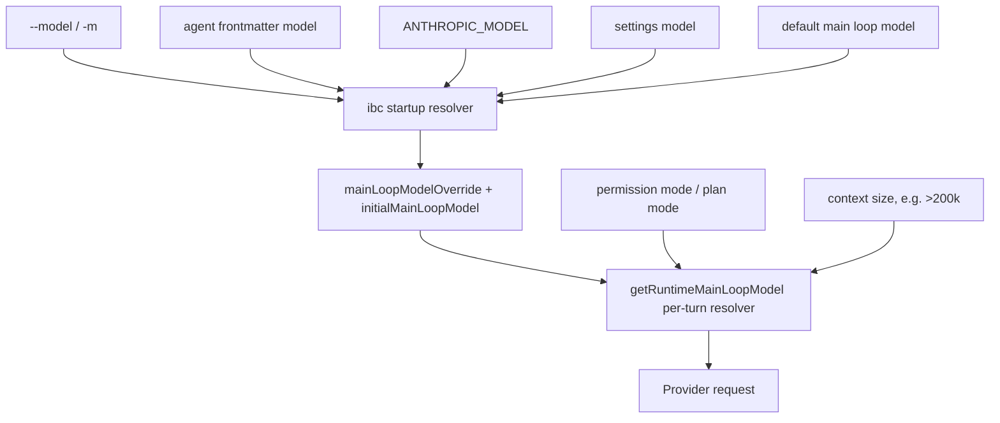
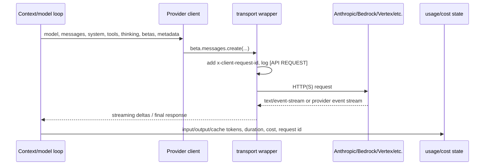

# Model selection, calls, usage, quota, and billing

This page reverse-engineers how `cli.renamed.js` selects models dynamically, how many logical model roles are visible, how provider calls are made, and how rate limits, errors, usage, quota, and billing are surfaced.

Scope: model aliases and precedence, main/helper/subagent/advisor/fallback model roles, Messages API request construction, streaming and retry behavior, rate-limit headers/events, token/cost accounting, headless budget guards, quota checks, and billing/extra-usage UI surfaces.

## Source anchors

| Semantic alias | String or symbol | Meaning |
| --- | --- | --- |
| DefaultModelResolvers | `getDefaultSonnetModel`, `getDefaultOpusModel`, `getDefaultHaikuModel`, `getDefaultMainLoopModel` | Resolver exports for the model family defaults. |
| SmallFastModelOverride | `ANTHROPIC_SMALL_FAST_MODEL` | Small/fast helper model override. |
| MainModelEnvOverride | `ANTHROPIC_MODEL` | Environment-level main model override. |
| PerTurnModelResolver | `getRuntimeMainLoopModel({permissionMode,mainLoopModel,exceeds200kTokens})` | Per-turn model resolver; plan mode can alter the selected model. |
| ModelAliasResolver | `case "opusplan"`, `case "sonnet"`, `case "haiku"`, `case "opus"`, `case "best"` | Alias-to-concrete-model mapping. |
| StartupModelPrecedence | `ibc({cli,env,settings,agentFrontmatter})` | Startup model precedence across CLI, env, settings, and agent frontmatter. |
| FallbackModelResolver | `obc({cli,settings})` | CLI/settings fallback-chain resolver; normalizes, filters, deduplicates, and caps the chain at three candidates. |
| StartupModelState | `startup_resolve_model` | Root startup path stores effective and initial model state. |
| ModelSelectionFlag | `--model <model>` | Root model-selection flag. |
| FallbackModelFlag | `--fallback-model <model>` | Print-mode overload fallback flag. |
| EmbeddedModelCatalog | `claude-sonnet-5`, `claude-opus-4-8`, `claude-fable-5` | Build-local catalog containing provider IDs, aliases, limits, capabilities, and pricing tiers. |
| ManagedModelAllowlist | `availableModels`, `enforceAvailableModels` | Constrains main, agent, subagent, advisor, and Default model selection. |
| AdvisorModelSetting | `advisorModel` | Settings surface for the server-side advisor tool model. |
| SubagentModelOverride | `CLAUDE_CODE_SUBAGENT_MODEL` | Subagent model override. |
| AutoModeClassifierConfig | `tengu_auto_mode_config`, `twoStageClassifier` | Auto-mode classifier model/config selection. |
| AutoModeRequestSource | `querySource:"auto_mode"` | Auto-mode classifier provider request source. |
| MemoryHelperModel | `Izy()`, `Select memories relevant to:`, `getDefaultSonnetModel()` | Memory-file relevance helper uses the default Sonnet resolver. |
| QuotaProbeRequest | `source:"quota_check"`, `max_tokens:1`, `messages:[{..."quota"}]` | Quota probe sends a tiny helper request. |
| ProviderRequestWrapper | `[API REQUEST]`, `x-client-request-id` | Fetch wrapper logs requests and injects a client request ID. |
| SseStreamDetector | `text/event-stream` | Streaming response detection. |
| BedrockStreamDetector | `vnd.amazon.eventstream` | Bedrock event-stream detection. |
| TokenCountHelper | `source:"count_tokens"`, `beta.messages.create` | Token-count helper request. |
| ApiUsageTelemetry | `api_request`, `input_tokens`, `output_tokens`, `cache_read_tokens`, `cost_usd` | API request telemetry/accounting. |
| SessionUsageAccumulator | `totalCostUSD`, `modelUsage`, `addToTotalCostState` | Session-level cost and per-model usage accumulator. |
| HeadlessUsageResult | `total_cost_usd`, `usage`, `modelUsage` | Headless result schema includes usage and cost. |
| SdkRetryDelayParser | `retry-after-ms`, `retry-after`, status `429`, status `>=500` | SDK retry behavior and retry-delay parsing. |
| RuntimeRateLimitClassifier | status `429`, status `529`, `overloaded_error` | Runtime error classification for rate limit and overload. |
| OverloadFallbackTelemetry | `tengu_api_opus_fallback_triggered`, `api_request_retry_exhausted` | Retry loop and overload fallback behavior. |
| UnifiedRateLimitHeaders | `anthropic-ratelimit-unified-*` headers | Unified rate-limit/quota header parsing. |
| RateLimitEventFrame | `rate_limit_event` | Rate-limit state changes are emitted to headless/SDK streams. |
| MaxBudgetFlag | `--max-budget-usd <amount>` | Headless API-spend budget flag. |
| MaxBudgetErrorResult | `error_max_budget_usd` | Headless result when the dollar budget is exceeded. |
| UsageLimitMessage | `usage limit`, `extra usage spending limit` | User-visible limit/overage messages. |
| BillingUpgradeGuidance | `hasBillingAccess`, `/extra-usage`, `/upgrade` | Billing/overage guidance in rate-limit UI. |
| ApiUsageBillingStatus | `API Usage Billing` | Status-line billing type for API-key/console-style usage. |

## Bundle module in `cli.renamed.js`

| Semantic alias | Loader line | Representative renamed exports | Atlas entry |
|---|---:|---|---|
| `ModelSelectionConfig` | 118207 | `resolveSkillModelOverride`, `renderModelSetting`, `renderModelName`, `renderDefaultModelSetting`, `parseUserSpecifiedModel`, `normalizeModelStringForAPI`, `modelDisplayString`, `isOpus1mMergeEnabled`, `isNonCustomOpusModel`, `isLegacyOpusFirstParty`, `isLegacyModelRemapEnabled`, `getUserSpecifiedModelSetting` | [Bundle module map — models, prompts, and memory](../99-research-atlas/module-map-from-renamed-cli.md#models-prompts-and-memory) |

## Model selection precedence

Model selection is a layered resolver, not one static constant.

```mermaid
flowchart TD
    CLI[--model / -m] --> Startup[ibc startup resolver]
    AgentFrontmatter[agent frontmatter model] --> Startup
    Env[ANTHROPIC_MODEL] --> Startup
    Settings[settings model] --> Startup
    Default[default main loop model] --> Startup
    Startup --> State[mainLoopModelOverride + initialMainLoopModel]
    State --> Turn[getRuntimeMainLoopModel per-turn resolver]
    Permission[permission mode / plan mode] --> Turn
    Context[context size, e.g. >200k] --> Turn
    Turn --> Request[Provider request]
```

The root startup path calls `ibc(...)`, then stores two pieces of state:

| State | Meaning |
|---|---|
| `effectiveModel` / `mainLoopModelOverride` | The override currently applied to the loop. |
| `initialMainLoopModel` | The model originally selected by startup/env/settings. |

The visible precedence is:

1. CLI `--model`, including `default` as a special alias for the default concrete model.
2. Agent frontmatter model when present and not `inherit`.
3. `ANTHROPIC_MODEL`.
4. Settings model.
5. Default main-loop model resolver.

Resume can also restore the model: `Sa5(...)` scans prior assistant messages and `IG(...)` reapplies a compatible restored model if no stronger override is active.

## Logical model roles

There is no fixed “number of concrete models” baked into the CLI. Concrete IDs depend on provider, feature flags, aliases, environment variables, settings, and account capabilities. The source does show a fixed set of **logical model roles**:

| Role | Resolver / setting | Purpose |
|---|---|---|
| Main loop model | `getMainLoopModel()`, `getDefaultMainLoopModel()`, `--model`, `ANTHROPIC_MODEL`, settings | Normal assistant turns. The concrete default is account/provider/policy aware; do not assume one universal Sonnet ID. |
| Default Sonnet | `getDefaultSonnetModel()`, `ANTHROPIC_DEFAULT_SONNET_MODEL` | Everyday/default work; also used by the structured memory-file selector. |
| Default Opus / best | `getDefaultOpusModel()`, `getBestModel()`, alias `opus`, alias `best`, `opusplan` in plan mode | More capable/plan-mode work and the catalog-driven “best” alias. |
| Default Haiku / small-fast | `getDefaultHaikuModel()`, `getSmallFastModel()`, `ANTHROPIC_SMALL_FAST_MODEL`, `ANTHROPIC_DEFAULT_HAIKU_MODEL` | Lightweight helper requests such as quota probing and small-fast mode when available. Other helper paths choose their model independently. |
| Auto-mode classifier | `tengu_auto_mode_config.model`, `twoStageClassifier` | Classifies tool/action safety for auto mode with `querySource:"auto_mode"`; its effective fallback is runtime/configuration dependent. |
| Memory helper | `Izy()`, `getDefaultSonnetModel()` | Selects up to five relevant memory files using a `selected_memories` JSON result. No separate fact-extraction model call was confirmed in this build. |
| Advisor tool model | `advisorModel` | Server-side advisor tool model override. |
| Subagent model | `CLAUDE_CODE_SUBAGENT_MODEL`, agent model/frontmatter, or inherit | Lets subagents use an explicit model or inherit from the main loop. |
| Fallback model | `--fallback-model` / `obc()` | Print/headless overload fallback when the primary model repeatedly returns overload. |

The important answer to “how many models” is therefore: **the CLI uses multiple logical model roles; it does not hard-code one universal count of concrete models.** In a normal local session, the main loop may use one model, while helper calls can use Sonnet or small-fast/Haiku, auto-mode can make classifier calls, and subagents/advisor/fallback can introduce additional models.

## Alias and dynamic mapping

The alias resolver maps user-facing names to current concrete IDs:

| Alias | Source-confirmed behavior |
|---|---|
| `sonnet` | Resolves through `getDefaultSonnetModel()`. |
| `haiku` | Resolves through `getDefaultHaikuModel()`. |
| `opus` | Resolves through `getDefaultOpusModel()`. |
| `fable` | Resolves to the current Fable family default. |
| `best` | Resolves through the catalog's `best` family, which is `fable` in `2.1.215`. |
| `opusplan` | Resolves to Sonnet normally but can switch to Opus in plan mode through `getRuntimeMainLoopModel(...)`. |
| `default` | Treated as the current default concrete model in CLI/fallback handling. |

Because aliases are resolved at runtime, docs should prefer “Sonnet/Opus/Haiku resolver” unless a concrete build-specific model ID is the point of the discussion.

## Current family heads and capabilities

The `2.1.215` catalog is embedded at approximately lines ~15,726–16,029.

| Family head | Catalog ID | Context | Max output | Default effort | Notable capability flags |
|---|---|---:|---:|---|---|
| Sonnet 5 | `claude-sonnet-5` | 1M native | 128K upper | `high` | `xhigh_effort`, adaptive thinking, mid-conversation system, context management |
| Opus 4.8 | `claude-opus-4-8` | 1M native | 128K upper | `high` | fast mode, lean prompt, adaptive thinking, mid-conversation system |
| Fable 5 | `claude-fable-5` | 1M native | 128K upper | `high` | adaptive thinking, lean prompt, Fable mitigations; disabled-thinking rejection |
| Haiku 4.5 | `claude-haiku-4-5` | 200K | 64K upper | catalog/provider default | context management; 1M suffix support |

Catalog aliases are provider-specific. The default `sonnet → claude-sonnet-5` and `opus → claude-opus-4-8` mappings do not imply every Bedrock, Vertex, Foundry, Mantle, Anthropic AWS, or gateway deployment serves that exact ID. The resolver applies `per_provider` entries before request construction.

Organization policy is part of resolution, not a picker-only filter. `availableModels` applies to aliases, explicit IDs, subagents, teammates, advisor choices, and server-requested swaps. Managed `enforceAvailableModels` also constrains the Default row and refuses cascade-trust behavior if a policy source failed to load.

## Provider call path

Provider calls share a common shape even when the backend differs.

```mermaid
sequenceDiagram
    participant ContextLoop as Context/model loop
    participant Client as Provider client
    participant Fetch as transport wrapper
    participant Provider as Anthropic/Bedrock/Vertex/etc.
    participant Accounting as usage/cost state

    ContextLoop->>Client: model, messages, system, tools, thinking, betas, metadata
    Client->>Fetch: beta.messages.create(...)
    Fetch->>Fetch: add x-client-request-id, log [API REQUEST]
    Fetch->>Provider: HTTP(S) request
    Provider-->>Fetch: text/event-stream or provider event stream
    Fetch-->>ContextLoop: streaming deltas / final response
    ContextLoop->>Accounting: input/output/cache tokens, duration, cost, request id
```

Confirmed request ingredients include:

| Request ingredient | Source evidence |
|---|---|
| Model | `model:<resolver result>` in main/helper requests. |
| Messages/system | Main loop and helper calls pass `messages`, `system`, and sometimes `skipSystemPromptPrefix`. |
| Tools/tool choice | Count-token/helper and web-search paths can include tool schemas or tool choice. |
| Thinking/effort | `--thinking`, `--thinking-display`, `--max-thinking-tokens`, effort settings. |
| Betas | `Ru(model)` and `TP(...)` add model/provider beta headers. |
| Metadata | `metadata:C3H()` appears in helper/provider calls. |
| Extra body params | `$9H()` contributes additional API body settings. |

The fetch wrapper logs `[API REQUEST] <path> x-client-request-id=<id> source=<source>` and detects streaming content types. For first-party/AWS-like first-party paths it injects `x-client-request-id`; for Bedrock it also recognizes `vnd.amazon.eventstream`.

## Streaming, retries, and errors

### Streaming

The runtime uses provider streaming, with source-confirmed surfaces for:

- `text/event-stream` for ordinary streaming responses;
- `vnd.amazon.eventstream` for Bedrock event streams;
- stream deltas that carry `input_tokens`, `output_tokens`, `cache_creation_input_tokens`, `cache_read_input_tokens`, and `context_management`.

### Retry behavior

There are two visible retry layers:

| Layer | Behavior |
|---|---|
| SDK/client retry | Parses `retry-after-ms` and `retry-after`; retries status `408`, `409`, `429`, and `>=500` according to max-retry policy. |
| Claude Code loop retry | Classifies provider/API errors, retries selected retryable failures, handles auth refresh paths, and can switch to fallback model on repeated overload. |

The runtime classifies:

| Condition | Classification / behavior |
|---|---|
| HTTP `429` | Rate limit. |
| HTTP `529` or `"type":"overloaded_error"` | Server overload; can trigger fallback logic. |
| HTTP `413` with context-window wording | Prompt/context too long; UI directs the user toward `/compact` or reducing context. |
| Repeated overload with `--fallback-model` / `fallbackModel` | Advances through the ordered fallback chain; the primary is tried again at the next user turn. |
| Retry exhaustion | Emits `api_request_retry_exhausted`/throws a wrapped execution error. |

## Usage and cost accounting

`cli.renamed.js` maintains session-level usage state in the global runtime envelope:

| State | Meaning |
|---|---|
| `totalCostUSD` | Accumulated API cost estimate for the current run/session envelope. |
| `modelUsage` | Per-model token/cost usage map. |
| `totalAPIDuration` / `totalAPIDurationWithoutRetries` | Total provider time with and without retry time. |
| `hasUnknownModelCost` | Set when the runtime cannot price a model. |

After a successful API call, telemetry includes:

- `input_tokens`
- `output_tokens`
- `cache_read_tokens`
- `cache_creation_tokens`
- `cost_usd`
- `cost_usd_micros`
- `duration_ms`
- `request_id`
- model speed (`fast` / `normal`)
- query source
- effort level when present

Headless `result` frames include `total_cost_usd`, `usage`, and `modelUsage`, so SDK/print-mode consumers can account for the entire run rather than only the final message.

## Budget guards

The root flag `--max-budget-usd <amount>` is a print/headless budget guard. The headless loop checks `vW()>=maxBudgetUsd` after events and emits a final result with subtype `error_max_budget_usd` when exceeded.

The emitted result contains:

- elapsed duration;
- API duration;
- turn count;
- `total_cost_usd`;
- `usage`;
- `modelUsage`;
- permission denials;
- a user-readable error such as `Reached maximum budget ($<amount>)`.

This is local run-budget enforcement. It is separate from server-side account quota/rate limits.

## Quota, rate limit, and billing surfaces

### Quota probing

`hIg()`, anchored by `source:"quota_check"`, creates a client with `maxRetries:0`, selects `getSmallFastModel()` as the helper model, and sends a one-token `messages.create` request with the user content `quota`. This is a low-cost probe designed to surface quota/rate-limit headers rather than to generate meaningful text.

### Unified rate-limit headers

The runtime parses Anthropic unified rate-limit headers such as:

| Header family | Meaning |
|---|---|
| `anthropic-ratelimit-unified-representative-claim` | Which limit bucket is currently representative. |
| `anthropic-ratelimit-unified-reset` | Reset timestamp for the active limit. |
| `anthropic-ratelimit-unified-overage-status` | Whether extra usage/overage is allowed, warning, or rejected. |
| `anthropic-ratelimit-unified-overage-reset` | Reset timestamp for overage status. |
| `anthropic-ratelimit-unified-overage-disabled-reason` | Admin/seat/group reason why extra usage is unavailable. |
| `anthropic-ratelimit-unified-5h-utilization` / `...-5h-reset` | Five-hour/session window utilization and reset. |
| `anthropic-ratelimit-unified-7d-utilization` / `...-7d-reset` | Seven-day/weekly window utilization and reset. |
| `anthropic-ratelimit-unified-overage-utilization` / `...-overage-reset` | Extra-usage utilization and reset. |

Parsed state is stored as the current rate-limit state and projected into headless streams as `rate_limit_event` frames.

### User-visible limit and billing messages

The UI distinguishes several user-facing cases:

| Surface | Meaning |
|---|---|
| `five_hour` | “session limit” / five-hour style limit. |
| `seven_day` | weekly limit. |
| `seven_day_opus` | Opus-specific limit. |
| `seven_day_sonnet` | Sonnet-specific limit. |
| `overage` | usage or extra-usage spending limit. |
| `/extra-usage` | Suggested when extra usage can be requested/enabled. |
| `/upgrade` | Suggested for Pro/Max-style upgrade paths when applicable. |
| `hasBillingAccess` | Gates whether the user can manage billing/extra usage. |
| `API Usage Billing` | Status-line billing type for API/console billing mode. |

This confirms that billing/quota handling is not just a raw API error. The CLI parses quota headers, maintains local limit state, emits SDK/headless events, and renders plan/billing-specific guidance.

## Relationship between usage, quota, and billing

| Concern | Owner | Source-confirmed mechanism |
|---|---|---|
| Per-request usage | Provider response + runtime accounting | Token/cache/cost fields collected after API calls. |
| Per-run budget | Local headless loop | `--max-budget-usd` and `error_max_budget_usd`. |
| Account quota/rate limits | Provider/server headers | `anthropic-ratelimit-unified-*` parsing and `rate_limit_event`. |
| Billing/overage UI | Account state + server headers + OAuth account role | `/extra-usage`, `/upgrade`, billing-access checks, `API Usage Billing`. |

## Caveats

- Concrete model names and aliases are build/account/provider dependent. The current catalog table is build-specific; logical roles remain the safer long-lived anchors.
- Some `rate_limit_error` and SDK examples in the bundle are embedded documentation strings. This page treats them as evidence only when connected to runtime classification, request wrapping, header parsing, or result schemas.
- Cost is an estimate derived from known model pricing tables and response usage. `hasUnknownModelCost` exists because not every model can be priced by the local table.
- `--fallback-model` is documented by the CLI as print-mode-only. Interactive model changes use `/model`, Remote Control `set_model`, or session state transitions rather than the fallback flag.

## Third-party default availability and startup fallbacks

The current build does not implement the previously documented Bedrock/Vertex “upgrade candidate” map at the old `705680` range, nor does this path use Bedrock `ListFoundationModels`. Its startup concern is narrower: determine whether configured/default model families are callable on the selected third-party provider, then assign usable defaults when they are not.

### Accessibility probes

Provider-specific probes near [`cli.renamed.js` lines 506675–507237](../../claude-code-pkg/src/entrypoints/cli.renamed.js#L506675) create the provider client and issue a minimal `messages.create` request with `max_tokens:1`. These are capability/access checks, not meaningful model turns and not upgrade recommendations.

The important result rule is:

- a successful tiny request means the model is accessible;
- HTTP `429` also counts as accessible because rate limiting proves that the provider recognized and admitted the model route;
- access, configuration, region, or model-not-found failures leave that candidate unavailable for default assignment.

The exact provider SDK may adapt the request into its native transport, but the probe is expressed through the common Messages client rather than a bespoke `InvokeModel` result object such as `{available, reason}`.

### Startup fallback application

`apply3PDefaultFallbacks()` is exported near [`cli.renamed.js:507237`](../../claude-code-pkg/src/entrypoints/cli.renamed.js#L507237) and invoked during startup near [`cli.renamed.js:933334`](../../claude-code-pkg/src/entrypoints/cli.renamed.js#L933334). It uses the availability results to choose provider-usable family defaults before the normal loop begins.

User-visible descriptions can explain the substitution, for example `Opus unavailable — using ...`. This is automatic **default-family fallback**, not the same feature as the ordered overload chain configured by `--fallback-model`:

| Mechanism | Trigger | Lifetime |
|---|---|---|
| Third-party default fallback | A configured/default family is unavailable on the provider/account/region at startup. | Adjusts the defaults used for the session/provider environment. |
| `--fallback-model` chain | Repeated overload while executing a print/headless turn. | Temporarily advances candidates; the primary is retried on the next user turn. |
| `/model` or explicit `--model` | User chooses a model. | Explicit selection remains subject to provider availability and organization policy. |

### Bedrock model discovery

Bedrock's separate discovery path uses `ListInferenceProfiles` near [`cli.renamed.js:119465`](../../claude-code-pkg/src/entrypoints/cli.renamed.js#L119465). Inference-profile enumeration helps map available Bedrock model/profile IDs; it is not evidence for the obsolete `ListFoundationModels` upgrade flow.

### Evidence boundary

The client establishes the one-token probe, 429 treatment, fallback application, and inference-profile discovery. Provider-side entitlement rules and the reason a deployment omits a model remain outside the retained artifact.

## Related docs

- [Models, providers, and auth](models-providers-auth.md)
- [Context, memory, compaction, checkpoints, and rewind](context-memory-compaction-checkpoints.md)
- [Prompt, context, and memory](prompt-context-memory.md)
- [Headless streaming and resilience](headless-streaming-and-resilience.md)
- [Context and model loop architecture](architecture.md)
- [Session resume and transcripts](../04-sessions-persistence-remote/session-resume-and-transcripts.md)