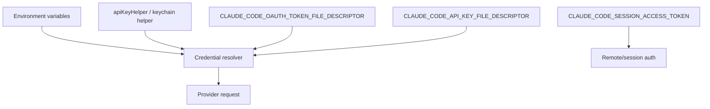

# Models, providers, and auth

This page reverse-engineers the authentication and provider-selection paths that show how Claude Code chooses credentials, providers, and MCP OAuth flows.

## Source anchors

| Semantic alias | String or symbol | Meaning |
| --- | --- | --- |
| SdkCredentialInitializer | `ANTHROPIC_API_KEY`, `ANTHROPIC_AUTH_TOKEN` | Embedded SDK credential initialization path. |
| RuntimeApiKeyLookup | `process.env.ANTHROPIC_API_KEY` | Runtime API-key lookup helper. |
| BearerTokenHeaderPath | `ANTHROPIC_AUTH_TOKEN` | Bearer-token authorization header path. |
| BedrockProviderGate | `CLAUDE_CODE_USE_BEDROCK` | Provider classifier branch. |
| AnthropicAwsProviderGate | `CLAUDE_CODE_USE_ANTHROPIC_AWS` | Anthropic AWS provider branch. |
| MantleProviderGate | `CLAUDE_CODE_USE_MANTLE` | Mantle provider branch. |
| VertexProviderGate | `CLAUDE_CODE_USE_VERTEX` | Vertex provider branch. |
| MainModelEnvOverride | `ANTHROPIC_MODEL` | Model selection environment variable. |
| SmallFastModelOverride | `ANTHROPIC_SMALL_FAST_MODEL` | Small/fast model override. |
| ModelSelectionFlag | `--model <model>` | Root model-selection flag. |
| FallbackModelFlag | `--fallback-model <model>` | Print-mode fallback model flag. |
| XaaEnableGate | `CLAUDE_CODE_ENABLE_XAA` | Cross-app access OAuth flow is gated when server config requests `oauth.xaa`. |
| XaaTokenExchangeError | `XaaTokenExchangeError`, `shouldClearIdToken` | Failed XAA token exchange can carry cache-clearing guidance. |
| McpOAuthStore | `mcpOAuth` | MCP OAuth credentials are stored by server-derived key. |

## Bundle modules in `cli.renamed.js`

| Semantic alias | Loader line(s) | Representative renamed exports | Atlas entry |
|---|---:|---|---|
| `GatewayAuthRefresh` | 110458, 157847 | `withOAuthRefreshLock`, `validateForceLoginOrg`, `shouldUseWIFAuth`, `saveOAuthTokensIfNeeded`, `saveApiKey`, `restoreGatewayAuth`, `resetAwsAuthRefreshCooldown`, `removeApiKey`, `refreshGcpCredentialsIfNeeded`, `refreshGcpAuth`, `getAnthropicApiKey`, `hasAnthropicApiKeyAuth`, `getAuthTokenSource`, `isAnthropicAuthEnabled` | [Bundle module map — auth (multi-cloud)](../99-research-atlas/module-map-from-renamed-cli.md#auth-multi-cloud) |
| `LoginFlow` | 409636 | `Login`, `runPostLoginHooks` | [Bundle module map — auth (multi-cloud)](../99-research-atlas/module-map-from-renamed-cli.md#auth-multi-cloud) |

## Provider selection

The provider classifier visible around `Dq()` uses environment gates to choose a provider family. Confirmed strings include:

| Provider family | High-signal env vars |
|---|---|
| First-party/default | absence of provider-specific gates; OAuth/API-key helpers still apply. |
| Bedrock | `CLAUDE_CODE_USE_BEDROCK` |
| Vertex | `CLAUDE_CODE_USE_VERTEX` |
| Foundry | `CLAUDE_CODE_USE_FOUNDRY` |
| Anthropic AWS | `CLAUDE_CODE_USE_ANTHROPIC_AWS` |
| Mantle | `CLAUDE_CODE_USE_MANTLE` |

The bundle also contains region/base URL surfaces such as `AWS_REGION`, `AWS_DEFAULT_REGION`, `CLOUD_ML_REGION`, and `ANTHROPIC_BASE_URL`.

## Credential sources

Confirmed credential surfaces include:

- `ANTHROPIC_API_KEY`
- `ANTHROPIC_AUTH_TOKEN`
- `CLAUDE_CODE_OAUTH_TOKEN`
- `CLAUDE_CODE_OAUTH_TOKEN_FILE_DESCRIPTOR`
- `CLAUDE_CODE_API_KEY_FILE_DESCRIPTOR`
- `apiKeyHelper`
- `enterpriseGateway`

## MCP cross-app access (XAA)

The decoded OAuth/XAA chunk shows a separate MCP OAuth branch when a server configuration includes `oauth.xaa`. That branch is hard-gated by `CLAUDE_CODE_ENABLE_XAA`; without the env gate the runtime tells the user to remove `oauth.xaa` and use the standard consent flow.

When enabled, the XAA path performs an IdP/client/token-exchange flow and stores resulting MCP OAuth state under `mcpOAuth`. `XaaTokenExchangeError` carries `shouldClearIdToken`, which lets the runtime distinguish ordinary exchange failures from failures that should invalidate a cached identity token. Treat this as an MCP-auth extension path, not as the general Anthropic API-key or provider-selection path.

## Model and budget flags

| Surface | Runtime implication |
|---|---|
| `--model <model>` | Selects a model alias or concrete model for the session. |
| `ANTHROPIC_MODEL` | Environment-level default model source. |
| `ANTHROPIC_SMALL_FAST_MODEL` | Overrides the small/fast model used by helper paths. |
| `--fallback-model <model>` | Enables a print-mode fallback when the default model is overloaded. |
| `--thinking`, `--thinking-display`, `--max-thinking-tokens` | Controls thinking mode and legacy thinking-token budget. |
| `--max-budget-usd`, `--task-budget`, `--max-turns` | Enforces budget/turn constraints in headless or task-like paths. |
| `--betas <betas...>` | Adds beta headers for API-key users. |

For the detailed runtime model resolver, logical model roles, provider-call shape, retries, rate-limit events, usage accounting, quota probes, and billing/overage UI, see [Model selection, calls, usage, quota, and billing](model-selection-usage-quota-billing.md).

## Error and availability hints

The bundle contains model/provider error strings that point users toward `--model` or `/model` when a deployment lacks a requested model. This supports the interpretation that model choice is both a CLI flag and an interactive command surface.

## Caveats

- The bundled Anthropic SDK documentation strings include many API examples. This page only treats strings as runtime evidence when they connect to env-variable lookup, root flags, or provider classifier code.
- Provider names and env gates are source-anchored for this build; behavior can change across package versions.

## OAuth scope model and token lifecycle

The `OAuthClient` module (`cli.renamed.js:47791`, `109942`-`110200`) owns Claude Code's OAuth handshake against `claude.ai` and the Console. It supports two scope flavors and a long-lived token mode used by `claude setup-token`.

### Scope sets

| Constant | Effect |
|---|---|
| `CLAUDE_AI_INFERENCE_SCOPE` | Required to call inference endpoints with a claude.ai-issued token. |
| `CLAUDE_AI_PROFILE_SCOPE` | Required for profile/organization metadata reads; gates Remote Control entitlement (see [Feature gates reference](../05-hosted-agent-ops/feature-gates-reference.md)). |
| `CLAUDE_AI_OAUTH_SCOPES` | Full default scope set used by `claude auth login`. |
| `CONSOLE_OAUTH_SCOPES` | Console-flavor scope set used when the redirect targets the Console UI. |
| `LONG_LIVED_OAUTH_TOKEN_TTL_SECONDS` | TTL applied to tokens minted by `claude setup-token`. The exchange request adds `expires_in: <LONG_LIVED_OAUTH_TOKEN_TTL_SECONDS>`. |
| `OAUTH_BETA_HEADER` | Beta opt-in header attached to OAuth flows. |

`shouldUseClaudeAIAuth(scopes)` is the predicate used elsewhere in the runtime: it returns true exactly when `scopes` contains `CLAUDE_AI_INFERENCE_SCOPE`. `parseScopes(scopeString)` splits the server's space-delimited `scope` field back into an array.

### `buildAuthUrl(...)`

Builds the authorize URL the browser/manual-paste flow opens:

- Picks `CLAUDE_AI_AUTHORIZE_URL` (`loginWithClaudeAi: true`) or `CONSOLE_AUTHORIZE_URL` otherwise (both from `getOauthConfig()`).
- Appends `code=true`, `client_id`, `response_type=code`, `redirect_uri` (loopback `http://localhost:<port>/callback` or `MANUAL_REDIRECT_URL` for `isManual`), `code_challenge`, `code_challenge_method=S256`, `state`.
- Scope = `CLAUDE_AI_INFERENCE_SCOPE` only when `inferenceOnly: true`; otherwise the full `CLAUDE_AI_OAUTH_SCOPES` (or `CONSOLE_OAUTH_SCOPES`).
- Optional `orgUUID`, `login_hint`, `login_method` query params for pre-selecting an organization or routing to a specific provider login.

### `exchangeCodeForTokens(code, state, verifier, port, isManual?, expiresIn?)`

POSTs `grant_type=authorization_code` to `getOauthConfig().TOKEN_URL` with PKCE verifier, the matching redirect URI, and (optionally) `expires_in` for long-lived tokens. On 200 it returns the raw token payload and emits `tengu_oauth_token_exchange_success`. On 401 it tags `oauth_exchange_invalid_code`; on anything else `oauth_exchange_http_error`. 30 s axios timeout.

### `refreshOAuthToken(refreshToken, {scopes?, expiresIn?, clientId?})`

- POSTs `grant_type=refresh_token` with scope = caller-supplied OR `CLAUDE_AI_OAUTH_SCOPES`.
- Always preserves the refresh token (server returns one, but falls back to the input if missing).
- After success, when the current `oauthAccount` is missing billing/subscription/profile fields, fetches `/profile` and atomically updates `oauthAccount.displayName`, `hasExtraUsageEnabled`, `billingType`, `accountCreatedAt`, `subscriptionCreatedAt`, `ccOnboardingFlags`, `claudeCodeTrialEndsAt`, `claudeCodeTrialDurationDays`, `seatTier`.
- On `invalid_grant` errors, tags `oauth_refresh_invalid_grant` so the auth shutdown path can prompt re-login.
- Returns `{accessToken, refreshToken, expiresAt, scopes, clientId, subscriptionType, rateLimitTier, profile?, tokenAccount?}`.

### `fetchAndStoreUserRoles(accessToken)`

GETs `ROLES_URL` with `Authorization: Bearer <token>`, then atomically updates `oauthAccount.organizationRole`, `workspaceRole`, and `organizationName`. Used by the login flow to make role-gated UI elements available before the first request.

### `createAndStoreApiKey(accessToken)`

POSTs to `API_KEY_URL` with the OAuth access token to mint a long-lived API key, then writes it through `saveApiKey(...)`. This is the path that `claude setup-token` uses for sessionless agent installs. On any failure tags `oauth_create_api_key` / `oauth_api_key_request_failed`.

### `isOAuthTokenExpired(expiresAt)`

Returns true when the token expires within 5 minutes (300 s grace window). Callers refresh proactively rather than waiting for an inflight 401.

### Subscription type mapping

`fetchProfileInfo(accessToken)` maps the server's `organization.organization_type` to the local `subscriptionType` value:

| Server value | Local `subscriptionType` |
|---|---|
| `claude_max` | `max` |
| `claude_pro` | `pro` |
| `claude_enterprise` | `enterprise` |
| `claude_team` | `team` |
| anything else | `null` |

Also returns `rateLimitTier`, `seatTier`, `hasExtraUsageEnabled`, `billingType`, and the raw profile so callers can stash additional fields.

## Related docs

- [Prompt, context, and memory](prompt-context-memory.md)
- [Model selection, calls, usage, quota, and billing](model-selection-usage-quota-billing.md)
- [Headless streaming and resilience](headless-streaming-and-resilience.md)
- [Remote control and teleport](../04-sessions-persistence-remote/remote-control-and-teleport.md)
