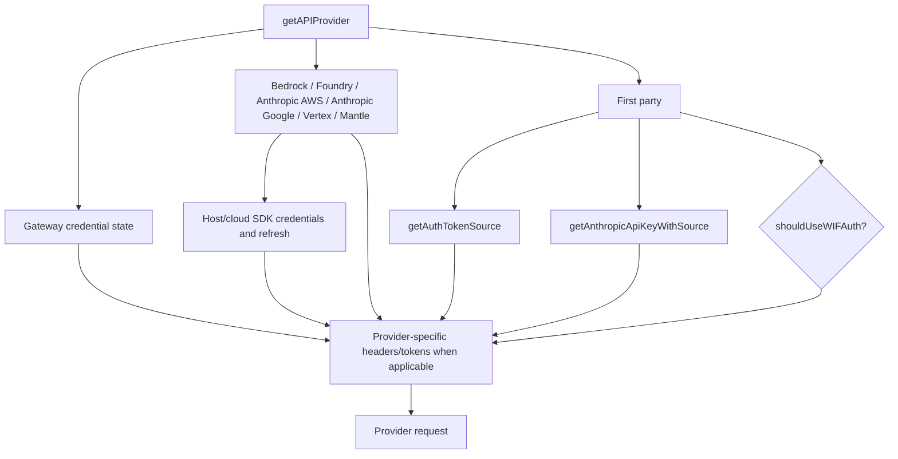

# Models, providers, and auth

This page reverse-engineers the authentication and provider-selection paths that show how Claude Code chooses a provider, then resolves the credential lane appropriate to that provider and execution host. Provider routing, bearer/OAuth tokens, API keys, workload identity, host-managed cloud credentials, provider-specific headers, and MCP OAuth are related but distinct decisions.

## Source anchors

| Semantic alias | String or symbol | Meaning |
| --- | --- | --- |
| ProviderClassifier | `getAPIProvider()` | Ordered provider selection; returns one provider family. |
| SecondaryProvider | `getSecondaryProvider()` | Can add Mantle as a secondary route when Bedrock is primary for selected models. |
| GatewayAuth | `getGatewayAuth()` | Active gateway auth takes precedence over provider environment gates. |
| BearerTokenResolver | `getAuthTokenSource()` | Resolves bearer/OAuth-style token sources and records their provenance. |
| ApiKeyResolver | `getAnthropicApiKeyWithSource()` | Resolves API-key-style credentials separately from bearer tokens. |
| WifEligibility | `shouldUseWIFAuth()` | Decides whether workload-identity federation is eligible after explicit and host-managed exclusions. |
| HeaderAssembler | `getAuthHeadersAsync()` | Converts the selected credential/provider state into request headers. |
| BedrockProviderGate | `CLAUDE_CODE_USE_BEDROCK` | Provider classifier branch. |
| FoundryProviderGate | `CLAUDE_CODE_USE_FOUNDRY` | Foundry provider branch. |
| AnthropicAwsProviderGate | `CLAUDE_CODE_USE_ANTHROPIC_AWS` | Anthropic AWS provider branch. |
| AnthropicGoogleProviderGate | `CLAUDE_CODE_USE_ANTHROPIC_GOOGLE_CLOUD` | Anthropic Google Cloud provider branch. |
| MantleProviderGate | `CLAUDE_CODE_USE_MANTLE` | Mantle provider branch. |
| VertexProviderGate | `CLAUDE_CODE_USE_VERTEX` | Vertex provider branch. |
| MainModelEnvOverride | `ANTHROPIC_MODEL` | Model selection environment variable. |
| SmallFastModelOverride | `ANTHROPIC_SMALL_FAST_MODEL` | Small/fast model override. |
| ModelSelectionFlag | `--model <model>` | Root model-selection flag. |
| FallbackModelFlag | `--fallback-model <model>` | Print-mode fallback model flag. |
| EmbeddedModelCatalog | `display_name: "Sonnet 5"`, `display_name: "Opus 4.8"`, `display_name: "Fable 5"` | Hand-maintained runtime catalog with provider IDs, context, output, capability, pricing, and alias metadata. |
| ManagedModelPolicy | `availableModels`, `enforceAvailableModels` | Organization policy can restrict aliases, explicit model picks, subagents, and the resolved Default model. |
| XaaEnableGate | `CLAUDE_CODE_ENABLE_XAA` | Cross-app access OAuth flow is gated when server config requests `oauth.xaa`. |
| XaaTokenExchangeError | `XaaTokenExchangeError`, `shouldClearIdToken` | Failed XAA token exchange can carry cache-clearing guidance. |
| McpOAuthStore | `mcpOAuth` | MCP OAuth credentials are stored by server-derived key. |

## Implementation map in `cli.renamed.js`

| Range | Current anchors | Role |
|---:|---|---|
| [~119000–120999](../../claude-code-pkg/src/entrypoints/cli.renamed.js#L119000) | `getAPIProvider`, `getSecondaryProvider`, `ListInferenceProfiles` | Provider classification, secondary routing, and Bedrock discovery. |
| [~129279](../../claude-code-pkg/src/entrypoints/cli.renamed.js#L129279) | `getAuthHeadersAsync` | Provider/request header assembly. |
| [~184900–188899](../../claude-code-pkg/src/entrypoints/cli.renamed.js#L184900) | `shouldUseWIFAuth`, `getAuthTokenSource`, `getAnthropicApiKeyWithSource`, refresh helpers | Credential lanes, exclusions, provenance, and recovery. |

The [bundle module map](../99-research-atlas/module-map-from-renamed-cli.md#auth-multi-cloud) remains useful for loader discovery, but semantic function names and exact environment strings are the stronger behavioral anchors for this build.

## Provider selection

`getAPIProvider()` is an ordered branch, not an unordered set of flags. The first matching route wins:

| Order | Provider result | Selection surface |
|---:|---|---|
| 1 | Gateway | Active `getGatewayAuth()` state. |
| 2 | Bedrock | `CLAUDE_CODE_USE_BEDROCK`. |
| 3 | Foundry | `CLAUDE_CODE_USE_FOUNDRY`. |
| 4 | Anthropic AWS | `CLAUDE_CODE_USE_ANTHROPIC_AWS`. |
| 5 | Anthropic Google Cloud | `CLAUDE_CODE_USE_ANTHROPIC_GOOGLE_CLOUD`. |
| 6 | Mantle | `CLAUDE_CODE_USE_MANTLE`. |
| 7 | Vertex | `CLAUDE_CODE_USE_VERTEX`. |
| 8 | First party | Fallback when no earlier branch matches. |

This order matters if more than one gate is present: the classifier does not merge provider identities. `getSecondaryProvider()` is a separate exception; when Bedrock is primary, selected model routes can use Mantle secondarily. That secondary route does not alter the primary provider classification.

Region and endpoint inputs such as `AWS_REGION`, `AWS_DEFAULT_REGION`, `CLOUD_ML_REGION`, and `ANTHROPIC_BASE_URL` configure the selected adapter. They do not independently establish one universal credential precedence chain.

## Current model catalog (`2.1.215`)

The embedded catalog near `cli.renamed.js` lines ~15,726–16,029 is the build-local source of truth. Aliases are provider-aware: the default column below is the catalog default, but `per_provider` can deliberately pin an older deployment where the newest family member is unavailable.

| Family alias | Catalog default | Context | Output tokens (default / upper) | Key capabilities |
|---|---|---:|---:|---|
| `sonnet` | `claude-sonnet-5` | 1M native | 64K / 128K | effort through `xhigh`, adaptive thinking, mid-conversation system updates, context management |
| `opus` | `claude-opus-4-8` | 1M native | 64K / 128K | effort through `xhigh`, adaptive thinking, fast mode, lean prompt, mid-conversation system updates |
| `fable` | `claude-fable-5` | 1M native | 64K / 128K | effort through `xhigh`, adaptive thinking, lean prompt, Fable mitigations; rejects explicit disabled thinking |
| `haiku` | `claude-haiku-4-5` | 200K (1M suffix support) | 32K / 64K | context management |

`best` resolves to the `fable` family in this build. Provider exceptions are explicit catalog data: for example, `sonnet` remains on older Sonnet deployments for several third-party providers, while `opus` maps to Opus 4.6 on Foundry and Opus 4.7 on the generic gateway. Full IDs bypass alias mapping but still pass availability and policy checks.

The newer catalog entries use adaptive thinking and effort rather than a fixed thinking-token budget. Sonnet 5 and Opus 4.8 accept disabled thinking; Fable 5 rejects an explicit disabled value, so the runtime omits the parameter when thinking is not requested.

## Authentication is a branch matrix, not one precedence list

Provider selection happens first. The selected provider and execution context then determine which credential lane is relevant:

```mermaid
flowchart TD
    Provider[getAPIProvider] --> Gateway[Gateway credential state]
    Provider --> Cloud[Bedrock / Foundry / Anthropic AWS / Anthropic Google / Vertex / Mantle]
    Provider --> FirstParty[First party]

    FirstParty --> Bearer[getAuthTokenSource]
    FirstParty --> ApiKey[getAnthropicApiKeyWithSource]
    FirstParty --> WIF{shouldUseWIFAuth?}
    Cloud --> Host[Host/cloud SDK credentials and refresh]
    Cloud --> Headers[Provider-specific headers/tokens when applicable]
    Gateway --> Headers
    Bearer --> Headers
    ApiKey --> Headers
    WIF --> Headers
    Host --> Headers
    Headers --> Request[Provider request]
```

### Bearer and OAuth token lane

`getAuthTokenSource()` resolves bearer-style credentials in this observed order, subject to restricted/remote host conditions:

1. restricted-mode helper handling or no token when that mode forbids ordinary sources;
2. `ANTHROPIC_AUTH_TOKEN`;
3. `CLAUDE_CODE_OAUTH_TOKEN`;
4. an OAuth token supplied through the configured file-descriptor/CCR token-file path;
5. `apiKeyHelper` when the current remote/host-managed context allows it;
6. a WIF profile;
7. stored Claude.ai OAuth state;
8. no bearer token.

The resolver returns provenance as well as a value, allowing downstream header and diagnostics code to distinguish an environment token, helper result, WIF profile, and stored OAuth token.

### API-key lane

`getAnthropicApiKeyWithSource()` is separate from the bearer resolver. Its context-sensitive sources include:

- `ANTHROPIC_API_KEY`;
- an approved custom key;
- an injected/file-descriptor key;
- `apiKeyHelper` when allowed;
- the managed key saved by `/login`;
- no API key.

An API key and an OAuth bearer token are not interchangeable just because both can authorize a first-party request. `getAuthHeadersAsync()` selects the appropriate header form from the resolved lane and provider state.

### Workload identity federation

`shouldUseWIFAuth()` is an eligibility filter rather than a final credential reader. It declines WIF when provider gates require another adapter, the execution host manages auth, an explicit bearer/OAuth source or helper has precedence, the process is in selected remote/socket contexts, or stored OAuth should win. Only an eligible WIF profile enters the bearer/header path.

### Host-managed and provider-specific credentials

Cloud providers can obtain credentials through their own SDK/default chains or host callbacks. Bedrock/AWS and GCP paths contain dedicated refresh/cooldown helpers; SDK/bridge modes can receive host-managed credentials or token-refresh callbacks. These branches must not be described as lower-priority entries beneath `ANTHROPIC_API_KEY`: for a cloud provider they are a different adapter contract.

Gateway, Mantle, Foundry, Anthropic AWS/Google, Bedrock, and Vertex also have provider-specific endpoint/header shaping. The retained client proves the branch and refresh seams; it does not make all provider credentials observable as one common secret string.

### Refresh and recovery

OAuth refresh is serialized by a refresh lock so concurrent requests do not race token rotation. The client refreshes proactively near expiration and can refresh/retry after an authorization failure. Invalid-grant and repeated 401 paths clear or invalidate unusable state and direct the user toward reauthentication rather than retrying forever.

AWS/GCP refresh helpers use provider-specific state and cooldowns. SDK-hosted OAuth refresh is conditional on the host capability contract (`CLAUDE_CODE_SDK_HAS_OAUTH_REFRESH`) and callback availability; cleanup rejects any still-pending host control requests.

## MCP cross-app access (XAA)

The decoded OAuth/XAA chunk shows a separate MCP OAuth branch when a server configuration includes `oauth.xaa`. That branch is hard-gated by `CLAUDE_CODE_ENABLE_XAA`; without the env gate the runtime tells the user to remove `oauth.xaa` and use the standard consent flow.

When enabled, the XAA path performs an IdP/client/token-exchange flow and stores resulting MCP OAuth state under `mcpOAuth`. `XaaTokenExchangeError` carries `shouldClearIdToken`, which lets the runtime distinguish ordinary exchange failures from failures that should invalidate a cached identity token. Treat this as an MCP-auth extension path, not as the general Anthropic API-key or provider-selection path.

## Model and budget flags

| Surface | Runtime implication |
|---|---|
| `--model <model>` | Selects a model alias or concrete model for the session. |
| `ANTHROPIC_MODEL` | Environment-level default model source. |
| `ANTHROPIC_SMALL_FAST_MODEL` | Overrides the small/fast model used by helper paths. |
| `--fallback-model <model>` | Accepts a comma-separated fallback chain for print mode; the runtime retries the primary at the next user turn. Persisted `fallbackModel` settings also support ordered fallback candidates. |
| `--thinking`, `--thinking-display`, `--max-thinking-tokens` | Controls thinking mode and legacy thinking-token budget. |
| `--max-budget-usd`, `--task-budget`, `--max-turns` | Enforces budget/turn constraints in headless or task-like paths. |
| `--betas <betas...>` | Adds beta headers for API-key users. |

For the detailed runtime model resolver, logical model roles, provider-call shape, retries, rate-limit events, usage accounting, quota probes, and billing/overage UI, see [Model selection, calls, usage, quota, and billing](model-selection-usage-quota-billing.md).

## Organization model and version policy

`availableModels` constrains model choices, including agent/subagent overrides. With managed `enforceAvailableModels: true`, the Default row is constrained too: if its resolved model is not allowed, the first surviving allowed model becomes the default. `requiredMinimumVersion` and `requiredMaximumVersion` are managed semver bounds; out-of-range clients refuse startup and direct the user to an approved build. These are fail-closed policy surfaces, not ordinary preferences.

## Error and availability hints

The bundle contains model/provider error strings that point users toward `--model` or `/model` when a deployment lacks a requested model. This supports the interpretation that model choice is both a CLI flag and an interactive command surface.

## Caveats

- The bundled Anthropic SDK documentation strings include many API examples. This page only treats strings as runtime evidence when they connect to env-variable lookup, root flags, or provider classifier code.
- Provider names and env gates are source-anchored for this build; behavior can change across package versions.

## OAuth scope model and token lifecycle

The `OAuthClient` module (`cli.renamed.js:47791`, `109942`-`110200`) owns Claude Code's OAuth handshake against `claude.ai` and the Console. It supports two scope flavors and a long-lived token mode used by `claude setup-token`.

### Scope sets

| Constant | Effect |
|---|---|
| `CLAUDE_AI_INFERENCE_SCOPE` | Required to call inference endpoints with a claude.ai-issued token. |
| `CLAUDE_AI_PROFILE_SCOPE` | Required for profile/organization metadata reads; gates Remote Control entitlement (see [Feature gates reference](../05-hosted-agent-ops/feature-gates-reference.md)). |
| `CLAUDE_AI_OAUTH_SCOPES` | Full default scope set used by `claude auth login`. |
| `CONSOLE_OAUTH_SCOPES` | Console-flavor scope set used when the redirect targets the Console UI. |
| `LONG_LIVED_OAUTH_TOKEN_TTL_SECONDS` | TTL applied to tokens minted by `claude setup-token`. The exchange request adds `expires_in: <LONG_LIVED_OAUTH_TOKEN_TTL_SECONDS>`. |
| `OAUTH_BETA_HEADER` | Beta opt-in header attached to OAuth flows. |

`shouldUseClaudeAIAuth(scopes)` is the predicate used elsewhere in the runtime: it returns true exactly when `scopes` contains `CLAUDE_AI_INFERENCE_SCOPE`. `parseScopes(scopeString)` splits the server's space-delimited `scope` field back into an array.

### `buildAuthUrl(...)`

Builds the authorize URL the browser/manual-paste flow opens:

- Picks `CLAUDE_AI_AUTHORIZE_URL` (`loginWithClaudeAi: true`) or `CONSOLE_AUTHORIZE_URL` otherwise (both from `getOauthConfig()`).
- Appends `code=true`, `client_id`, `response_type=code`, `redirect_uri` (loopback `http://localhost:<port>/callback` or `MANUAL_REDIRECT_URL` for `isManual`), `code_challenge`, `code_challenge_method=S256`, `state`.
- Scope = `CLAUDE_AI_INFERENCE_SCOPE` only when `inferenceOnly: true`; otherwise the full `CLAUDE_AI_OAUTH_SCOPES` (or `CONSOLE_OAUTH_SCOPES`).
- Optional `orgUUID`, `login_hint`, `login_method` query params for pre-selecting an organization or routing to a specific provider login.

### `exchangeCodeForTokens(code, state, verifier, port, isManual?, expiresIn?)`

POSTs `grant_type=authorization_code` to `getOauthConfig().TOKEN_URL` with PKCE verifier, the matching redirect URI, and (optionally) `expires_in` for long-lived tokens. On 200 it returns the raw token payload and emits `tengu_oauth_token_exchange_success`. On 401 it tags `oauth_exchange_invalid_code`; on anything else `oauth_exchange_http_error`. 30 s axios timeout.

### `refreshOAuthToken(refreshToken, {scopes?, expiresIn?, clientId?})`

- POSTs `grant_type=refresh_token` with scope = caller-supplied OR `CLAUDE_AI_OAUTH_SCOPES`.
- Always preserves the refresh token (server returns one, but falls back to the input if missing).
- After success, when the current `oauthAccount` is missing billing/subscription/profile fields, fetches `/profile` and atomically updates `oauthAccount.displayName`, `hasExtraUsageEnabled`, `billingType`, `accountCreatedAt`, `subscriptionCreatedAt`, `ccOnboardingFlags`, `claudeCodeTrialEndsAt`, `claudeCodeTrialDurationDays`, `seatTier`.
- On `invalid_grant` errors, tags `oauth_refresh_invalid_grant` so the auth shutdown path can prompt re-login.
- Returns `{accessToken, refreshToken, expiresAt, scopes, clientId, subscriptionType, rateLimitTier, profile?, tokenAccount?}`.

### `fetchAndStoreUserRoles(accessToken)`

GETs `ROLES_URL` with `Authorization: Bearer <token>`, then atomically updates `oauthAccount.organizationRole`, `workspaceRole`, and `organizationName`. Used by the login flow to make role-gated UI elements available before the first request.

### `createAndStoreApiKey(accessToken)`

POSTs to `API_KEY_URL` with the OAuth access token to mint a long-lived API key, then writes it through `saveApiKey(...)`. This is the path that `claude setup-token` uses for sessionless agent installs. On any failure tags `oauth_create_api_key` / `oauth_api_key_request_failed`.

### `isOAuthTokenExpired(expiresAt)`

Returns true when the token expires within 5 minutes (300 s grace window). Callers refresh proactively rather than waiting for an inflight 401.

### Subscription type mapping

`fetchProfileInfo(accessToken)` maps the server's `organization.organization_type` to the local `subscriptionType` value:

| Server value | Local `subscriptionType` |
|---|---|
| `claude_max` | `max` |
| `claude_pro` | `pro` |
| `claude_enterprise` | `enterprise` |
| `claude_team` | `team` |
| anything else | `null` |

Also returns `rateLimitTier`, `seatTier`, `hasExtraUsageEnabled`, `billingType`, and the raw profile so callers can stash additional fields.

## Related docs

- [Prompt, context, and memory](prompt-context-memory.md)
- [Model selection, calls, usage, quota, and billing](model-selection-usage-quota-billing.md)
- [Headless streaming and resilience](headless-streaming-and-resilience.md)
- [Remote control and teleport](../04-sessions-persistence-remote/remote-control-and-teleport.md)
