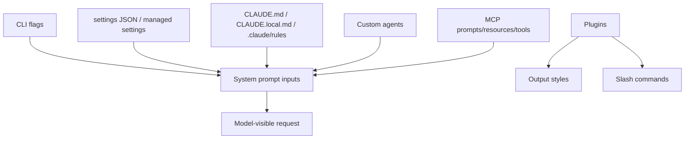
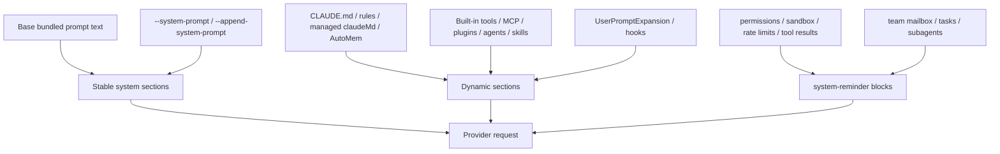

# Prompt, context, and memory

This page reverse-engineers the main sources that can become model-visible context in the Claude Code runtime.

## Source anchors

| Semantic alias | String or symbol | Meaning |
| --- | --- | --- |
| ManagedMemorySchema | `CLAUDE.md-style instructions injected as organization-managed memory` | Managed/policy memory schema surface. |
| MemoryPathResolver | `CLAUDE.local.md`, `CLAUDE.md` | Memory-file path resolver for local/project/managed scopes. |
| RuleMemoryLoader | `.claude/rules`, `CLAUDE.local.md` | Project/local rule and memory loading path. |
| SettingsOverlaySchema | `.claude/settings.json` | Settings schema mentions project/user overlay behavior. |
| SystemPromptOverrideFlag | `--system-prompt <prompt>` | Root flag replacing the system prompt for a session. |
| SystemPromptAppendFlag | `--append-system-prompt <prompt>` | Root flag appending to the default system prompt. |
| DynamicPromptBoundaryFlag | `--exclude-dynamic-system-prompt-sections` | Moves per-machine sections out of the system prompt. |
| AddDirectoryContextFlag | `--add-dir <directories...>` | Adds directories to tool/context access. |
| OutputStyleContext | `outputStyles` | Plugin/settings-provided output styles. |
| SlashCommandContext | `slashCommands` | Context accounting for loaded slash commands. |
| DynamicPromptBoundary | `__SYSTEM_PROMPT_DYNAMIC_BOUNDARY__` | Sentinel separating stable and dynamic system-prompt sections. |
| UserPromptExpansionHook | `UserPromptExpansion` | Hook/event surface for expanding a submitted user prompt. |
| PromptCacheMetadata | `cache_control` | Prompt-cache metadata stripping/hashing surface. |
| MemoryRelevancePrefixSkip | `skipSystemPromptPrefix` | Memory relevance calls can intentionally omit the normal system-prompt prefix. |
| ApiSystemMessageShape | `api_system`, `<system-reminder>` | Runtime extracts provider-system and reminder-style system messages. |
| SystemReminderWrapper | `N2()`, `kf5()`, `api_system` | Helper cluster that wraps system reminders and constructs API-system blocks. |
| TeamContextReminder | `team`, `mailbox`, `side-question` system reminders | Team/task context and side questions can be injected as reminder blocks. |

## Bundle module in `cli.renamed.js`

| Semantic alias | Loader line | Representative renamed exports | Atlas entry |
|---|---:|---|---|
| `MemoryFileRules` | 259680 | `processMemoryFile`, `processMdRules`, `processConditionedMdRules`, `isMemoryFilePath`, `isSyntheticMemoryPath`, `resetGetMemoryFilesCache`, `shouldShowClaudeMdExternalIncludesWarning`, `stripHtmlComments` | [Bundle module map — models, prompts, and memory](../99-research-atlas/module-map-from-renamed-cli.md#models-prompts-and-memory) |

## Context-source map

## Confirmed context families

| Family | Evidence | Runtime implication |
|---|---|---|
| Memory files | `CLAUDE.md`, `CLAUDE.local.md`, `.claude/rules` | Project, local, managed, and rule-file instructions can feed session context. |
| Managed memory | `claudeMd` settings schema text | Org-managed memory can inject `CLAUDE.md`-style instructions; managed/policy settings are treated specially. |
| Explicit system prompt | `--system-prompt`, `--system-prompt-file` | Can replace the session system prompt. |
| Appended system prompt | `--append-system-prompt`, `--append-system-prompt-file` | Adds to the default prompt rather than replacing it. |
| Dynamic prompt boundaries | `--exclude-dynamic-system-prompt-sections` | Separates per-machine data such as cwd/env/memory paths/git status from cache-sensitive system-prompt sections. |
| Additional directories | `--add-dir`, `/add-dir` strings | Adds tool-access roots and contributes workspace context. |
| Output styles | `outputStyles` schema | Plugins or settings can contribute output-style definitions. |
| Slash commands and skills | `slashCommands`, `skills`, `Skill` tool constant | Commands and skills are context and automation surfaces; they can also trigger tool/agent behavior. |
| Custom agents | `--agents <json>` | Session can receive custom agent definitions with descriptions/prompts/tools. |

## Prompt/template extraction catalog

[Prompt template catalog](prompt-template-catalog.md) now enumerates the long prompt/template-like literals extracted from `cli.renamed.js`. It groups matched surfaces into system/context/memory, tool descriptions and guards, slash-command or agent files, task/subagent prompts, MCP/plugin/hook prompts, security/permission prompts, structured-output prompts, and embedded SDK docs/skills.

The catalog records source anchors, byte offsets, hashes, and short previews for every matched candidate. It intentionally distinguishes static extraction from runtime prompt rendering: mode selection, settings, tool availability, MCP/plugin state, agent configuration, and template interpolation still decide which fragments are assembled for a specific session.

## Runtime system prompt assembly and dynamic injection

`cli.renamed.js` treats the system prompt as a layered request structure, not a single static string. The relevant runtime distinction is:

| Layer | Source examples | Dynamic? | Notes |
|---|---|---:|---|
| Base system instructions | Bundled prompt literals, default tool-use instructions, default behavior rules | Mostly stable | Can be replaced by `--system-prompt` or extended by `--append-system-prompt`. |
| User/org memory | `CLAUDE.md`, `CLAUDE.local.md`, `.claude/rules`, managed `claudeMd`, AutoMem | Semi-dynamic | Loaded from filesystem/settings and can change by project/session. |
| Tool and capability instructions | Built-in tools, MCP tools/prompts/resources, plugin output styles, custom agents/skills | Dynamic | Depends on enabled tools, MCP server availability, plugins, agents, and policy. |
| Runtime reminders | `<system-reminder>...</system-reminder>` blocks, permission/sandbox/tool warnings, rate-limit hints, memory-age hints | Dynamic | Injected around events rather than baked into the base prompt. |
| Team/task context | teammate mailbox, task notifications, subagent context, side-question reminders | Dynamic | Appears only when those runtime features are active. |
| Prompt expansion hooks | `UserPromptExpansion` hooks, slash commands, scheduled prompts | Dynamic | Can transform or add context to submitted user prompts. |

The `__SYSTEM_PROMPT_DYNAMIC_BOUNDARY__` sentinel and `--exclude-dynamic-system-prompt-sections` flag show that the runtime explicitly separates stable prompt sections from per-machine/per-session sections. This is important for provider prompt caching: stable sections can be cache-friendly while dynamic sections such as cwd, git state, memory paths, MCP state, and task context may be excluded or appended later.

### Provider-facing message shapes

The bundle contains two particularly useful message-shape anchors:

- `api_system`: provider-facing system blocks assembled by helper code around line ~5271-5273.
- `<system-reminder>...</system-reminder>`: model-visible reminder wrappers for runtime facts and warnings.

These wrappers appear in paths for memory age warnings, tool result reminders, GitHub rate-limit hints, team/mailbox context, side-question handling, and sandbox/permission guidance. They are the main dynamic-injection mechanism visible from static source: the runtime does not need to rewrite the base prompt to tell the model about a new runtime fact; it can add a reminder block or API-system block at the relevant turn.

### Dynamic prompt sources

## Can every prompt be expanded?

There are two different meanings of "expand every prompt":

| Goal | What is possible | Why |
|---|---|---|
| Enumerate static prompt-like literals embedded in `cli.renamed.js` | Yes, as a static documentation catalog. [Prompt template catalog](prompt-template-catalog.md) lists 330 prompt-like candidates for this build, with hashes/previews/anchors. The generated `prompt-catalog/` JSON artifacts and their helper script are no longer retained. | The readable bundle contains string/template literals that can be extracted without executing the runtime. |
| Produce the exact fully expanded provider prompt for all possible sessions | No, not statically and not globally. | The final request depends on runtime mode, cwd, settings precedence, memory files, MCP/plugin availability, agent definitions, tool visibility, hooks, task/team state, transcripts, permissions, sandbox state, auth/provider, and prompt-cache decisions. |
| Produce the exact prompt for one concrete session | In principle yes, with runtime instrumentation or a captured request for that specific session. | The assembler needs concrete runtime state and interpolated values. The current repository documents the static and source-level seams, not live request capture. |

So the accurate answer is: **all static prompt-like templates can be cataloged; a universal fully expanded runtime prompt cannot be precomputed from `cli.renamed.js` alone.**

## Concrete provider-request trace boundary

The runtime-prompt gap is now narrowed to one precise task: capture a single provider-facing request after runtime interpolation. Static source reading already identifies the boundary markers (`__SYSTEM_PROMPT_DYNAMIC_BOUNDARY__`, `--exclude-dynamic-system-prompt-sections`, `api_system`, and `<system-reminder>`), but those markers do not by themselves produce the final request body.

| Trace step | What must be fixed for the run | Why it matters |
|---|---|---|
| Mode and flags | Interactive/headless, `--system-prompt`, `--append-system-prompt`, `--exclude-dynamic-system-prompt-sections`, `--add-dir`, model/provider flags | These decide whether base prompt text is replaced, extended, or split into dynamic sections. |
| Settings and policy | User/project/local/managed settings, `enabledPlugins`, `mcpServers`, output styles, hooks, tool allow/deny settings | These decide available capabilities and policy-injected context. |
| Filesystem context | cwd, git state, `CLAUDE.md`, `.claude/rules`, memory paths, added directories | These provide the dynamic sections that cannot be reconstructed from `cli.renamed.js` alone. |
| Runtime capability state | Enabled built-in tools, MCP tools/prompts/resources, plugin contributions, skills, agents, task state | Tool schemas and capability instructions are request-level structures, not only prompt prose. |
| Transcript/session state | Current transcript, compaction state, reminders, sidechain/subagent context | The same static templates can render differently depending on turn history. |
| Provider boundary | Captured message array, `api_system` blocks, `<system-reminder>` blocks, tool schema array, cache metadata | This is the first point where the concrete request can be compared against the static catalog. |

No captured provider request is committed in this repository yet. A future trace should record the exact invocation, settings files, enabled integrations, sanitized request envelope, and source anchors used to interpret each dynamic section.

## Runtime interpretation

`cli.renamed.js` treats context as layered state rather than a single prompt string. Command-line flags can override or append prompt material, while settings, plugin payloads, `CLAUDE.md` files, rules directories, slash commands, skills, tools, MCP, and agents contribute runtime-visible structures that are later assembled into the request.

The `--exclude-dynamic-system-prompt-sections` flag is a particularly useful anchor: it shows that the runtime distinguishes stable prompt content from machine-specific sections such as current directory, environment info, memory paths, and git status.

## File suggestion engine (@-mention completion)

When the user types `@` in the input, the runtime builds completion candidates from the workspace via `generateFileSuggestions` ([cli.renamed.js line 517105](../../claude-code-pkg/src/entrypoints/cli.renamed.js#L517105)). The function is a layered fast-path:

1. **Remote-mode bypass** — `getIsRemoteMode()` short-circuits to an RPC: `sendControlRequest({ subtype: "file_suggestions", query })`. The host process owns the index when Claude Code runs through Remote Control / teleport.
2. **Custom command override** — when `getInitialSettings().fileSuggestion?.type === "command"` (or `policySettings.fileSuggestion` under enterprise lockdown), `executeFileSuggestionCommand` runs the operator-defined shell command with a 5,000 ms cap and the standard hook input shape, slicing the first `BC6 = 15` results.
3. **Empty / `.` / `./` query** — returns the cwd listing directly and kicks off a background cache refresh (`startBackgroundCacheRefresh(globalFileIndexCache)`).
4. **Normal query** — strips a leading `./`, expands `~`, runs the in-memory fuzzy matcher against `H.fileIndex`, and emits a `tengu_file_suggestions_query` event with `duration_ms`, `result_count`, `query_length`, and a `cache_hit` flag.

The shared `globalFileIndexCache` ([line 516677](../../claude-code-pkg/src/entrypoints/cli.renamed.js#L516677)) is rebuilt by `resetFileIndexCache`: `git ls-files` provides tracked files first, ripgrep is the fallback for non-git workspaces, and untracked files arrive on a background pass. Debug strings (`[FileIndex] git ls-files: N tracked files in Xms`, `[FileIndex] applied ignore patterns: A -> B files`) make the layered fetch visible under `--debug`.

The matcher's output is fed into `applyFileSuggestion` ([line 517159](../../claude-code-pkg/src/entrypoints/cli.renamed.js#L517159)), which replaces the trigger token in the buffer, updates the caret to the end of the inserted text, and returns the new buffer to the input controller. The SDK exposes the same hook via `onFileSuggestions(callback)`; without the callback, the SDK refuses with `"file_suggestions is not supported in this context"`.

## Caveats

- This page identifies major prompt/context sources, not every prompt template embedded in the bundle.
- Some hits are schema or accounting surfaces; behavior is confirmed when those strings connect to root flags, settings load, or runtime setup paths.

## Related docs

- [Models, providers, and auth](models-providers-auth.md)
- [Prompt assembly scenarios](prompt-assembly-scenarios.md)
- [Context, memory, compaction, checkpoints, and rewind](context-memory-compaction-checkpoints.md)
- [Prompt template catalog](prompt-template-catalog.md)
- [Built-in tools and permissions](../03-tools-integrations-security/built-in-tools-and-permissions.md)
- [Agents, tasks, and subagents](../06-agents-automation/agents-tasks-and-subagents.md)
