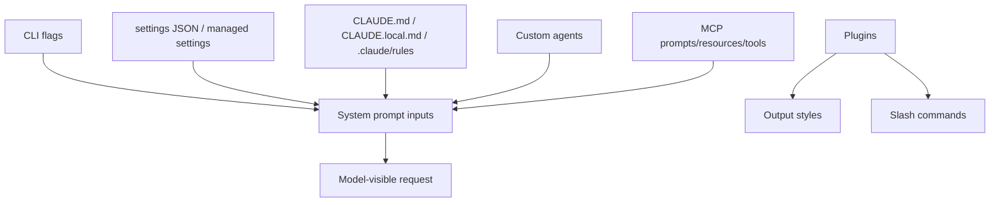
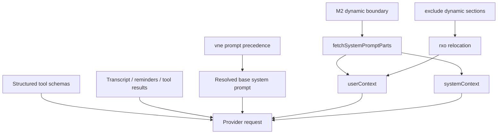

# Prompt, context, and memory

This page reverse-engineers the main sources that can become model-visible context in the Claude Code runtime.

## Source anchors

| Semantic alias | String or symbol | Meaning |
| --- | --- | --- |
| ManagedMemorySchema | `CLAUDE.md-style instructions injected as organization-managed memory` | Managed/policy memory schema surface. |
| MemoryPathResolver | `getMemoryPath()` | Resolves user, local, project, managed, and AutoMem roots. |
| RuleMemoryLoader | `RD`, `Ace()`, `dHt()` | Loads memory files, includes, and conditioned or unconditional rules. |
| AutoMemoryNormalizer | `qAg()` / `VAg()` → `N4r()` | Normalizes AutoMem content before it becomes a memory entry. |
| MemoryRelevanceSelector | `Izy()`, `Select memories relevant to:` | Separate structured helper request that selects candidate memory files. |
| SettingsOverlaySchema | `.claude/settings.json` | Settings schema mentions project/user overlay behavior. |
| SystemPromptOverrideFlag | `--system-prompt <prompt>` | Root flag replacing the system prompt for a session. |
| SystemPromptAppendFlag | `--append-system-prompt <prompt>` | Root flag appending to the default system prompt. |
| DynamicPromptBoundaryFlag | `--exclude-dynamic-system-prompt-sections` | Moves per-machine sections out of the system prompt. |
| SystemPromptResolver | `vne()` | Resolves total override, coordinator, agent, custom/default base, and append precedence. |
| PromptPartsResolver | `fetchSystemPromptParts()` | Produces separate default-system, user-context, and system-context inputs. |
| DefaultPromptBuilder | `M2()` | Builds default prompt fragments and can omit dynamic sections. |
| AddDirectoryContextFlag | `--add-dir <directories...>` | Adds directories to tool/context access. |
| OutputStyleContext | `outputStyles` | Plugin/settings-provided output styles. |
| SlashCommandContext | `slashCommands` | Context accounting for loaded slash commands. |
| DynamicPromptBoundary | `SYSTEM_PROMPT_DYNAMIC_BOUNDARY` / `__SYSTEM_PROMPT_DYNAMIC_BOUNDARY__` | Sentinel separating stable and relocatable default-prompt sections. |
| UserPromptExpansionHook | `UserPromptExpansion` | Hook/event surface for expanding a submitted user prompt. |
| PromptCacheMetadata | `cache_control` | Prompt-cache metadata stripping/hashing surface. |
| MemoryRelevancePrefixSkip | `Izy()` with `skipSystemPromptPrefix: true` | Memory relevance intentionally omits the normal system-prompt prefix. |
| ApiSystemMessageShape | `api_system`, `<system-reminder>` | Runtime extracts provider-system and reminder-style system messages. |
| TeamContextReminder | `team`, `mailbox`, `side-question` system reminders | Team/task context and side questions can be injected as reminder blocks. |
| FileIndexCache | `createFileIndexCache()`, `resetFileIndexCache()` | Session-scoped cache state and generation invalidation. |
| FileIndexRefresh | `startBackgroundCacheRefresh()`, `getPathsForSuggestions()` | Freshness checks and asynchronous tracked/config path indexing. |
| FileSuggestions | `generateFileSuggestions()`, `applyFileSuggestion()` | Local/remote/custom suggestion production and input replacement. |

## Current implementation clusters in `cli.renamed.js`

| Mechanism | Approximate retained-source region | Representative anchors |
|---|---:|---|
| Memory files and rules | `266,800–267,500` | `qAg()`, `Ace()`, `dHt()`, cached loader `RD` |
| File-suggestion index | `498,115–498,703` | `createFileIndexCache()`, `startBackgroundCacheRefresh()`, `generateFileSuggestions()` |
| Prompt-part partition | `563,486` | `fetchSystemPromptParts()` |
| Default prompt and dynamic boundary | `568,000–569,000` | `M2()`, `SYSTEM_PROMPT_DYNAMIC_BOUNDARY` |
| Memory relevance selection | `571,261` | `Izy()` |
| Memory path roots | `595,046` | `getMemoryPath()` |

These line ranges identify Claude Code `2.1.215`; use the enclosing function names and literals when comparing another build. See the [bundle module map](../99-research-atlas/module-map-from-renamed-cli.md#models-prompts-and-memory) for the broader module inventory.

## Context-source map

```mermaid
flowchart TD
    Args[CLI flags] --> Prompt[System prompt inputs]
    Settings[settings JSON / managed settings] --> Prompt
    ClaudeMd[CLAUDE.md / CLAUDE.local.md / .claude/rules] --> Prompt
    Plugins[Plugins] --> OutputStyles[Output styles]
    Plugins --> Slash[Slash commands]
    Agents[Custom agents] --> Prompt
    MCP[MCP prompts/resources/tools] --> Prompt
    Prompt --> Request[Model-visible request]
```

## Confirmed context families

| Family | Evidence | Runtime implication |
|---|---|---|
| Memory files | `CLAUDE.md`, `CLAUDE.local.md`, `.claude/rules` | Project, local, managed, and rule-file instructions can feed session context. |
| Managed memory | `claudeMd` settings schema text | Org-managed memory can inject `CLAUDE.md`-style instructions; managed/policy settings are treated specially. |
| Explicit system prompt | `--system-prompt`, `--system-prompt-file` | Can replace the session system prompt. |
| Appended system prompt | `--append-system-prompt`, `--append-system-prompt-file` | Adds to the default prompt rather than replacing it. |
| Dynamic prompt boundaries | `--exclude-dynamic-system-prompt-sections` | Separates per-machine data such as cwd/env/memory paths/git status from cache-sensitive system-prompt sections. |
| Additional directories | `--add-dir`, `/add-dir` strings | Adds tool-access roots and contributes workspace context. |
| Output styles | `outputStyles` schema | Plugins or settings can contribute output-style definitions. |
| Slash commands and skills | `slashCommands`, `skills`, `Skill` tool constant | Commands and skills are context and automation surfaces; they can also trigger tool/agent behavior. |
| Custom agents | `--agents <json>` | Session can receive custom agent definitions with descriptions/prompts/tools. |

## Prompt/template extraction catalog

[Prompt template catalog](prompt-template-catalog.md) now enumerates the long prompt/template-like literals extracted from `cli.renamed.js`. It groups matched surfaces into system/context/memory, tool descriptions and guards, slash-command or agent files, task/subagent prompts, MCP/plugin/hook prompts, security/permission prompts, structured-output prompts, and embedded SDK docs/skills.

The catalog records source anchors, byte offsets, hashes, and short previews for every matched candidate. It intentionally distinguishes static extraction from runtime prompt rendering: mode selection, settings, tool availability, MCP/plugin state, agent configuration, and template interpolation still decide which fragments are assembled for a specific session.

## Runtime system prompt assembly and dynamic injection

`cli.renamed.js` does not flatten every context source into one system string. Two adjacent mechanisms matter:

1. `vne()` resolves which base system-prompt text wins: total override, coordinator prompt, agent replacement/append, custom/default base, then ordinary append where applicable.
2. `fetchSystemPromptParts()` independently returns `defaultSystemPrompt`, `userContext`, and `systemContext`; structured tool definitions remain another request field.

The relevant runtime distinction is therefore:

| Request part | Source examples | Notes |
|---|---|---|
| Resolved base system prompt | `vne()`, default fragments from `M2()`, custom/agent/coordinator text, append text | Total override returns before ordinary append. A custom prompt suppresses default-prompt generation in `fetchSystemPromptParts()`. |
| `userContext` | `Jw()` plus relocated dynamic sections when exclusion is enabled | Separate from the base system-prompt array even though its contents can be model-visible instructions/reminders. |
| `systemContext` | `ux(cacheBreakerPhrase)` in the ordinary path | Returned separately; with dynamic-section exclusion it becomes `{}` and its relevant material is merged into `userContext`. |
| Structured tools | Built-in, deferred, and MCP tool schemas selected by runtime state | Request-level structures, not prompt prose. Tool-related prose or deltas can additionally appear in context attachments. |
| Turn messages and reminders | Transcript, tool results, `<system-reminder>` wrappers, team/task notifications, prompt expansion output | Arrive through message/context paths rather than by rewriting the static base prompt. |

`M2()` emits `SYSTEM_PROMPT_DYNAMIC_BOUNDARY` within the default prompt and can omit the following dynamic fragments. When `--exclude-dynamic-system-prompt-sections` is active **and no custom system prompt is supplied**, `fetchSystemPromptParts()` obtains replacement material through `rxo()`, merges it with the ordinary user and system context into `userContext`, and returns an empty `systemContext`. The sections are relocated, not simply dropped or appended to the end of the same system array.

With a custom prompt, default-prompt generation and ordinary `systemContext` loading are skipped. `fetchSystemPromptParts()` still returns ordinary `userContext`; the precise base/append ordering remains `vne()`'s responsibility. See [Prompt assembly scenarios](prompt-assembly-scenarios.md) for the branch matrix.

### Provider-facing message shapes

The bundle contains two particularly useful message-shape anchors:

- `api_system`: provider-facing system-message records assembled by helper paths.
- `<system-reminder>...</system-reminder>`: model-visible reminder wrappers for runtime facts and warnings.

These wrappers appear in paths for memory, tool-result, team/mailbox, side-question, sandbox, and permission context. They are dynamic message/context mechanisms, but not every dynamic source uses the same wrapper and neither wrapper should be equated with `systemContext`. The runtime can add turn-scoped facts without rebuilding the resolved base prompt.

### Dynamic prompt sources

```mermaid
flowchart TD
    Resolver[vne prompt precedence] --> Base[Resolved base system prompt]
    Parts[fetchSystemPromptParts] --> User[userContext]
    Parts --> System[systemContext]
    Boundary[M2 dynamic boundary] --> Parts
    Exclude[exclude dynamic sections] --> Relocate[rxo relocation]
    Relocate --> User
    Tools[Structured tool schemas] --> Request[Provider request]
    Transcript[Transcript / reminders / tool results] --> Request
    Base --> Request
    User --> Request
    System --> Request
```

## Can every prompt be expanded?

There are two different meanings of "expand every prompt":

| Goal | What is possible | Why |
|---|---|---|
| Enumerate static prompt-like literals embedded in `cli.renamed.js` | Yes, as a static documentation catalog. [Prompt template catalog](prompt-template-catalog.md) records 228,539 scanned literals and 1,940 retained candidates for this build, with hashes, previews, and anchors. Machine-readable data is retained at [`docs/99-research-atlas/data/prompt-catalog.json`](../99-research-atlas/data/prompt-catalog.json) and regenerated by [`scripts/extract-prompt-catalog.mjs`](../../scripts/extract-prompt-catalog.mjs). | The readable bundle contains string/template literals that can be extracted without executing the runtime. |
| Produce the exact fully expanded provider prompt for all possible sessions | No, not statically and not globally. | The final request depends on runtime mode, cwd, settings precedence, memory files, MCP/plugin availability, agent definitions, tool visibility, hooks, task/team state, transcripts, permissions, sandbox state, auth/provider, and prompt-cache decisions. |
| Produce the exact prompt for one concrete session | In principle yes, with runtime instrumentation or a captured request for that specific session. | The assembler needs concrete runtime state and interpolated values. The current repository documents the static and source-level seams, not live request capture. |

So the accurate answer is: **all static prompt-like templates can be cataloged; a universal fully expanded runtime prompt cannot be precomputed from `cli.renamed.js` alone.**

## Concrete provider-request trace boundary

The runtime-prompt gap is now narrowed to one precise task: capture a single provider-facing request after runtime interpolation. Static source reading already identifies the base resolver (`vne()`), request partition (`fetchSystemPromptParts()`), dynamic boundary/relocation (`M2()`/`rxo()`), `api_system`, and `<system-reminder>` records, but those mechanisms do not by themselves produce the final request body.

| Trace step | What must be fixed for the run | Why it matters |
|---|---|---|
| Mode and flags | Interactive/headless, `--system-prompt`, `--append-system-prompt`, `--exclude-dynamic-system-prompt-sections`, `--add-dir`, model/provider flags | These decide whether base prompt text is replaced, extended, or split into dynamic sections. |
| Settings and policy | User/project/local/managed settings, `enabledPlugins`, `mcpServers`, output styles, hooks, tool allow/deny settings | These decide available capabilities and policy-injected context. |
| Filesystem context | cwd, git state, `CLAUDE.md`, `.claude/rules`, memory paths, added directories | These provide the dynamic sections that cannot be reconstructed from `cli.renamed.js` alone. |
| Runtime capability state | Enabled built-in tools, MCP tools/prompts/resources, plugin contributions, skills, agents, task state | Tool schemas and capability instructions are request-level structures, not only prompt prose. |
| Transcript/session state | Current transcript, compaction state, reminders, sidechain/subagent context | The same static templates can render differently depending on turn history. |
| Provider boundary | Captured resolved system array, `userContext`, `systemContext`, message array, tool schema array, and cache metadata | This is the first point where the concrete request can be compared against the static catalog. |

No captured provider request is committed in this repository yet. A future trace should record the exact invocation, settings files, enabled integrations, sanitized request envelope, and source anchors used to interpret each dynamic section.

## Runtime interpretation

`cli.renamed.js` treats context as layered state rather than a single prompt string. Command-line flags and agent/coordinator state resolve base prompt text, while settings, plugin payloads, `CLAUDE.md` files, rules directories, slash commands, skills, tools, MCP, and tasks contribute `userContext`, `systemContext`, structured tools, attachments, or turn messages.

The `--exclude-dynamic-system-prompt-sections` flag is a particularly useful anchor: it shows that the runtime distinguishes stable default-prompt content from relocatable machine/session-specific material. The exact concrete contents remain runtime-dependent; source confirms the relocation pipeline, not one universal rendered payload.

## File suggestion engine (@-mention completion)

When the user types `@`, `generateFileSuggestions()` chooses one of three producer lanes. Local and command-backed producers cap their result at 15; the remote client maps the host response without applying an additional client-side cap:

| Lane | Gate | Behavior |
|---|---|---|
| Remote control | Remote mode, with a query or explicit invocation | Sends `sendControlRequest({subtype: "file_suggestions", query})`; the remote host returns `{path, score}` suggestions. RPC failure is logged and becomes an empty list. |
| Operator command | Resolved `fileSuggestion.type === "command"` | Runs the configured suggestion command with base hook input plus `query`, then maps the first 15 strings into suggestion records. Policy resolution for the command is handled before this function. |
| Local index | Ordinary local mode | Uses the current directory for empty/`.`/`./` input, otherwise searches a progressively built in-memory index; both paths request at most 15 records. |

With no query and no explicit invocation, local and remote paths return no suggestions rather than scanning eagerly. For an empty/`.`/`./` query, the local lane immediately lists the current directory and starts index refresh in the background. For a normal query it removes a leading `./`, expands `~`, starts or reuses refresh, and searches whatever portion of the index is currently queryable. This is why telemetry can call a response `partial`: foreground completion does not wait for the whole workspace scan.

### Cache construction and freshness

`createFileIndexCache()` creates more than a path array. It tracks the fuzzy index, in-flight tracked and untracked work, a `cacheGeneration`, tracked/config/directory lists, ignore-pattern cache, path signatures, last refresh/scan timing, last `.git/index` mtime, and an index-build completion signal.

`startBackgroundCacheRefresh()` suppresses duplicate work and normally treats an existing index as fresh for **five seconds**. A changed `.git/index` mtime bypasses that freshness interval. In a non-Git workspace, if the previous scan took more than one second, later refreshes are suppressed for that cache instance to avoid repeatedly paying for an expensive scan.

The tracked/config phase is:

1. Use `git -c core.quotepath=false ls-files --recurse-submodules` from the repository root, with a five-second timeout.
2. Normalize repository-relative paths to the current working directory.
3. Load `.ignore` and `.rgignore` from the repository root and cwd, cache the resulting matcher, and apply it to tracked paths.
4. If Git is unavailable or the command fails, fall back to ripgrep `--files --follow --hidden` while excluding VCS metadata directories. `respectGitignore` controls whether the fallback adds `--no-ignore-vcs`.
5. Add paths discovered from the configured project-file providers, derive parent directory candidates, and asynchronously build a fuzzy index. Path signatures avoid rebuilding when the effective tracked set is unchanged.

After a successful Git tracked scan, `PTy()` starts a separate ten-second `git ls-files --others` pass. It optionally respects standard excludes, normalizes and filters the result, derives untracked directories, and rebuilds the index from tracked files, configuration files, tracked directories, untracked files, and untracked directories. Thus untracked files can appear after the first query has already returned.

### Stale-result defenses and reset

Every reset increments `cacheGeneration`. The tracked scan, untracked scan, and cooperative async fuzzy-index build capture a generation and decline to commit stale state if the cache was reset mid-flight. The index builder also has its own `buildGen`, so a superseded asynchronous build stops indexing rather than overwriting a newer path set.

`resetFileIndexCache()` clears all index, signatures, ignore, timing, and in-flight references. `clearSessionCaches()` invokes it during conversation/session cache clearing, which prevents suggestions collected for an old cwd/session state from silently becoming the next session's index.

### Matching and insertion

The local matcher searches only `readyCount`, so a cooperative build can become queryable before it is complete. It prefilters lowercase character sets, scores ordered character matches with bonuses for path boundaries and camel-case transitions, mildly favors shorter paths, and returns at most 15 records. Top-level directory suggestions are cached for empty fuzzy queries; direct empty-input completion still uses the current-directory listing fast path.

`applyFileSuggestion()` replaces the partial token at its recorded start offset, moves the caret to the end of the inserted path, and returns the new input buffer. The SDK exposes host-provided completion through `onFileSuggestions(callback)`; when that callback is absent, a control request receives `file_suggestions is not supported in this context (onFileSuggestions callback not registered)` rather than falling back to an SDK-side filesystem scan.

## Caveats

- This page identifies major prompt/context sources, not every prompt template embedded in the bundle.
- Some hits are schema or accounting surfaces; behavior is confirmed when those strings connect to root flags, settings load, or runtime setup paths.

## Related docs

- [Models, providers, and auth](models-providers-auth.md)
- [Prompt assembly scenarios](prompt-assembly-scenarios.md)
- [Context, memory, compaction, checkpoints, and rewind](context-memory-compaction-checkpoints.md)
- [Prompt template catalog](prompt-template-catalog.md)
- [Built-in tools and permissions](../03-tools-integrations-security/built-in-tools-and-permissions.md)
- [Agents, tasks, and subagents](../06-agents-automation/agents-tasks-and-subagents.md)
