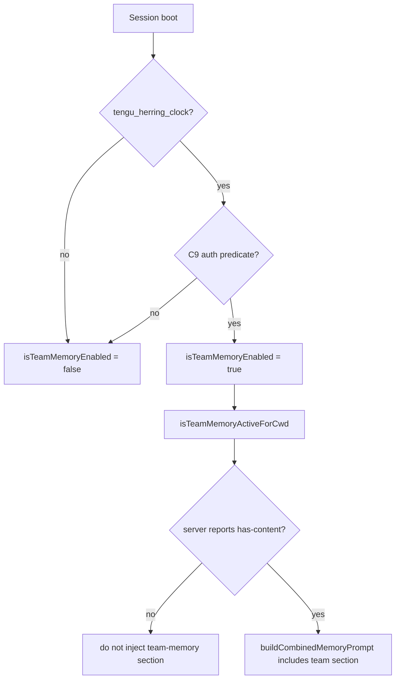

# Team memory

Team Memory is a separate shared-knowledge layer that lives alongside the personal `CLAUDE.md` / memory files. It is gated by the `tengu_herring_clock` GrowthBook feature and the existence of a team-memory directory under the active session's config root. This page documents the runtime: path resolution, path-traversal protection, write-path validation, search/edit detection, and the combined prompt assembly.

Use this page alongside:

- [Prompt, context, and memory](prompt-context-memory.md) for the personal `CLAUDE.md` / memory files this layer composes with.
- [Built-in tools and permissions](../03-tools-integrations-security/built-in-tools-and-permissions.md) for the Read/Write tools that touch team-memory paths.
- [Feature gates reference](../05-hosted-agent-ops/feature-gates-reference.md) for `tengu_herring_clock` and related auth gates.

## Source anchors

| Semantic alias | String or symbol | Meaning |
| --- | --- | --- |
| TeamMemoryGate | `function isTeamMemoryEnabled()` | `C9() && tengu_herring_clock` GrowthBook feature; the master enable for the whole subsystem. |
| TeamMemoryPath | `function getTeamMemPath()` | Returns `<UY()>/team/` (NFC-normalized) — the canonical team-memory directory. |
| TeamMemoryActiveProbe | `function isTeamMemoryActiveForCwd()` | True only when the subsystem is enabled AND the team-memory server reports `"has-content"`. |
| TeamMemFilePredicate | `function isTeamMemFile(filePath)` | True when the path is under the team-memory directory AND `isTeamMemoryEnabled()`. |
| TeamMemPathPredicate | `function isTeamMemPath(filePath)` | True when `path.resolve(filePath)` is under `getTeamMemPath()` (does not check the gate). |
| TeamMemKeyValidator | `async function validateTeamMemKey(key)` | Sanitizes a key, joins it under the team-memory dir, then runs symlink-aware containment check. Throws `PathTraversalError` on any escape. |
| TeamMemWritePathValidator | `async function validateTeamMemWritePath(absolutePath)` | Same containment check for absolute paths supplied by the model. Throws `PathTraversalError` on null bytes or path escapes. |
| PathTraversalError | `class PathTraversalError extends Error` | Single error class raised by every validation helper; `error.name === "PathTraversalError"`. |
| KeySanitizer | `function uR1(key)` | Rejects null bytes, Unicode-normalized traversal, backslashes, and absolute path keys before the per-call check. |
| TeamMemorySearchPredicate | `function isTeamMemorySearch(toolUse)` | True when the model's tool call is a search (Grep/Glob) against the team-memory dir. |
| TeamMemoryEditPredicate | `function isTeamMemoryWriteOrEdit(toolUse, allowedTools)` | True for `Write` / `Edit` / `NotebookEdit` calls targeting the team-memory dir. |
| TeamMemorySummaryAppender | `function appendTeamMemorySummaryParts(parts, toolUse, allowedTools)` | Builds the per-tool-call summary line about which team-memory files were touched. |
| CombinedMemoryPromptBuilder | `function buildCombinedMemoryPrompt(individualMemoryFiles, includeHowToSave = false)` | Stitches the user's personal CLAUDE.md/memory files together with the team-memory directory listing. |

## Bundle modules in `cli.renamed.js`

| Semantic alias | Loader line(s) | Representative renamed exports | Atlas entry |
|---|---:|---|---|
| `TeamMemoryPaths` | 171560 | `isTeamMemoryEnabled`, `getTeamMemPath`, `isTeamMemoryActiveForCwd`, `isTeamMemPath`, `validateTeamMemWritePath`, `validateTeamMemKey`, `isTeamMemFile`, `PathTraversalError` | [Bundle module map — models, prompts, and memory](../99-research-atlas/module-map-from-renamed-cli.md#models-prompts-and-memory) |
| `TeamMemoryToolSummary` | 498757 | `isTeamMemorySearch`, `isTeamMemoryWriteOrEdit`, `appendTeamMemorySummaryParts` | [Bundle module map — models, prompts, and memory](../99-research-atlas/module-map-from-renamed-cli.md#models-prompts-and-memory) |

## How the gate is checked



`isTeamMemoryEnabled()` is the synchronous gate; it reads the `tengu_herring_clock` feature value via `getFeatureValue_CACHED_MAY_BE_STALE` so it is safe to call on the hot path. `isTeamMemoryActiveForCwd()` adds the server-side check via `getTeamMemoryServerStatus()` — the prompt-builder only injects the team-memory section when the server has actually published content for the current cwd.

The personal memory files (`CLAUDE.md` etc.) are unaffected by these gates and always loaded via the regular `MemoryFileRules` path described in [Prompt, context, and memory](prompt-context-memory.md).

## Directory layout

```
<UY()>/                       # config root: ~/.claude or $CLAUDE_CONFIG_DIR
└── team/                     # getTeamMemPath()
    ├── notes/...
    ├── decisions/...
    └── ...
```

The trailing `/` is intentional: `getTeamMemPath()` normalises to `<UY()>/team` + `path.sep` so substring containment checks (`absolutePath.startsWith(teamMemPath)`) work without false matches on sibling directories like `<UY()>/team-old/`.

The whole path is NFC-normalised so unicode-equivalent path keys produce the same containment result regardless of input form.

## Path-traversal protection

The team-memory layer is the only path-restricted Read/Write surface in Claude Code. Three layers protect it:

### Layer 1: `uR1(key)` key sanitizer

`uR1(key)`:

- Throws `PathTraversalError("Null byte in path key")` if the key contains `\0`.
- Throws `PathTraversalError("Unicode-normalized traversal in path key")` if NFC-normalising the key surfaces a traversal segment that wasn't present in the raw text.
- Throws `PathTraversalError("Backslash in path key")` — the runtime is POSIX-rooted; backslashes are never path separators here.
- Throws `PathTraversalError("Absolute path key")` if the key starts with `/`.

### Layer 2: `validateTeamMemKey(key)`

After `uR1(key)`, the function joins the key under `getTeamMemPath()` and runs `path.resolve(...)`. If the resolved path does not start with the team-memory root, it throws `PathTraversalError("Key escapes team memory directory")`.

### Layer 3: Symlink-aware containment via `fvK(...)` + `OvK(...)`

`fvK(path)` walks up the path tree, calling `fs.realpath(...)` on each ancestor:

- On `ENOENT` (path doesn't exist), it explicitly checks for `isSymbolicLink()` on the last component and throws `PathTraversalError("Dangling symlink detected")` if the target is missing.
- On `ELOOP`, throws `PathTraversalError("Symlink loop detected in path")`.
- On unhandled errno (`ENOTDIR`, `ENAMETOOLONG` ignored; anything else), throws `PathTraversalError("Cannot verify path containment (<errno>): ...")`.

`OvK(resolvedPath)` then checks whether the realpath of the team-memory root is a prefix of the resolved path. If not (or if the team-memory root resolution fails non-recoverably), the validator throws `PathTraversalError("...escapes team memory directory via symlink")`.

Putting it together, `validateTeamMemKey(key)` and `validateTeamMemWritePath(absolutePath)` both guarantee that the final path:

- Has no null bytes or unicode normalization tricks.
- Resolves (with symlinks fully expanded) to a location strictly under the team-memory directory.
- Has no symlink chain that escapes the directory.

These are the only entrypoints the rest of the runtime uses to materialize a team-memory file path before any I/O.

## Tool-call detection

Two helpers tag each tool call by its relationship with team memory:

| Predicate | Matches |
|---|---|
| `isTeamMemorySearch(toolUse)` | `Grep` / `Glob` (or compatible) calls whose target path is under the team-memory directory. |
| `isTeamMemoryWriteOrEdit(toolUse, allowedTools)` | `Write` / `Edit` / `NotebookEdit` calls whose target path is under the team-memory directory, scoped by the allow-list. |

These are used by the post-turn summary to surface what changed in team memory ("Edited team/notes/foo.md", "Searched team/decisions/...").

`appendTeamMemorySummaryParts(parts, toolUse, allowedTools)` is the formatter that builds the human-readable summary line for the UI — it appends entries to `parts` rather than returning a string so the caller can compose multiple tool-uses into one summary block.

## Combined prompt assembly

`buildCombinedMemoryPrompt(individualMemoryFiles, includeHowToSave = false)` produces the combined memory block injected into the system prompt:

1. Reads the user config root (`UY()`) and the team-memory root (`getTeamMemPath()`).
2. When `includeHowToSave` is true, prepends a "## How to save memories" section pointing the model at the team-memory directory.
3. Composes the individual memory files (already loaded by the `MemoryFileRules` path) and the team-memory listing into one block.

The composition is opt-in per turn — the prompt assembler decides whether to call this builder based on the current model loop's needs. When team memory is disabled, `getTeamMemPath()` still resolves and the helper still composes, but the team section is empty.

## Why team memory is a separate layer

The personal memory (`CLAUDE.md`, `.claude/memory/*.md`) is governed by [`MemoryFileRules`](prompt-context-memory.md) and shows the contents inline. Team memory is referenced by path only — the model sees the directory listing in the system prompt and then loads individual files through the `Read` tool (subject to the layer-2/layer-3 validators above).

This split has three concrete consequences:

- **Token cost** — team memory does not balloon the system prompt; only file names appear.
- **Per-call validation** — every read/write goes through `validateTeamMemKey`/`validateTeamMemWritePath`, so the model cannot trick the tool layer into touching a sibling directory via traversal.
- **Auth-gated** — the `tengu_herring_clock` feature flag plus the auth predicate `C9()` mean the layer is fully off unless the operator opts in.

## Caveats

- `PathTraversalError` is the only error class used; surface it in error logs but do not swap it for generic `Error` — the daemon and analytics pipelines key off the name.
- `isTeamMemPath(...)` does not check the gate; the runtime callers always combine it with `isTeamMemoryEnabled()` (which is exactly what `isTeamMemFile(...)` does).
- The realpath probe (`fvK`) caches nothing and runs synchronously per call; for path-heavy operations the runtime debounces or batches checks at the tool layer.

## Related docs

- [Prompt, context, and memory](prompt-context-memory.md)
- [Built-in tools and permissions](../03-tools-integrations-security/built-in-tools-and-permissions.md)
- [Feature gates reference](../05-hosted-agent-ops/feature-gates-reference.md)
- [Bundle module map](../99-research-atlas/module-map-from-renamed-cli.md)
