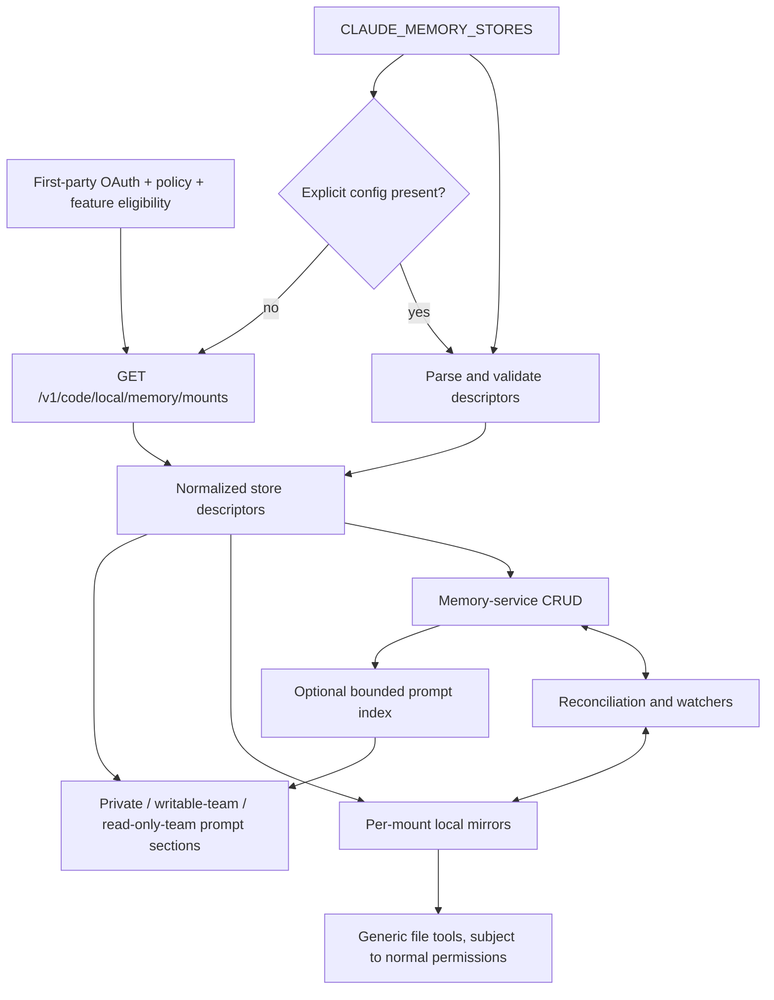

# Team memory

Team memory is a multi-store shared-knowledge subsystem alongside personal `CLAUDE.md`, rules, and auto-memory. In Claude Code `2.1.215`, the client either parses explicit store descriptors from `CLAUDE_MEMORY_STORES` or conditionally discovers organization-provided mounts. It then exposes each store through a per-mount local mirror, synchronizes that mirror with a memory-service backend, and can add a bounded store index to the model prompt.

This is not one canonical `<config>/team/` directory behind a single feature flag. Configuration, service I/O, local synchronization, prompt exposure, and path safety are separate planes with different failure behavior.

Use this page alongside:

- [Prompt, context, and memory](prompt-context-memory.md) for personal/project memory and the surrounding prompt layers.
- [Models, providers, and auth](models-providers-auth.md) for the first-party OAuth conditions used by organization discovery.
- [Built-in tools and permissions](../03-tools-integrations-security/built-in-tools-and-permissions.md) for generic file-tool authorization, which remains distinct from memory-store validation.

## Source anchors

| Semantic alias | String or symbol | Meaning |
| --- | --- | --- |
| ExplicitStoreConfig | `CLAUDE_MEMORY_STORES`, `L4i()`, `N7h()` | Parses and validates explicit store descriptors. |
| OrganizationMountDiscovery | `/v1/code/local/memory/mounts` | Fetches organization-provided mounts when first-party OAuth, policy, and feature conditions allow it. |
| StoreDescriptor | `path`, `mode`, `scope`, `mount`, `promptIndex`, `promptIndexMaxBytes` | Client-side store shape and prompt-index controls. |
| TeamMirrorRoot | `ER()` | Resolves the local team-memory mirror root below the auto-memory root. |
| SyncManifest | `.memory-sync` | Per-mount synchronization metadata used to reconcile local and remote state. |
| MemoryKeyValidator | `yji()` | Rejects unsafe service keys before they are mapped into a mirror. |
| MirrorContainmentValidator | `o4c()` | Checks local containment, including symlink escape. |
| PromptIndexFetch | `promptIndex`, `<memory>` | Fetches bounded index content and treats it as untrusted reference data. |

The principal implementation is near [`cli.renamed.js` lines 190175–194000](../../claude-code-pkg/src/entrypoints/cli.renamed.js#L190175); synchronization and watcher paths are near [lines 436000–439214](../../claude-code-pkg/src/entrypoints/cli.renamed.js#L436000). Minified aliases are version-specific; exact strings and descriptor fields are the more durable anchors.

## Architecture


```mermaid
flowchart TD
    Explicit[CLAUDE_MEMORY_STORES] --> Parse[Parse and validate descriptors]
    Eligible[First-party OAuth + policy + feature eligibility] --> Discover[GET /v1/code/local/memory/mounts]
    Explicit --> Choice{Explicit config present?}
    Choice -->|yes| Parse
    Choice -->|no| Discover

    Parse --> Stores[Normalized store descriptors]
    Discover --> Stores
    Stores --> Service[Memory-service CRUD]
    Stores --> Mirrors[Per-mount local mirrors]
    Service <--> Sync[Reconciliation and watchers]
    Sync <--> Mirrors
    Mirrors --> Tools[Generic file tools, subject to normal permissions]
    Stores --> Prompt[Private / writable-team / read-only-team prompt sections]
    Service --> Index[Optional bounded prompt index]
    Index --> Prompt
```

The two configuration lanes converge on the same descriptor and mirror machinery, but they do not have the same authority. Explicit environment configuration suppresses organization discovery. Discovered organization stores are normalized conservatively and remain read-only unless the negotiated access state grants writing.

Personal `CLAUDE.md`, project rules, and auto-memory do not become team stores. They continue through the ordinary memory pipeline documented in [Prompt, context, and memory](prompt-context-memory.md).

## Control plane: explicit and discovered stores

### Explicit descriptors

`CLAUDE_MEMORY_STORES` contains a JSON array. Each validated entry has this client-visible shape:

| Field | Contract |
|---|---|
| `path` | Required backend/source path identifying the store. |
| `mode` | `"rw"` or `"ro"`; defaults to `"rw"`. |
| `scope` | `"team"` or `"user"`; defaults to `"team"`. |
| `mount` | Local mount name used to select the mirror directory. Duplicate mounts are rejected. |
| `promptIndex` | Optional backend path for prompt-ready index content. |
| `promptIndexMaxBytes` | Optional positive byte limit for that index. Invalid non-positive values are rejected. |

At most one explicit descriptor may use `scope:"user"`. That store is a private memory-store lane, not an alias for the regular user `CLAUDE.md` hierarchy.

Malformed JSON, an invalid enum/value, duplicate mounts, or multiple user-scoped stores fail descriptor validation rather than being silently flattened into a single directory.

### Organization discovery

When explicit stores are absent, the client may query `/v1/code/local/memory/mounts`. The observed eligibility path requires all of the following:

- a first-party API/base-URL path rather than a third-party provider route;
- Claude.ai OAuth with the required scopes;
- policy and feature state that permit organization memory;
- no `CLAUDE_MEMORY_STORES` override.

The client caches discovery state and has flows for selecting stores and negotiating grants. Discovered team stores are treated as read-only until the returned/negotiated access state establishes write permission. The retained client source proves those gates and normalization rules; it does not prove how the service decides membership or persists a grant.

## Data plane: service, mirrors, and synchronization

The store descriptor's backend path is not itself the path exposed to file tools. `ER()` resolves a team-memory root below the auto-memory area, and each mount receives its own local directory. A conceptual layout is:

```text
<auto-memory-root>/
└── team/
    ├── <mount-a>/
    │   ├── .memory-sync
    │   └── <mirrored files>
    └── <mount-b>/
        ├── .memory-sync
        └── <mirrored files>
```

The client contains memory-service list/read/write/delete operations plus reconciliation and watcher code. `.memory-sync` is per-mount synchronization metadata used to compare local and remote state; it is not model-authored memory content. Writable stores can participate in both directions, while read-only stores reject mutation and are presented to the model with read-only guidance.

This client-side implementation establishes a synchronized-mirror design, but not server internals. The bundle does not establish the service's durability guarantees, replication strategy, conflict-resolution policy beyond the client-visible branches, or cross-client consistency model.

## Path and key safety

The observed memory-service/mirror paths apply two distinct checks:

1. `yji()` rejects unsafe store keys, including null bytes, URL-encoded traversal, traversal exposed by Unicode normalization, backslashes, and absolute keys.
2. `o4c()` maps a key into the selected local mirror and verifies containment, including symlink escape.

That protects the specialized synchronization and memory-backend operations seen in these call paths. It does **not** prove that every ordinary `Read`, `Write`, `Edit`, `Glob`, or `Grep` invocation is universally mediated by `yji()`/`o4c()`. Generic tools still have their own path normalization, permission, sandbox, and policy boundaries. Documentation should therefore not describe team memory as Claude Code's only path-restricted surface or promise per-call use of these validators without a concrete tool call path.

## Prompt exposure

Prompt construction distinguishes three store roles:

- a private user-scoped store;
- writable team stores;
- read-only team stores.

The corresponding prompt variants tell the model where the local mounts live and whether saving is allowed. Team memory is therefore not merely a filename list. A descriptor may also supply `promptIndex`; the client fetches that index, applies `promptIndexMaxBytes`, escapes it, wraps it in a `<memory>` reference-data block, and adds it to the relevant prompt section.

The index is explicitly treated as reference data rather than trusted instructions. If no index is configured or fetched, the model can still inspect mirrored files through available tools. Whether a particular tool call is allowed remains a normal tool/permission decision, and a read-only backend remains non-writable even if prompt text is ignored.

## Tool and UI feedback

The runtime recognizes searches and write/edit activity under memory mirrors so it can annotate tool activity and summarize which shared-memory paths were touched. These predicates are classification and presentation surfaces; they are not, by themselves, authorization checks. Enforcement comes from the store mode/backend plus the ordinary tool permission and sandbox paths.

## Failure and cleanup behavior

| Failure point | Client-visible behavior established by the bundle |
|---|---|
| Invalid explicit JSON or descriptor | Validation fails; the malformed entry is not converted into a mount. |
| Duplicate mount or multiple `scope:"user"` entries | Configuration is rejected rather than merged. |
| Discovery ineligible | Organization discovery is skipped; personal/project memory remains unaffected. |
| Discovery, prompt-index, or sync request fails | Dedicated timeout/error/warning branches surface the failure; the client does not reinterpret failed remote content as trusted prompt text. |
| Write against `mode:"ro"` | The memory backend rejects the mutation and the prompt labels the mount read-only. |
| Unsafe key or mirror escape | Key/containment validation rejects the operation before the specialized backend path performs I/O. |
| Watcher or reconciliation failure | The sync layer logs/surfaces the failure and owns watcher lifecycle during reconfiguration or teardown. |

The retained source confirms client-side cleanup and watcher ownership, not server-side garbage collection or eventual recovery guarantees.

## Evidence limits

- The client proves explicit and discovered multi-store lanes; it does not reveal the memory service's storage implementation.
- Organization eligibility and grant negotiation are visible, but the server-side policy decision is not.
- Specialized key and mirror validation is source-confirmed; universal mediation of generic file tools is not.
- Prompt indexes can contain more than filenames, but their exact content is store-controlled and runtime-dependent.
- Minified aliases such as `L4i`, `N7h`, `ER`, `yji`, and `o4c` are anchors for `2.1.215`, not public APIs.

## Related docs

- [Prompt, context, and memory](prompt-context-memory.md)
- [Models, providers, and auth](models-providers-auth.md)
- [Built-in tools and permissions](../03-tools-integrations-security/built-in-tools-and-permissions.md)
- [Bundle module map](../99-research-atlas/module-map-from-renamed-cli.md)
