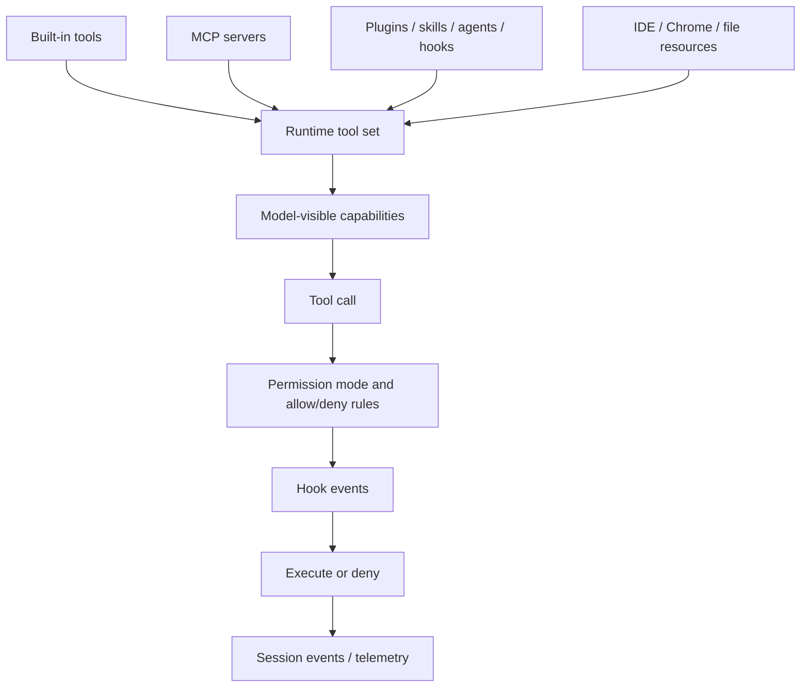

# Tools, integrations, and security

This chapter combines three concerns that are inseparable in Claude Code:

1. Which capabilities become model-visible tools?
2. Which external systems contribute tools, prompts, hooks, plugins, or agents?
3. Which trust boundaries approve, deny, redact, or persist policy?

Read this chapter when the question is: **why could the model do that, and what guarded the action?**

## Source-anchor policy

This page is a chapter guide. Linked implementation pages carry concrete `cli.renamed.js` anchors.

| Semantic alias | Minified anchor | Scope |
|---|---|---|
| Tools/integrations/security chapter | N/A — navigation page | Groups built-in tools, permissions, MCP/plugins/hooks, settings, and integration policy. |
| Tool/security implementation pages | See linked source-anchor tables | Concrete bundle anchors live in destination pages. |

## Trust-boundary map

## Primary reading order

| Order | Page | Tool/security question answered |
|---:|---|---|
| 1 | [Tool runtime, events, and integration flows](tool-runtime-events-and-integrations.md) | Which tools exist, how do events/communication/shell/SDK/LSP/Web/context exclusion/settings/persistence fit together, and where are the main `cli.renamed.js` anchors? |
| 2 | [Tool inventory and schemas](tool-inventory-and-schemas.md) | Which built-in, MCP, plugin, skill, and agent/task tool surfaces exist, who owns their schemas, and which permission boundary applies? |
| 3 | [Built-in tools and permissions](built-in-tools-and-permissions.md) | Which built-in tool names exist, how do flags filter or permission them, and how does `ToolExecutionBoundary` mediate `PreToolUse`, `can_use_tool`, `PermissionDenied`, and edit/web guards? |
| 4 | [Sandbox and isolation](sandbox-and-isolation.md) | How does command sandboxing work, which Linux/macOS mechanisms are used, and how do strict/fallback modes, filesystem policy, and network filtering compose with tool permissions? |
| 5 | [MCP, plugins, and hooks](mcp-plugins-hooks.md) | How are MCP servers, plugins, marketplaces, and lifecycle hooks wired into the runtime, and how does `McpRuntimeCoordinator` connect always-load configs, regular configs, and claude.ai connectors? |
| 6 | [Hooks and events reference](hooks-and-events-reference.md) | Which hook names, lifecycle events, stream frames, control frames, and MCP protocol methods are visible? |
| 7 | [Settings, policy, and integrations](settings-policy-and-integrations.md) | Which settings files, managed policy knobs, IDE/Chrome/file integrations, and helper scripts shape runtime behavior? |
| 8 | [Settings schema reference](settings-schema-reference.md) | Which known settings roots, keys, policy groups, and setting-vs-flag-vs-env boundaries should readers use as canonical references? |
| 9 | [Tool runtime and security architecture](architecture.md) | How is the capability registry + single execution boundary structured, and how do MCP/plugins/hooks/integrations compose without bypassing trust? |

## Handoffs

- Prompt/context surfaces are documented in [Context and model loop](../02-context-model-loop/README.md).
- Session persistence and remote permission forwarding are documented in [Sessions, persistence, and remote](../04-sessions-persistence-remote/README.md).
- Agent-specific tool subsets are documented in [Agents and automation](../06-agents-automation/README.md).
- Cross-boundary protocol families are documented in [Runtime communication protocols](../00-start-here/runtime-communication-protocols.md).

## Navigation

- [Start here](../00-start-here/README.md)
- [Full table of contents](../SUMMARY.md)
