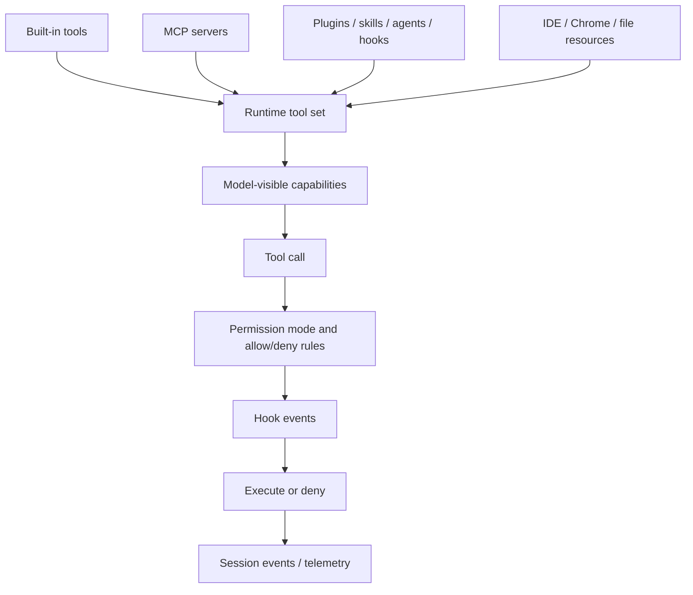

# Tools, integrations, and security

This chapter combines three concerns that are inseparable in Claude Code:

1. Which capabilities become model-visible tools?
2. Which external systems contribute tools, prompts, hooks, plugins, or agents?
3. Which trust boundaries approve, deny, redact, or persist policy?

Read this chapter when the question is: **why could the model do that, and what guarded the action?**

## Source-anchor policy

This page is a chapter guide. Linked implementation pages carry concrete `cli.renamed.js` anchors.

| Semantic alias | Minified anchor | Scope |
|---|---|---|
| Tools/integrations/security chapter | N/A — navigation page | Groups built-in tools, permissions, MCP/plugins/hooks, settings, and integration policy. |
| Tool/security implementation pages | See linked source-anchor tables | Concrete bundle anchors live in destination pages. |

## Trust-boundary map

```mermaid
flowchart TD
    Builtins[Built-in tools] --> Assembly[Runtime tool set]
    MCP[MCP servers] --> Assembly
    Plugins[Plugins / skills / agents / hooks] --> Assembly
    IDE[IDE / Chrome / file resources] --> Assembly
    Assembly --> Model[Model-visible capabilities]
    Model --> ToolCall[Tool call]
    ToolCall --> Permissions[Permission mode and allow/deny rules]
    Permissions --> Hooks[Hook events]
    Hooks --> Execute[Execute or deny]
    Execute --> Events[Session events / telemetry]
```

## Primary reading order

| Order | Page | Tool/security question answered |
|---:|---|---|
| 1 | [Tool runtime, events, and integration flows](tool-runtime-events-and-integrations.md) | Which tools exist, how do events/communication/shell/SDK/LSP/Web/context exclusion/settings/persistence fit together, and where are the main `cli.renamed.js` anchors? |
| 2 | [Tool inventory and schemas](tool-inventory-and-schemas.md) | Which built-in, MCP, plugin, skill, and agent/task tool surfaces exist, who owns their schemas, and which permission boundary applies? |
| 3 | [Built-in tools and permissions](built-in-tools-and-permissions.md) | Which built-in tool names exist, how do flags filter or permission them, and how does `ToolExecutionBoundary` mediate `PreToolUse`, `can_use_tool`, `PermissionDenied`, and edit/web guards? |
| 4 | [Browser automation and Claude in Chrome](browser-automation-and-claude-in-chrome.md) | How do dynamic MCP setup, extension/native-host transports, browser selection, tab groups, browser tools, permissions, timeouts, and reconnect compose? |
| 5 | [Computer-use MCP](computer-use-mcp.md) | How does the macOS computer-control MCP register tools, request per-app access, enforce tiers and lock ownership, and clean up a turn? |
| 6 | [IDE integration and LSP diagnostics](ide-integration-and-lsp-diagnostics.md) | How do IDE lock-file discovery/dynamic MCP and the separate plugin LSP subprocess/diagnostic pipeline work? |
| 7 | [Artifact publishing and live pages](artifact-publishing-and-live-pages.md) | How do `Artifact`, `/artifacts`, live capability guidance, extracted templates/validators, plan/PR publishing skills, URL restoration, and conflict/live-update guards compose? |
| 8 | [Claude Design and design-system sync](claude-design-and-design-sync.md) | How do `ClaudeDesign`, `DesignSync`, OAuth/consent, path plans, project grants, and the bundled `/design-sync` pipeline compose? |
| 9 | [Sandbox and isolation](sandbox-and-isolation.md) | How does command sandboxing work across Linux/WSL, macOS, and feature-gated Windows, and how do strict/fallback modes, filesystem policy, and network filtering compose with tool permissions? |
| 10 | [MCP, plugins, and hooks](mcp-plugins-hooks.md) | How are MCP servers, plugins, marketplaces, and hooks wired into the runtime; how does `McpRuntimeCoordinator` connect them; and what do `/reload-plugins`, `/reload-skills`, and `/skill-doctor` rebuild or inspect? |
| 11 | [Plugin lifecycle and configuration](plugin-lifecycle-and-configuration.md) | How do discovery, installation, scoped enablement, dependencies, manifest contributions, plugin defaults, `userConfig`, secure option storage, substitution, and reload boundaries compose? |
| 12 | [Skills system](skills-system.md) | How are filesystem, bundled, managed, and plugin skills discovered, exposed, invoked, and safely materialized? |
| 13 | [Hooks and events reference](hooks-and-events-reference.md) | Which hook names, lifecycle events, stream frames, control frames, and MCP protocol methods are visible? |
| 14 | [Status line runtime and command protocol](status-line.md) | How do `/statusline` setup, JSON stdin, refresh/cancellation, shell execution, rendering, policy/trust, and the separate subagent-row protocol work? |
| 15 | [Settings, policy, and integrations](settings-policy-and-integrations.md) | Which settings sources are admitted, validated, merged, watched, and written, and how do configuration commands cross their mutation/consent boundaries? |
| 16 | [Settings schema reference](settings-schema-reference.md) | Which known settings roots, keys, policy groups, source restrictions, and setting-vs-flag-vs-env boundaries should readers use as canonical references? |
| 17 | [Tool runtime and security architecture](architecture.md) | How is the capability registry + single execution boundary structured, and how do MCP/plugins/hooks/integrations compose without bypassing trust? |

## Handoffs

- Prompt/context surfaces are documented in [Context and model loop](../02-context-model-loop/README.md).
- Session persistence and remote permission forwarding are documented in [Sessions, persistence, and remote](../04-sessions-persistence-remote/README.md).
- Session-bound hosted knowledge is documented in [Hosted Projects and knowledge](../04-sessions-persistence-remote/hosted-projects-and-knowledge.md).
- Agent-specific tool subsets are documented in [Agents and automation](../06-agents-automation/README.md).
- Cross-boundary protocol families are documented in [Runtime communication protocols](../00-start-here/runtime-communication-protocols.md).

## Navigation

- [Start here](../00-start-here/README.md)
- [Full table of contents](../SUMMARY.md)
