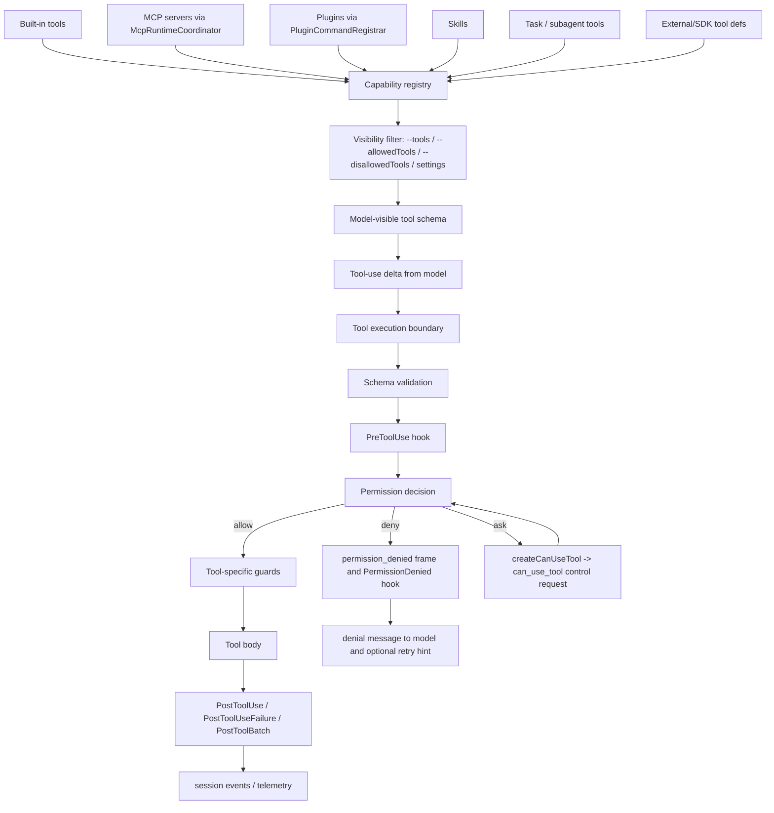
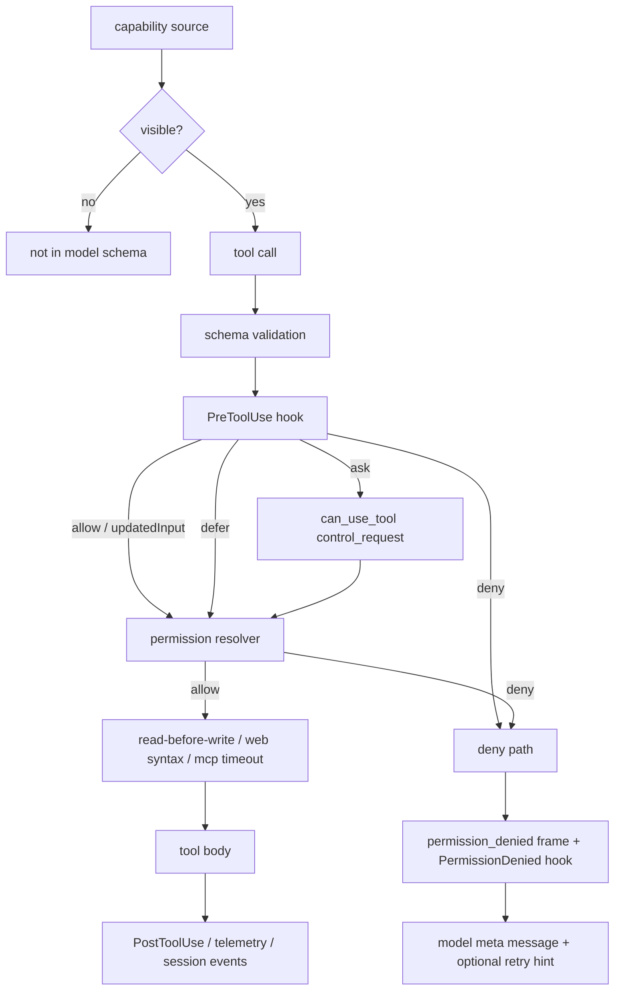

# Tool runtime and security architecture

This page is the architecture analysis for the tools/integrations/security module. It complements the implementation pages by focusing on **module boundary, capability injection seams, and the trust pipeline** rather than re-listing every tool name or permission string.

Scope: from a model-visible tool schema to either an executed action or a structured denial. Implementation specifics live in [Tool runtime, events, and integration flows](tool-runtime-events-and-integrations.md), [Built-in tools and permissions](built-in-tools-and-permissions.md), [MCP, plugins, and hooks](mcp-plugins-hooks.md), and [Settings, policy, and integrations](settings-policy-and-integrations.md).

## Module purpose

This module owns the **action side** of the agent loop. It decides what capabilities exist, what becomes model-visible, who is allowed to invoke them, and how those decisions are propagated to SDK and remote hosts.

It deliberately combines three concerns that cannot be separated in practice:

1. Tool catalog (built-in, MCP, plugin, external, skill, task tools).
2. Trust pipeline (visibility filter → permission rules → hooks → tool-specific guards).
3. Integration surface (MCP, plugins, IDE/Chrome/file, hooks, SDK, Remote Control).

## Architecture thesis

The capability plane is built on a **capability registry plus a single execution boundary**:

- Different sources (built-ins, MCP, plugins, skills, tasks, external definitions) all contribute through the same registry shape.
- Every tool call passes through `ToolExecutionBoundary`, a mediated execution function that combines schema validation, hooks, permission decisions, host control requests, and tool-specific guards before invoking the underlying tool body.

This design makes adding a capability source cheap and adding a security control safe.

## Source anchors

| Semantic alias | String or symbol | Architectural meaning |
| --- | --- | --- |
| BuiltInToolNameConstant | `var Rq="Bash"` | Built-in tool name constant; representative of the catalog shape. |
| CapabilityConstantGroup | `TaskCreate`, `TaskGet`, `TaskList`, `TaskUpdate`, `Skill`, `TodoWrite` | Capability constants grouped with skill/task tools. |
| ToolExecutionBoundary | `function U85` | Single tool-execution boundary; schema validate → permission decision → execute. |
| ToolUseRejectedTelemetry | `tengu_tool_use_can_use_tool_rejected` | Denial telemetry inside the execution boundary. |
| ToolUseAllowedTelemetry | `tengu_tool_use_can_use_tool_allowed` | Allow telemetry inside the same boundary. |
| PermissionDeniedRetryFeedback | `The PermissionDenied hook indicated you may retry this tool call.` | Denial feedback the model can act on. |
| PreToolUseAuthorizationHook | `hookPermissionResult`, `PreToolUse` | `PreToolUse` participates in authorization, not just notification. |
| CanUseToolBridge | `createCanUseTool` | Host/SDK/Remote Control bridge wrapping the same permission resolver. |
| PermissionDeniedFrame | `permission_denied` | System frame for deny-shortcut decisions sent to SDK hosts. |
| CanUseToolControlRequest | `sendControlRequest({subtype:"can_use_tool"...})` | Ask path surfaces as a host control request. |
| McpRuntimeCoordinator | `function fH9(H)` | MCP runtime coordinator; capability source for tools/resources/prompts. |
| McpCommandRegistrar | `function rR4(H)` | MCP command tree; user-facing config surface for the same source. |
| PluginCommandRegistrar | `function fC4(H)` | Plugin command tree; injects agents/skills/hooks/MCP/output styles. |
| HookEventTaxonomy | Hook arrays (`PreToolUse`, `PostToolUse`, `PostToolUseFailure`, `PostToolBatch`, `PermissionRequest`, `PermissionDenied`, ...) | Hook event taxonomy used by both authorization and lifecycle. |
| SkillShellPolicySwitch | `disableSkillShellExecution` | Managed-policy switch for skills/custom slash commands. |
| RemoteControlPolicySwitch | `disableRemoteControl` | Managed-policy switch for Remote Control entry. |
| PermissionPromptToolFlag | `--permission-prompt-tool` | Permission prompting delegated to a schema-bearing MCP tool. |
| ReadBeforeWriteGuard | `File has not been read yet. Read it first before writing to it.` | Tool-specific guard inside Edit/Write/NotebookEdit. |
| McpTimeoutGuards | `MCP_TIMEOUT`, `MCP_CONNECT_TIMEOUT_MS` | Capability-source timeouts; protect the execution boundary from slow servers. |

## Internal decomposition

| Sub-component | Responsibility |
|---|---|
| Capability registry | Normalizes built-in, MCP, plugin, skill, task, and external tool definitions to a common shape. |
| Visibility filter | Applies `--tools`, `--allowedTools`, `--disallowedTools`, settings, and managed policy to decide what the model sees. |
| Permission resolver | Combines allow/deny rules, permission mode, hook output, host responses, and helper-tool prompts into one decision. |
| `ToolExecutionBoundary` | The single place tool calls cross from "model-asked" to "actually-run." |
| Hook dispatcher | Runs `PreToolUse`/`PostToolUse`/`PermissionDenied` and related events at well-defined points. |
| `McpRuntimeCoordinator` | Connects always-load, regular, and claude.ai connector groups; bridges elicitation completion. |
| `PluginCommandRegistrar` | Loads plugin-provided agents, skills, hooks, MCP servers, output styles, and slash commands. |
| Integration adapters | IDE auto-connect, Chrome, file-resource startup, status line, helper scripts. |

## Public interface

### Inputs

| Surface | Effect |
|---|---|
| `--tools`, `--allowedTools`/`--allowed-tools`, `--disallowedTools`/`--disallowed-tools`, `--permission-mode`, `--permission-prompt-tool`, `--dangerously-skip-permissions` | Shape visibility and approval behavior. |
| `--mcp-config`, `--strict-mcp-config`, `claude mcp ...` | Configure MCP servers and connector behavior. |
| `--plugin-dir`, `--plugin-url`, `claude plugin ...` | Load session-only or marketplace plugins. |
| `--ide`, `--chrome`, `--file` | Activate IDE/Chrome/file integration sources. |
| `.claude/settings.json`, `settings.local.json`, managed settings | Persistent allow/deny, hook config, plugin trust, policy switches. |
| Environment: `MCP_TIMEOUT`, `MCP_CONNECT_TIMEOUT_MS`, `MCP_CONNECTION_NONBLOCKING` | Capability-source timeouts and connection mode. |

### Outputs

| Output | Consumer |
|---|---|
| Tool result (success or error) | Model loop. |
| `permission_denied` frame | SDK hosts and Remote Control bridge. |
| `can_use_tool` control request and `permission_response` | Interactive host or SDK approver. |
| Hook calls (`PreToolUse`, `PostToolUse`, `PostToolUseFailure`, `PostToolBatch`, `PermissionRequest`, `PermissionDenied`) | Hook scripts/commands, telemetry. |
| MCP elicitation completion frames | `HeadlessFrameMultiplexer`. |
| `code_edit_tool.decision` and `tengu_tool_use_*` telemetry | Telemetry sinks. |

## Internal collaborators

| Collaborator | Contract |
|---|---|
| Context/model loop | Embeds tool metadata into the model-visible request; sends tool-use deltas to the boundary. |
| Sessions module | Records tool starts/results/errors as session events; resume restores tool/permission state. |
| Runtime lifecycle | Provides settings, managed policy, and CLI permission flags before the loop starts. |
| Remote/bridge module | Uses `createCanUseTool` to route ask/deny decisions to remote approvers and hosts. |
| Hooks subsystem | Receives lifecycle events; can mutate input, authorization, and additional context. |
| Telemetry/ops | Records denial/allow telemetry, MCP auth errors, code-edit decisions, and timeouts. |

## Design decisions

1. **Single boundary, multiple sources.** Every tool call goes through `ToolExecutionBoundary` regardless of source. This keeps telemetry, hooks, and permission policy consistent for built-in, MCP, plugin, skill, and task tools.
2. **`PreToolUse` participates in authorization.** Hooks can `allow`, `ask`, `deny`, `defer`, supply `updatedInput`, or add `additionalContext`. Treating hooks as authorization (not just notification) lets policy logic live outside the bundle.
3. **Permission decisions are tri-modal.** Allow/deny shortcut directly through telemetry; ask is surfaced as a structured `can_use_tool` control request. SDK hosts only see ask flows; deny is observable but never blocks on a host round-trip.
4. **Deny is opinionated, not silent.** A `PermissionDenied` hook can return retry information, which is converted into a model-visible meta message: *"The PermissionDenied hook indicated you may retry this tool call."* This keeps the model loop self-correcting.
5. **MCP and plugins are first-class capability sources.** They go through the same registry and visibility filter as built-ins; they cannot bypass the boundary.
6. **Required vs optional MCP.** `McpRuntimeCoordinator` splits configs into `alwaysLoad` and normal groups so essential capabilities are present before the model runs, while optional servers can defer or fail without blocking startup.
7. **Helper tools can prompt for permission.** `--permission-prompt-tool` lets an MCP tool with a JSON schema be the approval UI; this keeps the runtime's approval channel pluggable.
8. **Managed policy can disable extension points.** `disableSkillShellExecution`, `disableRemoteControl`, `disableAgentView`, and similar switches are intentionally part of the trust pipeline; they are not separate code paths.
9. **Tool-specific guards complement permissions.** Edit/Write/NotebookEdit require a prior `Read`; WebFetch enforces `domain:` syntax; WebSearch rejects wildcards. These are local invariants, not permission rules.

## Trust pipeline summary

The pipeline is intentionally one-way except for the ask loop. Hooks can shape the decision, but they cannot bypass the registry or the boundary.

## Failure modes

| Failure | Behavior |
|---|---|
| Tool input fails schema validation | `ToolExecutionBoundary` returns a structured error before any hook or permission decision; no execution. |
| MCP tool returns 401 / token expired | `tengu_mcp_tool_call_auth_error` is emitted and a user-facing reauth error is raised. |
| MCP server slow or unreachable | `MCP_TIMEOUT`/`MCP_CONNECT_TIMEOUT_MS` enforce limits; coordinator can retry transient remote failures. |
| Hook script crashes or hangs | The boundary handles the missing/invalid result; lifecycle continues with a denial or a deferred decision. |
| `--permission-prompt-tool` references a missing or non-MCP tool | Runtime writes an error and exits; this is enforced before the loop starts. |
| File edit without prior read | Read-before-write guard rejects with a precise model-facing message asking for a refresh `Read`. |
| Managed policy disables a capability mid-session | Visibility filter recomputes; in-flight calls complete but new calls become invisible. |

## Extension points

| Extension | How it plugs in |
|---|---|
| New built-in tool | Register a constant and definition into the capability registry; rely on the existing visibility filter and boundary. |
| New MCP server | Add via `--mcp-config`, settings, or plugin; runtime coordinator handles connection, deduplication, and elicitation. |
| New plugin capability | Use plugin schema (`agents`, `skills`, `hooks`, `mcpServers`, `outputStyles`, `lspServers`); do not register tools directly. |
| New hook event | Extend the hook event array and ensure the relevant runtime point emits it. |
| Custom approval UI | Implement an MCP tool with a JSON schema and pass it through `--permission-prompt-tool`. |
| Org policy | Use managed settings switches (`disableSkillShellExecution`, `disableRemoteControl`, ...) rather than patching the boundary. |

## Caveats

- The capability registry's exact internal shape is bundled; this page documents what the registry must produce, not the precise object layout.
- Hook dispatch order and concurrency rules are implementation-defined for related events (`PostToolBatch` vs many `PostToolUse`); rely on the implementation pages for current details.
- `--dangerously-skip-permissions` is intentionally a sharp tool; documents should not describe it as a normal operating mode.

## Related docs

- [Tool runtime, events, and integration flows](tool-runtime-events-and-integrations.md)
- [Built-in tools and permissions](built-in-tools-and-permissions.md)
- [Sandbox and isolation](sandbox-and-isolation.md)
- [MCP, plugins, and hooks](mcp-plugins-hooks.md)
- [Settings, policy, and integrations](settings-policy-and-integrations.md)
- [System architecture](../00-start-here/system-architecture.md)
- [Context and model loop architecture](../02-context-model-loop/architecture.md)
- [Agent and automation architecture](../06-agents-automation/architecture.md)
