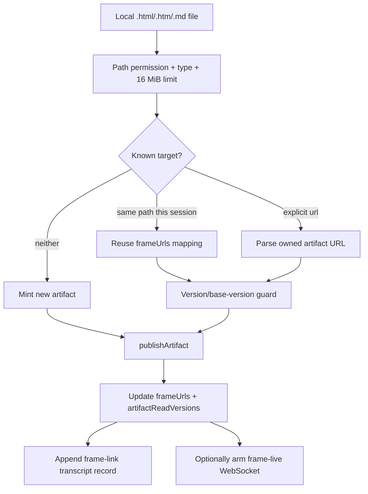

# Artifact publishing and live pages

`Artifact` is a new `2.1.215` hosted-tool module that renders a local HTML or Markdown file into a default-private page on claude.ai. It owns publication, listing, stable URL/version tracking, update conflict checks, optional live editing/capabilities, transcript restoration, and live-update notifications.

`ARTIFACT_TOOL_NAME = "Artifact"` and `ArtifactTool` are absent from the retained `2.1.143` parent bundle. This page documents the new runtime subsystem; it does not treat generated artifact prompt text as the sole behavioral proof.

## Source anchors

| Semantic alias | Approximate location in `cli.renamed.js` | Exact string or symbol | Meaning |
|---|---:|---|---|
| ArtifactToolName | [~182,411](../../claude-code-pkg/src/entrypoints/cli.renamed.js#L182411) | `ARTIFACT_TOOL_NAME = "Artifact"` | Stable model-facing tool name. |
| ArtifactEligibility | [~259,331-259,499](../../claude-code-pkg/src/entrypoints/cli.renamed.js#L259331) | `isArtifactToolEligible`, `isArtifactToolEnabled` | Subscriber/provider, policy, feature, env, and preference gates. |
| ArtifactSessionRehydrator | [~421,100](../../claude-code-pkg/src/entrypoints/cli.renamed.js#L421100) | `frameUrls`, `artifactReadVersions`, `artifactRefs` | Rebuilds artifact state from transcript tool results. |
| ArtifactLiveSubscriber | [~421,300](../../claude-code-pkg/src/entrypoints/cli.renamed.js#L421300) | `frame-live.v1`, `Czu` | Arms a WebSocket monitor after eligible publishes and reports external updates. |
| ArtifactInputSchema | [~421,640](../../claude-code-pkg/src/entrypoints/cli.renamed.js#L421640) | `buildArtifactInputSchema` | Defines publish/list/live-edit inputs and optional runtime declarations. |
| ArtifactDescriptor | [~421,819](../../claude-code-pkg/src/entrypoints/cli.renamed.js#L421819) | `ArtifactTool = Ai({...})` | Tool visibility, permissions, validation, execution, and result mapping. |
| ArtifactSizeLimit | [~376,009](../../claude-code-pkg/src/entrypoints/cli.renamed.js#L376009) | `MAX_ARTIFACT_BYTES = 16777216` | Raw source-file limit: 16 MiB. |
| ArtifactCapabilitySkill | [~873,270](../../claude-code-pkg/src/entrypoints/cli.renamed.js#L873270) | `artifact-capabilities`, `resolveContract`, `fetchContractDefs` | Fetches the live capability roster/prompt/type definitions for the current contract. |
| ArtifactTemplateSkills | [~874,423](../../claude-code-pkg/src/entrypoints/cli.renamed.js#L874423) | `artifact-${kind}`, `OZb` | Expands dashboard, report, data-table, and explainer template skills. |
| ArtifactReviewSkills | [~887,510–888,410](../../claude-code-pkg/src/entrypoints/cli.renamed.js#L887510) | `plan-artifact`, `pr-explainer`, `artifact-pr-review` | Plan/PR publishing workflows with independent gates. |
| DataVisualizationSkill | [~878,555](../../claude-code-pkg/src/entrypoints/cli.renamed.js#L878555) | `dataviz`, `validate_palette.js`, `validate_palette.py` | Extracts design guidance and executable palette validators. |

## Availability boundary

The tool is not universally visible. The gate requires all of the following:

- a first-party Claude.ai subscriber session;
- no hard disable from `CLAUDE_CODE_DISABLE_ARTIFACT` or host settings;
- an eligible entrypoint (several SDK/action/MCP surfaces default off or are publish-excluded);
- organization policy `allow_cobalt_plinth` and an accepted subscription tier;
- the feature gate used by `tZn()`;
- `enableArtifact` not disabled by higher-priority policy/flag/user settings.

Restricted nonessential traffic also makes the hosted path ineligible. These checks explain why the SDK declaration proves a contract but not availability in every local session.

## Artifact command and bundled-skill layer

The hosted `Artifact` tool is the mutation boundary; the related slash commands are navigation or prompt/asset packages around it. They do not bypass the tool's read, publication, ownership, and conflict checks.

| Command | Registration and role |
|---|---|
| `/artifacts` | Core `local-jsx` browser for published/shared pages, enabled only when the Artifact tool is enabled. |
| `/artifact-design` | Bundled design guidance that must be loaded before authoring a page. It can conditionally point chart work to `/dataviz`. |
| `/artifact-dashboard`, `/artifact-report`, `/artifact-data-table`, `/artifact-explainer` | Four names expanded from one `Lu()` loop. Each extracts `SKILL.md` plus `template.html`, applies a creation-only contract, and requires all slot/placeholder content to be replaced before publishing. |
| `/artifact-capabilities` | Fetches the **live** contract roster rather than trusting a vendored capability list. It can extract `<contract>/<capability>.d.ts` files, fetch composed authoring guidance, and pin guidance to the target artifact's stored contract. |
| `/dataviz` | Extracts chart-form/color/accessibility references and both JavaScript and Python implementations of the same palette checks. It instructs the caller to execute the validator rather than eyeballing color separation. |
| `/plan-artifact` | Publishes or restyles an implementation plan/design doc/RFC from an extracted plan template. |
| `/artifact-pr-review` | Gated PR-review briefing workflow. It gathers GitHub metadata/diff, treats PR text as untrusted data, validates a bounded JSON synthesis, escapes every PR-derived string, fills a self-contained template, then publishes through `Artifact`. |
| `/pr-explainer` | Retained but disabled in this build (`isEnabled_13() === false`). Its prompt would create a reviewer-oriented narrative walkthrough, not a correctness review. |
| `/code-walkthrough` | Retained but disabled (`isEnabled_10() === false`); it would publish a code explainer Artifact. |

The template skills are user-invocable and model-invocable unless a caller/skill override says otherwise. `/artifact-capabilities` is especially important as an evidence boundary: capability names, configuration, and call definitions come from the control-plane contract served to the current user. Failure to fetch that roster produces “no capability available” guidance; it does not license a guessed `window.claude.*` API.

Bundled file extraction is itself guarded: the generic `Lu()` path rejects absolute/`..` file entries and uses exclusive no-follow creation where the platform exposes it. The resulting base directory is prepended to the skill prompt so templates and validators are read from the exact extracted version.

## Actions and data model

| Action | Read/write class | Behavior |
|---|---|---|
| `publish` (default/omitted) | Remote write | Reads `.html`, `.htm`, or `.md` from disk, renders/wraps it, and creates or updates a hosted page. `file_path` and a literal emoji `favicon` are required. |
| `list` | Read-only | Lists owned artifacts by default, or shared/all scopes when requested. The first listing at a scope asks before titles and links enter the conversation. |
| `live-edit` | Remote write | Applies bounded edit operations when the live-edit schema/gate is installed; unavailable builds reject it explicitly. |

Publishing can also carry a title/description/version label, a BCP-47 language tag when enabled, and optional runtime `capabilities`/`contract` declarations when those schema gates are open.

## Publish and update lifecycle

### Stable identity

- Re-publishing the same file path in the same conversation reuses its session `frameUrls` entry.
- Updating an artifact from another conversation requires its URL; without it, a new URL is minted.
- `action: "list"` is the discovery route for an owned artifact whose URL is no longer in context.
- Shared artifacts can be listed/read but cannot be targeted by the owner-only update path.

### Version and concurrency safety

When base-version tracking is enabled, updating an existing slug requires a version previously observed by the session. The model must fetch the current artifact first or explicitly pass `force: true`. The normal path sends `baseVersion`, allowing the server to return a conflict instead of silently clobbering another session's update.

The runtime stores artifact read versions and published links in app state and reconstructs them from transcript records on resume. A successful publish appends a `frame-link` record with the session ID, path, URL, title, and timestamp.

## Permission boundaries

- Publishing always crosses local file-read permission and a hosted-publication confirmation boundary, except for narrowly recognized same-session private redeploys.
- Updating a shared-live page still asks because current viewers may see the change immediately.
- The first `list` call asks before titles/links from earlier sessions enter context; shared/all scopes separately account for untrusted titles written by other users.
- `live-edit` suppresses whole-tool allow rules and uses its own operation-level checks.
- Optional runtime capabilities are read back and carried forward carefully; omitting the field preserves stored declarations, while `{}` clears them.

## Live-update monitor

After an eligible interactive or SDK publish, the runtime can fetch a channel token and open:

`/edge-api/frame-live/<slug>/ws`

using subprotocol `frame-live.v1`. The monitor is persistent, sends a keepalive every 25 seconds, suppresses the publisher's own/catch-up versions, and injects a stale-copy notice if another session republishes the artifact. It is not armed in remote mode and respects WebSocket egress policy.

## Failure and caveat boundaries

- Only HTML/HTM/Markdown source files are accepted, and the raw file cannot exceed 16 MiB.
- Markdown and HTML follow different title/templating paths; an HTML `<title>` wins over the tool's `title` argument.
- Artifact pages start private, but sharing state affects later permission prompts and whether viewers see live updates or a pinned older version.
- Runtime capabilities, live editing, language tags, share-aware reads, and base-version checks are individually gated; do not infer all of them from the presence of `ArtifactTool` alone.

## Related docs

- [Tool inventory and schemas](tool-inventory-and-schemas.md)
- [Built-in tools and permissions](built-in-tools-and-permissions.md)
- [Settings, policy, and integrations](settings-policy-and-integrations.md)
- [Session resume and transcripts](../04-sessions-persistence-remote/session-resume-and-transcripts.md)
- [Claude Design and design-system sync](claude-design-and-design-sync.md)
