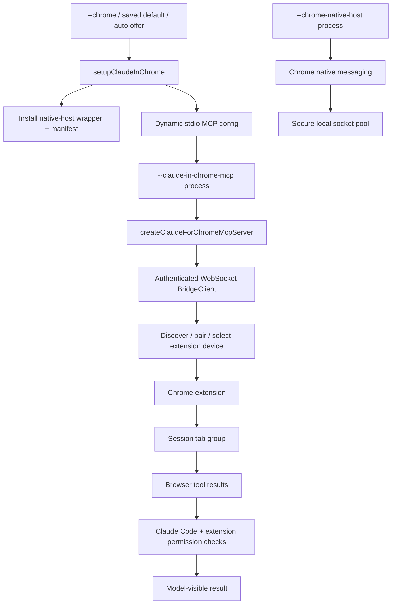

# Browser automation and Claude in Chrome

Claude in Chrome is Claude Code's browser-automation integration. In `@anthropic-ai/claude-code@2.1.215`, it is packaged as a dynamic MCP server, an authenticated bridge client, and a Chrome native-messaging host. It can inspect accessibility trees, navigate, interact with forms and page coordinates, run page JavaScript, inspect console/network activity, manage grouped tabs, capture screenshots/GIFs, and select among connected browsers.

This is distinct from the macOS-only [Computer-use MCP](computer-use-mcp.md) and from read-only [WebFetch/WebSearch](tool-runtime-events-and-integrations.md#webfetch-and-websearch). Browser calls still cross Claude Code's tool/permission boundary, while the extension enforces its own site-level permissions.

## Short answer



The ordinary `--claude-in-chrome-mcp` context supplies `bridgeConfig`, so `createChromeSocketClient()` selects the authenticated WebSocket bridge. The packaged native host is a separate local transport role used by the extension/local socket clients; its presence does not mean one tool call travels through both transports.

## Source anchors

| Semantic alias | Approximate location in `cli.renamed.js` | Exact symbol or string | Meaning |
|---|---:|---|---|
| ChromeProcessRoles | [~983,943](../../claude-code-pkg/src/entrypoints/cli.renamed.js#L983943) | `--claude-in-chrome-mcp`, `--chrome-native-host` | Pre-main process-role dispatch. |
| ChromeActivation | [~744,338–744,520](../../claude-code-pkg/src/entrypoints/cli.renamed.js#L744338) | `shouldEnableClaudeInChrome()`, `shouldAutoEnableClaudeInChrome()`, `setupClaudeInChrome()` | Flag/env/default/offer gates and dynamic MCP setup. |
| NativeHostManifest | [~744,575](../../claude-code-pkg/src/entrypoints/cli.renamed.js#L744575) | `com.anthropic.claude_code_browser_extension` | Writes the browser native-messaging manifest and wrapper. |
| ChromeMcpServer | [~595,890](../../claude-code-pkg/src/entrypoints/cli.renamed.js#L595890) | `runClaudeInChromeMcpServer()` | Starts the stdio MCP server and bridge context. |
| ChromeNativeHost | [~596,600](../../claude-code-pkg/src/entrypoints/cli.renamed.js#L596600) | `runChromeNativeHost()` | Length-prefixed Chrome native messaging ↔ secure local socket bridge. |
| BrowserMcpAdapter | [~51,988](../../claude-code-pkg/src/entrypoints/cli.renamed.js#L51988) | `createChromeSocketClient()`, `createClaudeForChromeMcpServer()` | Selects bridge/local transport and exposes MCP tools. |
| HostedBridge | [~39,082–40,180](../../claude-code-pkg/src/entrypoints/cli.renamed.js#L39082) | `BridgeClient` | OAuth-authenticated WebSocket, pairing, pending calls, keepalive, and reconnect. |
| LocalSocketPool | [~50,900–51,320](../../claude-code-pkg/src/entrypoints/cli.renamed.js#L50900) | `W_l`, `tabRoutes` | Pools secure native-host sockets and routes tab IDs to the owning socket. |
| BrowserToolCatalog | [~40,200](../../claude-code-pkg/src/entrypoints/cli.renamed.js#L40200) | `BROWSER_TOOLS` | Browser MCP tool names and JSON schemas. |
| FrontLoadedTabs | [~51,690](../../claude-code-pkg/src/entrypoints/cli.renamed.js#L51690) | `tabs_context_mcp`, `createIfEmpty:true`, `tbl = 8000` | Hidden tab-group bootstrap for standalone navigation without `tabId`. |
| BrowserPermissionSubsets | [~447,003–447,180](../../claude-code-pkg/src/entrypoints/cli.renamed.js#L447003) | `CHROME_MCP_SAFE_TOOLS`, `CHROME_MCP_READONLY_TOOLS` | Auto-mode and plan-mode subset classification. |
| ChromeManager | [~745,800](../../claude-code-pkg/src/entrypoints/cli.renamed.js#L745800) | `/chrome`, `Manage permissions`, `Reconnect extension` | Interactive installation/status/default/browser selection UI. |

## Activation and setup

### Explicit and saved selection

`shouldEnableClaudeInChrome()` resolves the main enable state:

1. explicit `--chrome` / `--no-chrome` override;
2. `CLAUDE_CODE_ENABLE_CFC=true|false`;
3. non-interactive sessions default off; and
4. the global `claudeInChromeDefaultEnabled` preference, otherwise off.

An automatic offer is narrower. It requires an interactive Claude.ai subscriber session, no explicit disable, no saved default, extension evidence (or the source-visible host condition), and `tengu_chrome_auto_enable`. `shouldSuppressChromeOffer()` suppresses the offer during pending SSH setup, remote/teleport, safe mode, bypass-permissions mode, selected plan-mode states, and teammate contexts. The `/chrome` UI separately reports that the product is unsupported in WSL and requires a Claude.ai subscription; `shouldEnableClaudeInChrome()` itself does not add another WSL branch, so this page does not infer where that support restriction is ultimately enforced.

These are setup/offer gates, not a claim that every explicit request succeeds. Dynamic MCP policy, account/auth state, extension installation, and connection state can still prevent tools from loading.

### Dynamic MCP and native-host installation

`setupClaudeInChrome()` returns a dynamic MCP config named `claude-in-chrome` whose stdio command relaunches the current executable with `--claude-in-chrome-mcp`. It also creates a wrapper under the Claude config directory's `chrome/` subdirectory and best-effort writes a native-messaging manifest for supported Chromium-family browsers.

The manifest contains:

```text
name: com.anthropic.claude_code_browser_extension
type: stdio
allowed_origins: chrome-extension://fcoeoabgfenejglbffodgkkbkcdhcgfn/
path: generated chrome-native-host wrapper
```

On Windows the path is also registered in browser NativeMessagingHosts registry keys. On Unix-like systems it is written to the supported browser native-host directories. A first manifest install can open the reconnect page only when extension detection succeeds.

Extension detection scans known Chrome, Brave, Edge, Chromium, Vivaldi, Opera, and platform-appropriate Arc profile roots for the extension ID. The global cached result is only evidence from a prior scan; `/chrome` can rescan and reconnect.

## Two transport roles

### Hosted authenticated bridge (normal MCP context)

`createChromeContext()` supplies a `bridgeConfig`, so the normal Chrome MCP server creates `BridgeClient`. It connects to the configured bridge URL under `/chrome/<account-uuid>`, sends a `connect` frame containing OAuth (or local-development identity), and becomes usable after `paired` or `waiting`.

The bridge then:

- lists connected extensions;
- reuses a persisted device ID when still present;
- auto-selects a sole extension;
- asks for explicit browser selection/pairing when multiple devices remain ambiguous;
- carries a selected `target_device_id` in tool calls; and
- persists the paired device ID/name in global config after explicit pairing.

The OAuth token's resolved account is compared with persisted Claude Code account identity. A mismatch uses the token-derived account for routing, emits telemetry, and gives explicit recovery guidance rather than silently targeting the other account.

### Chrome native host and local sockets

`--chrome-native-host` implements Chrome's four-byte little-endian length-prefixed native-messaging protocol. It creates a per-process local socket listener, forwards `tool_request` frames from socket clients to Chrome, and broadcasts Chrome `tool_response`/`notification` frames back to connected clients.

On non-Windows platforms:

- the socket directory is mode `0700`;
- the socket is mode `0600`;
- stale PID-named sockets are removed when their process no longer exists; and
- incoming native messages are capped at 1 MiB.

The local socket client validates that socket/directory ownership and modes match the current user before connecting. A pool can discover multiple native-host sockets; `tabs_context_mcp` merges their tab lists and records `tabId → socketPath` routes so later calls reach the browser instance that owns that tab.

This local transport is source-visible package infrastructure. The normal context in this build prefers the hosted bridge because `bridgeConfig` is present.

## Browser tool families

`BROWSER_TOOLS` defines the MCP contract. The principal families are:

| Family | Representative tools | Behavior |
|---|---|---|
| Tab/session context | `tabs_context_mcp`, `tabs_create_mcp`, `tabs_close_mcp` | Lists/creates/closes tabs in the extension-managed group and returns `tabGroupId`. |
| Browser selection | `list_connected_browsers`, `select_browser`, `switch_browser` | Lists bridge devices or asks the user to select/pair another browser. Bridge-only. |
| Navigation/read | `navigate`, `read_page`, `get_page_text`, `find` | Navigates history/URL or reads accessibility/semantic page state. |
| Interaction | `computer`, `form_input` | Mouse/keyboard/screenshot actions or semantic form assignment. |
| Script/debug | `javascript_tool`, `read_console_messages`, `read_network_requests` | Executes page-context JavaScript or reads browser debugging streams. |
| Batch | `browser_batch` | Runs actions sequentially in one round trip and stops at the first error; nested batches are rejected by the contract. |
| Browser utilities | `shortcuts_list`, `shortcuts_execute`, `resize_window` | Uses extension shortcuts or changes the browser window. |
| Capture | `gif_creator`, screenshots through `computer` | Returns media inline; `save_to_disk` uses a private `0700` screenshot directory and exclusive `0600` files. |

The exact schema includes tool-specific bounds, such as a maximum ten-second `computer.wait`, key-repeat limits, accessibility-tree character limits, and explicit `tabId` requirements.

### Tab-group bootstrap

MCP calls from the renderer carry a `session_scope` with session ID and user-message UUID. The MCP adapter remembers a successful `tabGroupId` per session.

A standalone `navigate` to a URL may omit `tabId`. In that case the adapter performs one hidden `tabs_context_mcp({createIfEmpty:true})`, shared per session while in flight, with an eight-second local bound. It injects the selected tab and returns the front-loaded tab context alongside the result. Back/forward navigation and actions inside `browser_batch` still require an explicit tab ID.

A hidden lookup timeout is reported separately from the later browser action with `_meta.isFrontLoadBoundExceeded:true`, so callers/telemetry can distinguish it and retry `tabs_context_mcp` explicitly instead of treating navigation as an unknown failure. The MCP adapter removes this private marker before returning the final public result.

## Permission boundaries

Browser automation crosses more than one boundary:

1. The dynamic MCP server must survive safe-mode, MCP policy, and connection setup.
2. The browser tool is still an MCP tool at Claude Code's normal `ToolExecutionBoundary`, so permission rules, hooks, mode restrictions, and SDK/remote permission forwarding still apply.
3. The bridge frame carries `permission_mode` and optional allowed domains.
4. The extension can send `permission_request` during a pending call. `BridgeClient` pauses that call's timeout, asks its registered handler, sends `permission_response`, then restarts the timeout.
5. The extension applies site-level permissions. `/chrome` links to the extension permission manager and explicitly says those permissions control where Claude can browse, click, and type.

`CHROME_MCP_SAFE_TOOLS` and `CHROME_MCP_READONLY_TOOLS` are **auto-mode/plan-mode classifier subsets**, not universal “no permission needed” lists. The plan subset admits read-oriented tools and selected non-mutating `computer` subactions. The broader auto-mode subset admits additional bounded interactions and validates each `browser_batch` item. Actions outside those subsets fall through to the normal classifier/prompt path.

## Connection timing, recovery, and cleanup

| Boundary | Value/behavior in `2.1.215` |
|---|---|
| Bridge `ensureConnected()` wait | 10 seconds. |
| Bridge handshake watchdog | 30 seconds. |
| Extension list request | 5 seconds. |
| Initial peer wait | Up to 10 seconds before declaring no extension. |
| Default tool call | 60 seconds; context can supply per-tool overrides. |
| Hidden tab bootstrap | 8 seconds. |
| Pair/switch UI | Up to 120 seconds. |
| Keepalive | Ping every 30 seconds; reconnect when pong age exceeds 90 seconds. |
| Reconnect | `min(2000 × 1.5^(attempt-1), 30000)` ms, up to 100 attempts; next tool use can try again after exhaustion. |

On disconnect, pending calls are rejected, the selected device is remembered as the previous selection, discovery state is cleared, and reconnect is scheduled. A matching device that reconnects can be reselected automatically. Cleanup cancels reconnect/handshake/pairing/keepalive timers, rejects pending calls, resolves pending external relays as failed, closes the socket, and clears discovery waiters.

The MCP subprocess also watches stdin end/error, drains its analytics sinks, and exits. The native host closes client sockets/server, removes its socket, and removes the socket directory when empty.

## Failure behavior

| Failure | Client behavior |
|---|---|
| Extension not installed/connected | Returns setup/account guidance and points to `/chrome`/installation rather than inventing a browser result. |
| Multiple browsers without a resolved selection | Refuses the browser call and requires user choice; it does not pick silently. |
| Tool timeout while bridge remains connected | Reports that the page may be loading/unresponsive or awaiting an extension prompt; late results are ignored/telemetred. |
| Extension disconnects mid-call | Rejects the call with a transient retry explanation and clears selection. |
| Authentication/session expired | Classifies the extension error and asks the user to align/re-authenticate accounts. |
| Invalid/closed tab | Classifies `tab_not_found`; caller should refresh with `tabs_context_mcp`. |
| Site/navigation denied | Surfaces extension `domain_blocked`, `navigation_blocked`, or permission-denied text. |
| Security/origin check fails | Surfaces the extension failure; the client does not bypass it. |
| Screenshot disk save fails | Keeps the inline image and appends a nonfatal explanation. |
| Native socket has unsafe type/mode/owner | Refuses the local connection. |
| Bridge reconnect exhausts 100 attempts | Stops the timer loop; a later tool call can initiate a new connection attempt. |

## Boundaries and caveats

- The retained CLI proves client/MCP/native-host framing and tool schemas. Chrome extension implementation, site permission UI, browser tab-group cleanup, and browser-security enforcement internals are outside this artifact.
- Tool schemas are version-specific and can change independently of the generic MCP protocol.
- Browser tool presence in generated prompt catalogs does not prove availability; dynamic setup, policy, account, mode, and connection gates all matter.
- `CLAUDE_CHROME_PERMISSION_MODE` is an internal/host override accepted as `ask`, `skip_all_permission_checks`, or `follow_a_plan`; ordinary users should use Claude Code and extension permission controls rather than treating it as a security bypass.
- The client sanitizes browser names/notices before displaying or telemetering them, but page content remains untrusted model input.

## Related docs

- [Tools, integrations, and security](README.md)
- [MCP, plugins, and hooks](mcp-plugins-hooks.md)
- [Built-in tools and permissions](built-in-tools-and-permissions.md)
- [Tool inventory and schemas](tool-inventory-and-schemas.md)
- [Tool runtime, events, and integration flows](tool-runtime-events-and-integrations.md)
- [Computer-use MCP](computer-use-mcp.md)
- [Settings, policy, and integrations](settings-policy-and-integrations.md)
- [Safe mode and recovery](../05-hosted-agent-ops/safe-mode-and-recovery.md)
