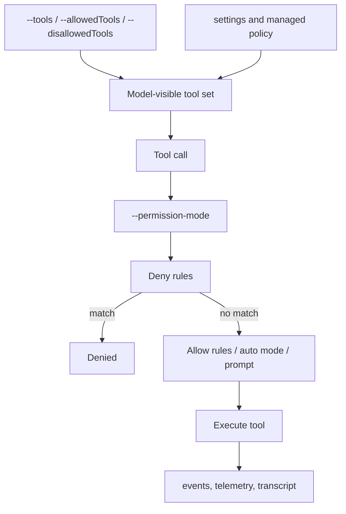
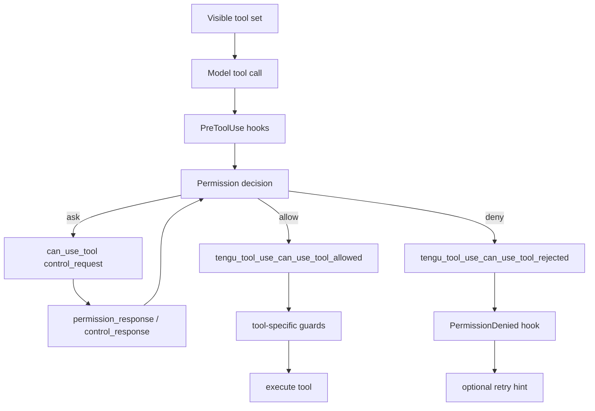

# Built-in tools and permissions

This page reverse-engineers the built-in tool surface and root permission/filtering flags in the analyzed `cli.renamed.js`.

Use [Tool inventory and schemas](tool-inventory-and-schemas.md) for the canonical tool-family inventory and schema-owner table. This page owns the built-in permission and `ToolExecutionBoundary` explanation.

## Source anchors

| Semantic alias | String or symbol | Meaning |
| --- | --- | --- |
| BashToolName | `var Rq="Bash"` | Shell-command tool name. |
| ReadToolName | `var Bq="Read"` | File-read tool name. |
| EditToolName | `var v7="Edit"` | File-edit tool name. |
| WriteToolName | `var $9="Write"` | File-write tool name. |
| GlobToolName | `var B1="Glob"` | File-pattern search tool name. |
| GrepToolName | `var V9="Grep"` | Content-search tool name. |
| WebFetchToolName | `var gD="WebFetch"` | URL fetch tool name. |
| WebSearchToolName | `var RI="WebSearch"` | Web search tool name. |
| TodoWriteToolName | `var HV="TodoWrite"` | Todo list tool name. |
| SkillToolName | `var XX="Skill"` | Skill-loading tool name. |
| ToolVisibilityFlag | `--tools <tools...>` | Selects available tools from the built-in set. |
| ToolAllowRuleFlag | `--allowedTools, --allowed-tools <tools...>` | Allows matching tool calls. |
| ToolDenyRuleFlag | `--disallowedTools, --disallowed-tools <tools...>` | Denies matching tool calls. |
| PermissionModeFlag | `--permission-mode <mode>` | Selects permission policy mode. |

## Bundle module in `cli.renamed.js`

| Semantic alias | Loader line | Representative renamed exports | Atlas entry |
|---|---:|---|---|
| `PermissionRuleEngine` | 507251 | `toolAlwaysAllowedRule`, `syncPermissionRulesFromDisk`, `hasPermissionsToUseTool`, `guardHookUpdatedInput`, `getRuleByContentsForToolName`, `getDenyRules`, `getDenyRuleForTool`, `getDenyRuleForAgent`, `getAskRules`, `permissionRuleSourceDisplayString` | [Bundle module map — permission, trust, hooks, and policy](../99-research-atlas/module-map-from-renamed-cli.md#permission-trust-hooks-and-policy) |
| `PermissionModeTransitions` | 508105 | `transitionPermissionMode`, `transitionPlanAutoMode`, `verifyAutoModeGateAccess`, `setPermissionModeWithGuards`, `stripDangerousPermissionsForAutoMode`, `restoreDangerousPermissions`, `removeDangerousPermissions`, `prepareContextForPlanMode`, `shouldPlanUseAutoMode`, `shouldDisableBypassPermissions`, `parseToolListFromCLI`, `parseBaseToolsFromCLI` | [Bundle module map — permission, trust, hooks, and policy](../99-research-atlas/module-map-from-renamed-cli.md#permission-trust-hooks-and-policy) |

## Built-in tool families

| Family | Tool names | Observed role |
|---|---|---|
| Shell/process | `Bash`, `BashOutput`, task/agent output aliases | Runs shell commands and surfaces command output/status. |
| File read/search | `Read`, `Glob`, `Grep` | Reads files, expands patterns, and searches content. |
| File write/edit | `Edit`, `Write`, `MultiEdit`, `NotebookEdit` | Modifies files/notebooks and participates in code-edit permission telemetry. |
| Web | `WebFetch`, `WebSearch` | Fetches URLs/domains or performs web search with validation. |
| Planning/todos | `TodoWrite`, `ExitPlanMode` | Tracks task plan state and exits plan mode. |
| Skills/agents | `Skill`, `TaskCreate`, `TaskGet`, `TaskList`, `TaskUpdate`, `SendMessage` | Loads skills and dispatches/observes task or agent work. |

## Permission and filtering flow



## Root permission surfaces

| Surface | Meaning |
|---|---|
| `--tools <tools...>` | Restricts the set of built-in tools made available. Empty string disables all; `default` restores default set. |
| `--allowedTools` / `--allowed-tools` | Adds allow rules such as `Bash(git *)` or explicit tool names. |
| `--disallowedTools` / `--disallowed-tools` | Adds deny rules; deny-style surfaces are also referenced by prompt text warning against bypass. |
| `--permission-mode <mode>` | Sets session permission behavior, including modes such as `acceptEdits`, `auto`, and bypass-style modes in internal mappings. |
| `--permission-prompt-tool <tool>` | Routes permission prompts through an MCP tool in print mode. |
| `--dangerously-skip-permissions` | Bypass-style flag with explicit safety-sensitive naming; docs should avoid treating it as normal mode. |

## High-signal validation strings

The bundle contains validation for web permissions:

- `WebSearch does not support wildcards`
- `WebFetch permissions use domain format, not URLs`
- examples such as `WebFetch(domain:example.com)`

These strings confirm that URL/domain permission syntax is parsed separately from generic tool names.

## Permission and execution internals

This section deepens the visible surfaces above by following the approval/execution boundary around built-in and MCP tools. The key observation is that tool execution is not a direct `tool_call → run` edge. It is mediated by tool visibility, permission modes, rule/classifier decisions, `PreToolUse` hooks, SDK `can_use_tool` control requests, denial events, optional retry hooks, execution telemetry, and read-before-write guards.

### Additional anchors

| Semantic alias | String or symbol | Meaning |
| --- | --- | --- |
| PreToolUsePermissionHook | `hookPermissionResult`, `PreToolUse` | `PreToolUse` hook can allow, ask, deny, defer, or update input. |
| ToolExecutionBoundary | `function U85` | Tool execution boundary containing allow/deny telemetry. |
| ToolDeniedTelemetry | `tengu_tool_use_can_use_tool_rejected` | Denied tool-use telemetry path. |
| ToolAllowedTelemetry | `tengu_tool_use_can_use_tool_allowed` | Allowed tool-use telemetry path. |
| PermissionDeniedRetryHint | `The PermissionDenied hook indicated you may retry this tool call.` | Denial hook can request retry feedback. |
| CanUseToolDenialFrame | `createCanUseTool`, `permission_denied` | SDK/bridge can-use-tool wrapper emits denial system frame. |
| CanUseToolControlRequest | `sendControlRequest({subtype:"can_use_tool"...})` | Ask path surfaces as a host/SDK control request. |
| PermissionPromptToolFlag | `--permission-prompt-tool` | Permission prompts can be routed through an MCP tool. |
| ReadBeforeWriteGuard | `File has not been read yet. Read it first before writing to it.` | Edit guard requires a prior read state. |

### Permission pipeline



### `PreToolUse` is part of authorization, not only notification

The `PreToolUse` hook path yields structured `hookPermissionResult` values whose behavior can:

- `allow` a tool;
- `ask` for permission;
- `deny` the tool;
- `defer` a decision;
- provide `updatedInput`;
- add `additionalContext`.

Hooks therefore participate before execution and can mutate the candidate tool input — they are not merely after-the-fact logs.

### Execution boundary in `ToolExecutionBoundary`

`ToolExecutionBoundary` is the source-confirmed boundary for a tool-use decision. It contains both telemetry branches (`tengu_tool_use_can_use_tool_rejected` and `_allowed`). On rejection, the function builds tool-result-style denial messages. If a `PermissionDenied` hook returns retry information, the runtime can add a model-visible meta message:

> `The PermissionDenied hook indicated you may retry this tool call.`

On allow, it can use `updatedInput` from the permission decision before continuing toward execution.

### SDK and Remote Control ask path

The bridge/app class around `createCanUseTool` wraps the same decision model for SDK or remote hosts:

1. Calls the underlying permission resolver.
2. If the decision is `allow`, returns immediately.
3. If the decision is `deny`, enqueues a system frame with subtype `permission_denied`, including `tool_name`, `tool_use_id`, optional `agent_id`, `decision_reason_type`, `decision_reason`, and the model-facing message.
4. Otherwise sends a control request with subtype `can_use_tool` and waits for a host response.

This is why the headless schema has both `permission_denied` system events and `can_use_tool` control requests: auto-deny/deny short-circuits and ask-style host prompts are different paths.

### MCP permission-prompt tool

`--permission-prompt-tool` adds another approval route. The helper around line ~19356 validates that the named tool exists and is an MCP tool with an `inputJSONSchema`; if missing or not a valid MCP tool, it writes an error and exits. Permission prompting can therefore be delegated to MCP, but only through schema-bearing MCP tools.

### Tool-specific guard examples

| Guard | Anchor | Mechanism |
|---|---|---|
| Read-before-edit | `File has not been read yet. Read it first before writing to it.` | Edit/write/notebook paths check `readFileState` before mutating files. |
| Modified-after-read | `File content has changed since it was last read.` | Edit path compares timestamps/content and asks the model to refresh with `Read`. |
| WebSearch syntax | `WebSearch does not support wildcards` | Permission pattern validation rejects wildcard search terms. |
| WebFetch syntax | `WebFetch permissions use domain format, not URLs` | URL permissions use `domain:<host>` rather than raw URLs. |
| Code-edit telemetry | `claude_code.code_edit_tool.decision` | Edit/Write/NotebookEdit permission decisions are counted separately. |

### Implementation takeaways

1. The model-visible tool set is only the first gate; execution still goes through hooks, permission decisions, SDK/host prompts, and tool-specific guards.
2. `PreToolUse` can affect authorization and input, while `PermissionDenied` can feed a retry hint back to the model.
3. SDK/Remote Control hosts see a structured `can_use_tool` control request only for ask-style decisions; denial shortcuts become `permission_denied` frames.
4. File-edit tools enforce a read-before-write invariant, which explains why the model often must call `Read` before `Edit`/`Write`/`NotebookEdit`.

## Permission mode state machine

The `PermissionModeTransitions` module (loader at `cli.renamed.js:508105`, body at `cli.renamed.js:507288`) owns every transition between Claude Code's four permission modes (`default`, `plan`, `auto`, `bypassPermissions`) and the safety machinery that enforces them. This section traces the actual transition logic, the gates that block each mode, and the dangerous-rule strip/restore cycle that protects `auto` mode.

### Mode definitions

| Mode | Behavior | Tool gating |
|---|---|---|
| `default` | Standard interactive mode. | All permission rules apply; `ask`/`deny`/`allow` evaluated normally. |
| `plan` | Plan mode — the model writes a plan without executing modifying tools. | Read-only / inspection tools allowed; modifying tools blocked at the boundary. |
| `auto` | Auto mode (carousel-gated). | Dangerous classifier-blocked allow rules are stripped before evaluation. |
| `bypassPermissions` | "Yolo" mode — every tool runs without prompting. | Only available with `--dangerously-skip-permissions` and not disabled by gate/settings. |

### `transitionPermissionMode(from, to, context, trigger)`

The transition function is pure — it returns a new permission context — and runs in a deterministic order:

1. **Same-mode short-circuit** — `from === to` returns the context unchanged.
2. **Audit log** — emits an `E7H({from, to, trigger})` audit event.
3. **Subroutines** — calls `handlePlanModeTransition(from, to)` and `handleAutoModeTransition(from, to)` to update the cached plan/auto flags.
4. **Plan-mode exit flag** — leaving plan sets `hasExitedPlanMode` so the UI surfaces an "exited plan" notice.
5. **Entering plan** — calls `prepareContextForPlanMode(context)`; this may auto-promote to auto-during-plan when `shouldPlanUseAutoMode()` is true (see below).
6. **Auto entry / exit** — entering auto runs `stripDangerousPermissionsForAutoMode(context)` after asserting `isAutoModeGateEnabled()`. Leaving auto calls `restoreDangerousPermissions(context)` and sets `needsAutoModeExitAttachment`. The `auto` ↔ `plan` (with `prePlanMode === "auto"`) transition is treated as a no-op.
7. **prePlanMode cleanup** — leaving plan clears any saved `prePlanMode` field.

```mermaid
stateDiagram-v2
    [*] --> default
    default --> plan: prepareContextForPlanMode
    plan --> default: restore prePlanMode
    default --> auto: gate ok + strip dangerous
    auto --> default: restore dangerous
    plan --> auto: gate ok + strip
    auto --> plan: save prePlanMode=auto
    default --> bypassPermissions: --dangerously-skip-permissions + not disabled
    bypassPermissions --> default: gate flip / shutdown
    plan --> bypassPermissions: (rare; bypass guards still apply)
```

### `setPermissionModeWithGuards(targetMode, context, setState)`

The single guarded entry point used by `/mode`, `/permission`, and SDK callers. Returns `{ok: false, error}` when the target mode is unreachable; otherwise emits a `Pt` mode-changed event after applying `transitionPermissionMode`. Guards:

| Target | Guard |
|---|---|
| `bypassPermissions` | `!isBypassPermissionsModeDisabled()` AND `context.isBypassPermissionsModeAvailable`. Both must hold. The available flag is set only when the process was launched with `--dangerously-skip-permissions`. |
| `auto` | `isAutoModeGateEnabled()`. Failure returns the user-friendly reason from `getAutoModeUnavailableReason()` formatted via `getAutoModeUnavailableNotification()`. |

### Auto-mode gating

Auto mode has the deepest gate chain:

| Gate function | Source of truth | Disables auto when |
|---|---|---|
| `uR6()` | `settings.disableAutoMode === "disable"` or `settings.permissions.disableAutoMode === "disable"` | Operator opts out via settings. |
| `getAutoModeEnabledState()` | `tengu_auto_mode_config.enabled` GrowthBook feature (cached). Resolves to `enabled` / `disabled` / `opt-in`. | Resolves to `disabled`; this is the circuit breaker. |
| `jmH(model)` | Whitelist of supported models for auto mode. | Current main-loop model not on the list. |
| `DN?.isAutoModeCircuitBroken()` | Runtime flag; flipped by `verifyAutoModeGateAccess` when any of the above trips. | Once tripped, stays tripped until next session. |

`isAutoModeGateEnabled()` returns `true` only when all four checks pass. `getAutoModeUnavailableReason()` returns `"settings"` / `"circuit-breaker"` / `"model"` / `null` so the UI can render the right help text.

### `verifyAutoModeGateAccess(context, isFastModeDisabled)`

Async runtime evaluator called on every session startup, model change, and feature-flag refresh:

1. Loads `tengu_auto_mode_config` via `getDynamicConfig_BLOCKS_ON_INIT` (blocks on first call, cached thereafter).
2. Resolves the configured state (`enabled` / `disabled` / `opt-in`, defaulting to `opt-in`) and computes the circuit-breaker (`disabled` OR settings opt-out).
3. Computes `modelSupported = jmH(currentModel) && !disableFastModeBreakerFires`.
4. `carouselAvailable = enabled OR hasAutoModeOptInAnySource() OR currentMode === "auto" OR prePlanMode === "auto"`. Controls whether the mode picker shows auto.
5. `canEnterAuto = configState !== "disabled" AND !disabledBySettings AND modelSupported`.
6. Returns `{updateContext, notification?}`. When auto is no longer reachable, `updateContext` kicks the context out of auto: it calls `restoreDangerousPermissions`, sets `mode: "default"` (or strips `prePlanMode: "auto"` for plan-in-auto), marks `needsAutoModeExitAttachment`, and emits the `auto_gate_denied` audit event.

### Bypass-permissions kill switch

`shouldDisableBypassPermissions()` resolves the `tengu_disable_bypass_permissions_mode` security gate via `checkSecurityRestrictionGate` (which blocks on GrowthBook initialization to ensure the answer is correct). `checkAndDisableBypassPermissions(context)` runs the check asynchronously; if the gate fires while a `bypassPermissions` session is live, the runtime calls `gracefulShutdown(1, "bypass_permissions_disabled")`. `createDisabledBypassPermissionsContext(context)` mirrors this on context creation so a context flagged as `bypassPermissions` is rewritten to `default`.

### Dangerous-rule strip/restore cycle

Auto mode strips two rule classes before evaluation:

1. **Dangerous-classifier allow rules** — `findDangerousClassifierPermissions(rules, cliArgs)` enumerates allow rules whose `(toolName, ruleContent)` would let the model bypass the dangerous-command classifier:
   - `isDangerousBashPermission` — `Bash` tool with a wildcard `*` or a command that matches the dangerous list `xe7` (with substring / `prefix:*` / `prefix*` / `prefix -...*` patterns).
   - `isDangerousPowerShellPermission` — `PowerShell` tool with `*` or commands like `pwsh`, `powershell`, `cmd`, `wsl`, `iex`, `start-process`, `add-type`, `new-object`, plus their `.exe` variants and namespace patterns.
   - `isDangerousTaskPermission` — `Task` tool routed to the dangerous classifier target.
2. **Overly-broad allow rules** — `findOverlyBroadBashPermissions` (with `--allow-overly-broad-bash` opt-in) and `findOverlyBroadPowerShellPermissions` flag wildcard-style allow rules that grant unrestricted shell access.

`stripDangerousPermissionsForAutoMode(context)`:
- Collects allow rules from every settings source.
- Calls `findDangerousClassifierPermissions`.
- Emits a `dangerous permission ... bypasses classifier` debug warning per stripped rule.
- Stores the stripped rules in `context.strippedDangerousRules` keyed by source.
- Removes the rules via `removeDangerousPermissions(context, rules, includeNonStandard=true)`.

`restoreDangerousPermissions(context)` re-adds anything in `strippedDangerousRules`, clears the field, and returns the new context. The strip/restore cycle is idempotent: re-entering auto re-strips and re-stores the same rules.

`removeDangerousPermissions(context, rulesToRemove, includeNonStandard=false)` is also exposed as a public helper for one-off pruning. By default it only removes rules from "removable" sources (`session`, `cliArg`, or pre-configured allow-list); auto mode passes `includeNonStandard=true` to also strip managed-setting allow rules.

### Plan-mode interplay

`prepareContextForPlanMode(context)`:
- If the previous mode was `auto`, saves `prePlanMode: "auto"` and either keeps auto (if `shouldPlanUseAutoMode()`) or restores dangerous permissions.
- If the previous mode was `default` and `shouldPlanUseAutoMode()` AND not `bypassPermissions`, auto-promotes to auto-during-plan by calling `stripDangerousPermissionsForAutoMode` and saving `prePlanMode`.
- Otherwise saves `prePlanMode: <prev>` for restoration on exit.

`transitionPlanAutoMode(context)` re-evaluates the auto-during-plan decision when the gate state changes mid-plan. It can flip auto on or off without leaving plan, calling the strip/restore helpers accordingly.

`shouldPlanUseAutoMode()` = `hasAutoModeOptIn() AND isAutoModeGateEnabled() AND getUseAutoModeDuringPlan()`. The opt-in is a separate per-user setting; the gate is the chain described above; the `getUseAutoModeDuringPlan()` flag is the runtime toggle the user controls in the UI.

### Initial mode resolution

`initialPermissionModeFromCLI({permissionModeCli, dangerouslySkipPermissions, agentPermissionMode})` is what the root command action calls before constructing the first permission context:

- **Env scrub override** — `CLAUDE_CODE_SUBPROCESS_ENV_SCRUB` is the hosted-runtime hardening flag. When set, the function forces `mode: "default"` and prints a warning that any `--permission-mode` / `--dangerously-skip-permissions` / agent frontmatter request was ignored. Operators can opt out with `CLAUDE_CODE_SUBPROCESS_ENV_SCRUB=0`.
- **Otherwise** — calls `EgK(...)` which resolves the effective mode from CLI flag, settings, and agent frontmatter (in priority order). If the resolved mode is `auto`, sets `DN.setAutoModeActive(true)` so downstream code knows auto is live from boot.

`initializeToolPermissionContext(...)` and `parseBaseToolsFromCLI` / `parseToolListFromCLI` finish the construction by parsing `--tools`, `--allowedTools`, `--disallowedTools`, and `--addRules` into the context's allow/deny/ask rule sets.

## Permission classifier and post-turn summary

The `PermissionClassifier` module (`cli.renamed.js:467523`-`468500`) is the per-turn engine that captures intent, classifies risk, debounces classification calls, and emits a post-turn summary. It is separate from the `PermissionRuleEngine` (which decides allow/deny per rule) — the classifier is the asynchronous risk-assessment layer that runs alongside the model loop and feeds the UI banner.

### Per-turn job state (`createClassifierJobState`)

`createClassifierJobState()` constructs the per-turn classifier state: an object holding the captured intent, the latest in-flight `ask`, the classifier result, and the debouncing scheduler. One state is created per model turn; the runtime resets it on turn boundary.

### Intent capture

- `captureIntent(state, intentText)` — stores the intent inferred from the user prompt (after slash-command expansion). Used as input to the classifier model.
- `captureLatestAsk(state, askPayload)` — stores the latest `can_use_tool` ask the runtime emitted. The classifier uses this to decide whether the current ask is novel or a repeat.
- `markTurnActive(state, turnId, signal)` — marks the turn as live and binds the classifier to the turn's abort signal so cancellation propagates.

### Debounced classification (`classifyAndPushDebounced`)

`classifyAndPushDebounced(state, intent, latestAsk, models, signal, options, sink)`:

1. Debounces back-to-back classification requests (the model can fire many `can_use_tool` calls per turn; the classifier only wants to run once per stable intent).
2. Calls the classifier model with the captured intent, ask, and any extra context.
3. Pushes the result to `sink` (typically the UI banner showing the per-turn risk assessment).
4. Cancels in-flight classification when `signal.aborted` flips.

### Permission bridges

- `setPermissionBlock(state, block)` — installs a per-turn permission block (a temporary deny list) computed by the classifier.
- `setWorktreeOwnership(state, ownership)` — records the worktree ownership signal so the classifier can react to worktree-specific risk (e.g. agent worktrees inherit different trust than the main repo).
- `ensurePermissionBridge(state)` — lazily constructs the bridge object that ferries classifier decisions back to `hasPermissionsToUseTool`.

### Post-turn summary engine

The end-of-turn UI banner uses a separate set of helpers (`cli.renamed.js:468342`-`468500`):

- `detectSurfaces()` — enumerates the active surfaces the classifier can post to (UI, headless, SDK, daemon, …).
- `sinksFor(surface)` — returns the sinks that should receive the summary for a given surface.
- `engineFor(surface)` — returns the right summary engine (different surfaces want different formatting / heuristics).
- `isPostTurnSummaryVisibleInCli()` — gates whether the CLI surface shows the summary at all.
- `classifiedToPostTurnSummary(classification)` — converts the classifier output to a renderable summary payload.
- `runClassifierSummaryForBlocked(turnState, options)` — special path for turns blocked by `PermissionDenied`: still emits a summary explaining what was blocked and why, even when the model never produced a normal post-turn output.

The classifier and summary engine together are why a permission-denied turn still ends with a useful explanation in the TUI instead of just a silent abort.

## Related docs

- [Tool inventory and schemas](tool-inventory-and-schemas.md)
- [Tool runtime and security architecture](architecture.md)
- [Sandbox and isolation](sandbox-and-isolation.md)
- [Prompt, context, and memory](../02-context-model-loop/prompt-context-memory.md)
- [MCP, plugins, and hooks](mcp-plugins-hooks.md)
- [Headless streaming and resilience](../02-context-model-loop/headless-streaming-and-resilience.md)
- [Agents, tasks, and subagents](../06-agents-automation/agents-tasks-and-subagents.md)
