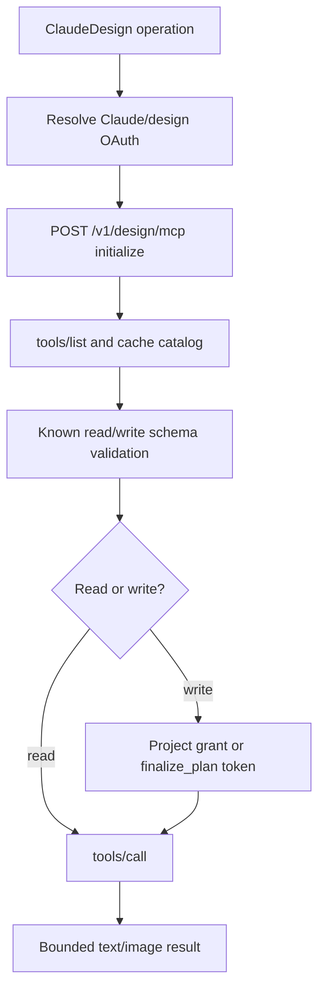

# Claude Design and design-system sync

Claude Code `2.1.215` adds two related but distinct hosted design tools:

- `ClaudeDesign`: a discovery-driven MCP-over-HTTP client for collaborative Claude Design projects.
- `DesignSync`: a fixed-schema bulk synchronization tool used with the bundled `/design-sync` workflow.

The `ClaudeDesign`, `DesignSync`, `allow_design_sync`, and bundled `design-sync` surfaces are absent from the retained `2.1.143` parent bundle. This page joins their authentication and permission architecture without pretending the two tools have the same transport or schema.

## Source anchors

| Semantic alias | Approximate location in `cli.renamed.js` | Exact string or symbol | Meaning |
|---|---:|---|---|
| DesignOAuthScopes | [~28,750](../../claude-code-pkg/src/entrypoints/cli.renamed.js#L28750) | `user:design:read`, `user:design:write` | Dedicated design credential scopes. |
| DesignSyncToolName | [~330,533](../../claude-code-pkg/src/entrypoints/cli.renamed.js#L330533) | `rzr = "DesignSync"` | Fixed-schema design-system synchronization tool. |
| DesignSyncTransport | [~407,980](../../claude-code-pkg/src/entrypoints/cli.renamed.js#L407980) | `anthropic.omelette.api.v1alpha.OmeletteService` | RPC family for project/file/asset synchronization. |
| DesignPlanBoundary | [~409,000-409,799](../../claude-code-pkg/src/entrypoints/cli.renamed.js#L409000) | `finalize_plan`, `planId`, `CLAUDE.md and .claude/ ... are blocked` | Path-scoped approval and reserved-instruction-path checks. |
| DesignSyncDescriptor | [~410,125](../../claude-code-pkg/src/entrypoints/cli.renamed.js#L410125) | `DesignSyncTool = Ai({...})` | Fixed input/output schemas, consent, permissions, and execution. |
| ClaudeDesignToolName | [~410,465](../../claude-code-pkg/src/entrypoints/cli.renamed.js#L410465) | `g6e = "ClaudeDesign"` | Discovery-driven design tool. |
| ClaudeDesignDiscovery | [~410,700-411,100](../../claude-code-pkg/src/entrypoints/cli.renamed.js#L410700) | `initialize`, `tools/list`, `tools/call`, `/v1/design/mcp` | MCP-shaped remote operation discovery and invocation. |
| ClaudeDesignDescriptor | [~411,200](../../claude-code-pkg/src/entrypoints/cli.renamed.js#L411200) | `DesignTool = Ai({...})` | Operation validation, read/write classification, approvals, and result mapping. |
| BundledDesignSyncSkill | [~878,849](../../claude-code-pkg/src/entrypoints/cli.renamed.js#L878849) | `name: design-sync` | Bundled workflow and converter assets for local design-system synchronization. |

## Two tool surfaces

| Surface | Schema model | Main use |
|---|---|---|
| `ClaudeDesign` | Calls `initialize`, then discovers the live operation catalog with `tools/list`; read-only additions may become callable after discovery, while write operations still require client-known validation metadata. | Create and collaboratively edit decks, prototypes, landing pages, mockups, project files, members, sharing, previews, and design conversations. |
| `DesignSync` | Bundled strict schema with a fixed method enum and local validation. | Upload a local React design system, inspect remote project files, and register/remove design-system cards in controlled batches. |

They share authentication/consent helpers, but `ClaudeDesign` talks to `/v1/design/mcp` and `DesignSync` calls the Omelette RPC service. `Artifact` is separate again: it publishes a rendered page rather than editing a collaborative design project.

## Authentication and enablement

Both paths fail closed when nonessential network traffic is disabled. The main credential path uses a first-party Claude.ai token with design scopes. A separate design credential can be stored by `/design-login`, refreshed under a lock, and cleared when refresh proves it invalid.

`ClaudeDesign` additionally requires:

- policy `allow_design_sync`;
- a first-party provider;
- feature gate `tengu_omelette_fouet`.

`DesignSync` requires `allow_design_sync`; first-party sessions are accepted directly, while a separate feature gate controls limited non-first-party exposure. Both can prompt for a browser/manual design login when the current session credential lacks design access.

The server-side consent bit is `agent_design_projects`. The runtime reads `/v1/design/consent`, asks the user when needed, and records or revokes that consent explicitly. Consent is distinct from permission for any particular write batch.

## `ClaudeDesign` lifecycle

The runtime recognizes read operations such as `list_design_systems`, `get_claude_design_prompt`, `list_projects`, `get_project`, `list_files`, `read_file`, `get_conversation`, and `list_members`. Known write operations include project creation, conversations, file writes/copies/deletes, previews, support assets, membership, roles, and sharing.

The live catalog is hashed per conversation. A repeated `list` can return a compact “catalog unchanged” result instead of resending every schema. Unknown read-only operations may be admitted after discovery; unknown or newly write-capable operations fail closed until the client ships a validation schema.

## Write approval model

There are two supported write paths:

1. **Path-scoped plan** — `finalize_plan` names exact writes/deletes and returns a token. Approved tokens are process-local, project-bound, path-bound, and capped to 15 minutes. Deletes and cross-project copies require this flow.
2. **Durable project grant** — an eligible first direct write can ask for an ongoing server-side grant to write any ordinary file in one verified project. The approval card includes a server-verified project name, sharing mode, and URL. It remains revocable in Claude Design settings.

Reserved or ambiguous targets still require per-batch review. `CLAUDE.md`, `.claude/`, path traversal/control characters, and unenumerable target sets cannot silently ride a broad grant. Non-interactive sessions, subagents, plan mode, and PermissionRequest-hook contexts cannot mint the one-time durable grant because the approval cannot reach the user directly.

## `DesignSync` lifecycle

The fixed `DesignSync` method set is:

| Phase | Methods | Boundary |
|---|---|---|
| Discover | `list_projects`, `get_project`, `list_files`, `get_file` | Read-only and bounded/truncated where necessary. |
| Plan | `finalize_plan` | Resolves `localDir`, displays writes/deletes, and records a project/path-scoped in-process plan. |
| Apply | `write_files`, `delete_files` | Requires the matching plan; local files must stay below the approved directory and are opened with `O_NOFOLLOW`. |
| Catalog | `register_assets`, `unregister_assets` | Registers/removes Design System pane cards only for paths covered by the plan. |
| Create/report | `create_project`, `report_validate` | Project creation asks; validation reporting carries aggregate counts only. |

Each write call accepts at most 256 entries. A local file is limited to 12 MiB, must resolve inside the approved `localDir`, and is encoded automatically when binary. `CLAUDE.md` and `.claude/` paths are blocked regardless of the approved plan because they can carry instructions to the design agent.

## Bundled `/design-sync` workflow

The bundled skill turns the tool into a repository-to-project pipeline. Its prompt and bundled converter assets define these durable/local layers:

| Path | Ownership |
|---|---|
| `.design-sync/config.json` | Durable project/source/config pin used by future syncs. |
| `.design-sync/NOTES.md`, `conventions.md`, `previews/`, `overrides/` | User-owned corrections and authored design-system material. |
| `.design-sync/.cache/`, `.design-sync/learnings/`, `.ds-sync/`, build output | Generated or campaign-local state, intended to be reproducible/ignored. |

The workflow builds or probes the local component library, validates previews, records the target project early enough for recovery, uploads through a sentinel/atomic sequence, verifies the remote file list, and retains only durable state needed by later re-syncs. These details are bundled workflow instructions, while the tool definitions above are the runtime enforcement boundary.

## Failure modes

- Wrong provider or restricted nonessential traffic prevents network access before an RPC call.
- Missing/expired credentials route to `/login` or `/design-login`; non-interactive sessions receive an explicit no-interactive-login failure.
- HTTP 401 triggers one credential refresh/retry; another 401 is treated as a server/account access problem rather than looping.
- Consent and project-grant 403 responses are decoded into explicit user-action paths.
- Catalog discovery, initialization, path validation, plan expiry, and reserved-path checks all fail closed.
- The generic design client rejects SSE responses; this build handles JSON results only.

## Related docs

- [Tool inventory and schemas](tool-inventory-and-schemas.md)
- [Built-in tools and permissions](built-in-tools-and-permissions.md)
- [Artifact publishing and live pages](artifact-publishing-and-live-pages.md)
- [Skills system](skills-system.md)
- [Models, providers, and auth](../02-context-model-loop/models-providers-auth.md)
