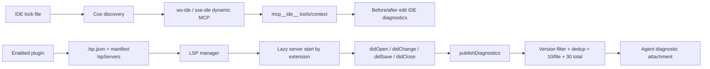

# IDE integration and LSP diagnostics

Claude Code `2.1.215` has two related but independent editor paths:

1. **IDE integration** discovers a running VS Code/Cursor/Devin/JetBrains extension or plugin and connects it as a dynamic MCP server named `ide`.
2. **Plugin LSP support** starts language-server subprocesses from enabled plugin configuration, synchronizes files, and injects bounded diagnostics into agent context.

An IDE connection is not required for plugin LSP, and enabling an LSP server does not mean Claude Code is connected to an IDE. This page owns both lifecycles and the boundary between them.

## Architecture



The IDE extension can expose open files, selected lines, diffs, diagnostics, and IDE-owned MCP tools. Plugin LSP is a local subprocess protocol whose strongest source-confirmed model-facing behavior is diagnostic delivery.

## Source anchors

| Semantic alias | Approximate location in `cli.renamed.js` | Exact symbol or string | Meaning |
|---|---:|---|---|
| IdeDiscovery | [~315,890–316,230](../../claude-code-pkg/src/entrypoints/cli.renamed.js#L315890) | `Coo()`, `~/.claude/ide/*.lock` | Reads extension lock files, validates workspace/process/port, and builds IDE candidates. |
| IdeAutoConnect | [~315,890](../../claude-code-pkg/src/entrypoints/cli.renamed.js#L315890) | `autoConnectIde`, `CLAUDE_CODE_AUTO_CONNECT_IDE` | Enables startup discovery/connection. |
| IdeConnectedNotification | [~316,220](../../claude-code-pkg/src/entrypoints/cli.renamed.js#L316220) | `ide_connected` | Notifies the selected IDE after MCP connection. |
| IdeRpc | [~482,777](../../claude-code-pkg/src/entrypoints/cli.renamed.js#L482777) | `callIdeRpc()` | Calls IDE-owned MCP tools such as `getDiagnostics`/`openFile`. |
| IdeCommand | [~785,630–785,807](../../claude-code-pkg/src/entrypoints/cli.renamed.js#L785630) | `/ide`, `IDECommandFlow`, `IDE_CONNECTION_TIMEOUT_MS = 35000` | Interactive select/connect/disconnect/install/open UI. |
| IdeDynamicTransports | [~484,340–484,740](../../claude-code-pkg/src/entrypoints/cli.renamed.js#L484340) | `sse-ide`, `ws-ide`, `mcp__ide__` | MCP connection and IDE tool registration. |
| IdeEditDiagnostics | [~316,700–316,930](../../claude-code-pkg/src/entrypoints/cli.renamed.js#L316700) | `beforeFileEdited()`, `getNewDiagnostics()` | Captures IDE diagnostic baseline and reports only new post-edit issues. |
| PluginLspConfig | [~317,200–317,420](../../claude-code-pkg/src/entrypoints/cli.renamed.js#L317200) | `.lsp.json`, `lspServers`, `HFg()` | Loads, validates, expands, and namespaces plugin LSP configs. |
| LspDiagnosticRegistry | [~317,000–317,170](../../claude-code-pkg/src/entrypoints/cli.renamed.js#L317000) | `OCu()`, `wFg()`, `NCu()`, `koo = 10`, `DCu = 30` | Pending registry, deduplication, volume limits, and one-time delivery. |
| LspClient | [~320,700–321,000](../../claude-code-pkg/src/entrypoints/cli.renamed.js#L320700) | `createLSPClient()` | Spawns stdio server, speaks LSP, initializes, and shuts down. |
| LspInstance | [~321,000–321,350](../../claude-code-pkg/src/entrypoints/cli.renamed.js#L321000) | `pxu()` | Lifecycle state, crash/restart bounds, configuration, and request retry. |
| LspFileManager | [~321,350–321,560](../../claude-code-pkg/src/entrypoints/cli.renamed.js#L321350) | `mxu()`, `didOpen`, `didChange`, `didSave`, `didClose` | Lazy server selection and bounded open-document synchronization. |
| PassiveDiagnostics | [~321,560–321,750](../../claude-code-pkg/src/entrypoints/cli.renamed.js#L321560) | `textDocument/publishDiagnostics`, `diagnostics:false` | Registers and filters diagnostics per server. |

## IDE discovery and connection

### Lock-file discovery

The IDE extension/plugin advertises itself through a `.lock` file under the Claude config `ide/` directory. A JSON lock record can contain:

```text
workspaceFolders
port
pid
ideName
transport: "ws" | other/SSE
authToken
runningInWindows
```

Older line-based lock files are also parsed as workspace-folder lists. Discovery:

1. scans current-config and compatibility/WSL IDE directories;
2. reads newest lock files first;
3. removes unreadable or stale records when the PID/port no longer proves liveness;
4. matches the current normalized cwd under one advertised workspace folder;
5. applies WSL host/path conversion when the IDE runs on Windows; and
6. emits `ws://host:port` or `http://host:port/sse` candidates.

Inside an embedded IDE terminal, candidate PIDs must also belong to the parent/ancestor chain unless an explicit SSE port selected the instance. This prevents a random same-user IDE from being auto-selected solely because its lock file exists.

### Startup and `/ide`

`--ide`, saved `autoConnectIde`, an embedded IDE terminal, `CLAUDE_CODE_SSE_PORT`, or `CLAUDE_CODE_AUTO_CONNECT_IDE=true` can request startup connection. The discovery helper polls for up to 30 seconds (pausing while scroll draining) and returns only when exactly one valid IDE appears; this is distinct from the later 35-second MCP connection timeout. Ambiguous candidates remain a user choice.

`/ide` performs an explicit scan and shows:

- valid workspace-matching IDEs;
- running IDEs whose workspace does not match;
- the current connection;
- `None` for disconnect; and
- extension/plugin installation help when no endpoint is available.

Selecting an IDE writes a dynamic MCP config:

```text
name: ide
type: ws-ide or sse-ide
url, ideName, authToken, ideRunningInWindows
scope: dynamic
```

The UI waits up to 35 seconds for the MCP client to become connected/failed. Disconnect clears the IDE server cache, removes its client, strips `mcp__ide__*` tools/commands from app state, and removes the dynamic config. VS Code additionally warns that only one Claude Code instance can connect at a time.

### IDE capabilities and diagnostics around edits

After connection, the runtime sends `ide_connected {pid}`. IDE tools are MCP-owned, so exact schemas and UI behavior remain extension contracts. The local runtime nevertheless proves several integrations:

- `callIdeRpc()` invokes IDE methods through the connected MCP client;
- the onboarding UI advertises open-file/selected-line context and IDE diff review;
- `openFile` can focus a file without making the IDE frontmost;
- `beforeFileEdited()` snapshots `getDiagnostics({uri})` for that file; and
- `getNewDiagnostics()` later compares the new IDE diagnostics with the baseline, including special left/right diff URIs, and returns only new issues.

The formatted `<new-diagnostics>` block is capped at 4,000 characters. This IDE baseline path is separate from plugin LSP's asynchronous `publishDiagnostics` registry below.

## Plugin LSP configuration

LSP configurations are loaded from **enabled plugins**, not from the ordinary top-level settings cascade in this build. For each plugin:

1. the root `.lsp.json` is parsed as a server-name map;
2. manifest `lspServers` entries are loaded from contained relative paths or inline maps and merged afterward;
3. invalid files/entries become structured plugin errors;
4. command, args, env, and workspace folder expand plugin-root/data/project variables plus non-sensitive user config;
5. missing environment variables are logged;
6. servers are namespaced as `plugin:<plugin-name>:<server-name>`; and
7. only enabled plugin records contribute.

A relative config path that escapes the plugin directory is rejected. Runtime env includes `CLAUDE_PLUGIN_ROOT`, `CLAUDE_PLUGIN_DATA`, and `CLAUDE_PROJECT_DIR`. See [Plugin lifecycle and configuration](plugin-lifecycle-and-configuration.md#where-option-values-are-exposed) for user-option sensitivity rules.

### Extension conflicts

Each server declares `extensionToLanguage`. The manager keeps an ordered list per lowercased extension but chooses the first server for a file. Later servers claiming the same extension are logged as conflicts and remain unavailable for that extension; the runtime does not merge two language servers' results for one file.

## LSP server lifecycle

### Lazy start and initialization

The manager builds server instances at initialization but starts one only when a file/request needs its extension. `createLSPClient()` spawns the configured command with stdio pipes, Claude's subprocess environment plus config env, and the configured workspace folder.

The initialization request identifies `Claude Code` and advertises:

- workspace configuration requests when settings exist;
- full-document synchronization with `didSave`;
- publish-diagnostic metadata support;
- hover, definition, references, document symbols, and call hierarchy client shapes;
- UTF-16 positions; and
- one fixed workspace folder.

After `initialized`, configured settings are pushed through `workspace/didChangeConfiguration`. A server can request `workspace/configuration`; Claude Code resolves dotted sections from its server `settings` object.

Advertising these capabilities and retaining a generic `sendRequest()` proves protocol support, but it does not by itself prove a model-visible Claude Code tool for every LSP feature. The source-confirmed automatic context path is diagnostics. Do not infer rename, code-action, or workspace-edit UX solely from the capability object.

### File synchronization

For the first file of a supported extension, the manager starts the server and sends `textDocument/didOpen` with full content and a version. Later edits send full-document `didChange` and increment the URI's version; saves send `didSave`.

The manager keeps at most 50 open document URIs in an LRU-like map. Eviction sends `didClose` to the server. There is no universal “all repository files are open” scan: files join this lifecycle when Claude Code's file/edit paths call the manager.

### Crash and request recovery

A nonzero process exit moves the instance to `error` and increments its crash count. The next file/request can start it again unless `restartOnCrash:false`; crash recovery is capped by `maxRestarts` (default 3). This is lazy next-use recovery, not an unconditional immediate restart daemon.

Generic requests retry LSP `ContentModified` (`-32801`) up to three times with 500 ms exponential steps. Other request errors propagate. Startup/shutdown timeouts come from the server config; shutdown sends `shutdown`, then `exit`, disposes the connection, and finally kills any remaining process (using tree termination on Windows).

## Passive diagnostic delivery

Each server with `diagnostics !== false` receives a `textDocument/publishDiagnostics` handler. The handler:

1. checks `uri`/`diagnostics` shape;
2. drops a response whose supplied version is older than the manager's current URI version;
3. maps numeric severity to `Error`, `Warning`, `Info`, or `Hint`;
4. normalizes message/range/source/code;
5. ignores empty batches; and
6. registers a pending diagnostic attachment.

`NCu()` drains all unsent registry entries at the next attachment-consumption boundary. It deduplicates both within the pending batch and against delivered diagnostics, using serialized message/severity/range/source/code identity. Then it:

- sorts each file by severity;
- keeps at most **10 diagnostics per file**;
- keeps at most **30 diagnostics total**;
- remembers delivered identities in an LRU capped at **500 file URIs**; and
- returns one attachment carrying the contributing server names and files.

After a pending entry is marked sent, it is removed; diagnostics are not replayed every turn. File-specific and global reset helpers clear pending/delivered state when file/session lifecycle requires it. If deduplication itself fails, the runtime logs/telemeters the problem and attempts delivery rather than silently discarding the whole batch.

The per-server notification handler also counts consecutive processing/registration failures and emits a prominent debug warning from the third failure onward. It does not disable the server automatically; normal server state and later diagnostics remain independently managed.

## Safe mode, reload, and policy boundaries

- Safe mode's customization matrix disables `lspServers`; the LSP manager does not initialize.
- Project trust affects whether the owning plugin is available; plugin path containment and policy apply before LSP loading.
- `/reload-plugins` rebuilds LSP descriptors and calls the LSP reinitialization owner. `/reload-skills` does not.
- `diagnostics:false` suppresses automatic diagnostic injection while leaving the server available for other generic request paths.
- LSP commands execute local plugin-supplied processes. They are not ordinary model-issued Bash calls and should be treated as trusted plugin code.
- IDE endpoints require a live extension/plugin lock record and dynamic MCP connection. LSP plugin processes do not make `/ide` connected.

## Failure behavior

| Failure | Result |
|---|---|
| Stale/unreadable IDE lock | Removed when possible; candidate omitted. |
| IDE workspace mismatch | Listed as unavailable in `/ide`; not auto-connected. |
| IDE connection exceeds 35 seconds | UI reports timeout and remains disconnected. |
| IDE disconnect selected | Dynamic client/tools/commands and config are removed. |
| Invalid `.lsp.json` or manifest entry | Structured plugin error; valid servers/plugins can continue. |
| LSP config path traversal | Entry rejected before read. |
| Missing command or extension map | Server config rejected during manager initialization. |
| Extension conflict | First server wins that extension; conflict logged. |
| Server command missing/crashes | Instance enters error; next-use recovery follows config/max bounds. |
| Initialization timeout | Server is stopped and the start fails. |
| Stale diagnostic version | Dropped without model-visible output. |
| Diagnostic flood | Severity-sorted truncation to 10/file and 30 total. |
| Shutdown failure | Logged/telemetred; manager still clears its registries. |

## Boundaries and caveats

- IDE extension/plugin implementation, lock-file writer, IDE UI, and IDE-side MCP schemas are outside the retained CLI bundle.
- “IDE diagnostics” (queried through `mcp__ide__getDiagnostics`) and “plugin LSP diagnostics” (`publishDiagnostics`) are different sources with different dedup/lifecycle state.
- LSP client capability advertisement is not proof that Claude Code exposes a corresponding user tool. This page claims only the call paths visible in the client.
- Source symbols and limits are pinned to `2.1.215`; plugin schemas and extension protocols can evolve.

## Related docs

- [Tools, integrations, and security](README.md)
- [Tool runtime, events, and integration flows](tool-runtime-events-and-integrations.md)
- [MCP, plugins, and hooks](mcp-plugins-hooks.md)
- [Plugin lifecycle and configuration](plugin-lifecycle-and-configuration.md)
- [Settings, policy, and integrations](settings-policy-and-integrations.md)
- [Safe mode and recovery](../05-hosted-agent-ops/safe-mode-and-recovery.md)
- [Prompt, context, and memory](../02-context-model-loop/prompt-context-memory.md)
