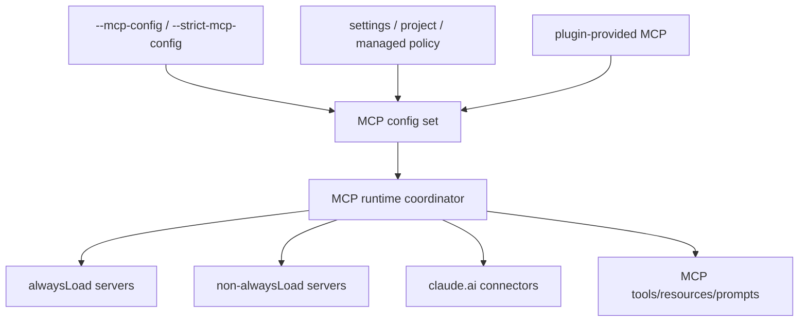
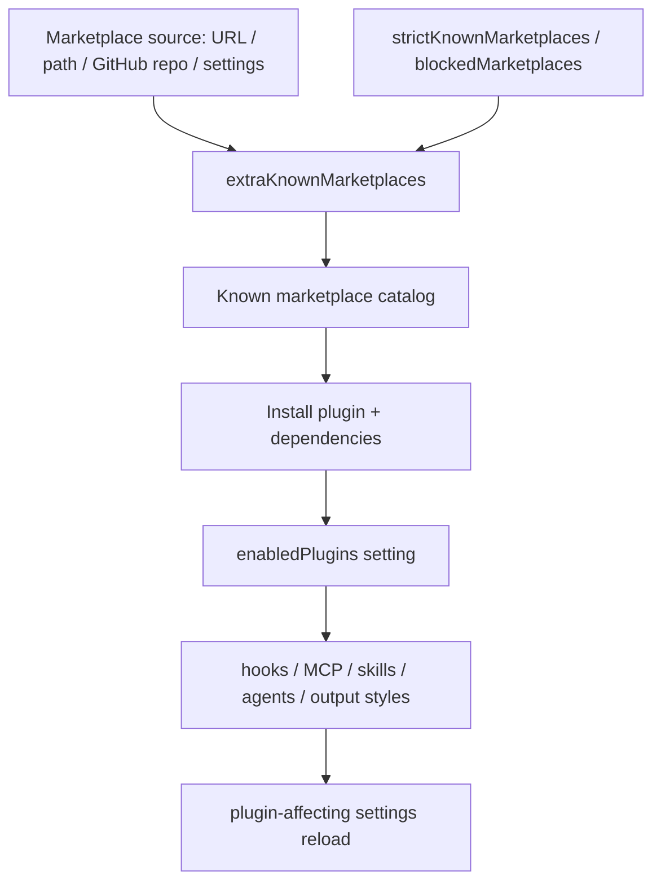

# MCP, plugins, and hooks

This page reverse-engineers the MCP, plugin, and hook surfaces in the analyzed `cli.renamed.js`.

Use [Hooks and events reference](hooks-and-events-reference.md) for the canonical hook/frame/method list and [Tool inventory and schemas](tool-inventory-and-schemas.md) for MCP/plugin tool schema ownership. This page owns MCP/plugin runtime wiring.

## Source anchors

| Semantic alias | String or symbol | Meaning |
| --- | --- | --- |
| McpCommandRegistrar | `function rR4(H)` | Registers the `mcp` command family. |
| McpServeCommand | `command("serve")` | Starts the Claude Code MCP server. |
| McpListCommand | `command("list")` | Lists configured MCP servers. |
| McpDesktopImportCommand | `command("add-from-claude-desktop")` | Imports MCP servers from Claude Desktop. |
| McpProjectChoiceReset | `reset-project-choices` | Resets approved/rejected project-scoped MCP choices. |
| McpNonblockingGate | `MCP_CONNECTION_NONBLOCKING` | Runtime MCP connection non-blocking gate. |
| McpToolTimeout | `MCP_TIMEOUT` | MCP tool timeout environment variable. |
| McpConfigFlag | `--mcp-config <configs...>` | Loads MCP config from JSON files or strings. |
| StrictMcpConfigFlag | `--strict-mcp-config` | Ignores non-flag MCP configurations. |
| PluginCommandRegistrar | `function fC4(H)` | Registers `plugin` / `plugins` command family. |
| PluginTuiManager | `description:"Manage Claude Code plugins"` | In-session slash/TUI plugin management surface. |
| PluginMarketplaceCommand | `Manage Claude Code marketplaces` | CLI marketplace subcommand root. |
| PluginMarketplaceAddCommand | `Add a marketplace from a URL, path, or GitHub repo` | Marketplace add command and source ingestion surface. |
| EnabledPluginsSetting | `enabledPlugins` | Settings key storing enabled plugin IDs and version constraints. |
| ExtraMarketplacesSetting | `extraKnownMarketplaces` | Settings key registering repository/team marketplaces. |
| StrictMarketplacePolicy | `strictKnownMarketplaces` | Managed allowlist for marketplace sources. |
| BlockedMarketplacePolicy | `blockedMarketplaces` | Managed blocklist for marketplace sources. |
| DependencyMarketplacePolicyBlock | `dependency-marketplace-blocked-by-policy` | Plugin dependency install can be blocked by marketplace policy. |
| PluginInstallTelemetry | `plugin_installed` | Plugin install telemetry after dependency resolution and settings write. |
| PluginUninstallTelemetry | `tengu_plugin_uninstalled_cli` | CLI uninstall telemetry and orphan-scan follow-up. |
| PluginDisableTelemetry | `tengu_plugin_disabled_cli` | CLI disable telemetry. |
| PluginUpdateTelemetry | `tengu_plugin_updated_cli` | CLI update telemetry after version check. |
| PluginCacheStaging | `generateTemporaryCacheNameForPlugin`, `cachePlugin` | Plugin sources are staged in a temporary cache directory before manifest validation. |
| PluginManifestLoad | `loadPluginManifest` | Cache materialization depends on `.claude-plugin/plugin.json` or alternate manifest paths. |
| MarketplaceTargetedBulkUpdate | `marketplaceUpdateHandler`, `tengu_marketplace_updated_all` | Marketplace update has targeted and all-marketplace branches. |
| HookEventSchema | `PreToolUse`, `PostToolUse`, `SessionStart`, `SessionEnd` | Hook event schema. |

## Bundle modules in `cli.renamed.js`

| Semantic alias | Loader line(s) | Representative renamed exports | Atlas entry |
|---|---:|---|---|
| `McpChromeBridge` | 13823, 13838, 39107, 39134 | `createBridgeClient`, `createClaudeForChromeMcpServer`, `createChromeSocketClient`, `BridgeClient`, `BROWSER_TOOLS`, `ToolCallTimeoutError`, `SocketConnectionError`, `NoExtensionConnectedError`, `ExtensionDisconnectedMidCallError`, `DISCOVERY_TIMEOUT_MS`, `PEER_WAIT_TIMEOUT_MS`, `WAIT_MAX_DURATION_S` | [Bundle module map — integrations (MCP, plugins, MCPB, LSP)](../99-research-atlas/module-map-from-renamed-cli.md#integrations-mcp-plugins-mcpb-lsp) |
| `McpbExtensionPackaging` | 268617, 271802, 271894, 272295, 272401 | `verifyMcpbFile`, `signMcpbFile`, `unsignMcpbFile`, `unpackExtension`, `verifyCertificateChain`, `validateManifest`, `readMcpbIgnorePatterns`, `readPackageJson`, `replaceVariables`, `shouldExclude`, `promptVisualAssets`, `promptUserConfig` | [Bundle module map — integrations (MCP, plugins, MCPB, LSP)](../99-research-atlas/module-map-from-renamed-cli.md#integrations-mcp-plugins-mcpb-lsp) |
| `PluginLoader` | 276711 | `loadAllPlugins`, `loadAllPluginsCacheOnly`, `loadPluginManifest`, `loadSkillsAsPlugins`, `resolvePluginPath`, `resolveContainedPluginPath`, `mergePluginSources`, `probeSeedCacheAnyVersion` | [Bundle module map — integrations (MCP, plugins, MCPB, LSP)](../99-research-atlas/module-map-from-renamed-cli.md#integrations-mcp-plugins-mcpb-lsp) |
| `PluginCommandHandlers` | 644148 | `pluginInstallHandler`, `pluginUninstallHandler`, `pluginListHandler`, `pluginInitHandler`, `pluginTagHandler`, `pluginPruneHandler`, `pluginValidateHandler`, `pluginUpdateHandler` | [Bundle module map — integrations (MCP, plugins, MCPB, LSP)](../99-research-atlas/module-map-from-renamed-cli.md#integrations-mcp-plugins-mcpb-lsp) |
| `HookEventDispatcher` | 629735 | `shouldSkipHookDueToTrust`, `hasWorktreeCreateHook`, `hasInstructionsLoadedHook`, `getUserPromptSubmitHookBlockingMessage`, `persistHookOutput`, `parseElicitationHookOutput`, `getTaskCreatedHookMessage`, `getTaskCompletedHookMessage` | [Bundle module map — permission, trust, hooks, and policy](../99-research-atlas/module-map-from-renamed-cli.md#permission-trust-hooks-and-policy) |

## MCP runtime map



`McpRuntimeCoordinator` splits regular configs into always-load and non-always-load groups, honors `MCP_CONNECTION_NONBLOCKING`, connects regular and claude.ai connector configs, and deduplicates overlapping plugin/connector surfaces.

## MCP command surface

| Subcommand | Runtime role |
|---|---|
| `serve` | Starts Claude Code's MCP server. |
| `list` | Lists configured MCP servers; help text warns that stdio servers can be spawned for health checks. |
| `add`, `remove`, `get`, `add-json` | Present in the command family by surrounding command registration, though individual anchors are less stable than `McpCommandRegistrar`. |
| `add-from-claude-desktop` | Imports MCP servers from Claude Desktop on supported platforms. |
| `reset-project-choices` | Clears project-scoped approve/reject choices for `.mcp.json` servers. |

## Plugin surfaces

`PluginCommandRegistrar` registers `plugin` / `plugins`. High-signal plugin strings show:

- session-only plugins through `--plugin-dir` and `--plugin-url`;
- marketplace concepts and reserved marketplace names;
- plugin-provided `agents`, `skills`, `hooks`, `mcpServers`, and `outputStyles` schema surfaces;
- plugin autoupdate guarded by updater state.

## Plugin marketplace lifecycle

The plugin path has two user-facing entry surfaces: an in-session slash/TUI plugin menu and the CLI `plugin` / `plugins` command family. The CLI tree contains a marketplace root with add/list/update/remove-style wording, while settings and policy carry the durable state.



| Stage | Source-visible evidence | Runtime implication |
|---|---|---|
| Register marketplace | `marketplace add <source>`, `extraKnownMarketplaces`, sparse checkout and scope options | Marketplaces can be declared from CLI or settings and scoped to user/project/local contexts. |
| Apply policy | `strictKnownMarketplaces`, `blockedMarketplaces`, `dependency-marketplace-blocked-by-policy` | Managed policy can allowlist or block sources before plugin/dependency installation completes. |
| Install plugin | `plugin_installed`, dependency closure handling, `enabledPlugins` writes | Install resolves dependency closure, writes enabled plugin state, and emits plugin/marketplace telemetry. |
| Update plugin | `tengu_plugin_updated_cli`, `autoUpdate` settings | Updates can be triggered from CLI and may be gated by marketplace auto-update configuration. |
| Disable or uninstall | `tengu_plugin_disabled_cli`, `tengu_plugin_uninstalled_cli` | Disable changes enabled state; uninstall can also run orphan scans/pruning. |
| Runtime contribution | plugin `hooks`, `mcpServers`, `skills`, `agents`, `outputStyles` | Enabled plugins become capability injectors, but still flow through settings, hooks, MCP, and permission boundaries. |

This narrows the previous marketplace gap from “command surfaces only” to a lifecycle model: source registration, policy filtering, dependency resolution, enabled-state writes, update/disable/uninstall operations, and runtime capability reloads. The remaining gap is exact per-command UI flow and every option branch inside the lazy-loaded marketplace handlers.

### Plugin cache staging

The decoded plugin-cache chunk shows a write-then-validate flow. `cachePlugin` creates a temporary cache directory under the plugin cache root, copies or installs the source there, then calls `loadPluginManifest` before returning a materialized plugin record. The observed temporary name includes source kind, timestamp, and a random suffix (`temp_<source>_<time>_<rand>`), but the stable behavior to rely on is the staging boundary: source acquisition happens before manifest validation and final cache reuse.

Supported source branches include local copies, npm packages, GitHub/git URLs, and git subdirectories. The same chunk also preserves safety details such as contained path resolution, safe symlink handling during local copy, and POSIX filtering for exported plugin `bin` paths.

`marketplaceUpdateHandler` has two visible branches: a named marketplace update emits `tengu_marketplace_updated`, while the no-name branch loads all configured marketplaces and emits `tengu_marketplace_updated_all` with a count. Individual plugin update still delegates to a lower-level updater, so this page documents the update surface and telemetry rather than every update/install branch.

## Hook events

The hook schema includes these high-signal lifecycle events:

| Hook family | Examples |
|---|---|
| Tool lifecycle | `PreToolUse`, `PostToolUse`, `PostToolUseFailure`, `PostToolBatch` |
| Prompt/session lifecycle | `UserPromptSubmit`, `UserPromptExpansion`, `SessionStart`, `SessionEnd` |
| Stop/compaction | `Stop`, `StopFailure`, `PreCompact`, `PostCompact` |
| Agent/task lifecycle | `SubagentStart`, `SubagentStop`, `TaskCreated`, `TaskCompleted` |
| Permission/config/worktree | `PermissionRequest`, `PermissionDenied`, `ConfigChange`, `WorktreeCreate`, `WorktreeRemove` |

## Security interpretation

MCP and plugins extend model-visible capabilities, but they do not bypass the rest of the runtime. The same command surface also exposes strict config, project-choice reset, hook validation, timeouts, and permission-prompt routing, which indicates that external capabilities are integrated through guarded runtime boundaries.

## MCP runtime internals

This section separates MCP command management from runtime MCP connection and event handling.

### Additional anchors

| Semantic alias | String or symbol | Meaning |
| --- | --- | --- |
| McpRuntimeCoordinator | `function fH9(H)` | Runtime MCP connection coordinator. |
| RequiredMcpConfigSplit | `alwaysLoad===!0` | Split between required and normal MCP configs. |
| RequiredMcpConnectLabel | `--mcp-config alwaysLoad servers` | Required MCP config connect label. |
| ClaudeAiConnectorLabel | `claude.ai connectors` | Runtime connector connect label. |
| McpToolsListSchema | `tools/list` | MCP tools/list protocol schema. |
| McpResourceListSchemas | `resources/list`, `resources/templates/list` | MCP resource listing schemas. |
| McpPromptSchemas | `prompts/list`, `prompts/get` | MCP prompt listing/get schemas. |
| McpToolTimeoutEnv | `MCP_TIMEOUT` | MCP tool timeout env var, defaulting to 30000 ms. |
| McpConnectTimeoutEnv | `MCP_CONNECT_TIMEOUT_MS` | MCP connection timeout env var, defaulting to 5000 ms. |
| McpAuthErrorTelemetry | `tengu_mcp_tool_call_auth_error` | MCP tool-call auth-expiry telemetry/error path. |
| McpElicitationFrame | `elicitation_complete` | MCP elicitation completion is bridged into headless frames. |

### Runtime coordinator

The complete `McpRuntimeCoordinator` function is small enough to reconstruct:

1. Receives `regularMcpConfigs`, `claudeaiConfigPromise`, and state.
2. Computes a non-blocking flag from `MCP_CONNECTION_NONBLOCKING` or an explicit `nonBlocking` option.
3. Stores the non-blocking state through `IV8(_)`.
4. Partitions regular MCP configs into `alwaysLoad === true` and all other configs.
5. Returned `connect()` starts two parallel connection groups: regular configs via `Br6(...)` and claude.ai connectors via `kKA(...)` after `claudeaiConfigPromise` resolves.
6. Records startup markers `before_mcp_connect_user`, `before_mcp_connect_connector`, `after_mcp_connect_user`, `after_mcp_connect_connector`.

```mermaid
flowchart TD
    Input[regularMcpConfigs + claudeaiConfigPromise] --> NonBlocking[MCP_CONNECTION_NONBLOCKING]
    Input --> Split[split alwaysLoad vs normal]
    Split --> Required[alwaysLoad servers]
    Split --> Normal[regular servers]
    Input --> Connectors[claude.ai connectors]
    Required --> Connect[connect() Promise.all]
    Normal --> Connect
    Connectors --> Connect
```

### Required versus non-required servers

The `alwaysLoad` split is important. Required servers are labeled `--mcp-config alwaysLoad servers` and normal servers as `--mcp-config servers`. Required servers are connected as a distinct group; normal servers can honor non-blocking/deferred behavior; claude.ai connectors are a separate promise-driven group. Because `connect()` awaits both groups, the final headless startup waits for the coordinator as a whole even when parts are internally non-blocking.

### MCP protocol surfaces

| Protocol method | Role |
|---|---|
| `tools/list` | Lists tools exposed by an MCP server. |
| `resources/list` | Lists resources. |
| `resources/templates/list` | Lists resource templates. |
| `prompts/list` | Lists prompts. |
| `prompts/get` | Retrieves a prompt by name/arguments. |

These schema anchors are paired with runtime anchors in `McpRuntimeCoordinator`, `McpCommandRegistrar`, `HeadlessControlLoop`, and MCP tool-call error handling, confirming MCP as both a command/config system and a runtime capability provider.

### Timeout and auth-error mechanics

- `MCP_TIMEOUT` → tool-call timeout, falling back to `30000` ms.
- `MCP_CONNECT_TIMEOUT_MS` → connection timeout, falling back to `5000` ms.

The MCP tool-call error path has a specific auth branch: on `401` or token-expiry-like errors, the runtime emits `tengu_mcp_tool_call_auth_error` and raises a user-facing error requiring re-authorization.

### Elicitation and headless integration

MCP elicitation completion is visible in two places: the MCP client handles an elicitation completion notification and marks queued elicitation state as complete; `HeadlessControlLoop` emits `system` / `elicitation_complete` frames with `mcp_server_name` and `elicitation_id`. URL-mode elicitation is observable as a headless/SDK stream frame.

### Command tree versus runtime connection

| Surface | Function | Role |
|---|---|---|
| `claude mcp ...` | `McpCommandRegistrar` | Manage config and run the MCP server. |
| root action headless setup | `McpRuntimeCoordinator` | Connect runtime MCP servers/connectors for a session. |
| MCP protocol schemas | line ~95 schemas | Define method/result shapes. |
| Headless stream loop | `HeadlessControlLoop` | Emits MCP-related status, elicitation, auth, and tool-call state to headless consumers. |

## Plugin hot reload and hook cache

The `PluginHotReload` module (`cli.renamed.js:288518`-`288560`) keeps plugin-contributed hooks fresh without restarting the session. The `PluginInstallLifecycle` module (`cli.renamed.js:545539`-`545700`, plus `kickOffBackgroundPluginInstall` at `722995`) handles plugin discovery, installation, and pruning.

### Plugin-affecting settings snapshot

`getPluginAffectingSettingsSnapshot()` builds a JSON-stable snapshot of the slice of settings that influence which plugins are active (`enabledPlugins`, marketplace lists, etc.). The watcher compares the new snapshot against the previous one; when they differ, plugin hooks are re-loaded.

### Hot-reload runtime (`setupPluginHookHotReload`, `loadPluginHooks`)

`setupPluginHookHotReload()`:

1. Subscribes to settings changes for the slice returned by `getPluginAffectingSettingsSnapshot()`.
2. On change, calls `pruneRemovedPluginHooks()` (removes hooks whose owning plugin is no longer enabled) and `loadPluginHooks()` (re-registers hooks for currently enabled plugins).
3. Caches the materialized hook records so the [hook dispatcher](hooks-and-events-reference.md#runtime-dispatcher-internals) does not re-parse plugin manifests on every dispatch.

`clearPluginHookCache()` is the brute-force invalidator used after major settings churn (settings file replaced wholesale, marketplace re-installed). `resetHotReloadState()` clears the watcher state so tests can rebuild it cleanly.

`pruneRemovedPluginHooks()` walks the hook cache, finds entries whose `pluginId` is no longer in `enabledPlugins`, and removes them from the dispatcher cache. This is also the path that kicks in when a user disables a plugin via `/plugin disable`.

### Install lifecycle (`checkEnabledPlugins`, `getInstalledPlugins`, `findMissingPlugins`, `installSelectedPlugins`)

- `checkEnabledPlugins()` compares the `enabledPlugins` setting (per source) against the on-disk plugin cache. Returns a structured result listing missing installs and version mismatches.
- `getInstalledPlugins()` enumerates plugins materialized in the cache (`~/.claude/plugins/cache/...`).
- `findMissingPlugins(enabled)` returns the subset of `enabledPlugins` whose cache entries are missing or out of date.
- `installSelectedPlugins(selection, options, source = "user")` materializes the selection: stages downloads in a temp cache (via `generateTemporaryCacheNameForPlugin` / `cachePlugin`), validates the manifest (`loadPluginManifest`), then promotes to the live cache. The `source` argument controls which settings tier records the install.
- `getPluginEditableScopes()` / `isPersistableScope(scope)` / `settingSourceToScope(source)` decide where install records may be written (e.g. managed-policy installs are not editable from the user shell).

### Background install (`kickOffBackgroundPluginInstall`)

`kickOffBackgroundPluginInstall(missing)` schedules `installSelectedPlugins(missing, {...})` to run in the background after the current turn settles. It is the path used during session startup when `enabledPlugins` references a plugin that is not yet installed: the runtime announces the install in the UI but does not block the session on the download. Failures surface as task notifications.

## Related docs

- [Tool inventory and schemas](tool-inventory-and-schemas.md)
- [Hooks and events reference](hooks-and-events-reference.md)
- [Tool runtime and security architecture](architecture.md)
- [Built-in tools and permissions](built-in-tools-and-permissions.md)
- [Settings, policy, and integrations](settings-policy-and-integrations.md)
- [Headless streaming and resilience](../02-context-model-loop/headless-streaming-and-resilience.md)
- [SDK query, session API, and subagent surface](../04-sessions-persistence-remote/sdk-query-and-session-api.md)
