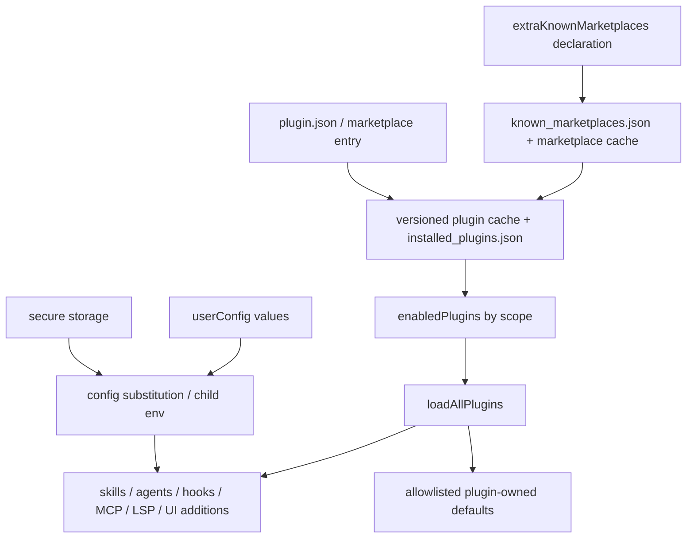
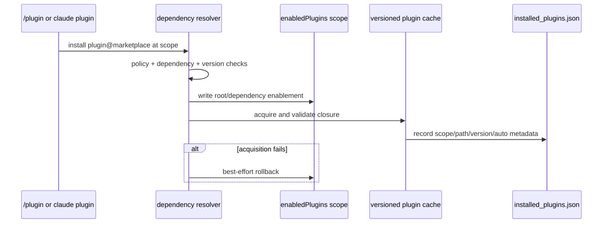

# Plugin lifecycle and configuration

Claude Code plugins are add-on bundles that can contribute skills/commands, agents, hooks, MCP and LSP servers, output styles, themes, workflows, monitors, and a small allowlisted settings slice. A plugin is not one configuration record: marketplace declaration, downloaded installation state, enablement, manifest metadata, plugin-owned defaults, and user-supplied options are separate layers with different stores and precedence rules.

This page describes the local plugin lifecycle in `@anthropic-ai/claude-code@2.1.215`. Use [MCP, plugins, and hooks](mcp-plugins-hooks.md) for marketplace acquisition and MCP/hook execution details, and [Settings, policy, and integrations](settings-policy-and-integrations.md) for the general settings merge.

## Short answer



The important separations are:

| Layer | Primary state | What it means |
|---|---|---|
| Marketplace declaration | `extraKnownMarketplaces` in settings | A scope declares where a named marketplace comes from. |
| Marketplace materialization | `known_marketplaces.json` plus local cache | Claude Code acquired and validated a marketplace source. |
| Installation | versioned cache plus `installed_plugins.json` | One plugin version exists at user/project/local/managed installation scope. |
| Enablement | `enabledPlugins` | The effective settings cascade decides whether that installed or discoverable plugin is active. |
| Manifest | `.claude-plugin/plugin.json` or marketplace entry | Declares components, dependencies, defaults, and option schemas. |
| Plugin-owned defaults | plugin `settings.json` or manifest `settings` | Low-precedence defaults for a small allowlist; not arbitrary settings injection. |
| User options | `pluginConfigs` plus secure storage | Values for manifest `userConfig`; distinct from enablement and plugin-owned defaults. |

## Source anchors

| Semantic alias | Approximate location in `cli.renamed.js` | Exact string or symbol | Meaning |
|---|---:|---|---|
| PluginManifestSchema | [~68,800–70,100](../../claude-code-pkg/src/entrypoints/cli.renamed.js#L68800) | `_At()`, `userConfig`, `defaultEnabled`, `dependencies` | Canonical plugin manifest and configurable-option schema. |
| EnabledPluginsSchema | [~71,119](../../claude-code-pkg/src/entrypoints/cli.renamed.js#L71119) | `enabledPlugins` | Scoped enable/disable and extended version-constraint setting. |
| PluginConfigsSchema | [~71,325](../../claude-code-pkg/src/entrypoints/cli.renamed.js#L71325) | `pluginConfigs`, `options`, `mcpServers` | Non-sensitive persisted plugin and channel/MCP option values. |
| PluginOptionResolver | [~227,482](../../claude-code-pkg/src/entrypoints/cli.renamed.js#L227482) | `MGr()`, `Apg` | Merges plugin options only from user, flag/SDK, and policy settings. |
| PluginOptionStorage | [~253,730](../../claude-code-pkg/src/entrypoints/cli.renamed.js#L253730) | `fJt()`, `mJt()`, `pluginSecrets` | Splits non-sensitive options into user settings and sensitive options into secure storage. |
| PluginSubstitution | [~253,845](../../claude-code-pkg/src/entrypoints/cli.renamed.js#L253845) | `Fxt()`, `lQn()`, `CLAUDE_PLUGIN_OPTION_` | Runtime expansion and sensitive-content filtering. |
| PluginMcpConfiguration | [~281,090–281,310](../../claude-code-pkg/src/entrypoints/cli.renamed.js#L281090) | `skg()`, `lkg()`, `Keo()` | Combines defaults/options and expands plugin MCP definitions. |
| PluginLspConfiguration | [~317,269–317,420](../../claude-code-pkg/src/entrypoints/cli.renamed.js#L317269) | `Zkt()`, `HFg()`, `UCu()` | Loads, validates, expands, and namespaces plugin LSP servers. |
| BackgroundPluginRefresh | [~952,596–953,070](../../claude-code-pkg/src/entrypoints/cli.renamed.js#L952596) | `CLAUDE_CODE_ENABLE_BACKGROUND_PLUGIN_REFRESH` | Lets the stream/headless loop reconcile deferred plugin state before later command drains. |
| PluginHookHotReload | [~334,264](../../claude-code-pkg/src/entrypoints/cli.renamed.js#L334264) | `getPluginAffectingSettingsSnapshot()`, `setupPluginHookHotReload()` | Managed-policy changes can invalidate and reload plugin hooks. |
| PluginInstaller | [~470,000–470,620](../../claude-code-pkg/src/entrypoints/cli.renamed.js#L470000) | `kJr()` | Resolves dependency closure, writes enablement, materializes caches, and attempts rollback on failure. |
| PluginManifestLoader | [~471,592](../../claude-code-pkg/src/entrypoints/cli.renamed.js#L471592) | `loadPluginManifest()` | Reads and validates `.claude-plugin/plugin.json`, with marketplace fallback behavior. |
| PluginAssembler | [~471,900–473,730](../../claude-code-pkg/src/entrypoints/cli.renamed.js#L471900) | `createPluginFromPath()`, `mergePluginSources()`, `loadAllPlugins()` | Resolves component paths, source precedence, partial errors, and enabled/disabled sets. |
| PluginDefaultSettings | [~473,570](../../claude-code-pkg/src/entrypoints/cli.renamed.js#L473570) | `Dgy()`, `cachePluginSettings()`, `cnd` | Loads allowlisted plugin defaults before ordinary settings layers. |
| PluginCliConfig | [~654,099](../../claude-code-pkg/src/entrypoints/cli.renamed.js#L654099) | `--config`, `oS_()`, `iS_()` | Validates repeated `KEY=VALUE` options after CLI installation. |
| PluginInteractiveConfig | [~795,996–802,400](../../claude-code-pkg/src/entrypoints/cli.renamed.js#L795996) | `/plugin configure`, `fJt()` | Interactive option editor using the same storage split. |

## Discovery and source precedence

`loadAllPlugins()` assembles four source families:

1. **Session-only plugins** from `--plugin-dir`, `--plugin-url`, and host-synced directories.
2. **Installed marketplace plugins** resolved from settings, marketplace state, and the versioned cache.
3. **Skills-directory plugins** discovered from user/project skill roots that contain plugin metadata.
4. **Built-in plugins** registered by the runtime.

`mergePluginSources()` applies name-level collision rules before component loading:

- a managed plugin name blocks a same-name session-only plugin;
- a session-only plugin overrides an installed marketplace plugin with that name;
- an installed or session-only plugin shadows a same-name skills-directory plugin;
- user skills-directory plugins shadow same-name project copies;
- project skills-directory plugins are suppressed until workspace trust is accepted.

This is plugin-source precedence, not settings precedence. Once the plugin list is assembled, `enabledPlugins` and dependency checks decide which records are active.

## Marketplace, installation, and enablement

Marketplace declaration/materialization is documented in [Plugin marketplace lifecycle](mcp-plugins-hooks.md#plugin-marketplace-lifecycle). Installing a plugin adds another two layers:



### Install scopes

The editable installation scopes are `user`, `project`, and `local`:

| Scope | Settings source | Installation identity |
|---|---|---|
| `user` | `~/.claude/settings.json` | Shared across projects for the user. |
| `project` | `.claude/settings.json` | Team-shared enablement for the current project. |
| `local` | `.claude/settings.local.json` | Private override for the current project. |

The installation registry can also contain managed entries, but CLI mutation rejects managed scope. Project/local entries carry a `projectPath` keyed to the original working directory, so one user can retain installations of the same plugin for different project directories. Scope resolution prefers a local entry matching the current original cwd, then a matching project entry, then a user entry.

### `enabledPlugins`

Ordinary entries use `plugin@marketplace` keys:

```json
{
  "enabledPlugins": {
    "formatter@company-tools": true,
    "legacy-helper@company-tools": false
  }
}
```

For unrestricted top-level keys, the normal settings order is user → project → local → flag/SDK → policy. Therefore a project `true` overrides a user `false`, a local `false` can override the project for one user, and managed policy is not locally overridable. The runtime reports ineffective lower-scope disables and points at the winning source.

The schema also accepts arrays of strings as an extended representation for dependency version constraints. Those arrays are not equivalent to `true`; dependency resolution and autoupdate use them as pinner input. Ordinary users should use the plugin commands rather than hand-authoring that internal shape.

`defaultEnabled` applies only when no explicit setting exists. `defaultEnabled:false` leaves the plugin installable/discoverable but does not activate it merely because it was installed. An enabled dependent can make a default-disabled dependency active when no explicit disable overrides it; an explicit higher-scope `false` blocks dependency activation and is reported to the user. Disabling a plugin is blocked while active reverse dependencies still require it unless the coordinated bulk-disable path handles the whole set.

### Installation is recoverable, not one transaction

The resolver writes the intended `enabledPlugins` closure before all downloads finish so dependency state is explicit. If acquisition fails it attempts to restore the prior values. A failed rollback is logged with manual recovery guidance. Versioned cache/state writes and settings writes are therefore coordinated but not one crash-atomic transaction.

Auto-installed dependencies carry `auto: true`; `plugin prune` removes only auto-installed entries no longer reachable from an enabled root. Manual installs are preserved.

## Manifest and component loading

`loadPluginManifest()` first checks `.claude-plugin/plugin.json`. Strict marketplace entries require a valid manifest; non-strict entries can supply canonical metadata themselves. Every component path is resolved below the plugin root, and traversal or missing paths become structured plugin errors rather than arbitrary filesystem reads.

### Implicit versus explicit component paths

| Component | Implicit source | Explicit behavior |
|---|---|---|
| Commands | `commands/` | Manifest `commands` replaces the implicit directory scan; values can be paths or inline metadata/content. |
| Agents | `agents/` | Manifest `agents` replaces the implicit directory scan. |
| Skills | `skills/` and, in supported layouts, root `SKILL.md` | Explicit skill directories are generally additive, with marketplace-root special cases. |
| Hooks | `hooks/hooks.json` | Manifest hooks are added; duplicate references to the implicit file are detected. |
| MCP servers | root `.mcp.json` | Manifest `mcpServers` is merged after the root file. |
| LSP servers | root `.lsp.json` | Manifest `lspServers` is merged after the root file; see [IDE integration and LSP diagnostics](ide-integration-and-lsp-diagnostics.md#plugin-lsp-configuration). |
| Output styles | `output-styles/` | Explicit field replaces implicit directory loading. |
| Themes | `themes/` | Explicit field replaces implicit directory loading. |
| Workflows | `workflows/` | Explicit field replaces implicit directory loading. |
| Monitors | `monitors/monitors.json` | Manifest/experimental monitor declaration replaces the implicit file. |
| Plugin defaults | root `settings.json` | Valid allowlisted file values win over manifest `settings`; malformed file input falls back to manifest values. |

A failure in one plugin or component does not necessarily erase every other plugin. The loader returns enabled/disabled records alongside errors and warnings, emits a partial-failure outcome when appropriate, and only classifies the whole load as failed when no plugin survives.

## Plugin-owned default settings

Plugins cannot inject arbitrary settings through their manifest. In this artifact `Dgy()` validates plugin `settings.json` or manifest `settings` against a pick-list built from:

```text
agent
subagentStatusLine
```

Enabled-plugin defaults are aggregated by `cachePluginSettings()`. If two enabled plugins supply the same key, the later record in the assembled plugin list wins and a debug warning is emitted. The resulting object is inserted before user/project/local/flag/policy settings in `SSi()`, so ordinary settings override it.

This layer is distinct from `pluginConfigs`:

- plugin-owned defaults change an allowlisted Claude Code setting while the plugin is enabled;
- `pluginConfigs` stores values the user supplied for that plugin's own `userConfig` schema.

## `userConfig`: plugin-specific options

A plugin manifest can declare named options with these fields:

| Field | Meaning |
|---|---|
| `type` | `string`, `number`, `boolean`, `directory`, or `file`. |
| `title`, `description` | UI label and help text. |
| `required` | Empty/missing values fail validation. |
| `default` | String, number, boolean, or string-array default. |
| `multiple` | Allows an array for a string option. |
| `sensitive` | Masks input and stores the value outside settings JSON. |
| `min`, `max` | Bounds numeric options. |

Option keys must match `^[A-Za-z_]\w*$` because hooks receive corresponding `CLAUDE_PLUGIN_OPTION_<KEY>` environment variables.

### Resolution and storage

`MGr(pluginId)` merges only these settings sources, in order:

```text
userSettings → flagSettings → policySettings
```

Project and local `pluginConfigs` are deliberately absent from this resolver. This prevents repository-controlled settings from supplying plugin secrets/options. Secure-storage values are merged last and override settings values.

The interactive `/plugin configure <plugin>` flow and CLI installation's repeatable `--config KEY=VALUE` use the same validator/storage split:

| Value class | Persistence |
|---|---|
| Non-sensitive plugin option | `userSettings.pluginConfigs[pluginId].options` |
| Sensitive plugin option | `pluginSecrets[pluginId]` in secure storage |
| Non-sensitive channel/MCP option | `userSettings.pluginConfigs[pluginId].mcpServers[server]` |
| Sensitive channel/MCP option | `pluginSecrets[pluginId/server]` in secure storage |

Both interactive and install-time option writes persist the non-sensitive half to **user** `pluginConfigs`; there is no project/local option-write mode. That matches `MGr()`'s user → flag/SDK → policy read path. Project/local scoping applies to plugin installation/enablement, not to `userConfig` values.

When a schema changes from sensitive to non-sensitive or the reverse, save paths scrub stale copies from the wrong store. Uninstalling the final installation removes plugin options/secrets and normally removes the plugin data directory.

Example persisted non-sensitive state:

```json
{
  "pluginConfigs": {
    "deploy@company-tools": {
      "options": {
        "REGION": "us-east-1"
      }
    }
  }
}
```

A sensitive `TOKEN` option would not appear in that JSON.

### Missing and defaulted values

Runtime option reads combine stored values with secure storage. Component-specific helpers then add schema defaults. Required options without defaults remain missing and can produce a configure prompt, skip an MCPB server, or attach a component configuration error. Installing the plugin itself can still succeed; “installed” does not guarantee that every configurable component is runnable.

## Where option values are exposed

| Consumer | Behavior |
|---|---|
| MCP server config | Expands `${user_config.KEY}` in command, args, env, URL, and headers after plugin-root/data variables. Missing env/config values produce structured config errors. A shell-based `headersHelper` may not interpolate `user_config` directly. |
| LSP server config | Expands `${user_config.KEY}` in command, args, env, and workspace folder; reports missing environment variables. |
| Command hooks | Exec-form fields can substitute user config. Shell-form commands that reference `${user_config.*}` are rejected because the value would be reparsed by a shell. Every option is additionally exported as a normalized `CLAUDE_PLUGIN_OPTION_<KEY>` child variable. |
| Skills and agents | Non-sensitive options may be substituted into content. Sensitive fields become a literal “sensitive option … not available” placeholder. |
| Monitors | Direct `${user_config.*}` references are rejected because monitor commands are shell strings; the script must read from a safer configuration channel. |

`CLAUDE_PLUGIN_ROOT`, `CLAUDE_PLUGIN_DATA`, and `CLAUDE_PROJECT_DIR` are separate runtime variables. `CLAUDE_PLUGIN_DATA` points to a per-plugin local data directory and is not the same store as `pluginConfigs` or secure storage.

## Reload and activation boundaries

Different changes have different activation costs:

| Change | Current-session behavior |
|---|---|
| User/project/local `enabledPlugins` edit | An accepted settings event refreshes the effective settings/app state, but the automatic plugin-hook subscriber ignores non-policy sources and no full plugin contribution rebuild follows. Run `/reload-plugins` or restart. |
| Managed plugin-affecting policy change | On a `policySettings` event, `setupPluginHookHotReload()` compares effective `enabledPlugins`/`extraKnownMarketplaces` plus policy `strictKnownMarketplaces`, `blockedMarketplaces`, and `disableSideloadFlags`; a changed snapshot invalidates plugin caches and reloads plugin hooks. User/project/local declaration events and `known_marketplaces.json` materialization do not trigger this path. |
| `/plugin configure` option save | Option caches are cleared immediately. Components that were already instantiated may still require `/reload-plugins`, MCP reconnect, or restart according to their owner. |
| `/reload-plugins [--force]` | Rebuilds plugin cache view, commands/skills, agents, hooks, MCP and LSP descriptors, and can repair eligible missing dependencies. |
| `/reload-skills` | Re-enumerates skills only; it does not rebuild the full plugin contribution set. |
| Plugin update | CLI output says restart to apply the new version. |
| Deferred startup install/state change with `CLAUDE_CODE_ENABLE_BACKGROUND_PLUGIN_REFRESH=true` | Before later stream/headless command-queue drains, the loop clears a `needsRefresh`/late-install marker and runs the plugin-state refresh owner. Failure is logged and the queue continues. This is conditional reconciliation, not periodic marketplace polling or a complete contribution hot reload. |

The full reload command first checks whether changing plugin MCP tool names would invalidate prompt-cache assumptions. Without Tool Search protection, it can require `--force` after conversation output exists.

## Trust, policy, and safe mode

- Workspace trust gates project/local marketplace declarations and project skills-directory plugins.
- Safe mode skips plugin loading and registration; managed settings-file policy still applies separately.
- `strictKnownMarketplaces` and `blockedMarketplaces` constrain marketplace sources before acquisition/use.
- `disableSideloadFlags` rejects `--plugin-dir` and `--plugin-url` rather than letting flags bypass marketplace policy.
- `strictPluginOnlyCustomization` can require selected customization families to come from plugins or managed/built-in sources.
- Managed `enabledPlugins` values win over lower settings scopes. A local setting cannot disable a plugin that policy explicitly enables.
- Plugin paths, component declarations, local copies, Git SHAs, archives, and cache paths have containment/integrity checks, but plugin code and hooks remain executable local extensions and should be treated as trusted code.

## Failure and cleanup behavior

| Failure | Result |
|---|---|
| Invalid/corrupt `plugin.json` | Structured manifest load error; strict plugin is not loaded. |
| One component path escapes the root | That component records a traversal error; other valid components can survive. |
| Missing required `userConfig` | Configuration UI/error or affected server suppression; plugin installation can remain. |
| Dependency cycle/range conflict | Installation or enable operation stops with the dependency chain/range reason. |
| Cross-marketplace dependency not allowed | Automatic dependency installation stops or requires manual install; only the root marketplace's allowlist grants cross-marketplace trust. |
| Cache acquisition fails | Temporary cache is cleaned when possible; enablement rollback is attempted. |
| Plugin is disabled while dependents need it | Operation is blocked unless a coordinated bulk path disables dependents too. |
| Autoupdate violates a pinner constraint | Update is held and reports the plugins supplying the constraint. |
| Final uninstall | Removes the scoped enable/install record; when no installation remains, removes cache, options/secrets, usage state, and normally plugin data. |

## Boundaries and caveats

- Plugin loader/source order and manifest symbols are build-specific implementation anchors, not public APIs.
- Marketplace declaration/materialization and plugin installation are related but distinct transactions; see the marketplace page for acquisition details.
- Plugin option secure storage is abstracted behind the runtime credential store. This page establishes split/merge behavior, not OS keychain internals.
- Component activation is not one universal hot-reload operation; use the owner-specific reload/reconnect path.
- Hosted `ListPlugins`/`SearchPlugins`/`SuggestPluginInstall` operate on claude.ai catalogs and cards. They are separate from the local marketplace/cache/plugin lifecycle described here.
- `source-atlas/` was intentionally not regenerated for this focused trace; enclosing control flow in the retained readable bundle supplied direct evidence.

## Related docs

- [MCP, plugins, and hooks](mcp-plugins-hooks.md)
- [IDE integration and LSP diagnostics](ide-integration-and-lsp-diagnostics.md)
- [Settings, policy, and integrations](settings-policy-and-integrations.md)
- [Settings schema reference](settings-schema-reference.md)
- [Skills system](skills-system.md)
- [Hooks and events reference](hooks-and-events-reference.md)
- [Safe mode and recovery](../05-hosted-agent-ops/safe-mode-and-recovery.md)
