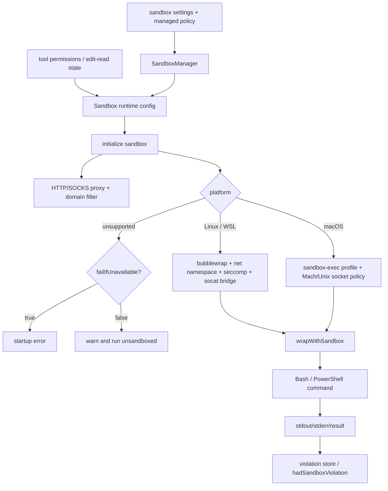
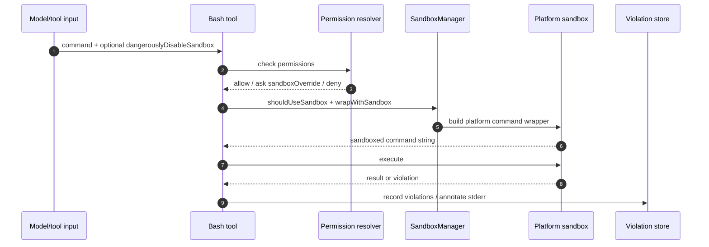
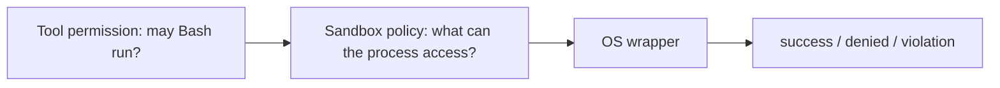

# Sandbox and isolation

This page uses reverse-engineered `cli.renamed.js` anchors to answer the sandbox question: **does Claude Code have a sandbox, and how is it designed?**

Yes. The bundle contains a source-confirmed command sandbox subsystem. It is settings- and policy-driven, wraps shell commands before execution, supports Linux/WSL and macOS differently, exposes network and filesystem restrictions, and can ask for permission or fall back outside the sandbox depending on policy.

## Source anchors

| Semantic alias | String or symbol | Meaning |
| --- | --- | --- |
| SandboxViolationMetadata | `hadSandboxViolation` | Shell failures can carry sandbox-violation metadata. |
| SandboxStartupProfiler | `sandbox_init`, `before_sandbox_init`, `after_sandbox_init` | Startup profiling treats sandbox init as an explicit phase. |
| SandboxWriteAllowlist | `allowWrite:y.array` | Filesystem write allowlist setting. |
| SandboxFailIfUnavailable | `failIfUnavailable:y.boolean` | Startup can hard-fail if sandbox is required but unavailable. |
| UnsandboxedCommandPolicy | `allowUnsandboxedCommands:y.boolean` | Policy knob controlling whether `dangerouslyDisableSandbox` can bypass isolation. |
| BubblewrapPathPolicy | `bwrapPath` | Linux/WSL bubblewrap binary override from managed settings. |
| SocatPathPolicy | `socatPath` | Linux/WSL `socat` override for sandbox network proxy. |
| SandboxManagedPolicyMerge | `sandbox.enabled`, `sandbox.failIfUnavailable`, `sandbox.network`, `sandbox.filesystem` | Managed settings merge preserves sandbox policy controls. |
| SandboxSettingsValidator | `enabled`, `failIfUnavailable`, `allowUnsandboxedCommands`, `network`, `filesystem`, `ignoreViolations` | Settings-key validator recognizes sandbox settings. |
| SandboxRuntimePackageLookup | `@anthropic-ai/sandbox-runtime` | Runtime searches for the external sandbox-runtime package. |
| LinuxSandboxDependencyChecks | `bubblewrap (bwrap) not installed`, `socat not installed` | Linux dependency checks. |
| LinuxSandboxWrapper | `--unshare-net`, `--tmpfs`, `--ro-bind`, `apply-seccomp` | Linux command wrapping uses bubblewrap, network namespace, bind mounts, and optional seccomp. |
| MacSandboxWrapper | `/usr/bin/sandbox-exec`, `(deny default`, `mach-lookup` | macOS command wrapping uses `sandbox-exec` profile generation. |
| SandboxNetworkInfrastructure | `Network infrastructure initialized` | Sandbox initializes HTTP/SOCKS proxy infrastructure for network filtering. |
| SandboxCommandWrapperApi | `wrapWithSandbox:St1` | Sandbox manager exposes the command-wrapping API. |
| SandboxRuntimeConfigConverter | `convertToSandboxRuntimeConfig`, `SandboxManager` | Claude Code converts settings/permissions into a sandbox-runtime config. |
| ShellSandboxWrapCall | `rM.wrapWithSandbox` | Shell command is transformed through the sandbox manager before execution. |
| SandboxPermissionFrames | `sandbox_permission_request`, `sandbox_permission_response` | Sandbox-specific approvals can cross the remote/control channel. |
| ReplSandboxViolationRetry | `REPL Bash sandbox violation — auto-retrying unsandboxed` | REPL shell path can detect sandbox violation and retry outside sandbox when allowed. |
| ModelSandboxDefaultGuidance | `You should always default to running commands within the sandbox` | Model-facing Bash guidance defaults commands to sandboxed execution. |
| DangerousSandboxOverrideInput | `dangerouslyDisableSandbox: true` | Escape hatch exists but is permission/policy mediated. |
| SandboxWritableTempGuidance | `$TMPDIR` | Runtime tells the model to use the sandbox-writable temp directory. |
| SandboxOverrideDecision | `decisionReason:{type:"sandboxOverride"...}` | Running outside sandbox becomes an explicit permission decision. |
| ShellSandboxDecision | `shouldUseSandbox` | Bash/PowerShell execution path decides whether to wrap the command. |
| SandboxConfigurationUi | `Commands will try to run in the sandbox automatically` | User-visible sandbox configuration UI. |
| SandboxBlockedStatus | `Sandbox blocked` | TUI status line reports blocked sandbox operations. |
| StartupSandboxInitialization | `if(c6.isSandboxingEnabled()){L7("before_sandbox_init")...}` | Main startup initializes sandbox before running the session. |

## Design overview

The sandbox is not a separate always-on container. It is a command wrapper and policy service that is initialized at startup, converts current settings into a platform-specific runtime config, and wraps shell commands when the tool path says sandboxing should be used.

## Configuration model

The settings schema exposes three control layers:

| Layer | Settings | Meaning |
|---|---|---|
| Availability and fallback | `sandbox.enabled`, `sandbox.failIfUnavailable`, `enabledPlatforms` policy | Decide whether the sandbox should run and whether missing dependencies are fatal. |
| Escape hatch policy | `allowUnsandboxedCommands`, `autoAllowBashIfSandboxed`, `excludedCommands` | Decide whether commands can request unsandboxed fallback and whether Bash can be auto-allowed when sandboxed. |
| Isolation policy | `network`, `filesystem`, `ignoreViolations`, `enableWeakerNestedSandbox`, `enableWeakerNetworkIsolation` | Define domain/socket/proxy rules, read/write path rules, ignored violation patterns, and platform-specific weakening knobs. |

Important schema details:

- `sandbox.failIfUnavailable` is explicitly described as a hard gate for managed deployments. If false, the runtime warns and commands can run unsandboxed when sandbox initialization fails.
- `sandbox.allowUnsandboxedCommands` controls whether the `dangerouslyDisableSandbox` parameter is honored. When false, the parameter is ignored and commands must run sandboxed.
- `sandbox.network.allowedDomains` / `deniedDomains` define network policy, with managed-only modes such as `allowManagedDomainsOnly`.
- `sandbox.filesystem.allowWrite`, `denyWrite`, `denyRead`, and `allowRead` define path policy. Edit/Read permission rules can feed those lists.
- `bwrapPath` and `socatPath` are Linux/WSL-only and only honored from admin-controlled managed settings.

## Execution path

The shell tool path decides whether a command should be sandboxed:

1. Bash/PowerShell receives tool input, including optional `dangerouslyDisableSandbox`.
2. Permission checking treats unsandboxed execution as `decisionReason.type === "sandboxOverride"` and can ask the user/host with the message `Run outside of the sandbox`.
3. `shouldUseSandbox` returns false if sandboxing is disabled, the command is excluded, or an allowed unsandboxed override is present.
4. When sandboxing is enabled, `c6.wrapWithSandbox` delegates to `rM.wrapWithSandbox`.
5. The platform wrapper rewrites the command string to run through Linux `bwrap`/seccomp/proxy setup or macOS `sandbox-exec`.
6. Results carry normal stdout/stderr plus sandbox-specific violation metadata when detected.

## Linux and WSL design

The Linux/WSL path uses a layered sandbox:

| Mechanism | Evidence | Purpose |
|---|---|---|
| `bubblewrap` / `bwrap` | Dependency checks and `bwrapPath` setting | Create mount/user/network namespace wrappers. |
| `--unshare-net` | Linux wrapper code | Remove direct network access from the command and route through controlled proxies. |
| HTTP/SOCKS proxy bridge | `socatPath`, `claude-http-*.sock`, `claude-socks-*.sock` strings | Bridge sandboxed traffic to local proxy ports while preserving filtering. |
| Optional seccomp | `apply-seccomp`, `seccomp not available - unix socket access not restricted` | Restrict Unix socket access when support binaries exist. |
| Bind mounts and tmpfs | `--ro-bind`, `--bind`, `--tmpfs`, `denyRead`, `allowRead` | Enforce read/write policy by mounting allowed/denied paths into the namespace. |
| `$TMPDIR` | Model-facing instruction | Provide a sandbox-writable temp path and discourage direct `/tmp` use. |

The code explicitly handles dependency failures: missing `bwrap` or `socat` are errors for a full Linux sandbox; missing seccomp produces a warning that Unix socket access is not fully restricted.

## macOS design

The macOS path generates a `sandbox-exec` profile:

- It creates a profile starting with `(deny default ...)` and then adds essential allowances.
- It has explicit policy for Mach IPC, Unix sockets, local binding, and XPC/Mach lookup services.
- It can allow a weaker network-isolation mode for `com.apple.trustd.agent`, with a schema warning that this reduces security.
- It can start a macOS sandbox log monitor and record violations, with `ignoreViolations` support.

This is a different implementation from Linux: macOS uses a profile language and system sandbox command; Linux uses namespace/mount/proxy/seccomp wrapping.

## Network filtering

Network restrictions are proxy-mediated:

1. The sandbox runtime starts or uses HTTP/SOCKS proxy ports.
2. The filter checks `deniedDomains` first, then `allowedDomains`.
3. If no rule matches and a permission callback exists, it can ask the user/host.
4. Denied requests return a sandbox-runtime 403 response or block the connection.
5. Optional TLS termination can generate an ephemeral CA so request bodies are visible to the filter.

The remote/control schema includes `sandbox_permission_request` and `sandbox_permission_response`, so a sandbox network approval can cross the same control channel as tool permissions when the host is remote or SDK-driven.

## Filesystem filtering

Filesystem policy is derived from settings and permission rules:

- `denyRead` denies broad read regions; `allowRead` can re-allow subpaths inside those regions.
- `allowWrite` is merged with paths allowed by edit permissions; `denyWrite` takes precedence within allowed write regions.
- Linux expands glob read patterns but skips glob write patterns on Linux/WSL, warning about unsupported write glob patterns.
- The runtime can plant/scrub protective bare-repo markers and has special handling around Git config/hooks.

The model-facing Bash prompt summarizes current sandbox filesystem/network policy and warns not to add sensitive paths such as shell RC files, SSH keys, or credential files to allowlists.

## Unsandboxed fallback and strict mode

The sandbox has two user-visible operating styles:

| Mode | Behavior |
|---|---|
| Allow unsandboxed fallback | Commands default to sandbox; if a command appears to fail because of sandbox restrictions, the model may retry with `dangerouslyDisableSandbox: true`, which prompts for permission. |
| Strict sandbox mode | `dangerouslyDisableSandbox` is disabled by policy; all model-invoked Bash commands must run sandboxed or be explicitly excluded. |

The runtime guidance is intentionally conservative: default to sandboxed execution, treat each unsandboxed command individually, and explain the likely restriction when retrying outside the sandbox.

## Failure modes and observable behavior

| Failure or event | Runtime behavior |
|---|---|
| Sandbox enabled but platform unsupported | If `failIfUnavailable` is true, startup errors; otherwise warning/fallback. |
| Missing Linux dependencies | Reports missing `bubblewrap`/`socat`; strict deployments can fail startup. |
| Seccomp unavailable | Warns that Unix socket blocking is disabled; other restrictions can still apply. |
| Sandbox violation during Bash/REPL | `hadSandboxViolation` can be set; REPL Bash can auto-retry unsandboxed if allowed. |
| Blocked operation in TUI | Status line displays `Sandbox blocked ...` and points to `/sandbox`. |
| Settings change | Sandbox config is updated live from settings subscriptions. |
| Network request outside allowlist | Request is denied or asks through sandbox permission callback. |

## Relationship to normal permissions

The sandbox is not a replacement for tool permissions. It is an OS/process isolation layer that runs after the tool is approved. Normal permission rules decide whether a command may be attempted; sandbox policy decides what the approved command can touch at runtime.

## Caveats

- This page documents the readable `cli.renamed.js` wrapper and configuration path. It does not reverse-engineer every native or external `@anthropic-ai/sandbox-runtime` implementation detail.
- Exact behavior depends on platform, settings source precedence, installed dependencies, managed policy, and whether a host is available to answer permission prompts.
- Windows appears to have setting/policy surfaces, but the source-confirmed command wrapper disables sandbox use for PowerShell on Windows in the current bundle; the supported platform logic is Linux/WSL and macOS.

## Subprocess env scrub and egress gateway

The `SandboxScrub` module (`cli.renamed.js:237151`-`238180`) layers a stricter env-scrub regime on top of the regular sandbox. It is gated by `CLAUDE_CODE_SUBPROCESS_ENV_SCRUB` and is the source of the hosted-runtime hardening referenced in [Built-in tools and permissions](built-in-tools-and-permissions.md).

### Scrub gates

| Predicate | Behavior |
|---|---|
| `isScrubEnabled()` | True iff `CLAUDE_CODE_SUBPROCESS_ENV_SCRUB` is set. Latched once per process. |
| `at1()` | Returns true when `isScrubEnabled()` OR (env unset AND `CLAUDE_CODE_ENTRYPOINT === "local-agent"`). The `local-agent` path opts in by default. |
| `isScrubSandboxAvailable()` | True when bubblewrap (`bwrap`) is found. Latched once per process. |
| `assertScrubSandboxAvailable()` | Hard assertion at startup. If `bwrap` is missing, throws either `sandbox.bwrapPath is set but not executable` or `bubblewrap is required for subprocess env scrubbing` with install/disable instructions. |
| `shouldUseMcpAllowlistEnv()` | True for `CLAUDE_CODE_MCP_ALLOWLIST_ENV=1` or `CLAUDE_CODE_ENTRYPOINT === "local-agent"`. |

### Startup priming (`assertScrubSandboxAvailable`)

The scrub bootstrap pre-creates files and directories the bubblewrap mount layout requires (without these stubs the sandbox bind mount fails for missing paths). Pre-created files include shell config (`.gitconfig`, `.bash_profile`, `.bashrc`, `.bash_aliases`, `.profile`, `.zshrc`), package manager config (`.bunfig.toml`, `.npmrc`, `.yarnrc`, `.yarnrc.yml`, `bunfig.toml`, `package.json`, `package-lock.json`, `yarn.lock`, `pnpm-lock.yaml`), repo config (`.gitmodules`), auth files (`.netrc`), the inline-comments buffer (`/tmp/inline-comments-buffer.jsonl`), and every entry in the env-file list (`.env`, `.env.local`, ..., `.env.production.local`).

Pre-created directories include: `~/.config/{gh,git,pip}`, `~/.pip`, `<cwd>/.claude/{commands,agents}`, `<cwd>/node_modules/.bin`, the GitHub Actions `RUNNER_FILE_COMMANDS_DIR`, and every entry in `PATH` that falls under a writable mount root.

For GitHub Actions, when the workspace differs from the cwd, the runtime also pre-creates `<workspace>/.git/{hooks,modules,info}`, `<workspace>/.github`, and stub `.git/config`/`.gitmodules`/`.git/info/exclude` files. It then appends a `# claude-code scrub-mode stubs` block to `<cwd>/.git/info/exclude` so the stub files are ignored by Git.

### Script-call caps (`enforceScriptCaps`)

`CLAUDE_CODE_SCRIPT_CAPS` is an env var holding JSON like `{"curl": 3, "wget": 1}`. Parsed once into the in-process cap map. `enforceScriptCaps(command)`:

1. Returns early when scrub is disabled.
2. For each cap entry, counts substring matches of the command string (`command.split(key).length - 1`).
3. Accumulates the per-key count across the whole process lifetime.
4. Throws `Script call limit exceeded: <key> has been called <n> times (cap: <c>). This limit prevents data exfiltration via repeated write operations in untrusted-input workflows.` when the cap is exceeded.

This is a per-process accumulating cap, not per-tool-call; it survives across multiple shell invocations in the same session.

### Egress gateway (`registerEgressGatewayEnvFn`, `egressGatewayEnv`)

`registerEgressGatewayEnvFn(fn)` lets the network proxy layer install a callback that returns extra env vars (proxy hostname, auth headers, etc.). `egressGatewayEnv()` reads the callback's output or returns `{}`. The result feeds `subprocessEnv()`.

### `subprocessEnv()`

The canonical env-for-subprocess builder. It composes base `process.env` + color env + `egressGatewayEnv()` + (when `CLAUDE_CODE_REMOTE` is set) remote-aware env from `cQK(...)`, then strips a fixed list of secret-bearing env vars before handing the env to the child:

- `CLAUDE_CODE_OAUTH_TOKEN`, `CLAUDE_CODE_SUBSCRIPTION_TYPE`, `CLAUDE_CODE_RATE_LIMIT_TIER`, `CLAUDE_BG_AUTH_SNAPSHOT_PATH`.
- `CLAUDE_CODE_SESSION_KIND`, `CLAUDE_BG_SOURCE`, `CLAUDE_BG_ISOLATION`, `CLAUDE_BG_BACKEND`, `CLAUDE_CODE_SESSION_NAME`, `CLAUDE_CODE_RESUME_INTERRUPTED_TURN`.
- Every `OTEL_*` env var.

When scrub is active (`at1()` true), it additionally drops every entry in the protected secret list (`ANTHROPIC_API_KEY`, `ANTHROPIC_AUTH_TOKEN`, `ANTHROPIC_FOUNDRY_API_KEY`, `ANTHROPIC_AWS_API_KEY`, `ANTHROPIC_BEDROCK_MANTLE_API_KEY`, `ANTHROPIC_CUSTOM_HEADERS`, `AWS_SECRET_ACCESS_KEY`, `AWS_SESSION_TOKEN`, `AWS_BEARER_TOKEN_BEDROCK`, `GOOGLE_APPLICATION_CREDENTIALS`, `AZURE_CLIENT_SECRET`, `AZURE_CLIENT_CERTIFICATE_PATH`, `ACTIONS_ID_TOKEN_REQUEST_TOKEN`, `ACTIONS_ID_TOKEN_REQUEST_URL`, `ACTIONS_RUNTIME_TOKEN`, `ACTIONS_RUNTIME_URL`, `ALL_INPUTS`, `OVERRIDE_GITHUB_TOKEN`, `DEFAULT_WORKFLOW_TOKEN`, `SSH_SIGNING_KEY`) AND their `INPUT_<NAME>` GitHub-Actions counterparts.

This is what makes a scrub-mode subprocess unable to read `ANTHROPIC_API_KEY` or `AWS_SECRET_ACCESS_KEY` even when the parent process has them set.

## Sandbox filesystem path resolution

The `SandboxFilesystem` module (`cli.renamed.js:237955`-`238180`) decides which paths the bubblewrap sandbox bind-mounts and how the model's settings translate to the sandbox runtime config.

### `resolvePathPatternForSandbox(pattern, source)`

Resolves a per-settings-source path pattern: `//absolute/path` strips the leading `/` and treats it as absolute; `/relative/to/settings/root` resolves against `getSettingsRootPathForSource(source)`; otherwise passes through unchanged. `resolveSandboxFilesystemPath(path, source)` is the same logic for sandbox-config filesystem entries (no Read/Write rule conversion).

### Managed-only modes

`shouldAllowManagedSandboxDomainsOnly()` is true when any policy tier sets `sandbox.network.allowManagedDomainsOnly: true`. In this mode `convertToSandboxRuntimeConfig(...)` builds the allowed-domain list only from managed-policy settings and ignores user/project allow lists. The same rule applies to `allowRead` paths via `sandbox.filesystem.allowManagedReadPathsOnly`.

### `convertToSandboxRuntimeConfig(settings)`

The central translator. Produces `{network, filesystem, ignoreViolations, enableWeakerNestedSandbox, enableWeakerNetworkIsolation, ripgrep, seccomp, bwrapPath, socatPath}`. Highlights:

- Walks every settings source via `FJ`, resolving path patterns relative to that source's root. Read/Write/Bash deny rules with `domain:` prefixes become `network.deniedDomains`. The same patterns become filesystem `allowRead`/`denyRead`/`allowWrite`/`denyWrite` entries.
- The `allowWrite` list is seeded with `.` (cwd) and the sandbox staging directory.
- Includes the settings file for every source, plus WSL managed-settings paths when running under WSL.
- When cwd differs from original cwd, also includes the cwd's `.claude/settings.json` and `.claude/settings.local.json` and the cwd's `.claude/skills` directory.
- For each cwd that exists (current + original), bind-mounts `<cwd>/HEAD`, `<cwd>/objects`, `<cwd>/refs` if Git artifacts are present; on macOS, also pre-records missing artifacts so they can later be scrubbed.
- Adds every `additionalDirectories` entry from settings AND from `getAdditionalDirectoriesForClaudeMd()` (additional cwds discovered via `--add-dir` and similar).
- Network policy: when scrub is enabled AND sandbox is available AND `!isSandboxEnabledInSettings()`, hard-codes `{allowedDomains: undefined, deniedDomains: [], allowAllUnixSockets: true}` — the scrub-mode default is "trust nothing on the network" because the egress gateway already enforces it.
- Picks the `ripgrep` binary descriptor so the sandbox process can run `rg` inside.
- Includes seccomp and bwrap paths.

### `isSandboxEnabledInSettings` / `isAutoAllowBashIfSandboxedEnabled` / `areUnsandboxedCommandsAllowed` / `isSandboxRequired`

- `isSandboxEnabledInSettings()` — true when `tengu_sandbox_gb_config.disableNoSandbox` is set AND scrub is OFF, OR when `settings.sandbox.enabled === true`.
- `isAutoAllowBashIfSandboxedEnabled()` — disabled when scrub is on (the scrub regime overrides); otherwise `settings.sandbox.autoAllowBashIfSandboxed`, default true.
- `areUnsandboxedCommandsAllowed()` — `settings.sandbox.allowUnsandboxedCommands`, default true.
- `isSandboxRequired()` — `isSandboxEnabledInSettings() && isPlatformInEnabledList() && settings.sandbox.failIfUnavailable`. When true, missing sandbox kills the session at boot rather than running unsandboxed.

## Related docs

- [Built-in tools and permissions](built-in-tools-and-permissions.md)
- [Tool runtime and security architecture](architecture.md)
- [Settings, policy, and integrations](settings-policy-and-integrations.md)
- [Runtime communication protocols](../00-start-here/runtime-communication-protocols.md)
- [Remote control and teleport](../04-sessions-persistence-remote/remote-control-and-teleport.md)
