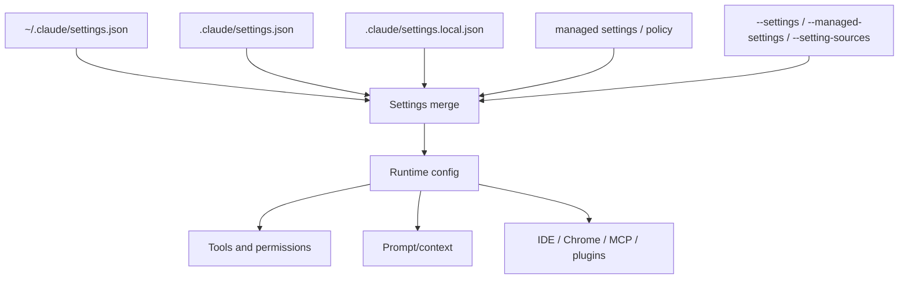

# Settings, policy, and integrations

This page reverse-engineers settings, managed policy, helper scripts, and local integration paths in the Claude Code runtime.

Use [Settings schema reference](settings-schema-reference.md) for the canonical settings roots/key groups and [Environment variables reference](../05-hosted-agent-ops/environment-variables-reference.md) for env-var-only controls. This page owns the settings/policy/integration behavior narrative.

## Source anchors

| Semantic alias | String or symbol | Meaning |
| --- | --- | --- |
| ProjectUserSettingsSchema | `.claude/settings.json` | Project/user settings overlay schema text. |
| TranscriptRetentionSetting | `cleanupPeriodDays` | Transcript retention setting. |
| ManagedUiPolicySettings | `disableAllHooks`, `statusLine`, `disableAgentView` | Managed settings/policy surfaces for hooks/status/agent view. |
| RemoteControlPolicySetting | `disableRemoteControl` | Managed policy surface for Remote Control. |
| SkillShellPolicySetting | `disableSkillShellExecution` | Managed policy surface for shell execution in skills/custom slash commands. |
| ApiKeyHelperSetting | `apiKeyHelper` | Settings helper script that outputs authentication values. |
| OtelHeadersHelperOrigin | `isOtelHeadersHelperFromProjectOrLocalSettings`, `checkHasTrustDialogAccepted` | Project/local OTEL header helpers are suppressed until workspace trust is accepted. |
| StatusLineSettingsMutation | `~/.claude/settings.json` | Status-line setup instructions mutate user settings. |
| SettingsInjectionFlag | `--settings <file-or-json>` | Adds settings JSON file or inline JSON for a session. |
| IdeIntegrationFlag | `--ide` | Auto-connect IDE integration flag. |
| ChromeIntegrationFlag | `--chrome` | Chrome integration flag. |
| StartupFileResourceFlag | `--file <specs...>` | Startup file-resource download integration. |

## Bundle modules in `cli.renamed.js`

| Semantic alias | Loader line | Representative renamed exports | Atlas entry |
|---|---:|---|---|
| `TrustedPathGlobalConfig` | 169401 | `isPathTrusted`, `setPathTrusted`, `checkHasTrustDialogAccepted`, `resetTrustDialogAcceptedCache`, `isGlobalConfigKey`, `saveGlobalConfig`, `saveCurrentProjectConfig`, `isProjectConfigKey`, `getRemoteControlAtStartup`, `getDaemonColdStart`, `isAutoUpdaterDisabled`, `shouldSkipPluginAutoupdate`, `recordFirstStartTime` | [Bundle module map — permission, trust, hooks, and policy](../99-research-atlas/module-map-from-renamed-cli.md#permission-trust-hooks-and-policy) |
| `ProxyClientFactory` | 91577 | `shouldBypassProxy`, `prefetchProxyAuthFromHelperIfSafe`, `getWebSocketProxyUrl`, `getProxyUrl`, `getProxyFetchOptions`, `getProxyAuthFromHelperCached`, `getProxyAuthFromHelper`, `getProxyAgent` | [Bundle module map — remote control, feature flags, networking](../99-research-atlas/module-map-from-renamed-cli.md#remote-control-feature-flags-networking) |
| `LspIdeClient` | 428870 | `createLSPClient` | [Bundle module map — integrations (MCP, plugins, MCPB, LSP)](../99-research-atlas/module-map-from-renamed-cli.md#integrations-mcp-plugins-mcpb-lsp) |

## Settings layers

## Confirmed settings and policy groups

| Group | Examples | Runtime implication |
|---|---|---|
| Settings roots | `~/.claude/settings.json`, `.claude/settings.json`, `.claude/settings.local.json` | User, project, and local overlays participate in runtime config. |
| Retention | `cleanupPeriodDays` | Controls chat transcript retention period. |
| Hooks/status line | `disableAllHooks`, `statusLine`, `subagentStatusLine` | Enables/disables hook and status-line execution. |
| Remote/agent policy | `disableRemoteControl`, `disableAgentView` | Managed policy can disable Remote Control and agent UI paths. |
| Skills/slash safety | `disableSkillShellExecution` | Replaces inline shell execution in skills/custom slash commands with placeholders. |
| Authentication and telemetry helpers | `apiKeyHelper`, `proxyAuthHelper`, `otelHeadersHelper` | Lets settings point to helper scripts for credentials/proxy auth and telemetry headers. |
| Plugin/MCP config | `mcpServers`, plugin marketplaces, output styles, hooks | Integrations can be contributed through settings and plugins. |
| IDE/Chrome/file resources | `--ide`, `--chrome`, `--file` | Adds editor/browser/file startup integration surfaces. |

## Security interpretation

The settings schema exposes both capability-enabling and capability-disabling controls. This matters because the runtime accepts rich extension points—hooks, plugins, MCP, custom slash commands, status lines, helper scripts—but also exposes managed-policy switches that can disable or constrain those extension points.

## Helper-script trust origin

Helper scripts are sensitive because they execute local commands to obtain credentials or headers. The decoded auth/settings chunk shows `otelHeadersHelper` is considered project/local-owned only when the merged helper command exactly matches the value from `projectSettings` or `localSettings`. In that case `getOtelHeadersFromHelper` returns an empty header object until the workspace trust dialog has been accepted, instead of executing the helper early.

This mirrors the broader trust-boundary pattern: helper script settings can extend runtime behavior, but project/local helper execution is gated by workspace trust.

## Related docs

- [Settings schema reference](settings-schema-reference.md)
- [Environment variables reference](../05-hosted-agent-ops/environment-variables-reference.md)
- [Telemetry and tracing](../05-hosted-agent-ops/telemetry-and-tracing.md)
- [Prompt, context, and memory](../02-context-model-loop/prompt-context-memory.md)
- [MCP, plugins, and hooks](mcp-plugins-hooks.md)
- [Remote control and teleport](../04-sessions-persistence-remote/remote-control-and-teleport.md)
