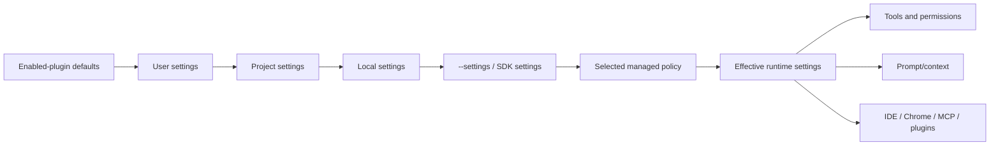
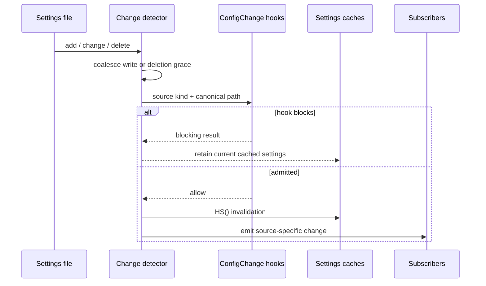
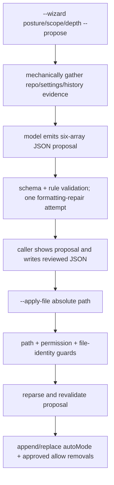

# Settings, policy, and integrations

This page reverse-engineers settings, managed policy, helper scripts, and local integration paths in the Claude Code runtime.

Use [Settings schema reference](settings-schema-reference.md) for the canonical settings roots/key groups, [Plugin lifecycle and configuration](plugin-lifecycle-and-configuration.md) for plugin enablement/defaults/user options, [Status line runtime and command protocol](status-line.md) for the configured command's execution lifecycle, and [Environment variables reference](../05-hosted-agent-ops/environment-variables-reference.md) for env-var-only controls. This page owns the settings/policy/integration behavior narrative.

## Source anchors

| Semantic alias | String or symbol | Meaning |
| --- | --- | --- |
| ProjectUserSettingsSchema | `.claude/settings.json` | Project/user settings overlay schema text. |
| TranscriptRetentionSetting | `cleanupPeriodDays` | Transcript retention setting. |
| ManagedUiPolicySettings | `disableAllHooks`, `statusLine`, `disableAgentView` | Managed settings/policy surfaces for hooks/status/agent view. |
| RemoteControlPolicySetting | `disableRemoteControl` | Managed policy surface for Remote Control. |
| SkillShellPolicySetting | `disableSkillShellExecution` | Managed policy surface for shell execution in skills/custom slash commands. |
| ApiKeyHelperSetting | `apiKeyHelper` | Settings helper script that outputs authentication values. |
| OtelHeadersHelperOrigin | `isOtelHeadersHelperFromProjectOrLocalSettings`, `checkHasTrustDialogAccepted` | Project/local OTEL header helpers are suppressed until workspace trust is accepted. |
| StatusLineSettingsMutation | `~/.claude/settings.json` | Status-line setup instructions mutate user settings. |
| SettingsInjectionFlag | `--settings <file-or-json>` | Adds settings JSON file or inline JSON for a session. |
| SettingsSourceSelector | `GCl()`, `IT()`, `--setting-sources` | Parses the editable source allowlist while always retaining flag/SDK and policy settings [~67,405](../../claude-code-pkg/src/entrypoints/cli.renamed.js#L67405). |
| SettingsParser | `parseSettingsFileUncached()`, `hGe()`, `r3()` | Size-bounded read, targeted entry sanitization, and ordinary whole-file schema validation [~72,317–72,550](../../claude-code-pkg/src/entrypoints/cli.renamed.js#L72317). |
| ManagedSettingsRecovery | `mSi()` | Per-key managed-policy validation with source-visible fail-closed behavior for selected allowlists/enforcement fields [~71,679](../../claude-code-pkg/src/entrypoints/cli.renamed.js#L71679). |
| SettingsMergePipeline | `SSi()`, `settingsMergeCustomizer()` | Ordered recursive merge with array union and a full-replacement exception for `fallbackModel` [~72,820–72,905](../../claude-code-pkg/src/entrypoints/cli.renamed.js#L72820). |
| AdminPolicyTierSelection | `bSi()`, `bxl()`, `parentSettingsBehavior` | Selects the first admin tier and optionally layers a filtered SDK-parent security slice underneath it [~72,650–72,820](../../claude-code-pkg/src/entrypoints/cli.renamed.js#L72650). |
| SettingsChangeDetector | `Hyg()`, `executeConfigChangeHooks()` | Watches settings/drop-ins/symlink targets, admits changes through `ConfigChange`, clears caches, and emits source-specific updates [~242,148–242,360](../../claude-code-pkg/src/entrypoints/cli.renamed.js#L242148). |
| SettingsWriter | `updateSettingsForSourceWithTransform()`, `n7m()`, `tte()` | Serializes per-file transforms and normally uses exclusive temp write, mode preservation, flush, and rename with a narrow in-place fallback [~73,730](../../claude-code-pkg/src/entrypoints/cli.renamed.js#L73730), [~61,222](../../claude-code-pkg/src/entrypoints/cli.renamed.js#L61222). |
| IdeIntegrationFlag | `--ide` | Auto-connect IDE integration flag. |
| ChromeIntegrationFlag | `--chrome` | Chrome integration flag. |
| StartupFileResourceFlag | `--file <specs...>` | Startup file-resource download integration. |
| SafeModeBoundary | `--safe-mode`, `CLAUDE_CODE_SAFE_MODE` | Disables project/user customizations for recovery while preserving admin policy, auth, core tools, and permissions. |
| ProcessWrapperPolicy | `processWrapper`, `CLAUDE_CODE_PROCESS_WRAPPER` | Routes the background supervisor and covered self-spawns through a required corporate launcher. |
| DisableSideloadFlagsPolicy | `disableSideloadFlags` | Managed policy rejects inline plugin URL/dir, custom agent, and non-SDK MCP sideload flags. |
| DisableClaudeAiConnectorsSetting | `disableClaudeAiConnectors` | Disables claude.ai connector loading and classifies pending connectors as disabled. |
| TeamOnboardingPolicy | `allow_team_onboarding` | Organization policy controls the user-only onboarding workflow and its optional share layer. |
| MarketplaceDeclarationSetting | `extraKnownMarketplaces`, `sQ`, `Uhy`, `bJr` | Scoped marketplace declaration state merged from settings. |
| MarketplaceMaterializedState | `known_marketplaces.json`, `Ng`, `lxe` | Separate validated local state for acquired marketplace sources and cache locations. |
| AutoModeSetupCommand | `auto-mode-setup`, `War()`, `--propose`, `--apply-file` | Two-stage reconnaissance/proposal/reviewed-file application flow [~497,000–497,618](../../claude-code-pkg/src/entrypoints/cli.renamed.js#L497000). |
| ConfigShorthandCommand | `parseConfigShorthand`, `applyConfigShorthand`, `listConfigKeys` | Validates and applies the settings exposed through `/config key=value` [~502,418–502,640](../../claude-code-pkg/src/entrypoints/cli.renamed.js#L502418). |
| AgentConfigImport | `GSo()`, `tCy`, `Codex`, `Gemini`, `--yes` | Deterministic scan/preview/apply adapters for Codex and Gemini configuration [~502,800–504,507](../../claude-code-pkg/src/entrypoints/cli.renamed.js#L502800). |
| InitPromptWorkflow | `name: "init"`, `sCy()`, `lCy()` | Legacy CLAUDE.md prompt or gated multi-phase CLAUDE.md/skill/hook setup workflow [~504,790](../../claude-code-pkg/src/entrypoints/cli.renamed.js#L504790). |
| KeybindingsCommand | `name: "keybindings"`, `PCy()` | Creates/opens the keybindings template with safe-mode messaging [~505,500–505,525](../../claude-code-pkg/src/entrypoints/cli.renamed.js#L505500). |
| StatusLineCommand | `name: "statusline"`, `disableModelInvocation: true` | User-only prompt that launches the status-line setup agent and refuses in safe mode [~561,778](../../claude-code-pkg/src/entrypoints/cli.renamed.js#L561778). |
| StatusLineRuntime | `executeStatusLineCommand`, `pNb`, `fNb`, `Juf` | Separate runtime path sends JSON to the configured command, refreshes/cancels it, and renders successful stdout [~577,937](../../claude-code-pkg/src/entrypoints/cli.renamed.js#L577937), [~831,800](../../claude-code-pkg/src/entrypoints/cli.renamed.js#L831800). |
| RemoteEnvironmentSetting | `remote.defaultEnvironmentId`, `/remote-env` | Clears a local override and writes the selected hosted-environment ID at user scope [~813,295–813,790](../../claude-code-pkg/src/entrypoints/cli.renamed.js#L813295). |
| WebGitHubCredentialSetup | `/web-setup`, `/v1/code/github/import-token` | Confirms hosted use of the local GitHub CLI token and imports it through the authenticated remote API [~828,230–828,760](../../claude-code-pkg/src/entrypoints/cli.renamed.js#L828230). |

## Bundle modules in `cli.renamed.js`

| Semantic alias | Loader line | Representative renamed exports | Atlas entry |
|---|---:|---|---|
| `TrustedPathGlobalConfig` | 169401 | `isPathTrusted`, `setPathTrusted`, `checkHasTrustDialogAccepted`, `resetTrustDialogAcceptedCache`, `isGlobalConfigKey`, `saveGlobalConfig`, `saveCurrentProjectConfig`, `isProjectConfigKey`, `getRemoteControlAtStartup`, `getDaemonColdStart`, `isAutoUpdaterDisabled`, `shouldSkipPluginAutoupdate`, `recordFirstStartTime` | [Bundle module map — permission, trust, hooks, and policy](../99-research-atlas/module-map-from-renamed-cli.md#permission-trust-hooks-and-policy) |
| `ProxyClientFactory` | 91577 | `shouldBypassProxy`, `prefetchProxyAuthFromHelperIfSafe`, `getWebSocketProxyUrl`, `getProxyUrl`, `getProxyFetchOptions`, `getProxyAuthFromHelperCached`, `getProxyAuthFromHelper`, `getProxyAgent` | [Bundle module map — remote control, feature flags, networking](../99-research-atlas/module-map-from-renamed-cli.md#remote-control-feature-flags-networking) |
| `LspIdeClient` | 428870 | `createLSPClient` | [Bundle module map — integrations (MCP, plugins, MCPB, LSP)](../99-research-atlas/module-map-from-renamed-cli.md#integrations-mcp-plugins-mcpb-lsp) |

## Settings layers


```mermaid
flowchart LR
    Defaults[Enabled-plugin defaults] --> User[User settings]
    User --> Project[Project settings]
    Project --> Local[Local settings]
    Local --> Flags[--settings / SDK settings]
    Flags --> Managed[Selected managed policy]
    Managed --> Runtime[Effective runtime settings]
    Runtime --> Tools[Tools and permissions]
    Runtime --> Context[Prompt/context]
    Runtime --> Integrations[IDE / Chrome / MCP / plugins]
```

The arrows show ordinary low-to-high precedence, not every specialized resolver. Later scalar values win, nested objects merge recursively, arrays normally form a de-duplicated concatenation, and policy is not overridable by user/project/local values. Security-sensitive settings and plugin-specific configuration can intentionally read a narrower source set; those exceptions are called out below and in the schema reference.

## Load, validate, and merge pipeline

The effective object is computed lazily and cached. `SSi()` loads admitted sources, collects validation diagnostics, and merges them in deterministic order. `HS()` clears the aggregate cache plus per-path/source caches after an accepted filesystem or programmatic change.

### Source admission and order

The ordinary source list is:

| Precedence | Internal source | Typical input |
|---:|---|---|
| 0 | enabled-plugin defaults | Allowlisted `settings.json`/manifest defaults from enabled plugins. |
| 1 | `userSettings` | `~/.claude/settings.json`. |
| 2 | `projectSettings` | `.claude/settings.json`. |
| 3 | `localSettings` | `.claude/settings.local.json`, with legacy/canonical project-root compatibility. |
| 4 | `flagSettings` | `--settings` path/inline JSON and SDK inline settings. |
| 5 | `policySettings` | Selected managed/admin policy. |

`--setting-sources user,project,local` can admit any subset of the three editable disk sources; an empty value admits none of them. It cannot remove `flagSettings` or `policySettings`, which `IT()` always adds. The selector therefore narrows ordinary configuration discovery but cannot bypass command-supplied or enterprise policy input.

`--managed-settings` is not another ordinary top-precedence object. It enters the managed-policy tier machinery as parent-managed settings and is filtered/selected according to the admin tier rules below.

### Parse and validation semantics

Settings files are read through the symlink-aware bounded reader with a **2 MiB** maximum. Empty files become `{}`. The loader then clones/parses the object and performs targeted sanitization before the main schema parse:

- non-string or syntactically invalid `permissions.allow`/`deny`/`ask` entries are removed with warnings;
- a non-object `hooks` root, unknown hook event, or non-array event value is removed with warnings; and
- invalid entries in `allowedMcpServers` and `deniedMcpServers` are filtered for ordinary settings.

For an ordinary user/project/local/flag file, any remaining root-schema failure makes that file contribute **no settings**. Diagnostics still identify the file/path and can include a correction hint. Other valid sources continue to load; this is a per-file failure, not a universal startup rollback.

Managed input intentionally behaves differently. `mSi()` wraps the schema fields individually so one invalid policy key normally does not discard unrelated valid policy. Most invalid fields are dropped with warnings, while selected enforcement fields fail closed:

| Invalid managed field | Recovery in `2.1.215` |
|---|---|
| `allowedMcpServers` | Empty allowlist. |
| `allowManagedMcpServersOnly` | Treated as `true`. |
| `availableModels` | Empty list (only the default model remains available under the documented policy semantics). |
| `enforceAvailableModels` | Treated as `true`. |
| `forceLoginOrgUUID` | Empty list, so no organization is permitted until fixed. |
| `deniedMcpServers` | Invalid field is dropped; the diagnostic explicitly warns those entries cannot be enforced. |
| Invalid sandbox credential entry | Entry is dropped and the diagnostic warns that credential is not protected. |

This is not a blanket promise that every malformed policy becomes stricter. The recovery is field-specific, and diagnostics distinguish warnings from fatal source-load errors. In headless mode, fatal managed-source failures state that policy from the failed source is not in effect; recoverable invalid entries state that remaining valid policy is still enforced.

### Ordinary merge rules

`settingsMergeCustomizer()` gives arrays special treatment and otherwise lets the recursive object merge proceed:

```text
object + object      → recursive key merge
scalar or type swap → later source wins
array + array        → concatenate, then de-duplicate
fallbackModel array → later source replaces the whole array
```

After the normal merge, a managed `availableModels` and `enforceAvailableModels` are copied back exactly from policy so lower array-union semantics cannot widen the enforced model set.

These are effective-object rules, not a guarantee that every consumer reads the merged value. Examples of narrower resolvers include:

- `pluginConfigs`: user → flag/SDK → policy only; project/local values are ignored;
- several credential/sandbox/process controls: policy, flag, and/or user sources only; and
- deny/allow security accumulators that inspect all managed tiers rather than only the displayable effective object.

See [Plugin-specific options](plugin-lifecycle-and-configuration.md#userconfig-plugin-specific-options) and the source-restriction columns in [Settings schema reference](settings-schema-reference.md).

## Managed policy is tier selection plus selective accumulation

Managed configuration is not one universal deep merge. In the absence of a policy helper, the base admin candidates are checked in this order:

```text
remote managed settings → MDM/HKLM or macOS plist → managed file/drop-ins
```

The first non-empty candidate is the selected admin object for ordinary `policySettings`. If a validated policy helper was configured by an admin origin, its returned `managedSettings` replaces that base selection. HKCU policy is a last-resort Windows tier only when no selected admin/parent policy exists (with the separate WSL double-opt-in rules documented by the schema).

SDK parent-managed settings can layer underneath the selected admin object only through a filtered security slice. `BYm()` carries selected restrictive flags, deny/ask permission rules, sandbox denies, and conditionally admitted allow values. It does **not** merge the entire parent object. If the selected admin sets `parentSettingsBehavior:"first-wins"`, that parent slice is omitted entirely, so only the selected admin contributes to the ordinary effective policy object; this setting does not mean “the first value of every ordinary settings key wins.” The default/`"merge"` behavior admits the filtered slice and then lets the selected admin override it.

Security-specific code can additionally inspect `getAllPolicyTierSettings()` to accumulate deny rules or “managed-only” constraints across remote/MDM/file tiers. Therefore the effective `policySettings` object, the selected policy origin, and all security-relevant admin tiers are related views but not interchangeable.

## Live reload and change admission

`Hyg()` installs the runtime settings change detector outside safe mode. It watches admitted settings files, the managed drop-in directory, and resolved symlink targets whose parent exists at initialization. The watcher uses atomic-save handling plus write-stability checks and maps a real target back to its canonical settings source.


```mermaid
sequenceDiagram
    participant Disk as Settings file
    participant Watcher as Change detector
    participant Hook as ConfigChange hooks
    participant Cache as Settings caches
    participant Runtime as Subscribers

    Disk->>Watcher: add / change / delete
    Watcher->>Watcher: coalesce write or deletion grace
    Watcher->>Hook: source kind + canonical path
    alt hook blocks
        Hook-->>Watcher: blocking result
        Watcher-->>Cache: retain current cached settings
    else admitted
        Hook-->>Watcher: allow
        Watcher->>Cache: HS() invalidation
        Watcher->>Runtime: emit source-specific change
    end
```

Important timing and ownership details:

- ordinary writes wait for roughly one second of stability with a 500 ms poll interval; deletion has a grace window so atomic replace does not look like a lasting removal;
- changes echoing a Claude Code write within five seconds are suppressed because the writer emits its own programmatic event;
- external add/change/delete events run `ConfigChange`; a blocking hook leaves the current cache/runtime state untouched even though the disk file changed;
- MDM/HKCU/WSL policy state is polled every 30 minutes in addition to filesystem watching; and
- accepted events refresh the effective settings and app permission state, but they do not imply that every extension is rebuilt. Plugin commands/agents/MCP/LSP, status command processes, and other owner-managed resources retain their documented reload/reconnect boundaries.

Because only existing parent directories are registered during initialization, creating an entirely new settings directory after startup is not equivalent to changing a watched file. Restarting or invoking the relevant explicit reload remains the reliable recovery path for that edge case.

## Mutation and atomic-write behavior

`updateSettingsForSourceWithTransform()` only mutates user/project/local settings; policy and flag settings are read-only through this API. Writes to the same file are serialized through a per-path queue so concurrent UI/command transforms do not race from the same process.

The transform pipeline is deliberately different from effective-settings merge:

1. Read a validated source-only seed without folding the legacy local alias into it.
2. If schema validation failed but the file is still syntactically valid JSON, parse the raw object so a targeted edit can preserve unknown/temporarily invalid fields. Invalid JSON syntax aborts the write rather than replacing the file.
3. Apply the caller transform. `null` means no canonical write; `undefined` patch values delete keys; arrays in the patch replace existing arrays rather than unioning them.
4. Serialize pretty JSON, mark the path for self-echo suppression, and write through `tte()`.
5. Clear caches and emit the source event; local writes also maintain ignore/revocation compatibility state.

The normal `tte()` path is:

```text
exclusive temp create → write → preserve/apply mode → fsync → close → rename over target
```

The temp path can live in the guarded `.claude` staging directory; when sandbox setup recorded that directory's device/inode, the writer rechecks its identity before use. User settings may intentionally follow a target-file symlink. Project/local settings normally reject a symlink target and reject a symlinked parent directory, preventing a repository-controlled path from redirecting the write.

If rename cannot complete for the narrow `EXDEV`, `EPERM`, `EEXIST`, or `EBUSY` class after a successful temp write—or an existing target returns the handled pre-write `EACCES` case—the writer can fall back to opening/truncating the target in place, writing, and syncing it. That fallback is **not atomic**. If it fails after truncation, the error reports that the new content remains at the temp path when applicable. Other failures clean up the temp file and propagate.

For canonicalized local settings, `Nxl()` also applies the transform to an older cwd-local `settings.local.json` copy in **removals-only** form. This revokes stale legacy values without adding new settings back into the obsolete file. A canonical write can therefore succeed while a relevant legacy revocation still returns an error that the caller should surface.

## Confirmed settings and policy groups

| Group | Examples | Runtime implication |
|---|---|---|
| Settings roots | `~/.claude/settings.json`, `.claude/settings.json`, `.claude/settings.local.json` | User, project, and local overlays participate in runtime config. |
| Retention | `cleanupPeriodDays` | Controls chat transcript retention period. |
| Hooks/status line | `disableAllHooks`, `statusLine`, `subagentStatusLine` | Selects command-derived main/agent-row UI; policy and safe mode can reduce selection to managed values. See [Status line runtime and command protocol](status-line.md). |
| Remote/agent policy | `disableRemoteControl`, `disableAgentView` | Managed policy can disable Remote Control and agent UI paths. |
| Skills/slash safety | `disableSkillShellExecution` | Replaces inline shell execution in skills/custom slash commands with placeholders. |
| Authentication and telemetry helpers | `apiKeyHelper`, `proxyAuthHelper`, `otelHeadersHelper` | Lets settings point to helper scripts for credentials/proxy auth and telemetry headers. |
| Plugin/MCP config | `mcpServers`, plugin marketplaces, output styles, hooks | Integrations can be contributed through settings and plugins. |
| Hosted connector policy | `disableClaudeAiConnectors` | Prevents claude.ai connector configs/tools from loading, without disabling ordinary local MCP configs. |
| Team onboarding policy | `allow_team_onboarding` | Controls `/team-onboarding`; hosted sharing adds OAuth, traffic, and rollout gates. |
| IDE/Chrome/file resources | `--ide`, `--chrome`, `--file` | Adds editor/browser/file startup integration surfaces. |
| Accessibility/recovery | `axScreenReader`, `--ax-screen-reader`, `--safe-mode` | Selects the [screen-reader-friendly classic renderer](../01-runtime-lifecycle/accessibility-and-screen-reader-mode.md) or enters [configuration-isolation recovery](../05-hosted-agent-ops/safe-mode-and-recovery.md). |
| Workflow/model/version policy | `disableWorkflows`, `availableModels`, `enforceAvailableModels`, `requiredMinimumVersion`, `requiredMaximumVersion` | Constrains orchestration, model resolution, and allowed client builds. |
| Corporate launch | `processWrapper`, `CLAUDE_CODE_PROCESS_WRAPPER` | Ensures background supervisors/workers and covered self-spawns use the configured launcher. |

## Security interpretation

The settings schema exposes both capability-enabling and capability-disabling controls. This matters because the runtime accepts rich extension points—hooks, plugins, MCP, custom slash commands, status lines, helper scripts—but also exposes managed-policy switches that can disable or constrain those extension points.

## Helper-script trust origin

Helper scripts are sensitive because they execute local commands to obtain credentials or headers. The decoded auth/settings chunk shows `otelHeadersHelper` is considered project/local-owned only when the merged helper command exactly matches the value from `projectSettings` or `localSettings`. In that case `getOtelHeadersFromHelper` returns an empty header object until the workspace trust dialog has been accepted, instead of executing the helper early.

This mirrors the broader trust-boundary pattern: helper script settings can extend runtime behavior, but project/local helper execution is gated by workspace trust.

## Recovery, sideload, and process-launch boundaries

[`--safe-mode`](../05-hosted-agent-ops/safe-mode-and-recovery.md) sets `CLAUDE_CODE_SAFE_MODE=1` and disables `CLAUDE.md`, skills, plugins, hooks, MCP servers, custom commands/agents, output styles, workflows, custom themes, keybindings, and similar customizations. Managed policy still applies, and authentication, model selection, built-in tools, and permissions continue normally. This makes safe mode a configuration-isolation diagnostic, not a permission bypass.

Managed `disableSideloadFlags` closes CLI-only extension paths by rejecting `--plugin-dir`, `--plugin-url`, `--agents`, and non-SDK `--mcp-config` at startup. Approved marketplaces/settings remain the intended deployment path.

`processWrapper` (or the higher-precedence `CLAUDE_CODE_PROCESS_WRAPPER`) is an argv prefix for the background supervisor, sessions/workers it hosts, and covered self-spawns. The runtime validates that the launcher remains executable, retires an older unwrapped supervisor, preserves wrapper state across background upgrades, and exposes the recorded launcher through daemon status. Project/local settings cannot set it.

[Claude in Chrome](browser-automation-and-claude-in-chrome.md) is a first-class integration in this build (`--chrome` / `--no-chrome`) subject to auth, host, extension, policy, mode, and safe-mode gates. Browser calls remain MCP tool calls and therefore still cross normal plan-mode and permission checks; extension site permissions add another boundary.

`disableClaudeAiConnectors` is narrower than a global MCP kill switch: the runtime checks it for `claudeai`-scoped configs and connector startup, while normal settings/plugin/flag MCP configs retain their own policies. `allow_team_onboarding` is an organization capability policy rather than a model permission; it gates the user-invoked local-history workflow, and [hosted guide sharing](../04-sessions-persistence-remote/team-onboarding-and-share-flows.md) applies additional account/traffic/feature checks.

## Marketplace declarations versus local state

`extraKnownMarketplaces` is a settings declaration, not the marketplace cache itself. `Uhy` merges declarations across eligible settings sources, while `sQ` adds fallback/seed-related declarations and, after workspace trust, the project/local and added-directory view. Before trust, project/local declarations are excluded from that effective declaration set. `bJr(name, declaration, source)` persists one declaration to a selected settings source.

Materialization is tracked separately in `known_marketplaces.json`. `Ng` loads and schema-validates that file; `lxe` validates and writes records containing the source, install location, and update metadata. `cct` policy-checks a source, reuses an equivalent existing materialization when possible, invokes the source-specific `bSs` acquisition path, and records the result. Consequently:

- deleting or overriding one settings declaration does not by itself prove the cache should disappear;
- `DDt(name, scope)` keeps state and installed plugins when another settings scope, managed declaration, or seed still owns the name;
- final removal deletes the state/cache and cleans marketplace-specific enabled/installed plugin records;
- `strictKnownMarketplaces` and `blockedMarketplaces` constrain acquisition/use, but are not substitutes for `known_marketplaces.json`;
- a settings schema entry for an NPM marketplace source is not executable support—`bSs` explicitly throws `NPM marketplace sources not yet implemented` in this build.

See [Plugin marketplace lifecycle](mcp-plugins-hooks.md#plugin-marketplace-lifecycle) for the CLI add/list/update/remove paths and acquisition branches.

## Configuration command mechanisms

The complete name/gate inventory is in the [built-in interactive-command registry](../01-runtime-lifecycle/command-line-reference.md#built-in-interactive-command-registry). The commands below matter here because they read or mutate settings/configuration through additional safety boundaries rather than being simple UI shortcuts.

### `/config`: panel versus shorthand

Bare `/config` (`/settings`) opens the interactive panel. `/config key=value [key=value ...]` uses the same computed setting descriptors but exposes only values that can be represented safely as a boolean or enumerated/coerced value.

The shorthand path:

1. accepts one `key=value` containing spaces in its value, or multiple whitespace-delimited pairs;
2. resolves keys case-insensitively against the settings currently available to this session;
3. accepts `true/1/on/yes` and `false/0/off/no` for booleans;
4. checks enumerated values case-insensitively and uses explicit coercers for managed free-form fields such as language;
5. invokes the setting descriptor's own `onChange` persistence path; and
6. reports when a higher-precedence environment/policy/flag source still controls the effective value.

Consent-gated settings cannot normally be enabled by shorthand. A false value can withdraw an already-active consent, but enabling requires the panel's consent surface. Managed-enum rows without a setter also direct the user to their dedicated command (for example `/channel`) or `/config`. `listConfigKeys()` and argument completion omit consent-gated entries, so the usage list is an executable whitelist rather than every key in the settings schema.

### `/auto-mode-setup`: proposal before mutation

`/auto-mode-setup` is a separate workflow from the top-level `claude auto-mode config|defaults|critique|reset` command family. The interactive variant presents the setup/review UI. Its text implementation supports non-interactive orchestration but deliberately refuses a one-shot model-output-to-settings write.


```mermaid
flowchart TD
    Args[--wizard posture/scope/depth --propose] --> Recon[mechanically gather repo/settings/history evidence]
    Recon --> Model[model emits six-array JSON proposal]
    Model --> Parse[schema + rule validation; one formatting-repair attempt]
    Parse --> Review[caller shows proposal and writes reviewed JSON]
    Review --> Apply[--apply-file absolute path]
    Apply --> Path[path + permission + file-identity guards]
    Path --> Reparse[reparse and revalidate proposal]
    Reparse --> Settings[append/replace autoMode + approved allow removals]
```

The proposal schema requires `environment`, `allow`, `soft_deny`, `hard_deny`, `remove_from_permissions_allow`, and `notes`, all arrays of strings. The parser normalizes entries, validates the final auto-mode shape, strips unsafe broad allow rules, and permits a proposed removal only when the mechanically gathered settings section actually contained that exact rule. A malformed first response gets one JSON-format repair request; it is not accepted as prose.

The non-interactive grammar exposes only:

- `--wizard posture=<personal|open-source|enterprise|mixed> scope=<all|project> depth=<both|shell|repos|here> --propose`; and
- `--apply-file <absolute-path>`.

`--apply` is rejected because it would persist unreviewed model output. `--apply-file` accepts only an absolute path under the system temp directory or Claude config directory, rejects paths denied by read permission, opens a regular file with no-follow and single-link requirements, sniffs encoding, caps it at 1 MiB, and reruns schema/rule validation before calling the settings writer. The model therefore proposes; the reviewing host/user controls the file that is applied.

### `/import`: deterministic adapters with a same-session confirmation latch

The feature-gated `/import [codex|gemini]` command has separate Codex and Gemini adapters. It can map selected instruction files, commands/prompts, MCP servers, subagents, skills, and permission settings, while recording unmappable items for manual follow-up.

The non-interactive flow is intentionally two-step:

1. `/import [source]` scans and returns a preview prompt. The process stores the exact scan result in an in-memory latch.
2. `/import [source] --yes` applies only if that same process already previewed the same source. Plain one-shot `claude -p` invocations cannot carry this latch and are directed to terminal `claude import` instead.

`--yes` applies unflagged **user-scope** items only. Project-scope items, warning-bearing entries, and copied skill directories are held back for the interactive checkbox picker because repository configuration can be attacker-authored and bundled skill scripts/frontmatter become active capabilities. `--dry-run` executes the same apply decisions without writing.

The adapters apply several deterministic guards before any write:

- resolved source/target paths must remain inside the expected config/project root;
- project reads and writes reject symlink components; user skill paths are realpath-contained;
- imported names are reduced to a safe filename alphabet, and existing targets are never overwritten;
- file reads are size-bounded (10 MiB for imported text); and
- Codex/Gemini prompt translation rejects shell-execution markers, nested braces/backticks, dangling `!` markers, or argument-placeholder combinations that could become live Claude Code shell expansion.

Unmappable entries can be written to `skills/import-to-claude-code/SKILL.md` under the Claude config directory. The copied labels are explicitly framed as untrusted data; project-level labels are summarized by count rather than copied into the user-level fallback skill.

### `/init`, `/keybindings`, and `/statusline`

| Command | Source-confirmed behavior |
|---|---|
| `/init` | The legacy arm asks the model to analyze the repo and create/improve a concise root CLAUDE.md. The gated new arm first checks only the root CLAUDE.md, asks whether to create project/personal files plus skills/hooks, explores through a subagent, asks only code-unanswerable questions, presents an artifact proposal, and obtains confirmation before writes. Hook creation delegates to `/update-config`'s verified construction flow. |
| `/keybindings` | Resolves `~/.claude/keybindings.json`, creates parent directories, writes a schema/docs-bearing template only with exclusive-create semantics, then opens the file in the configured editor. Existing files are opened, not replaced. In safe mode it warns that changes will take effect after leaving safe mode. |
| `/statusline` | Is a built-in prompt with `disableModelInvocation: true` and `disableNonInteractive: true`; only the user can launch it interactively. It delegates to the `statusline-setup` subagent with narrow Read/Edit permissions. Safe mode refuses before delegation because only the managed status line can render there. Setup and the later deterministic command/JSON/render path are separated in [Status line runtime and command protocol](status-line.md). |
| `/theme`, `/tui`, `/focus` | Are dedicated interactive controls because their state affects immediate rendering/relaunch behavior. The shorthand settings panel may display them but does not replace their specialized transitions. |
| `/reload-plugins`, `/reload-skills`, `/skill-doctor` | Rebuild or inspect extension state rather than directly editing settings. Their cache and dependency behavior is documented in [MCP, plugins, and hooks](mcp-plugins-hooks.md#interactive-reload-and-skill-health-commands). |
| `/remote-env` | Lists hosted targets, clears a local `remote.defaultEnvironmentId` override, and writes the chosen ID to user settings while warning if a higher-precedence source still wins. See [Interactive remote setup commands](../04-sessions-persistence-remote/remote-control-and-teleport.md#interactive-remote-setup-commands). |
| `/web-setup` | After explicit confirmation, imports the redacted in-memory `gh auth token` into the hosted service and can best-effort create the first default environment. It does not silently replace an existing GitHub App connection. See [Interactive remote setup commands](../04-sessions-persistence-remote/remote-control-and-teleport.md#interactive-remote-setup-commands). |

## Related docs

- [Browser automation and Claude in Chrome](browser-automation-and-claude-in-chrome.md)
- [IDE integration and LSP diagnostics](ide-integration-and-lsp-diagnostics.md)
- [Plugin lifecycle and configuration](plugin-lifecycle-and-configuration.md)
- [Status line runtime and command protocol](status-line.md)
- [Settings schema reference](settings-schema-reference.md)
- [Accessibility and screen-reader mode](../01-runtime-lifecycle/accessibility-and-screen-reader-mode.md)
- [Safe mode and recovery](../05-hosted-agent-ops/safe-mode-and-recovery.md)
- [Environment variables reference](../05-hosted-agent-ops/environment-variables-reference.md)
- [Telemetry and tracing](../05-hosted-agent-ops/telemetry-and-tracing.md)
- [Prompt, context, and memory](../02-context-model-loop/prompt-context-memory.md)
- [MCP, plugins, and hooks](mcp-plugins-hooks.md)
- [Team onboarding and share flows](../04-sessions-persistence-remote/team-onboarding-and-share-flows.md)
- [Remote control and teleport](../04-sessions-persistence-remote/remote-control-and-teleport.md)
