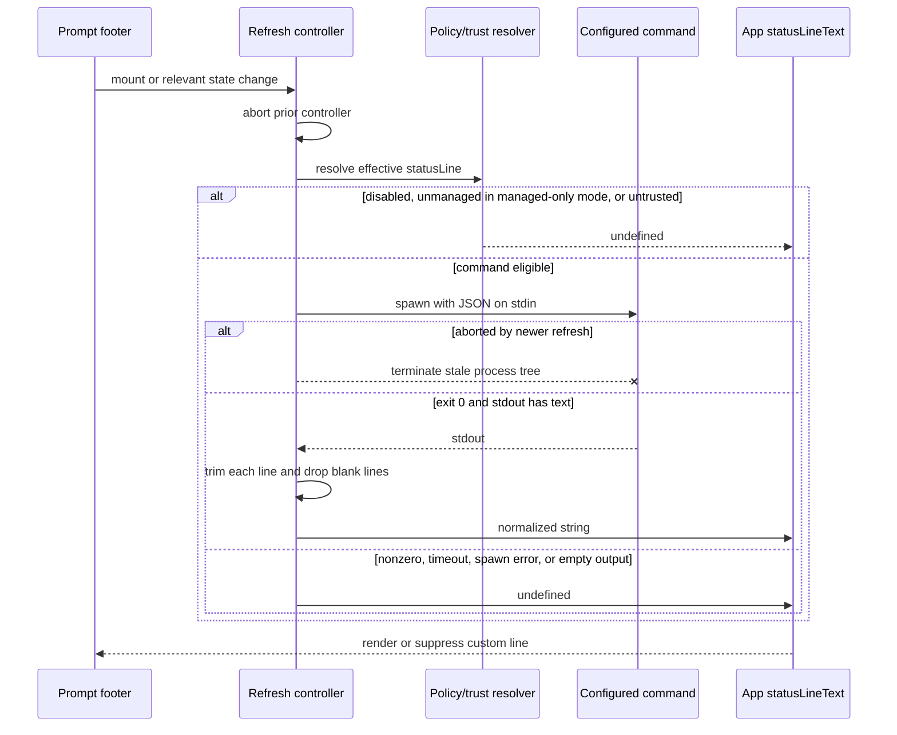

# Status line runtime and command protocol

Claude Code's custom status line is a local command adapter. The interactive TUI serializes current session state as JSON, writes that JSON to the configured command's standard input, and renders successful standard output beneath the prompt. The command is rerun after selected state changes and, optionally, on a fixed interval.

This page describes the implementation in `@anthropic-ai/claude-code@2.1.215`. It separates setup, runtime execution, the built-in footer, and the distinct `subagentStatusLine` agent-row protocol.

## Short answer

```mermaid
flowchart LR
    Setup[/statusline setup agent] --> Settings[statusLine setting]
    State[TUI session state] --> Payload[JSON stdin payload]
    Settings --> Runner[local shell command]
    Payload --> Runner
    Runner -->|exit 0 + non-empty stdout| Normalize[trim lines / drop blanks]
    Normalize --> Render[dimmed, width-truncated text below prompt]
    Runner -->|abort, timeout, nonzero, or empty stdout| Hide[no custom line]
```

The configured command is **not** a model response, tool call, or lifecycle-hook event. It does not pass through ordinary tool permission prompts. It is a trusted local customization executed through shared hook-command process infrastructure after settings-policy and workspace-trust checks.

## Three similarly named surfaces

| Surface | What it is | Output contract |
|---|---|---|
| Main `statusLine` | Configured command rendered below the input box in the interactive prompt footer. | Plain or ANSI-decorated stdout; multiple non-empty lines are allowed. |
| Built-in footer/status indicators | Runtime-owned mode, task, PR, bridge, Vim, hint, and notification components. | Internal JSX/Ink state; no external command. |
| `subagentStatusLine` | Separate command that replaces individual agent/task rows in the agent footer. | JSON Lines: one `{ "id": "...", "content": "..." }` object per decorated task. |

A configured main status line does not replace the whole built-in footer. It occupies its own row and suppresses some ordinary prompt hints; `hideVimModeIndicator` can additionally suppress the built-in Vim indicator. `subagentStatusLine` never supplies the main line.

## Source anchors

| Semantic alias | Approximate location in `cli.renamed.js` | Exact string or symbol | Meaning |
|---|---:|---|---|
| StatusLineSchema | [~71,080](../../claude-code-pkg/src/entrypoints/cli.renamed.js#L71080) | `statusLine`, `refreshInterval`, `hideVimModeIndicator` | Main settings schema and field constraints. |
| ManagedStatusLineResolver | [~253,996](../../claude-code-pkg/src/entrypoints/cli.renamed.js#L253996) | `Bxt()` | Chooses the merged status line normally and the managed-policy value in safe/managed-only mode. |
| CustomizationSuppressionMatrix | [~260,267](../../claude-code-pkg/src/entrypoints/cli.renamed.js#L260267) | `Yu()`, `hvg`, `mvg` | Safe-mode and minimal-mode customization categories. |
| StatusLineSetupAgent | [~282,577](../../claude-code-pkg/src/entrypoints/cli.renamed.js#L282577) | `statusline-setup`, `How to use the statusLine command` | Built-in agent prompt, JSON examples, and user-settings mutation instructions. |
| StatusLineSlashCommand | [~561,778](../../claude-code-pkg/src/entrypoints/cli.renamed.js#L561778) | `name: "statusline"`, `disableModelInvocation: true` | Interactive user-only setup command and safe-mode refusal. |
| SharedCommandSpawner | [~575,565](../../claude-code-pkg/src/entrypoints/cli.renamed.js#L575565) | `Kxo()` | Shell, cwd, environment, stdin, timeout, abort, and process cleanup. |
| StatusLineExecutor | [~577,937](../../claude-code-pkg/src/entrypoints/cli.renamed.js#L577937) | `executeStatusLineCommand()` | Trust/policy gates, command invocation, stdout normalization, failures, and telemetry. |
| StatusLinePayloadBuilder | [~831,800](../../claude-code-pkg/src/entrypoints/cli.renamed.js#L831800) | `pNb()` | Builds the session/model/workspace/cost/context JSON payload. |
| StatusLineRefreshController | [~831,900](../../claude-code-pkg/src/entrypoints/cli.renamed.js#L831900) | `fNb()` | Immediate, debounced, periodic, command-change, and cancellation behavior. |
| StatusLineRenderer | [~832,100](../../claude-code-pkg/src/entrypoints/cli.renamed.js#L832100) | `Juf()`, `Yuf()` | Multiline ANSI-aware dim rendering and per-line truncation. |
| SubagentStatusLineRuntime | [~846,830](../../claude-code-pkg/src/entrypoints/cli.renamed.js#L846830) | `_Ba()`, `Gyf()`, `SBa()` | Agent-row JSON payload, five-second runner, JSONL parser, and decorations. |
| PromptFooterPlacement | [~849,250](../../claude-code-pkg/src/entrypoints/cli.renamed.js#L849250) | `_Sf()` | Prompt-mode visibility, compact-height suppression, and built-in footer coexistence. |

## Main settings schema

A minimal configuration is:

```json
{
  "statusLine": {
    "type": "command",
    "command": "sh ~/.claude/statusline.sh"
  }
}
```

| Field | Schema | Runtime effect |
|---|---|---|
| `type` | Required literal `"command"` | Selects the only supported main status-line adapter. |
| `command` | Required string | Shell command rerun for each refresh. |
| `padding` | Optional number | Horizontal TUI padding (`paddingX`) around the rendered line; default `0`. |
| `refreshInterval` | Optional number, minimum `1` | Adds a periodic refresh every $N$ seconds to event-driven refreshes. |
| `hideVimModeIndicator` | Optional boolean | Hides the built-in `-- INSERT --`, `-- VISUAL --`, and related indicator. The JSON payload still includes `vim.mode` when Vim mode is active. |

The schema does not expose a main-status-line timeout, shell selector, argv array, output-size limit, or per-command environment block. Runtime uses the shared fixed timeout and platform shell path described below.

## What `/statusline` does

`/statusline` is a setup workflow, not the refresh mechanism:

1. It is interactive-only and marked `disableModelInvocation: true`, so the model cannot decide to invoke it as an ordinary slash-command skill.
2. In normal mode it asks the built-in `statusline-setup` agent to configure the requested line. With no argument, the default request is to convert the user's shell `PS1`.
3. The setup agent uses a fixed Sonnet model and exactly `Read` and `Edit`. Its prompt tells it to preserve existing settings, place longer scripts under `~/.claude/`, and update `~/.claude/settings.json` (following a symlink target when needed).
4. In safe mode `/statusline` refuses before delegation. A user-scoped value written by the setup agent would be ignored because safe mode resolves only a managed-policy status line.
5. After configuration, the deterministic TUI runtime—not the setup agent or main model—owns every execution and render.

This explains the apparently contradictory behavior that safe mode can display an administrator-provided status line while refusing `/statusline`: setup writes a user value, but safe mode only consumes the managed value.

## Main runtime lifecycle



### Refresh triggers

| Trigger | Scheduling behavior |
|---|---|
| Component mount | Immediate run. |
| Configured `command` string changes | Immediate run; first-run telemetry latches are reset. |
| Last assistant message/token usage, permission mode, Vim mode, main model, fast mode, effort, thinking toggle, or PR status changes | One run through a 300 ms debounce. |
| `refreshInterval` | Calls the same debounced runner every `max(1, N)` seconds. |
| Component unmount or newer run | Aborts the current controller. A stale aborted result does not overwrite newer display state. |

Every run samples current cwd, added directories, Git worktree name, origin remote, and the rest of the payload. The observed dependency list does **not** independently schedule a refresh for every payload field; a cwd/repository/worktree change becomes visible on the next run caused by one of the triggers above unless another parent-level remount occurs.

Before starting a run, the controller aborts the previous one. The shared process wrapper sends termination to the child/process group and escalates after its grace period. Because the new spawn does not await every operating-system cleanup step, cancellation means “make the previous result stale and terminate it,” not a proof that two OS processes can never overlap briefly.

## JSON stdin protocol

The runtime serializes one JSON object and writes it to stdin. It is not JSONL and no newline delimiter is required; the shared runner appends trailing whitespace to the stdin payload before closing the pipe. Scripts should read stdin once, commonly with `input=$(cat)`.

### Identification, model, and workspace

| Field | Presence | Meaning in `2.1.215` |
|---|---|---|
| `session_id` | Always | Current session UUID. |
| `session_name` | Optional | Current display title, including a user-visible renamed title when present. |
| `prompt_id` | Optional | Current prompt UUID; the same identity used by prompt telemetry. |
| `transcript_path` | Always | Local transcript path for the session. |
| `cwd` | Always | Current runtime working directory. |
| `agent_type` | Optional | Main-thread agent type inherited from the base hook envelope. |
| `model.id` | Always | Effective runtime model ID after current permission/context-window selection. |
| `model.display_name` | Always | Rendered marketing/display name. |
| `workspace.current_dir` | Always | Same current directory sampled for this run. |
| `workspace.project_dir` | Always | Original launch/project cwd (`getOriginalCwd()`), not a promise that this is the canonical Git root. |
| `workspace.added_dirs` | Always | Directories added to the permission/workspace context. |
| `workspace.git_worktree` | Optional | Detected linked-worktree name for the current directory. |
| `workspace.repo` | Optional | Parsed origin identity: `host`, `owner`, and `name`. |
| `version` | Always | Claude Code version string (`2.1.215` in this artifact). |
| `output_style.name` | Always | Active output-style name. |

Undefined base-envelope properties such as `permission_mode` or `agent_id` are omitted by JSON serialization in the ordinary main-status-line call.

Two agent-related fields can coexist: root `agent_type` comes from `createBaseHookInput()`, while nested `agent.name` is added by `pNb()` from the active main-thread agent type.

### Cost and context

| Field | Meaning |
|---|---|
| `cost.total_cost_usd` | Accumulated session cost. |
| `cost.total_duration_ms` | Accumulated wall duration. |
| `cost.total_api_duration_ms` | Accumulated provider/API duration. |
| `cost.total_lines_added` / `total_lines_removed` | Session edit counters. |
| `context_window.total_input_tokens` | Input + cache-creation + cache-read tokens in the currently selected usage record; not lifetime session input. |
| `context_window.total_output_tokens` | Output tokens from that usage record. |
| `context_window.context_window_size` | Effective model context-window size. |
| `context_window.current_usage` | Last/current usage object, or `null` before one exists: `input_tokens`, `output_tokens`, `cache_creation_input_tokens`, and `cache_read_input_tokens`. |
| `context_window.used_percentage` / `remaining_percentage` | Precomputed percentages, or `null` before usage exists. |
| `exceeds_200k_tokens` | Whether the current conversation crosses the 200k-token threshold used by runtime model selection. |

### Session-mode and optional metadata

| Field | Presence/shape |
|---|---|
| `fast_mode` | Always boolean. |
| `effort.level` | Present only for a model that supports effort; resolved live level such as `low`, `medium`, `high`, `xhigh`, or model-specific maximum. |
| `thinking.enabled` | Always boolean. |
| `rate_limits.five_hour` / `seven_day` | Optional subscription windows, each with `used_percentage` and Unix-seconds `resets_at`. |
| `vim.mode` | Optional; `INSERT`, `NORMAL`, `VISUAL`, or `VISUAL LINE`. |
| `agent.name` | Optional main-thread agent name. |
| `remote.session_id` | Optional when the Remote Control/remote bridge is active. |
| `pr` | Optional current-branch PR: `number`, `url`, optional `review_state`, and optional `kind`. |
| `worktree` | Optional worktree-session metadata: `name`, `path`, optional `branch`, `original_cwd`, and optional `original_branch`. |

The payload is a UI integration contract, not model context. The command's output updates `statusLineText` in TUI state; it is not appended as a conversation message or sent to the model.

## Command process boundary

### Shell and working directory

The executor reuses the command-hook spawner but does not register a `StatusLine` hook event in `HOOK_EVENT_REGISTRY`.

| Platform | Spawn behavior |
|---|---|
| Linux/macOS/other Unix | Shell-form `child_process.spawn(..., { shell: true })` in the effective cwd. This is a platform shell invocation, not necessarily the user's interactive/login shell. |
| Windows with Git Bash | Command is normalized for Git Bash and spawned through that shell. The setup prompt tells generated scripts to use forward-slash paths. |
| Windows without Git Bash | Falls back to PowerShell when available. |

The cwd is the current runtime cwd when it still exists; otherwise `safeHookCwd()` falls back to the original cwd. `CLAUDE_PROJECT_DIR` is also set for the child.

### Environment

The child receives:

- the runtime's `subprocessEnv()` result rather than an empty environment;
- `CLAUDECODE=1`, `CLAUDE_CODE_SESSION_ID`, `CLAUDE_CODE_CHILD_SESSION=1`, and `CLAUDE_PID`;
- `CLAUDE_EFFORT` when the payload has an effort level;
- trace context when propagation is enabled;
- `CLAUDE_PROJECT_DIR`; and
- terminal `COLUMNS` and `LINES` when available.

`subprocessEnv()` strips internal OAuth/background-session/telemetry identity variables when those categories are present. In subprocess-scrub mode (and the local-agent entrypoint default), it additionally removes a larger provider-secret set. It is still an inherited process environment: documentation should not imply that every ordinary environment variable or credential is universally absent.

### Timeout and cancellation

The main schema cannot override the shared status-line timeout. The runner uses `timeoutMs_3 = 600000`, or 10 minutes. A refresh abort also terminates the stale process tree. Long commands are therefore cancellable, but they can make the line lag badly; the intended contract is a fast local probe.

### Not the Bash-tool sandbox

The source path spawns the command directly through `child_process`; it does not call the Bash tool's permission classifier or `SandboxManager` wrapper. Workspace trust, settings-source resolution, environment scrubbing, cwd fallback, timeout, and process cleanup are the visible guardrails.

Consequences:

- there is no per-refresh permission dialog;
- a trusted project/local `statusLine` can execute repository-controlled shell text after it becomes the effective setting;
- the process generally has the operating-system access of the Claude Code process, subject to host/container policy; and
- calling the status-line command “sandboxed” would overstate the retained source.

Review shell-bearing project settings before accepting workspace trust. Keep secrets out of stdout and avoid depending on ambient credentials.

## Output normalization and rendering

`executeStatusLineCommand()` accepts output only when the process exits with status `0`. It then:

1. trims the whole stdout string;
2. splits on newlines;
3. trims each line;
4. drops empty lines; and
5. rejoins remaining lines with newlines.

This means indentation, trailing spaces, and intentionally blank spacer lines do not survive. If the normalized result is empty, the custom line is absent.

The renderer supports one or more lines, dims them, and truncates each visual line to terminal width. For multiline text it carries ANSI SGR color state and OSC 8 hyperlink sequences across line boundaries so a continued style remains coherent. It does not wrap a long status into arbitrary extra rows.

There is no small status-line-specific stdout cap in the traced path. The executor accumulates stdout for the invocation before normalization, even though only width-truncated text is rendered. Keep output bounded; a huge line still consumes memory before the UI truncates it.

### Visibility conditions

The custom component is mounted in the prompt-mode footer when:

- a `statusLine` configuration is effective;
- the TUI is in prompt mode;
- the footer has not been replaced by exit/paste/suggestion/help presentation; and
- full-screen mode is not using its compact short-terminal branch (fewer than 15 rows in this build).

The line appears beneath the input area, alongside—not instead of—the built-in footer. The presence of an effective configuration suppresses some default prompt hints even when the command currently returns no text. Likewise, `hideVimModeIndicator: true` is configuration-driven, so a failed script does not restore the built-in indicator automatically.

## Failure behavior and telemetry

| Condition | Visible result | Diagnostic behavior |
|---|---|---|
| Workspace trust not accepted | No custom line. | Warns in debug logs and increments the status-line setup-issue counter. |
| Command exits nonzero | Previous completed custom value is cleared on that refresh. | Debug log; first failure is classified as `spawn_failed`, `timeout`, or `nonzero_exit`. |
| Spawn/serialization exception | No custom line. | Debug error; first failure records `exec_error`. |
| Stderr with exit `0` | Successful stdout still renders. | Stderr is debug-log-only. |
| Empty/whitespace stdout | No custom line. | No user-facing error. |
| Run aborted by newer refresh | Stale result is ignored; the newer run owns the next update. | Process cleanup follows the shared abort path. |

Success and mount/result telemetry record coarse command/output lengths and line/visual-width data. The command text or rendered content should not be treated as a stable public telemetry schema. Failures are deliberately non-fatal to the conversation loop.

## Policy, safe mode, and trust

Status-line selection has three distinct controls:

| State | Effective behavior |
|---|---|
| Normal mode, hooks enabled | Use the normally merged effective `statusLine` value. |
| Safe mode | Ignore user/project/local status lines and resolve only `policySettings.statusLine`. |
| Managed `allowManagedHooksOnly: true` | Resolve only the managed-policy status line. |
| Merged non-policy `disableAllHooks: true` while policy does not set it | Enter managed-only resolution; an unmanaged status line is ignored, but an administrator-supplied policy status line can remain. |
| Managed-policy `disableAllHooks: true` | `ZX()` stops main and subagent status-line execution entirely. |
| Project-scope trust not accepted | Skip execution regardless of the selected command. |

`statusLine` and `subagentStatusLine` are also in the runtime's shell-bearing settings list used when evaluating security-sensitive remote managed-settings changes.

## `subagentStatusLine`: separate agent-row protocol

A minimal setting is:

```json
{
  "subagentStatusLine": {
    "type": "command",
    "command": "jq -rc '.tasks[] | {id, content: ((.name // .label) + \" · \" + .status)}'"
  }
}
```

Its schema has only `type: "command"` and `command`. It does not reuse the main payload or plain-text output contract.

### Input

Each tick sends one JSON object containing the base hook envelope plus:

| Field | Meaning |
|---|---|
| `columns` | Available task-row width after subtracting the fixed footer prefix. |
| `tasks[]` | Eligible agent/task rows that have not been evicted. |
| `tasks[].id` | Task ID used to key output. |
| `tasks[].name` | Registered display name when one exists. |
| `tasks[].type`, `status`, `description`, `label` | Runtime task classification and fallback text. |
| `tasks[].startTime`, `model`, `effort` | Start and model/effort metadata when available. |
| `tasks[].contextWindowSize` | Effective context size for that task's model. |
| `tasks[].tokenCount` | Latest progress token count. |
| `tasks[].tokenSamples` | Up to 16 recent token-count samples retained by the controller. |
| `tasks[].cwd` | Task cwd, falling back to the current runtime cwd. |

### Schedule and process

- The first tick is delayed by 300 ms when eligible tasks appear.
- While tasks remain, the controller schedules a tick every five seconds.
- An in-flight flag serializes executions; ticks do not overlap.
- Each command gets a five-second timeout.
- It uses the current cwd, `subprocessEnv()`, child-session variables, and `CLAUDE_PROJECT_DIR`.
- It applies the same managed-policy and workspace-trust boundaries as the main line, but uses its own spawn helper rather than `executeStatusLineCommand()`.

### JSONL output

Every non-empty stdout line is parsed independently as:

```json
{"id":"task-id","content":"text or ANSI content"}
```

Malformed JSON, schema-invalid lines, nonzero exits, and unknown task IDs are logged and ignored. If the same ID appears more than once, the later parsed line wins.

A non-empty `content` replaces that row's normal name/description/timing layout and is width-truncated in the TUI. `content: ""` deliberately filters that task from the displayed agent-row list. When the command fails and returns no decoration map, ordinary built-in rows resume rather than the entire agent footer disappearing.

## Practical main-line example

`~/.claude/statusline.sh`:

```sh
#!/usr/bin/env sh
input=$(cat)
model=$(printf '%s' "$input" | jq -r '.model.display_name')
dir=$(printf '%s' "$input" | jq -r '.workspace.current_dir')
remaining=$(printf '%s' "$input" | jq -r '.context_window.remaining_percentage // empty')

printf '%s · %s' "$model" "${dir##*/}"
if [ -n "$remaining" ]; then
  printf ' · %.0f%% context left' "$remaining"
fi
```

Settings entry:

```json
{
  "statusLine": {
    "type": "command",
    "command": "sh ~/.claude/statusline.sh",
    "refreshInterval": 10,
    "padding": 1
  }
}
```

Read stdin once, keep the command quick, emit only display text to stdout, send diagnostics to stderr, and use `git --no-optional-locks` for optional Git probes. Network calls and heavyweight repository scans are poor fits for a command that reruns during ordinary editing/session updates.

## Evidence limits

- This page establishes the retained JavaScript orchestration, not every shell/terminal implementation detail on every host.
- No claim is made that arbitrary status-line output is terminal-sequence-sandboxed; the renderer explicitly handles common ANSI style and hyperlink state, but the full Ink parser is a separate dependency boundary.
- No status-specific stdout cap was found. That is an implementation observation for `2.1.215`, not a promise that future versions accept unbounded output.
- The payload is versioned by implementation rather than an explicit protocol-version field. Scripts should tolerate absent optional fields and unknown new fields.
- `source-atlas/` was intentionally not regenerated for this focused trace; enclosing control flow in the retained readable bundle supplied the evidence.

## Related docs

- [Settings, policy, and integrations](settings-policy-and-integrations.md)
- [Settings schema reference](settings-schema-reference.md)
- [Hooks and events reference](hooks-and-events-reference.md)
- [Safe mode and recovery](../05-hosted-agent-ops/safe-mode-and-recovery.md)
- [Agents, tasks, and subagents](../06-agents-automation/agents-tasks-and-subagents.md)
- [Diagnostics and debug logs](../05-hosted-agent-ops/diagnostics-and-debug-logs.md)
