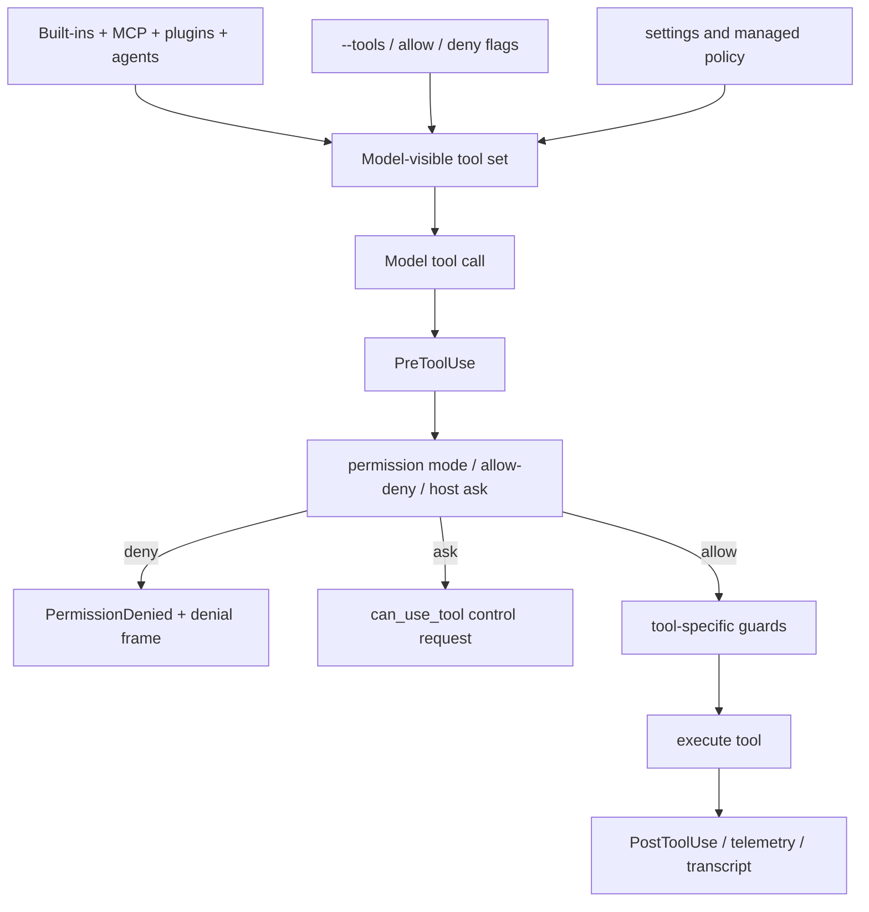

# Tool inventory and schemas

This page is the canonical inventory for Claude Code tool names, tool families, schema owners, and permission boundaries. It consolidates lists that were previously repeated across tool, prompt, session, and agent pages.

## Scope and caveats

- This page lists source-visible tool names and schema-owning surfaces for the analyzed bundle.
- It does not duplicate every minified JSON Schema descriptor. Built-in descriptors are bundled in `cli.renamed.js`; MCP tools expose runtime `inputJSONSchema` through MCP; plugins contribute schemas through manifests.
- Tool visibility and tool execution are separate: a tool can be model-visible and still be denied by permissions, hooks, host control requests, or tool-specific guards.

## Source anchors

| Semantic alias | String or symbol | Meaning |
| --- | --- | --- |
| BashToolName | `var Rq="Bash"` | Shell-command tool name. |
| ReadToolName | `var Bq="Read"` | File-read tool name. |
| GlobToolName | `var B1="Glob"` | File-pattern search tool name. |
| GrepToolName | `var V9="Grep"` | Content-search tool name. |
| EditToolName | `var v7="Edit"` | File-edit tool name and nearby edit-family schemas. |
| WriteToolName | `var $9="Write"` | File-write tool name. |
| WebFetchToolName | `var gD="WebFetch"` | URL fetch tool name. |
| WebSearchToolName | `var RI="WebSearch"` | Web search tool name. |
| TodoWriteToolName | `var HV="TodoWrite"` | Todo list tool name. |
| SkillToolName | `var XX="Skill"` | Skill-loading tool name. |
| BashDescriptor | `LK({name:Rq,...})` | `Bash` descriptor with prompt, permission matcher, and read-only classifier. |
| ReadDescriptor | `LK({name:Bq,... get inputSchema(){return T15()}})` | `Read` descriptor with input/output schema accessors. |
| GrepDescriptor | `LK({name:V9,...})` | `Grep` descriptor with regex-search schema and read-only behavior. |
| GlobDescriptor | `LK({name:B1,...})` | `Glob` descriptor with file-pattern schema and read-only behavior. |
| EditDescriptor | `LK({name:v7,...})` | `Edit` descriptor with edit schema, storage stripping, and edit guards. |
| WriteDescriptor | `LK({name:$9,...})` | `Write` descriptor with file-write schema and permission dialog metadata. |
| WebFetchDescriptor | `LK({name:gD,... shouldDefer:!0})` | `WebFetch` descriptor and deferred web-fetch behavior. |
| WebSearchDescriptor | `LK({name:RI,...})` | `WebSearch` descriptor with provider gating. |
| TodoWriteDescriptor | `LK({name:HV,...})` | `TodoWrite` descriptor with allow-only checklist update path. |
| SkillDescriptor | `LK({name:XX,...})` | `Skill` descriptor with skill-name validation and forked execution output. |
| McpToolsListSchema | `tools/list` | MCP tool-list protocol schema. |
| ToolExecutionBoundary | `function U85` | Main tool execution/permission boundary. |
| PreToolUsePermissionHook | `hookPermissionResult`, `PreToolUse` | `PreToolUse` hook can allow, ask, deny, defer, or update input. |

## Built-in tool families

| Family | Source-visible names | Model-visible capability | Main guard or owner |
|---|---|---|---|
| Shell/process | `Bash`, `BashOutput`-style task output aliases | Run commands, monitor background command/task output, stop long-running work. | Permission rules, sandbox policy, shell execution path. |
| File read/search | `Read`, `Glob`, `Grep` | Read files, expand patterns, and search content. | File permissions, ignore rules, `denyRead`-style exclusions. |
| File write/edit | `Edit`, `Write`, `MultiEdit`, `NotebookEdit` | Modify files and notebooks. | Read-before-write/edit checks and modified-after-read checks. |
| Web | `WebFetch`, `WebSearch` | Fetch URL/domain content or perform web search. | Domain/search permission validation and provider/tool support gates. |
| Planning/todos | `TodoWrite`, `ExitPlanMode` | Track plan state and exit plan mode. | Plan-mode state and prompt/context rules. |
| Skills and agents | `Skill`, `TaskCreate`, `TaskGet`, `TaskList`, `TaskUpdate`, `SendMessage` | Load skills and dispatch/observe task or subagent work. | Agent/task runtime, subagent hooks, task state registry. |

## Schema ownership

| Tool source | How schemas are supplied | Permission behavior |
|---|---|---|
| Built-in tools | Bundled descriptors in `cli.renamed.js` near the tool definitions. This page summarizes fields by family rather than copying every minified descriptor. | Enters the same `ToolExecutionBoundary`. |
| MCP tools | MCP `tools/list` responses include names and `inputJSONSchema`; `tools/call` executes through the MCP client. | Permission-prompt routing requires a schema-bearing MCP tool; MCP calls still pass guarded runtime boundaries. |
| Plugin-provided tools/capabilities | Plugin manifests can contribute hooks, MCP servers, skills, agents, output styles, and related capability surfaces. | Plugin-provided capabilities compose with settings, trust, hooks, and permission policy. |
| Agent/task tools | Task/subagent tool constants are runtime tools exposed to the model or agent controller. | Task lifecycle hooks and task-state updates apply in addition to normal tool permission checks. |

## Descriptor and execution-body map

The built-in tools are exposed through bundled descriptors created by `LK(...)`. Each descriptor owns the model-facing name, prompt text, input/output schema accessors, activity summaries, visibility gates, and permission helpers for that tool family. The full execution body is still bundled/minified, but the descriptor anchors identify where a focused per-tool deep dive should start.

| Tool family | Descriptor anchors | Runtime behavior confirmed from descriptor cluster | Remaining deep-dive boundary |
|---|---|---|---|
| Shell/process | `Bash` at line ~5147, `ToolExecutionBoundary` at line ~4202 | Shell calls enter the shared permission boundary, can classify read-only commands, and prepare a permission matcher before execution. | Full shell spawning, background process bookkeeping, and sandbox handoff belong in [Built-in tools and permissions](built-in-tools-and-permissions.md) and [Sandbox and isolation](sandbox-and-isolation.md). |
| File read/search | `Read` at line ~4956, `Glob` at line ~3104, `Grep` at line ~3095 | Read/search descriptors provide schema accessors, read-only/concurrency-safe markers, result limits, and search summaries. | Per-tool parsing of ranges, glob expansion, ignore handling, and truncation should be documented tool-by-tool only when needed. |
| File mutation | `Edit` at line ~5005, `Write` at line ~3226 | Mutation descriptors expose input/output schema accessors and pair with freshness guards such as `File has not been read yet...` and `File content has changed...`. | Exact patch/write algorithms and notebook edit shapes remain a candidate companion reference if schema dumps are required. |
| Web | `WebFetch` at line ~3438, `WebSearch` at line ~3628 | Web tools are deferred and guarded; `WebSearch` has provider-support gates and wildcard validation. | Provider-specific fetch/search transport is separate from tool-name/schema inventory. |
| Planning and automation | `TodoWrite` at line ~2621, `Skill` at line ~3172, task tool constants at line ~1091 | Todo writes are allowed checklist state updates; skills validate an invocation name and can return direct or forked execution results. | Full task/subagent scheduling belongs in [Agents, tasks, and subagents](../06-agents-automation/agents-tasks-and-subagents.md). |

### Built-in schema extraction status

This page now records the descriptor owners for the major built-in tool schemas. It still intentionally avoids copying every minified `y.object(...)` / schema descriptor into the docs. A complete per-tool schema dump would need a dedicated extractor or focused manual reconstruction from each descriptor's `inputSchema` and `outputSchema` accessors. Until that exists, the safe documentation boundary is:

1. list stable tool names and descriptor anchors here;
2. document permission and execution behavior in implementation pages;
3. document MCP runtime schemas through MCP `tools/list` / `inputJSONSchema` rather than treating plugin/MCP schemas as built-ins.

## Input-surface summary

| Family | Representative input shape | Notes |
|---|---|---|
| Shell/process | Command text, optional background/task identifiers, sandbox-related settings. | Approved command execution can still be constrained by platform sandboxing. |
| File read/search | Path, glob/search pattern, context/range options. | Search/read behavior can honor ignore and deny rules. |
| File write/edit | Path plus content or edit patches; notebook tools include cell-level targets. | Edit/write tools enforce prior-read freshness before mutation. |
| Web | URL/domain or search query. | `WebFetch(domain:example.com)` is the permission form; `WebSearch` wildcard permissions are rejected. |
| Planning/todos | Todo/task entries and status transitions. | These shape plan visibility rather than external side effects. |
| Skill/agent/task | Skill IDs, prompts, agent specs, task IDs, messages, and task updates. | Subagent/task records can emit task frames and sidechain transcripts. |

## Visibility, approval, and execution

High-signal guard strings include:

- `WebSearch does not support wildcards`
- `WebFetch permissions use domain format, not URLs`
- `File has not been read yet. Read it first before writing to it.`
- `File content has changed since it was last read.`

## Reference handoffs

| Need | Read |
|---|---|
| Permission boundary details and `ToolExecutionBoundary` flow | [Built-in tools and permissions](built-in-tools-and-permissions.md) |
| Command sandbox after approval | [Sandbox and isolation](sandbox-and-isolation.md) |
| MCP runtime and plugin loading | [MCP, plugins, and hooks](mcp-plugins-hooks.md) |
| Hook/event names and frame families | [Hooks and events reference](hooks-and-events-reference.md) |
| Settings/policy keys that shape tools | [Settings schema reference](settings-schema-reference.md) |
| Task/subagent tool behavior | [Agents, tasks, and subagents](../06-agents-automation/agents-tasks-and-subagents.md) |

## Related docs

- [Tool runtime, events, and integration flows](tool-runtime-events-and-integrations.md)
- [Built-in tools and permissions](built-in-tools-and-permissions.md)
- [MCP, plugins, and hooks](mcp-plugins-hooks.md)
- [Hooks and events reference](hooks-and-events-reference.md)
- [Settings schema reference](settings-schema-reference.md)