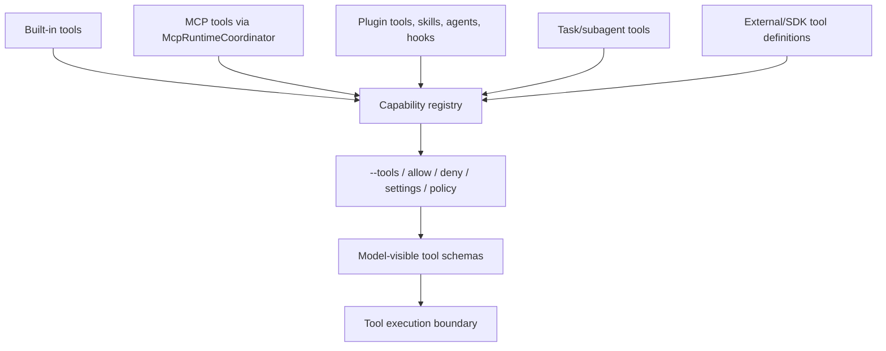
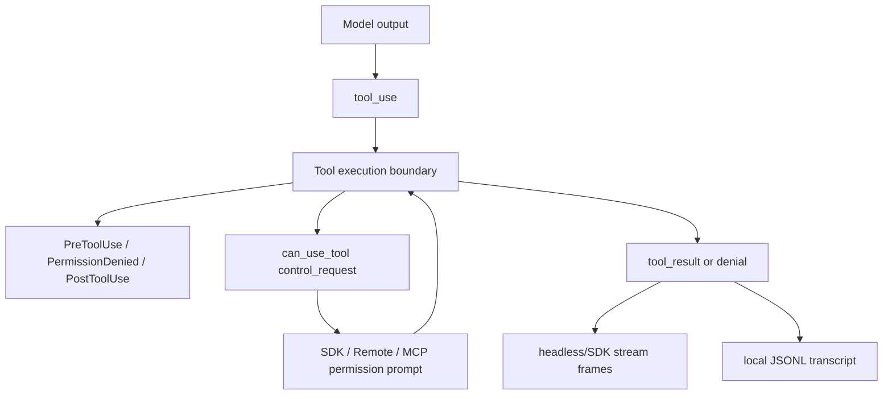
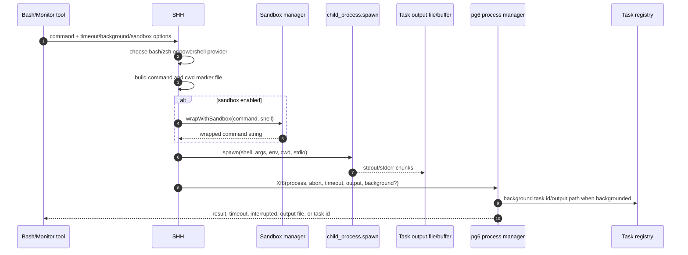
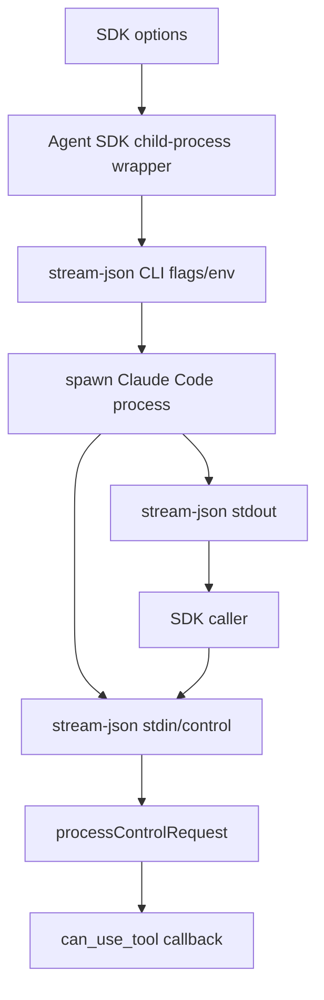
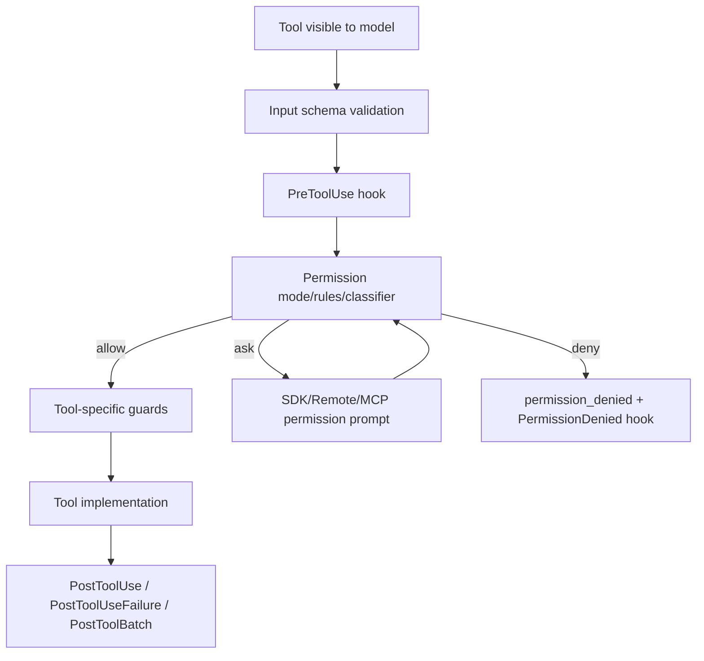
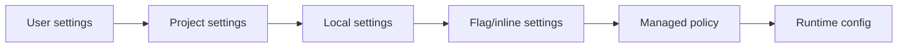
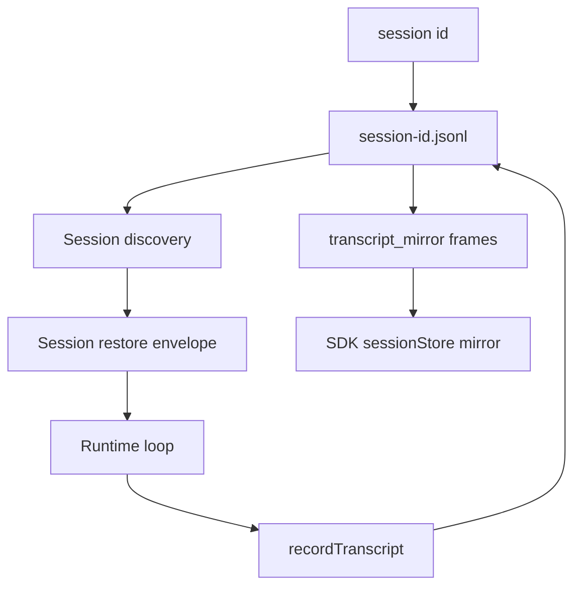

# Tool runtime, events, and integration flows

This page answers the cross-cutting `cli.renamed.js` questions that span the tool catalog, event handling, communication, shell execution, plugins, SDK support, LSP diagnostics, web tools, permission control, hooks, context exclusion, settings, and persistence.

It is intentionally an integration map: deeper single-topic pages still own the long-form details for [built-in tools and permissions](built-in-tools-and-permissions.md), [sandbox and isolation](sandbox-and-isolation.md), [MCP/plugins/hooks](mcp-plugins-hooks.md), [settings and policy](settings-policy-and-integrations.md), and [sessions/persistence](../04-sessions-persistence-remote/session-resume-and-transcripts.md).

For canonical tables, use [Tool inventory and schemas](tool-inventory-and-schemas.md), [Hooks and events reference](hooks-and-events-reference.md), and [Settings schema reference](settings-schema-reference.md). This page stays as the cross-cutting synthesis map.

## Source anchors

| Semantic alias | String or symbol | Meaning |
| --- | --- | --- |
| BashToolConstant | `var Rq="Bash"` | Shell-command tool constant. |
| ReadToolConstant | `var Bq="Read"` | File read tool constant. |
| EditToolConstant | `var v7="Edit"` | File edit tool constant. |
| WriteToolConstant | `var $9="Write"` | File write tool constant. |
| WebFetchToolConstant | `var gD="WebFetch"` | WebFetch tool constant. |
| WebSearchToolConstant | `var RI="WebSearch"` | WebSearch tool constant. |
| KillShellCompatibilityAlias | `KillShell:"TaskStop"` | Compatibility alias from `KillShell` to `TaskStop`. |
| BashOutputCompatibilityAlias | `BashOutputTool:"TaskOutput"` | Compatibility alias from Bash output to task output. |
| ToolExecutionBoundary | `function U85` | Main tool execution/permission boundary. |
| PreToolUseAuthorization | `hookPermissionResult`, `PreToolUse` | Hook output participates in authorization. |
| CanUseToolBridge | `createCanUseTool` | SDK/Remote Control permission bridge wrapper. |
| SdkControlRequestHandler | `processControlRequest` / `can_use_tool` | SDK stdio control request handler for permission asks. |
| PermissionDeniedFrame | `permission_denied` | Stream/system frame for deny-shortcut decisions. |
| ControlRequestFrame | `control_request` | Stream/control frame family for host-driven decisions. |
| SessionStateFrame | `session_state_changed` | Headless/SDK session-state frame. |
| BridgeStateFrame | `bridge_state` | Remote/bridge state frame. |
| ShellExecutionPath | `async function SHH` | Shell execution path: build command, sandbox, spawn, capture output. |
| ShellProcessManager | `class pg6` | Shell process result/background manager. |
| TaskStopIdentifierBridge | `shell_id`, `task_id` | `TaskStop` accepts `task_id`; `shell_id` is deprecated. |
| BackgroundTaskPersistence | `persistent`, `timeout_ms`, `TaskStop` | Monitor/background task persistence model. |
| WebFetchPreflight | `async function getURLMarkdownContent` | WebFetch fetch/cache/preflight implementation. |
| WebFetchApplyPrompt | `async function applyPromptToMarkdown` | WebFetch post-fetch model prompt over fetched content. |
| ServerSideWebSearchTool | `web_search_20250305` | Provider/server-side web-search tool type. |
| WebSearchWildcardGuard | `WebSearch does not support wildcards` | WebSearch permission-pattern validation. |
| WebFetchDomainGuard | `WebFetch permissions use domain format` | WebFetch permission-pattern validation. |
| McpRuntimeCoordinator | `function fH9` | MCP runtime coordinator. |
| PluginCommandRegistrar | `function fC4` | Plugin command family. |
| PluginLspServerSchema | `lspServers` | Plugin manifest schema for LSP server configuration. |
| LspDiagnosticsNotification | `textDocument/publishDiagnostics` | Passive LSP diagnostics notification handler. |
| AgentSdkChildProcessWrapper | `wF6=class wF6` | Agent SDK child-process wrapper. |
| HeadlessRunner | `async function runHeadless` | Headless runner entry. |
| HeadlessStreamMultiplexer | `function runHeadlessStreamingForTesting` | Headless/SDK stream multiplexer. |
| DynamicSectionExclusion | `excludeDynamicSections` | Dynamic system-prompt section exclusion during context accounting. |
| ClaudeMdExcludeSetting | `claudeMdExcludes` | Excludes User/Project/Local memory files; managed memory is not excluded. |
| GitignoreRespectSetting | `respectGitignore` | File-index context discovery can respect gitignore. |
| IgnoreFileDiscovery | `.ignore`, `.rgignore` | Additional ignore-pattern inputs for file suggestions/indexing. |
| SandboxDenyReadSetting | `denyRead` | Sandbox/filesystem read exclusion setting. |
| AddDirectoryFlag | `--add-dir <directories...>` | Adds additional workspace/tool-access directories. |
| SettingsPrecedenceRule | `Settings precedence is user < project < local < flag < policy` | Settings merge precedence. |
| SettingsInjectionFlag | `--settings <file-or-json>` | Runtime settings injection flag. |
| NoSessionPersistenceFlag | `--no-session-persistence` | Disables local session persistence. |
| SessionJsonlFilename | `${v$()}.jsonl` | Current-session JSONL transcript filename. |
| TranscriptRecorder | `recordTranscript` | Transcript write function family. |
| SdkSessionStoreAdapter | `sessionStore` | SDK external session-store adapter surface. |
| LatestSessionDiscovery | `async function loadConversationForResume` | Resume/latest-session discovery. |
| RestoredSessionApplier | `async function OG8` | Restored-session state application. |

## One-page answer map

| Question | Source-confirmed answer |
|---|---|
| Which tools exist? | Built-ins include shell, file read/search/edit/write, web, todo/plan, skill, task/subagent, output/stop aliases, and MCP/plugin-provided tools. |
| What is the event mechanism? | In-process events are normal JS calls/stores; externalized events are hook events, headless stream frames, control requests, bridge frames, telemetry, and JSONL transcript entries. |
| How is communication handled? | Different boundaries use different protocols: MCP JSON-RPC, provider HTTP/SSE, SDK stdio stream-JSON, Remote/IDE/Chrome bridge JSON frames, local JSONL persistence, and direct JS calls inside the bundle. |
| How does shell execution work? | `SHH` chooses a shell provider, wraps with sandbox when enabled, spawns a child process, captures output through a task-output file/buffer, and `pg6` manages timeout/background/kill/result state. |
| How are plugins/extensions supported? | `PluginCommandRegistrar` exposes plugin commands; plugin manifests can contribute agents, skills, hooks, MCP servers, output styles, monitors, settings, and `lspServers`. MCP runtime wiring is coordinated by `McpRuntimeCoordinator`. |
| How is SDK supported? | `AgentSdkChildProcessWrapper` spawns the CLI in `stream-json` mode, translates SDK options to CLI flags/env, writes/reads JSON frames, and handles `can_use_tool` control requests through stdio. |
| Is there LSP syntax support? | Yes, but the source-confirmed path is LSP server configuration plus passive diagnostics (`publishDiagnostics`) and file sync; this is diagnostics/syntax-error support, not proof of full editor refactoring features. |
| Is there WebSearch/WebFetch? | Yes. WebFetch is local HTTP fetch + conversion + optional model prompt; WebSearch is provider/server-side `web_search_20250305` invoked through a model call. |
| How is permission control done? | Tool visibility flags/settings feed `ToolExecutionBoundary`, which applies schema validation, `PreToolUse`, permission mode/rules, SDK/host `can_use_tool`, denial frames, and tool-specific guards. |
| How do hooks work? | Hook schemas define lifecycle events. `PreToolUse` can affect authorization and input; `PostToolUse`/`PostToolUseFailure`/`PostToolBatch` observe outcomes; compaction/session/task hooks cover broader lifecycle. |
| How is context exclusion done? | Multiple mechanisms: dynamic prompt-section exclusion, `claudeMdExcludes`, gitignore/ignore-file filtering for file context, sandbox/file `denyRead`, and explicit add-dir root expansion. |
| How are settings implemented? | Settings are layered user/project/local/flag/policy config with managed policy controls and CLI injection via `--settings`, `--managed-settings`, and `--setting-sources`. |
| What is persistence? | Local sessions are JSONL transcript files keyed by session ID; resume uses `SessionDiscovery`/`SessionRestore`; headless/SDK mirrors transcript frames; SDK `sessionStore` can mirror local writes externally. |

## Tool catalog and capability assembly

The tool set is assembled from several sources, then filtered before the model sees it.

Confirmed built-in families:

| Family | Representative names | Notes |
|---|---|---|
| Shell/process | `Bash`, `TaskStop`, `TaskOutput`, `BashOutputTool`, `KillShell` | `KillShell` and `BashOutputTool` are compatibility aliases around task stop/output semantics. |
| File read/search | `Read`, `Glob`, `Grep`, `LS` | File visibility can also be shaped by ignore files, gitignore, add-dir, permissions, and sandbox policy. |
| File write/edit | `Edit`, `Write`, `MultiEdit`, `NotebookEdit` | Subject to read-before-write and modified-after-read guards. |
| Web | `WebFetch`, `WebSearch` | Separate local-fetch and provider/server-search paths. |
| Planning/context | `TodoWrite`, `ExitPlanMode`, `Skill` | Planning and skill dispatch participate in the same tool visibility plane. |
| Agents/tasks | `TaskCreate`, `TaskGet`, `TaskList`, `TaskUpdate`, `SendMessage` | Task/subagent coordination is tool/state/event mediated. |
| External capabilities | MCP tools, plugin skills/agents/hooks/LSP, SDK tools | External sources still pass through the common permission boundary. |

The important architectural point is that “available tool” is not the same as “executed action.” A tool can be registered, filtered out, denied by policy, denied or mutated by hooks, routed to a host permission request, blocked by a tool-specific guard, or finally executed.

## Events and communication

`cli.renamed.js` does not use one universal event bus. It uses boundary-specific mechanisms.

| Boundary | Mechanism | Evidence |
|---|---|---|
| In-process runtime | JS calls, async stores, React/TUI state, queues, telemetry helpers | Most logical module boundaries stay inside the bundled process. |
| Hook scripts | Named hook events and structured hook input/output | `PreToolUse`, `PostToolUse`, `PostToolBatch`, `PermissionDenied`, `UserPromptExpansion`, `SessionStart`, `SessionEnd`, `PreCompact`, `PostCompact`, task/subagent hooks. |
| Tool permission host | Control frames | `control_request`, `can_use_tool`, `permission_denied`, `permission_response`. |
| Headless/SDK stream | Stream-JSON frames | `HeadlessControlLoop` emits system/user/assistant/result/control/rate-limit/session/bridge/transcript frames. |
| MCP | JSON-RPC-shaped protocol | `initialize`, `tools/list`, `tools/call`, `resources/list`, `prompts/get`, task methods. |
| Provider/model API | HTTP(S), SSE/event-stream, provider headers | `[API REQUEST]`, `text/event-stream`, `x-client-request-id` in the provider path. |
| Remote/IDE/Chrome bridge | JSON envelopes over persistent transports | `bridge_state`, permission request/response, pairing, tool-call/result frames. |
| Persistence | Append-only transcript/event records | `${sessionId}.jsonl`, `recordTranscript`, `transcript_mirror`. |

For the protocol-family overview, see [Runtime communication protocols](../00-start-here/runtime-communication-protocols.md).

## Shell command execution

The shell path is source-confirmed around `async function SHH`.

Key mechanics:

1. **Shell provider selection.** The runtime honors `CLAUDE_CODE_SHELL` when it points to a valid bash/zsh path, otherwise probes `$SHELL`, `zsh`, and `bash`. PowerShell has a separate provider.
2. **Command wrapping.** `SHH` builds a provider-specific command string and a cwd marker file so it can detect whether a command changed the working directory.
3. **Sandbox handoff.** When sandboxing is active, `SHH` calls `c6.wrapWithSandbox(...)` before spawning. The sandbox decision is still permission-mediated; see [Sandbox and isolation](sandbox-and-isolation.md).
4. **Spawn environment.** The spawned process receives a controlled env including `CLAUDECODE=1`, `AI_AGENT`, `CLAUDE_CODE_SESSION_ID`, optional `TRACEPARENT`, shell overrides, session env vars, and tool-provided extra env.
5. **Output capture.** A task-output object records stdout/stderr. Large or background outputs spill to disk and can be read via task output/file paths.
6. **Timeout/background manager.** `pg6` owns process exit/error/timeout, kills with `SIGKILL`, marks `backgroundTaskId`, and reports timeout text such as `Command timed out after ...`.
7. **Task stop.** `TaskStop` stops background shell/monitor/agent tasks by `task_id`; `shell_id` remains as a deprecated compatibility input.

### Persistent does not mean a reusable interactive shell

There are two separate concepts that are easy to conflate:

| Concept | Source-confirmed behavior |
|---|---|
| Normal Bash calls | Spawn a command through `SHH`; state is persisted through cwd/session/task outputs, not by keeping one interactive shell process for every call. |
| Background/persistent tasks | `run_in_background`, `Monitor`, and `persistent: true` keep a task or monitor alive until timeout, session end, or `TaskStop`. |

The internal user-initiated shell command schema also states that a direct shell command path has “no persistent shell state across calls,” so persistent shell semantics should be described as task lifetime, not as an always-reused REPL shell.

## Plugins, MCP, extensions, and LSP

### Plugins and extension points

Plugins are the main extension packaging surface. The `plugin` / `plugins` command family is anchored by `PluginCommandRegistrar`, and plugin manifests can contribute multiple runtime components:

| Plugin component | Runtime effect |
|---|---|
| `agents` | Adds custom/background/subagent definitions. |
| `skills` and commands | Adds skill and slash-command automation surfaces. |
| `hooks` | Adds lifecycle hook scripts. |
| `mcpServers` | Adds MCP capability providers. |
| `outputStyles`, `themes`, `settings` | Changes prompt/style/settings surfaces. |
| `monitors` | Arms persistent background monitor tasks. |
| `lspServers` | Adds language-server configurations for diagnostics. |

MCP is the runtime protocol side of extension. `McpRuntimeCoordinator` connects regular, always-load, and claude.ai connector configs; MCP protocol schemas include `tools/list`, `tools/call`, `resources/list`, and `prompts/get`. MCP tools become model-visible capabilities only after connection and still pass through `ToolExecutionBoundary`.

### LSP support

The source-confirmed LSP path is diagnostics-oriented:

1. Plugins/settings can declare `lspServers` as a path, keyed record, or array of inline/path configs.
2. The LSP manager initializes server processes and tracks file-to-server associations.
3. The manager sends file lifecycle notifications such as `textDocument/didSave` and `textDocument/didClose`.
4. It registers a passive `textDocument/publishDiagnostics` handler.
5. Diagnostics are converted from URI/range/severity/source/code into internal diagnostic records and registered for async delivery.
6. Stale diagnostics can be dropped when a diagnostic version is older than the current document version.

This is enough to answer “is there LSP syntax support?” as **yes for language-server diagnostics / syntax-error reporting**. The anchors do not prove a full editor feature set such as semantic rename, hover, code actions, or workspace edits as Claude Code user-facing tools in this build.

## SDK support

The Agent SDK path wraps Claude Code as a child process rather than importing the whole runtime as a normal library call.

Important SDK mechanics:

- `AgentSdkChildProcessWrapper` maps SDK options into CLI flags such as `--output-format stream-json`, `--input-format stream-json`, `--model`, `--max-turns`, `--max-budget-usd`, `--permission-mode`, `--allowedTools`, `--disallowedTools`, `--tools`, `--mcp-config`, and `--strict-mcp-config`.
- When the SDK supplies a `canUseTool` callback, the wrapper selects `--permission-prompt-tool stdio`; the child then emits `can_use_tool` control requests over stdio.
- `processControlRequest` handles `can_use_tool` requests, calls the SDK callback with suggestions, blocked path, and decision reason context, then replies with a `control_response`.
- `sessionStore` is an SDK storage adapter surface. The source explicitly requires local transcript writes to exist so they can be mirrored; `persistSession: false` is incompatible with `sessionStore`.
- `enableFileCheckpointing` is rejected with `sessionStore` in this build because backup blobs are not mirrored, so rewind would be unsafe after store-backed resume.

## WebFetch and WebSearch

`WebFetch` and `WebSearch` are separate implementations.

### WebFetch

`FN6` implements the local fetch path:

1. Validates the URL.
2. Upgrades `http:` to `https:` where possible.
3. Performs a domain preflight against `https://api.anthropic.com/api/web/domain_info?domain=...` unless skipped by runtime settings.
4. Fetches with `Accept: text/markdown, text/html, */*` and a Claude Code user agent.
5. Handles redirects with a same-domain/same-protocol/same-port policy and a redirect cap.
6. Treats egress-proxy allowlist failures as structured `EGRESS_BLOCKED` errors.
7. Caps content length and converts HTML to Markdown via a bundled turndown path.
8. Persists binary/image-like content to a file when possible.
9. Caches fetch results by URL with TTL/size limits.
10. `QN6` can then run a model prompt over the fetched content using `web_fetch_apply` as the query source.

Permission syntax is domain-oriented: `WebFetch(domain:example.com)`, not raw URL allow rules.

### WebSearch

`WebSearch` is implemented through provider/server-side tool use:

1. The tool schema accepts `query`, optional `allowed_domains`, and optional `blocked_domains`.
2. Input validation rejects missing queries and simultaneous allow+block domain lists.
3. `VH5` builds a server-side tool descriptor with type `web_search_20250305`, name `web_search`, domain filters, and `max_uses: 8`.
4. The runtime runs a model request with a web-search system prompt and the server-side search tool.
5. `vH5` extracts `server_tool_use` and `web_search_tool_result` blocks into a model-facing result shape.
6. `isEnabled()` gates availability by provider/model family.

Permission syntax rejects wildcard search permissions (`WebSearch does not support wildcards`).

## Permission control and hooks

The permission pipeline is a layered trust path:

Key behaviors:

- `PreToolUse` is pre-execution and can allow, ask, deny, defer, add context, or supply `updatedInput`.
- The deny shortcut emits `permission_denied` frames so SDK/remote hosts can render a denial even when no prompt is shown.
- Ask-style decisions emit `can_use_tool` control requests and wait for a host response.
- `PermissionDenied` hooks can produce retry guidance that is fed back to the model.
- `PostToolUse`, `PostToolUseFailure`, and `PostToolBatch` run after execution/result aggregation.
- Tool-specific guards still apply after permission approval, e.g. read-before-edit and WebFetch/WebSearch permission syntax.

## Context exclusion

“Context exclusion” is not one switch. The bundle has several exclusion layers with different scopes.

| Layer | Source surface | What it excludes |
|---|---|---|
| Dynamic system prompt sections | `--exclude-dynamic-system-prompt-sections`, `excludeDynamicSections` | Per-machine/per-session sections from the system prompt/accounting path. |
| Memory file excludes | `claudeMdExcludes` | User, Project, and Local `CLAUDE.md` / `.claude/rules` paths. Managed/policy memory is explicitly not excluded. |
| File-index ignores | `respectGitignore`, `.ignore`, `.rgignore`, git `ls-files` / ripgrep fallback | Candidate project files for suggestions/context discovery. |
| Filesystem/sandbox policy | `denyRead`, `allowRead`, `allowWrite`, `denyWrite` | Runtime process/file access for sandboxed commands and tool paths. |
| Workspace root expansion | `--add-dir`, `additionalDirectories` | Adds more allowed roots; exclusion/permission logic then applies across the enlarged root set. |

This distinction matters. Excluding a `CLAUDE.md` file from memory loading does not necessarily hide a file from `Read`; ignoring a path in file suggestions does not necessarily sandbox-deny a shell process; adding a directory expands the candidate roots but does not automatically authorize every write.

## Settings implementation

Settings are layered configuration objects with explicit precedence:

Confirmed surfaces include:

| Surface | Role |
|---|---|
| `~/.claude/settings.json`, `.claude/settings.json`, `.claude/settings.local.json` | Persistent user/project/local overlays. |
| `--settings <file-or-json>` | Adds a settings file or inline JSON for the current session. |
| `--managed-settings` / managed policy schema | Enterprise/policy controls with highest precedence. |
| `--setting-sources` | Restricts which setting sources participate. |
| `enabledPlugins`, `extraKnownMarketplaces`, `blockedMarketplaces`, `strictKnownMarketplaces` | Plugin trust/marketplace policy. |
| `disableAllHooks`, `disableRemoteControl`, `disableSkillShellExecution`, `disableAgentView` | Managed switches that disable extension/runtime surfaces. |
| `cleanupPeriodDays`, `autoCompactEnabled`, `fileCheckpointingEnabled` | Persistence/context/file-history runtime behavior. |

Settings are not only preferences. They shape tool availability, plugin/MCP loading, hooks, context sources, sandbox policy, remote control, retention, model behavior, and integration defaults.

## Persistence mechanism

Persistence is session-centered.

Source-confirmed components:

| Component | Behavior |
|---|---|
| Local JSONL | Sessions write append-only transcript/event lines to `${sessionId}.jsonl` under the project/config session root. |
| `recordTranscript` family | Records messages, tool events, sidechain/subagent entries, metadata, context-collapse commits, file-history snapshots, and aliases. |
| `SessionDiscovery` | Resolves latest or explicit sessions and loads transcript/message state. |
| `SessionRestore` | Applies restored state: session id, permission mode, model, agent metadata, bridge/worktree metadata, deferred tools, context-collapse state. |
| `--no-session-persistence` | Disables transcript writes and therefore future local resume for that run. |
| `cleanupPeriodDays` | Retention window for persisted transcripts. |
| `transcript_mirror` | Headless/SDK frame mirroring transcript writes to consumers. |
| `sessionStore` | SDK adapter that mirrors local writes externally; it requires local persistence and currently cannot combine with file checkpointing. |
| `session_state_changed` | Live state frame for hosts/automation watching running/requires-action/completed states. |

The practical model is: **local JSONL is the canonical durable layer; SDK/remote/session-store features mirror or project it rather than replacing the local session spine**.

## Tool-result rendering registry

Every tool definition supplies its own renderer set on the same object that ships its `name`, `inputSchema`, and `call` — there is no centralized registry. The shared shape carries up to five callbacks:

- `renderToolUseMessage(input, { verbose })` — the header banner shown while the tool is running (and again above its result).
- `renderToolUseProgressMessage(data, ctx)` — intermediate output for streaming tools.
- `renderToolUseRejectedMessage(input, ctx)` — displayed when permission is denied.
- `renderToolUseErrorMessage(error, { verbose })` — displayed when `call` throws.
- `renderToolResultMessage(data, toolUseId, { verbose })` — the success render.

The permission/loop dispatcher at [cli.renamed.js line 419964](../../claude-code-pkg/src/entrypoints/cli.renamed.js#L419964) guards every render with `if (!A || !A.renderToolUseRejectedMessage)` and falls back to a generic message; the same pattern is repeated for the other four callbacks. Concrete tools therefore opt in per surface:

| Tool group | Anchor | Renderer style |
|---|---|---|
| MCP `ListMcpResources` | [line 252785](../../claude-code-pkg/src/entrypoints/cli.renamed.js#L252785) | `renderToolUseMessage` returns a one-line `"List MCP resources from server X"`; `renderToolResultMessage` shows pretty-printed JSON inside `<zm>` with the `verbose` flag forwarded for truncation. |
| Read / Bash file tools | [line 323786](../../claude-code-pkg/src/entrypoints/cli.renamed.js#L323786) | `renderToolUseMessage_2(H)` renders compact path + size header. |
| Glob / Grep | [lines 406403, 406851](../../claude-code-pkg/src/entrypoints/cli.renamed.js#L406403) | `renderToolUseMessage_3/_4({ pattern, path }, { verbose })` show the pattern and the search root. |
| `WebFetch` family | [line 403846](../../claude-code-pkg/src/entrypoints/cli.renamed.js#L403846) | `renderToolUseProgressMessage_8(content, { verbose, theme, tools, style })` builds an `Ink` `<QvH>` element with `timeoutMs` so the in-progress component can show elapsed/total time. |
| Permission rejection | [line 421584](../../claude-code-pkg/src/entrypoints/cli.renamed.js#L421584) | `renderToolUseRejectedMessage(input, ctx)` exists as `_1` ... `_5` variants per tool, customizing the explanation per surface (Edit/MultiEdit/Write get diffs of the rejected change). |

Because renderers are co-located with `call`, adding a new tool requires no UI registry edits — the loop discovers the renderer via the tool object's own properties. The fallback at `if (!A.renderToolUseRejectedMessage)` is what guarantees the TUI never crashes when a tool ships without one.

## Residual caveats

- The bundle is minified; semantic names in this page are explanatory aliases, not stable public APIs.
- LSP support is documented only as far as diagnostics/file-sync anchors confirm. Treat hover/rename/code-actions as unconfirmed until separately anchored.
- WebSearch behavior depends on provider/model availability gates.
- Plugin marketplace install/update internals are only summarized here; full marketplace flow remains a separate future deep dive.

## Related docs

- [Tool inventory and schemas](tool-inventory-and-schemas.md)
- [Hooks and events reference](hooks-and-events-reference.md)
- [Settings schema reference](settings-schema-reference.md)
- [Built-in tools and permissions](built-in-tools-and-permissions.md)
- [Sandbox and isolation](sandbox-and-isolation.md)
- [MCP, plugins, and hooks](mcp-plugins-hooks.md)
- [Settings, policy, and integrations](settings-policy-and-integrations.md)
- [Runtime communication protocols](../00-start-here/runtime-communication-protocols.md)
- [Session resume and transcripts](../04-sessions-persistence-remote/session-resume-and-transcripts.md)
- [Agents, tasks, and subagents](../06-agents-automation/agents-tasks-and-subagents.md)